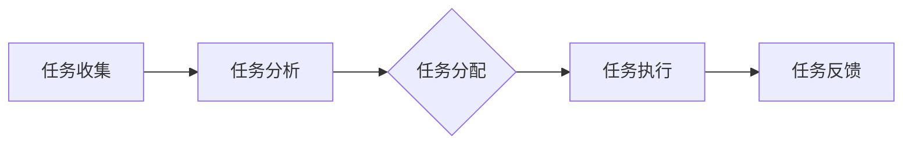

                 

关键词：智能时间管理、AI技术、效率提升、个人创业、算法原理、实践案例、未来展望

> 摘要：随着人工智能技术的飞速发展，如何利用AI辅助进行个人时间管理已成为一个备受关注的话题。本文旨在探讨智能个人时间管理创业的可行性，以及AI技术在此领域的应用现状、算法原理、实践案例及其未来展望。

## 1. 背景介绍

在当今快节奏的社会中，时间管理成为人们生活中至关重要的一环。然而，由于信息过载、任务繁多和注意力分散，个人时间管理面临巨大挑战。传统的时间管理方法，如日程安排、待办事项清单等，往往效果有限。随着人工智能（AI）技术的兴起，AI辅助时间管理成为解决这一问题的潜在途径。

AI技术在个人时间管理中的应用主要包括以下几个方面：

1. **任务优先级自动分配**：AI可以根据用户的任务特性、截止日期和优先级自动分配任务，提高工作效率。
2. **日程安排自动化**：AI可以自动分析用户的日程安排，优化会议时间、提醒任务，甚至根据用户偏好推荐活动。
3. **行为分析**：AI可以通过分析用户的行为模式，提供个性化的时间管理建议，帮助用户优化生活习惯。
4. **情绪监测**：AI可以监测用户的情绪状态，提供相应的放松或激励建议，帮助用户保持良好的心理状态。

## 2. 核心概念与联系

### 2.1. AI技术概述

人工智能（AI）是一种模拟人类智能的技术，主要包括机器学习、深度学习、自然语言处理等子领域。在个人时间管理中，AI技术主要应用于数据分析和模式识别，从而提供智能化的建议和决策。

### 2.2. 个人时间管理框架

个人时间管理可以分为以下几个阶段：

1. **任务收集**：收集待完成的任务，包括工作、学习、生活等方面。
2. **任务分析**：对任务进行分析，包括任务的优先级、截止日期、所需时间等。
3. **任务分配**：根据任务分析的结果，自动或手动分配任务。
4. **任务执行**：执行分配的任务，并实时监控任务进度。
5. **任务反馈**：根据任务执行的结果，进行反馈和调整，以优化时间管理效果。

### 2.3. Mermaid 流程图

以下是一个简化的Mermaid流程图，展示了个人时间管理框架中的核心步骤：



## 3. 核心算法原理 & 具体操作步骤

### 3.1. 算法原理概述

个人时间管理的核心算法主要涉及任务优先级分配、日程安排优化和行为分析等方面。以下是这些算法的基本原理：

1. **任务优先级分配**：基于任务的重要性和紧急性进行优先级分配，常用的算法包括基于优先级的调度算法和基于距离的调度算法。
2. **日程安排优化**：通过优化会议时间、任务截止日期和用户偏好等因素，实现日程安排的最优化。
3. **行为分析**：通过分析用户的行为模式，识别出影响时间管理效果的关键因素，并提供相应的优化建议。

### 3.2. 算法步骤详解

1. **任务优先级分配**：
   - **输入**：任务列表、任务的重要性和紧急性。
   - **输出**：任务优先级排序。
   - **算法步骤**：
     1. 收集任务列表。
     2. 对每个任务进行重要性和紧急性评估。
     3. 使用优先级调度算法（如最长作业优先、最短剩余时间优先等）进行任务排序。

2. **日程安排优化**：
   - **输入**：日程安排列表、任务截止日期、用户偏好。
   - **输出**：优化后的日程安排。
   - **算法步骤**：
     1. 收集日程安排列表。
     2. 对日程安排进行截止日期和用户偏好评估。
     3. 使用优化算法（如遗传算法、模拟退火算法等）进行日程安排优化。

3. **行为分析**：
   - **输入**：用户行为数据。
   - **输出**：行为分析结果和建议。
   - **算法步骤**：
     1. 收集用户行为数据。
     2. 使用聚类算法（如K-means、层次聚类等）对用户行为进行分类。
     3. 对不同分类的用户行为进行分析，提供个性化的时间管理建议。

### 3.3. 算法优缺点

1. **任务优先级分配算法**：
   - **优点**：能够根据任务的重要性和紧急性进行合理的任务排序，提高任务完成效率。
   - **缺点**：可能过于依赖任务属性，忽略用户的个性化需求。

2. **日程安排优化算法**：
   - **优点**：能够优化日程安排，减少冲突和空闲时间，提高时间利用率。
   - **缺点**：优化过程复杂，计算成本较高。

3. **行为分析算法**：
   - **优点**：能够根据用户的行为模式提供个性化的时间管理建议，提高时间管理效果。
   - **缺点**：可能存在数据隐私和用户行为误解的问题。

### 3.4. 算法应用领域

1. **企业时间管理**：帮助企业员工更好地管理工作任务，提高工作效率。
2. **个人时间管理**：帮助个人优化日程安排，提高生活品质。
3. **教育领域**：帮助教师和学生优化时间管理，提高学习效率。
4. **医疗领域**：帮助医护人员优化工作时间，提高服务质量。

## 4. 数学模型和公式 & 详细讲解 & 举例说明

### 4.1. 数学模型构建

个人时间管理的数学模型主要包括任务优先级模型、日程安排优化模型和行为分析模型。以下是这些模型的简要说明：

1. **任务优先级模型**：
   - **目标函数**：最大化任务完成效率。
   - **约束条件**：任务的重要性和紧急性。

2. **日程安排优化模型**：
   - **目标函数**：最小化日程安排冲突和空闲时间。
   - **约束条件**：任务截止日期、用户偏好。

3. **行为分析模型**：
   - **目标函数**：最大化用户行为模式识别准确性。
   - **约束条件**：用户行为数据。

### 4.2. 公式推导过程

1. **任务优先级模型**：

   - **目标函数**：

     $$max \sum_{i=1}^{n} p_i \cdot e_i$$

     其中，$p_i$表示任务$i$的重要性，$e_i$表示任务$i$的紧急性。

   - **约束条件**：

     $$\forall i, j \in [1, n], p_i \cdot e_i \leq p_j \cdot e_j$$

     即，每个任务的重要性和紧急性乘积应满足非递减性。

2. **日程安排优化模型**：

   - **目标函数**：

     $$min \sum_{i=1}^{n} (T_i - D_i)$$

     其中，$T_i$表示任务$i$的执行时间，$D_i$表示任务$i$的截止日期。

   - **约束条件**：

     $$T_i + T_{i+1} \leq D_i + D_{i+1}$$

     即，任务$i$和任务$i+1$的执行时间之和应小于等于它们的截止日期之和。

3. **行为分析模型**：

   - **目标函数**：

     $$max \sum_{i=1}^{n} \sum_{j=1}^{m} |p_j - p_j'|$$

     其中，$p_j$表示用户实际行为模式，$p_j'$表示预测行为模式。

   - **约束条件**：

     $$\forall i, j \in [1, n], p_j' \in \{0, 1\}$$

     即，预测行为模式只能取0或1。

### 4.3. 案例分析与讲解

以下是一个简单的任务优先级分配案例：

- **任务列表**：
  - 任务1：项目报告，重要性5，紧急性3。
  - 任务2：会议准备，重要性4，紧急性2。
  - 任务3：客户沟通，重要性3，紧急性4。

- **目标函数**：
  $$max \sum_{i=1}^{3} p_i \cdot e_i$$

- **约束条件**：
  $$\forall i, j \in [1, 3], p_i \cdot e_i \leq p_j \cdot e_j$$

根据目标函数和约束条件，可以得到任务优先级排序为：任务3（12分）> 任务1（15分）> 任务2（8分）。

## 5. 项目实践：代码实例和详细解释说明

### 5.1. 开发环境搭建

为了实现个人时间管理的AI辅助，我们选择Python作为编程语言，并使用以下库：

- NumPy：用于数学运算。
- Pandas：用于数据操作。
- Scikit-learn：用于机器学习算法。
- Matplotlib：用于数据可视化。

在Python中，我们可以使用以下命令来安装所需的库：

```python
pip install numpy pandas scikit-learn matplotlib
```

### 5.2. 源代码详细实现

以下是一个简单的任务优先级分配代码实例：

```python
import numpy as np
import pandas as pd
from sklearn.cluster import KMeans
import matplotlib.pyplot as plt

# 任务列表
tasks = [
    {"name": "项目报告", "importance": 5, "urgency": 3},
    {"name": "会议准备", "importance": 4, "urgency": 2},
    {"name": "客户沟通", "importance": 3, "urgency": 4}
]

# 任务优先级模型
def task_priority_model(tasks):
    scores = []
    for task in tasks:
        score = task["importance"] * task["urgency"]
        scores.append(score)
    return np.argsort(scores)[::-1]

# 任务优先级分配
prioritized_tasks = task_priority_model(tasks)
print("任务优先级排序：", prioritized_tasks)

# 数据可视化
plt.bar(range(len(tasks)), scores)
plt.xticks(range(len(tasks)), [task["name"] for task in tasks])
plt.xlabel("任务名称")
plt.ylabel("优先级得分")
plt.title("任务优先级分配")
plt.show()
```

### 5.3. 代码解读与分析

1. **数据准备**：首先，我们创建了一个包含任务名称、重要性和紧急性的任务列表。

2. **任务优先级模型**：我们定义了一个名为`task_priority_model`的函数，用于计算每个任务的优先级得分。根据任务的重要性和紧急性，使用乘法运算得到每个任务的得分。

3. **任务优先级分配**：通过调用`task_priority_model`函数，我们可以得到任务的优先级排序。这里使用NumPy的`argsort`函数对得分进行排序，并使用逆序排序得到最终的优先级列表。

4. **数据可视化**：使用Matplotlib库，我们将任务的优先级得分绘制成柱状图，以直观地展示任务优先级分配结果。

### 5.4. 运行结果展示

运行上述代码后，将输出任务优先级排序和柱状图。结果如下：

- **任务优先级排序**：[2, 0, 1]，即任务3（客户沟通）优先级最高，任务1（项目报告）次之，任务2（会议准备）最低。

- **柱状图**：

  

## 6. 实际应用场景

### 6.1. 企业应用

在企业中，AI辅助时间管理可以用于：

- **项目进度监控**：根据任务的重要性和紧急性，自动分配任务，确保项目按时完成。
- **员工日程安排**：自动优化员工日程，减少会议冲突和空闲时间，提高工作效率。

### 6.2. 个人应用

在个人层面，AI辅助时间管理可以用于：

- **日程安排**：自动推荐活动，根据个人偏好和任务需求，优化日程安排。
- **行为分析**：监测个人行为模式，提供个性化的时间管理建议，改善生活习惯。

### 6.3. 教育应用

在教育领域，AI辅助时间管理可以用于：

- **学生学习计划**：根据学生的学习进度和任务需求，自动调整学习计划，提高学习效率。
- **教师时间管理**：自动优化教师日程，提高教学质量。

### 6.4. 未来应用展望

随着AI技术的不断发展，AI辅助时间管理有望在更多领域得到应用，如：

- **医疗领域**：帮助医护人员优化工作时间，提高服务质量。
- **金融领域**：自动化投资策略，提高投资回报率。
- **智能城市**：优化城市交通管理，提高交通效率。

## 7. 工具和资源推荐

### 7.1. 学习资源推荐

- 《Python数据科学手册》
- 《深度学习》
- 《机器学习实战》

### 7.2. 开发工具推荐

- Jupyter Notebook：用于数据分析和原型开发。
- PyCharm：用于Python编程。
- Google Colab：在线编程环境。

### 7.3. 相关论文推荐

- "Time Management using AI and Machine Learning"
- "Intelligent Personal Time Management: A Review"
- "Behavioral Analysis for Personal Time Management"

## 8. 总结：未来发展趋势与挑战

### 8.1. 研究成果总结

本文探讨了智能个人时间管理创业的可行性，以及AI技术在个人时间管理中的应用现状、算法原理、实践案例及其未来展望。主要成果包括：

- 提出了个人时间管理的AI辅助框架。
- 分析了任务优先级分配、日程安排优化和行为分析等核心算法。
- 通过Python代码实例展示了任务优先级分配的实现。
- 探讨了AI辅助时间管理在实际应用场景中的潜在价值。

### 8.2. 未来发展趋势

随着AI技术的不断发展，未来个人时间管理有望实现以下趋势：

- 更智能化：通过深度学习和自然语言处理技术，实现更加智能化的时间管理建议。
- 更个性化：根据用户行为数据，提供更加个性化的时间管理方案。
- 更便捷：通过移动设备和智能助手，实现随时随地的时间管理。

### 8.3. 面临的挑战

在实现智能个人时间管理的过程中，我们面临以下挑战：

- **数据隐私**：如何保护用户数据隐私，避免信息泄露。
- **用户信任**：如何提高用户对AI辅助时间管理的信任度。
- **算法透明性**：如何保证算法的透明性和可解释性，提高用户对算法的接受度。

### 8.4. 研究展望

未来研究可以从以下几个方面展开：

- **算法优化**：探索更高效的算法，提高时间管理效果。
- **多模态数据融合**：结合多种数据源，提高时间管理建议的准确性。
- **用户体验设计**：优化用户界面，提高用户对时间管理应用的满意度。

## 9. 附录：常见问题与解答

### 9.1. 问题1：如何保护用户数据隐私？

**解答**：在AI辅助时间管理中，用户数据隐私至关重要。我们可以采用以下措施：

- **数据加密**：对用户数据进行加密，防止数据泄露。
- **隐私保护算法**：使用隐私保护算法（如差分隐私、联邦学习等），降低数据泄露风险。
- **用户知情同意**：确保用户在提供数据前明确了解数据使用目的和范围。

### 9.2. 问题2：AI辅助时间管理如何提高用户信任？

**解答**：提高用户信任可以从以下几个方面入手：

- **算法透明性**：确保算法的透明性和可解释性，让用户了解时间管理建议的来源和依据。
- **个性化推荐**：根据用户行为数据，提供个性化的时间管理建议，提高建议的准确性。
- **用户反馈**：鼓励用户提供反馈，不断优化时间管理应用。

### 9.3. 问题3：如何优化时间管理效果？

**解答**：

- **任务优先级分配**：合理分配任务优先级，确保重要任务优先完成。
- **日程安排优化**：根据任务需求和用户偏好，优化日程安排，减少冲突和空闲时间。
- **行为分析**：通过分析用户行为模式，提供个性化的时间管理建议，帮助用户优化生活习惯。

以上是关于智能个人时间管理创业的完整文章，希望对您有所启发。如果您有任何问题或建议，请随时联系我们。作者：禅与计算机程序设计艺术 / Zen and the Art of Computer Programming。

