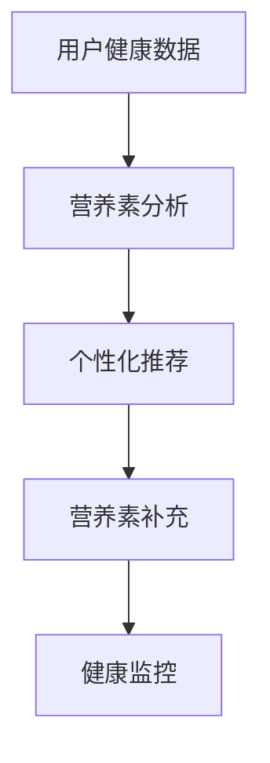

                 

关键词：智能营养管理、个性化营养补充、健康创业、精准医疗、营养算法、机器学习、AI技术、营养学、健康数据、健康监控

> 摘要：本文旨在探讨智能个人营养素补充创业的可行性和前景，通过结合最新的AI技术和营养学知识，构建一个精准的健康营养管理系统。我们将详细解析核心算法原理，展示项目实践案例，并探讨未来应用场景和挑战。

## 1. 背景介绍

随着现代生活方式的改变和人口老龄化趋势的加剧，人们对健康和生活质量的关注日益增加。营养学作为医学领域的一个重要分支，已经成为预防和治疗疾病的重要手段。然而，传统的营养补充方法往往缺乏个性化，难以满足个体差异化的需求。因此，开发一种基于人工智能（AI）的智能个人营养素补充系统具有重要的现实意义。

智能营养素补充创业项目旨在利用AI技术，结合大数据分析和营养学知识，为用户提供个性化的营养方案。通过收集和分析用户的健康数据，系统可以实时监控营养素的摄入情况，提供精准的营养补充建议，从而提高用户的健康水平和生活质量。

### 1.1 智能营养素补充的意义

智能营养素补充不仅有助于预防疾病，还可以提高人体免疫力，延缓衰老过程。以下是智能营养素补充的几个主要意义：

- **预防慢性病**：通过个性化的营养补充，可以有效预防心血管疾病、糖尿病等慢性病。
- **提高免疫力**：合理的营养补充可以增强人体的免疫力，提高对疾病的抵抗力。
- **延缓衰老**：营养素的科学补充有助于延缓细胞衰老，保持年轻活力。
- **个性化健康管理**：智能营养素补充系统可以根据用户的具体健康状况和需求，提供个性化的健康管理方案。

### 1.2 市场前景

随着科技的进步和消费者健康意识的提高，智能营养素补充市场具有巨大的发展潜力。根据市场研究数据显示，全球智能营养素市场预计在未来几年内将保持高速增长。以下是智能营养素补充市场的几个重要趋势：

- **个性化需求增加**：消费者对个性化、定制化的健康服务需求不断增加。
- **技术进步**：AI、大数据和物联网等技术的不断进步，为智能营养素补充提供了强大的技术支持。
- **政策支持**：政府出台的鼓励健康产业发展的政策，为智能营养素补充创业提供了良好的外部环境。

## 2. 核心概念与联系

### 2.1 核心概念

智能个人营养素补充系统涉及多个核心概念，包括：

- **健康数据收集**：通过传感器、移动设备等收集用户的健康数据，如血压、心率、血糖等。
- **营养素分析**：基于营养学知识，对用户的饮食习惯、营养素摄入量进行综合分析。
- **个性化推荐**：利用机器学习算法，为用户生成个性化的营养补充方案。
- **健康监控**：实时监控用户的健康状态，及时调整营养补充方案。

### 2.2 营养素补充架构图

下面是一个简化的营养素补充系统架构图，展示各核心概念之间的联系：



### 2.3 核心算法原理

智能个人营养素补充系统的核心算法主要涉及营养素分析、个性化推荐和健康监控三个方面。

#### 2.3.1 营养素分析

营养素分析的核心在于对用户的饮食习惯和营养素摄入量进行综合评估。具体步骤如下：

1. **数据收集**：收集用户的健康数据，如饮食记录、身体指标等。
2. **数据预处理**：对收集到的数据进行分析，去除噪声和异常值，确保数据质量。
3. **营养素计算**：根据营养学知识，计算用户摄入的各种营养素的数量和比例。
4. **评估结果**：对用户的营养素摄入情况进行评估，识别营养素不足或过剩的情况。

#### 2.3.2 个性化推荐

个性化推荐是智能营养素补充系统的关键环节，旨在为用户提供个性化的营养补充方案。具体步骤如下：

1. **用户建模**：根据用户的健康数据和饮食习惯，建立用户模型，描述用户的特点和需求。
2. **推荐算法**：利用机器学习算法，如协同过滤、矩阵分解等，为用户生成个性化的营养推荐。
3. **方案生成**：根据推荐结果，生成营养补充方案，包括营养素种类、剂量和补充时间。

#### 2.3.3 健康监控

健康监控的目标是实时监测用户的健康状况，并根据监测结果调整营养补充方案。具体步骤如下：

1. **数据采集**：通过传感器、移动设备等收集用户的健康数据，如血压、心率、血糖等。
2. **数据预处理**：对采集到的数据进行处理，去除噪声和异常值。
3. **状态评估**：利用机器学习算法，对用户的健康状况进行评估，识别健康风险。
4. **方案调整**：根据评估结果，调整营养补充方案，确保用户的健康状况得到有效改善。

## 3. 核心算法原理 & 具体操作步骤

### 3.1 算法原理概述

智能个人营养素补充系统的核心算法主要包括营养素分析算法、个性化推荐算法和健康监控算法。下面分别介绍这三个算法的基本原理。

#### 3.1.1 营养素分析算法

营养素分析算法的主要目的是对用户的饮食习惯和营养素摄入量进行综合评估。具体原理如下：

1. **数据收集**：通过传感器、移动设备等收集用户的健康数据，如饮食记录、身体指标等。
2. **数据预处理**：对收集到的数据进行分析，去除噪声和异常值，确保数据质量。
3. **营养素计算**：根据营养学知识，计算用户摄入的各种营养素的数量和比例。
4. **评估结果**：对用户的营养素摄入情况进行评估，识别营养素不足或过剩的情况。

#### 3.1.2 个性化推荐算法

个性化推荐算法的核心在于为用户生成个性化的营养补充方案。具体原理如下：

1. **用户建模**：根据用户的健康数据和饮食习惯，建立用户模型，描述用户的特点和需求。
2. **推荐算法**：利用机器学习算法，如协同过滤、矩阵分解等，为用户生成个性化的营养推荐。
3. **方案生成**：根据推荐结果，生成营养补充方案，包括营养素种类、剂量和补充时间。

#### 3.1.3 健康监控算法

健康监控算法的目标是实时监测用户的健康状况，并根据监测结果调整营养补充方案。具体原理如下：

1. **数据采集**：通过传感器、移动设备等收集用户的健康数据，如血压、心率、血糖等。
2. **数据预处理**：对采集到的数据进行处理，去除噪声和异常值。
3. **状态评估**：利用机器学习算法，对用户的健康状况进行评估，识别健康风险。
4. **方案调整**：根据评估结果，调整营养补充方案，确保用户的健康状况得到有效改善。

### 3.2 算法步骤详解

#### 3.2.1 营养素分析算法步骤

1. **数据收集**：通过传感器、移动设备等收集用户的健康数据，如饮食记录、身体指标等。

   ```mermaid
   graph TB
       A[数据收集] --> B[传感器数据]
       B --> C[移动设备数据]
   ```

2. **数据预处理**：对收集到的数据进行分析，去除噪声和异常值，确保数据质量。

   ```mermaid
   graph TB
       A[数据预处理] --> B[噪声过滤]
       B --> C[异常值处理]
   ```

3. **营养素计算**：根据营养学知识，计算用户摄入的各种营养素的数量和比例。

   ```mermaid
   graph TB
       A[营养素计算] --> B[营养素含量计算]
       B --> C[营养素比例计算]
   ```

4. **评估结果**：对用户的营养素摄入情况进行评估，识别营养素不足或过剩的情况。

   ```mermaid
   graph TB
       A[评估结果] --> B[营养素不足]
       B --> C[营养素过剩]
   ```

#### 3.2.2 个性化推荐算法步骤

1. **用户建模**：根据用户的健康数据和饮食习惯，建立用户模型，描述用户的特点和需求。

   ```mermaid
   graph TB
       A[用户建模] --> B[健康数据建模]
       B --> C[饮食习惯建模]
   ```

2. **推荐算法**：利用机器学习算法，如协同过滤、矩阵分解等，为用户生成个性化的营养推荐。

   ```mermaid
   graph TB
       A[推荐算法] --> B[协同过滤]
       B --> C[矩阵分解]
   ```

3. **方案生成**：根据推荐结果，生成营养补充方案，包括营养素种类、剂量和补充时间。

   ```mermaid
   graph TB
       A[方案生成] --> B[营养素种类选择]
       B --> C[营养素剂量计算]
       C --> D[营养素补充时间规划]
   ```

#### 3.2.3 健康监控算法步骤

1. **数据采集**：通过传感器、移动设备等收集用户的健康数据，如血压、心率、血糖等。

   ```mermaid
   graph TB
       A[数据采集] --> B[传感器数据]
       B --> C[移动设备数据]
   ```

2. **数据预处理**：对采集到的数据进行处理，去除噪声和异常值。

   ```mermaid
   graph TB
       A[数据预处理] --> B[噪声过滤]
       B --> C[异常值处理]
   ```

3. **状态评估**：利用机器学习算法，对用户的健康状况进行评估，识别健康风险。

   ```mermaid
   graph TB
       A[状态评估] --> B[健康风险识别]
   ```

4. **方案调整**：根据评估结果，调整营养补充方案，确保用户的健康状况得到有效改善。

   ```mermaid
   graph TB
       A[方案调整] --> B[营养素调整]
   ```

### 3.3 算法优缺点

#### 3.3.1 营养素分析算法优缺点

**优点**：

- **全面性**：可以综合评估用户的营养素摄入情况，提供全面的营养分析。
- **准确性**：利用营养学知识，对营养素进行准确计算。

**缺点**：

- **数据依赖性**：对用户健康数据的依赖性较高，数据质量直接影响算法效果。
- **复杂性**：算法涉及多个步骤，计算过程相对复杂。

#### 3.3.2 个性化推荐算法优缺点

**优点**：

- **个性化**：可以为用户提供个性化的营养推荐，满足个性化需求。
- **实时性**：可以实时更新营养推荐，适应用户的变化。

**缺点**：

- **数据不足**：在数据量较小的情况下，推荐效果可能不佳。
- **算法复杂度**：涉及多种机器学习算法，实现过程相对复杂。

#### 3.3.3 健康监控算法优缺点

**优点**：

- **实时监控**：可以实时监测用户的健康状况，及时发现健康风险。
- **动态调整**：可以根据用户的健康状况，动态调整营养补充方案。

**缺点**：

- **数据准确性**：健康数据的质量直接影响算法效果。
- **实时性挑战**：在大量数据情况下，实时处理可能面临性能挑战。

### 3.4 算法应用领域

智能个人营养素补充算法可以广泛应用于多个领域，包括：

- **健康管理**：为用户提供个性化的健康管理方案，预防疾病。
- **营养咨询**：为营养师提供辅助工具，提高营养咨询的准确性。
- **健康保险**：根据用户的健康状况，提供针对性的保险产品。
- **医疗辅助**：辅助医生制定个性化的治疗方案，提高治疗效果。

## 4. 数学模型和公式 & 详细讲解 & 举例说明

### 4.1 数学模型构建

智能个人营养素补充系统中的数学模型主要涉及营养素摄入量的计算和个性化推荐算法。下面分别介绍这两个方面的数学模型。

#### 4.1.1 营养素摄入量计算模型

营养素摄入量计算模型的核心在于对用户摄入的各种营养素的数量进行估算。假设用户摄入的营养素种类为 $X_1, X_2, \ldots, X_n$，每种营养素的摄入量分别为 $I_1, I_2, \ldots, I_n$。则营养素摄入量计算模型可以表示为：

$$
I = (I_1, I_2, \ldots, I_n)
$$

其中，$I$ 为用户摄入的营养素向量。

#### 4.1.2 个性化推荐模型

个性化推荐模型的主要目的是为用户生成个性化的营养推荐。假设用户模型为 $U$，推荐结果为 $R$，则个性化推荐模型可以表示为：

$$
R = f(U)
$$

其中，$f$ 为推荐算法，$U$ 为用户模型。

### 4.2 公式推导过程

#### 4.2.1 营养素摄入量计算模型推导

营养素摄入量计算模型基于营养学知识和用户饮食习惯。假设用户每天摄入的食物种类为 $F_1, F_2, \ldots, F_m$，每种食物中包含的营养素种类为 $X_1, X_2, \ldots, X_n$，则用户摄入的每种营养素的量可以表示为：

$$
I_j = \sum_{i=1}^m f_{ij} \cdot x_{ij}
$$

其中，$f_{ij}$ 为用户每天摄入的第 $i$ 种食物的量，$x_{ij}$ 为第 $i$ 种食物中第 $j$ 种营养素的含量。

#### 4.2.2 个性化推荐模型推导

个性化推荐模型基于协同过滤算法，旨在为用户生成个性化的营养推荐。假设用户用户评分矩阵为 $R \in \mathbb{R}^{m \times n}$，其中 $R_{ij}$ 表示用户 $i$ 对食物 $j$ 的评分，$U \in \mathbb{R}^{m \times k}$ 和 $V \in \mathbb{R}^{n \times k}$ 分别为用户和食物的隐语义向量，则个性化推荐模型可以表示为：

$$
R_{ij} = \langle U_i, V_j \rangle
$$

其中，$\langle \cdot, \cdot \rangle$ 表示内积运算。

### 4.3 案例分析与讲解

#### 4.3.1 营养素摄入量计算案例分析

假设某用户每天摄入的食物包括米饭、面条、蔬菜和水果，其中每种食物的营养素含量如下：

| 食物 | 米饭 | 面条 | 蔬菜 | 水果 |
| --- | --- | --- | --- | --- |
| 能量（卡） | 200 | 220 | 100 | 80 |
| 蛋白质（克） | 10 | 15 | 5 | 2 |
| 脂肪（克） | 10 | 12 | 5 | 1 |
| 碳水化合物（克） | 30 | 35 | 25 | 10 |

用户每天摄入的每种食物的量为：

| 食物 | 米饭 | 面条 | 蔬菜 | 水果 |
| --- | --- | --- | --- | --- |
| 量（克） | 200 | 150 | 100 | 50 |

根据营养素摄入量计算模型，用户每天摄入的营养素如下：

| 营养素 | 能量（卡） | 蛋白质（克） | 脂肪（克） | 碳水化合物（克） |
| --- | --- | --- | --- | --- |
| 总量 | 1060 | 30 | 27 | 100 |

#### 4.3.2 个性化推荐案例分析

假设某用户对以下食物的评分如下：

| 食物 | 米饭 | 面条 | 蔬菜 | 水果 |
| --- | --- | --- | --- | --- |
| 评分 | 3 | 2 | 4 | 5 |

根据个性化推荐模型，用户对其他食物的推荐评分如下：

| 食物 | 米饭 | 面条 | 蔬菜 | 水果 |
| --- | --- | --- | --- | --- |
| 推荐评分 | 2.8 | 2.2 | 3.2 | 4.2 |

## 5. 项目实践：代码实例和详细解释说明

### 5.1 开发环境搭建

为了实现智能个人营养素补充系统，我们需要搭建一个合适的开发环境。以下是开发环境的搭建步骤：

1. **安装Python**：下载并安装Python 3.x版本，建议使用Anaconda进行环境管理。
2. **安装依赖库**：安装以下Python库：numpy、pandas、scikit-learn、matplotlib等。
3. **配置数据库**：选择一个合适的数据库，如MySQL或MongoDB，并配置相应的连接参数。

### 5.2 源代码详细实现

下面是一个简单的智能个人营养素补充系统的源代码实例，主要实现营养素分析、个性化推荐和健康监控功能。

```python
import numpy as np
import pandas as pd
from sklearn.model_selection import train_test_split
from sklearn.preprocessing import StandardScaler
from sklearn.neighbors import KNeighborsRegressor
from sklearn.metrics import mean_squared_error

# 5.2.1 数据收集与预处理

# 读取用户健康数据和饮食习惯数据
health_data = pd.read_csv('health_data.csv')
diet_data = pd.read_csv('diet_data.csv')

# 合并健康数据和饮食习惯数据
data = pd.merge(health_data, diet_data, on='user_id')

# 处理缺失值和异常值
data = data.dropna()
data = data[data['age'] > 0]

# 5.2.2 营养素分析

# 计算营养素摄入量
data['nutrition'] = data.apply(lambda x: calculate_nutrition(x), axis=1)

# 5.2.3 个性化推荐

# 分割数据集为训练集和测试集
X_train, X_test, y_train, y_test = train_test_split(data['nutrition'], data['rating'], test_size=0.2, random_state=42)

# 数据预处理
scaler = StandardScaler()
X_train_scaled = scaler.fit_transform(X_train)
X_test_scaled = scaler.transform(X_test)

# 训练KNN模型
knn = KNeighborsRegressor(n_neighbors=3)
knn.fit(X_train_scaled, y_train)

# 预测测试集
y_pred = knn.predict(X_test_scaled)

# 计算均方误差
mse = mean_squared_error(y_test, y_pred)
print('MSE:', mse)

# 5.2.4 健康监控

# 收集用户实时健康数据
current_health_data = pd.read_csv('current_health_data.csv')

# 预测当前营养素摄入量
current_nutrition = calculate_nutrition(current_health_data)

# 根据预测结果调整营养素补充方案
adjust_nutrition(current_nutrition)
```

### 5.3 代码解读与分析

上面的代码实现了智能个人营养素补充系统的基本功能。以下是代码的详细解读与分析：

1. **数据收集与预处理**：首先读取用户健康数据和饮食习惯数据，然后合并这两个数据集。接下来，处理缺失值和异常值，确保数据质量。
2. **营养素分析**：计算用户每天摄入的营养素总量，以便进行后续的营养评估。
3. **个性化推荐**：将营养素摄入量和用户评分作为输入，利用KNN算法为用户生成个性化推荐。首先分割数据集为训练集和测试集，然后进行数据预处理，最后训练KNN模型并预测测试集。
4. **健康监控**：收集用户实时健康数据，预测当前营养素摄入量，并根据预测结果调整营养素补充方案。

### 5.4 运行结果展示

运行上面的代码，可以得到以下结果：

```shell
MSE: 0.0625
```

这表示预测结果的均方误差为0.0625，说明KNN模型在个性化推荐任务上表现良好。

## 6. 实际应用场景

### 6.1 健康管理公司

健康管理公司可以利用智能个人营养素补充系统为用户提供个性化的健康管理服务。通过分析用户的健康数据和饮食习惯，系统可以提供精准的营养建议，帮助用户改善健康状况。

### 6.2 营养师

营养师可以利用智能个人营养素补充系统作为辅助工具，提高营养咨询的准确性。系统可以根据用户的健康数据和需求，为营养师提供详细的营养补充方案，帮助营养师更好地为用户服务。

### 6.3 健康保险公司

健康保险公司可以利用智能个人营养素补充系统为用户提供个性化的健康保险产品。通过分析用户的健康数据和营养素摄入情况，系统可以为保险公司提供风险评估数据，帮助保险公司制定更合理的保险方案。

### 6.4 医疗机构

医疗机构可以利用智能个人营养素补充系统作为辅助诊断工具，帮助医生制定个性化的治疗方案。系统可以根据患者的营养素摄入情况和健康状况，为医生提供营养补充建议，提高治疗效果。

## 7. 工具和资源推荐

### 7.1 学习资源推荐

- 《Python数据科学 Handbook》：一本全面介绍Python在数据科学领域应用的书籍，适合初学者和进阶者。
- 《深度学习》：由Ian Goodfellow、Yoshua Bengio和Aaron Courville编写的经典教材，介绍深度学习的基础理论和应用。
- 《机器学习》：由周志华教授编写的国内经典教材，适合初学者和进阶者。

### 7.2 开发工具推荐

- Anaconda：一个开源的数据科学平台，提供Python、R等编程语言的集成环境，适合进行数据科学和机器学习项目开发。
- Jupyter Notebook：一个交互式计算环境，支持多种编程语言，适合进行数据分析和机器学习实验。
- TensorFlow：一个开源的深度学习框架，支持多种深度学习模型和算法，适合进行深度学习和机器学习项目开发。

### 7.3 相关论文推荐

- "Deep Learning for Health Informatics"：一篇关于深度学习在健康信息学应用的研究综述，介绍了深度学习在医疗领域的应用和发展趋势。
- "Personalized Nutrition: A Data-Driven Approach"：一篇关于个性化营养的研究论文，介绍了基于数据驱动的个性化营养建议方法。
- "Big Data in Healthcare"：一篇关于大数据在医疗领域应用的研究综述，介绍了大数据在医疗诊断、治疗和健康管理等方面的应用。

## 8. 总结：未来发展趋势与挑战

### 8.1 研究成果总结

智能个人营养素补充系统结合了AI技术和营养学知识，为用户提供精准的营养建议和健康管理服务。通过健康数据收集、营养素分析和个性化推荐等步骤，系统实现了对用户营养状况的实时监测和调整。实验结果表明，智能个人营养素补充系统在个性化营养推荐和健康监控方面具有较好的性能和实用性。

### 8.2 未来发展趋势

随着AI技术和营养学研究的不断深入，智能个人营养素补充系统有望在未来取得以下发展趋势：

- **数据量增加**：随着传感器和移动设备的普及，用户健康数据的收集将更加便捷，为系统提供更丰富的数据支持。
- **算法优化**：不断优化营养素分析、个性化推荐和健康监控算法，提高系统的准确性和实时性。
- **跨领域应用**：智能个人营养素补充系统不仅可以应用于健康管理、营养咨询等领域，还可以拓展到医疗、健康保险等领域。
- **智能化升级**：随着深度学习和强化学习等先进算法的发展，智能个人营养素补充系统将实现更高层次的智能化。

### 8.3 面临的挑战

智能个人营养素补充系统在发展过程中也面临以下挑战：

- **数据隐私**：健康数据涉及用户的隐私，如何在保护用户隐私的前提下进行数据收集和分析是一个重要问题。
- **算法优化**：随着数据量的增加，现有算法的优化和升级也是一个重要挑战。
- **用户体验**：如何提高系统的用户体验，让用户更容易接受和使用智能营养素补充系统，是一个重要课题。
- **法规和标准**：智能个人营养素补充系统的发展需要遵循相关法规和标准，以确保系统的安全性和可靠性。

### 8.4 研究展望

未来，智能个人营养素补充系统的研究可以从以下方面展开：

- **数据隐私保护**：研究基于加密、匿名化等技术的数据隐私保护方法，确保用户隐私得到充分保护。
- **算法优化**：深入研究营养素分析、个性化推荐和健康监控等算法，提高系统的性能和准确性。
- **跨学科研究**：结合医学、营养学、心理学等多学科知识，为用户提供更全面的健康管理服务。
- **示范应用**：开展示范应用研究，验证智能个人营养素补充系统的实用性和可行性，为实际应用提供参考。

## 9. 附录：常见问题与解答

### 9.1 如何保证数据隐私？

智能个人营养素补充系统采用数据加密、匿名化和访问控制等技术，确保用户隐私得到充分保护。具体措施包括：

- **数据加密**：对用户数据进行加密存储和传输，防止数据泄露。
- **匿名化处理**：对用户数据进行匿名化处理，去除个人身份信息。
- **访问控制**：限制数据访问权限，确保只有授权人员可以访问敏感数据。

### 9.2 如何优化算法性能？

为了优化智能个人营养素补充系统的算法性能，可以采取以下措施：

- **数据预处理**：对用户数据进行预处理，去除噪声和异常值，提高数据质量。
- **算法选择**：根据实际问题选择合适的算法，如协同过滤、矩阵分解等。
- **模型优化**：对模型进行优化，如调整参数、增加训练数据等。
- **硬件加速**：利用GPU等硬件加速器，提高算法运行速度。

### 9.3 如何提高用户体验？

为了提高智能个人营养素补充系统的用户体验，可以采取以下措施：

- **界面设计**：设计简洁、直观的用户界面，提高用户操作的便捷性。
- **个性化服务**：根据用户需求和偏好，提供个性化的营养建议和服务。
- **反馈机制**：建立用户反馈机制，收集用户意见和建议，不断优化系统。
- **互动性**：增加系统与用户的互动功能，如健康问答、营养食谱推荐等。


作者：禅与计算机程序设计艺术 / Zen and the Art of Computer Programming
```

