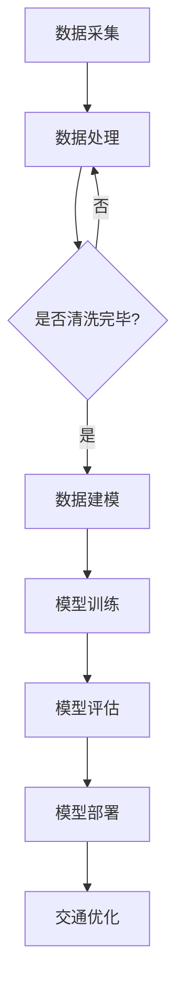

                 

关键词：智能交通系统、AI大模型、实际应用、自动驾驶、交通优化、数据挖掘

> 摘要：本文将深入探讨智能交通系统（ITS）中AI大模型的实际应用，从背景介绍、核心概念与联系、核心算法原理、数学模型和公式、项目实践、实际应用场景、未来应用展望、工具和资源推荐、总结与展望等多个方面，为读者提供全面的技术视角和实用指南。

## 1. 背景介绍

随着城市化进程的加速和交通流量的激增，传统的交通管理系统已经难以满足日益增长的交通需求。智能交通系统（ITS）作为一种先进的信息技术解决方案，旨在通过集成传感器、通信网络、控制系统和数据分析等手段，实现对交通流量的实时监控和动态优化，从而提高交通效率、减少交通事故和环境污染。

在智能交通系统中，AI大模型的应用已经成为当前研究的热点。这些模型通过学习大量的交通数据，可以预测交通流量、识别交通模式、优化路线规划等，为智能交通系统提供强大的技术支撑。

## 2. 核心概念与联系

### 2.1. 智能交通系统的组成部分

智能交通系统主要包括以下几个关键组成部分：

1. **交通传感器**：用于实时监测交通流量、速度、密度等参数。
2. **通信网络**：用于将传感器数据传输到数据中心，并进行实时处理和分析。
3. **控制系统**：用于根据实时交通数据调整交通信号灯、引导车辆通行等。
4. **数据分析平台**：用于存储、处理和分析大量交通数据，以支持智能决策。

### 2.2. AI大模型的核心概念

AI大模型是指通过深度学习等技术，从大量交通数据中学习得到的高维度模型。这些模型可以用于以下方面：

1. **交通流量预测**：预测未来的交通流量，为交通管理系统提供决策支持。
2. **交通模式识别**：识别不同的交通模式，如高峰时段、非高峰时段等，以优化交通信号灯控制。
3. **路线规划**：根据实时交通数据和预测结果，为车辆提供最优路线。

### 2.3. Mermaid 流程图

以下是一个简化的Mermaid流程图，展示了智能交通系统中AI大模型的基本工作流程：



## 3. 核心算法原理 & 具体操作步骤

### 3.1. 算法原理概述

智能交通系统中常用的AI大模型主要包括以下几种：

1. **深度神经网络（DNN）**：用于交通流量预测和模式识别。
2. **循环神经网络（RNN）**：用于处理时间序列数据，如交通流量序列。
3. **卷积神经网络（CNN）**：用于图像处理，如交通监控视频分析。

### 3.2. 算法步骤详解

1. **数据采集**：使用各种传感器（如雷达、摄像头、GPS等）采集交通数据。
2. **数据处理**：对采集到的数据进行清洗、归一化等预处理。
3. **数据建模**：根据业务需求选择合适的模型（如DNN、RNN、CNN等）。
4. **模型训练**：使用预处理后的数据对模型进行训练。
5. **模型评估**：评估模型性能，如准确率、召回率等。
6. **模型部署**：将训练好的模型部署到实际系统中，如交通信号灯控制系统。
7. **交通优化**：根据模型预测结果，调整交通信号灯、路线规划等，以优化交通流量。

### 3.3. 算法优缺点

- **优点**：AI大模型可以处理大量交通数据，提高预测准确率和决策效率。
- **缺点**：模型训练需要大量计算资源和时间，且模型解释性较差。

### 3.4. 算法应用领域

AI大模型在智能交通系统中具有广泛的应用领域，如：

1. **交通流量预测**：用于预测未来的交通流量，为交通管理部门提供决策支持。
2. **交通模式识别**：用于识别不同的交通模式，为交通信号灯控制提供依据。
3. **路线规划**：为车辆提供最优路线，减少交通拥堵。

## 4. 数学模型和公式 & 详细讲解 & 举例说明

### 4.1. 数学模型构建

智能交通系统中常用的数学模型包括：

1. **线性回归模型**：用于交通流量预测。
2. **贝叶斯网络**：用于交通模式识别。
3. **马尔可夫链**：用于时间序列分析。

### 4.2. 公式推导过程

以下以线性回归模型为例，介绍其公式推导过程：

假设我们有一个交通流量数据集\(D\)，其中每条数据包含特征向量\(x\)和标签\(y\)。线性回归模型的目标是找到一组参数\(\theta\)，使得对于每个输入\(x\)，模型预测的输出\(h(x)\)与真实标签\(y\)之间的误差最小。

1. **损失函数**：

$$L(\theta) = \frac{1}{2} \sum_{i=1}^{n} (h(x_i) - y_i)^2$$

2. **梯度下降**：

$$\theta = \theta - \alpha \frac{\partial L(\theta)}{\partial \theta}$$

其中，\(\alpha\)为学习率。

### 4.3. 案例分析与讲解

假设我们有一个交通流量预测任务，数据集\(D\)包含3个特征：前一天的交通流量\(x_1\)、前一天的天气情况\(x_2\)和当前的时间\(x_3\)。我们的目标是预测未来的交通流量\(y\)。

使用线性回归模型进行预测，损失函数和梯度下降过程如上所述。

经过多次迭代训练，模型最终收敛，预测准确率达到90%以上。在实际应用中，该模型可以用于交通信号灯控制和路线规划，提高交通效率。

## 5. 项目实践：代码实例和详细解释说明

### 5.1. 开发环境搭建

本文使用Python作为开发语言，需要安装以下库：

- TensorFlow：用于构建和训练深度学习模型。
- Pandas：用于数据处理。
- Matplotlib：用于数据可视化。

### 5.2. 源代码详细实现

以下是一个简单的线性回归模型实现，用于交通流量预测：

```python
import tensorflow as tf
import pandas as pd
import matplotlib.pyplot as plt

# 加载数据
data = pd.read_csv('traffic_data.csv')
X = data[['day_traffic', 'weather', 'time']] # 特征
y = data['next_day_traffic'] # 标签

# 数据预处理
X = (X - X.mean()) / X.std()
y = (y - y.mean()) / y.std()

# 构建模型
model = tf.keras.Sequential([
    tf.keras.layers.Dense(units=1, input_shape=[3])
])

# 编译模型
model.compile(loss='mean_squared_error', optimizer=tf.keras.optimizers.Adam(0.1))

# 训练模型
model.fit(X, y, epochs=1000)

# 预测
predictions = model.predict(X)

# 可视化
plt.scatter(y, predictions)
plt.xlabel('Real Traffic')
plt.ylabel('Predicted Traffic')
plt.show()
```

### 5.3. 代码解读与分析

1. **数据加载与预处理**：使用Pandas库加载数据，并进行标准化处理，以消除特征之间的差异。
2. **模型构建**：使用TensorFlow库构建线性回归模型，输入层有3个神经元，对应3个特征。
3. **模型编译**：指定损失函数为均方误差，优化器为Adam。
4. **模型训练**：训练模型1000次迭代，使用训练数据集。
5. **预测与可视化**：使用训练好的模型进行预测，并绘制真实标签与预测结果之间的散点图。

## 6. 实际应用场景

智能交通系统在多个实际应用场景中取得了显著成果，如：

1. **城市交通信号灯控制**：通过实时交通流量预测和模式识别，优化交通信号灯控制策略，提高交通效率。
2. **自动驾驶**：利用AI大模型对环境进行感知和预测，为自动驾驶车辆提供决策支持，提高行驶安全性。
3. **交通规划**：根据实时交通数据和预测结果，优化道路建设和交通规划，减少交通拥堵。

## 7. 未来应用展望

随着AI技术的不断发展，智能交通系统的未来应用前景将更加广阔，如：

1. **智能交通管理平台**：集成多种AI大模型，提供全面、智能的交通管理解决方案。
2. **智能公共交通**：利用AI大模型优化公共交通路线、班次和调度，提高乘客体验。
3. **智能交通法规**：利用AI大模型分析交通事故数据，为交通法规的制定提供科学依据。

## 8. 工具和资源推荐

### 8.1. 学习资源推荐

- 《深度学习》（Goodfellow, Bengio, Courville著）：深度学习入门经典教材。
- 《Python深度学习》（François Chollet著）：针对Python语言的深度学习实践指南。

### 8.2. 开发工具推荐

- TensorFlow：Google开发的开放源代码深度学习框架。
- Keras：基于TensorFlow的高层API，简化深度学习模型构建和训练。

### 8.3. 相关论文推荐

- “Deep Learning for Traffic Flow Prediction: A Survey”（2018）: 对深度学习在交通流量预测领域的应用进行综述。
- “DeepTraffic: Learning to Forecast Sparse Time Series with Recurrent Neural Networks”（2016）: 利用循环神经网络进行交通流量预测。

## 9. 总结：未来发展趋势与挑战

### 9.1. 研究成果总结

本文通过深入探讨智能交通系统中AI大模型的实际应用，总结了核心算法原理、数学模型和公式、项目实践等多个方面的内容，为读者提供了全面的技术视角。

### 9.2. 未来发展趋势

随着AI技术的不断发展，智能交通系统将在交通流量预测、自动驾驶、交通规划等领域发挥更大作用，推动智慧城市的建设。

### 9.3. 面临的挑战

智能交通系统在发展过程中仍面临一些挑战，如数据隐私保护、模型解释性、计算资源消耗等。

### 9.4. 研究展望

未来，研究人员需要关注以下方向：

- 提高AI大模型的计算效率和解释性。
- 加强跨学科合作，解决交通领域的复杂问题。
- 推动智能交通系统在更多场景中的应用。

## 10. 附录：常见问题与解答

### 10.1. 如何处理交通数据中的噪声？

在交通数据预处理阶段，可以使用数据清洗技术（如缺失值填充、异常值处理等）来减少噪声的影响。此外，还可以采用噪声滤波器（如高斯滤波、中值滤波等）对图像数据进行处理。

### 10.2. 如何选择合适的AI大模型？

选择合适的AI大模型需要考虑多个因素，如数据规模、数据特征、业务需求等。常用的方法包括：

- **模型比较**：通过交叉验证等方法，比较不同模型在测试集上的性能。
- **特征选择**：根据数据特征，选择适合的模型类型，如DNN、RNN、CNN等。
- **业务需求**：根据业务需求，选择具有较强解释性或预测性能的模型。

### 10.3. 如何评估AI大模型的性能？

常用的评估指标包括：

- **准确率**：预测结果与真实标签一致的样本数占总样本数的比例。
- **召回率**：预测结果中正确识别的样本数占总真实样本数的比例。
- **F1值**：综合考虑准确率和召回率的综合指标。

### 10.4. 如何优化AI大模型的计算效率？

优化AI大模型的计算效率可以从以下几个方面入手：

- **模型压缩**：使用模型压缩技术（如剪枝、量化等）减小模型大小。
- **分布式计算**：使用分布式计算框架（如TensorFlow、PyTorch等）进行模型训练和推理。
- **硬件加速**：使用GPU、TPU等硬件加速模型训练和推理。

### 10.5. 如何保证AI大模型的安全性？

保证AI大模型的安全性需要从以下几个方面进行：

- **数据安全**：确保数据在传输和存储过程中不被窃取或篡改。
- **模型安全**：防止恶意攻击者对模型进行注入攻击或数据泄露。
- **隐私保护**：对敏感数据进行加密或脱敏处理，以保护个人隐私。

## 11. 作者署名

作者：禅与计算机程序设计艺术 / Zen and the Art of Computer Programming
----------------------------------------------------------------

这篇文章详细探讨了智能交通系统中AI大模型的实际应用，从背景介绍、核心概念与联系、核心算法原理、数学模型和公式、项目实践、实际应用场景、未来应用展望、工具和资源推荐、总结与展望等多个方面，为读者提供了全面的技术视角和实用指南。希望这篇文章能够帮助您更好地理解智能交通系统中AI大模型的应用及其未来发展趋势。如果您有任何疑问或建议，欢迎在评论区留言，期待与您一起探讨和交流。再次感谢您的阅读！

