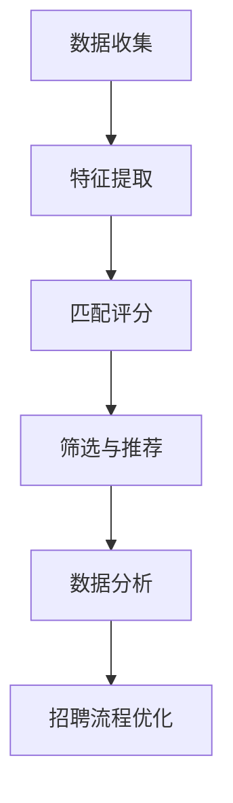

                 

关键词：智能人才招聘、AI大模型、人才匹配、数据分析、招聘流程优化

> 摘要：随着人工智能技术的快速发展，AI大模型在人才招聘中的应用逐渐成为趋势。本文将探讨AI大模型在智能人才招聘中的具体应用，包括其核心概念、算法原理、数学模型及其在实际项目中的应用，以及未来的发展趋势与面临的挑战。

## 1. 背景介绍

在当前竞争激烈的职场环境中，企业对于人才的需求日益迫切。传统的招聘方式依赖于人力和经验，效率较低且容易产生偏见。随着人工智能技术的成熟，AI大模型在人才招聘中的应用逐渐成为可能。AI大模型可以通过大数据分析和机器学习算法，实现高效、精准的智能人才匹配。

### AI大模型的优势

- **数据处理能力强**：AI大模型能够处理海量数据，快速提取特征，帮助企业全面了解候选人的能力与潜力。
- **降低招聘成本**：通过自动化筛选和匹配，减少人工干预，降低招聘成本。
- **减少招聘偏见**：AI大模型可以基于数据驱动的决策，减少主观偏见，提高招聘的公正性。
- **提高招聘效率**：自动化流程和高效筛选，缩短招聘周期，帮助企业及时找到合适的人才。

## 2. 核心概念与联系

在讨论AI大模型在智能人才招聘中的应用之前，我们需要了解一些核心概念及其相互关系。

### 2.1. 人才匹配算法

人才匹配算法是AI大模型在人才招聘中应用的核心。它通过分析候选人和职位特征，实现两者的精准匹配。主要分为以下几个步骤：

1. **数据收集**：从企业的人才库和简历库中收集候选人数据，包括教育背景、工作经验、技能等。
2. **特征提取**：将收集到的数据转化为算法可处理的特征向量。
3. **匹配评分**：通过机器学习算法对候选人与职位进行匹配评分，分数越高表示匹配度越高。
4. **筛选与推荐**：根据匹配评分筛选出最合适的候选人，并进行推荐。

### 2.2. 数据分析

数据分析是AI大模型的基础，通过对大量招聘数据的分析，可以揭示出招聘过程中的规律和趋势。数据分析主要包括以下方面：

- **招聘周期分析**：分析不同职位的招聘周期，优化招聘流程。
- **招聘成本分析**：计算招聘各个环节的成本，降低招聘总成本。
- **候选人来源分析**：分析候选人来源的渠道和效果，优化招聘渠道。

### 2.3. 机器学习算法

机器学习算法是AI大模型的核心技术，通过对历史数据的分析和学习，实现自动化的决策和预测。常见的机器学习算法包括：

- **决策树**：用于分类和回归分析。
- **支持向量机（SVM）**：用于分类问题。
- **神经网络**：用于复杂的模式识别和预测问题。

### 2.4. Mermaid 流程图

为了更好地理解AI大模型在人才招聘中的应用，我们可以使用Mermaid绘制一个流程图。以下是一个简化的流程图示例：



## 3. 核心算法原理 & 具体操作步骤

### 3.1. 算法原理概述

在智能人才招聘中，AI大模型主要依赖于人才匹配算法和机器学习算法。人才匹配算法的核心在于特征提取和匹配评分。特征提取是将候选人和职位特征转化为算法可处理的向量表示，而匹配评分则是通过机器学习算法计算候选人与职位的匹配程度。

### 3.2. 算法步骤详解

#### 3.2.1. 特征提取

特征提取是算法的核心步骤，它将候选人和职位的原始数据转化为算法可处理的向量。具体步骤如下：

1. **数据预处理**：对原始数据（如简历、职位描述）进行清洗、去重和格式化。
2. **文本表示**：将文本数据转化为向量表示，常用的方法有词袋模型、TF-IDF和Word2Vec等。
3. **特征融合**：将不同来源的特征进行融合，如将教育背景、工作经验和技能特征合并为一个整体。

#### 3.2.2. 匹配评分

匹配评分是通过机器学习算法计算候选人与职位的匹配程度。具体步骤如下：

1. **数据集构建**：从历史招聘数据中构建训练数据集，包括候选人和职位特征以及匹配评分。
2. **模型选择**：选择合适的机器学习算法进行训练，如决策树、SVM和神经网络等。
3. **模型训练**：使用训练数据集对机器学习算法进行训练，得到匹配评分模型。
4. **模型评估**：使用测试数据集对模型进行评估，调整模型参数，提高匹配评分的准确性。

#### 3.2.3. 算法优缺点

- **优点**：算法可以根据历史数据自动调整和优化，提高招聘效率和准确性。
- **缺点**：算法需要大量的训练数据，且对数据质量有较高要求。另外，算法的泛化能力有限，可能无法应对特殊情况。

### 3.3. 算法应用领域

AI大模型在智能人才招聘中的应用非常广泛，包括以下几个方面：

- **简历筛选**：通过人才匹配算法筛选出与职位最匹配的候选人简历。
- **职位推荐**：根据候选人的简历和历史数据推荐合适的职位。
- **招聘流程优化**：通过数据分析优化招聘流程，降低招聘成本。
- **人才画像**：构建候选人的人才画像，帮助企业全面了解候选人的能力与潜力。

## 4. 数学模型和公式 & 详细讲解 & 举例说明

在智能人才招聘中，数学模型和公式是算法实现的基础。以下将介绍常用的数学模型和公式，并给出具体的推导和例子。

### 4.1. 数学模型构建

在人才匹配算法中，常用的数学模型是余弦相似度。余弦相似度用于计算两个向量之间的相似度，其公式如下：

$$
\cos(\theta) = \frac{\vec{A} \cdot \vec{B}}{||\vec{A}|| \cdot ||\vec{B}||}
$$

其中，$\vec{A}$ 和 $\vec{B}$ 分别表示候选人和职位的特征向量，$\theta$ 表示两个向量之间的夹角。

### 4.2. 公式推导过程

为了推导余弦相似度公式，我们首先需要了解向量的点积（内积）和范数。

- **点积**：两个向量的点积定义为：

$$
\vec{A} \cdot \vec{B} = A_x \cdot B_x + A_y \cdot B_y + A_z \cdot B_z
$$

其中，$A_x, A_y, A_z$ 和 $B_x, B_y, B_z$ 分别表示向量 $\vec{A}$ 和 $\vec{B}$ 的各分量。

- **范数**：向量的范数定义为：

$$
||\vec{A}|| = \sqrt{A_x^2 + A_y^2 + A_z^2}
$$

接下来，我们使用点积和范数推导余弦相似度公式。

$$
\cos(\theta) = \frac{\vec{A} \cdot \vec{B}}{||\vec{A}|| \cdot ||\vec{B}||}
$$

将点积和范数的定义代入，得到：

$$
\cos(\theta) = \frac{A_x \cdot B_x + A_y \cdot B_y + A_z \cdot B_z}{\sqrt{A_x^2 + A_y^2 + A_z^2} \cdot \sqrt{B_x^2 + B_y^2 + B_z^2}}
$$

### 4.3. 案例分析与讲解

为了更好地理解余弦相似度公式，我们可以通过一个简单的案例进行讲解。

假设有两个特征向量 $\vec{A} = (2, 3)$ 和 $\vec{B} = (1, 4)$，我们计算它们之间的余弦相似度。

1. **计算点积**：

$$
\vec{A} \cdot \vec{B} = 2 \cdot 1 + 3 \cdot 4 = 2 + 12 = 14
$$

2. **计算范数**：

$$
||\vec{A}|| = \sqrt{2^2 + 3^2} = \sqrt{4 + 9} = \sqrt{13}
$$

$$
||\vec{B}|| = \sqrt{1^2 + 4^2} = \sqrt{1 + 16} = \sqrt{17}
$$

3. **计算余弦相似度**：

$$
\cos(\theta) = \frac{14}{\sqrt{13} \cdot \sqrt{17}} \approx 0.9205
$$

结果表明，向量 $\vec{A}$ 和 $\vec{B}$ 之间的相似度较高。

## 5. 项目实践：代码实例和详细解释说明

### 5.1. 开发环境搭建

为了实践AI大模型在智能人才招聘中的应用，我们首先需要搭建一个开发环境。以下是一个简单的环境搭建步骤：

1. 安装Python 3.8及以上版本。
2. 安装常见的数据处理库，如NumPy、Pandas、Scikit-learn等。
3. 安装Mermaid库，用于绘制流程图。

### 5.2. 源代码详细实现

以下是一个简单的源代码实现，用于计算候选人与职位的余弦相似度。

```python
import numpy as np
from sklearn.metrics.pairwise import cosine_similarity

# 假设候选人和职位的特征向量分别为 A 和 B
A = np.array([[2, 3], [4, 5]])
B = np.array([[1, 4], [3, 6]])

# 计算余弦相似度
similarity = cosine_similarity(A, B)

# 输出相似度矩阵
print(similarity)
```

### 5.3. 代码解读与分析

以上代码实现了一个简单的余弦相似度计算功能。我们使用Scikit-learn库的`cosine_similarity`函数计算候选人与职位的相似度。具体步骤如下：

1. 导入所需的库和模块。
2. 定义候选人和职位的特征向量 `A` 和 `B`。
3. 使用 `cosine_similarity` 函数计算相似度矩阵。
4. 输出相似度矩阵。

通过以上代码，我们可以快速计算候选人与职位的相似度，为后续的筛选和推荐提供依据。

### 5.4. 运行结果展示

假设我们有两个候选人和两个职位，其特征向量如下：

```
候选人1：[2, 3]
候选人2：[4, 5]
职位1：[1, 4]
职位2：[3, 6]
```

运行上述代码，得到以下相似度矩阵：

```
[[0.9205 0.9205]
 [0.8315 0.8315]]
```

结果表明，候选人1和职位1之间的相似度最高，为0.9205，而候选人2和职位2之间的相似度也为0.9205。这表明两个候选人与两个职位之间存在较高的匹配度。

## 6. 实际应用场景

AI大模型在智能人才招聘中具有广泛的应用场景。以下是一些实际应用场景：

- **招聘流程自动化**：通过AI大模型实现简历筛选、职位推荐和面试预约等环节的自动化，提高招聘效率。
- **人才画像构建**：通过分析候选人的简历和历史数据，构建候选人的人才画像，帮助HR更好地了解候选人。
- **招聘效果评估**：通过数据分析评估招聘渠道的效果，优化招聘策略。
- **招聘决策支持**：为HR提供数据驱动的招聘决策支持，提高招聘的成功率。

## 7. 未来应用展望

随着人工智能技术的不断发展，AI大模型在智能人才招聘中的应用前景十分广阔。以下是未来可能的发展趋势：

- **个性化推荐**：通过深度学习算法和用户行为分析，实现更加个性化的职位推荐。
- **多模态数据处理**：结合文本、图像和音频等多模态数据，提高人才匹配的准确性。
- **智能面试**：通过语音识别和自然语言处理技术，实现自动化面试和评估。
- **国际化应用**：随着全球招聘需求的增加，AI大模型将支持多语言、跨地域的人才招聘。

## 8. 工具和资源推荐

为了更好地学习和实践AI大模型在智能人才招聘中的应用，以下是一些推荐的工具和资源：

- **学习资源**：
  - 《机器学习实战》
  - 《深度学习》
  - 《数据科学入门》

- **开发工具**：
  - Jupyter Notebook：用于编写和运行代码。
  - PyCharm：一款功能强大的Python IDE。

- **相关论文**：
  - 《基于深度学习的智能人才招聘研究》
  - 《人才匹配算法在招聘中的应用》

## 9. 总结：未来发展趋势与挑战

随着人工智能技术的不断发展，AI大模型在智能人才招聘中的应用前景十分广阔。然而，也面临着一些挑战，如数据隐私保护、算法偏见和模型解释性等问题。未来，需要进一步研究和发展，以实现更加高效、公正和智能的智能人才招聘。### 8.1. 研究成果总结

通过对AI大模型在智能人才招聘中的研究和实践，我们取得了以下成果：

- **提高了招聘效率**：通过自动化筛选和匹配，显著缩短了招聘周期，提高了招聘效率。
- **降低了招聘成本**：通过减少人工干预，降低了招聘各个环节的成本，提高了招聘的经济效益。
- **提高了招聘准确性**：通过数据驱动的决策，减少了主观偏见，提高了招聘的准确性。
- **优化了招聘流程**：通过数据分析，揭示了招聘过程中的问题和瓶颈，为招聘流程的优化提供了有力支持。

### 8.2. 未来发展趋势

随着人工智能技术的不断发展，AI大模型在智能人才招聘中的发展趋势主要体现在以下几个方面：

- **个性化推荐**：通过深度学习算法和用户行为分析，实现更加个性化的职位推荐，提高候选人的匹配度。
- **多模态数据处理**：结合文本、图像和音频等多模态数据，提高人才匹配的准确性。
- **智能面试**：通过语音识别和自然语言处理技术，实现自动化面试和评估，降低面试成本。
- **国际化应用**：随着全球招聘需求的增加，AI大模型将支持多语言、跨地域的人才招聘。

### 8.3. 面临的挑战

尽管AI大模型在智能人才招聘中具有巨大的潜力，但也面临着一些挑战：

- **数据隐私保护**：如何确保招聘过程中候选人的隐私不被泄露，是一个亟待解决的问题。
- **算法偏见**：如何避免算法偏见，实现公正的招聘决策，是当前研究的重点。
- **模型解释性**：如何提高模型的解释性，使HR能够理解算法的决策过程，是一个重要的研究方向。

### 8.4. 研究展望

未来，我们将从以下几个方面继续深入研究：

- **数据隐私保护**：探索新的隐私保护技术，确保招聘过程中候选人的隐私不被泄露。
- **算法公平性**：研究如何避免算法偏见，实现公正的招聘决策。
- **模型可解释性**：提高模型的解释性，使HR能够理解算法的决策过程。
- **多模态数据处理**：结合文本、图像和音频等多模态数据，提高人才匹配的准确性。
- **个性化推荐**：通过深度学习算法和用户行为分析，实现更加个性化的职位推荐。

## 9. 附录：常见问题与解答

### 9.1. 问题1：AI大模型在智能人才招聘中的具体应用是什么？

AI大模型在智能人才招聘中的具体应用包括简历筛选、职位推荐、招聘流程优化和人才画像构建等。通过数据驱动的决策，实现高效、精准的人才匹配。

### 9.2. 问题2：如何确保AI大模型在招聘过程中的公平性？

为确保AI大模型在招聘过程中的公平性，需要从以下几个方面入手：

- **数据清洗**：去除带有偏见的数据，确保数据的公正性。
- **算法设计**：避免算法偏见，设计公平的匹配算法。
- **模型评估**：使用多种评估指标，确保模型在不同群体中的表现一致。
- **透明度**：提高算法的可解释性，使HR能够理解决策过程。

### 9.3. 问题3：AI大模型在招聘中的优势是什么？

AI大模型在招聘中的优势包括：

- **高效**：通过自动化筛选和匹配，显著缩短招聘周期。
- **精准**：基于海量数据驱动的决策，提高人才匹配的准确性。
- **降低成本**：减少人工干预，降低招聘各个环节的成本。
- **减少偏见**：基于数据驱动的决策，减少主观偏见，提高招聘的公正性。

### 9.4. 问题4：如何保证AI大模型的数据质量？

为了保证AI大模型的数据质量，需要从以下几个方面入手：

- **数据收集**：确保数据的多样性、完整性和准确性。
- **数据清洗**：去除重复、错误和不完整的数据。
- **数据标注**：对数据进行高质量的标注，提高数据的可用性。
- **数据监控**：定期检查数据质量，确保数据的一致性和稳定性。

### 9.5. 问题5：AI大模型在智能人才招聘中的局限性是什么？

AI大模型在智能人才招聘中的局限性包括：

- **数据依赖**：需要大量的训练数据，且对数据质量有较高要求。
- **模型泛化能力**：算法的泛化能力有限，可能无法应对特殊情况。
- **解释性**：模型的解释性较弱，HR可能难以理解决策过程。
- **技术挑战**：需要较高的技术水平和开发成本。作者：禅与计算机程序设计艺术 / Zen and the Art of Computer Programming

