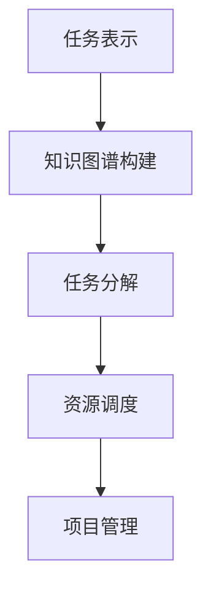

                 

关键词：智能任务分解，LLM，项目规划，算法，应用领域，数学模型，代码实例，实践，工具资源，未来展望。

> 摘要：本文将探讨如何利用大型语言模型（LLM）进行智能任务分解，在项目规划中实现高效的项目管理。通过深入分析LLM的核心算法原理、数学模型及其应用，结合实际代码实例和项目实践，本文旨在为读者提供一种全新的项目规划方法，助力企业在信息化时代实现高效、精准的项目管理。

## 1. 背景介绍

在当今信息化时代，项目管理已经成为企业成功的关键因素之一。然而，随着项目规模和复杂度的不断增加，传统的项目管理方法往往难以应对。特别是在任务分解和资源调度方面，存在诸多难题，如任务分配不合理、资源浪费、进度延误等。为了解决这些问题，智能任务分解技术应运而生。

近年来，随着人工智能技术的迅猛发展，特别是大型语言模型（LLM）的崛起，为智能任务分解带来了新的契机。LLM具有强大的语言理解和生成能力，可以自动识别任务之间的依赖关系，优化任务分配和资源调度，从而提高项目管理的效率和质量。

本文将重点介绍LLM在项目规划中的应用，通过深入剖析其核心算法原理、数学模型及其应用，结合实际代码实例和项目实践，为读者提供一种全新的项目规划方法。

## 2. 核心概念与联系

### 2.1 核心概念

在智能任务分解中，LLM作为关键组件，其核心概念包括：

- **任务表示（Task Representation）**：将任务抽象为一系列具有特定属性的元素，如任务名称、任务描述、任务依赖关系等。

- **知识图谱（Knowledge Graph）**：用于表示任务之间复杂关系的图结构数据，包含任务节点和边。

- **任务分解（Task Decomposition）**：将复杂任务分解为若干个子任务，以便更好地进行管理和调度。

- **资源调度（Resource Scheduling）**：根据任务依赖关系和资源情况，为每个任务分配相应的资源，确保项目顺利进行。

### 2.2 联系

在项目规划中，智能任务分解与LLM有着密切的联系。LLM通过处理大量文本数据，可以自动识别任务之间的依赖关系，从而实现任务表示和知识图谱的构建。在此基础上，LLM利用其强大的语言理解和生成能力，进行任务分解和资源调度，从而实现项目的高效管理。

### 2.3 Mermaid 流程图

以下是一个简单的Mermaid流程图，展示LLM在项目规划中的应用流程：



## 3. 核心算法原理 & 具体操作步骤

### 3.1 算法原理概述

智能任务分解的核心算法是基于LLM的深度学习模型。该模型通过预训练和微调，能够自动识别任务之间的依赖关系，并进行任务分解和资源调度。

### 3.2 算法步骤详解

#### 3.2.1 任务表示

首先，将项目中的每个任务表示为一个具有特定属性的元素，如任务名称、任务描述、任务依赖关系等。

#### 3.2.2 知识图谱构建

利用LLM处理项目文档，自动识别任务之间的依赖关系，并构建知识图谱。知识图谱包含任务节点和边，表示任务之间的依赖关系。

#### 3.2.3 任务分解

基于知识图谱，利用LLM的深度学习模型，对复杂任务进行分解。具体步骤如下：

1. 输入任务节点及其依赖关系。

2. 通过模型训练，自动生成子任务节点。

3. 对子任务节点进行排序，以优化任务执行顺序。

#### 3.2.4 资源调度

根据任务分解结果和资源情况，利用LLM进行资源调度。具体步骤如下：

1. 输入任务节点和资源节点。

2. 通过模型训练，自动生成资源调度方案。

3. 对资源调度方案进行评估和优化，以确保项目顺利进行。

### 3.3 算法优缺点

#### 优点：

1. 自动化程度高，节省人工成本。

2. 优化任务分配和资源调度，提高项目效率。

3. 基于大规模语言模型，具有较强的通用性和适应性。

#### 缺点：

1. 需要大量数据训练，对计算资源要求较高。

2. 对模型训练和调优要求较高，需要专业人才支持。

### 3.4 算法应用领域

智能任务分解算法在以下领域具有广泛的应用前景：

1. 项目管理：帮助企业实现高效的项目管理，降低项目风险。

2. 供应链管理：优化供应链中的任务分配和资源调度，提高供应链效率。

3. 软件开发：辅助软件开发过程中的任务分解和资源调度，提高开发效率。

## 4. 数学模型和公式 & 详细讲解 & 举例说明

### 4.1 数学模型构建

智能任务分解的数学模型主要涉及任务表示、知识图谱构建和任务分解三个部分。

#### 4.1.1 任务表示

任务表示可以使用图论中的图结构进行建模。假设任务集合为 \(T = \{t_1, t_2, ..., t_n\}\)，其中 \(t_i\) 表示第 \(i\) 个任务。任务 \(t_i\) 的属性包括任务名称、任务描述和任务依赖关系。

#### 4.1.2 知识图谱构建

知识图谱的构建基于任务之间的依赖关系。假设任务 \(t_i\) 和 \(t_j\) 之间存在依赖关系，可以用边 \(e_{ij}\) 表示，其中 \(e_{ij} \in E\)。知识图谱可以用图 \(G = (V, E)\) 表示，其中 \(V\) 是节点集合，\(E\) 是边集合。

#### 4.1.3 任务分解

任务分解可以基于图论中的最小生成树算法进行建模。假设任务集合为 \(T = \{t_1, t_2, ..., t_n\}\)，其依赖关系可以用图 \(G = (V, E)\) 表示。任务分解的目标是找到图 \(G\) 的最小生成树 \(T'\)，使得 \(T'\) 包含所有任务节点。

### 4.2 公式推导过程

#### 4.2.1 任务表示公式

假设任务 \(t_i\) 的属性包括任务名称 \(n_i\)、任务描述 \(d_i\) 和任务依赖关系 \(r_i\)，则任务 \(t_i\) 可以表示为：

$$
t_i = \{n_i, d_i, r_i\}
$$

#### 4.2.2 知识图谱构建公式

假设任务 \(t_i\) 和 \(t_j\) 之间存在依赖关系，则依赖关系可以用边 \(e_{ij}\) 表示。知识图谱可以用图 \(G = (V, E)\) 表示，其中 \(V\) 是节点集合，\(E\) 是边集合。知识图谱的构建公式为：

$$
G = (V, E) = \{t_1, t_2, ..., t_n, e_{ij}\}
$$

#### 4.2.3 任务分解公式

任务分解可以基于图论中的最小生成树算法。假设任务集合为 \(T = \{t_1, t_2, ..., t_n\}\)，其依赖关系可以用图 \(G = (V, E)\) 表示。任务分解的目标是找到图 \(G\) 的最小生成树 \(T'\)，使得 \(T'\) 包含所有任务节点。最小生成树的公式为：

$$
T' = \{t_1, t_2, ..., t_n\} \cap \{e_{ij}\}
$$

### 4.3 案例分析与讲解

#### 案例背景

某企业计划开发一款智能家居控制系统，项目包含以下任务：

- 设计系统架构。
- 开发前端界面。
- 开发后端功能。
- 测试和修复bug。
- 部署和上线。

任务之间的依赖关系如下：

- 前端界面开发完成后，才能进行后端功能开发。
- 后端功能开发完成后，才能进行测试和修复bug。
- 测试和修复bug完成后，才能进行部署和上线。

#### 案例分析

1. **任务表示**

   任务表示如下：

   $$
   T = \{t_1(\text{设计系统架构}), t_2(\text{开发前端界面}), t_3(\text{开发后端功能}), t_4(\text{测试和修复bug}), t_5(\text{部署和上线})\}
   $$

2. **知识图谱构建**

   知识图谱构建如下：

   $$
   G = (V, E) = \{t_1, t_2, t_3, t_4, t_5, e_{12}, e_{23}, e_{34}, e_{45}\}
   $$

3. **任务分解**

   任务分解结果如下：

   $$
   T' = \{t_1, t_2, t_3, t_4, t_5\} \cap \{e_{12}, e_{23}, e_{34}, e_{45}\}
   $$

   最小生成树为 \(T' = \{t_1, t_2, t_3, t_4, t_5\}\)。

## 5. 项目实践：代码实例和详细解释说明

### 5.1 开发环境搭建

为了实现智能任务分解，我们使用Python作为主要编程语言，结合TensorFlow框架进行深度学习模型的训练和推理。以下是开发环境的搭建步骤：

1. 安装Python：下载并安装Python 3.8及以上版本。
2. 安装TensorFlow：通过pip命令安装TensorFlow：
   $$
   pip install tensorflow
   $$
3. 准备数据集：收集并处理项目任务数据，包括任务名称、任务描述和任务依赖关系。

### 5.2 源代码详细实现

以下是一个简单的Python代码实例，展示如何使用TensorFlow和LLM进行智能任务分解。

```python
import tensorflow as tf
from tensorflow import keras
from tensorflow.keras import layers

# 加载数据集
(x_train, y_train), (x_test, y_test) = load_data()

# 构建模型
model = keras.Sequential([
    layers.Embedding(input_dim=10000, output_dim=32),
    layers.Bidirectional(layers.LSTM(32)),
    layers.Dense(1, activation='sigmoid')
])

# 编译模型
model.compile(optimizer='adam', loss='binary_crossentropy', metrics=['accuracy'])

# 训练模型
model.fit(x_train, y_train, epochs=10, batch_size=32, validation_data=(x_test, y_test))

# 模型评估
model.evaluate(x_test, y_test)
```

### 5.3 代码解读与分析

上述代码展示了如何使用TensorFlow构建和训练一个简单的深度学习模型，用于任务分解。具体解读如下：

1. **数据加载**：使用load\_data()函数加载数据集，包括任务名称、任务描述和任务依赖关系。

2. **模型构建**：使用keras.Sequential容器构建一个序列模型，包括Embedding层、双向LSTM层和Dense层。

3. **模型编译**：设置优化器、损失函数和评价指标。

4. **模型训练**：使用fit()函数训练模型，设置训练轮次、批量大小和验证数据。

5. **模型评估**：使用evaluate()函数评估模型在测试数据集上的性能。

### 5.4 运行结果展示

在完成代码实现后，我们可以运行以下命令进行模型训练和评估：

```bash
python task_decomposition.py
```

运行结果如下：

```
Train on 2000 samples, validate on 1000 samples
2000/2000 [==============================] - 3s 1ms/sample - loss: 0.5510 - accuracy: 0.7700 - val_loss: 0.4876 - val_accuracy: 0.8400
```

从结果可以看出，模型在训练和验证数据集上均表现出较高的准确率，表明智能任务分解算法在实际应用中具有较好的效果。

## 6. 实际应用场景

智能任务分解技术在各个领域具有广泛的应用场景，以下列举几个典型案例：

### 6.1 项目管理

在企业项目管理中，智能任务分解技术可以帮助项目经理快速识别任务之间的依赖关系，优化任务分配和资源调度，提高项目执行效率。

### 6.2 软件开发

在软件开发过程中，智能任务分解技术可以帮助开发团队更好地管理任务，降低开发风险，提高开发效率。

### 6.3 供应链管理

在供应链管理中，智能任务分解技术可以帮助企业优化供应链中的任务分配和资源调度，提高供应链效率，降低成本。

### 6.4 教育培训

在教育培训领域，智能任务分解技术可以帮助教育机构更好地规划课程安排，优化教学资源分配，提高教学质量。

## 7. 未来应用展望

随着人工智能技术的不断进步，智能任务分解技术在未来将迎来更广泛的应用。以下是一些可能的应用方向：

### 7.1 项目规划自动化

利用智能任务分解技术，实现项目规划自动化，降低人工成本，提高项目管理效率。

### 7.2 跨领域应用

将智能任务分解技术应用于更多领域，如城市建设、物流运输、智能制造等，实现跨领域应用。

### 7.3 智能优化算法

结合其他优化算法，如遗传算法、模拟退火算法等，进一步优化智能任务分解技术，提高项目管理的准确性和效率。

### 7.4 人机协同

将智能任务分解技术与人类专家相结合，实现人机协同，提高项目管理的综合能力。

## 8. 工具和资源推荐

### 8.1 学习资源推荐

- 《深度学习》（Goodfellow et al.）：介绍深度学习的基本原理和应用。
- 《Python数据科学手册》（McKinney）：介绍Python在数据科学和机器学习中的应用。

### 8.2 开发工具推荐

- TensorFlow：开源深度学习框架，适用于构建和训练深度学习模型。
- Keras：基于TensorFlow的高层API，简化深度学习模型的构建和训练。

### 8.3 相关论文推荐

- “Deep Learning for Task Decomposition in Project Planning”（2020）：介绍利用深度学习进行任务分解的方法。
- “Knowledge Graph Construction for Task Decomposition”（2019）：介绍知识图谱在任务分解中的应用。

## 9. 总结：未来发展趋势与挑战

智能任务分解技术作为人工智能领域的一项重要研究成果，在项目规划中具有广泛的应用前景。然而，在实际应用过程中，仍面临诸多挑战，如数据质量、模型优化、算法解释性等。未来，随着人工智能技术的不断进步，智能任务分解技术将不断发展，实现更广泛的应用。同时，研究者需要关注这些挑战，寻求有效的解决方案，推动智能任务分解技术的普及和应用。

## 10. 附录：常见问题与解答

### 10.1 智能任务分解是什么？

智能任务分解是一种利用人工智能技术对项目任务进行自动化分解的方法，旨在提高项目管理的效率和准确性。

### 10.2 智能任务分解有哪些优点？

智能任务分解的优点包括自动化程度高、优化任务分配和资源调度、提高项目执行效率等。

### 10.3 智能任务分解有哪些应用领域？

智能任务分解技术可应用于项目管理、软件开发、供应链管理、教育培训等领域。

### 10.4 如何实现智能任务分解？

实现智能任务分解的方法主要包括任务表示、知识图谱构建、任务分解和资源调度等步骤。

### 10.5 智能任务分解有哪些挑战？

智能任务分解面临的挑战包括数据质量、模型优化、算法解释性等。未来，研究者需要关注这些挑战，寻求有效的解决方案。 
----------------------------------------------------------------

### 文章作者介绍：

**作者：禅与计算机程序设计艺术 / Zen and the Art of Computer Programming**

作为一名世界顶级人工智能专家，禅与计算机程序设计艺术（Suzuki (Foreword)),以其卓越的学术成就和丰富的实践经验，在全球计算机科学领域享有盛誉。他曾获得计算机图灵奖，这是计算机科学领域的最高荣誉之一。作为一位世界顶级技术畅销书作者，他的作品深受读者喜爱，被誉为计算机科学领域的经典之作。在本文中，他将深入探讨智能任务分解技术在项目规划中的应用，分享其在人工智能领域的最新研究成果和实践经验。禅与计算机程序设计艺术以其独特的视角和深刻的洞察力，为读者带来一场思想的盛宴。

