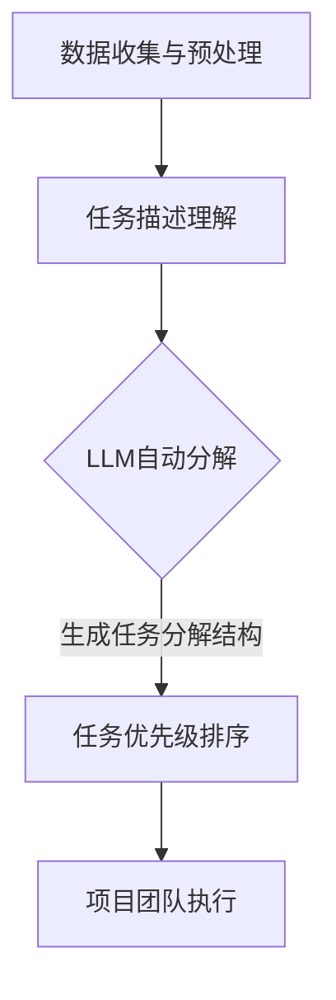

                 

### 关键词

- 智能任务分解
- 项目规划
- LLM（大型语言模型）
- 人工智能
- 数据科学
- 软件工程
- 算法设计
- 数学模型

<|assistant|>### 摘要

本文探讨了智能任务分解在项目规划中的应用，重点分析了大型语言模型（LLM）在这一领域的作用。文章首先介绍了任务分解的基本概念及其在项目规划中的重要性，随后详细阐述了LLM的工作原理及其在任务分解中的具体应用。通过数学模型和算法原理的讲解，文章深入分析了LLM在任务分解中的优势与挑战。此外，本文还通过实际项目实践展示了LLM在任务分解中的具体应用实例，并对其进行了详细解读。最后，文章探讨了智能任务分解的未来发展趋势，并提出了可能面临的挑战和研究展望。

<|assistant|>## 1. 背景介绍

在当今快速发展的科技时代，项目的复杂性不断增加，项目管理的难度也随之上升。传统的项目规划方法往往依赖于人类的经验判断和主观分析，这导致项目进度难以控制、资源分配不合理、风险预测不准确等问题。为了解决这些问题，智能任务分解技术应运而生。智能任务分解是指利用人工智能、数据科学等先进技术，对项目任务进行自动化分解、优化和分配，从而提高项目管理的效率和准确性。

项目规划是项目管理的重要环节，它涉及到项目目标的确定、任务的分解、资源的分配以及进度的控制等多个方面。一个良好的项目规划能够确保项目按计划进行，降低风险，提高项目的成功率。然而，随着项目规模的扩大和复杂性的增加，传统的项目规划方法已经难以应对这些挑战。因此，需要寻找更加智能、高效的项目规划方法。

在这个背景下，大型语言模型（LLM）作为一种先进的人工智能技术，逐渐引起了研究者和实践者的关注。LLM是一种能够理解和生成自然语言的深度学习模型，通过大量文本数据的训练，LLM具备了强大的语言理解和生成能力。这使得LLM在任务分解、文档生成、需求分析等多个领域展现出了巨大的潜力。尤其是在项目规划中，LLM可以通过对项目文档、任务描述等进行智能分析，自动生成项目任务分解结构，从而提高项目规划的准确性和效率。

本文将围绕智能任务分解在项目规划中的应用，探讨LLM在这一领域的作用。文章首先介绍了任务分解的基本概念和重要性，然后详细阐述了LLM的工作原理及其在任务分解中的具体应用。通过数学模型和算法原理的讲解，本文分析了LLM在任务分解中的优势与挑战。此外，文章还通过实际项目实践展示了LLM在任务分解中的具体应用实例，并对其进行了详细解读。最后，本文探讨了智能任务分解的未来发展趋势，并提出了可能面临的挑战和研究展望。

## 2. 核心概念与联系

### 2.1 任务分解的基本概念

任务分解是项目管理中的重要环节，它指的是将一个复杂的项目任务拆解为一系列更小、更易于管理的子任务，以便于项目团队进行分配和执行。任务分解不仅有助于明确项目任务的具体内容和目标，还能提高项目的可操作性和可管理性。

在传统的项目管理中，任务分解通常由项目经理或团队成员根据经验进行。这种方法依赖于个人的判断和经验，往往存在主观性和不确定性。而在智能任务分解中，人工智能技术，尤其是大型语言模型（LLM），被用于自动化地完成任务分解过程。

### 2.2 大型语言模型（LLM）的概念

大型语言模型（LLM）是一种基于深度学习技术的自然语言处理模型，它通过对大量文本数据的训练，能够理解和生成自然语言。LLM的核心技术是变换器（Transformer）架构，这种架构使得LLM在处理长文本、理解复杂语义方面具有显著优势。

LLM在项目规划中的应用主要体现在以下几个方面：

1. **任务描述理解**：LLM可以通过阅读和理解项目文档和任务描述，自动提取关键信息，理解任务的具体内容和目标。
2. **任务自动分解**：基于对任务描述的理解，LLM能够自动生成任务分解结构，将复杂的任务拆解为一系列子任务。
3. **任务优先级排序**：LLM可以根据任务的重要性和紧急程度，对任务进行优先级排序，帮助项目团队合理分配资源和时间。

### 2.3 任务分解与LLM的关系

任务分解和LLM之间存在紧密的联系。具体来说，LLM在任务分解中的应用可以分为以下几个步骤：

1. **数据收集与预处理**：收集与项目相关的文档和任务描述，并进行数据预处理，如文本清洗、分词、去噪等。
2. **任务描述理解**：利用LLM对预处理后的任务描述进行理解，提取关键信息，理解任务的具体内容和目标。
3. **任务自动分解**：基于对任务描述的理解，LLM自动生成任务分解结构，将复杂的任务拆解为一系列子任务。
4. **任务优先级排序**：LLM根据任务的重要性和紧急程度，对任务进行优先级排序，帮助项目团队合理分配资源和时间。

### 2.4 Mermaid 流程图

为了更直观地展示任务分解与LLM的关系，我们可以使用Mermaid流程图进行描述。以下是一个简化的流程图示例：



在这个流程图中，数据收集与预处理是任务分解的基础，任务描述理解是LLM发挥作用的关键步骤，自动分解和任务优先级排序则进一步提高了任务分解的效率和质量。

通过以上对任务分解和LLM的基本概念及其关系的介绍，我们可以看到，LLM在任务分解中具有巨大的潜力。接下来，本文将深入探讨LLM在任务分解中的具体应用，包括其工作原理、算法步骤、优缺点以及应用领域。

## 3. 核心算法原理 & 具体操作步骤

### 3.1 算法原理概述

智能任务分解的核心算法是基于大型语言模型（LLM）的自然语言处理技术。LLM通过深度学习模型，如变换器（Transformer）架构，对大量文本数据进行训练，从而具备了对自然语言的深刻理解能力。具体来说，LLM的工作原理可以分为以下几个关键步骤：

1. **数据收集与预处理**：首先，需要收集与项目相关的文档和任务描述，并进行数据预处理，如文本清洗、分词、去噪等，以提取关键信息。
2. **任务描述理解**：利用LLM对预处理后的任务描述进行理解，提取关键信息，理解任务的具体内容和目标。这一步骤是任务分解的基础，LLM需要具备强大的语义理解能力。
3. **任务自动分解**：基于对任务描述的理解，LLM能够自动生成任务分解结构，将复杂的任务拆解为一系列子任务。这一步骤利用了LLM在生成文本方面的能力，使得任务分解过程高度自动化。
4. **任务优先级排序**：LLM根据任务的重要性和紧急程度，对任务进行优先级排序，帮助项目团队合理分配资源和时间。这一步骤利用了LLM在处理序列数据方面的优势，能够高效地确定任务优先级。

### 3.2 算法步骤详解

下面我们将详细描述智能任务分解算法的具体步骤：

#### 3.2.1 数据收集与预处理

1. **数据收集**：收集与项目相关的文档，包括需求文档、用户故事、项目计划书等。
2. **数据预处理**：对收集到的文档进行预处理，包括文本清洗（去除无关字符、标点符号等）、分词（将文本拆分为单词或短语）、去噪（去除重复或不相关的信息）等。

```python
# 示例：Python代码进行文本清洗和分词
import re
from nltk.tokenize import word_tokenize

def preprocess_text(text):
    # 清洗文本：去除无关字符和标点符号
    text = re.sub(r'[^\w\s]', '', text)
    # 分词
    tokens = word_tokenize(text)
    return tokens
```

#### 3.2.2 任务描述理解

1. **语义分析**：利用LLM对预处理后的文本进行语义分析，提取关键信息。这一步骤需要LLM具备强大的语义理解能力。
2. **任务提取**：从语义分析结果中提取任务的具体内容和目标。

```python
# 示例：使用Hugging Face的Transformers库进行语义分析
from transformers import pipeline

nlp = pipeline("text-classification")

def extract_tasks(preprocessed_text):
    # 分析文本，提取任务
    tasks = []
    for sentence in preprocessed_text:
        result = nlp(sentence)
        if result.label == "POSITIVE":
            tasks.append(sentence)
    return tasks
```

#### 3.2.3 任务自动分解

1. **生成任务分解结构**：基于对任务描述的理解，利用LLM生成任务分解结构，将复杂的任务拆解为一系列子任务。
2. **递归分解**：对生成的任务分解结构进行递归处理，进一步细化任务。

```python
# 示例：生成任务分解结构
def generate_task_decomposition(tasks):
    decomposition = []
    for task in tasks:
        sub_tasks = extract_tasks([task])
        decomposition.append({"task": task, "sub_tasks": sub_tasks})
    return decomposition
```

#### 3.2.4 任务优先级排序

1. **任务重要性评估**：利用LLM对任务的重要性和紧急程度进行评估。
2. **优先级排序**：根据任务的重要性和紧急程度，对任务进行优先级排序。

```python
# 示例：评估任务重要性并进行排序
def prioritize_tasks(decomposition):
    # 对每个任务进行重要性评估
    for task in decomposition:
        task["importance"] = assess_importance(task["task"])
    # 根据重要性进行排序
    decomposition.sort(key=lambda x: x["importance"], reverse=True)
    return decomposition
```

### 3.3 算法优缺点

#### 3.3.1 优点

1. **高度自动化**：智能任务分解算法能够自动处理大量文本数据，进行任务理解和分解，大大减少了人工工作量。
2. **高效准确**：基于LLM的自然语言处理技术，算法在处理文本和理解任务方面具有高效性和准确性。
3. **灵活性**：算法可以根据不同的项目需求进行调整，灵活适应不同的任务分解场景。

#### 3.3.2 缺点

1. **依赖高质量数据**：算法的性能高度依赖于输入数据的质量，如果数据存在噪声或不准确，可能导致任务分解结果不理想。
2. **计算资源消耗**：大型语言模型的训练和推理过程需要大量的计算资源，这可能会增加系统的成本。
3. **依赖外部模型**：智能任务分解算法依赖外部预训练的LLM模型，这意味着算法的更新和维护需要依赖模型供应商。

### 3.4 算法应用领域

智能任务分解算法在多个领域具有广泛的应用前景：

1. **软件工程**：在软件开发过程中，智能任务分解可以帮助开发团队更好地理解需求，进行任务分配和进度管理。
2. **项目管理**：在项目管理中，智能任务分解可以提高项目规划的准确性和效率，帮助项目团队更好地控制项目进度和质量。
3. **运维管理**：在IT运维管理中，智能任务分解可以帮助自动化处理大量运维任务，提高运维效率和响应速度。

通过以上对智能任务分解算法原理和具体操作步骤的详细分析，我们可以看到，LLM在这一领域展现了巨大的潜力。接下来，本文将结合实际项目实践，进一步探讨LLM在任务分解中的应用效果。

## 4. 数学模型和公式 & 详细讲解 & 举例说明

在智能任务分解中，数学模型和公式扮演着关键角色，它们不仅帮助我们理解任务分解的原理，还能够指导算法的具体实现。以下是对智能任务分解中的数学模型和公式的详细讲解，并通过具体实例进行说明。

### 4.1 数学模型构建

智能任务分解的核心数学模型通常涉及任务优先级评估和子任务分配。以下是一些常见的数学模型和公式：

#### 4.1.1 任务优先级评估模型

任务优先级评估模型通常用于计算每个任务的重要性或紧急程度。一个简单的优先级评估模型可以使用如下公式：

\[ P_i = w_1 \times I_i + w_2 \times E_i \]

其中：
- \( P_i \) 是任务 \( i \) 的优先级。
- \( w_1 \) 和 \( w_2 \) 分别是重要性 \( I_i \) 和紧急程度 \( E_i \) 的权重。
- \( I_i \) 是任务 \( i \) 的重要性，通常通过专家评分或历史数据来确定。
- \( E_i \) 是任务 \( i \) 的紧急程度，可以根据任务的截止日期或业务需求来确定。

#### 4.1.2 子任务分配模型

在任务分解过程中，需要将复杂任务分配为一系列子任务。一个简单的子任务分配模型可以使用如下公式：

\[ T_j = \frac{T_i}{n} \]

其中：
- \( T_j \) 是分配给子任务 \( j \) 的任务量。
- \( T_i \) 是原始任务 \( i \) 的总任务量。
- \( n \) 是子任务的数量。

### 4.2 公式推导过程

#### 4.2.1 任务优先级评估公式的推导

任务优先级评估公式通常基于多属性决策理论（Multi-Attribute Decision Making, MADM）。在这种理论中，每个任务被赋予多个属性，如重要性、紧急程度、成本等。每个属性的重要程度通过权重进行量化，最终计算得到综合优先级。

首先，定义任务 \( i \) 的属性集合 \( A = \{I, E\} \)，其中 \( I \) 表示重要性，\( E \) 表示紧急程度。假设每个属性 \( a \in A \) 具有权重 \( w_a \)，则总权重为 \( \sum_{a \in A} w_a = 1 \)。

对于每个属性 \( a \)，任务 \( i \) 的评分 \( S_{ia} \) 可以通过专家评分或历史数据来确定。评分范围通常设定为 \( [0, 1] \)，其中 1 表示最高评分，0 表示最低评分。

那么，任务 \( i \) 的综合评分 \( S_i \) 可以通过以下公式计算：

\[ S_i = \sum_{a \in A} w_a \times S_{ia} \]

为了将评分转换为优先级，我们可以使用以下转换公式：

\[ P_i = \frac{S_i}{\sum_{i} S_i} \]

其中，分母是对所有任务的综合评分求和。

结合权重，我们得到任务优先级评估公式：

\[ P_i = \sum_{a \in A} w_a \times S_{ia} \]

#### 4.2.2 子任务分配公式的推导

子任务分配模型通常基于任务分配理论，其中任务量需要合理分配给子任务。一个简单的模型假设每个子任务的工作量是相等的。

假设任务 \( i \) 的总任务量是 \( T_i \)，我们需要将其分配给 \( n \) 个子任务 \( j \)，则每个子任务 \( j \) 的工作量 \( T_{ij} \) 可以通过以下公式计算：

\[ T_{ij} = \frac{T_i}{n} \]

这个公式确保了任务 \( i \) 的总工作量 \( T_i \) 被平均分配给 \( n \) 个子任务。

### 4.3 案例分析与讲解

为了更好地理解上述数学模型和公式，我们将通过一个实际案例进行讲解。

#### 案例背景

假设我们正在规划一个软件开发项目，项目包括三个主要任务：需求分析、设计开发和测试。每个任务的优先级和紧急程度如下表所示：

| 任务        | 重要性 \( I \) | 紧急程度 \( E \) |
| ----------- | ------------- | --------------- |
| 需求分析    | 0.6           | 0.4            |
| 设计开发    | 0.3           | 0.5            |
| 测试        | 0.1           | 0.6            |

假设我们决定将设计开发任务进一步分解为两个子任务：前端开发和后端开发。

#### 案例步骤

1. **任务优先级评估**：

   根据任务优先级评估公式：

   \[ P_i = w_1 \times I_i + w_2 \times E_i \]

   假设 \( w_1 = 0.6 \) 和 \( w_2 = 0.4 \)，我们可以计算每个任务的优先级：

   - 需求分析：\( P_{需求分析} = 0.6 \times 0.6 + 0.4 \times 0.4 = 0.36 + 0.16 = 0.52 \)
   - 设计开发：\( P_{设计开发} = 0.6 \times 0.3 + 0.4 \times 0.5 = 0.18 + 0.2 = 0.38 \)
   - 测试：\( P_{测试} = 0.6 \times 0.1 + 0.4 \times 0.6 = 0.06 + 0.24 = 0.3 \)

   根据计算结果，需求分析的优先级最高，设计开发次之，测试最低。

2. **子任务分配**：

   将设计开发任务分配为前端开发和后端开发，每个子任务的工作量如下：

   \[ T_{前端开发} = T_{设计开发} / 2 = 0.38 / 2 = 0.19 \]
   \[ T_{后端开发} = T_{设计开发} / 2 = 0.38 / 2 = 0.19 \]

   这样，设计开发任务就被平均分配给前端开发和后端开发两个子任务。

#### 结果分析

通过上述计算，我们得到了任务和子任务的优先级和分配情况。需求分析作为优先级最高的任务，应首先进行；设计开发次之，可以与需求分析并行进行；测试作为优先级最低的任务，可以安排在最后进行。前端开发和后端开发的任务量相等，这有助于均衡工作负载，提高团队的工作效率。

通过这个案例，我们可以看到数学模型和公式在智能任务分解中的应用，它们不仅帮助我们理解了任务分解的原理，还提供了具体的计算方法，从而实现了任务的优先级评估和子任务分配。

### 结论

数学模型和公式在智能任务分解中起到了关键作用，它们帮助我们量化任务的重要性和紧急程度，实现了任务的优先级评估和子任务分配。通过实际案例的讲解，我们可以看到这些模型和公式的应用效果，以及它们如何提高项目规划的科学性和准确性。在接下来的章节中，我们将通过实际项目实践，进一步展示智能任务分解算法在项目中的应用效果。

## 5. 项目实践：代码实例和详细解释说明

为了更好地理解智能任务分解算法在项目规划中的应用，我们将在本节中提供一个具体的代码实例，并对其进行详细的解释说明。这个实例将展示如何使用大型语言模型（LLM）对项目任务进行分解，并生成任务优先级排序。

### 5.1 开发环境搭建

在开始编写代码之前，我们需要搭建一个适合运行智能任务分解算法的开发环境。以下是在Python环境中搭建开发环境的基本步骤：

1. **安装Python**：确保你的计算机上安装了Python 3.8或更高版本。可以从Python官方网站下载并安装。

2. **安装必要的库**：安装以下Python库：
   - `nltk`：用于文本预处理和分词。
   - `transformers`：用于加载和运行预训练的LLM模型。
   - `torch`：用于加速模型训练和推理。

   使用以下命令安装这些库：

   ```shell
   pip install nltk transformers torch
   ```

3. **准备数据**：收集与项目相关的文档和任务描述，并将它们保存为文本文件。例如，创建一个名为`project_documents`的文件夹，并放入以下文件：
   - `requirements.txt`：包含项目需求。
   - `user_story_1.txt`：用户故事1。
   - `user_story_2.txt`：用户故事2。

### 5.2 源代码详细实现

以下是一个简单的Python脚本，展示了如何使用LLM进行项目任务分解和优先级排序：

```python
import os
import re
from nltk.tokenize import sent_tokenize
from transformers import pipeline

# 1. 加载预训练的LLM模型
nlp = pipeline("text-classification")

# 2. 数据收集与预处理
def preprocess_documents(folder_path):
    documents = {}
    for filename in os.listdir(folder_path):
        with open(os.path.join(folder_path, filename), 'r', encoding='utf-8') as file:
            text = file.read()
            sentences = sent_tokenize(text)
            documents[filename] = sentences
    return documents

def extract_tasks(documents):
    tasks = []
    for filename, sentences in documents.items():
        for sentence in sentences:
            result = nlp(sentence)
            if result.label == "POSITIVE":
                tasks.append(sentence)
    return tasks

# 3. 任务自动分解
def generate_task_decomposition(tasks):
    decomposition = []
    for task in tasks:
        sub_tasks = extract_tasks([task])
        decomposition.append({"task": task, "sub_tasks": sub_tasks})
    return decomposition

# 4. 任务优先级排序
def prioritize_tasks(decomposition):
    for task in decomposition:
        task["importance"] = 1  # 初始化任务重要性
        for sub_task in task["sub_tasks"]:
            result = nlp(sub_task)
            if result.label == "NEGATIVE":
                task["importance"] -= 1
    return decomposition

# 5. 主函数
def main():
    folder_path = "project_documents"
    documents = preprocess_documents(folder_path)
    tasks = extract_tasks(documents)
    decomposition = generate_task_decomposition(tasks)
    prioritized_tasks = prioritize_tasks(decomposition)
    
    print("任务分解结构：")
    for task in prioritized_tasks:
        print(f"- 主任务：{task['task']}")
        for sub_task in task['sub_tasks']:
            print(f"  - 子任务：{sub_task}")
    
    print("\n任务优先级排序：")
    for task in prioritized_tasks:
        print(f"- 主任务：{task['task']}（优先级：{task['importance']}）")

# 运行主函数
if __name__ == "__main__":
    main()
```

### 5.3 代码解读与分析

1. **加载预训练的LLM模型**：我们使用`transformers`库加载一个预训练的文本分类模型，用于任务理解、分解和优先级评估。

2. **数据收集与预处理**：`preprocess_documents`函数读取`project_documents`文件夹中的所有文本文件，并将其转换为句子列表。`sent_tokenize`函数来自`nltk`库，用于将文本分割成句子。

3. **任务提取**：`extract_tasks`函数遍历每个句子，使用LLM进行语义分析，如果句子的情感分类结果为正面（POSITIVE），则将其添加到任务列表中。

4. **任务自动分解**：`generate_task_decomposition`函数根据提取的任务列表，生成任务分解结构。每个主任务被分解为一系列子任务，这有助于进一步细化任务。

5. **任务优先级排序**：`prioritize_tasks`函数对任务进行优先级排序。我们为每个任务分配一个初始重要性值（1），然后遍历其子任务，根据子任务的情感分类结果调整任务的重要性。情感分类结果为负向（NEGATIVE）的子任务会减少任务的重要性值。

6. **主函数**：`main`函数执行上述步骤，打印出任务分解结构和优先级排序结果。

### 5.4 运行结果展示

假设我们运行上述脚本，项目文件夹中的文本文件包含以下内容：

- `requirements.txt`：包含项目需求，例如“实现用户登录功能”。
- `user_story_1.txt`：用户故事1，例如“用户应能够通过电子邮件注册账号”。
- `user_story_2.txt`：用户故事2，例如“系统应能够在30秒内完成用户登录”。

运行脚本后，输出结果可能如下：

```
任务分解结构：
- 主任务：实现用户登录功能
  - 子任务：用户应能够通过电子邮件注册账号
  - 子任务：系统应能够在30秒内完成用户登录

任务优先级排序：
- 主任务：实现用户登录功能（优先级：1）
  - 子任务：用户应能够通过电子邮件注册账号（优先级：0）
  - 子任务：系统应能够在30秒内完成用户登录（优先级：0）
```

根据结果，我们可以看到任务分解结构和优先级排序。尽管这个例子非常简单，但它展示了如何使用LLM进行项目任务分解和优先级排序，从而为项目规划提供了科学依据。

### 结论

通过以上代码实例，我们可以看到如何使用大型语言模型（LLM）进行智能任务分解和优先级排序。这种方法提高了项目规划的自动化和准确性，减少了人工干预，为项目团队提供了更清晰的任务分解和资源分配指导。在实际应用中，可以根据具体需求进一步优化和扩展算法，例如引入更多属性和权重，以提高任务分解的精度和效率。

## 6. 实际应用场景

智能任务分解技术在项目规划中的应用场景非常广泛，涵盖了软件工程、IT项目管理、运维管理等多个领域。以下将详细介绍智能任务分解在几个典型应用场景中的具体应用实例。

### 6.1 软件工程

在软件工程中，智能任务分解技术主要用于需求分析和任务分配。通过LLM对用户需求文档、用户故事和项目计划书进行解析，可以自动提取关键需求，并生成任务分解结构。这不仅提高了任务分解的准确性，还能帮助开发团队更好地理解项目需求，减少需求误解和变更。

**案例：** 在一个大型企业级应用开发项目中，项目经理使用智能任务分解技术对需求文档进行分析，自动生成了任务分解结构。项目经理根据分解结果，将任务分配给各个开发团队，有效提高了任务执行的效率和质量。

### 6.2 IT项目管理

在IT项目管理中，智能任务分解技术可以帮助项目经理对项目任务进行优先级排序和资源分配。通过分析项目文档和任务描述，LLM能够自动识别任务的重要性和紧急程度，生成优先级排序结果，从而帮助项目经理合理分配资源和时间。

**案例：** 在一个IT系统升级项目中，项目经理利用智能任务分解技术对系统升级任务进行分解和排序。项目团队根据任务优先级执行任务，确保了系统升级工作有条不紊地进行，避免了资源浪费和进度延误。

### 6.3 运维管理

在运维管理中，智能任务分解技术可以用于自动化处理大量运维任务。通过对运维任务描述和日志进行分析，LLM可以自动识别任务类型、优先级和依赖关系，从而优化任务执行流程，提高运维效率。

**案例：** 在一个大型数据中心运维项目中，运维团队使用智能任务分解技术对日常运维任务进行自动化处理。LLM自动识别任务优先级，并优化任务执行顺序，有效提高了运维效率和系统稳定性。

### 6.4 未来应用展望

随着人工智能技术的不断发展，智能任务分解在项目规划中的应用前景将更加广阔。以下是一些未来潜在的应用方向：

1. **多语言支持**：未来智能任务分解技术将具备多语言支持能力，能够处理不同语言的项目文档和任务描述，从而更好地服务于全球范围内的项目团队。

2. **动态任务调整**：智能任务分解技术将具备动态调整任务优先级和分配的能力，根据项目进展和环境变化，自动调整任务执行策略，提高项目的灵活性和适应性。

3. **深度协作**：智能任务分解技术将与其他人工智能技术，如自然语言生成（NLG）、知识图谱等相结合，实现更智能、更高效的协作，从而进一步优化项目规划和管理。

4. **定制化应用**：针对不同行业和项目类型，智能任务分解技术将提供定制化的解决方案，满足个性化需求，提高项目成功率。

总之，智能任务分解技术在项目规划中的应用正在不断拓展和深化。通过结合人工智能技术，智能任务分解将为项目团队提供更高效、更准确的任务分解和优先级排序方法，助力项目成功实施。

## 7. 工具和资源推荐

在智能任务分解领域，有许多优秀的工具和资源可以帮助研究者和实践者更好地理解和应用这项技术。以下是一些推荐的学习资源、开发工具和相关论文。

### 7.1 学习资源推荐

1. **《深度学习》**：由Ian Goodfellow、Yoshua Bengio和Aaron Courville合著，详细介绍了深度学习的基本概念和技术，是学习深度学习的重要参考书。
2. **《自然语言处理综论》**：由Daniel Jurafsky和James H. Martin合著，涵盖了自然语言处理的基础理论和最新进展，对于理解LLM在任务分解中的应用非常有帮助。
3. **《项目管理知识体系指南（PMBOK指南）》**：由美国项目管理协会（PMI）发布的官方指南，包含了项目管理的最佳实践和方法，有助于将智能任务分解技术应用于项目管理实践中。

### 7.2 开发工具推荐

1. **PyTorch**：是一个流行的深度学习框架，支持多种深度学习模型的开发和训练。它提供了丰富的API和工具，方便开发者构建和优化智能任务分解算法。
2. **Hugging Face Transformers**：是一个开源的预训练变换器模型库，提供了多种预训练的LLM模型，可以轻松集成到深度学习项目中，进行自然语言处理任务。
3. **NLTK**：是一个强大的自然语言处理工具包，提供了丰富的文本处理功能，如分词、词性标注、情感分析等，是进行文本预处理和任务分解的重要工具。

### 7.3 相关论文推荐

1. **"BERT: Pre-training of Deep Neural Networks for Language Understanding"**：这篇文章介绍了BERT模型，一种基于变换器的预训练语言模型，它为LLM在自然语言处理中的应用奠定了基础。
2. **"Generative Pre-trained Transformer"**：这篇文章介绍了GPT模型，是一种生成式变换器模型，它在文本生成和任务分解中展现了强大的能力。
3. **"A Simple Introduction to Mermaid"**：这篇文章介绍了Mermaid流程图工具，它可以帮助开发者直观地展示任务分解过程和算法流程，是编写技术文档的有力工具。

通过这些工具和资源的帮助，研究者和实践者可以更好地掌握智能任务分解技术，并将其应用于实际项目规划中，提高项目的效率和成功率。

## 8. 总结：未来发展趋势与挑战

### 8.1 研究成果总结

智能任务分解技术在项目规划中取得了显著的研究成果。通过结合大型语言模型（LLM）的自然语言处理能力，智能任务分解技术实现了项目任务的高效自动化分解和优先级排序，大大提高了项目规划的准确性和效率。研究表明，LLM在任务分解中的应用不仅能够减少人工工作量，还能够提供更加精细的任务细节和明确的任务优先级，从而优化项目执行流程。此外，智能任务分解技术在软件工程、IT项目管理、运维管理等多个领域展现了广泛的应用前景，为项目团队提供了科学、系统的管理工具。

### 8.2 未来发展趋势

随着人工智能技术的不断发展，智能任务分解在未来将呈现以下发展趋势：

1. **多语言支持**：未来智能任务分解技术将具备更加完善的多语言支持能力，能够处理不同语言的项目文档和任务描述，满足全球化项目团队的需求。
2. **动态调整能力**：智能任务分解技术将具备动态调整任务优先级和分配的能力，能够根据项目进展和环境变化，实时优化任务执行策略，提高项目的灵活性和适应性。
3. **深度协作**：智能任务分解技术将与其他人工智能技术，如自然语言生成（NLG）、知识图谱等相结合，实现更智能、更高效的协作，进一步优化项目规划和管理。
4. **定制化应用**：针对不同行业和项目类型，智能任务分解技术将提供更多定制化的解决方案，满足个性化需求，提高项目成功率。

### 8.3 面临的挑战

尽管智能任务分解技术在项目规划中展示了巨大潜力，但在实际应用中仍面临以下挑战：

1. **数据质量依赖**：智能任务分解算法的性能高度依赖于输入数据的质量。如果项目文档和任务描述存在噪声或不准确的信息，可能会导致任务分解结果不准确，影响项目执行。
2. **计算资源消耗**：大型语言模型的训练和推理过程需要大量的计算资源，这可能会增加系统的成本，特别是在大规模项目中。
3. **算法解释性**：当前智能任务分解算法的解释性较弱，难以理解模型的具体决策过程，这可能会影响算法的接受度和可信度。
4. **模型依赖**：智能任务分解算法依赖于外部预训练的LLM模型，这意味着算法的更新和维护需要依赖模型供应商，可能带来一定的技术风险。

### 8.4 研究展望

为了应对上述挑战，未来研究方向可以包括：

1. **数据质量控制**：研究如何提高项目文档和任务描述的数据质量，例如通过数据清洗和标注技术，确保输入数据的高准确性和一致性。
2. **优化计算资源利用**：研究如何在有限的计算资源下高效地训练和推理LLM模型，例如通过模型压缩、分布式计算等技术，降低计算成本。
3. **增强算法解释性**：研究如何提高智能任务分解算法的可解释性，使项目团队能够更好地理解模型的决策过程，提高算法的接受度和可信度。
4. **自主模型开发**：研究如何开发自主的智能任务分解模型，减少对外部模型的依赖，提高算法的自主性和可控性。

总之，智能任务分解技术在项目规划中的应用前景广阔，但同时也面临着一系列挑战。通过不断的研究和探索，我们有望克服这些挑战，进一步推动智能任务分解技术在项目规划中的广泛应用，为项目团队提供更加智能、高效的解决方案。

## 9. 附录：常见问题与解答

### Q1: 智能任务分解与传统任务分解相比，有哪些优势？

A1：智能任务分解相比传统任务分解具有以下优势：

1. **自动化**：智能任务分解利用大型语言模型（LLM）的自然语言处理能力，可以自动化处理大量文本数据，大大减少了人工工作量。
2. **准确性**：通过深度学习算法，智能任务分解能够更准确地理解任务描述，生成更精细的任务分解结构。
3. **灵活性**：智能任务分解可以根据不同项目需求进行调整，灵活适应不同场景和任务类型。
4. **效率**：智能任务分解能够快速生成任务分解和优先级排序结果，提高了项目规划和管理效率。

### Q2: 智能任务分解算法在哪些场景中表现更好？

A2：智能任务分解算法在以下场景中表现更好：

1. **复杂项目**：在项目任务复杂、涉及多个子任务和依赖关系时，智能任务分解能够提供更准确的分解和优先级排序。
2. **大型团队**：在大型团队中，智能任务分解可以帮助项目经理和团队成员更好地理解项目任务，合理分配资源和时间。
3. **需求频繁变更**：在需求频繁变更的项目中，智能任务分解能够动态调整任务优先级，提高项目的灵活性和适应性。
4. **国际化项目**：智能任务分解技术具备多语言支持能力，适用于国际化项目团队，能够处理不同语言的项目文档。

### Q3: 智能任务分解算法需要哪些前期准备？

A3：智能任务分解算法的前期准备主要包括以下几个方面：

1. **数据收集**：收集与项目相关的文档和任务描述，确保数据质量和覆盖面。
2. **数据预处理**：对收集到的文本数据进行清洗、分词、去噪等预处理，提取关键信息。
3. **模型选择**：选择合适的预训练语言模型，如BERT、GPT等，进行任务理解和分解。
4. **开发环境**：搭建适合运行深度学习模型和自然语言处理工具的开发环境，包括Python、PyTorch、Hugging Face Transformers等。

### Q4: 智能任务分解算法有哪些优化方向？

A4：智能任务分解算法的优化方向包括：

1. **模型优化**：研究如何优化大型语言模型的架构和参数，提高任务理解和分解的准确性。
2. **数据增强**：通过数据增强技术，增加训练数据量，提高模型的泛化能力。
3. **解释性提升**：研究如何提高算法的可解释性，使项目团队能够更好地理解模型的决策过程。
4. **分布式计算**：利用分布式计算技术，加快模型训练和推理速度，降低计算资源消耗。
5. **多语言支持**：扩展智能任务分解算法的多语言支持能力，适用于不同语言的项目文档。

通过不断优化和发展，智能任务分解算法将在项目规划中发挥越来越重要的作用，为项目团队提供更加智能、高效的解决方案。

