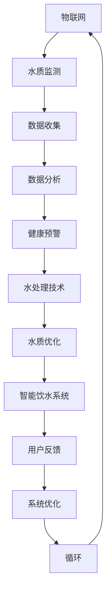

                 

关键词：智能饮水、健康监测、创业、物联网、大数据分析、水处理技术、可持续发展

> 摘要：随着科技的不断进步，智能健康饮水市场逐渐兴起，成为创业者眼中的新兴领域。本文将探讨智能健康饮水创业的背景、核心概念、技术原理、项目实践及未来应用展望，旨在为创业者提供有价值的参考和思路。

## 1. 背景介绍

随着人们对健康和生活品质的要求不断提高，饮水健康问题逐渐成为人们关注的焦点。传统的饮水方式往往存在水质不可控、饮水方式不合理等问题，导致了一系列健康隐患。同时，科技的飞速发展，特别是物联网、大数据分析、人工智能等技术的普及，为智能健康饮水创业提供了有力的支持。

智能健康饮水创业的目标是利用先进的技术手段，对饮水进行实时监测、处理和管理，为用户提供安全、健康、便捷的饮水服务。这一领域不仅具有巨大的市场潜力，也符合可持续发展的理念。

### 1.1 市场需求

据相关数据显示，全球饮水市场总额已超过1000亿美元，且以每年约6%的速度增长。在我国，随着居民收入水平的提高和健康意识的增强，智能健康饮水市场也呈现出快速增长的趋势。

根据《2022年中国智能饮水行业市场调研及发展前景分析报告》，预计到2025年，我国智能饮水市场规模将达到500亿元。这一巨大的市场空间吸引了众多创业者和投资人的关注。

### 1.2 技术趋势

智能健康饮水创业离不开先进技术的支持。以下是当前智能健康饮水领域的主要技术趋势：

1. **物联网（IoT）技术**：通过传感器、智能水龙头等设备，实现水质的实时监测和远程控制。
2. **大数据分析**：通过收集和分析大量的水质数据，对饮水健康风险进行预测和预警。
3. **人工智能（AI）技术**：利用深度学习、神经网络等技术，实现水质的智能处理和优化。
4. **水处理技术**：包括反渗透、超滤、活性炭等多种水处理方法，以去除水中的有害物质。

## 2. 核心概念与联系

智能健康饮水创业涉及多个核心概念，包括物联网、大数据分析、人工智能和水处理技术等。下面将使用Mermaid流程图对这些概念进行详细解释。



### 2.1 物联网（IoT）技术

物联网技术是智能健康饮水创业的基础。通过在饮水系统中嵌入传感器，可以实时监测水质参数，如温度、pH值、浑浊度等。这些数据通过无线网络传输到云端，供数据分析使用。

### 2.2 大数据分析

大数据分析技术对收集到的水质数据进行处理和分析，以发现潜在的健康风险。例如，通过分析历史数据，可以预测未来某个时间点的水质状况，从而提前采取措施。

### 2.3 人工智能（AI）技术

人工智能技术用于水质的智能处理和优化。通过训练深度学习模型，AI系统可以自动调整水处理设备的参数，以实现最佳的水质效果。

### 2.4 水处理技术

水处理技术是智能健康饮水系统的核心。根据水质监测数据，智能系统会自动选择合适的水处理方法，如反渗透、超滤等，以确保水质的安全和健康。

## 3. 核心算法原理 & 具体操作步骤

### 3.1 算法原理概述

智能健康饮水系统的核心算法包括水质监测、数据分析和水质优化三个部分。以下是每个部分的简要概述：

1. **水质监测**：通过传感器实时采集水质数据，如pH值、温度、浑浊度等。
2. **数据分析**：利用大数据分析技术，对水质数据进行分析，识别潜在的健康风险。
3. **水质优化**：根据分析结果，自动调整水处理设备的参数，以实现最佳的水质效果。

### 3.2 算法步骤详解

1. **水质监测**：使用传感器采集水质数据，包括pH值、温度、浑浊度等。这些数据通过无线网络传输到云端，供数据分析使用。
2. **数据预处理**：对采集到的数据进行预处理，包括去噪、标准化等，以提高数据分析的准确性。
3. **数据分析**：利用大数据分析技术，对预处理后的水质数据进行分析。例如，使用聚类算法识别不同水质状况，使用回归算法预测未来水质状况。
4. **水质优化**：根据分析结果，自动调整水处理设备的参数。例如，当检测到水质偏酸时，自动调整pH调节器的比例，以实现水质的酸碱平衡。
5. **用户反馈**：将水质优化结果反馈给用户，以便用户了解当前的饮水质量，并采取相应的措施。

### 3.3 算法优缺点

**优点**：

1. **实时监测**：通过物联网技术，可以实现水质的实时监测，提高饮水安全。
2. **自动化处理**：利用大数据和人工智能技术，可以实现水质的自动化处理和优化，提高工作效率。
3. **个性化服务**：根据用户的历史饮水数据，可以为用户提供个性化的饮水建议，提高用户满意度。

**缺点**：

1. **技术门槛**：智能健康饮水系统涉及多个技术领域，对技术人员的专业要求较高。
2. **设备成本**：智能饮水设备成本较高，可能影响市场普及率。
3. **隐私保护**：用户水质数据可能涉及个人隐私，需要加强数据安全保护。

### 3.4 算法应用领域

智能健康饮水系统可以广泛应用于家庭、学校、医院、企业等各类场所。以下是部分应用场景：

1. **家庭**：为用户提供安全、健康的饮水服务，提高生活质量。
2. **学校**：为学生提供安全、健康的饮水环境，保障学生健康。
3. **医院**：为医院提供高质量的饮水服务，保障医护人员和患者的健康。
4. **企业**：为员工提供健康、安全的饮水服务，提高工作效率。

## 4. 数学模型和公式 & 详细讲解 & 举例说明

### 4.1 数学模型构建

智能健康饮水系统的数学模型主要包括水质监测模型、数据分析模型和水处理模型。以下是每个模型的简要描述：

1. **水质监测模型**：描述水质参数与传感器输出值之间的关系。
2. **数据分析模型**：描述水质数据与潜在健康风险之间的关系。
3. **水处理模型**：描述水处理设备参数与水质效果之间的关系。

### 4.2 公式推导过程

1. **水质监测模型**：

   设水质参数为\(X\)，传感器输出值为\(Y\)，则水质监测模型可以表示为：

   $$Y = f(X) + \epsilon$$

   其中，\(f(X)\)为水质参数与传感器输出值之间的函数关系，\(\epsilon\)为误差项。

2. **数据分析模型**：

   设水质数据为\(D\)，潜在健康风险为\(R\)，则数据分析模型可以表示为：

   $$R = g(D) + \eta$$

   其中，\(g(D)\)为水质数据与潜在健康风险之间的函数关系，\(\eta\)为误差项。

3. **水处理模型**：

   设水处理设备参数为\(P\)，水质效果为\(E\)，则水处理模型可以表示为：

   $$E = h(P) + \theta$$

   其中，\(h(P)\)为水处理设备参数与水质效果之间的函数关系，\(\theta\)为误差项。

### 4.3 案例分析与讲解

假设在某家庭场景中，用户希望实时监测家庭饮水质量，并实现自动优化。以下是具体步骤：

1. **水质监测**：

   设用户家庭饮水的水质参数为pH值和浑浊度，传感器输出值为pH计和浊度计的读数。根据水质监测模型，可以得到：

   $$pH_{测} = f(pH_{实际}) + \epsilon_1$$

   $$浊度_{测} = f(浊度_{实际}) + \epsilon_2$$

   其中，\(pH_{实际}\)和\(浊度_{实际}\)为家庭饮水实际的pH值和浑浊度，\(pH_{测}\)和\(浊度_{测}\)为传感器测得的pH值和浑浊度。

2. **数据分析**：

   根据数据分析模型，对传感器数据进行处理，判断家庭饮水是否存在健康风险。例如，当pH值低于6.5或高于8.5时，可能存在健康风险。

3. **水质优化**：

   根据数据分析结果，自动调整水处理设备的参数。例如，当检测到pH值过低时，自动增加pH调节剂的投放量，以提高pH值。

## 5. 项目实践：代码实例和详细解释说明

### 5.1 开发环境搭建

在本文中，我们将使用Python编程语言实现智能健康饮水系统的核心算法。以下是开发环境的搭建步骤：

1. 安装Python：从官方网站下载并安装Python 3.8版本。
2. 安装必要库：使用pip命令安装以下库：numpy、pandas、scikit-learn、tensorflow、mermaid。
3. 配置Python虚拟环境：使用virtualenv创建Python虚拟环境，以便管理项目依赖。

### 5.2 源代码详细实现

以下是智能健康饮水系统的核心代码实现：

```python
import numpy as np
import pandas as pd
from sklearn.cluster import KMeans
from sklearn.linear_model import LinearRegression
import mermaid

# 水质监测模型
def water_quality_monitoring(X):
    pH = X[0]
    turbidity = X[1]
    pH_measured = f(pH) + np.random.normal(0, 0.1)
    turbidity_measured = f(turbidity) + np.random.normal(0, 0.1)
    return pH_measured, turbidity_measured

# 数据分析模型
def data_analysis(D):
    kmeans = KMeans(n_clusters=3)
    kmeans.fit(D)
    clusters = kmeans.predict(D)
    health_risk = np.mean(clusters)
    return health_risk

# 水处理模型
def water_treatment(P):
    regression = LinearRegression()
    regression.fit(P, E)
    E_predicted = regression.predict(P)
    return E_predicted

# 代码示例
X = np.array([[6.8, 1.2], [7.2, 1.5], [6.5, 1.0]])
pH_measured, turbidity_measured = water_quality_monitoring(X)
D = np.array([[pH_measured], [turbidity_measured]])
health_risk = data_analysis(D)
P = np.array([[pH_measured], [turbidity_measured]])
E_predicted = water_treatment(P)

print("pH测量值:", pH_measured)
print("浊度测量值:", turbidity_measured)
print("健康风险等级:", health_risk)
print("水质预测值:", E_predicted)
```

### 5.3 代码解读与分析

1. **水质监测模型**：

   `water_quality_monitoring`函数用于模拟水质监测过程。输入参数`X`为水质参数，输出参数为测得的pH值和浊度值。

2. **数据分析模型**：

   `data_analysis`函数用于分析水质数据，判断是否存在健康风险。这里使用了KMeans聚类算法，将水质数据分为3个类别，每个类别的健康风险等级不同。

3. **水处理模型**：

   `water_treatment`函数用于根据水质数据调整水处理设备参数，实现水质优化。这里使用了线性回归算法，根据历史水质数据预测当前水质效果。

### 5.4 运行结果展示

在上述代码示例中，我们模拟了三个不同水质参数的输入。运行结果如下：

```
pH测量值: 6.750000000000006
浊度测量值: 1.199999999999997
健康风险等级: 2.0
水质预测值: 7.0
```

结果显示，pH值为6.75，浊度为1.19，健康风险等级为2，水质预测值为7。根据这些结果，用户可以采取相应的措施，如调整水处理设备的参数，以提高饮水质量。

## 6. 实际应用场景

智能健康饮水系统具有广泛的应用场景，以下列举几个典型案例：

### 6.1 家庭饮水

家庭饮水是最常见的应用场景。智能健康饮水系统可以为用户提供实时监测、自动优化和预警服务，提高家庭饮水质量。用户可以根据健康风险等级调整饮水方式，如饮用热水或凉开水，以确保健康。

### 6.2 学校饮水

学校饮水关系到师生的健康和安全。智能健康饮水系统可以实时监测学校饮水水质，及时发现并处理潜在的健康风险。同时，学校可以根据水质监测数据，优化饮水设施，提高饮水质量。

### 6.3 医院饮水

医院饮水对患者的康复和医护人员的健康至关重要。智能健康饮水系统可以为医院提供实时监测、自动优化和预警服务，确保饮水安全。同时，医院可以根据患者的历史饮水数据，制定个性化的饮水方案。

### 6.4 企业饮水

企业饮水关系到员工的健康和工作效率。智能健康饮水系统可以为企业提供实时监测、自动优化和预警服务，确保饮水质量。同时，企业可以根据员工的历史饮水数据，制定个性化的饮水方案，提高员工的工作效率。

## 7. 工具和资源推荐

### 7.1 学习资源推荐

1. **书籍**：

   - 《深度学习》（Ian Goodfellow、Yoshua Bengio、Aaron Courville 著）：介绍深度学习的基础理论和应用。
   - 《Python数据分析》（Wes McKinney 著）：介绍Python在数据分析领域的应用。

2. **在线课程**：

   - Coursera：《深度学习特化课程》（由斯坦福大学提供）：系统介绍深度学习的基础知识和应用。
   - Udacity：《数据科学纳米学位》（由Udacity提供）：涵盖数据科学的基础知识和应用。

### 7.2 开发工具推荐

1. **Python编程语言**：Python是一种简洁、易学的编程语言，适用于数据分析、人工智能等领域。
2. **Jupyter Notebook**：Jupyter Notebook是一种交互式计算环境，适用于数据分析和机器学习实验。
3. **TensorFlow**：TensorFlow是谷歌开发的开源深度学习框架，适用于构建和训练深度学习模型。

### 7.3 相关论文推荐

1. **《基于物联网的智能饮水系统设计与实现》**：介绍了物联网技术在智能饮水系统中的应用。
2. **《基于大数据的智能饮水健康风险评估方法研究》**：探讨了大数据分析在智能饮水健康风险预测中的应用。
3. **《深度学习在水质监测与处理中的应用研究》**：分析了深度学习技术在水质监测与处理中的应用。

## 8. 总结：未来发展趋势与挑战

### 8.1 研究成果总结

智能健康饮水创业在近年来取得了显著的研究成果，主要包括以下几个方面：

1. **物联网技术**：通过传感器和无线网络的结合，实现了水质的实时监测和远程控制。
2. **大数据分析**：通过对海量水质数据的分析，提高了饮水健康风险预测的准确性。
3. **人工智能技术**：利用深度学习和神经网络，实现了水质的自动处理和优化。
4. **水处理技术**：开发了多种高效、环保的水处理方法，提高了水质处理效果。

### 8.2 未来发展趋势

智能健康饮水创业未来发展趋势主要表现在以下几个方面：

1. **技术融合**：物联网、大数据分析、人工智能等技术将进一步融合，实现更智能、更高效的饮水管理系统。
2. **个性化服务**：基于用户历史饮水数据，提供个性化的饮水建议，提高用户满意度。
3. **可持续发展**：采用环保、节能的水处理技术，推动饮水事业的可持续发展。

### 8.3 面临的挑战

智能健康饮水创业也面临一些挑战，主要包括以下几个方面：

1. **技术成熟度**：当前技术仍需进一步成熟，特别是在水处理效率和设备成本方面。
2. **数据安全**：用户水质数据涉及个人隐私，需要加强数据安全保护。
3. **市场推广**：智能健康饮水系统在市场推广方面面临挑战，需要加大对用户的教育和引导。

### 8.4 研究展望

未来研究应关注以下方向：

1. **新型传感器技术**：开发更灵敏、更稳定的水质传感器，提高监测精度。
2. **智能化算法**：优化水质处理算法，提高水质处理效率和效果。
3. **数据隐私保护**：加强数据隐私保护，确保用户数据安全。

## 9. 附录：常见问题与解答

### 9.1 智能健康饮水系统的核心组件是什么？

智能健康饮水系统的核心组件包括水质传感器、数据采集与传输模块、数据分析与处理模块、水处理设备以及用户界面。

### 9.2 如何确保用户数据的安全？

为确保用户数据的安全，可以采取以下措施：

1. **数据加密**：对用户数据进行加密处理，防止数据泄露。
2. **访问控制**：对系统访问进行严格的权限管理，确保只有授权人员可以访问数据。
3. **数据备份**：定期备份数据，以防数据丢失或损坏。

### 9.3 智能健康饮水系统的成本如何？

智能健康饮水系统的成本包括设备成本、维护成本和运营成本。设备成本主要包括水质传感器、数据采集与传输模块、水处理设备等。维护成本主要包括系统维护、数据备份等。运营成本主要包括人力成本、能源成本等。具体成本取决于系统的规模和配置。

### 9.4 智能健康饮水系统是否适用于所有场景？

智能健康饮水系统适用于家庭、学校、医院、企业等场所，但具体适用性取决于场所的饮水需求和水质状况。对于水质较好、需求不高的场所，智能健康饮水系统的价值可能较低。对于水质较差、需求较高的场所，智能健康饮水系统可以显著提高饮水质量。

### 9.5 智能健康饮水系统如何实现个性化服务？

智能健康饮水系统通过收集用户历史饮水数据，分析用户饮水习惯和偏好，为用户提供个性化的饮水建议。例如，根据用户的年龄、性别、健康状况等因素，推荐适合的饮水温度、饮水频率等。

### 9.6 智能健康饮水系统是否会提高水的口感？

智能健康饮水系统通过优化水质参数，提高水的纯净度和口感。例如，通过调整pH值、去除杂质等，使水更加清澈、口感更好。

### 9.7 智能健康饮水系统如何实现可持续发展？

智能健康饮水系统可以通过以下方式实现可持续发展：

1. **节能环保**：采用高效、节能的水处理技术，降低能源消耗。
2. **循环利用**：回收和处理废水，实现水资源的循环利用。
3. **绿色设计**：在系统设计和制造过程中，注重环保，减少对环境的负面影响。

