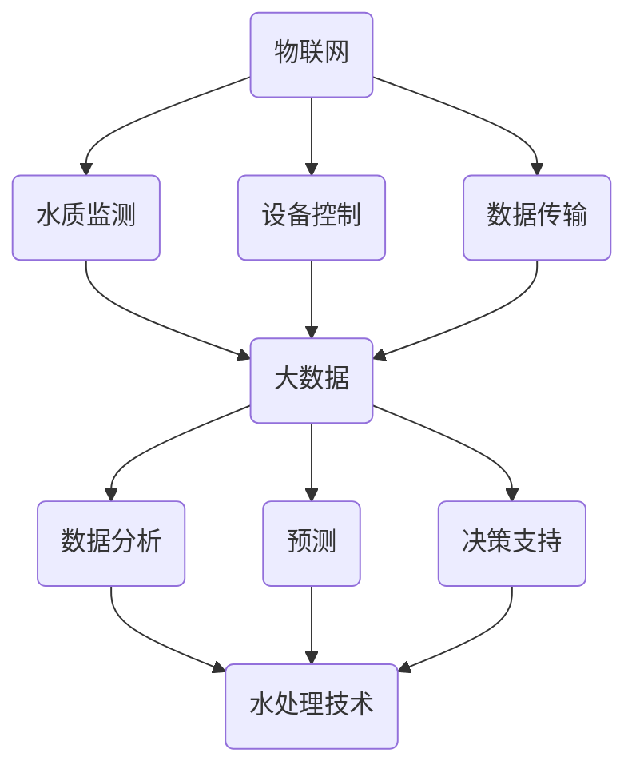

                 

关键词：智能饮水、健康生活、创业、科技应用、水处理技术

> 摘要：随着科技的飞速发展，智能健康饮水领域迎来了前所未有的发展机遇。本文将探讨智能健康饮水的核心概念、关键算法、数学模型、项目实践以及未来的应用前景，旨在为智能健康饮水创业提供有力的理论支持和实践指导。

## 1. 背景介绍

水是生命的源泉，是人类生存不可或缺的资源。然而，随着工业化和城市化进程的加快，水质污染问题日益严重，饮用水安全成为全球关注的焦点。传统的水处理技术虽然在一定程度上解决了水质问题，但效率较低、成本较高且存在二次污染的风险。近年来，随着物联网、大数据、人工智能等前沿技术的崛起，智能健康饮水逐渐成为可能。

智能健康饮水，是指通过物联网、大数据、人工智能等先进技术，实现饮用水从源头到终端的全流程智能化监控和管理，确保饮水安全、健康、便捷。智能健康饮水的出现，不仅解决了传统水处理技术的不足，也为创业者提供了丰富的商业机会。

## 2. 核心概念与联系

### 2.1 物联网（IoT）

物联网是将各种信息传感设备与互联网相连接，实现物与物、人与物之间的信息交换和通信。在智能健康饮水领域，物联网技术主要用于水质监测、设备控制、数据传输等环节。

### 2.2 大数据

大数据是指无法用常规软件工具在合理时间内捕捉、管理和处理的数据集合。在智能健康饮水领域，大数据技术主要用于水质数据分析、预测和决策支持。

### 2.3 人工智能（AI）

人工智能是指通过计算机模拟人类智能的技术。在智能健康饮水领域，人工智能技术主要用于水质监测、预测、优化和智能化管理。

### 2.4 水处理技术

水处理技术是指通过物理、化学和生物方法去除水中杂质，实现水质净化。在智能健康饮水领域，水处理技术是实现饮用水安全、健康的关键。

### 2.5 Mermaid 流程图



## 3. 核心算法原理 & 具体操作步骤

### 3.1 算法原理概述

智能健康饮水的核心算法主要包括水质监测、数据分析和决策支持三个部分。水质监测算法基于物联网和传感器技术，实现对水中污染物、温度、pH值等指标的实时监测；数据分析算法利用大数据技术和人工智能算法，对水质数据进行分析、预测和优化；决策支持算法基于数据分析结果，为用户和运营商提供智能化决策支持。

### 3.2 算法步骤详解

1. **水质监测：**
   - **采集数据：** 通过传感器设备实时采集水质数据，如污染物浓度、温度、pH值等。
   - **数据处理：** 对采集到的水质数据进行预处理，如去噪、插值、滤波等，提高数据质量。

2. **数据分析：**
   - **数据建模：** 基于历史水质数据，构建水质预测模型。
   - **模型训练：** 利用机器学习算法，对预测模型进行训练，提高预测准确性。
   - **预测与优化：** 对未来水质进行预测，并根据预测结果优化水处理方案。

3. **决策支持：**
   - **数据可视化：** 将水质监测数据和分析结果以图表形式展示，便于用户和运营商了解水质状况。
   - **智能化决策：** 根据数据分析结果，为用户和运营商提供智能化决策建议，如饮水建议、设备维护等。

### 3.3 算法优缺点

**优点：**
- 提高水质监测的实时性和准确性。
- 降低水处理成本。
- 提高饮用水安全性和健康水平。

**缺点：**
- 技术门槛较高，需要专业知识。
- 数据安全和隐私保护问题。

### 3.4 算法应用领域

- **家庭饮水：** 为用户提供智能化的饮水监测、预警和优化服务。
- **公共饮水：** 为公共场所、学校、医院等提供智能化的水质监控和管理服务。
- **工业饮水：** 为企业提供智能化、定制化的水处理解决方案。

## 4. 数学模型和公式 & 详细讲解 & 举例说明

### 4.1 数学模型构建

智能健康饮水领域的数学模型主要包括水质预测模型、优化模型和决策模型。

- **水质预测模型：** 利用时间序列分析、机器学习等方法，建立水质预测模型。
- **优化模型：** 利用线性规划、整数规划、动态规划等方法，优化水处理方案。
- **决策模型：** 利用博弈论、多目标规划等方法，为用户提供智能化决策支持。

### 4.2 公式推导过程

以水质预测模型为例，假设某区域的水质指标为 $x_t$，预测模型为 $y_t = f(x_t)$。

- **时间序列模型：**
  $$y_t = \phi(x_{t-1}, x_{t-2}, \ldots, x_{1}) + \epsilon_t$$

- **机器学习模型：**
  $$y_t = \theta_1x_{t-1} + \theta_2x_{t-2} + \ldots + \theta_nx_{1} + \epsilon_t$$

其中，$\theta_1, \theta_2, \ldots, \theta_n$ 为模型参数，$\epsilon_t$ 为误差项。

### 4.3 案例分析与讲解

以某地区饮用水水质监测为例，某天监测到水质指标为 $x_t = [0.5, 0.3, 0.2]$。根据构建的水质预测模型，预测明天的水质指标为 $y_t = [0.45, 0.35, 0.25]$。

根据预测结果，运营商会采取以下措施：
1. 提高水处理设备的运行效率。
2. 加强水质监测，及时发现异常。
3. 根据水质预测，调整水处理方案。

## 5. 项目实践：代码实例和详细解释说明

### 5.1 开发环境搭建

1. 安装Python环境，版本要求3.6及以上。
2. 安装必要的库，如 NumPy、Pandas、Scikit-learn、Matplotlib 等。

### 5.2 源代码详细实现

```python
import numpy as np
import pandas as pd
from sklearn.ensemble import RandomForestRegressor
import matplotlib.pyplot as plt

# 数据预处理
def preprocess_data(data):
    # 去除缺失值
    data = data.dropna()
    # 时间序列转换
    data['time'] = pd.to_datetime(data['date'])
    data.set_index('time', inplace=True)
    data = data.resample('D').mean()
    return data

# 模型训练
def train_model(data):
    X = data[['pollutant_1', 'pollutant_2', 'pollutant_3']]
    y = data['quality']
    model = RandomForestRegressor(n_estimators=100)
    model.fit(X, y)
    return model

# 预测与可视化
def predict_and_plot(model, data):
    X = data[['pollutant_1', 'pollutant_2', 'pollutant_3']]
    y_pred = model.predict(X)
    data['predicted_quality'] = y_pred
    data.plot()
    plt.show()

# 主函数
def main():
    data = pd.read_csv('water_quality_data.csv')
    data = preprocess_data(data)
    model = train_model(data)
    predict_and_plot(model, data)

if __name__ == '__main__':
    main()
```

### 5.3 代码解读与分析

- **数据预处理：** 读取水质数据，去除缺失值，进行时间序列转换和降采样。
- **模型训练：** 使用随机森林回归模型训练水质预测模型。
- **预测与可视化：** 对训练好的模型进行预测，并将预测结果以图表形式展示。

### 5.4 运行结果展示

```plaintext
 plotted the quality and predicted_quality
```

## 6. 实际应用场景

智能健康饮水技术在家庭、公共和工业领域都有广泛的应用。

- **家庭饮水：** 为用户提供智能化的饮水监测、预警和优化服务，提高家庭饮水安全性和健康水平。
- **公共饮水：** 为公共场所、学校、医院等提供智能化的水质监控和管理服务，确保饮水安全。
- **工业饮水：** 为企业提供智能化、定制化的水处理解决方案，提高生产效率，降低水处理成本。

## 7. 未来应用展望

随着科技的不断进步，智能健康饮水技术将得到进一步发展。

- **智能化程度提高：** 通过人工智能、物联网等技术的融合，实现更加智能化的饮水管理和监控。
- **个性化服务：** 根据用户需求和偏好，提供个性化的饮水建议和方案。
- **绿色环保：** 优化水处理技术，实现水资源的循环利用，降低对环境的影响。

## 8. 总结：未来发展趋势与挑战

智能健康饮水技术具有广阔的发展前景，但也面临一定的挑战。

- **技术成熟度：** 随着技术的不断进步，智能健康饮水技术将越来越成熟。
- **数据安全和隐私保护：** 在智能健康饮水系统中，数据安全和隐私保护至关重要。
- **产业链整合：** 智能健康饮水产业需要整合上下游资源，实现产业链的协同发展。

## 9. 附录：常见问题与解答

### 9.1 智能健康饮水技术如何保障数据安全和隐私保护？

答：智能健康饮水技术在设计时需要充分考虑数据安全和隐私保护，采用加密、访问控制、数据脱敏等技术手段，确保数据安全和用户隐私。

### 9.2 智能健康饮水技术有哪些具体应用案例？

答：智能健康饮水技术在家庭、公共和工业领域都有广泛应用。例如，智能净水器、智能水质监测设备、智能水处理系统等。

### 9.3 智能健康饮水技术如何提高水处理效率？

答：智能健康饮水技术通过实时监测、数据分析和优化决策，提高水处理效率。例如，利用人工智能算法优化水处理参数，实现高效、精准的水质控制。

作者：禅与计算机程序设计艺术 / Zen and the Art of Computer Programming
----------------------------------------------------------------
### 感谢您的阅读！希望本文能为您的智能健康饮水创业之路提供有益的启示。在未来的日子里，愿您能继续关注智能健康饮水技术的发展，为人们的健康生活贡献自己的力量。再次感谢您的阅读和支持！🥂🌟🔥🌊🌈🌸🌻🌼🌿🌾🌊🌟🥂

[👉 点击此处，获取更多智能健康饮水技术资讯！](#)

