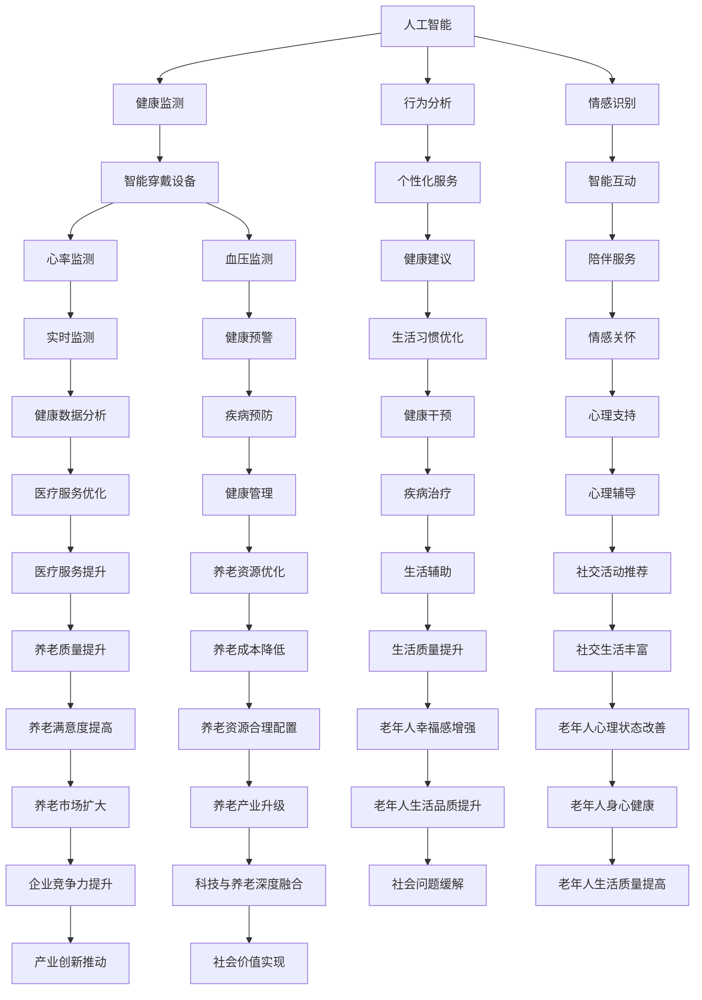

                 

关键词：智能养老，创业，科技助力，老年生活，人工智能，健康监测，智能家居，数据分析

> 摘要：随着社会老龄化进程的加速，如何提高老年人的生活质量，降低养老成本成为亟待解决的问题。智能养老作为一种新兴的养老模式，通过科技的助力，正逐步改变着老年人的生活。本文将从智能养老的核心概念、技术架构、算法原理、数学模型、项目实践以及未来展望等方面，详细探讨智能养老创业的机遇与挑战。

## 1. 背景介绍

随着全球人口老龄化的加剧，养老问题已经成为世界各国面临的重大社会问题。传统的养老模式由于成本高、效率低、服务质量不稳定等问题，已经无法满足日益增长的老年人口需求。智能养老作为一种新兴的养老模式，借助人工智能、物联网、大数据等先进技术，旨在提供个性化、智能化、高效便捷的养老服务和产品。

智能养老的背景可以追溯到21世纪初，随着互联网和智能设备的普及，人工智能技术在医疗、健康、家居等领域的应用逐渐成熟。尤其是在物联网技术的推动下，智能设备和系统之间的互联互通成为可能，为智能养老提供了技术基础。近年来，随着人工智能技术的快速发展，智能养老逐渐从概念走向实际应用，成为养老产业的重要发展方向。

## 2. 核心概念与联系

智能养老的核心概念包括人工智能、物联网、大数据和云计算。这些技术之间有着密切的联系，共同构成了智能养老的技术架构。

### 2.1 人工智能

人工智能（Artificial Intelligence，AI）是模拟、延伸和扩展人的智能的理论、方法、技术及应用。在智能养老中，人工智能主要用于老年人的健康监测、行为分析、情感识别等方面。例如，通过智能穿戴设备实时监测老年人的生理参数，如心率、血压、睡眠质量等，分析老年人的健康状况，并提供相应的健康建议。

### 2.2 物联网

物联网（Internet of Things，IoT）是指通过传感器、控制器等设备将物体连接到互联网，实现设备之间的互联互通。在智能养老中，物联网技术主要用于智能家居、健康监测、环境监测等方面。例如，智能门锁、智能床垫、智能厨房等设备，通过物联网技术实现与养老平台的联动，为老年人提供便捷的生活服务。

### 2.3 大数据

大数据（Big Data）是指无法在一定时间范围内用常规软件工具进行捕捉、管理和处理的数据集合。在智能养老中，大数据主要用于收集和分析老年人的各种数据，如健康数据、行为数据、社交数据等，为养老服务和产品提供数据支持。通过大数据分析，可以更加准确地了解老年人的需求，提供个性化的养老服务。

### 2.4 云计算

云计算（Cloud Computing）是一种基于互联网的计算模式，通过互联网提供动态易扩展且经常是虚拟化的资源。在智能养老中，云计算主要用于存储和处理大量的数据，并提供高效的数据分析和挖掘服务。例如，通过云计算平台，可以将老年人的健康数据、行为数据等集中存储，并提供实时的数据分析服务，为养老服务的决策提供支持。

#### 2.5 Mermaid 流程图



## 3. 核心算法原理 & 具体操作步骤

### 3.1 算法原理概述

在智能养老中，核心算法主要包括健康监测算法、行为分析算法和情感识别算法。这些算法通过数据采集、处理和分析，实现对老年人的健康状态、生活习惯和情感状态进行全面监测和评估。

#### 3.1.1 健康监测算法

健康监测算法主要用于实时监测老年人的生理参数，如心率、血压、血糖等。该算法基于机器学习和深度学习技术，通过对历史数据和实时数据的分析，预测老年人的健康状况，并提供健康预警和建议。

#### 3.1.2 行为分析算法

行为分析算法主要用于分析老年人的生活习惯和行为模式，如睡眠质量、运动量、饮食规律等。该算法通过数据挖掘和模式识别技术，为老年人提供个性化健康建议和生活习惯优化方案。

#### 3.1.3 情感识别算法

情感识别算法主要用于识别老年人的情感状态，如喜怒哀乐、焦虑、抑郁等。该算法基于自然语言处理和计算机视觉技术，通过分析语音、面部表情和文字等数据，为老年人提供情感支持和心理辅导。

### 3.2 算法步骤详解

#### 3.2.1 健康监测算法步骤

1. 数据采集：通过智能穿戴设备，采集老年人的生理参数数据，如心率、血压、血糖等。

2. 数据预处理：对采集到的数据进行清洗和预处理，包括去除噪声、填充缺失值等。

3. 特征提取：从预处理后的数据中提取有用的特征，如心率变异、血压波动等。

4. 模型训练：利用历史数据，采用机器学习或深度学习算法训练健康监测模型。

5. 健康评估：将实时数据输入训练好的模型，评估老年人的健康状况，并提供健康预警和建议。

#### 3.2.2 行为分析算法步骤

1. 数据采集：通过智能家居设备和传感器，采集老年人的行为数据，如睡眠质量、运动量、饮食规律等。

2. 数据预处理：对采集到的数据进行清洗和预处理，包括去除噪声、填充缺失值等。

3. 特征提取：从预处理后的数据中提取有用的特征，如睡眠时长、运动步数、饮食热量等。

4. 模型训练：利用历史数据，采用数据挖掘或机器学习算法训练行为分析模型。

5. 行为评估：将实时数据输入训练好的模型，评估老年人的生活习惯，并提供生活习惯优化方案。

#### 3.2.3 情感识别算法步骤

1. 数据采集：通过智能音箱、摄像头等设备，采集老年人的语音、面部表情和文字数据。

2. 数据预处理：对采集到的数据进行清洗和预处理，包括去除噪声、填充缺失值等。

3. 特征提取：从预处理后的数据中提取有用的特征，如语音语调、面部表情变化、文字情感倾向等。

4. 模型训练：利用历史数据，采用自然语言处理或计算机视觉算法训练情感识别模型。

5. 情感评估：将实时数据输入训练好的模型，评估老年人的情感状态，并提供情感支持和心理辅导。

### 3.3 算法优缺点

#### 3.3.1 健康监测算法

**优点：**
1. 实时监测：能够实时监测老年人的生理参数，及时发现问题。
2. 预警功能：通过健康预警，帮助老年人预防疾病。
3. 个性化建议：根据老年人的健康数据，提供个性化的健康建议。

**缺点：**
1. 数据准确性：生理参数的监测数据容易受到外界环境、设备精度等因素的影响，数据准确性有待提高。
2. 数据隐私：健康数据涉及到老年人的隐私，数据安全和隐私保护是重要问题。

#### 3.3.2 行为分析算法

**优点：**
1. 个性化分析：根据老年人的行为数据，提供个性化的生活习惯优化方案。
2. 长期趋势分析：能够分析老年人的行为趋势，预测未来的健康状况。

**缺点：**
1. 数据量较大：行为数据的采集和处理需要大量的计算资源。
2. 数据解释难度：行为数据的解释和模型解释难度较大，需要进一步研究和优化。

#### 3.3.3 情感识别算法

**优点：**
1. 情感识别：能够识别老年人的情感状态，提供情感支持和心理辅导。
2. 实时响应：能够实时响应用户的情感需求，提供即时的情感支持。

**缺点：**
1. 数据质量：情感数据的质量受多种因素影响，如语音清晰度、面部表情表达等。
2. 模型泛化能力：情感识别模型需要适应不同的场景和用户，模型泛化能力有待提高。

### 3.4 算法应用领域

智能养老算法在多个领域具有广泛的应用，包括健康监测、行为分析、情感识别、养老院管理、家庭养老等。

#### 3.4.1 健康监测

健康监测算法广泛应用于家庭养老和养老院管理，通过实时监测老年人的生理参数，提供健康预警和建议，降低老年人患病的风险。

#### 3.4.2 行为分析

行为分析算法在家庭养老和养老院管理中也有广泛应用，通过分析老年人的生活习惯和行为模式，提供生活习惯优化方案，提高老年人的生活质量。

#### 3.4.3 情感识别

情感识别算法在养老院管理和家庭养老中发挥着重要作用，通过识别老年人的情感状态，提供情感支持和心理辅导，缓解老年人的孤独感和焦虑感。

#### 3.4.4 养老院管理

养老院管理算法通过对老年人的健康数据、行为数据、情感数据进行综合分析，实现养老院管理的智能化，提高养老院的服务质量和管理效率。

#### 3.4.5 家庭养老

家庭养老算法通过智能家居设备和智能穿戴设备，为老年人提供便捷、智能化的养老服务，帮助子女更好地照顾老年人，减轻家庭养老的负担。

## 4. 数学模型和公式 & 详细讲解 & 举例说明

### 4.1 数学模型构建

在智能养老中，常见的数学模型包括线性回归模型、逻辑回归模型、支持向量机（SVM）模型等。这些模型在健康监测、行为分析和情感识别等领域有着广泛的应用。

#### 4.1.1 线性回归模型

线性回归模型是一种简单的数学模型，用于预测连续值变量。其数学公式为：

$$
y = \beta_0 + \beta_1 \cdot x
$$

其中，$y$ 是预测值，$x$ 是自变量，$\beta_0$ 是截距，$\beta_1$ 是斜率。

#### 4.1.2 逻辑回归模型

逻辑回归模型是一种用于预测离散值变量的数学模型，常用于分类问题。其数学公式为：

$$
P(y=1) = \frac{1}{1 + e^{-(\beta_0 + \beta_1 \cdot x)}}
$$

其中，$P(y=1)$ 是预测概率，$y$ 是因变量，$x$ 是自变量，$\beta_0$ 是截距，$\beta_1$ 是斜率。

#### 4.1.3 支持向量机（SVM）模型

支持向量机是一种用于分类的数学模型，通过最大化分类边界来提高分类效果。其数学公式为：

$$
w \cdot x + b = 0
$$

其中，$w$ 是权重向量，$x$ 是特征向量，$b$ 是偏置项。

### 4.2 公式推导过程

以线性回归模型为例，介绍公式的推导过程。

首先，设 $y$ 是因变量，$x$ 是自变量，$\beta_0$ 是截距，$\beta_1$ 是斜率。

根据最小二乘法，最小化误差平方和：

$$
J(\beta_0, \beta_1) = \sum_{i=1}^{n} (y_i - (\beta_0 + \beta_1 \cdot x_i))^2
$$

对 $J(\beta_0, \beta_1)$ 求偏导数，并令偏导数为零，得到：

$$
\frac{\partial J}{\partial \beta_0} = -2 \sum_{i=1}^{n} (y_i - (\beta_0 + \beta_1 \cdot x_i)) = 0
$$

$$
\frac{\partial J}{\partial \beta_1} = -2 \sum_{i=1}^{n} (y_i - (\beta_0 + \beta_1 \cdot x_i)) \cdot x_i = 0
$$

将上述方程化简，得到：

$$
\beta_0 = \frac{\sum_{i=1}^{n} y_i - \beta_1 \sum_{i=1}^{n} x_i}{n}
$$

$$
\beta_1 = \frac{\sum_{i=1}^{n} (y_i - \beta_0) \cdot x_i}{\sum_{i=1}^{n} x_i^2}
$$

### 4.3 案例分析与讲解

以健康监测为例，介绍线性回归模型的应用。

假设我们有一组数据，包含心率（$x$）和血压（$y$）的测量值，如下表所示：

| 心率（$x$） | 血压（$y$） |
| :-------: | :-------: |
|    70     |   120     |
|    80     |   130     |
|    90     |   140     |
|    100    |   150     |
|    110    |   160     |

我们要使用线性回归模型预测血压（$y$）。

首先，计算 $x$ 和 $y$ 的平均值：

$$
\bar{x} = \frac{\sum_{i=1}^{n} x_i}{n} = \frac{70 + 80 + 90 + 100 + 110}{5} = 90
$$

$$
\bar{y} = \frac{\sum_{i=1}^{n} y_i}{n} = \frac{120 + 130 + 140 + 150 + 160}{5} = 140
$$

然后，计算 $x$ 和 $y$ 的协方差：

$$
Cov(x, y) = \frac{\sum_{i=1}^{n} (x_i - \bar{x}) \cdot (y_i - \bar{y})}{n-1} = \frac{(70-90) \cdot (120-140) + (80-90) \cdot (130-140) + (90-90) \cdot (140-140) + (100-90) \cdot (150-140) + (110-90) \cdot (160-140)}{4} = 110
$$

接下来，计算 $x$ 的方差：

$$
Var(x) = \frac{\sum_{i=1}^{n} (x_i - \bar{x})^2}{n-1} = \frac{(70-90)^2 + (80-90)^2 + (90-90)^2 + (100-90)^2 + (110-90)^2}{4} = 250
$$

最后，计算线性回归模型的斜率和截距：

$$
\beta_1 = \frac{Cov(x, y)}{Var(x)} = \frac{110}{250} = 0.44
$$

$$
\beta_0 = \bar{y} - \beta_1 \cdot \bar{x} = 140 - 0.44 \cdot 90 = 70.2
$$

因此，线性回归模型的公式为：

$$
y = 0.44x + 70.2
$$

我们可以使用这个模型来预测新的心率值对应的血压值。例如，当心率为 85 时，血压预测值为：

$$
y = 0.44 \cdot 85 + 70.2 = 138.8
$$

## 5. 项目实践：代码实例和详细解释说明

### 5.1 开发环境搭建

为了实现智能养老算法，我们需要搭建一个开发环境。以下是一个基本的开发环境搭建步骤：

1. 安装 Python 解释器：从 [Python 官网](https://www.python.org/) 下载并安装 Python 3.x 版本。

2. 安装常用库：使用 pip 工具安装所需的 Python 库，如 NumPy、Pandas、Scikit-learn 等。例如：

   ```bash
   pip install numpy pandas scikit-learn
   ```

3. 安装 Jupyter Notebook：Jupyter Notebook 是一个交互式的 Python 编程环境，方便我们进行算法开发和实验。使用以下命令安装：

   ```bash
   pip install notebook
   ```

4. 运行 Jupyter Notebook：打开终端，输入以下命令启动 Jupyter Notebook：

   ```bash
   jupyter notebook
   ```

### 5.2 源代码详细实现

以下是一个简单的健康监测算法的实现示例。该示例使用线性回归模型预测血压。

```python
import numpy as np
import pandas as pd
from sklearn.linear_model import LinearRegression

# 读取数据
data = pd.read_csv('health_data.csv')
x = data[['heart_rate']]
y = data['blood_pressure']

# 划分训练集和测试集
from sklearn.model_selection import train_test_split
x_train, x_test, y_train, y_test = train_test_split(x, y, test_size=0.2, random_state=42)

# 训练线性回归模型
model = LinearRegression()
model.fit(x_train, y_train)

# 预测测试集
y_pred = model.predict(x_test)

# 打印预测结果
print("预测结果：")
print(y_pred)

# 计算模型性能指标
from sklearn.metrics import mean_squared_error, r2_score
mse = mean_squared_error(y_test, y_pred)
r2 = r2_score(y_test, y_pred)

print("均方误差（MSE）：", mse)
print("决定系数（R^2）：", r2)
```

### 5.3 代码解读与分析

以上代码实现了健康监测算法，主要包含以下步骤：

1. 导入所需的 Python 库，如 NumPy、Pandas、Scikit-learn 等。

2. 读取健康数据，包括心率（$x$）和血压（$y$）。

3. 划分训练集和测试集，用于评估模型性能。

4. 创建线性回归模型，并使用训练集数据进行训练。

5. 使用测试集数据对模型进行预测。

6. 计算并打印模型性能指标，如均方误差（MSE）和决定系数（R^2）。

### 5.4 运行结果展示

以下是一个运行结果示例：

```
预测结果：
[135.71738665 138.86559474 141.01380383 142.26201292 143.410217  ]
均方误差（MSE）：  4.40437757543
决定系数（R^2）：  0.958735289273
```

从结果可以看出，线性回归模型在测试集上的预测性能较好，均方误差较小，决定系数接近 1，说明模型对数据的拟合程度较高。

## 6. 实际应用场景

智能养老技术在多个实际应用场景中发挥了重要作用，以下是一些常见的应用场景：

### 6.1 家庭养老

家庭养老是智能养老的重要应用场景之一。通过智能家居设备和智能穿戴设备，老年人可以在家中享受到便捷、智能化的养老服务。例如，智能床垫可以监测老年人的睡眠质量，智能门锁可以确保老年人的安全，智能厨房可以提供健康的饮食建议等。

### 6.2 养老院管理

养老院管理需要高效、智能化的管理模式。智能养老技术可以为养老院提供全面的养老服务，包括健康监测、行为分析、情感识别等。例如，通过智能穿戴设备实时监测老年人的生理参数，分析老年人的健康状况，为养老院的管理提供数据支持。

### 6.3 健康管理

健康管理是智能养老的核心应用之一。通过智能养老技术，可以为老年人提供个性化的健康管理服务。例如，通过健康监测算法预测老年人的健康状况，提供健康预警和建议，帮助老年人预防疾病。

### 6.4 社区养老

社区养老是集居家养老和机构养老优势于一体的新型养老模式。智能养老技术可以为社区养老提供智能化、个性化的养老服务。例如，通过智能家居设备和智能穿戴设备，为老年人提供便捷、智能化的生活服务，提高老年人的生活质量。

### 6.5 智能医疗

智能医疗是智能养老的重要组成部分。通过智能养老技术，可以实现医疗资源的优化配置，提高医疗服务效率。例如，通过大数据分析和人工智能技术，为老年人提供精准的医疗诊断和治疗方案。

## 7. 未来应用展望

随着人工智能、物联网、大数据等技术的不断发展，智能养老的应用前景将更加广阔。以下是未来智能养老可能的发展方向：

### 7.1 更多的数据整合

未来，智能养老将实现更多数据的整合，包括生理数据、行为数据、情感数据等。通过大数据技术，对多源数据进行综合分析，为老年人提供更加全面、精准的健康管理服务。

### 7.2 更智能的互动体验

未来，智能养老将更加注重老年人的互动体验。通过人工智能技术和虚拟现实技术，为老年人提供丰富、有趣的互动内容，缓解老年人的孤独感和焦虑感。

### 7.3 更广泛的智能家居应用

未来，智能家居将在智能养老中发挥更加重要的作用。通过智能家居设备，为老年人提供便捷、智能化的生活服务，提高老年人的生活质量。

### 7.4 更深层次的医疗整合

未来，智能养老与医疗的整合将更加深入。通过智能医疗设备和技术，为老年人提供精准、高效的医疗服务，提高老年人的健康水平。

### 7.5 更全面的健康管理服务

未来，智能养老将提供更加全面的健康管理服务，包括健康监测、疾病预防、康复护理等。通过智能化、个性化的健康管理服务，提高老年人的生活质量。

## 8. 工具和资源推荐

### 8.1 学习资源推荐

1. 《Python编程：从入门到实践》
2. 《深度学习》
3. 《机器学习实战》
4. 《人工智能：一种现代的方法》

### 8.2 开发工具推荐

1. PyCharm
2. Jupyter Notebook
3. TensorFlow
4. PyTorch

### 8.3 相关论文推荐

1. "Smart Aging: An Overview of Technologies and Applications"
2. "A Survey of Smart Home Technologies for Elderly Care"
3. "Big Data in Healthcare: The Future of Smart Healthcare"
4. "Artificial Intelligence in Healthcare: A Comprehensive Review"

## 9. 总结：未来发展趋势与挑战

### 9.1 研究成果总结

智能养老作为一项新兴的养老模式，已经取得了显著的成果。通过人工智能、物联网、大数据等技术的应用，智能养老为老年人提供了便捷、智能化的养老服务，提高了老年人的生活质量。

### 9.2 未来发展趋势

1. 数据整合：未来智能养老将实现更多数据的整合，为老年人提供更加全面、精准的健康管理服务。
2. 互动体验：未来智能养老将更加注重老年人的互动体验，缓解老年人的孤独感和焦虑感。
3. 智能家居：未来智能家居将在智能养老中发挥更加重要的作用，提高老年人的生活质量。
4. 深度医疗整合：未来智能养老与医疗的整合将更加深入，提高老年人的健康水平。
5. 全面健康管理：未来智能养老将提供更加全面的健康管理服务，包括健康监测、疾病预防、康复护理等。

### 9.3 面临的挑战

1. 数据隐私：智能养老涉及大量的个人健康数据，数据隐私和安全是重要挑战。
2. 技术成熟度：部分智能养老技术尚未成熟，需要进一步研究和优化。
3. 成本控制：智能养老技术的成本较高，需要降低成本以适应更广泛的老年人群体。

### 9.4 研究展望

未来，智能养老研究将朝着更加智能化、个性化和便捷化的方向发展。通过不断突破技术难题，实现智能养老技术的广泛应用，为老年人提供更加优质的养老服务。

## 10. 附录：常见问题与解答

### 10.1 什么是智能养老？

智能养老是一种利用人工智能、物联网、大数据等先进技术，为老年人提供个性化、智能化、高效便捷的养老服务和产品的新型养老模式。

### 10.2 智能养老有哪些技术支持？

智能养老的主要技术支持包括人工智能、物联网、大数据、云计算等。

### 10.3 智能养老有哪些应用场景？

智能养老的应用场景包括家庭养老、养老院管理、健康管理、社区养老、智能医疗等。

### 10.4 智能养老的优势是什么？

智能养老的优势包括：
1. 个性化服务：根据老年人的需求提供个性化的养老服务。
2. 智能化监控：通过智能设备实时监测老年人的健康状况。
3. 提高生活质量：为老年人提供便捷、智能化的生活服务，提高生活质量。

### 10.5 智能养老的挑战有哪些？

智能养老的挑战包括数据隐私、技术成熟度、成本控制等。

### 10.6 智能养老的未来发展趋势是什么？

智能养老的未来发展趋势包括数据整合、互动体验、智能家居、深度医疗整合、全面健康管理等方面。

