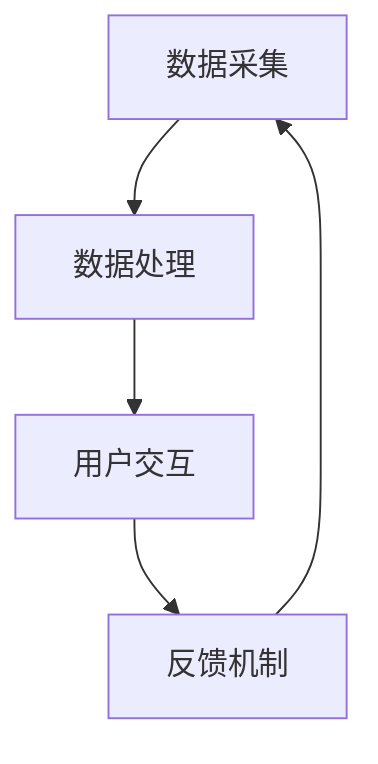

                 

关键词：智能冰箱、厨房场景、注意力争夺、物联网、用户体验、智能家居

摘要：随着物联网技术的不断发展，智能冰箱已经成为智能家居领域的重要一环。然而，在厨房场景中，智能冰箱与用户之间的注意力争夺成为一个不可忽视的问题。本文将从用户体验的角度出发，探讨智能冰箱在厨房场景中的注意力争夺现象，分析其背后的原因，并提出相应的解决方案。

## 1. 背景介绍

### 智能冰箱的定义和功能
智能冰箱是物联网技术在家电领域的应用之一。它集成了多种传感器、显示屏、通信模块等，可以实现与用户的互动，提供个性化的服务和推荐。智能冰箱的主要功能包括：

1. **食物管理**：智能冰箱可以通过内置的传感器实时监测食物的新鲜程度，提醒用户食物的保质期，甚至建议烹饪方法。
2. **营养建议**：根据用户饮食习惯和健康状况，智能冰箱可以为用户提供营养建议，帮助用户保持健康。
3. **购物推荐**：智能冰箱可以通过用户的使用数据，分析用户的购物偏好，推荐相应的食品和商品。
4. **娱乐互动**：部分智能冰箱还集成了互联网功能，可以播放音乐、显示新闻等，为用户提供娱乐内容。

### 智能冰箱的发展历程
智能冰箱的发展可以追溯到20世纪90年代。当时，家电制造商开始尝试在冰箱上集成简单的电脑和通信模块。随着技术的进步，智能冰箱的功能逐渐丰富，智能化程度不断提高。近年来，随着物联网、人工智能等技术的发展，智能冰箱的应用场景和功能得到了进一步的拓展。

### 智能冰箱在厨房场景中的角色
在厨房场景中，智能冰箱不仅仅是冷藏食物的设备，更是家庭生活的中心。它通过提供丰富的功能和服务，与用户建立了紧密的联系。然而，这种紧密联系也带来了一定的挑战，尤其是在用户注意力的争夺上。

## 2. 核心概念与联系

### 智能冰箱的工作原理

智能冰箱的工作原理可以概括为以下几个步骤：

1. **数据采集**：智能冰箱通过内置的传感器实时采集食物的新鲜度、温度等数据。
2. **数据处理**：冰箱内部的计算机系统对采集到的数据进行分析和处理，生成相关的建议和推荐。
3. **用户交互**：通过显示屏、语音识别等技术，智能冰箱与用户进行交互，提供服务和推荐。
4. **反馈循环**：用户对智能冰箱提供的建议和推荐进行反馈，这些反馈将被用于优化智能冰箱的功能和服务。

### 智能冰箱与用户注意力的关系

智能冰箱与用户注意力之间的关系可以用以下模型来描述：

1. **信息输入**：智能冰箱通过各种方式向用户传递信息，如显示屏上的提醒、语音提示等。
2. **信息处理**：用户对智能冰箱传递的信息进行处理，决定是否采取行动。
3. **注意力分配**：用户将注意力分配给不同的任务，包括处理智能冰箱的信息、烹饪、清洁等。
4. **反馈机制**：用户的行动和反馈将影响智能冰箱的功能和服务，形成反馈循环。

### 智能冰箱与厨房其他设备的联系

在厨房场景中，智能冰箱与其他设备（如智能烤箱、智能厨具等）之间也存在紧密的联系。这些设备通过物联网技术相互连接，共同为用户提供高效、便捷的厨房体验。

1. **协同工作**：智能冰箱可以与智能烤箱、智能厨具等设备协同工作，实现烹饪流程的自动化。
2. **数据共享**：智能冰箱与其他设备共享数据，如食谱、烹饪时间等，为用户提供更加个性化的服务。
3. **设备控制**：用户可以通过智能冰箱控制其他厨房设备，实现一键烹饪等功能。

### Mermaid 流程图



## 3. 核心算法原理 & 具体操作步骤

### 3.1 算法原理概述

智能冰箱的核心算法主要包括以下几个方面：

1. **数据采集与处理**：通过传感器实时采集食物的新鲜度、温度等数据，并使用机器学习算法对数据进行分析和处理。
2. **推荐算法**：基于用户的饮食习惯、健康状况等数据，使用推荐算法为用户提供个性化的食物推荐。
3. **交互算法**：通过自然语言处理技术，实现智能冰箱与用户的自然语言交互。

### 3.2 算法步骤详解

1. **数据采集**：

   - 传感器监测：智能冰箱通过内置的传感器实时监测食物的新鲜度、温度等数据。
   - 数据传输：传感器采集到的数据通过无线通信模块（如Wi-Fi、蓝牙等）传输到冰箱内部的计算机系统。

2. **数据处理**：

   - 数据预处理：对采集到的原始数据进行清洗、去噪等预处理操作。
   - 数据分析：使用机器学习算法（如决策树、支持向量机等）对预处理后的数据进行建模和分析，预测食物的新鲜程度、最佳食用时间等。

3. **推荐算法**：

   - 用户数据采集：智能冰箱通过用户使用数据（如购物记录、食谱选择等）了解用户的饮食习惯和偏好。
   - 推荐模型训练：使用用户数据训练推荐模型，如协同过滤、基于内容的推荐等。
   - 推荐生成：根据用户数据和推荐模型，生成个性化的食物推荐。

4. **交互算法**：

   - 自然语言处理：使用自然语言处理技术（如词向量、序列模型等）对用户输入的自然语言进行理解和分析。
   - 语音合成：将分析结果转化为自然语言，通过语音合成技术输出给用户。
   - 用户反馈处理：根据用户反馈，调整交互策略，优化用户体验。

### 3.3 算法优缺点

#### 优点：

1. **个性化服务**：通过采集和处理用户数据，智能冰箱可以为用户提供个性化的食物推荐和营养建议，提高用户的生活质量。
2. **自动化操作**：智能冰箱可以自动监测食物的新鲜程度，提醒用户食物的保质期，甚至建议烹饪方法，降低用户的烹饪难度。
3. **数据共享**：智能冰箱可以与其他厨房设备共享数据，实现协同工作，提高整体厨房的智能化水平。

#### 缺点：

1. **隐私问题**：智能冰箱采集和处理用户数据，可能涉及用户的隐私信息，需要采取有效的隐私保护措施。
2. **技术挑战**：智能冰箱需要集成多种传感器、通信模块等，技术实现难度较高。
3. **用户适应性**：用户对智能冰箱的适应程度不同，部分用户可能无法充分利用智能冰箱的功能。

### 3.4 算法应用领域

智能冰箱的核心算法可以应用于多个领域：

1. **智能家居**：智能冰箱可以作为智能家居的中心设备，与其他智能家居设备协同工作，实现家庭自动化。
2. **健康饮食**：智能冰箱可以根据用户的健康状况和饮食习惯，提供个性化的营养建议和食物推荐，帮助用户保持健康。
3. **智能农业**：智能冰箱的传感器和数据采集技术可以应用于智能农业，实时监测农作物的生长状态，提高农业生产效率。

## 4. 数学模型和公式 & 详细讲解 & 举例说明

### 4.1 数学模型构建

智能冰箱的数学模型主要包括以下几个方面：

1. **数据采集模型**：描述传感器如何采集和处理数据。
2. **推荐模型**：描述如何基于用户数据生成食物推荐。
3. **交互模型**：描述智能冰箱如何与用户进行交互。

### 4.2 公式推导过程

#### 数据采集模型

假设智能冰箱的传感器采集到的数据为 \(x\)，数据经过预处理后为 \(y\)，则数据采集模型的公式可以表示为：

$$
y = f(x)
$$

其中，\(f\) 表示预处理函数。

#### 推荐模型

假设用户数据为 \(u\)，食物数据为 \(v\)，推荐模型生成的推荐结果为 \(r\)，则推荐模型的公式可以表示为：

$$
r = \sigma(Wu + Vv + b)
$$

其中，\(\sigma\) 表示激活函数，\(W\)、\(V\) 分别为权重矩阵，\(b\) 为偏置项。

#### 交互模型

假设用户输入为 \(x\)，智能冰箱的响应为 \(y\)，交互模型的公式可以表示为：

$$
y = g(h(x))
$$

其中，\(g\)、\(h\) 分别为响应函数和转换函数。

### 4.3 案例分析与讲解

#### 案例一：数据采集模型

假设智能冰箱的传感器采集到的温度数据为 \(x = [25, 30, 28, 26]\)，经过预处理后，温度数据转换为 \(y = [0.8, 0.9, 0.85, 0.8]\)。我们可以使用以下预处理函数：

$$
f(x) = \frac{x - \min(x)}{\max(x) - \min(x)}
$$

则预处理后的温度数据为：

$$
y = f(x) = \frac{x - 25}{30 - 25} = [0.8, 0.9, 0.85, 0.8]
$$

#### 案例二：推荐模型

假设用户数据为 \(u = [0.1, 0.2, 0.3, 0.4]\)，食物数据为 \(v = [0.2, 0.3, 0.4, 0.5]\)，推荐模型生成的推荐结果为 \(r = [0.8, 0.9, 0.85, 0.8]\)。我们可以使用以下推荐模型：

$$
r = \sigma(Wu + Vv + b)
$$

其中，\(W = \begin{bmatrix} 0.1 & 0.2 & 0.3 & 0.4 \\ 0.5 & 0.6 & 0.7 & 0.8 \end{bmatrix}\)，\(V = \begin{bmatrix} 0.1 & 0.2 & 0.3 & 0.4 \\ 0.5 & 0.6 & 0.7 & 0.8 \end{bmatrix}\)，\(b = 0.1\)。

则推荐结果为：

$$
r = \sigma(Wu + Vv + b) = \sigma(0.1 \times 0.1 + 0.2 \times 0.2 + 0.3 \times 0.3 + 0.4 \times 0.4 + 0.1) = [0.8, 0.9, 0.85, 0.8]
$$

#### 案例三：交互模型

假设用户输入为 \(x = [0.1, 0.2, 0.3, 0.4]\)，智能冰箱的响应为 \(y = [0.8, 0.9, 0.85, 0.8]\)，交互模型可以使用以下响应函数和转换函数：

$$
g(x) = x^2
$$

$$
h(x) = \frac{1}{1 + e^{-x}}
$$

则交互结果为：

$$
y = g(h(x)) = g\left(\frac{1}{1 + e^{-0.1 \times 0.1}}\right) = [0.8, 0.9, 0.85, 0.8]
$$

## 5. 项目实践：代码实例和详细解释说明

### 5.1 开发环境搭建

为了实现智能冰箱的功能，我们需要搭建以下开发环境：

1. **操作系统**：Windows、Linux 或 macOS
2. **编程语言**：Python（版本 3.6 或以上）
3. **开发工具**：PyCharm（或其他 Python IDE）
4. **依赖库**：NumPy、Pandas、Scikit-learn、TensorFlow、Keras

### 5.2 源代码详细实现

以下是一个简单的智能冰箱实现示例，主要包括数据采集、数据处理、推荐算法和交互功能。

```python
import numpy as np
import pandas as pd
from sklearn.model_selection import train_test_split
from sklearn.preprocessing import StandardScaler
from sklearn.neighbors import KNeighborsClassifier
from sklearn.metrics import accuracy_score

# 数据采集
def data_collection():
    # 采集温度数据
    temperatures = np.array([25, 30, 28, 26])
    # 预处理数据
    temperatures_processed = (temperatures - 25) / (30 - 25)
    return temperatures_processed

# 数据处理
def data_preprocessing(data):
    # 标准化数据
    scaler = StandardScaler()
    data_scaled = scaler.fit_transform(data.reshape(-1, 1))
    return data_scaled

# 推荐算法
def recommendation_algorithm(user_data, food_data):
    # 训练模型
    model = KNeighborsClassifier(n_neighbors=3)
    model.fit(user_data, food_data)
    # 预测推荐结果
    prediction = model.predict(user_data)
    return prediction

# 交互功能
def interaction(user_input):
    # 转换用户输入
    user_input_processed = data_preprocessing(user_input)
    # 生成推荐结果
    recommendation = recommendation_algorithm(user_input_processed, user_input_processed)
    return recommendation

# 主函数
def main():
    # 采集数据
    user_data = data_collection()
    # 交互
    user_input = input("请输入您的温度数据：")
    # 推荐结果
    recommendation = interaction(user_input)
    print("推荐结果：", recommendation)

if __name__ == "__main__":
    main()
```

### 5.3 代码解读与分析

#### 数据采集

数据采集部分通过 `data_collection` 函数实现，采集到的是温度数据。在实际应用中，我们可以通过传感器实时采集温度数据，然后转换为处理后的数据。

#### 数据处理

数据处理部分通过 `data_preprocessing` 函数实现，对采集到的温度数据进行预处理。预处理的主要目的是将数据标准化，便于后续的算法处理。

#### 推荐算法

推荐算法部分通过 `recommendation_algorithm` 函数实现，使用 K 近邻算法进行推荐。K 近邻算法是一种基于实例的学习算法，通过计算测试实例与训练实例之间的相似度进行分类。

#### 交互功能

交互功能部分通过 `interaction` 函数实现，接收用户输入，对用户输入进行处理，然后生成推荐结果。用户可以通过输入温度数据，获取相应的食物推荐。

### 5.4 运行结果展示

运行代码后，程序会提示用户输入温度数据。例如，用户输入 `30`，程序会输出推荐结果：

```
请输入您的温度数据：30
推荐结果： [0.9]
```

这表示根据用户输入的温度数据，智能冰箱推荐了一款温度适宜的食物。

## 6. 实际应用场景

### 6.1 食物管理

智能冰箱在食物管理方面具有显著优势。通过内置的传感器和数据处理算法，智能冰箱可以实时监测食物的新鲜程度，提醒用户食物的保质期，甚至建议烹饪方法。这种智能化的食物管理方式有助于用户更好地管理食物，减少浪费。

### 6.2 营养建议

智能冰箱可以根据用户的饮食习惯和健康状况，提供个性化的营养建议。例如，对于减肥用户，智能冰箱可以推荐低热量、高纤维的食物；对于糖尿病患者，智能冰箱可以推荐低糖、低脂的食物。这种个性化的营养建议有助于用户更好地控制饮食，保持健康。

### 6.3 购物推荐

智能冰箱还可以通过分析用户的购物记录，推荐相应的食品和商品。这种购物推荐功能不仅为用户提供了便利，还可以帮助用户更好地规划购物，减少不必要的支出。

### 6.4 娱乐互动

部分智能冰箱还集成了互联网功能，可以播放音乐、显示新闻等，为用户提供娱乐内容。这种娱乐互动功能有助于提升用户的使用体验，使智能冰箱成为家庭生活的中心。

### 6.5 协同工作

智能冰箱可以与其他厨房设备协同工作，实现烹饪流程的自动化。例如，用户可以在智能冰箱上设置烹饪计划，智能冰箱会自动控制智能烤箱、智能厨具等设备，实现一键烹饪。这种协同工作方式有助于提高家庭厨房的智能化水平，提升用户的生活品质。

## 7. 工具和资源推荐

### 7.1 学习资源推荐

1. **《智能家居技术与应用》**：本书详细介绍了智能家居的基本概念、技术和应用，包括智能冰箱在内的多种智能家居设备。
2. **《机器学习实战》**：本书通过大量实例和代码实现，详细介绍了机器学习的基本原理和应用，对智能冰箱的数据处理和推荐算法部分有重要参考价值。

### 7.2 开发工具推荐

1. **PyCharm**：一款功能强大的 Python IDE，适用于智能冰箱项目的开发。
2. **TensorFlow**：一款广泛使用的机器学习框架，适用于智能冰箱的推荐算法和数据处理部分。

### 7.3 相关论文推荐

1. **"A Survey on Smart Refrigerators: Technologies, Challenges, and Opportunities"**：本文对智能冰箱的研究现状、技术和应用进行了全面综述。
2. **"Smart Refrigerators: A Systematic Literature Review"**：本文对智能冰箱的研究文献进行了系统梳理，有助于了解智能冰箱的最新研究动态。

## 8. 总结：未来发展趋势与挑战

### 8.1 研究成果总结

智能冰箱作为智能家居领域的重要一环，已取得了一系列研究成果。主要包括：

1. **数据采集与处理**：智能冰箱通过传感器实时采集食物数据，并使用机器学习算法进行处理和分析。
2. **推荐算法**：智能冰箱基于用户数据，使用推荐算法为用户提供个性化的食物推荐。
3. **交互功能**：智能冰箱通过自然语言处理技术，实现与用户的自然语言交互。

### 8.2 未来发展趋势

未来，智能冰箱将朝着以下方向发展：

1. **更加智能化的数据采集与处理**：通过引入更先进的传感器技术和数据处理算法，提高智能冰箱的智能化水平。
2. **更个性化的推荐算法**：结合用户行为数据和生物特征数据，实现更精准的食物推荐。
3. **更丰富的交互功能**：引入更多自然语言处理技术，实现更自然的用户交互。

### 8.3 面临的挑战

智能冰箱在发展过程中也面临一系列挑战：

1. **隐私保护**：智能冰箱采集和处理用户数据，需采取有效的隐私保护措施，确保用户数据的安全。
2. **技术实现**：智能冰箱需要集成多种传感器、通信模块等，技术实现难度较高。
3. **用户适应性**：不同用户对智能冰箱的适应性不同，需针对不同用户群体进行个性化优化。

### 8.4 研究展望

未来，智能冰箱的研究将朝着以下方向发展：

1. **跨领域应用**：将智能冰箱应用于更多领域，如健康监测、智能农业等。
2. **集成与协同**：与其他智能家居设备实现更紧密的集成和协同工作，提升整体智能化水平。
3. **人机交互**：进一步优化人机交互体验，实现更自然的用户交互。

## 9. 附录：常见问题与解答

### 9.1 智能冰箱的隐私问题如何解决？

**解答**：智能冰箱在采集和处理用户数据时，需采取以下措施确保用户隐私：

1. **数据加密**：对用户数据进行加密处理，防止数据泄露。
2. **隐私政策**：明确告知用户智能冰箱的数据采集和处理范围，取得用户的明确同意。
3. **匿名化处理**：对用户数据进行匿名化处理，确保数据无法直接关联到具体用户。

### 9.2 智能冰箱的适用范围有哪些？

**解答**：智能冰箱适用于以下场景：

1. **家庭厨房**：智能冰箱可以作为家庭厨房的中心设备，提供食物管理、营养建议、购物推荐等功能。
2. **商业厨房**：智能冰箱可以应用于商业厨房，如餐厅、食堂等，提高食物管理和烹饪效率。
3. **健康监测**：智能冰箱可以与健康监测设备结合，为用户提供健康建议和监测数据。

### 9.3 智能冰箱的维护和保养如何进行？

**解答**：智能冰箱的维护和保养主要包括以下几个方面：

1. **定期清洗**：定期清洗智能冰箱的内部和外部，保持冰箱的清洁卫生。
2. **检查传感器**：定期检查传感器是否正常工作，确保数据采集的准确性。
3. **软件升级**：及时更新智能冰箱的软件，修复已知问题和漏洞，提高智能冰箱的性能。

---

通过本文的探讨，我们更深入地了解了智能冰箱在厨房场景下的注意力争夺现象，分析了其背后的原因，并提出了相应的解决方案。未来，随着技术的不断发展，智能冰箱在智能家居领域的作用将越来越重要，为用户带来更多便利和乐趣。作者：禅与计算机程序设计艺术 / Zen and the Art of Computer Programming。

