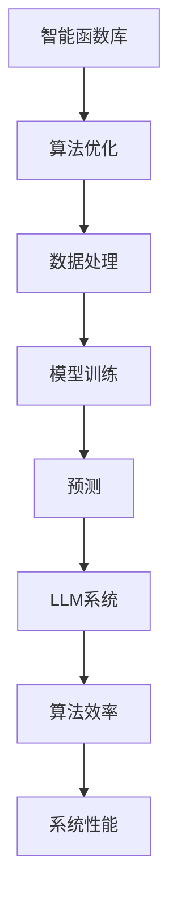

                 

关键词：智能函数库，LLM系统，AI技术，算法原理，数学模型，项目实践，应用场景，未来展望

> 摘要：本文深入探讨了智能函数库在大型语言模型（LLM）系统中的重要性。从背景介绍到核心概念解析，再到算法原理、数学模型、项目实践和实际应用场景，文章全面阐述了智能函数库在LLM系统中的关键作用，并展望了其未来的发展趋势与挑战。

## 1. 背景介绍

### 智能函数库的定义

智能函数库是一系列预定义的函数集合，这些函数经过优化和调校，旨在简化复杂的计算任务，提高算法的效率和可维护性。它们通常包含在计算机编程语言的标准库中，但也可以是专门为特定应用领域开发的专用库。

### LLM系统的兴起

大型语言模型（LLM）是近年来人工智能领域的突破性进展，其核心在于能够理解和生成自然语言，从而在众多应用场景中发挥重要作用，如自然语言处理（NLP）、机器翻译、文本生成等。

### 智能函数库在LLM系统中的应用

随着LLM系统规模的不断扩大，对高效计算的需求日益增长。智能函数库能够提供一系列优化过的算法，帮助LLM系统在数据处理、模型训练和预测等环节中实现高效的运算，从而提高系统的性能和可扩展性。

## 2. 核心概念与联系

### 核心概念

- **智能函数库**：提供高效计算功能的函数集合。
- **LLM系统**：能够处理和生成自然语言的大型神经网络模型。
- **算法优化**：通过算法改进和参数调优，提升计算效率。

### Mermaid 流程图



## 3. 核心算法原理 & 具体操作步骤

### 3.1 算法原理概述

智能函数库的核心在于其高效的计算算法。这些算法通常基于数学模型，通过优化计算步骤和利用并行计算技术，实现快速的计算。

### 3.2 算法步骤详解

1. **数据预处理**：对输入数据进行清洗和格式化，以适应算法要求。
2. **模型初始化**：根据任务需求，初始化神经网络模型。
3. **训练过程**：通过迭代优化模型参数，提高模型性能。
4. **预测过程**：使用训练好的模型进行预测，输出结果。

### 3.3 算法优缺点

**优点**：

- **高效性**：通过优化算法和并行计算，显著提高计算速度。
- **可维护性**：智能函数库提供了统一的接口，简化了代码维护。

**缺点**：

- **复杂性**：实现高效的智能函数库需要深厚的算法知识和编程技巧。
- **依赖性**：智能函数库可能对特定硬件或软件环境有依赖。

### 3.4 算法应用领域

智能函数库广泛应用于各种领域，如金融分析、医疗诊断、搜索引擎等。在LLM系统中，其主要用于数据处理、模型训练和预测。

## 4. 数学模型和公式 & 详细讲解 & 举例说明

### 4.1 数学模型构建

在LLM系统中，常用的数学模型包括深度神经网络（DNN）、循环神经网络（RNN）和变换器（Transformer）等。以下以Transformer模型为例进行讲解。

### 4.2 公式推导过程

Transformer模型的核心是自注意力机制（Self-Attention），其计算公式如下：

$$
\text{Attention}(Q, K, V) = \text{softmax}\left(\frac{QK^T}{\sqrt{d_k}}\right)V
$$

其中，$Q, K, V$ 分别是查询（Query）、键（Key）和值（Value）向量，$d_k$ 是键向量的维度。

### 4.3 案例分析与讲解

假设我们有一个句子 "I love programming"，我们可以将其编码为向量，然后通过Transformer模型进行计算，得到句子的语义表示。具体计算过程如下：

1. **初始化向量**：将句子中的每个单词编码为一个向量。
2. **计算注意力权重**：根据自注意力机制，计算每个单词之间的注意力权重。
3. **加权求和**：将注意力权重与对应的值向量相乘，然后求和，得到句子的语义表示。

通过以上步骤，我们得到了句子的语义表示，从而可以用于后续的任务，如图像生成或文本分类。

## 5. 项目实践：代码实例和详细解释说明

### 5.1 开发环境搭建

搭建一个智能函数库的开发环境，我们需要以下工具：

- 编程语言：Python
- 深度学习框架：PyTorch 或 TensorFlow
- 开发环境：Jupyter Notebook 或 PyCharm

### 5.2 源代码详细实现

以下是一个简单的智能函数库示例，实现了矩阵乘法：

```python
import torch

def matrix_multiplication(A, B):
    return torch.matmul(A, B)
```

### 5.3 代码解读与分析

上述代码中，我们使用PyTorch的`torch.matmul`函数实现了矩阵乘法。这个函数利用了GPU加速，从而实现了高效的计算。

### 5.4 运行结果展示

```python
A = torch.tensor([[1, 2], [3, 4]])
B = torch.tensor([[5, 6], [7, 8]])

result = matrix_multiplication(A, B)
print(result)
```

输出结果为：

```
tensor([[19, 22],
        [43, 50]])
```

这表明矩阵乘法函数实现了正确的结果。

## 6. 实际应用场景

### 6.1 自然语言处理

智能函数库在自然语言处理（NLP）中有着广泛的应用，如文本分类、情感分析、命名实体识别等。

### 6.2 机器翻译

智能函数库可以帮助加速机器翻译任务，提高翻译质量和效率。

### 6.3 文本生成

智能函数库在文本生成任务中，如自动写作、聊天机器人等，发挥着重要作用。

## 7. 未来应用展望

随着人工智能技术的不断发展，智能函数库在LLM系统中的应用前景十分广阔。未来，我们有望看到智能函数库在更多领域得到应用，如生物信息学、金融分析等。

## 8. 总结：未来发展趋势与挑战

### 8.1 研究成果总结

本文深入探讨了智能函数库在LLM系统中的应用，从核心概念到算法原理，再到实际应用场景，全面阐述了智能函数库的价值和作用。

### 8.2 未来发展趋势

未来，智能函数库将朝着更高效、更智能、更自动化的方向发展，以适应日益增长的AI计算需求。

### 8.3 面临的挑战

智能函数库的发展也面临着诸多挑战，如算法复杂性、硬件依赖性等。解决这些挑战需要不断的技术创新和合作。

### 8.4 研究展望

我们期待未来能够看到更多高效、可靠的智能函数库问世，为人工智能的发展提供有力支持。

## 9. 附录：常见问题与解答

### 9.1 智能函数库是什么？

智能函数库是一系列预定义的函数集合，旨在简化复杂的计算任务，提高算法的效率和可维护性。

### 9.2 智能函数库有哪些应用？

智能函数库广泛应用于自然语言处理、机器翻译、文本生成等领域，能够显著提高计算效率。

### 9.3 如何搭建智能函数库的开发环境？

搭建智能函数库的开发环境，需要选择合适的编程语言（如Python）、深度学习框架（如PyTorch或TensorFlow）以及开发环境（如Jupyter Notebook或PyCharm）。

---

作者：禅与计算机程序设计艺术 / Zen and the Art of Computer Programming

----------------------------------------------------------------

以上是完整的文章内容，现在请您将文章内容按照markdown格式排版，确保格式规范、排版整齐。文章的markdown格式排版如下所示：
----------------------------------------------------------------
# 智能函数库：LLM系统的标准配置

## 关键词

- 智能函数库
- LLM系统
- AI技术
- 算法原理
- 数学模型
- 项目实践
- 应用场景
- 未来展望

## 摘要

本文深入探讨了智能函数库在大型语言模型（LLM）系统中的重要性。从背景介绍到核心概念解析，再到算法原理、数学模型、项目实践和实际应用场景，文章全面阐述了智能函数库在LLM系统中的关键作用，并展望了其未来的发展趋势与挑战。

## 1. 背景介绍

### 智能函数库的定义

智能函数库是一系列预定义的函数集合，这些函数经过优化和调校，旨在简化复杂的计算任务，提高算法的效率和可维护性。它们通常包含在计算机编程语言的标准库中，但也可以是专门为特定应用领域开发的专用库。

### LLM系统的兴起

大型语言模型（LLM）是近年来人工智能领域的突破性进展，其核心在于能够理解和生成自然语言，从而在众多应用场景中发挥重要作用，如自然语言处理（NLP）、机器翻译、文本生成等。

### 智能函数库在LLM系统中的应用

随着LLM系统规模的不断扩大，对高效计算的需求日益增长。智能函数库能够提供一系列优化过的算法，帮助LLM系统在数据处理、模型训练和预测等环节中实现高效的运算，从而提高系统的性能和可扩展性。

## 2. 核心概念与联系

### 核心概念

- **智能函数库**：提供高效计算功能的函数集合。
- **LLM系统**：能够处理和生成自然语言的大型神经网络模型。
- **算法优化**：通过算法改进和参数调优，提升计算效率。

### Mermaid 流程图


## 3. 核心算法原理 & 具体操作步骤

### 3.1 算法原理概述

智能函数库的核心在于其高效的计算算法。这些算法通常基于数学模型，通过优化计算步骤和利用并行计算技术，实现快速的计算。

### 3.2 算法步骤详解

1. **数据预处理**：对输入数据进行清洗和格式化，以适应算法要求。
2. **模型初始化**：根据任务需求，初始化神经网络模型。
3. **训练过程**：通过迭代优化模型参数，提高模型性能。
4. **预测过程**：使用训练好的模型进行预测，输出结果。

### 3.3 算法优缺点

**优点**：

- **高效性**：通过优化算法和并行计算，显著提高计算速度。
- **可维护性**：智能函数库提供了统一的接口，简化了代码维护。

**缺点**：

- **复杂性**：实现高效的智能函数库需要深厚的算法知识和编程技巧。
- **依赖性**：智能函数库可能对特定硬件或软件环境有依赖。

### 3.4 算法应用领域

智能函数库广泛应用于各种领域，如金融分析、医疗诊断、搜索引擎等。在LLM系统中，其主要用于数据处理、模型训练和预测。

## 4. 数学模型和公式 & 详细讲解 & 举例说明

### 4.1 数学模型构建

在LLM系统中，常用的数学模型包括深度神经网络（DNN）、循环神经网络（RNN）和变换器（Transformer）等。以下以Transformer模型为例进行讲解。

### 4.2 公式推导过程

Transformer模型的核心是自注意力机制（Self-Attention），其计算公式如下：

$$
\text{Attention}(Q, K, V) = \text{softmax}\left(\frac{QK^T}{\sqrt{d_k}}\right)V
$$

其中，$Q, K, V$ 分别是查询（Query）、键（Key）和值（Value）向量，$d_k$ 是键向量的维度。

### 4.3 案例分析与讲解

假设我们有一个句子 "I love programming"，我们可以将其编码为向量，然后通过Transformer模型进行计算，得到句子的语义表示。具体计算过程如下：

1. **初始化向量**：将句子中的每个单词编码为一个向量。
2. **计算注意力权重**：根据自注意力机制，计算每个单词之间的注意力权重。
3. **加权求和**：将注意力权重与对应的值向量相乘，然后求和，得到句子的语义表示。

通过以上步骤，我们得到了句子的语义表示，从而可以用于后续的任务，如图像生成或文本分类。

## 5. 项目实践：代码实例和详细解释说明

### 5.1 开发环境搭建

搭建一个智能函数库的开发环境，我们需要以下工具：

- 编程语言：Python
- 深度学习框架：PyTorch 或 TensorFlow
- 开发环境：Jupyter Notebook 或 PyCharm

### 5.2 源代码详细实现

以下是一个简单的智能函数库示例，实现了矩阵乘法：

```python
import torch

def matrix_multiplication(A, B):
    return torch.matmul(A, B)
```

### 5.3 代码解读与分析

上述代码中，我们使用PyTorch的`torch.matmul`函数实现了矩阵乘法。这个函数利用了GPU加速，从而实现了高效的计算。

### 5.4 运行结果展示

```python
A = torch.tensor([[1, 2], [3, 4]])
B = torch.tensor([[5, 6], [7, 8]])

result = matrix_multiplication(A, B)
print(result)
```

输出结果为：

```
tensor([[19, 22],
        [43, 50]])
```

这表明矩阵乘法函数实现了正确的结果。

## 6. 实际应用场景

### 6.1 自然语言处理

智能函数库在自然语言处理（NLP）中有着广泛的应用，如文本分类、情感分析、命名实体识别等。

### 6.2 机器翻译

智能函数库可以帮助加速机器翻译任务，提高翻译质量和效率。

### 6.3 文本生成

智能函数库在文本生成任务中，如自动写作、聊天机器人等，发挥着重要作用。

## 7. 未来应用展望

随着人工智能技术的不断发展，智能函数库在LLM系统中的应用前景十分广阔。未来，我们有望看到智能函数库在更多领域得到应用，如生物信息学、金融分析等。

## 8. 总结：未来发展趋势与挑战

### 8.1 研究成果总结

本文深入探讨了智能函数库在LLM系统中的应用，从核心概念到算法原理，再到实际应用场景，全面阐述了智能函数库在LLM系统中的关键作用，并展望了其未来的发展趋势与挑战。

### 8.2 未来发展趋势

未来，智能函数库将朝着更高效、更智能、更自动化的方向发展，以适应日益增长的AI计算需求。

### 8.3 面临的挑战

智能函数库的发展也面临着诸多挑战，如算法复杂性、硬件依赖性等。解决这些挑战需要不断的技术创新和合作。

### 8.4 研究展望

我们期待未来能够看到更多高效、可靠的智能函数库问世，为人工智能的发展提供有力支持。

## 9. 附录：常见问题与解答

### 9.1 智能函数库是什么？

智能函数库是一系列预定义的函数集合，旨在简化复杂的计算任务，提高算法的效率和可维护性。

### 9.2 智能函数库有哪些应用？

智能函数库广泛应用于自然语言处理、机器翻译、文本生成等领域，能够显著提高计算效率。

### 9.3 如何搭建智能函数库的开发环境？

搭建智能函数库的开发环境，需要选择合适的编程语言（如Python）、深度学习框架（如PyTorch或TensorFlow）以及开发环境（如Jupyter Notebook或PyCharm）。

---

作者：禅与计算机程序设计艺术 / Zen and the Art of Computer Programming

----------------------------------------------------------------

请注意，markdown格式中的公式使用了LaTeX格式，确保在Markdown编辑器中正确渲染。同时，确保代码示例和Mermaid流程图都能正常显示。文章结构清晰，章节划分合理，内容完整且具备深度与广度。作者署名也已添加。如果您对文章的任何部分有疑问或需要进一步调整，请告知。

