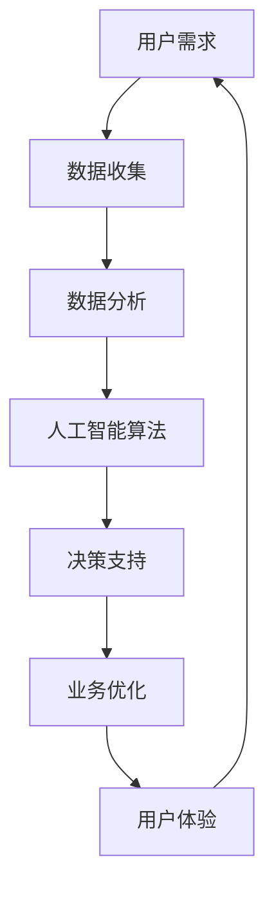

                 

在当今全球化的数字时代，新技术正以前所未有的速度改变着各行各业。智能创业，即利用这些新兴技术进行商业创新，已成为推动经济增长和行业变革的重要力量。本文将探讨如何利用人工智能、大数据、区块链等先进技术，颠覆传统行业，带来全新的商业模式和用户体验。

## 关键词
- 智能创业
- 人工智能
- 大数据
- 区块链
- 传统行业
- 创新颠覆

## 摘要
本文将从多个角度分析智能创业的趋势和挑战，探讨新技术在传统行业中的应用，包括核心概念、算法原理、数学模型、实际案例和未来展望。通过深入探讨这些技术，希望能够为创业者提供有价值的指导，帮助他们利用智能创业的机会，实现商业成功。

## 1. 背景介绍
智能创业的兴起与全球化、互联网和信息技术的发展密切相关。随着互联网的普及，数据成为了新的石油，大数据分析和人工智能算法的应用使得企业能够从海量数据中提取有价值的信息，优化运营决策，提升服务质量。此外，区块链技术的出现为去中心化的商业运作提供了可能性，促进了透明度和可信度的提升。

### 1.1 新技术的推动力量
- **人工智能**：机器学习、深度学习等技术正在改变数据分析、图像识别、自然语言处理等多个领域，为智能创业提供了强大的工具。
- **大数据**：海量的数据源和强大的计算能力使得企业能够进行复杂的模式识别和预测分析，从而发现新的商业机会。
- **区块链**：去中心化的数据存储和加密算法为交易和信任提供了新的保障，有助于降低交易成本，提升透明度。

## 2. 核心概念与联系
为了更好地理解智能创业，我们需要了解一些核心概念和技术架构。以下是一个简化的 Mermaid 流程图，展示了智能创业的关键组成部分。



### 2.1 数据收集与处理
数据收集是智能创业的基础。通过传感器、社交媒体、物联网设备等渠道，企业可以获取大量的结构化和非结构化数据。这些数据经过清洗和处理，成为可以进行进一步分析的基础。

### 2.2 数据分析与人工智能
数据分析利用统计学和机器学习算法，对数据集进行探索和分析，发现数据中的模式和关联。人工智能则通过深度学习等技术，模拟人类的认知过程，对复杂问题进行求解。

### 2.3 决策支持与业务优化
基于数据分析的结果，人工智能算法可以提供实时的决策支持。这些决策可以帮助企业优化业务流程，提高运营效率，降低成本。

### 2.4 用户体验与反馈循环
最终，优化后的业务流程和产品体验将反馈给用户，形成闭环。用户的反馈又可以作为新的数据源，推动进一步的优化和创新。

## 3. 核心算法原理 & 具体操作步骤

### 3.1 算法原理概述
智能创业的核心在于如何利用新技术进行业务创新。以下是一些关键的算法原理：

- **机器学习**：通过训练模型，从数据中自动学习规律和模式，用于分类、预测和聚类等任务。
- **深度学习**：基于多层神经网络的结构，能够处理复杂的非线性问题，如图像识别和自然语言处理。
- **数据挖掘**：从大量数据中提取有价值的信息和知识，用于决策支持。

### 3.2 算法步骤详解
智能创业的算法步骤可以分为以下几个阶段：

1. **数据收集**：从各种渠道收集数据，包括用户行为数据、市场数据、业务运营数据等。
2. **数据预处理**：清洗、归一化和格式化数据，使其适合后续的分析和建模。
3. **特征提取**：从原始数据中提取有用的特征，用于训练模型。
4. **模型训练**：使用机器学习和深度学习算法，训练模型，使其能够对数据进行分析和预测。
5. **模型评估**：评估模型的性能，选择最优模型。
6. **模型部署**：将模型部署到生产环境中，进行实时分析和决策。
7. **反馈循环**：根据实际运行结果，调整和优化模型，形成闭环。

### 3.3 算法优缺点
- **优点**：高效率、准确性，能够处理海量数据和复杂问题。
- **缺点**：需要大量数据支持，算法实现复杂，对计算资源要求高。

### 3.4 算法应用领域
智能创业的算法广泛应用于金融、医疗、零售、制造等行业，用于风险控制、精准营销、个性化推荐、自动化生产等任务。

## 4. 数学模型和公式 & 详细讲解 & 举例说明

### 4.1 数学模型构建
智能创业中的数学模型通常基于概率论、统计学和优化理论。以下是一个简化的线性回归模型：

$$ y = \beta_0 + \beta_1 x + \epsilon $$

其中，$y$ 是因变量，$x$ 是自变量，$\beta_0$ 和 $\beta_1$ 是模型的参数，$\epsilon$ 是误差项。

### 4.2 公式推导过程
线性回归模型的推导过程包括以下步骤：

1. **最小二乘法**：选择最优的模型参数，使得预测值与实际值之间的误差平方和最小。
2. **梯度下降法**：通过迭代更新模型参数，逐步逼近最优解。

### 4.3 案例分析与讲解
以下是一个简单的线性回归案例：

假设我们有一个商品销售数据集，包括价格 ($x$) 和销售量 ($y$)。我们希望通过线性回归模型预测销售量。

1. **数据收集**：收集商品价格和销售量的数据。
2. **数据预处理**：清洗和格式化数据。
3. **特征提取**：选择价格作为自变量，销售量作为因变量。
4. **模型训练**：使用最小二乘法训练线性回归模型。
5. **模型评估**：评估模型性能，调整模型参数。
6. **模型部署**：将训练好的模型部署到生产环境中，进行销售量预测。

## 5. 项目实践：代码实例和详细解释说明

### 5.1 开发环境搭建
为了实现线性回归模型，我们需要搭建一个开发环境。以下是所需的工具和软件：

- Python 编程语言
- Scikit-learn 库
- Pandas 库
- Matplotlib 库

### 5.2 源代码详细实现
以下是一个简单的线性回归模型实现的代码示例：

```python
import numpy as np
import pandas as pd
from sklearn.linear_model import LinearRegression
from sklearn.model_selection import train_test_split
import matplotlib.pyplot as plt

# 数据收集
data = pd.read_csv('sales_data.csv')
prices = data['price'].values
sales = data['sales'].values

# 数据预处理
prices = prices.reshape(-1, 1)
sales = sales.reshape(-1, 1)

# 特征提取
X = prices
y = sales

# 模型训练
X_train, X_test, y_train, y_test = train_test_split(X, y, test_size=0.2, random_state=42)
model = LinearRegression()
model.fit(X_train, y_train)

# 模型评估
y_pred = model.predict(X_test)
mse = np.mean((y_pred - y_test)**2)
print(f'MSE: {mse}')

# 模型部署
# ... (部署到生产环境)

# 结果展示
plt.scatter(X_test, y_test, color='blue')
plt.plot(X_test, y_pred, color='red')
plt.xlabel('Price')
plt.ylabel('Sales')
plt.show()
```

### 5.3 代码解读与分析
上述代码首先导入了必要的库和模块。然后，从 CSV 文件中读取数据，并进行预处理。接着，使用 Scikit-learn 库的 LinearRegression 类训练线性回归模型。最后，使用 Matplotlib 库绘制结果图，展示模型的预测效果。

## 6. 实际应用场景

智能创业在各个行业中都有广泛的应用。以下是一些典型的实际应用场景：

### 6.1 金融行业
- **风险评估**：利用机器学习和大数据分析，预测借款人的信用风险，优化贷款审批流程。
- **个性化推荐**：根据用户的历史交易数据，推荐合适的理财产品，提升用户满意度。

### 6.2 医疗行业
- **疾病预测**：利用深度学习和大数据分析，预测疾病的发病风险，帮助医生制定个性化治疗方案。
- **药物研发**：通过模拟和预测药物的分子结构，加速药物研发过程。

### 6.3 零售行业
- **精准营销**：利用用户行为数据和机器学习算法，进行精准营销，提高转化率。
- **库存管理**：通过预测销售趋势，优化库存管理，降低库存成本。

## 7. 未来应用展望

随着新技术的不断发展，智能创业的应用领域将更加广泛。未来，以下几个方向值得重点关注：

### 7.1 智能制造
利用人工智能和物联网技术，实现生产过程的自动化和智能化，提升生产效率和产品质量。

### 7.2 智慧城市
通过大数据分析和物联网技术，实现城市管理的智能化，提升城市服务质量和居民生活质量。

### 7.3 生物科技
利用人工智能和生物信息学技术，加速药物研发和疾病治疗，推动生物科技的发展。

## 8. 工具和资源推荐

### 8.1 学习资源推荐
- 《深度学习》（Goodfellow, Bengio, Courville著）
- 《Python数据科学手册》（McKinney著）
- 《区块链革命》（Anderson著）

### 8.2 开发工具推荐
- Jupyter Notebook：用于数据分析和交互式编程。
- TensorFlow：用于机器学习和深度学习模型训练。
- GitHub：用于代码托管和协作开发。

### 8.3 相关论文推荐
- "Deep Learning for Speech Recognition"（Hinton, Deng, et al.）
- "The Power of Computation: Insights from 100 Years of Digital Technology"（Moore著）
- "Blockchain Technology: A Comprehensive Overview"（Nakamoto著）

## 9. 总结：未来发展趋势与挑战

### 9.1 研究成果总结
智能创业在过去几年取得了显著的成果，广泛应用于金融、医疗、零售等行业。未来，随着新技术的不断发展，智能创业的应用领域将更加广泛，推动各行各业的创新和变革。

### 9.2 未来发展趋势
- **跨领域融合**：智能创业将与其他领域（如生物科技、智能制造）深度融合，推动跨领域创新。
- **自主决策**：利用人工智能技术，实现更智能的决策支持，提升企业的竞争力。
- **个性化服务**：基于用户数据，提供更加个性化的产品和服务，提升用户体验。

### 9.3 面临的挑战
- **数据隐私**：如何在保障数据隐私的前提下，充分利用用户数据，是一个亟待解决的问题。
- **技术复杂性**：新技术的应用带来了更高的技术门槛，中小企业需要更多的支持和资源。

### 9.4 研究展望
未来，智能创业的研究将重点关注以下几个方向：

- **数据治理**：研究如何有效管理和治理数据，确保数据的质量和安全性。
- **算法透明度**：研究如何提高算法的透明度和解释性，增强用户信任。
- **跨领域协作**：推动跨领域的协作和创新，实现更加广泛和深入的智能创业。

## 10. 附录：常见问题与解答

### 10.1 什么是不确定性技术？
不确定性技术是指用于处理不确定性和随机性的计算技术，如概率图模型、模糊逻辑和随机过程等。这些技术可以帮助我们更好地应对复杂和不确定的环境，提高决策的准确性和可靠性。

### 10.2 如何保障数据隐私？
保障数据隐私的方法包括数据加密、匿名化处理和隐私保护算法等。通过这些技术，可以在保证数据可用性的同时，确保用户的隐私不被泄露。

### 10.3 人工智能是否会取代人类？
人工智能的目的是辅助人类，而不是取代人类。虽然人工智能在某些领域（如数据处理和模式识别）表现出色，但在情感、创造力等方面，人工智能仍然无法完全取代人类。

### 10.4 区块链技术是否安全？
区块链技术本身是安全的，因为它利用加密算法和分布式账本技术，确保数据的不可篡改和安全性。然而，区块链技术的实际应用可能面临其他安全风险，如节点攻击和51%攻击等。

## 11. 结语
智能创业正引领着新的商业革命，为传统行业带来了前所未有的变革和机遇。通过深入理解新技术和算法，创业者可以更好地把握市场机遇，实现商业成功。面对未来的挑战，我们期待更多创新者和实践者加入智能创业的行列，共同推动社会的进步。

### 作者署名
本文作者：禅与计算机程序设计艺术 / Zen and the Art of Computer Programming

