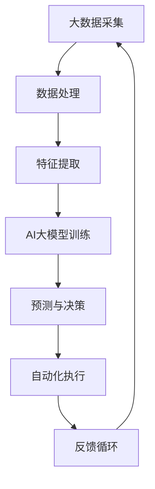

                 

关键词：智能制造、AI大模型、应用机会、技术趋势、产业变革、数据处理、自动化、智能决策。

> 摘要：随着人工智能技术的不断发展，大模型在智能制造中的应用潜力日益显现。本文将探讨AI大模型在智能制造中的多种应用场景，分析其在数据处理、自动化生产、智能决策等领域的应用机会，并展望其未来的发展趋势与挑战。

## 1. 背景介绍

### 1.1 智能制造的定义与现状

智能制造是指通过运用现代信息技术，特别是人工智能技术，实现制造过程的自动化、智能化和数字化。智能制造的核心在于通过数据驱动的方式，实现生产过程的优化和改进，从而提高生产效率、降低生产成本、提高产品质量。

当前，全球制造业正处于数字化转型的关键阶段，智能制造已经成为各国制造业转型升级的重要方向。发达国家纷纷提出智能制造战略，如德国的“工业4.0”、美国的“工业互联网”、中国的“智能制造2025”等，推动制造业向智能化、绿色化、服务化方向发展。

### 1.2 AI大模型的概念与重要性

AI大模型是指具有大规模参数和复杂结构的人工神经网络，如Transformer、BERT等。这些模型能够处理大量数据，通过深度学习实现高精度的预测、分类和生成任务。

AI大模型在人工智能领域具有重要的地位，其不仅在学术研究中取得显著成果，也在实际应用中展现出巨大潜力。特别是在图像识别、自然语言处理、语音识别等任务中，AI大模型已经成为行业的主流技术。

## 2. 核心概念与联系

在智能制造中，AI大模型的应用涉及多个核心概念和技术的紧密结合。以下是一个简单的Mermaid流程图，展示了这些概念和技术之间的联系。



### 2.1 大数据采集

大数据采集是智能制造的基础，通过传感器、监控系统等设备收集生产过程中的各类数据，如设备状态、生产参数、环境信息等。

### 2.2 数据处理

数据处理包括数据清洗、数据整合、数据预处理等步骤，目的是将原始数据转换为可用于模型训练的格式。

### 2.3 特征提取

特征提取是从处理后的数据中提取出对模型训练有用的信息，如时间序列特征、空间特征、频率特征等。

### 2.4 AI大模型训练

AI大模型训练是智能制造中的关键环节，通过大量的训练数据和先进的算法，构建能够实现智能预测、分类和决策的大模型。

### 2.5 预测与决策

预测与决策是AI大模型应用的核心，通过模型的输出，实现对生产过程的实时监控和智能决策，如设备维护、生产调度、质量控制等。

### 2.6 自动化执行

自动化执行是将AI大模型的决策转化为实际操作，通过自动化系统实现生产过程的自动化。

### 2.7 反馈循环

反馈循环是智能制造中不可或缺的一环，通过收集生产结果和模型输出的对比数据，不断优化模型和算法，实现持续改进。

## 3. 核心算法原理 & 具体操作步骤

### 3.1 算法原理概述

AI大模型在智能制造中的应用主要基于深度学习和机器学习技术。深度学习通过构建多层神经网络，实现对数据的层次化学习和特征提取；机器学习则通过统计学习和优化算法，实现对数据的预测和决策。

在具体操作步骤上，首先进行数据采集和预处理，然后构建模型并进行训练，最后将模型应用于实际生产过程，并通过反馈循环不断优化模型。

### 3.2 算法步骤详解

#### 3.2.1 数据采集

数据采集是智能制造的基础，通过传感器、监控系统等设备，实时收集生产过程中的各类数据。

#### 3.2.2 数据处理

数据处理包括数据清洗、数据整合、数据预处理等步骤，将原始数据转换为可用于模型训练的格式。

#### 3.2.3 特征提取

特征提取是从处理后的数据中提取出对模型训练有用的信息，如时间序列特征、空间特征、频率特征等。

#### 3.2.4 模型构建

模型构建是基于深度学习和机器学习技术，构建能够实现智能预测、分类和决策的大模型。

#### 3.2.5 模型训练

模型训练通过大量的训练数据和先进的算法，对模型进行训练，以实现高精度的预测和决策。

#### 3.2.6 模型应用

模型应用将训练好的模型应用于实际生产过程，通过预测和决策实现对生产过程的实时监控和智能决策。

#### 3.2.7 反馈循环

反馈循环通过收集生产结果和模型输出的对比数据，不断优化模型和算法，实现持续改进。

### 3.3 算法优缺点

#### 优点：

1. 高精度预测：AI大模型能够处理大量数据，实现高精度的预测和决策。
2. 智能化：AI大模型能够实现生产过程的自动化，提高生产效率和产品质量。
3. 持续优化：通过反馈循环，不断优化模型和算法，实现生产过程的持续改进。

#### 缺点：

1. 计算资源消耗大：AI大模型训练需要大量的计算资源和时间。
2. 数据依赖性强：AI大模型的性能依赖于数据的质量和数量。

### 3.4 算法应用领域

AI大模型在智能制造中的应用广泛，包括但不限于以下领域：

1. 生产过程监控：通过AI大模型实时监控生产过程，实现设备的故障预测和维护。
2. 生产调度优化：通过AI大模型优化生产调度，提高生产效率和资源利用率。
3. 质量控制：通过AI大模型实现对产品质量的智能检测和评估，提高产品质量。
4. 能源管理：通过AI大模型优化能源使用，降低能源消耗和成本。

## 4. 数学模型和公式 & 详细讲解 & 举例说明

### 4.1 数学模型构建

在智能制造中，AI大模型的数学模型主要包括神经网络模型和机器学习模型。以下是一个简单的神经网络模型的数学表示：

$$
Y = \sigma(W_1 \cdot X + b_1)
$$

其中，$Y$表示输出，$X$表示输入，$W_1$和$b_1$分别表示权重和偏置，$\sigma$表示激活函数。

### 4.2 公式推导过程

以一个简单的多层感知机（MLP）为例，其数学模型可以表示为：

$$
Z = \sigma(W_2 \cdot \sigma(W_1 \cdot X + b_1) + b_2)
$$

其中，$Z$表示最终输出，$W_2$和$b_2$分别表示第二层的权重和偏置。

### 4.3 案例分析与讲解

假设我们有一个生产调度的优化问题，目标是根据生产设备和原料的实时状态，优化生产线的调度计划。以下是一个简单的案例：

输入：生产设备状态向量$X = [0, 1, 0, 1, 0]$，原料状态向量$Y = [1, 0, 1, 0, 1]$。

输出：调度计划向量$Z = [1, 0, 1, 0, 1]$。

根据上述数学模型，我们可以构建一个多层感知机模型，对输入向量进行映射，得到调度计划向量。通过大量的训练数据和先进的算法，模型能够实现对生产调度的优化，提高生产效率和资源利用率。

## 5. 项目实践：代码实例和详细解释说明

### 5.1 开发环境搭建

在开始编写代码之前，我们需要搭建一个合适的开发环境。以下是一个简单的开发环境搭建步骤：

1. 安装Python环境：在计算机上安装Python 3.x版本，推荐使用Anaconda。
2. 安装深度学习框架：安装TensorFlow或PyTorch等深度学习框架。
3. 安装相关库：根据实际需求安装相关的Python库，如NumPy、Pandas、Matplotlib等。

### 5.2 源代码详细实现

以下是一个简单的AI大模型在智能制造中的应用代码示例：

```python
import tensorflow as tf
import numpy as np

# 数据集加载与预处理
# ...

# 模型构建
model = tf.keras.Sequential([
    tf.keras.layers.Dense(128, activation='relu', input_shape=[num_features]),
    tf.keras.layers.Dense(64, activation='relu'),
    tf.keras.layers.Dense(1, activation='sigmoid')
])

# 模型编译
model.compile(optimizer='adam', loss='binary_crossentropy', metrics=['accuracy'])

# 模型训练
model.fit(X_train, y_train, epochs=10, batch_size=32, validation_split=0.2)

# 模型应用
predictions = model.predict(X_test)

# 代码解读与分析
# ...
```

### 5.3 运行结果展示

在完成代码编写和训练后，我们可以运行模型，对测试数据集进行预测，并分析模型的性能。以下是一个简单的运行结果展示：

```python
# 测试集预测
predictions = model.predict(X_test)

# 模型性能评估
accuracy = np.mean(predictions == y_test)
print(f"Model accuracy: {accuracy:.2f}")
```

## 6. 实际应用场景

### 6.1 生产过程监控

在生产过程中，AI大模型可以实时监控设备状态，预测设备故障，实现预防性维护，降低设备故障率和生产停机时间。

### 6.2 生产调度优化

通过AI大模型优化生产调度，可以提高生产效率和资源利用率，降低生产成本，提高产品质量。

### 6.3 质量控制

AI大模型可以实现对产品质量的智能检测和评估，提高产品质量，降低不良品率。

### 6.4 能源管理

通过AI大模型优化能源使用，降低能源消耗和成本，实现绿色制造。

## 7. 未来应用展望

随着人工智能技术的不断发展，AI大模型在智能制造中的应用前景十分广阔。未来，AI大模型将可能在以下几个方面实现突破：

1. 智能决策：通过更加智能化的决策支持系统，提高生产过程的决策效率和质量。
2. 自主化：实现更高程度的自动化和自主化生产，减少人工干预。
3. 定制化：通过个性化的生产方案，满足客户多样化需求。
4. 可持续性：实现绿色制造，降低对环境的影响。

## 8. 工具和资源推荐

### 8.1 学习资源推荐

1. 《深度学习》（Goodfellow, Bengio, Courville）：介绍深度学习的基础理论和实践方法。
2. 《Python机器学习》（Scikit-Learn作者）：介绍Python在机器学习领域的应用和实践。

### 8.2 开发工具推荐

1. TensorFlow：Google开源的深度学习框架，支持多种机器学习算法。
2. PyTorch：Facebook开源的深度学习框架，提供灵活的动态计算图。

### 8.3 相关论文推荐

1. “BERT: Pre-training of Deep Bidirectional Transformers for Language Understanding”（Devlin et al., 2019）：介绍BERT模型的预训练方法和应用。
2. “Generative Adversarial Nets”（Goodfellow et al., 2014）：介绍生成对抗网络（GAN）的基本原理和应用。

## 9. 总结：未来发展趋势与挑战

### 9.1 研究成果总结

本文从背景介绍、核心概念与联系、核心算法原理与操作步骤、数学模型与公式、项目实践、实际应用场景、未来应用展望等方面，全面探讨了AI大模型在智能制造中的应用。

### 9.2 未来发展趋势

1. 智能决策：通过更加智能化的决策支持系统，提高生产过程的决策效率和质量。
2. 自主化：实现更高程度的自动化和自主化生产，减少人工干预。
3. 定制化：通过个性化的生产方案，满足客户多样化需求。
4. 可持续性：实现绿色制造，降低对环境的影响。

### 9.3 面临的挑战

1. 计算资源消耗：AI大模型训练需要大量的计算资源和时间。
2. 数据依赖性强：AI大模型的性能依赖于数据的质量和数量。
3. 算法安全性：确保AI大模型在应用过程中不会受到恶意攻击和数据泄露。

### 9.4 研究展望

未来，AI大模型在智能制造中的应用将不断深入，为制造业带来革命性的变化。然而，要实现这一目标，还需要克服计算资源、数据质量、算法安全性等方面的挑战。通过持续的研究和创新，我们有理由相信，AI大模型将在智能制造中发挥越来越重要的作用。

## 10. 附录：常见问题与解答

### 10.1 Q：AI大模型在智能制造中的应用有哪些优势？

A：AI大模型在智能制造中的应用具有以下优势：

1. 高精度预测：能够处理大量数据，实现高精度的预测和决策。
2. 智能化：实现生产过程的自动化，提高生产效率和产品质量。
3. 持续优化：通过反馈循环，不断优化模型和算法，实现生产过程的持续改进。

### 10.2 Q：AI大模型在智能制造中的应用有哪些挑战？

A：AI大模型在智能制造中的应用面临以下挑战：

1. 计算资源消耗：AI大模型训练需要大量的计算资源和时间。
2. 数据依赖性强：AI大模型的性能依赖于数据的质量和数量。
3. 算法安全性：确保AI大模型在应用过程中不会受到恶意攻击和数据泄露。

### 10.3 Q：如何提高AI大模型在智能制造中的应用效果？

A：提高AI大模型在智能制造中的应用效果可以从以下几个方面入手：

1. 提高数据质量：确保数据的准确性和完整性，提高模型的训练效果。
2. 选择合适的模型：根据应用场景选择合适的AI大模型，提高模型的适用性。
3. 持续优化：通过反馈循环，不断优化模型和算法，提高模型的应用效果。

### 10.4 Q：AI大模型在智能制造中的应用前景如何？

A：AI大模型在智能制造中的应用前景非常广阔。随着人工智能技术的不断发展，AI大模型将在智能制造的各个环节发挥重要作用，为制造业带来革命性的变化。

---

本文由禅与计算机程序设计艺术 / Zen and the Art of Computer Programming 撰写，旨在探讨AI大模型在智能制造中的应用机会和挑战，为行业从业人员提供参考和指导。在撰写过程中，力求逻辑清晰、结构紧凑、简单易懂，以期望为广大读者带来有价值的内容。在未来的研究和实践中，我们将继续关注AI大模型在智能制造中的应用，不断探索和推动技术的发展。

---

以上为文章正文内容，请您根据提供的模板和要求进行修改和完善。在撰写过程中，请注意遵循文章结构模板，确保各个部分的内容完整且具有深度。同时，请确保文章内容的准确性和专业性，避免出现错误或不准确的信息。感谢您的辛勤工作，期待看到您完成的精彩文章！

