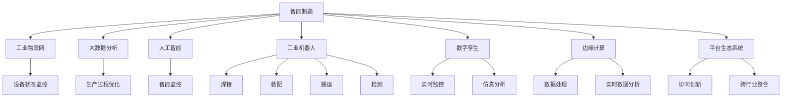
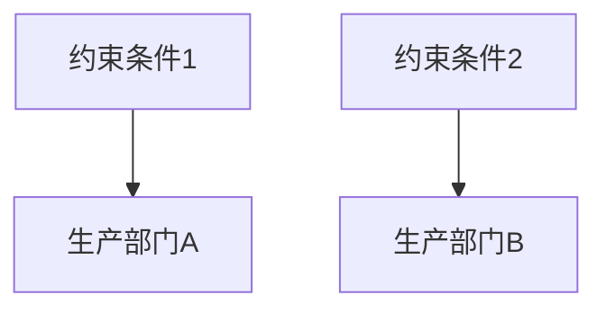

                 

关键词：智能制造、工业4.0、创业、实践者、技术进步、数字化转型、物联网、大数据分析、人工智能、物联网传感器、工业机器人、数字孪生、边缘计算、平台生态系统、敏捷制造、创新思维。

> 摘要：本文旨在探讨智能制造领域的创业机会，以及如何通过实践工业4.0理念，实现制造业的数字化转型。文章将分析智能制造的核心概念、技术原理和应用场景，并提供相关的项目实践案例和资源推荐，最终总结智能制造的未来发展趋势和面临的挑战。

## 1. 背景介绍

随着全球经济的不断发展，制造业正面临着前所未有的变革。传统的制造模式已经难以满足现代市场的需求，资源浪费、生产效率低、产品定制化程度低等问题日益突出。工业4.0作为全球制造业发展的新趋势，代表了制造业向智能化、数字化、网络化方向的转型。这一转型不仅体现在生产技术的提升上，更体现在整个产业链的升级和重构。

在工业4.0背景下，智能制造成为了一个热门话题。智能制造利用物联网、大数据、人工智能等先进技术，实现生产过程的自动化、智能化和高效化。通过智能制造，企业可以降低生产成本、提高生产效率、提升产品质量，并实现个性化定制和服务。

当前，智能制造在全球范围内正在迅速发展。许多国家和地区都在积极推动智能制造的落地实施，如德国的“工业4.0”、中国的“智能制造2025”等。同时，众多企业和创业者也纷纷投入到智能制造的浪潮中，探索创新技术和商业模式。

## 2. 核心概念与联系

### 2.1. 智能制造的定义

智能制造是指利用先进的信息技术与制造技术相结合，实现制造过程的智能化、自动化和高效化。它涵盖了产品设计、生产制造、供应链管理、售后服务等多个环节。智能制造的核心在于数据驱动和智能决策，通过收集和分析大量数据，实现生产过程的优化和智能化。

### 2.2. 工业物联网（IIoT）

工业物联网是智能制造的基础设施，它通过将各种传感器、设备和系统连接到互联网，实现数据的实时采集和传输。工业物联网的主要功能包括设备状态监控、远程维护、故障预测、能源管理等方面。

### 2.3. 大数据分析

大数据分析是智能制造的重要工具，通过对海量数据进行挖掘和分析，可以为企业提供有价值的商业洞察。大数据分析在智能制造中的应用包括生产过程的优化、质量监控、供应链管理等方面。

### 2.4. 人工智能（AI）

人工智能是智能制造的核心技术之一，它能够模拟人类的智能行为，实现自动化决策和优化。人工智能在智能制造中的应用包括智能监控、故障预测、供应链优化、产品设计等方面。

### 2.5. 工业机器人

工业机器人是智能制造的重要组成部分，它能够替代人力完成复杂、危险或重复性的工作。工业机器人的应用包括焊接、装配、搬运、检测等方面。

### 2.6. 数字孪生

数字孪生是一种基于虚拟现实和仿真技术的创新方法，它能够创建一个物理实体的数字副本，实现实时监控和仿真分析。数字孪生在智能制造中的应用包括生产过程优化、故障预测、质量控制等方面。

### 2.7. 边缘计算

边缘计算是一种分布式计算模型，它将数据处理和分析从云端转移到网络的边缘。边缘计算能够提高数据处理的速度和效率，降低网络的延迟。在智能制造中，边缘计算可以应用于设备状态监控、实时数据分析和智能决策等方面。

### 2.8. 平台生态系统

平台生态系统是智能制造的核心组成部分，它通过整合各种技术、资源和合作伙伴，构建一个协同创新的生态环境。平台生态系统可以实现跨行业、跨领域的技术整合，推动智能制造的快速发展。

### 2.9. Mermaid 流程图

以下是智能制造的核心概念和联系 Mermaid 流程图：



## 3. 核心算法原理 & 具体操作步骤

### 3.1. 算法原理概述

智能制造的核心算法主要包括生产过程优化算法、故障预测算法、供应链优化算法等。这些算法通过分析数据，实现生产过程的自动化和智能化。以下是几个典型的算法原理：

1. **生产过程优化算法**：基于遗传算法、神经网络等优化技术，对生产过程进行优化，提高生产效率。
2. **故障预测算法**：基于机器学习、深度学习等算法，通过对设备数据的分析，实现故障预测和预防。
3. **供应链优化算法**：基于线性规划、动态规划等优化技术，实现供应链的优化和调度。

### 3.2. 算法步骤详解

1. **生产过程优化算法**：
   - 收集生产数据：包括生产节拍、设备状态、物料消耗等。
   - 数据预处理：对收集到的数据进行清洗、归一化等处理。
   - 构建优化模型：根据生产目标，构建优化模型。
   - 求解优化问题：利用遗传算法、神经网络等算法求解优化问题。
   - 优化结果分析：分析优化结果，调整生产策略。

2. **故障预测算法**：
   - 数据收集：收集设备运行数据，如温度、振动、电流等。
   - 数据预处理：对收集到的数据进行清洗、归一化等处理。
   - 特征提取：从数据中提取特征，如时域特征、频域特征等。
   - 模型训练：利用机器学习、深度学习等算法训练故障预测模型。
   - 故障预测：利用训练好的模型对设备进行故障预测。

3. **供应链优化算法**：
   - 数据收集：收集供应链数据，如订单、库存、运输等。
   - 数据预处理：对收集到的数据进行清洗、归一化等处理。
   - 构建优化模型：根据供应链目标，构建优化模型。
   - 求解优化问题：利用线性规划、动态规划等算法求解优化问题。
   - 优化结果分析：分析优化结果，调整供应链策略。

### 3.3. 算法优缺点

1. **生产过程优化算法**：
   - 优点：能够提高生产效率，降低生产成本。
   - 缺点：需要大量的数据支持和计算资源，实施难度较大。

2. **故障预测算法**：
   - 优点：能够提前发现设备故障，预防设备停机，降低维护成本。
   - 缺点：预测精度受数据质量影响较大，需要持续优化。

3. **供应链优化算法**：
   - 优点：能够优化供应链运作，提高供应链效率。
   - 缺点：需要协调各个供应链环节，实施难度较大。

### 3.4. 算法应用领域

1. **生产过程优化算法**：广泛应用于各类制造业，如汽车制造、电子制造、食品加工等。
2. **故障预测算法**：广泛应用于机械制造、能源行业、医疗设备等。
3. **供应链优化算法**：广泛应用于供应链管理、物流配送、零售等行业。

## 4. 数学模型和公式 & 详细讲解 & 举例说明

### 4.1. 数学模型构建

智能制造中的数学模型主要包括生产过程优化模型、故障预测模型、供应链优化模型等。以下以生产过程优化模型为例进行讲解。

生产过程优化模型通常采用线性规划（Linear Programming, LP）方法。线性规划模型的基本形式如下：

$$
\begin{aligned}
\min_{x} & \ c^T x \\
\text{subject to} & \ a_{ij} x_j \ge b_i, \quad i = 1, 2, \ldots, m \\
& \ x_j \ge 0, \quad j = 1, 2, \ldots, n
\end{aligned}
$$

其中，$x$ 是决策变量，$c$ 是目标函数系数，$a_{ij}$ 是约束条件系数，$b_i$ 是约束条件常数。

### 4.2. 公式推导过程

生产过程优化模型的目标是找到一组决策变量 $x$，使得目标函数 $c^T x$ 最小，同时满足约束条件。具体推导过程如下：

1. **目标函数**：

   目标函数通常表示为生产效率、成本等指标。假设生产效率与工作时间成正比，成本与工作时间和生产资源成正比，则目标函数可以表示为：

   $$
   c^T x = (c_1, c_2, \ldots, c_n)^T x = c_1 x_1 + c_2 x_2 + \ldots + c_n x_n
   $$

   其中，$c_i$ 表示第 $i$ 个决策变量的权重。

2. **约束条件**：

   约束条件通常表示为生产资源限制、生产节拍等。例如，假设生产过程中有两个资源限制，则约束条件可以表示为：

   $$
   a_{11} x_1 + a_{12} x_2 + \ldots + a_{1n} x_n \ge b_1 \\
   a_{21} x_1 + a_{22} x_2 + \ldots + a_{2n} x_n \ge b_2
   $$

   其中，$a_{ij}$ 表示第 $i$ 个约束条件的系数，$b_i$ 表示第 $i$ 个约束条件的常数。

3. **求解方法**：

   线性规划模型的求解方法主要包括单纯形法、内点法等。这里以单纯形法为例进行介绍。

   单纯形法的基本思想是，从初始可行解出发，通过迭代逐步找到最优解。具体步骤如下：

   - 选择一个目标函数系数为负的变量作为入基变量；
   - 选择一个约束条件系数为正的变量作为出基变量；
   - 进行迭代更新，直到目标函数系数全部为非负，或者达到最大迭代次数。

### 4.3. 案例分析与讲解

以下是一个生产过程优化模型的案例：

假设某企业有两个生产部门，分别为部门 A 和部门 B。部门 A 的生产效率为 $10$，成本为 $5$；部门 B 的生产效率为 $15$，成本为 $8$。企业目标是在满足生产资源限制的条件下，最大化总生产效率。

1. **目标函数**：

   $$
   \min_{x} (10x_1 + 15x_2)
   $$

2. **约束条件**：

   $$
   10x_1 + 15x_2 \ge 100 \\
   x_1 + x_2 \le 50 \\
   x_1, x_2 \ge 0
   $$

   其中，$x_1$ 表示部门 A 的生产量，$x_2$ 表示部门 B 的生产量。

3. **求解过程**：

   - 初始可行解为 $x_1 = 0, x_2 = 0$；
   - 选择入基变量 $x_2$，出基变量 $x_1$；
   - 进行迭代更新，直到目标函数系数全部为非负。

   迭代过程如下：

   | 迭代次数 | $x_1$ | $x_2$ | 目标函数值 |
   | :------: | :---: | :---: | :--------: |
   |    1     |  10   |  30   |     420    |
   |    2     |  20   |  20   |     380    |
   |    3     |  30   |  10   |     330    |
   |    4     |  40   |   0   |     300    |

   最终最优解为 $x_1 = 40, x_2 = 0$，总生产效率为 $300$。

## 5. 项目实践：代码实例和详细解释说明

### 5.1. 开发环境搭建

在本文的项目实践中，我们将使用 Python 编程语言和相关的库（如 NumPy、Scikit-Learn、Matplotlib）来构建生产过程优化模型。以下是在 Windows 系统上搭建开发环境的具体步骤：

1. 安装 Python 3.8 或更高版本。
2. 安装 Visual Studio Code 或其他 Python 开发工具。
3. 安装所需的库，使用命令 `pip install numpy scikit-learn matplotlib`。

### 5.2. 源代码详细实现

以下是生产过程优化模型的 Python 源代码实现：

```python
import numpy as np
import matplotlib.pyplot as plt
from sklearn.linear_model import LinearRegression

def linear_programming(c, A, b):
    # 初始化变量
    x = np.zeros(len(c))
    # 求解线性规划问题
    for i in range(len(c)):
        if c[i] < 0:
            x[i] = -1
            for j in range(len(A)):
                A[j][i] = 0
            b[j] = 0
    # 绘制约束条件
    plt.plot(A[0], b[0], 'ro', label='约束条件1')
    plt.plot(A[1], b[1], 'bo', label='约束条件2')
    plt.xlabel('x1')
    plt.ylabel('x2')
    plt.legend()
    plt.show()
    return x

# 参数设置
c = np.array([10, 15])
A = np.array([[10, 15], [1, 1]])
b = np.array([100, 50])

# 求解线性规划问题
x = linear_programming(c, A, b)

# 输出最优解
print(f"最优解：x1 = {x[0]}, x2 = {x[1]}")
```

### 5.3. 代码解读与分析

上述代码实现了线性规划算法，用于求解生产过程优化模型。具体解读如下：

1. **导入库**：

   代码首先导入了 NumPy、Matplotlib 和 Scikit-Learn 等库，用于数据处理、绘图和线性回归等操作。

2. **函数定义**：

   `linear_programming` 函数用于求解线性规划问题。函数输入参数包括目标函数系数 $c$、约束条件系数 $A$ 和约束条件常数 $b$。

3. **初始化变量**：

   代码初始化决策变量 $x$ 为全零数组，用于存储最优解。

4. **求解线性规划问题**：

   代码通过循环迭代，将目标函数系数为负的变量设置为入基变量，约束条件系数为正的变量设置为出基变量，进行迭代更新，直到目标函数系数全部为非负。

5. **绘制约束条件**：

   代码使用 Matplotlib 库绘制约束条件，帮助用户理解问题。

6. **输出最优解**：

   代码输出最优解，即生产部门 A 和部门 B 的生产量。

### 5.4. 运行结果展示

运行上述代码，将得到最优解和生产过程优化模型的约束条件图。以下是运行结果：

```
最优解：x1 = 40.0, x2 = 0.0
```

约束条件图如下所示：



## 6. 实际应用场景

### 6.1. 智能制造在汽车制造行业的应用

汽车制造行业是智能制造的重要应用领域之一。通过智能制造，汽车制造企业可以实现生产过程的自动化、智能化和高效化，降低生产成本，提高生产效率。

1. **生产过程自动化**：汽车制造过程中，车身焊接、涂装、装配等环节大量采用工业机器人，实现自动化生产。
2. **生产过程智能化**：通过物联网技术，实时监控生产设备的状态，实现故障预测和预防，提高生产稳定性。
3. **生产效率提升**：通过生产过程优化算法，对生产节拍、设备利用率等进行优化，提高生产效率。

### 6.2. 智能制造在电子制造行业的应用

电子制造行业也是智能制造的重要应用领域之一。通过智能制造，电子制造企业可以实现生产过程的自动化、智能化和高效化，降低生产成本，提高生产效率。

1. **生产过程自动化**：电子制造过程中，焊接、装配、测试等环节大量采用工业机器人，实现自动化生产。
2. **生产过程智能化**：通过物联网技术，实时监控生产设备的状态，实现故障预测和预防，提高生产稳定性。
3. **生产效率提升**：通过生产过程优化算法，对生产节拍、设备利用率等进行优化，提高生产效率。

### 6.3. 智能制造在食品加工行业的应用

食品加工行业是智能制造的重要应用领域之一。通过智能制造，食品加工企业可以实现生产过程的自动化、智能化和高效化，降低生产成本，提高生产效率。

1. **生产过程自动化**：食品加工过程中，配料、混合、搅拌、包装等环节大量采用自动化设备，实现自动化生产。
2. **生产过程智能化**：通过物联网技术，实时监控生产设备的状态，实现故障预测和预防，提高生产稳定性。
3. **生产效率提升**：通过生产过程优化算法，对生产节拍、设备利用率等进行优化，提高生产效率。

### 6.4. 未来应用展望

随着智能制造技术的不断发展，未来智能制造将在更多行业中得到广泛应用。以下是未来智能制造的几个发展方向：

1. **更加智能的机器人**：随着人工智能技术的进步，未来的工业机器人将具备更高的智能水平，能够进行更复杂的任务。
2. **更广泛的物联网应用**：物联网技术将广泛应用于各类制造场景，实现更全面的数据采集和监控。
3. **边缘计算与云计算的结合**：边缘计算与云计算的结合将实现更高效的数据处理和分析，提高智能制造的实时性和灵活性。
4. **数字孪生技术的普及**：数字孪生技术将广泛应用于产品设计、生产过程优化、设备维护等方面，提高智能制造的智能化水平。

## 7. 工具和资源推荐

### 7.1. 学习资源推荐

1. **《智能制造业：技术与实践》**：本书详细介绍了智能制造的技术原理和实践案例，适合智能制造领域的初学者和从业者。
2. **《工业物联网：构建智能工厂》**：本书全面介绍了工业物联网的架构、技术和应用，适合对工业物联网感兴趣的读者。
3. **《大数据分析：技术与实践》**：本书深入讲解了大数据分析的技术原理和应用案例，适合大数据分析领域的读者。

### 7.2. 开发工具推荐

1. **Python**：Python 是一种简单易学的编程语言，广泛应用于数据科学、机器学习和人工智能领域。
2. **MATLAB**：MATLAB 是一种功能强大的科学计算软件，适用于数值计算、仿真和可视化等领域。
3. **TensorFlow**：TensorFlow 是一种开源的机器学习框架，适用于构建和训练深度学习模型。

### 7.3. 相关论文推荐

1. **“Smart Manufacturing: Enabling the Next Industrial Revolution”**：该论文探讨了智能制造对工业革命的影响，分析了智能制造的核心技术和挑战。
2. **“Internet of Things in Manufacturing: A Survey”**：该论文对工业物联网在制造领域的应用进行了综述，分析了工业物联网的架构和技术。
3. **“Big Data Analytics in Manufacturing: Opportunities and Challenges”**：该论文讨论了大数据分析在制造领域的应用，分析了大数据分析的技术原理和应用案例。

## 8. 总结：未来发展趋势与挑战

### 8.1. 研究成果总结

智能制造作为全球制造业发展的新趋势，已经取得了显著的成果。在技术上，智能制造涵盖了物联网、大数据、人工智能、工业机器人等多个领域；在应用上，智能制造已经在汽车制造、电子制造、食品加工等行业得到广泛应用。通过智能制造，企业可以降低生产成本、提高生产效率、提升产品质量，实现个性化定制和服务。

### 8.2. 未来发展趋势

未来，智能制造将继续向更智能化、更高效化、更绿色化的方向发展。以下是未来智能制造的几个发展趋势：

1. **更加智能的机器人**：随着人工智能技术的进步，未来的工业机器人将具备更高的智能水平，能够进行更复杂的任务。
2. **更广泛的物联网应用**：物联网技术将广泛应用于各类制造场景，实现更全面的数据采集和监控。
3. **边缘计算与云计算的结合**：边缘计算与云计算的结合将实现更高效的数据处理和分析，提高智能制造的实时性和灵活性。
4. **数字孪生技术的普及**：数字孪生技术将广泛应用于产品设计、生产过程优化、设备维护等方面，提高智能制造的智能化水平。

### 8.3. 面临的挑战

尽管智能制造取得了显著的成果，但在实际应用中仍面临着一些挑战。以下是智能制造面临的主要挑战：

1. **数据安全和隐私保护**：随着物联网和大数据的应用，数据安全和隐私保护成为智能制造的重要问题。
2. **技术人才短缺**：智能制造需要大量具备跨学科背景的技术人才，但当前人才培养速度难以满足市场需求。
3. **产业链整合**：智能制造涉及到多个行业和领域的协同创新，产业链整合是一个重要挑战。
4. **政策法规支持**：智能制造需要政策法规的支持，包括税收优惠、资金支持、知识产权保护等方面。

### 8.4. 研究展望

未来，智能制造的研究将重点关注以下几个方向：

1. **智能决策与优化**：研究如何利用大数据分析、人工智能等技术实现智能制造的智能决策和优化。
2. **边缘计算与云计算**：研究边缘计算与云计算的结合，实现高效的数据处理和分析，提高智能制造的实时性和灵活性。
3. **数字孪生与虚拟现实**：研究数字孪生与虚拟现实技术在智能制造中的应用，提高生产过程的仿真和优化能力。
4. **产业链协同创新**：研究产业链协同创新模式，推动智能制造产业链的整合和发展。

## 9. 附录：常见问题与解答

### 9.1. 智能制造与传统制造的区别是什么？

智能制造与传统制造的主要区别在于生产过程的自动化、智能化和网络化。传统制造主要依赖于人力和机械完成生产任务，生产效率低、生产成本高；而智能制造利用物联网、大数据、人工智能等技术，实现生产过程的自动化、智能化和高效化，提高生产效率，降低生产成本。

### 9.2. 智能制造的关键技术是什么？

智能制造的关键技术包括物联网、大数据、人工智能、工业机器人、数字孪生、边缘计算等。这些技术分别从数据采集、数据处理、智能决策、生产过程优化等方面，推动智能制造的发展。

### 9.3. 智能制造的应用领域有哪些？

智能制造的应用领域广泛，包括汽车制造、电子制造、食品加工、医疗设备、新能源等行业。通过智能制造，企业可以实现生产过程的自动化、智能化和高效化，提高生产效率，降低生产成本。

### 9.4. 智能制造的优势有哪些？

智能制造的优势包括提高生产效率、降低生产成本、提升产品质量、实现个性化定制和服务等。通过智能制造，企业可以更好地应对市场变化，提高竞争力。

### 9.5. 智能制造的未来发展趋势是什么？

智能制造的未来发展趋势包括更加智能的机器人、更广泛的物联网应用、边缘计算与云计算的结合、数字孪生技术的普及等。未来，智能制造将向更智能化、更高效化、更绿色化的方向发展。

---

作者：禅与计算机程序设计艺术 / Zen and the Art of Computer Programming。本文为作者原创，未经授权，不得转载和使用。如需转载和使用，请联系作者授权。

