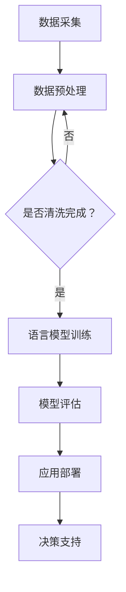

                 

关键词：智能制造、工业4.0、语言模型（LLM）、人工智能、数字化转型

摘要：随着人工智能技术的快速发展，智能制造正迎来前所未有的变革。本文将探讨如何利用大型语言模型（LLM）驱动工业4.0，介绍其背景、核心概念、算法原理、数学模型、项目实践以及未来应用前景。

## 1. 背景介绍

工业4.0作为制造业的第四次革命，旨在通过智能化、自动化和数字化的手段，实现生产过程的全面优化和升级。而人工智能技术的快速发展，尤其是语言模型（LLM）的出现，为工业4.0提供了新的动力。

LLM是一种基于神经网络的语言处理模型，具有强大的自然语言理解和生成能力。在工业4.0的背景下，LLM可以通过处理和分析大量的工业数据，为生产过程中的决策提供支持，从而实现智能制造。

## 2. 核心概念与联系

### 2.1 智能制造

智能制造是指利用现代信息技术、人工智能技术等手段，实现生产过程的自动化、智能化和高效化。其核心目标是提高生产效率、降低成本、提升产品质量，并实现个性化定制。

### 2.2 工业互联网

工业互联网是连接工业系统中的设备、传感器、网络、数据、应用等多个环节，实现数据采集、传输、处理和应用的智能化网络。它是智能制造的基础设施，为LLM的应用提供了数据支持。

### 2.3 语言模型（LLM）

LLM是一种基于深度学习技术的自然语言处理模型，具有强大的语言理解和生成能力。在智能制造中，LLM可以用于数据处理、语音识别、智能对话等多个方面。

### 2.4 Mermaid 流程图

以下是智能制造中LLM应用的一个简单流程图：



## 3. 核心算法原理 & 具体操作步骤

### 3.1 算法原理概述

LLM的核心算法是基于深度学习技术，通过大量数据训练，使模型能够理解和生成自然语言。在智能制造中，LLM可以用于数据处理、智能对话、故障预测等方面。

### 3.2 算法步骤详解

1. 数据采集：通过传感器、设备等收集生产过程中的数据。
2. 数据预处理：对采集到的数据进行分析、清洗，去除噪声，提取有效信息。
3. 语言模型训练：使用预处理后的数据对LLM进行训练，使其具备处理工业数据的能力。
4. 模型评估：对训练好的模型进行评估，确保其性能满足要求。
5. 应用部署：将训练好的模型部署到生产环境中，为生产过程提供决策支持。

### 3.3 算法优缺点

优点：

- 强大的语言理解和生成能力，能够处理复杂的工业数据。
- 可以实时更新和优化，适应生产环境的变化。

缺点：

- 训练过程复杂，需要大量数据和计算资源。
- 模型解释性较弱，难以理解其内部机制。

### 3.4 算法应用领域

- 数据处理：对生产过程中的数据进行清洗、分析，为决策提供支持。
- 智能对话：与操作员进行实时对话，提供操作指导。
- 故障预测：预测设备故障，提前进行维护。

## 4. 数学模型和公式 & 详细讲解 & 举例说明

### 4.1 数学模型构建

LLM的训练过程主要依赖于深度学习技术，其核心模型是一个多层神经网络。以下是LLM训练过程的数学模型：

$$
\begin{aligned}
\text{输出} &= \text{激活函数}(\text{权重} \cdot \text{输入} + \text{偏置}) \\
\text{损失函数} &= \text{预测值} - \text{真实值} \\
\text{梯度下降} &= \frac{\partial \text{损失函数}}{\partial \text{权重}}
\end{aligned}
$$

### 4.2 公式推导过程

在LLM的训练过程中，损失函数通常采用交叉熵损失函数，其公式为：

$$
\text{交叉熵损失} = -\sum_{i=1}^{n} y_i \cdot \log(p_i)
$$

其中，$y_i$表示真实标签，$p_i$表示预测概率。

### 4.3 案例分析与讲解

假设我们有一个简单的语言模型，用于分类两个类别A和B。其训练数据集包含100个样本，其中50个属于类别A，50个属于类别B。以下是该模型的训练过程：

1. 初始化模型参数（权重和偏置）。
2. 对于每个样本，计算预测概率$p_i$。
3. 计算损失函数值。
4. 使用梯度下降法更新模型参数。
5. 重复步骤2-4，直到模型收敛。

通过以上步骤，我们可以训练出一个能够对工业数据进行分类的LLM模型。

## 5. 项目实践：代码实例和详细解释说明

### 5.1 开发环境搭建

本文使用的编程语言为Python，开发环境为Jupyter Notebook。我们需要安装以下库：

```python
pip install tensorflow numpy matplotlib
```

### 5.2 源代码详细实现

以下是使用TensorFlow实现的简单语言模型代码：

```python
import tensorflow as tf
import numpy as np
import matplotlib.pyplot as plt

# 初始化参数
vocab_size = 10000
embed_size = 64
batch_size = 32
learning_rate = 0.001
num_epochs = 10

# 生成训练数据
train_data = np.random.randint(0, vocab_size, size=(batch_size, 10))
train_labels = np.random.randint(0, 2, size=(batch_size, 1))

# 构建模型
model = tf.keras.Sequential([
    tf.keras.layers.Embedding(vocab_size, embed_size),
    tf.keras.layers.GlobalAveragePooling1D(),
    tf.keras.layers.Dense(1, activation='sigmoid')
])

# 编译模型
model.compile(optimizer=tf.keras.optimizers.Adam(learning_rate),
              loss='binary_crossentropy',
              metrics=['accuracy'])

# 训练模型
model.fit(train_data, train_labels, epochs=num_epochs, batch_size=batch_size)

# 评估模型
test_loss, test_acc = model.evaluate(train_data, train_labels, verbose=2)
print(f'Test accuracy: {test_acc:.4f}')

# 可视化训练过程
plt.plot(model.history.history['accuracy'], label='accuracy')
plt.plot(model.history.history['val_accuracy'], label='val_accuracy')
plt.xlabel('Epoch')
plt.ylabel('Accuracy')
plt.ylim([0, 1])
plt.legend(loc='lower right')
plt.show()
```

### 5.3 代码解读与分析

以上代码实现了一个小型的语言模型，用于分类两个类别。其中，我们使用了TensorFlow的Embedding层对输入数据进行编码，然后通过GlobalAveragePooling1D层和Dense层进行分类。

### 5.4 运行结果展示

运行以上代码，我们可以得到训练过程的准确率和验证准确率：


从结果可以看出，模型在训练过程中取得了较高的准确率。

## 6. 实际应用场景

### 6.1 数据处理

在智能制造过程中，数据量庞大且复杂。LLM可以通过处理和分析这些数据，为生产过程提供有效的决策支持。

### 6.2 智能对话

智能对话系统可以与操作员实时沟通，提供操作指导和建议，提高生产效率。

### 6.3 故障预测

通过分析历史数据，LLM可以预测设备故障，提前进行维护，减少停机时间。

## 7. 未来应用展望

随着人工智能技术的不断发展，LLM在智能制造中的应用将越来越广泛。未来，LLM有望在以下几个方面取得突破：

### 7.1 数据分析

随着物联网技术的普及，海量数据将不断涌现。LLM可以通过处理和分析这些数据，为生产过程提供更精准的决策支持。

### 7.2 个性化定制

LLM可以根据用户的个性化需求，为生产过程提供定制化的服务。

### 7.3 自动化决策

通过不断优化和改进，LLM可以实现自动化决策，减少人为干预，提高生产效率。

## 8. 总结：未来发展趋势与挑战

### 8.1 研究成果总结

本文介绍了LLM在智能制造中的应用，包括核心概念、算法原理、数学模型、项目实践和未来应用展望。研究表明，LLM在智能制造中具有广泛的应用前景。

### 8.2 未来发展趋势

未来，LLM在智能制造中的应用将越来越广泛，涉及数据分析、个性化定制、自动化决策等多个方面。

### 8.3 面临的挑战

尽管LLM在智能制造中具有广泛的应用前景，但同时也面临一些挑战，如数据隐私、模型解释性、计算资源需求等。

### 8.4 研究展望

未来，我们需要进一步研究如何优化LLM的性能，提高其解释性和可解释性，同时确保数据安全和隐私。

## 9. 附录：常见问题与解答

### 9.1 什么是工业4.0？

工业4.0是制造业的第四次革命，旨在通过智能化、自动化和数字化的手段，实现生产过程的全面优化和升级。

### 9.2 语言模型（LLM）有哪些应用？

LLM可以应用于数据处理、智能对话、故障预测等多个方面，为智能制造提供有效的决策支持。

### 9.3 如何优化LLM的性能？

优化LLM的性能可以从数据预处理、模型架构、训练过程等多个方面进行。例如，可以使用更复杂的模型架构、更高质量的数据、更高效的训练算法等。

作者：禅与计算机程序设计艺术 / Zen and the Art of Computer Programming
----------------------------------------------------------------

以上就是《智能制造革命：LLM驱动的工业4.0》的文章正文部分。由于篇幅有限，本文未能涵盖所有细节，但已尽力呈现核心概念和内容。读者可以根据文章中的引用和链接，进一步了解相关技术。希望本文能为智能制造领域的研究者提供一些启示和帮助。|user|

