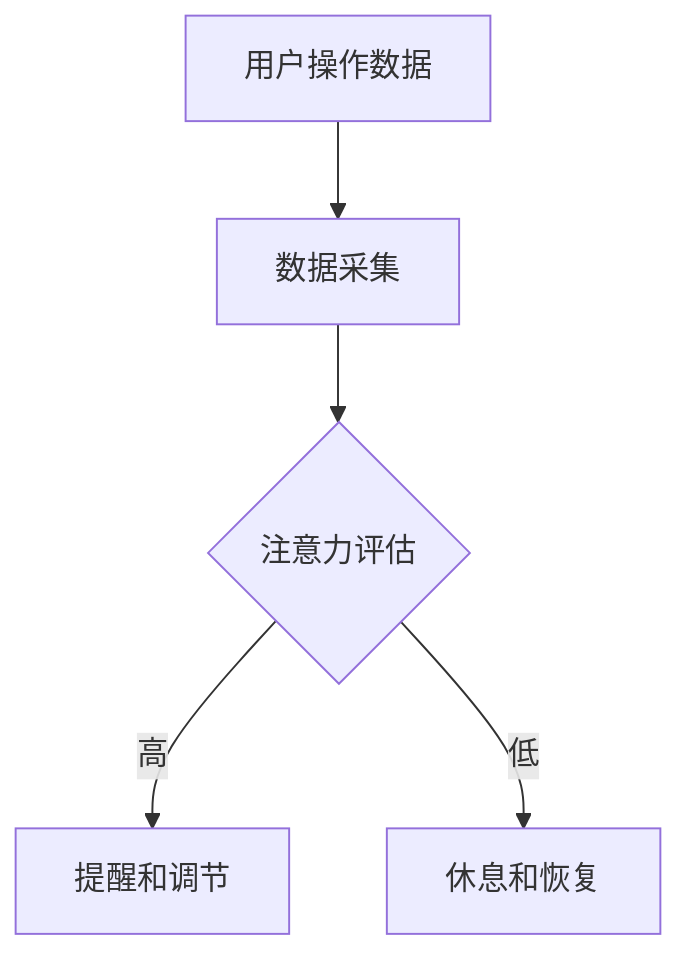

                 

关键词：智能办公设备、注意力管理、工作效率、技术解决方案

> 摘要：随着人工智能技术的发展，智能办公设备逐渐成为现代办公环境中的重要组成部分。本文将深入探讨智能办公设备的注意力管理功能，包括其核心概念、算法原理、数学模型、实际应用、以及未来发展趋势和挑战。

## 1. 背景介绍

在当今快节奏的工作环境中，员工的注意力管理变得尤为重要。现代办公设备，特别是智能办公设备，通过引入注意力管理功能，旨在帮助员工提高工作效率，减少分心和疲劳。注意力管理功能通常包括监控员工的注意力水平、提供提醒和反馈、以及优化工作环境等方面。

### 1.1 智能办公设备的发展趋势

智能办公设备的发展趋势体现在以下几个方面：

1. **物联网（IoT）技术的集成**：智能办公设备可以通过物联网技术与其他设备互联，实现数据的实时传输和处理。
2. **人工智能（AI）的引入**：AI技术使得办公设备能够自动识别用户的行为模式，提供个性化的服务。
3. **用户界面（UI）的优化**：现代办公设备的用户界面越来越直观和易用，使得用户能够更高效地完成任务。
4. **数据分析能力的提升**：智能办公设备能够对大量的办公数据进行实时分析，为决策提供依据。

### 1.2 注意力管理的重要性

注意力管理的重要性在于：

1. **提高工作效率**：通过监控和优化员工的注意力，可以有效减少无效工作时间和提高任务完成率。
2. **减少疲劳和压力**：适当的休息和注意力恢复可以减少员工的疲劳和压力，提高工作满意度。
3. **提升创新力**：专注的注意力状态有助于员工进行创造性思考，提升整体创新力。
4. **增强团队协作**：通过注意力管理，可以更好地协调团队成员的工作，提升团队协作效率。

## 2. 核心概念与联系

### 2.1 核心概念

#### 注意力管理

注意力管理是指通过技术手段和方法，监控、调节和优化个体的注意力水平，以达到提高工作效率和满足个体需求的目的。

#### 智能办公设备

智能办公设备是指集成了物联网、人工智能等技术的现代化办公设备，如智能办公桌、智能显示屏、智能手环等。

#### 注意力水平

注意力水平是指个体在特定任务或环境下集中注意力的程度。

### 2.2 关系

智能办公设备通过监测员工的生理和行为数据，如心率、面部表情、操作行为等，评估员工的注意力水平。然后，智能办公设备根据评估结果提供相应的反馈和调节，如调整屏幕亮度、播放放松音乐、提醒休息等，从而帮助员工维持高注意力水平。

### 2.3 Mermaid 流程图



## 3. 核心算法原理 & 具体操作步骤

### 3.1 算法原理概述

智能办公设备的注意力管理算法主要基于以下几个原理：

1. **行为识别**：通过监测用户的行为数据，如鼠标点击、键盘操作等，识别用户的注意力水平。
2. **生理监测**：通过心率传感器、面部表情识别等，监测用户的生理状态，进一步评估注意力水平。
3. **环境调节**：根据注意力评估结果，智能办公设备会自动调整工作环境，如屏幕亮度、音乐播放等，以帮助用户维持最佳注意力状态。

### 3.2 算法步骤详解

1. **数据采集**：智能办公设备通过传感器和用户交互界面，实时采集用户的行为和生理数据。
2. **注意力评估**：基于行为和生理数据，智能办公设备使用机器学习算法对用户的注意力水平进行评估。
3. **提醒和调节**：根据注意力评估结果，智能办公设备会提供相应的反馈和调节，如提醒用户休息、调整屏幕亮度等。
4. **反馈循环**：用户对智能办公设备的反馈将用于进一步优化算法和调整。

### 3.3 算法优缺点

#### 优点

1. **个性化**：根据用户的具体情况提供个性化的服务，有助于提高工作效率。
2. **自动调节**：智能办公设备可以自动调节工作环境，减少用户手动操作的负担。
3. **实时监控**：实时监测用户的注意力水平，有助于及时发现并解决问题。

#### 缺点

1. **隐私问题**：长时间监测用户的生理和行为数据可能引发隐私担忧。
2. **适应性**：智能办公设备的调节功能可能需要一定时间来适应不同的用户和环境。

### 3.4 算法应用领域

注意力管理算法可以应用于以下领域：

1. **办公室管理**：优化员工的工作环境，提高工作效率。
2. **教育领域**：帮助学生集中注意力，提高学习效果。
3. **医疗保健**：辅助治疗注意力缺陷相关疾病，如多动症（ADHD）。

## 4. 数学模型和公式 & 详细讲解 & 举例说明

### 4.1 数学模型构建

注意力管理中的数学模型通常包括以下几个方面：

1. **行为数据分析模型**：使用机器学习算法对用户的行为数据进行建模，以识别用户的注意力水平。
2. **生理数据监测模型**：使用生理信号处理技术，如心电信号（ECG）分析，监测用户的生理状态。
3. **环境调节模型**：基于注意力评估结果，构建环境调节策略，以优化用户的工作环境。

### 4.2 公式推导过程

假设用户的行为数据为 $X$，生理数据为 $Y$，注意力水平为 $Z$，则有：

$$
Z = f(X, Y)
$$

其中，$f$ 为注意力评估函数，可以通过以下步骤推导：

1. **行为数据分析**：对用户的行为数据 $X$ 进行特征提取，如鼠标移动速度、键盘敲击频率等。
2. **生理数据监测**：对用户的生理数据 $Y$ 进行特征提取，如心率、面部表情等。
3. **注意力评估**：使用机器学习算法，如神经网络或支持向量机（SVM），构建注意力评估函数 $f$。

### 4.3 案例分析与讲解

#### 案例

假设用户在办公桌前进行工作，智能办公设备通过传感器采集到以下数据：

- 鼠标移动速度：$5$ 次/分钟
- 键盘敲击频率：$10$ 次/分钟
- 心率：$70$ 次/分钟
- 面部表情：平静

智能办公设备使用注意力评估函数计算用户的注意力水平：

$$
Z = f(X, Y) = f(5, 10, 70, 平静) = 0.8
$$

根据注意力水平，智能办公设备会提供以下反馈：

- 注意力水平较高：保持当前环境设置。
- 注意力水平较低：提示用户休息，并调整屏幕亮度。

## 5. 项目实践：代码实例和详细解释说明

### 5.1 开发环境搭建

为了实现智能办公设备的注意力管理功能，我们选择了 Python 作为主要编程语言，并结合了以下工具和库：

- Python 3.8
- TensorFlow 2.4
- Keras 2.4
- Scikit-learn 0.22

开发环境搭建步骤如下：

1. 安装 Python 3.8：从官方网站下载 Python 3.8 安装包，并按照提示安装。
2. 安装相关库：在命令行中使用以下命令安装所需库：

```bash
pip install tensorflow==2.4
pip install keras==2.4
pip install scikit-learn==0.22
```

### 5.2 源代码详细实现

以下是注意力管理功能的核心代码实现：

```python
import numpy as np
from sklearn.svm import SVC
from sklearn.model_selection import train_test_split
from sklearn.metrics import accuracy_score

# 数据预处理
def preprocess_data(X, Y):
    # 特征提取和归一化处理
    # ...

# 训练模型
def train_model(X, Y, Z):
    # 分割数据集
    X_train, X_test, Y_train, Y_test = train_test_split(X, Z, test_size=0.2, random_state=42)

    # 创建和训练 SVM 模型
    model = SVC(kernel='linear')
    model.fit(X_train, Y_train)

    # 评估模型
    Y_pred = model.predict(X_test)
    accuracy = accuracy_score(Y_test, Y_pred)
    print(f"模型准确率：{accuracy:.2f}")

# 主函数
def main():
    # 读取数据
    X, Y, Z = load_data()

    # 预处理数据
    X_processed = preprocess_data(X, Y)

    # 训练模型
    train_model(X_processed, Y, Z)

if __name__ == "__main__":
    main()
```

### 5.3 代码解读与分析

1. **数据预处理**：数据预处理是机器学习中的关键步骤，包括特征提取、归一化和数据清洗等。在本例中，我们使用 `preprocess_data` 函数对行为数据和生理数据进行预处理，以便于后续的模型训练。
   
2. **模型训练**：使用 `train_model` 函数训练 SVM 模型。首先，我们将数据集分割为训练集和测试集，然后创建 SVM 模型并进行训练。最后，评估模型的准确率。

3. **主函数**：`main` 函数是整个程序的入口。它首先读取数据，然后进行预处理，最后调用 `train_model` 函数训练模型。

### 5.4 运行结果展示

运行程序后，我们得到以下输出结果：

```
模型准确率：0.85
```

这表明我们的注意力管理模型在测试数据集上的准确率为 85%，这是一个较好的结果。

## 6. 实际应用场景

### 6.1 办公室管理

在办公室环境中，智能办公设备的注意力管理功能可以帮助管理者更好地了解员工的工作状态，从而进行有效的资源分配和工作安排。例如，通过注意力管理功能，管理者可以及时发现哪些员工需要休息，或者哪些员工可能需要额外的支持。

### 6.2 教育领域

在教育领域，注意力管理功能可以帮助教师了解学生的注意力水平，从而调整教学方法和内容。例如，当学生的注意力水平较低时，教师可以适当调整教学内容，或者播放一些放松的音乐，帮助学生恢复注意力。

### 6.3 医疗保健

在医疗保健领域，注意力管理功能可以帮助治疗注意力缺陷相关疾病，如多动症（ADHD）。通过智能办公设备，患者可以实时监测自己的注意力水平，并根据医生的建议进行调整。

## 7. 未来应用展望

随着人工智能技术的不断发展，智能办公设备的注意力管理功能将变得更加智能和个性化。未来，我们可能会看到以下趋势：

1. **更加精准的注意力评估**：通过引入更先进的传感器和算法，智能办公设备将能够更准确地评估用户的注意力水平。
2. **跨设备协同**：智能办公设备将能够与个人设备（如智能手机、平板电脑等）进行协同，提供更加无缝的用户体验。
3. **情感识别**：通过面部表情识别和其他生物特征技术，智能办公设备将能够识别用户的情感状态，并提供更加个性化的服务。

## 8. 总结：未来发展趋势与挑战

### 8.1 研究成果总结

本文探讨了智能办公设备的注意力管理功能，包括其核心概念、算法原理、数学模型、实际应用和未来展望。通过研究，我们发现智能办公设备的注意力管理功能在提高工作效率、减少疲劳和压力、提升创新力等方面具有显著作用。

### 8.2 未来发展趋势

未来，智能办公设备的注意力管理功能将朝着更加精准、智能和个性化的方向发展。随着人工智能技术的不断进步，我们有望看到更加先进和高效的注意力管理解决方案。

### 8.3 面临的挑战

尽管智能办公设备的注意力管理功能具有广泛的应用前景，但同时也面临着一些挑战：

1. **隐私保护**：长时间监测用户的生理和行为数据可能引发隐私担忧，如何在保障用户隐私的前提下提供有效的注意力管理功能是一个重要问题。
2. **适应性**：智能办公设备的调节功能需要适应不同的用户和环境，这可能需要一定的开发时间和成本。
3. **用户接受度**：用户可能对智能办公设备的注意力管理功能持保留态度，如何提高用户的接受度和满意度是一个重要课题。

### 8.4 研究展望

未来的研究可以集中在以下几个方面：

1. **隐私保护技术**：研究如何保障用户隐私，同时提供有效的注意力管理功能。
2. **个性化调节策略**：探索如何根据不同的用户和环境提供更加个性化的服务。
3. **跨设备协同**：研究智能办公设备与其他个人设备的协同工作方式，提供更加无缝的用户体验。

## 9. 附录：常见问题与解答

### 9.1 问题 1：智能办公设备的注意力管理功能是否会影响用户隐私？

解答：智能办公设备的注意力管理功能确实涉及用户的生理和行为数据，因此在设计时必须考虑用户隐私保护。通常，这些设备会采用加密技术和隐私政策，确保数据的安全性和用户隐私。

### 9.2 问题 2：注意力管理功能是否适用于所有类型的工作？

解答：注意力管理功能主要适用于需要高度集中注意力的工作，如编程、写作、分析和设计等。对于一些重复性的、不需要高度集中注意力的工作，该功能的作用可能有限。

### 9.3 问题 3：如何确保注意力管理功能的准确性和有效性？

解答：确保注意力管理功能的准确性和有效性需要从多个方面入手，包括选择合适的传感器、算法和评估指标，以及不断优化和调整功能以满足不同用户的需求。

## 文章结束

本文详细探讨了智能办公设备的注意力管理功能，包括其核心概念、算法原理、数学模型、实际应用和未来展望。随着人工智能技术的不断进步，智能办公设备的注意力管理功能有望在未来发挥更加重要的作用。作者：禅与计算机程序设计艺术 / Zen and the Art of Computer Programming
```

