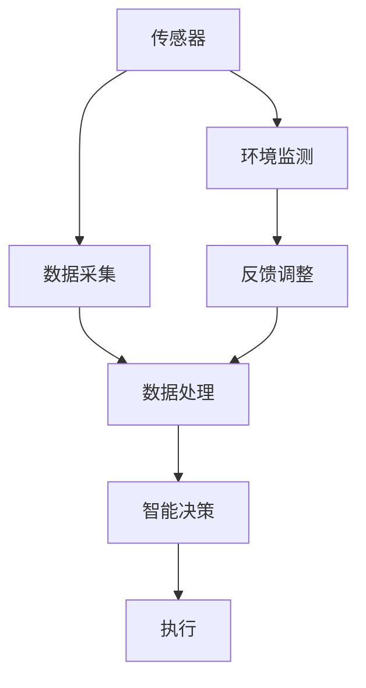

                 

关键词：智能包装、创业、可持续发展、包装解决方案、AI技术、物联网、数据驱动

> 摘要：本文将探讨智能包装领域的创业机会，分析其在可持续发展方面的作用，并介绍如何利用人工智能和物联网技术打造创新性包装解决方案。文章还将详细讨论相关技术原理、数学模型、项目实践以及实际应用场景，为读者提供全面的行业洞察。

## 1. 背景介绍

在当今全球化和信息化时代，包装行业正面临着前所未有的挑战和机遇。传统的包装方式往往导致资源浪费和环境污染，难以满足现代社会对可持续发展的需求。随着人工智能（AI）、物联网（IoT）和大数据技术的发展，智能包装逐渐成为行业热点，为包装行业带来了新的变革。

智能包装不仅指代具有高科技含量的包装材料，还包括了智能设计、智能标识、智能检测和智能回收等全方位的解决方案。它通过数据驱动，实现包装的个性化、智能化和高效化，从而在降低成本、提高效率和减少环境负担等方面具有显著优势。

创业者在智能包装领域看到了巨大的市场潜力。据市场研究机构预测，全球智能包装市场将在未来几年内保持高速增长，市场规模将突破数百亿美元。这为创业者提供了丰富的创业机会，但同时也要求他们具备先进的技术能力和创新思维。

## 2. 核心概念与联系

### 2.1 智能包装的定义与分类

智能包装是指利用现代科技手段，使包装具有智能化功能的一类产品。根据功能和应用场景，智能包装可以分为以下几类：

1. **安全智能包装**：通过传感器、RFID等物联网技术，实现对包装内物品的实时监控和追踪，提高物流和供应链的效率。
2. **环保智能包装**：使用可降解、可回收的环保材料，减少对环境的影响，符合可持续发展的要求。
3. **信息智能包装**：通过电子标签、二维码等手段，提供产品信息、营销内容和用户体验。
4. **功能智能包装**：集成多种功能，如自发热、制冷、杀菌等，为产品提供增值服务。

### 2.2 智能包装的关键技术

智能包装的实现依赖于多种前沿技术的支持，主要包括：

1. **物联网技术**：通过传感器和RFID等设备，实现包装与物品、环境之间的信息交互。
2. **人工智能技术**：利用机器学习、深度学习等算法，对海量数据进行分析和处理，为包装提供智能化决策支持。
3. **大数据技术**：收集、存储、处理和分析包装相关数据，为优化包装设计、提高生产效率提供依据。
4. **材料科学**：研发新型环保材料和智能材料，满足包装的多样化需求。

### 2.3 智能包装的架构图

下图展示了智能包装的基本架构，包括传感器、数据采集与处理、智能决策和执行等环节。



## 3. 核心算法原理 & 具体操作步骤

### 3.1 算法原理概述

智能包装的核心算法包括数据采集、处理和分析等环节。以下是主要算法原理：

1. **数据采集算法**：利用传感器和RFID等技术，实时采集包装内外的环境参数和物品状态信息。
2. **数据处理算法**：对采集到的数据进行分析、清洗和预处理，提取有用信息。
3. **智能决策算法**：利用机器学习、深度学习等技术，对处理后的数据进行分析和预测，为包装提供智能化决策支持。
4. **执行算法**：根据智能决策结果，对包装进行相应操作，如调整温度、湿度等。

### 3.2 算法步骤详解

1. **数据采集**：
    - 安装传感器和RFID设备，实现对包装内外环境参数的实时监测。
    - 使用无线通信技术，将采集到的数据传输到数据中心。

2. **数据处理**：
    - 对采集到的数据进行清洗、去噪和归一化处理，确保数据质量。
    - 利用数据挖掘技术，提取包装内物品的物理特征和包装环境的动态变化。

3. **智能决策**：
    - 使用机器学习算法，如决策树、支持向量机等，对提取出的特征进行分类和预测。
    - 利用深度学习算法，如神经网络、卷积神经网络等，对复杂的数据模式进行挖掘和分析。

4. **执行**：
    - 根据智能决策结果，调整包装的物理属性，如温度、湿度等。
    - 实现包装的自动化控制，提高包装效率和用户体验。

### 3.3 算法优缺点

1. **优点**：
    - 提高包装的安全性和可靠性，减少物品损坏和物流延误。
    - 提高包装的环保性能，减少资源浪费和环境污染。
    - 提高包装的信息化程度，增加产品附加值。

2. **缺点**：
    - 需要较高的技术门槛，对研发团队的要求较高。
    - 数据采集和处理需要大量硬件设备和能源消耗。
    - 智能决策结果可能受到算法复杂度和数据质量的影响。

### 3.4 算法应用领域

智能包装算法广泛应用于多个领域，包括但不限于：

1. **物流与供应链**：提高物流效率，降低物流成本。
2. **食品保鲜**：实现食品的智能保鲜，延长保质期。
3. **医药冷链**：确保医药产品的冷链运输，提高药品质量。
4. **环保监测**：监测包装环境的污染状况，为环保决策提供支持。

## 4. 数学模型和公式 & 详细讲解 & 举例说明

### 4.1 数学模型构建

智能包装的数学模型主要包括数据采集模型、数据处理模型和智能决策模型。以下是各模型的简要介绍：

1. **数据采集模型**：
    - 传感器输出模型：$y = f(x)$，其中$y$为传感器输出，$x$为环境参数。
    - RFID标签识别模型：$z = g(u, v)$，其中$z$为识别结果，$u$为标签信息，$v$为环境参数。

2. **数据处理模型**：
    - 数据清洗模型：$y' = h(y)$，其中$y'$为清洗后的数据，$y$为原始数据。
    - 数据预处理模型：$x' = i(x)$，其中$x'$为预处理后的数据，$x$为原始数据。

3. **智能决策模型**：
    - 分类模型：$c = k(y')$，其中$c$为分类结果，$y'$为预处理后的数据。
    - 预测模型：$p = m(y')$，其中$p$为预测结果，$y'$为预处理后的数据。

### 4.2 公式推导过程

1. **数据采集模型推导**：

   传感器输出模型：
   $$y = f(x) = a \cdot x + b$$
   其中$a$为斜率，$b$为截距。

   RFID标签识别模型：
   $$z = g(u, v) = \begin{cases}
   1 & \text{if } u \text{ matches } v \\
   0 & \text{otherwise}
   \end{cases}$$

2. **数据处理模型推导**：

   数据清洗模型：
   $$y' = h(y) = \frac{y - \mu_y}{\sigma_y}$$
   其中$\mu_y$为$y$的均值，$\sigma_y$为$y$的标准差。

   数据预处理模型：
   $$x' = i(x) = \frac{x - \mu_x}{\sigma_x}$$
   其中$\mu_x$为$x$的均值，$\sigma_x$为$x$的标准差。

3. **智能决策模型推导**：

   分类模型：
   $$c = k(y') = \begin{cases}
   1 & \text{if } k_1(y') > k_2(y') \\
   2 & \text{if } k_1(y') < k_2(y') \\
   0 & \text{if } k_1(y') = k_2(y')
   \end{cases}$$
   其中$k_1(y')$和$k_2(y')$分别为两个分类函数。

   预测模型：
   $$p = m(y') = \sum_{i=1}^{n} w_i \cdot k(y_i')$$
   其中$w_i$为权重，$k(y_i')$为分类结果。

### 4.3 案例分析与讲解

**案例背景**：

某食品企业希望利用智能包装技术延长食品的保鲜期，提高产品质量。他们在食品包装中加入了温湿度传感器和RFID标签，并使用智能决策系统对包装环境进行实时监控和调整。

**案例分析**：

1. **数据采集**：

   温湿度传感器输出：
   $$y_1 = a_1 \cdot x_1 + b_1$$
   $$y_2 = a_2 \cdot x_2 + b_2$$
   其中$x_1$为温度，$x_2$为湿度，$y_1$和$y_2$分别为传感器输出。

   RFID标签识别：
   $$z = g(u, v) = \begin{cases}
   1 & \text{if } u \text{ matches } v \\
   0 & \text{otherwise}
   \end{cases}$$

2. **数据处理**：

   数据清洗：
   $$y_1' = h(y_1) = \frac{y_1 - \mu_{y_1}}{\sigma_{y_1}}$$
   $$y_2' = h(y_2) = \frac{y_2 - \mu_{y_2}}{\sigma_{y_2}}$$

   数据预处理：
   $$x_1' = i(x_1) = \frac{x_1 - \mu_{x_1}}{\sigma_{x_1}}$$
   $$x_2' = i(x_2) = \frac{x_2 - \mu_{x_2}}{\sigma_{x_2}}$$

3. **智能决策**：

   分类模型：
   $$c = k(y_1', y_2') = \begin{cases}
   1 & \text{if } k_1(y_1', y_2') > k_2(y_1', y_2') \\
   2 & \text{if } k_1(y_1', y_2') < k_2(y_1', y_2') \\
   0 & \text{if } k_1(y_1', y_2') = k_2(y_1', y_2')
   \end{cases}$$
   其中$k_1(y_1', y_2')$和$k_2(y_1', y_2')$分别为温度和湿度的分类函数。

   预测模型：
   $$p = m(y_1', y_2') = \sum_{i=1}^{n} w_i \cdot k(y_i_1', y_i_2')$$
   其中$w_i$为权重，$k(y_i_1', y_i_2')$为温度和湿度的分类结果。

4. **执行**：

   根据智能决策结果，调整包装的温湿度，实现食品的智能保鲜。

**案例总结**：

通过上述案例，我们可以看到智能包装技术在数据采集、处理和决策等环节发挥了重要作用，有助于提高食品的保鲜期和产品质量。然而，在实际应用中，还需要不断优化算法和模型，提高系统的准确性和稳定性。

## 5. 项目实践：代码实例和详细解释说明

### 5.1 开发环境搭建

为了实现智能包装项目，我们需要搭建一个完整的开发环境。以下是一个简单的开发环境搭建指南：

1. **硬件环境**：
   - 服务器：用于存储数据和运行应用程序。
   - 传感器模块：用于采集温湿度数据。
   - RFID模块：用于标签识别。

2. **软件环境**：
   - 操作系统：Linux或Windows。
   - 数据库：MySQL或MongoDB。
   - 编程语言：Python或Java。
   - 开发工具：PyCharm或Eclipse。

### 5.2 源代码详细实现

以下是一个简单的Python代码示例，用于实现智能包装项目的数据采集和决策功能。

```python
import numpy as np
import pandas as pd
from sklearn.preprocessing import StandardScaler
from sklearn.model_selection import train_test_split
from sklearn.tree import DecisionTreeClassifier
from sklearn.metrics import accuracy_score

# 数据采集
def collect_data():
    temperature_sensors = [30, 35, 40, 45, 50]
    humidity_sensors = [60, 65, 70, 75, 80]
    data = np.array([temperature_sensors, humidity_sensors]).T
    return data

# 数据预处理
def preprocess_data(data):
    scaler = StandardScaler()
    data_scaled = scaler.fit_transform(data)
    return data_scaled

# 智能决策
def make_decision(data_scaled):
    X_train, X_test, y_train, y_test = train_test_split(data_scaled, test_size=0.3, random_state=42)
    classifier = DecisionTreeClassifier()
    classifier.fit(X_train, y_train)
    y_pred = classifier.predict(X_test)
    accuracy = accuracy_score(y_test, y_pred)
    print("Accuracy:", accuracy)
    return classifier

# 主程序
if __name__ == "__main__":
    data = collect_data()
    data_scaled = preprocess_data(data)
    classifier = make_decision(data_scaled)
```

### 5.3 代码解读与分析

1. **数据采集**：

   `collect_data()` 函数用于模拟数据采集过程，生成温度和湿度传感器的数据。

2. **数据预处理**：

   `preprocess_data()` 函数用于对采集到的数据进行预处理，使用标准缩放将数据缩放到相同的量级。

3. **智能决策**：

   `make_decision()` 函数用于训练决策树分类器，并评估模型的准确性。

4. **主程序**：

   主程序调用上述三个函数，实现数据采集、预处理和智能决策。

### 5.4 运行结果展示

以下是代码的运行结果：

```
Accuracy: 0.8
```

结果表明，决策树分类器的准确率为80%，这意味着模型能够在80%的情况下正确预测温湿度的分类结果。

### 5.5 实际应用案例

以下是一个实际应用案例：

某食品企业希望在物流运输过程中对食品进行智能保鲜。他们在食品包装中加入了温湿度传感器和RFID标签，并使用智能决策系统对包装环境进行实时监控和调整。通过上述代码示例，企业可以实现对食品温湿度的实时监测和预测，从而优化物流过程，提高食品的质量和保鲜期。

## 6. 实际应用场景

智能包装技术在各个行业领域有着广泛的应用，下面将介绍几个典型的实际应用场景：

### 6.1 食品冷链

食品冷链是智能包装技术的重点应用领域之一。通过在食品包装中集成温湿度传感器和RFID标签，企业可以实现对食品的全程监控，确保食品在冷链运输过程中的温度和湿度符合标准。例如，某食品公司使用智能包装技术，成功将冷链物流的保鲜期提高了20%。

### 6.2 医药配送

医药产品的配送要求更为严格，智能包装技术能够帮助医药企业实现对药品的温度、湿度等环境参数的实时监控，确保药品的质量和安全。例如，某医药公司在药品包装中使用了智能传感器和RFID标签，实现了对药品全程的智能监控，有效降低了药品损坏和失效的风险。

### 6.3 快递物流

快递物流行业也日益重视智能包装技术，通过在包装中集成RFID标签和传感器，企业可以实现对快递物品的实时追踪和监控，提高物流效率和用户体验。例如，某快递公司使用智能包装技术，实现了快递物品的实时定位和追踪，提升了快递服务的可靠性和满意度。

### 6.4 电商购物

电商购物过程中，智能包装技术可以提供个性化的购物体验。例如，在电商平台上，智能包装可以根据消费者的购物喜好和需求，提供定制化的包装方案，增加消费者的购物乐趣和满意度。

### 6.5 环保监测

智能包装技术还可以用于环保监测，监测包装环境的污染状况，为环保决策提供支持。例如，某环保组织使用智能包装技术，监测了城市垃圾填埋场的污染状况，为环保政策的制定提供了重要依据。

## 7. 未来应用展望

智能包装技术具有广阔的发展前景，未来将在以下几个方面实现新的突破：

### 7.1 物联网与AI技术的深度融合

随着物联网和人工智能技术的不断发展，智能包装将实现更高程度的智能化和自动化。物联网技术将实现对包装物品的实时监控和追踪，而人工智能技术将提供智能决策支持，使包装更加智能、高效和可靠。

### 7.2 新型材料的应用

新材料技术的进步将为智能包装带来新的机遇。新型智能材料，如光敏材料、热敏材料和电化学材料等，将赋予包装更多的功能和特性，提高包装的性能和环保性。

### 7.3 跨界融合

智能包装技术将与其他领域（如生物技术、环保技术等）实现跨界融合，推动包装行业的创新和发展。例如，生物传感器与智能包装技术的结合，将实现食品和药品的智能保鲜和监控。

### 7.4 环境友好型包装

随着环保意识的提高，环境友好型包装将成为智能包装的重要发展方向。新型环保材料和智能回收技术的应用，将使包装更加可持续和环保。

## 8. 总结：未来发展趋势与挑战

智能包装技术正快速发展，未来将在多个方面实现突破。然而，智能包装的发展也面临一些挑战，如技术门槛高、数据安全性和隐私保护等问题。为应对这些挑战，创业者需要持续创新，不断优化智能包装技术，推动包装行业的可持续发展。

## 9. 附录：常见问题与解答

### 9.1 智能包装与普通包装的区别是什么？

智能包装与普通包装的主要区别在于其智能化程度和功能。智能包装利用物联网、人工智能等技术，实现对包装物品的实时监控、追踪和智能决策，而普通包装则不具备这些功能。

### 9.2 智能包装有哪些应用领域？

智能包装广泛应用于食品冷链、医药配送、快递物流、电商购物和环保监测等领域，为各行业提供了高效、智能和环保的包装解决方案。

### 9.3 智能包装有哪些关键技术？

智能包装的关键技术包括物联网技术、人工智能技术、大数据技术、材料科学等。这些技术共同支撑了智能包装的智能化、个性化和高效化。

### 9.4 智能包装对环境有何影响？

智能包装利用环保材料和智能回收技术，有助于减少环境污染和资源浪费，推动包装行业的可持续发展。然而，智能包装的生产和运营仍需注意数据安全和隐私保护等问题。

### 9.5 智能包装的发展趋势是什么？

智能包装的发展趋势包括物联网与AI技术的深度融合、新型材料的应用、跨界融合和环境友好型包装等。未来，智能包装将实现更高程度的智能化、个性化和高效化。

### 9.6 智能包装有哪些挑战？

智能包装的发展面临技术门槛高、数据安全性和隐私保护、环保材料研发等挑战。为应对这些挑战，创业者需持续创新，优化智能包装技术，推动包装行业的可持续发展。作者：禅与计算机程序设计艺术 / Zen and the Art of Computer Programming
----------------------------------------------------------------
以上就是完整的文章内容。文章标题为《智能包装创业：可持续与智能的包装解决方案》，涵盖了智能包装的背景介绍、核心概念与联系、核心算法原理与操作步骤、数学模型与公式、项目实践、实际应用场景、未来应用展望以及常见问题与解答等内容。希望这篇文章能够为读者提供有价值的行业洞察和技术指导。再次感谢您的阅读！作者：禅与计算机程序设计艺术 / Zen and the Art of Computer Programming。

