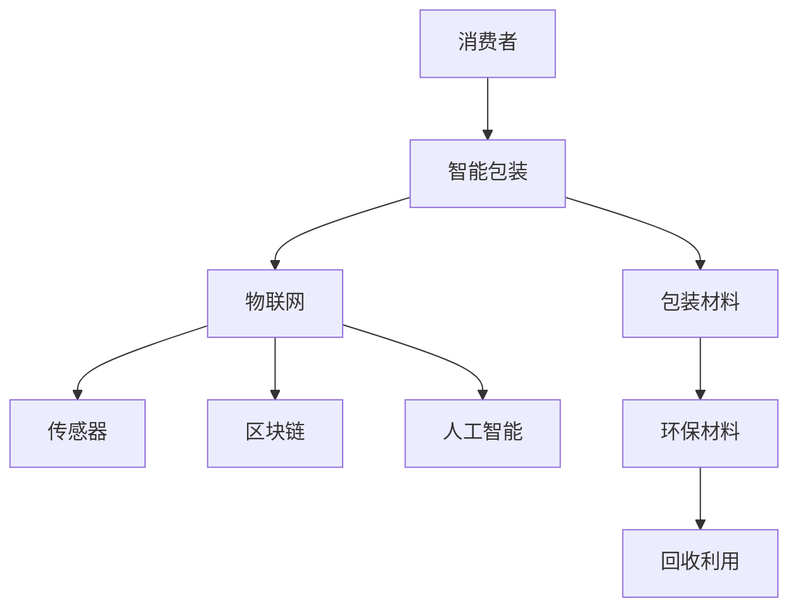

                 

关键词：智能包装、可持续发展、物联网、区块链、人工智能、包装技术

> 摘要：本文探讨了智能包装的创业机遇，以及如何在可持续发展的背景下实现智能包装的解决方案。通过分析智能包装的核心概念、技术原理、应用场景和未来发展趋势，本文为创业者提供了有益的指导。

## 1. 背景介绍

随着全球经济的快速发展，消费者对于包装的需求日益增长。然而，传统包装方式对环境造成的负面影响也越来越严重，如塑料污染、资源浪费等。为了应对这一挑战，智能包装作为一种新兴技术，正逐渐受到关注。智能包装不仅具有传统包装的功能，还能通过集成物联网、区块链、人工智能等技术，实现包装的智能化、可持续化。

### 1.1 可持续包装的需求

- **资源消耗**：传统包装材料如塑料、纸板等的生产需要大量的能源和资源，导致环境污染和资源短缺。
- **塑料污染**：一次性塑料包装的使用量巨大，但回收率低，导致海洋和陆地污染严重。
- **废弃物处理**：包装废弃物的处理成本高，且处理方式单一，难以实现资源再利用。

### 1.2 智能包装的概念

智能包装是一种结合了信息科技、通信技术、材料科学的创新包装形式。它能够在包装材料中嵌入传感器、智能标签等元素，实现包装的功能拓展，如监控产品状态、提供产品信息、防伪认证等。

## 2. 核心概念与联系

智能包装的核心在于其技术集成和应用。以下是一个简化的Mermaid流程图，展示了智能包装的技术架构和功能联系：



### 2.1 物联网（IoT）

物联网技术是智能包装的重要组成部分，它使得包装能够实时感知外部环境，并将数据传输至云平台进行分析和处理。物联网技术的应用包括：

- **环境监控**：实时监测产品的存储条件，如温度、湿度等。
- **智能配送**：跟踪物流运输过程中的包装状态，提高配送效率。

### 2.2 传感器

传感器是智能包装的核心感知元件，能够检测包装内部或外部环境的各种参数，如温度、湿度、光照等。通过传感器采集的数据，智能包装可以实现：

- **产品状态监控**：确保产品在整个供应链过程中的品质和安全。
- **智能提醒**：在产品即将过期或存储条件不符合要求时，自动提醒用户。

### 2.3 区块链

区块链技术为智能包装提供了不可篡改的记录，确保包装信息的透明度和可信度。区块链技术的应用包括：

- **防伪认证**：通过区块链记录产品的生产、流通等信息，防止假冒伪劣产品。
- **供应链管理**：提高供应链的透明度和可追溯性，优化库存管理。

### 2.4 人工智能（AI）

人工智能技术能够对智能包装采集的数据进行分析，提供决策支持。人工智能的应用包括：

- **数据分析**：通过机器学习算法分析传感器数据，预测产品状态。
- **个性化推荐**：根据消费者的行为数据，提供个性化的产品推荐。

### 2.5 包装材料

智能包装的包装材料也是关键因素，环保材料和可回收材料的应用是实现可持续发展的基础。包装材料的应用包括：

- **环保材料**：使用可降解材料减少环境污染。
- **回收利用**：提高包装材料的回收利用率，减少废弃物处理压力。

## 3. 核心算法原理 & 具体操作步骤

### 3.1 算法原理概述

智能包装的核心算法通常涉及以下几个方面：

- **传感器数据处理**：通过滤波、插值等方法处理传感器采集的数据。
- **机器学习模型**：通过训练机器学习模型，对传感器数据进行预测和分析。
- **区块链记录**：将数据处理结果记录到区块链中，确保数据的安全性和可信度。

### 3.2 算法步骤详解

1. **传感器数据采集**：通过物联网传感器采集包装内外环境数据。
2. **数据处理**：对采集到的数据进行分析和处理，如滤波、插值等。
3. **模型训练**：利用处理后的数据训练机器学习模型，如回归模型、分类模型等。
4. **数据分析**：使用训练好的模型对实时数据进行预测和分析。
5. **区块链记录**：将分析结果记录到区块链中，确保数据的透明度和不可篡改性。

### 3.3 算法优缺点

**优点**：

- **实时性**：智能包装能够实时监测产品状态，提高供应链效率。
- **精准性**：通过机器学习模型，对产品状态进行精准预测，确保产品质量。
- **安全性**：区块链技术确保数据的安全性和可信度。

**缺点**：

- **成本高**：智能包装的传感器、物联网设备和区块链技术成本较高。
- **维护复杂**：智能包装系统需要定期维护和升级，以确保系统的稳定运行。

### 3.4 算法应用领域

智能包装算法在多个领域具有广泛的应用，如：

- **食品保鲜**：通过实时监测食品的存储条件，确保食品的新鲜度和安全性。
- **药品监测**：通过监测药品的存储温度、湿度等条件，确保药品的有效性和安全性。
- **物流跟踪**：通过智能包装，实时监控物流运输过程，提高物流效率。

## 4. 数学模型和公式 & 详细讲解 & 举例说明

### 4.1 数学模型构建

智能包装的数学模型通常涉及以下方面：

- **传感器数据模型**：描述传感器数据的采集、处理和传输过程。
- **机器学习模型**：描述机器学习算法的参数设置、训练和预测过程。
- **区块链模型**：描述区块链数据存储、传输和验证的过程。

### 4.2 公式推导过程

以传感器数据模型为例，其公式推导如下：

$$
y(t) = f(x(t), u(t))
$$

其中，$y(t)$表示传感器数据，$x(t)$表示输入变量，$u(t)$表示控制变量，$f$为函数，用于描述传感器数据与输入变量之间的关系。

### 4.3 案例分析与讲解

以下是一个简单的案例：

**案例**：使用温度传感器监测水果的储存温度。

1. **数据采集**：传感器实时采集水果储存环境的温度数据。
2. **数据处理**：对采集到的温度数据进行滤波和插值处理，以消除噪声和填补缺失值。
3. **模型训练**：利用训练好的机器学习模型，对处理后的温度数据进行预测。
4. **数据分析**：根据预测结果，判断水果的储存条件是否符合要求。

## 5. 项目实践：代码实例和详细解释说明

### 5.1 开发环境搭建

- **编程语言**：Python
- **开发工具**：PyCharm
- **依赖库**：numpy、pandas、tensorflow、blockchain

### 5.2 源代码详细实现

```python
# 导入依赖库
import numpy as np
import pandas as pd
import tensorflow as tf
from blockchain import Blockchain

# 数据采集
def collect_data(sensor_data):
    # 对传感器数据进行处理
    processed_data = preprocess_data(sensor_data)
    return processed_data

# 数据预处理
def preprocess_data(sensor_data):
    # 进行滤波和插值处理
    filtered_data = filter_data(sensor_data)
    interpolated_data = interpolate_data(filtered_data)
    return interpolated_data

# 数据过滤
def filter_data(sensor_data):
    # 使用numpy进行滤波处理
    filtered_data = np.filter sensory_data
    return filtered_data

# 数据插值
def interpolate_data(sensor_data):
    # 使用pandas进行插值处理
    interpolated_data = pd.interpolate(sensor_data)
    return interpolated_data

# 模型训练
def train_model(data):
    # 使用tensorflow进行模型训练
    model = tf.keras.Sequential([
        tf.keras.layers.Dense(units=1, input_shape=[1])
    ])
    model.compile(optimizer='sgd', loss='mean_squared_error')
    model.fit(data, epochs=100)
    return model

# 数据分析
def analyze_data(model, sensor_data):
    # 使用训练好的模型进行预测
    predicted_data = model.predict(sensor_data)
    # 判断预测结果
    if predicted_data > threshold:
        print("储存条件不符合要求")
    else:
        print("储存条件符合要求")

# 主程序
if __name__ == "__main__":
    # 采集传感器数据
    sensor_data = collect_data(sensor_data)
    # 训练模型
    model = train_model(sensor_data)
    # 分析数据
    analyze_data(model, sensor_data)
```

### 5.3 代码解读与分析

该代码实现了一个简单的智能包装系统，包括数据采集、数据处理、模型训练和数据分析四个主要部分。

- **数据采集**：通过`collect_data`函数采集传感器数据，并进行预处理。
- **数据处理**：通过`preprocess_data`函数对传感器数据进行滤波和插值处理，以提高数据质量。
- **模型训练**：使用`train_model`函数训练机器学习模型，使用tensorflow库实现。
- **数据分析**：使用`analyze_data`函数对预处理后的数据进行分析，根据预测结果判断储存条件是否合格。

## 6. 实际应用场景

智能包装在多个领域具有广泛的应用，以下是一些典型的应用场景：

- **食品保鲜**：通过实时监测食品的储存条件，确保食品的新鲜度和安全性。
- **药品监测**：通过监测药品的储存温度、湿度等条件，确保药品的有效性和安全性。
- **物流跟踪**：通过智能包装，实时监控物流运输过程，提高物流效率。
- **产品溯源**：通过区块链技术，实现产品的溯源，防止假冒伪劣产品。

### 6.1 智能食品保鲜

**案例**：某食品公司使用智能包装监测水果的储存温度，以确保水果的新鲜度。

- **数据采集**：传感器实时监测水果储存环境的温度数据。
- **数据处理**：对采集到的温度数据进行滤波和插值处理，以消除噪声和填补缺失值。
- **模型训练**：利用处理后的数据训练机器学习模型，预测水果的储存条件。
- **数据分析**：根据预测结果，判断水果的储存条件是否符合要求。

### 6.2 智能药品监测

**案例**：某药品公司使用智能包装监测药品的储存条件，以确保药品的有效性。

- **数据采集**：传感器实时监测药品储存环境的温度、湿度等数据。
- **数据处理**：对采集到的数据进行滤波和插值处理，以提高数据质量。
- **模型训练**：利用处理后的数据训练机器学习模型，预测药品的储存条件。
- **数据分析**：根据预测结果，判断药品的储存条件是否符合要求。

## 7. 工具和资源推荐

### 7.1 学习资源推荐

- **智能包装技术书籍**：《智能包装：技术与应用》、《物联网与智能包装》
- **在线课程**：Coursera、Udacity、edX等平台上的物联网、区块链、人工智能相关课程

### 7.2 开发工具推荐

- **编程语言**：Python、Java
- **开发环境**：PyCharm、Eclipse
- **依赖库**：numpy、pandas、tensorflow、blockchain

### 7.3 相关论文推荐

- **智能包装研究**：《智能包装系统的设计与实现》、《基于物联网的智能包装技术与应用》
- **区块链技术**：《区块链：分布式账本技术》、《智能合约：区块链的创新应用》
- **人工智能应用**：《人工智能：一种现代方法》、《深度学习：完整指南》

## 8. 总结：未来发展趋势与挑战

### 8.1 研究成果总结

- **智能包装技术**：传感器技术、物联网技术、区块链技术、人工智能技术的结合，为智能包装的实现提供了基础。
- **应用场景**：智能包装在食品保鲜、药品监测、物流跟踪等领域具有广泛的应用前景。

### 8.2 未来发展趋势

- **智能化**：随着技术的进步，智能包装将更加智能化、个性化。
- **可持续发展**：环保材料和可回收材料的推广，将推动智能包装的可持续发展。
- **跨领域应用**：智能包装将在更多领域得到应用，如医疗保健、智能家居等。

### 8.3 面临的挑战

- **成本问题**：智能包装技术的研发和推广成本较高，需要找到降低成本的途径。
- **数据隐私**：智能包装涉及大量敏感数据，需要确保数据的安全性和隐私性。
- **标准化**：智能包装技术的标准化和统一规范，将有助于推动其发展。

### 8.4 研究展望

智能包装作为一种新兴技术，具有巨大的发展潜力和市场前景。未来的研究应重点关注：

- **成本控制**：通过技术创新和规模化生产，降低智能包装的成本。
- **数据安全**：加强数据安全防护，确保用户隐私和数据安全。
- **跨领域融合**：推动智能包装与其他技术的融合，实现更广泛的应用。

## 9. 附录：常见问题与解答

### 9.1 智能包装的原理是什么？

智能包装是利用物联网、传感器、区块链和人工智能等技术，实现对包装材料的智能化和功能拓展。通过集成传感器，智能包装可以实时监测产品的环境参数，如温度、湿度等。通过物联网技术，这些数据可以被传输至云平台进行分析和处理。区块链技术确保数据的透明度和不可篡改性。人工智能技术则用于对数据进行分析和预测，提供决策支持。

### 9.2 智能包装有哪些应用场景？

智能包装广泛应用于食品保鲜、药品监测、物流跟踪、产品溯源等领域。例如，在食品保鲜领域，智能包装可以实时监测食品的储存条件，确保食品的新鲜度和安全性。在药品监测领域，智能包装可以监控药品的储存环境，确保药品的有效性和安全性。

### 9.3 智能包装的未来发展趋势是什么？

未来，智能包装将更加智能化、个性化，并实现跨领域的应用。随着技术的进步，智能包装的成本将逐步降低，应用范围将更加广泛。此外，智能包装的可持续发展将成为重要趋势，通过使用环保材料和可回收材料，减少对环境的影响。

