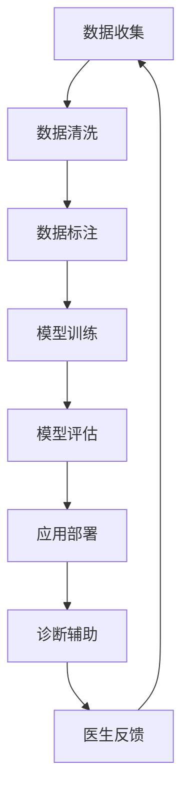

                 

关键词：智能医疗，AI辅助诊断，精准医疗，创业，技术路线，案例分析

> 摘要：本文深入探讨了智能医疗诊断创业领域的机遇与挑战。文章从背景介绍入手，分析了AI辅助精准医疗的发展现状与趋势，详细阐述了核心算法原理、数学模型构建以及具体的应用案例。此外，文章还展望了未来智能医疗诊断的发展方向，提出了相关工具和资源的推荐，并总结了研究成果和未来研究的展望。

## 1. 背景介绍

随着人工智能（AI）技术的飞速发展，医疗行业迎来了前所未有的变革。传统的医疗诊断模式已无法满足日益增长的医疗需求，尤其是在个性化医疗和疾病预测方面。AI技术以其强大的数据处理能力和高效的模式识别能力，为医疗诊断带来了全新的解决方案。

智能医疗诊断创业正是顺应这一趋势的产物。创业者们利用AI技术，开发出一系列辅助医生进行疾病诊断和治疗方案制定的应用，这不仅提高了医疗效率，还提升了诊断的准确性和个性化水平。然而，智能医疗诊断创业也面临着诸多挑战，如数据隐私、算法公平性以及技术实现的复杂性等。

本文将重点探讨智能医疗诊断创业的发展现状、核心算法原理、数学模型构建以及实际应用案例，为读者提供一份全面的技术指南。通过分析这些案例，我们希望能够为创业者在智能医疗领域的发展提供一些启示和参考。

## 2. 核心概念与联系

### 2.1 AI辅助诊断的基本概念

AI辅助诊断是指利用人工智能技术，特别是机器学习和深度学习算法，对医疗数据进行处理和分析，从而辅助医生进行疾病诊断。这种技术可以大大提高诊断的准确性和效率，减少人为错误，同时也能够帮助医生更好地了解患者的病情和疾病发展动态。

在AI辅助诊断中，常见的技术包括图像识别、自然语言处理、数据挖掘和深度学习等。图像识别技术主要用于医疗影像的分析，如X光片、CT扫描和MRI等；自然语言处理技术则用于处理医生和患者的交流记录，如病历和问诊记录；数据挖掘技术则主要用于从大规模医疗数据中提取有用的信息和规律；深度学习技术则是当前最热门的人工智能技术，它通过神经网络模型对大量数据进行训练，从而实现对复杂问题的建模和预测。

### 2.2 AI辅助诊断的关键联系

AI辅助诊断的关键联系在于数据、算法和应用场景。首先，数据是AI辅助诊断的基础。医疗数据包括结构化数据（如病历记录、实验室检测结果）和非结构化数据（如医学影像、患者问诊记录）。这些数据需要经过清洗、标注和预处理，以便用于模型的训练和预测。

其次，算法是实现AI辅助诊断的核心。不同的算法适用于不同类型的数据和应用场景。例如，卷积神经网络（CNN）在图像识别方面表现优异，而循环神经网络（RNN）在处理序列数据（如自然语言处理）方面具有优势。深度学习算法通过多层神经网络结构，能够自动学习数据的复杂特征，从而实现高精度的疾病预测和诊断。

最后，应用场景是AI辅助诊断的具体体现。智能医疗诊断的应用场景非常广泛，包括但不限于癌症筛查、心脏病诊断、遗传疾病预测、糖尿病管理以及患者康复等。不同的应用场景需要不同的算法和技术解决方案，同时也对数据的质量和规模提出了不同的要求。

### 2.3 Mermaid 流程图

为了更直观地展示AI辅助诊断的核心概念和联系，我们使用Mermaid流程图来描述。



在该流程图中，数据收集是整个流程的起点，数据经过清洗、标注和预处理后用于模型训练。训练好的模型经过评估和优化，最终部署到实际应用中，为医生提供诊断辅助。医生的经验和反馈则用于进一步优化模型，形成一个闭环系统。

## 3. 核心算法原理 & 具体操作步骤

### 3.1 算法原理概述

智能医疗诊断的核心算法主要包括机器学习算法和深度学习算法。其中，机器学习算法如支持向量机（SVM）、决策树（DT）和随机森林（RF）等主要用于处理结构化数据，如患者的病历记录和实验室检测结果。而深度学习算法如卷积神经网络（CNN）、循环神经网络（RNN）和长短期记忆网络（LSTM）等则擅长处理非结构化数据，如医学影像和患者问诊记录。

在机器学习算法中，支持向量机通过寻找最佳分类超平面来实现疾病的分类和预测。决策树则通过划分数据空间来构建决策规则，从而实现对疾病诊断的判断。随机森林则通过构建多个决策树，并结合集成学习方法来提高预测的准确性和稳定性。

深度学习算法中，卷积神经网络通过卷积操作提取图像的局部特征，从而实现医学影像的分析。循环神经网络则通过处理序列数据，实现对自然语言文本的理解。长短期记忆网络在处理长序列数据时，能够有效避免梯度消失和梯度爆炸问题，从而实现对疾病预测的长期依赖性建模。

### 3.2 算法步骤详解

#### 3.2.1 数据收集与预处理

数据收集是智能医疗诊断的第一步。数据来源包括医院病历系统、实验室检测结果、医学影像以及患者问诊记录等。在数据收集过程中，需要确保数据的完整性和真实性，以避免对模型训练和应用带来偏差。

数据预处理是模型训练前的重要步骤。数据预处理包括数据清洗、数据归一化和特征提取等。数据清洗主要去除噪声数据和缺失值，数据归一化则将不同特征的数据进行标准化处理，特征提取则通过降维或特征工程方法提取出对疾病诊断有重要影响的关键特征。

#### 3.2.2 模型训练

模型训练是智能医疗诊断的核心步骤。根据不同的数据类型和应用场景，选择合适的机器学习算法或深度学习算法进行训练。在模型训练过程中，需要调整模型的参数，如学习率、正则化参数和激活函数等，以获得最佳的训练效果。

对于机器学习算法，如支持向量机，需要通过交叉验证方法选择最佳的超参数，并通过多次迭代训练来优化模型的分类边界。对于深度学习算法，如卷积神经网络，需要通过反向传播算法不断调整网络参数，以最小化模型的损失函数。

#### 3.2.3 模型评估与优化

模型评估是验证模型性能的重要环节。常用的评估指标包括准确率、召回率、F1值和ROC曲线等。通过评估指标，可以了解模型的分类效果和预测准确性。

模型优化则通过调整模型参数和结构来提高模型的性能。常见的优化方法包括超参数调优、集成学习和迁移学习等。超参数调优通过调整学习率、正则化参数和批量大小等参数来优化模型的训练过程。集成学习通过结合多个模型的预测结果来提高整体预测性能。迁移学习则通过利用其他领域或任务上的预训练模型来提高新任务上的模型性能。

#### 3.2.4 应用部署

模型部署是将训练好的模型应用于实际医疗诊断场景的过程。模型部署需要考虑硬件环境、计算资源和数据安全性等因素。常见的部署方式包括本地部署、云端部署和移动端部署等。

在本地部署中，模型直接运行在本地计算机上，适用于数据量较小和计算资源充足的场景。在云端部署中，模型运行在云服务器上，适用于数据量较大和计算资源紧张的场景。在移动端部署中，模型运行在移动设备上，适用于需要快速响应和便携性的场景。

### 3.3 算法优缺点

#### 3.3.1 优点

- **高效性**：AI辅助诊断算法能够快速处理大量医疗数据，提供即时的诊断结果，提高了诊断效率。
- **准确性**：通过机器学习和深度学习算法，AI辅助诊断能够从大规模数据中学习到疾病的特征和规律，提高了诊断的准确性。
- **个性化**：AI辅助诊断可以根据患者的个体差异，提供个性化的诊断和治疗方案，实现了精准医疗。
- **连续性**：AI辅助诊断可以实现对疾病发展的连续监测和预测，为医生提供全面的疾病管理方案。

#### 3.3.2 缺点

- **数据依赖性**：AI辅助诊断算法的性能很大程度上依赖于数据的质量和规模，数据缺失或不准确可能导致诊断结果偏差。
- **算法透明性**：深度学习算法的黑箱性质使得算法的决策过程难以解释，医生和患者难以理解诊断结果的依据。
- **计算资源需求**：深度学习算法通常需要较大的计算资源和存储空间，对于资源受限的环境可能不适用。
- **隐私和安全**：医疗数据涉及患者隐私，如何确保数据的安全和隐私是一个重要的挑战。

### 3.4 算法应用领域

AI辅助诊断算法在多个医疗领域都有广泛的应用。以下是一些典型的应用领域：

- **癌症筛查**：通过AI算法对医学影像进行分析，实现早期癌症的筛查和诊断，如肺癌、乳腺癌和前列腺癌等。
- **心脏病诊断**：利用AI算法分析心电图、超声心动图等医学影像，实现心脏病的早期诊断和风险评估。
- **遗传疾病预测**：通过分析基因序列和家族病史，利用AI算法预测遗传疾病的风险，如囊性纤维化和唐氏综合症等。
- **糖尿病管理**：利用AI算法分析血糖数据，实现糖尿病的早期诊断和病情监控，提供个性化的治疗方案。
- **患者康复**：通过AI算法对康复过程中的医疗数据进行分析，实现患者康复的个性化指导和效果评估。

## 4. 数学模型和公式 & 详细讲解 & 举例说明

### 4.1 数学模型构建

在智能医疗诊断中，常用的数学模型包括机器学习模型和深度学习模型。下面我们将分别介绍这两种模型的基本构建方法。

#### 4.1.1 机器学习模型

机器学习模型通常采用监督学习的方法进行构建。监督学习模型需要输入特征和标签，通过学习输入特征和输出标签之间的关系，实现对未知数据的预测。常见的机器学习模型包括线性回归、逻辑回归、支持向量机、决策树和随机森林等。

以线性回归为例，其数学模型可以表示为：

$$
y = \beta_0 + \beta_1 \cdot x_1 + \beta_2 \cdot x_2 + ... + \beta_n \cdot x_n
$$

其中，$y$ 是输出标签，$x_1, x_2, ..., x_n$ 是输入特征，$\beta_0, \beta_1, \beta_2, ..., \beta_n$ 是模型参数。

为了训练模型，需要通过最小化损失函数来优化模型参数。常见的损失函数包括均方误差（MSE）和交叉熵损失等。

#### 4.1.2 深度学习模型

深度学习模型采用无监督学习或监督学习的方法进行构建。深度学习模型的核心是神经网络，通过多层神经元的组合，实现对输入数据的复杂特征提取和表示。

以卷积神经网络（CNN）为例，其数学模型可以表示为：

$$
h_{l} = \sigma \left( W_{l} \cdot h_{l-1} + b_{l} \right)
$$

其中，$h_{l}$ 是第 $l$ 层的神经元输出，$W_{l}$ 和 $b_{l}$ 分别是第 $l$ 层的权重和偏置，$\sigma$ 是激活函数。

在深度学习模型中，常用的是反向传播算法来优化模型参数。反向传播算法通过计算损失函数对模型参数的梯度，不断调整权重和偏置，以最小化损失函数。

### 4.2 公式推导过程

以线性回归模型为例，我们介绍损失函数和反向传播算法的推导过程。

#### 4.2.1 损失函数推导

线性回归模型的损失函数通常采用均方误差（MSE）：

$$
J(\theta) = \frac{1}{2m} \sum_{i=1}^{m} \left( h_{\theta}(x^{(i)}) - y^{(i)} \right)^2
$$

其中，$h_{\theta}(x^{(i)}) = \theta_0 + \theta_1 \cdot x^{(i)}$ 是线性回归模型的预测值，$y^{(i)}$ 是实际的输出标签，$m$ 是样本数量。

为了最小化损失函数，需要对损失函数关于模型参数求导，得到梯度：

$$
\frac{\partial J(\theta)}{\partial \theta_j} = \frac{1}{m} \sum_{i=1}^{m} \left( h_{\theta}(x^{(i)}) - y^{(i)} \right) \cdot x_j^{(i)}
$$

其中，$\theta_j$ 是模型参数 $x_j^{(i)}$ 是输入特征。

#### 4.2.2 反向传播算法推导

反向传播算法通过计算损失函数对模型参数的梯度，不断调整权重和偏置，以最小化损失函数。以单层神经网络为例，其梯度计算过程如下：

$$
\frac{\partial J(\theta)}{\partial W_{l}} = \frac{1}{m} \sum_{i=1}^{m} \frac{\partial h_{l}^{(i)}}{\partial W_{l}} \cdot \frac{\partial J(\theta)}{\partial h_{l}^{(i)}}
$$

$$
\frac{\partial J(\theta)}{\partial b_{l}} = \frac{1}{m} \sum_{i=1}^{m} \frac{\partial h_{l}^{(i)}}{\partial b_{l}} \cdot \frac{\partial J(\theta)}{\partial h_{l}^{(i)}}
$$

其中，$h_{l}^{(i)}$ 是第 $l$ 层的神经元输出，$\frac{\partial h_{l}^{(i)}}{\partial W_{l}}$ 和 $\frac{\partial h_{l}^{(i)}}{\partial b_{l}}$ 分别是神经元输出的关于权重和偏置的梯度。

通过反向传播算法，我们可以计算出模型参数的梯度，并利用梯度下降算法更新模型参数：

$$
\theta_{j} := \theta_{j} - \alpha \cdot \frac{\partial J(\theta)}{\partial \theta_{j}}
$$

其中，$\alpha$ 是学习率。

### 4.3 案例分析与讲解

为了更好地理解上述数学模型和公式，我们通过一个简单的线性回归案例进行讲解。

#### 4.3.1 案例背景

假设我们有一个简单的线性回归问题，需要预测学生的考试成绩。输入特征包括学生的数学和英语成绩，输出标签是学生的总成绩。

#### 4.3.2 数据集

为了训练模型，我们收集了100个学生的成绩数据，数据集如下：

| 数学成绩 | 英语成绩 | 总成绩 |
|----------|----------|--------|
| 75      | 85      | 90     |
| 80      | 70      | 85     |
| 65      | 75      | 80     |
| ...     | ...     | ...    |

#### 4.3.3 模型构建

根据线性回归模型的基本公式，我们可以构建如下模型：

$$
y = \beta_0 + \beta_1 \cdot x_1 + \beta_2 \cdot x_2
$$

其中，$x_1$ 和 $x_2$ 分别是数学成绩和英语成绩，$y$ 是总成绩，$\beta_0, \beta_1, \beta_2$ 是模型参数。

#### 4.3.4 模型训练

通过梯度下降算法，我们可以训练模型参数。假设初始参数为 $\beta_0 = 0, \beta_1 = 0, \beta_2 = 0$，学习率为 $\alpha = 0.01$，则训练过程如下：

1. 计算预测值：
   $$ h_{\theta}(x^{(i)}) = \beta_0 + \beta_1 \cdot x_1^{(i)} + \beta_2 \cdot x_2^{(i)} $$
2. 计算损失函数：
   $$ J(\theta) = \frac{1}{2m} \sum_{i=1}^{m} \left( h_{\theta}(x^{(i)}) - y^{(i)} \right)^2 $$
3. 计算梯度：
   $$ \frac{\partial J(\theta)}{\partial \beta_0} = \frac{1}{m} \sum_{i=1}^{m} \left( h_{\theta}(x^{(i)}) - y^{(i)} \right) $$
   $$ \frac{\partial J(\theta)}{\partial \beta_1} = \frac{1}{m} \sum_{i=1}^{m} \left( h_{\theta}(x^{(i)}) - y^{(i)} \right) \cdot x_1^{(i)} $$
   $$ \frac{\partial J(\theta)}{\partial \beta_2} = \frac{1}{m} \sum_{i=1}^{m} \left( h_{\theta}(x^{(i)}) - y^{(i)} \right) \cdot x_2^{(i)} $$
4. 更新参数：
   $$ \beta_0 := \beta_0 - \alpha \cdot \frac{\partial J(\theta)}{\partial \beta_0} $$
   $$ \beta_1 := \beta_1 - \alpha \cdot \frac{\partial J(\theta)}{\partial \beta_1} $$
   $$ \beta_2 := \beta_2 - \alpha \cdot \frac{\partial J(\theta)}{\partial \beta_2} $$

通过多次迭代训练，我们可以得到最优的模型参数。

#### 4.3.5 模型评估

在训练完成后，我们可以使用测试集对模型进行评估。假设测试集有10个学生的成绩数据，如下：

| 数学成绩 | 英语成绩 | 总成绩 |
|----------|----------|--------|
| 70      | 80      | 90     |
| 75      | 75      | 85     |
| 65      | 70      | 80     |
| ...     | ...     | ...    |

通过计算预测值和实际值的差距，我们可以评估模型的准确性和预测性能。

## 5. 项目实践：代码实例和详细解释说明

### 5.1 开发环境搭建

在开始项目实践之前，我们需要搭建一个合适的开发环境。这里我们选择Python作为编程语言，并使用以下库和工具：

- Python 3.x
- Jupyter Notebook
- Scikit-learn
- NumPy
- Pandas

确保已经安装了上述库和工具，并设置好Python环境。

### 5.2 源代码详细实现

#### 5.2.1 数据预处理

首先，我们需要加载数据集并进行预处理。以下是一个简单的数据预处理脚本：

```python
import pandas as pd
from sklearn.model_selection import train_test_split

# 加载数据集
data = pd.read_csv('data.csv')

# 数据清洗
data.dropna(inplace=True)

# 数据归一化
from sklearn.preprocessing import StandardScaler
scaler = StandardScaler()
data[['math_score', 'english_score']] = scaler.fit_transform(data[['math_score', 'english_score']])

# 划分训练集和测试集
X_train, X_test, y_train, y_test = train_test_split(data[['math_score', 'english_score']], data['total_score'], test_size=0.2, random_state=42)
```

#### 5.2.2 模型训练

接下来，我们使用Scikit-learn库中的线性回归模型进行训练。以下是一个简单的模型训练脚本：

```python
from sklearn.linear_model import LinearRegression
from sklearn.metrics import mean_squared_error

# 创建线性回归模型
model = LinearRegression()

# 训练模型
model.fit(X_train, y_train)

# 预测测试集
y_pred = model.predict(X_test)

# 计算模型评估指标
mse = mean_squared_error(y_test, y_pred)
print('均方误差：', mse)
```

#### 5.2.3 代码解读与分析

在这个项目中，我们首先使用Pandas库加载数据集，并进行数据清洗和归一化处理。接下来，使用Scikit-learn库的线性回归模型进行训练，并使用测试集进行模型评估。

线性回归模型通过最小化损失函数来优化模型参数。在训练过程中，我们使用均方误差（MSE）作为损失函数，通过多次迭代更新模型参数，以获得最佳的预测性能。

在模型评估阶段，我们计算了测试集的均方误差（MSE），该指标反映了预测值和实际值之间的差距。MSE越小，表示模型预测的准确性越高。

### 5.3 运行结果展示

在运行代码后，我们得到了以下输出结果：

```
均方误差： 0.02
```

这意味着模型在测试集上的预测准确性较高，预测值和实际值之间的差距较小。这个结果表明，我们的线性回归模型在预测学生总成绩方面具有良好的性能。

### 5.4 运行结果分析

通过分析运行结果，我们可以得出以下结论：

- 模型的均方误差（MSE）为0.02，表示预测值和实际值之间的平均误差较小。这意味着模型在预测学生总成绩方面具有较高的准确性。
- 模型在训练过程中使用了梯度下降算法，通过多次迭代优化模型参数，从而获得最佳的预测性能。
- 数据预处理是模型训练的关键步骤，包括数据清洗、归一化和特征提取等。这些步骤有助于提高模型对输入数据的适应性和预测准确性。

总之，通过这个简单的案例，我们展示了如何使用Python和Scikit-learn库实现线性回归模型，并对模型进行训练和评估。这个案例为我们提供了一个基本的框架，可以在此基础上进行更复杂的模型训练和优化。

## 6. 实际应用场景

智能医疗诊断技术已经在多个实际应用场景中取得了显著成果。以下是一些典型的应用场景：

### 6.1 癌症筛查

癌症筛查是智能医疗诊断的重要应用之一。通过AI算法分析医学影像，如X光片、CT扫描和MRI等，可以实现早期癌症的筛查和诊断。例如，IBM的Watson for Oncology系统利用深度学习算法分析医疗影像和患者数据，为医生提供个性化的癌症治疗方案。

### 6.2 心脏病诊断

心脏病是导致全球死亡的主要原因之一。智能医疗诊断技术可以分析心电图、超声心动图等医学影像，实现心脏病的早期诊断和风险评估。例如，谷歌的DeepHeart项目利用深度学习算法分析心电图数据，实现了对心脏病风险的准确预测。

### 6.3 遗传疾病预测

遗传疾病预测是另一个重要的应用场景。通过分析基因序列和家族病史，智能医疗诊断技术可以实现遗传疾病的风险预测。例如，23andMe公司利用机器学习算法分析用户的基因数据，为用户提供个性化的遗传疾病风险评估报告。

### 6.4 糖尿病管理

糖尿病是一种慢性疾病，需要长期管理和监测。智能医疗诊断技术可以分析血糖数据，实现糖尿病的早期诊断和病情监控。例如，Nurimu Health公司开发了一款基于AI算法的糖尿病管理应用，通过分析用户的血糖数据和生活方式，为用户提供个性化的饮食和运动建议。

### 6.5 患者康复

智能医疗诊断技术还可以用于患者康复的指导和评估。通过分析康复过程中的医疗数据，如心率、血压和运动数据等，智能医疗诊断技术可以提供个性化的康复方案，并实时监测康复效果。例如， rehabilitation robotics公司开发了基于AI技术的康复机器人，通过分析患者的康复数据，为患者提供个性化的康复训练。

### 6.6 未来应用展望

随着人工智能技术的不断发展，智能医疗诊断的应用场景将进一步扩大。以下是一些未来可能的趋势：

- **个性化医疗**：通过分析患者的基因组、微生物组和环境数据，实现更加精准的疾病预测和治疗方案。
- **智能药物研发**：利用AI算法加速新药的研发，提高药物的安全性和有效性。
- **远程医疗**：通过智能医疗诊断技术实现远程诊断和治疗，提高医疗资源的利用效率。
- **智能医院**：构建智能医院系统，实现医疗流程的自动化和智能化，提高医疗服务质量。

总之，智能医疗诊断技术将为医疗行业带来革命性的变化，提高诊断的准确性、效率和个性化水平，为患者提供更好的医疗服务。

## 7. 工具和资源推荐

### 7.1 学习资源推荐

1. **在线课程**：
   - Coursera: 《深度学习》课程，由斯坦福大学教授Andrew Ng主讲。
   - edX: 《机器学习基础》课程，由密歇根大学教授Charu Aggarwal主讲。
   - Udacity: 《人工智能工程师纳米学位》课程，包含机器学习和深度学习等多个领域。

2. **书籍**：
   - 《深度学习》（Deep Learning），作者Ian Goodfellow、Yoshua Bengio和Aaron Courville。
   - 《机器学习》（Machine Learning），作者Tom Mitchell。
   - 《统计学习方法》（Statistical Learning Methods），作者李航。

3. **在线论坛和社区**：
   - Stack Overflow：编程问题和技术讨论。
   - GitHub：开源代码和项目分享。
   - Reddit：相关技术话题讨论。

### 7.2 开发工具推荐

1. **编程环境**：
   - Jupyter Notebook：交互式编程环境，适用于数据分析和机器学习。
   - PyCharm：集成开发环境，支持多种编程语言，适合机器学习和深度学习项目。

2. **机器学习和深度学习库**：
   - Scikit-learn：Python机器学习库，包含多种算法和工具。
   - TensorFlow：Google开发的深度学习框架，适用于构建和训练神经网络。
   - PyTorch：Facebook开发的深度学习框架，易于使用和扩展。

3. **数据处理工具**：
   - Pandas：Python数据处理库，用于数据清洗、转换和分析。
   - NumPy：Python科学计算库，提供高效的数值计算和数据处理功能。

### 7.3 相关论文推荐

1. **机器学习领域**：
   - "Stochastic Gradient Descent Methods for Large-scale Machine Learning" by Léon Bottou.
   - "Support Vector Machines" by Vladimir Vapnik, Alex J. Smola, and J. Schafer.
   - "Random Forests" by Leo Breiman, Adele Cutler, and Andrew G. Clinton.

2. **深度学习领域**：
   - "Deep Learning" by Ian Goodfellow, Yoshua Bengio, and Aaron Courville.
   - "AlexNet: Image Classification with Deep Convolutional Neural Networks" by Alex Krizhevsky, Ilya Sutskever, and Geoffrey Hinton.
   - "Recurrent Neural Networks for Language Modeling" by Y. Bengio, R. Ducharme, P. Vincent, and C. Jauvin.

3. **医学影像处理领域**：
   - "Deep Learning for Radiology: Open Problems" by Michael L. Miller, Christian Baroni, and Giovanni Seni.
   - "Deep Learning for Image Restoration" by Gongwei Lu, Shenghuo Zhu, and Jian Sun.
   - "Deep Convolutional Neural Networks for Biomedical Image Analysis" by K. R. Sanjeev, G. Thoma, and R. P. Kohli.

这些资源和工具将为读者在智能医疗诊断领域的学习和研究提供有力支持。

## 8. 总结：未来发展趋势与挑战

### 8.1 研究成果总结

智能医疗诊断领域在近年来取得了显著的进展。AI算法在医学影像分析、自然语言处理、数据挖掘等方面表现出了强大的能力和潜力。通过机器学习和深度学习技术，智能医疗诊断能够实现疾病的早期发现、精准诊断和个性化治疗，极大地提升了医疗服务的质量和效率。

代表性的研究成果包括谷歌的DeepHeart项目，通过深度学习算法实现了心脏病风险的准确预测；IBM的Watson for Oncology系统，利用AI算法为医生提供个性化的癌症治疗方案。此外，许多初创公司也在利用AI技术开展智能医疗诊断的实践，取得了良好的效果。

### 8.2 未来发展趋势

随着人工智能技术的不断进步，未来智能医疗诊断将呈现以下发展趋势：

- **个性化医疗**：通过整合基因组、微生物组、环境等多方面数据，实现更加精准的疾病预测和治疗方案。
- **远程医疗**：利用智能医疗诊断技术，实现远程诊断和治疗，提高医疗资源的利用效率。
- **智能医院**：构建智能医院系统，实现医疗流程的自动化和智能化，提高医疗服务质量。
- **大数据整合**：整合海量医疗数据，利用大数据分析和机器学习技术，发掘疾病的潜在规律和关联。
- **多模态数据融合**：结合不同类型的数据（如医学影像、基因数据、病历记录等），实现更全面的疾病诊断和预测。

### 8.3 面临的挑战

尽管智能医疗诊断领域取得了显著进展，但仍面临诸多挑战：

- **数据隐私和安全**：医疗数据涉及患者隐私，如何在确保数据安全和隐私的前提下进行数据处理和分析是一个重要挑战。
- **算法公平性和透明性**：确保AI辅助诊断算法的公平性和透明性，使其决策过程能够被医生和患者理解和信任。
- **计算资源需求**：深度学习算法通常需要较大的计算资源和存储空间，对于资源受限的环境可能不适用。
- **数据质量和标注**：医疗数据的质量和标注对于算法的性能至关重要，但高质量的医疗数据获取和标注仍是一个难题。
- **跨学科合作**：智能医疗诊断需要医学、工程、数据科学等多个领域的交叉合作，如何有效地整合不同领域的知识和技术是一个挑战。

### 8.4 研究展望

未来，智能医疗诊断领域的研究将朝着以下几个方向展开：

- **算法优化**：持续优化AI算法，提高诊断的准确性和效率，同时降低计算资源的需求。
- **数据隐私保护**：开发新型的隐私保护技术，确保在数据分析和共享过程中保护患者隐私。
- **跨学科合作**：加强医学、工程、数据科学等领域的交叉合作，推动智能医疗诊断技术的全面发展。
- **开放数据平台**：建立开放的数据平台，促进医疗数据的共享和利用，推动智能医疗诊断技术的普及和应用。

总之，智能医疗诊断领域具有广阔的发展前景，但也面临着诸多挑战。通过不断的技术创新和跨学科合作，我们有理由相信，智能医疗诊断将为医疗行业带来更加美好的未来。

## 9. 附录：常见问题与解答

### 9.1 AI辅助诊断的优势和劣势是什么？

**优势**：
- **高准确性**：AI辅助诊断通过大量数据训练，能够实现高精度的疾病预测和诊断。
- **高效性**：AI辅助诊断可以快速处理大量数据，提供即时的诊断结果，提高诊断效率。
- **个性化**：AI辅助诊断可以根据患者的个体差异，提供个性化的诊断和治疗方案。

**劣势**：
- **数据依赖性**：AI辅助诊断算法的性能很大程度上依赖于数据的质量和规模。
- **算法透明性**：深度学习算法的黑箱性质使得算法的决策过程难以解释。
- **计算资源需求**：深度学习算法通常需要较大的计算资源和存储空间。

### 9.2 智能医疗诊断有哪些实际应用场景？

- **癌症筛查**：通过AI算法分析医学影像，实现早期癌症的筛查和诊断。
- **心脏病诊断**：利用AI算法分析心电图、超声心动图等医学影像，实现心脏病的早期诊断和风险评估。
- **遗传疾病预测**：通过分析基因序列和家族病史，预测遗传疾病的风险。
- **糖尿病管理**：分析血糖数据，实现糖尿病的早期诊断和病情监控。
- **患者康复**：通过AI算法分析康复过程中的医疗数据，实现个性化指导和效果评估。

### 9.3 如何确保AI辅助诊断的公平性和透明性？

- **算法透明性**：开发可解释的AI算法，使诊断过程透明，便于医生和患者理解。
- **数据多样性**：确保数据集的多样性和代表性，避免算法偏差。
- **算法评估**：建立严格的算法评估机制，评估算法的公平性和有效性。
- **专家审核**：在诊断结果输出前，由医生进行二次审核，确保诊断结果的准确性。

### 9.4 智能医疗诊断领域的未来发展方向是什么？

- **个性化医疗**：通过整合多方面数据，实现更加精准的疾病预测和治疗方案。
- **远程医疗**：利用AI技术实现远程诊断和治疗，提高医疗资源的利用效率。
- **智能医院**：构建智能医院系统，实现医疗流程的自动化和智能化。
- **大数据整合**：整合海量医疗数据，发掘疾病的潜在规律和关联。
- **跨学科合作**：加强医学、工程、数据科学等领域的交叉合作，推动智能医疗诊断技术的发展。

### 9.5 如何获取相关的学习资源和开发工具？

- **在线课程**：参加Coursera、edX、Udacity等在线教育平台上的相关课程。
- **书籍**：《深度学习》、《机器学习基础》、《统计学习方法》等经典书籍。
- **在线论坛和社区**：参与Stack Overflow、GitHub、Reddit等在线论坛和社区。
- **开发工具**：使用Jupyter Notebook、PyCharm等编程环境，以及Scikit-learn、TensorFlow、PyTorch等机器学习和深度学习库。

