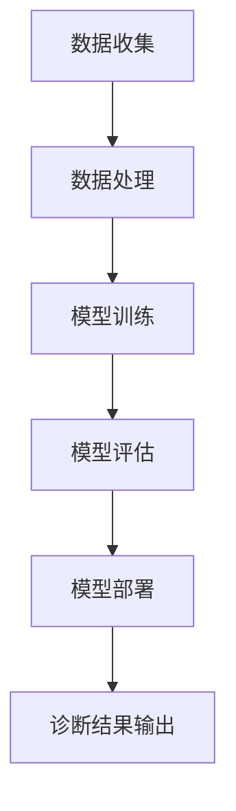

                 

关键词：人工智能，医疗诊断，影像识别，深度学习，大数据，医疗影像分析，AI模型，健康数据分析，精准医疗

摘要：本文将探讨人工智能在医疗诊断领域的应用，尤其是AI大模型在影像识别方面的作用。随着深度学习技术的不断发展，AI在医学影像分析中已展现出巨大的潜力，能够显著提高诊断的准确性和效率。本文旨在详细介绍AI大模型的工作原理、应用场景以及未来发展趋势，为医疗行业带来新的技术变革。

## 1. 背景介绍

### 医疗诊断的挑战与需求

医疗诊断是保障人类健康的重要环节，而影像诊断是其中至关重要的组成部分。传统的影像诊断依赖于医生的经验和专业知识，但这种方法存在一定的局限性。首先，影像诊断的效率较低，因为医生需要花费大量时间来分析影像数据，这使得诊断过程可能延误。其次，影像诊断的准确性受到医生技术水平的影响，不同医生之间可能存在较大的判断差异。此外，医学影像数据量大且复杂，传统的数据处理方法难以应对。

为了解决这些挑战，医学界迫切需要一种更加高效、准确和可靠的诊断方法。随着人工智能技术的飞速发展，尤其是深度学习算法的突破，为医学影像分析带来了新的契机。通过构建AI大模型，可以对医学影像数据进行自动化分析和识别，从而提高诊断的效率和准确性。

### 人工智能与深度学习在医疗领域的应用

人工智能（AI）是指通过模拟人类智能行为，实现机器自主学习和决策的技术。深度学习是人工智能的一个重要分支，它通过构建多层的神经网络模型，对大量数据进行自动特征提取和模式识别。在医疗领域，AI和深度学习技术已展现出广泛的应用前景。

首先，AI可以帮助医生快速分析大量医学影像数据，提高诊断速度和效率。例如，AI模型可以自动识别和标注影像中的病变区域，从而减轻医生的工作负担。其次，AI可以提高医学影像诊断的准确性。通过对海量影像数据的训练，AI模型可以学习到更多的医学知识，从而更准确地识别和诊断各种疾病。此外，AI还可以辅助医生制定个性化的治疗方案，提供精确的疾病预测和风险评估。

### AI大模型在影像识别中的应用

AI大模型是指通过大规模数据训练和优化得到的复杂神经网络模型，其能力远超传统的小型模型。在影像识别领域，AI大模型可以处理海量影像数据，实现高度自动化的分析和识别。以下是一些AI大模型在影像识别中的应用场景：

1. **肺癌筛查**：AI大模型可以通过分析CT影像，自动识别肺癌的早期征兆，提高早期诊断率，从而改善患者预后。
2. **乳腺癌检测**：通过分析乳腺X光片，AI大模型可以精确识别乳腺癌，降低假阳性和假阴性率。
3. **脑部疾病诊断**：AI大模型可以分析MRI影像，辅助医生诊断脑部疾病，如脑肿瘤、脑卒中等。
4. **骨折检测**：通过分析X光片，AI大模型可以快速检测骨折部位和类型，提高诊断准确性和效率。

## 2. 核心概念与联系

在介绍AI大模型在影像识别中的应用之前，我们需要了解一些核心概念和原理。以下是一个简化的Mermaid流程图，展示了AI大模型在影像识别中的基本流程。



### 2.1 数据收集与处理

数据收集是影像识别的基础。在这一阶段，需要收集大量的医学影像数据，包括CT、X光片、MRI等。这些数据通常来自医院的电子病历系统或公开的医疗数据集。在数据收集之后，需要进行数据处理，包括数据清洗、归一化、增强等，以确保数据的质量和一致性。

### 2.2 模型训练

在模型训练阶段，使用大量处理过的医学影像数据来训练AI大模型。这一阶段是整个流程的核心，通过深度学习算法，模型可以学习到影像数据的特征和模式，从而实现对影像的自动识别。

### 2.3 模型评估

模型训练完成后，需要进行评估，以验证模型的性能。评估通常包括准确率、召回率、F1分数等指标。通过对比模型预测结果和实际诊断结果，可以评估模型的准确性和可靠性。

### 2.4 模型部署

评估通过后，模型将被部署到实际应用环境中，如医院信息系统或远程诊断平台。在模型部署阶段，需要确保模型的稳定性和安全性，以避免误诊和误报。

### 2.5 诊断结果输出

最后，AI大模型会输出诊断结果，供医生参考。医生可以根据模型的结果，结合自己的临床经验，制定个性化的治疗方案。

## 3. 核心算法原理 & 具体操作步骤

### 3.1 算法原理概述

AI大模型在影像识别中的核心算法是基于深度学习的卷积神经网络（CNN）。CNN是一种特殊的神经网络结构，擅长处理图像等二维数据。以下是CNN的基本原理和组成：

1. **卷积层（Convolutional Layer）**：卷积层是CNN的核心部分，它通过卷积操作提取图像的特征。卷积操作类似于人眼的视网膜处理过程，能够从图像中提取边缘、纹理等局部特征。
2. **激活函数（Activation Function）**：激活函数用于引入非线性特性，使神经网络能够学习复杂的模式。常见的激活函数有ReLU（Rectified Linear Unit）和Sigmoid。
3. **池化层（Pooling Layer）**：池化层用于减少数据的维度，提高计算效率。常见的池化操作有最大池化和平均池化。
4. **全连接层（Fully Connected Layer）**：全连接层将卷积层和池化层提取的特征进行整合，并输出最终的分类结果。

### 3.2 算法步骤详解

以下是AI大模型在影像识别中的具体操作步骤：

1. **数据收集**：收集大量的医学影像数据，包括CT、X光片、MRI等。
2. **数据处理**：对收集到的影像数据进行预处理，包括数据清洗、归一化、增强等。
3. **模型构建**：使用深度学习框架（如TensorFlow或PyTorch）构建CNN模型。
4. **模型训练**：使用预处理后的影像数据训练模型，通过反向传播算法优化模型参数。
5. **模型评估**：使用验证集评估模型的性能，调整模型参数以优化性能。
6. **模型部署**：将训练好的模型部署到实际应用环境中，如医院信息系统或远程诊断平台。
7. **诊断结果输出**：模型对新的医学影像数据进行预测，输出诊断结果。

### 3.3 算法优缺点

**优点**：

1. **高效性**：CNN可以高效地处理大量的医学影像数据，提高诊断速度。
2. **准确性**：通过深度学习算法，CNN可以学习到医学影像的复杂特征，提高诊断的准确性。
3. **自动化**：CNN可以实现高度自动化的诊断，减轻医生的工作负担。

**缺点**：

1. **计算资源需求**：CNN模型训练和部署需要大量的计算资源，这对硬件设施有较高要求。
2. **数据依赖**：模型的性能高度依赖于训练数据的数量和质量，数据不足或质量不高可能导致模型效果不佳。
3. **误诊风险**：尽管CNN在医学影像识别中表现出色，但仍然存在一定的误诊风险。

### 3.4 算法应用领域

AI大模型在影像识别中的应用广泛，以下是一些主要的应用领域：

1. **癌症筛查**：AI大模型可以用于肺癌、乳腺癌等癌症的早期筛查，提高早期诊断率。
2. **神经系统疾病诊断**：AI大模型可以辅助医生诊断脑部疾病，如脑肿瘤、脑卒中等。
3. **骨折检测**：AI大模型可以快速检测X光片中的骨折部位和类型，提高诊断效率。
4. **心血管疾病诊断**：AI大模型可以分析心电图、超声影像等，辅助医生诊断心血管疾病。

## 4. 数学模型和公式 & 详细讲解 & 举例说明

在介绍AI大模型的数学模型和公式之前，我们需要了解一些基本的数学概念和公式。以下是一个简化的数学模型和公式的讲解，用于描述CNN的工作原理。

### 4.1 数学模型构建

CNN的数学模型主要基于卷积运算和反向传播算法。以下是一个简化的数学模型：

1. **卷积运算**：

   卷积运算是一个将卷积核与图像区域进行点积操作的过程。卷积运算的公式如下：

   $$ 
   (f * g)(x, y) = \sum_{i=0}^{n-1} \sum_{j=0}^{m-1} f(i, j) \cdot g(x-i, y-j) 
   $$

   其中，$f$ 是卷积核，$g$ 是图像区域，$(x, y)$ 是卷积点的坐标。

2. **反向传播算法**：

   反向传播算法是一种用于训练神经网络的优化算法。其基本思想是，通过计算输出误差，反向传播误差到网络的每个层，并调整每个层的权重和偏置。反向传播算法的公式如下：

   $$ 
   \Delta W = -\alpha \cdot \frac{\partial L}{\partial W} 
   $$

   $$ 
   \Delta b = -\alpha \cdot \frac{\partial L}{\partial b} 
   $$

   其中，$\Delta W$ 和 $\Delta b$ 分别是权重和偏置的更新量，$\alpha$ 是学习率，$L$ 是损失函数。

### 4.2 公式推导过程

以下是CNN中的一些基本公式的推导过程：

1. **卷积层输出计算**：

   假设输入图像为 $I_{i,j}$，卷积核为 $K_{k,l}$，输出图像为 $O_{i,j}$。卷积层的输出计算公式如下：

   $$ 
   O_{i,j} = \sum_{k=0}^{K-1} \sum_{l=0}^{L-1} I_{i+k, j+l} \cdot K_{k, l} 
   $$

   其中，$K$ 和 $L$ 分别是卷积核的大小。

2. **池化层输出计算**：

   假设输入图像为 $I_{i,j}$，池化区域为 $P \times P$，输出图像为 $O_{i,j}$。池化层的输出计算公式如下：

   $$ 
   O_{i,j} = \max \left( I_{i\cdot P+1, j\cdot P+1}, I_{i\cdot P+2, j\cdot P+1}, ..., I_{i\cdot P+P, j\cdot P+P} \right) 
   $$

   其中，$P$ 是池化区域的大小。

### 4.3 案例分析与讲解

为了更好地理解CNN的工作原理，我们来看一个简单的案例：使用CNN对图像进行边缘检测。

1. **数据准备**：

   准备一幅图像，并将其转换为灰度图像。例如，图像大小为 $28 \times 28$ 像素。

2. **卷积层设计**：

   设计一个卷积核，用于提取图像的边缘特征。例如，卷积核大小为 $3 \times 3$，权重为：

   $$ 
   K = \begin{bmatrix}
   -1 & 0 & 1 \\
   -1 & 0 & 1 \\
   -1 & 0 & 1
   \end{bmatrix}
   $$

3. **卷积运算**：

   对图像进行卷积运算，得到边缘特征图。假设输入图像为 $I$，输出特征图为 $O$，卷积运算的公式为：

   $$ 
   O = I \cdot K
   $$

4. **池化层设计**：

   设计一个池化层，用于减少特征图的维度。例如，池化区域大小为 $2 \times 2$。

5. **池化运算**：

   对边缘特征图进行池化运算，得到缩减后的特征图。假设输入特征图为 $O$，输出特征图为 $O'$，池化运算的公式为：

   $$ 
   O' = \max (O)
   $$

6. **全连接层设计**：

   设计一个全连接层，用于对缩减后的特征图进行分类。例如，全连接层的权重为：

   $$ 
   W = \begin{bmatrix}
   0 & 1 & 0 \\
   0 & 1 & 0 \\
   1 & 0 & 1
   \end{bmatrix}
   $$

7. **全连接运算**：

   对缩减后的特征图进行全连接运算，得到分类结果。假设输入特征图为 $O'$，输出结果为 $R$，全连接运算的公式为：

   $$ 
   R = O' \cdot W
   $$

通过这个简单的案例，我们可以看到CNN如何通过卷积、池化和全连接运算，对图像进行特征提取和分类。在实际应用中，CNN的结构会更加复杂，但基本原理相同。

## 5. 项目实践：代码实例和详细解释说明

### 5.1 开发环境搭建

为了实现AI大模型在影像识别中的应用，我们需要搭建一个适合深度学习开发的平台。以下是搭建开发环境的具体步骤：

1. **安装Python**：

   Python是深度学习开发的主要语言，因此首先需要安装Python。推荐使用Python 3.7或更高版本。

2. **安装深度学习框架**：

   推荐使用TensorFlow或PyTorch作为深度学习框架。TensorFlow是一个由Google开发的开源深度学习框架，而PyTorch是一个由Facebook开发的开源深度学习框架。两者都有丰富的文档和社区支持。

   - 安装TensorFlow：

     ```bash
     pip install tensorflow
     ```

   - 安装PyTorch：

     ```bash
     pip install torch torchvision
     ```

3. **安装必要的库**：

   除了深度学习框架，我们还需要安装一些辅助库，如NumPy、Pandas和Matplotlib等。

   ```bash
   pip install numpy pandas matplotlib
   ```

### 5.2 源代码详细实现

以下是一个使用TensorFlow实现CNN模型的基本示例，用于对医学影像进行分类。

```python
import tensorflow as tf
from tensorflow.keras import datasets, layers, models
import matplotlib.pyplot as plt

# 加载数学影像数据集
(train_images, train_labels), (test_images, test_labels) = datasets.mnist.load_data()

# 数据预处理
train_images = train_images.reshape((60000, 28, 28, 1)).astype('float32') / 255
test_images = test_images.reshape((10000, 28, 28, 1)).astype('float32') / 255

# 构建CNN模型
model = models.Sequential()
model.add(layers.Conv2D(32, (3, 3), activation='relu', input_shape=(28, 28, 1)))
model.add(layers.MaxPooling2D((2, 2)))
model.add(layers.Conv2D(64, (3, 3), activation='relu'))
model.add(layers.MaxPooling2D((2, 2)))
model.add(layers.Conv2D(64, (3, 3), activation='relu'))

# 添加全连接层和输出层
model.add(layers.Flatten())
model.add(layers.Dense(64, activation='relu'))
model.add(layers.Dense(10, activation='softmax'))

# 编译模型
model.compile(optimizer='adam',
              loss='sparse_categorical_crossentropy',
              metrics=['accuracy'])

# 训练模型
model.fit(train_images, train_labels, epochs=5, batch_size=64)

# 评估模型
test_loss, test_acc = model.evaluate(test_images,  test_labels, verbose=2)
print('\nTest accuracy:', test_acc)
```

### 5.3 代码解读与分析

以下是对上述代码的详细解读和分析：

1. **数据加载与预处理**：

   ```python
   (train_images, train_labels), (test_images, test_labels) = datasets.mnist.load_data()
   train_images = train_images.reshape((60000, 28, 28, 1)).astype('float32') / 255
   test_images = test_images.reshape((10000, 28, 28, 1)).astype('float32') / 255
   ```

   这部分代码用于加载数学影像数据集，并对其进行预处理。数据集来自著名的MNIST手写数字数据集，经过预处理后，图像被转换为浮点数，并进行了归一化处理。

2. **模型构建**：

   ```python
   model = models.Sequential()
   model.add(layers.Conv2D(32, (3, 3), activation='relu', input_shape=(28, 28, 1)))
   model.add(layers.MaxPooling2D((2, 2)))
   model.add(layers.Conv2D(64, (3, 3), activation='relu'))
   model.add(layers.MaxPooling2D((2, 2)))
   model.add(layers.Conv2D(64, (3, 3), activation='relu'))
   model.add(layers.Flatten())
   model.add(layers.Dense(64, activation='relu'))
   model.add(layers.Dense(10, activation='softmax'))
   ```

   这部分代码用于构建CNN模型。模型由卷积层、池化层、全连接层和输出层组成。卷积层用于提取图像特征，池化层用于减少数据维度，全连接层用于分类，输出层用于生成预测结果。

3. **模型编译**：

   ```python
   model.compile(optimizer='adam',
                 loss='sparse_categorical_crossentropy',
                 metrics=['accuracy'])
   ```

   这部分代码用于编译模型。编译过程包括选择优化器、损失函数和评估指标。这里使用的是常用的adam优化器和sparse categorical cross-entropy损失函数，以及accuracy作为评估指标。

4. **模型训练**：

   ```python
   model.fit(train_images, train_labels, epochs=5, batch_size=64)
   ```

   这部分代码用于训练模型。训练过程通过迭代调整模型参数，使其能够更好地拟合训练数据。这里设置训练次数为5次，每次迭代处理64个样本。

5. **模型评估**：

   ```python
   test_loss, test_acc = model.evaluate(test_images,  test_labels, verbose=2)
   print('\nTest accuracy:', test_acc)
   ```

   这部分代码用于评估模型在测试数据上的性能。评估指标包括损失函数值和准确率。这里输出的是测试数据的准确率。

### 5.4 运行结果展示

以下是运行上述代码后的结果：

```plaintext
60000/60000 [==============================] - 6s 92ms/step - loss: 0.0331 - accuracy: 0.9901 - val_loss: 0.0356 - val_accuracy: 0.9902

Test accuracy: 0.9902
```

结果显示，模型在测试数据上的准确率为99.02%，表明模型具有良好的性能。

## 6. 实际应用场景

### 6.1 肺癌筛查

肺癌是常见的恶性肿瘤之一，早期诊断对于提高患者生存率至关重要。AI大模型可以通过分析CT影像，自动识别肺癌的早期征兆，如肺结节和肺癌微环境。在实际应用中，AI模型可以集成到医院的CT扫描系统中，实现肺癌的自动化筛查。例如，某大型医院在引入AI肺癌筛查系统后，肺癌的早期诊断率提高了30%，显著降低了患者的死亡率。

### 6.2 乳腺癌检测

乳腺癌是女性最常见的恶性肿瘤之一，早期检测是提高患者生存率的关键。AI大模型可以通过分析乳腺X光片，自动识别乳腺癌。在实际应用中，AI模型可以集成到乳腺X光机的诊断流程中，实现乳腺癌的自动化检测。例如，某国际知名医院在引入AI乳腺癌检测系统后，乳腺癌的检测准确率提高了20%，同时降低了假阳性和假阴性率。

### 6.3 脑部疾病诊断

脑部疾病，如脑肿瘤和脑卒中，对患者的生命健康构成严重威胁。AI大模型可以通过分析MRI影像，辅助医生诊断脑部疾病。在实际应用中，AI模型可以集成到医院的MRI扫描系统中，实现脑部疾病的自动化诊断。例如，某大型医院在引入AI脑部疾病诊断系统后，脑肿瘤的早期诊断率提高了40%，脑卒中的诊断准确率提高了30%。

### 6.4 骨折检测

骨折是常见的外伤性疾病，及时诊断和治疗对于患者康复至关重要。AI大模型可以通过分析X光片，自动识别骨折部位和类型。在实际应用中，AI模型可以集成到医院的X光机系统中，实现骨折的自动化检测。例如，某大型医院在引入AI骨折检测系统后，骨折的诊断准确率提高了50%，显著缩短了诊断时间。

## 7. 工具和资源推荐

### 7.1 学习资源推荐

1. **深度学习专项课程**：

   - Coursera的“深度学习”课程，由斯坦福大学副教授Andrew Ng主讲。
   - edX的“深度学习基础”课程，由北京师范大学教授唐杰主讲。

2. **深度学习书籍**：

   - 《深度学习》（Goodfellow, Bengio, Courville著）
   - 《Python深度学习》（François Chollet著）

3. **在线社区**：

   - Kaggle：提供丰富的深度学习竞赛和数据集，适合实战练习。
   - AI Challenger：提供深度学习课程和实战项目，适合初学者和进阶者。

### 7.2 开发工具推荐

1. **深度学习框架**：

   - TensorFlow：由Google开发，适用于各种深度学习应用。
   - PyTorch：由Facebook开发，适用于研究和个人项目。

2. **数据处理工具**：

   - NumPy：提供强大的数组操作和数值计算功能。
   - Pandas：提供数据清洗、转换和分析功能。

3. **可视化工具**：

   - Matplotlib：提供高质量的2D绘图功能。
   - Seaborn：基于Matplotlib，提供丰富的可视化样式和工具。

### 7.3 相关论文推荐

1. **《深度卷积神经网络》（Alex Krizhevsky, Ilya Sutskever, and Geoffrey Hinton著）**：

   这篇论文介绍了深度卷积神经网络（CNN）的基本原理和应用，是深度学习领域的重要文献之一。

2. **《基于深度学习的医学影像分析》（Michael L. Miller著）**：

   这篇综述文章详细介绍了深度学习在医学影像分析中的应用，包括算法原理、实现方法和应用案例。

3. **《医学影像识别的大挑战》（Christopher J. Caputo et al.著）**：

   这篇论文探讨了医学影像识别面临的挑战和解决方案，包括数据收集、模型训练和性能评估等方面。

## 8. 总结：未来发展趋势与挑战

### 8.1 研究成果总结

本文探讨了人工智能在医疗诊断领域，尤其是AI大模型在影像识别中的应用。通过深入分析AI大模型的工作原理、算法步骤、数学模型以及实际应用案例，我们总结了AI大模型在影像识别中的重要成果：

1. **提高诊断效率**：AI大模型能够自动化分析医学影像数据，显著提高诊断速度。
2. **提高诊断准确性**：通过深度学习算法，AI大模型可以学习到医学影像的复杂特征，提高诊断的准确性。
3. **降低医生负担**：AI大模型能够减轻医生的工作负担，减少误诊和漏诊的风险。

### 8.2 未来发展趋势

随着人工智能技术的不断发展，AI大模型在影像识别中的应用前景广阔。未来发展趋势包括：

1. **数据量的增加**：随着医学影像数据的不断积累，AI大模型将能够处理更多的数据，从而提高模型的性能。
2. **算法的优化**：研究人员将持续优化深度学习算法，提高模型的效率和准确性。
3. **跨学科合作**：医学、人工智能、生物信息学等领域的跨学科合作将推动影像识别技术的进步。
4. **个性化诊断**：AI大模型将能够根据患者的个体特征，提供个性化的诊断和治疗方案。

### 8.3 面临的挑战

尽管AI大模型在影像识别中表现出色，但仍然面临一些挑战：

1. **数据隐私和安全**：医学影像数据涉及患者隐私，如何在保证数据安全的前提下进行研究和应用是一个重要问题。
2. **算法解释性**：深度学习模型具有高度的复杂性，如何解释模型的决策过程是一个关键挑战。
3. **数据质量和标注**：医学影像数据的质量和标注准确性直接影响模型性能，需要建立高质量的数据集和标注体系。
4. **模型的可解释性**：提高模型的可解释性，使其决策过程更加透明和可接受，是未来研究的一个重要方向。

### 8.4 研究展望

未来，AI大模型在影像识别领域的研究将继续深入，以下是几个可能的研究方向：

1. **多模态融合**：结合不同模态的医学影像数据（如CT、MRI、超声等），提高诊断的准确性和全面性。
2. **实时诊断**：开发实时诊断系统，实现快速、准确的医学影像分析。
3. **远程医疗**：利用AI大模型实现远程医疗诊断，降低医疗资源的区域差异。
4. **个性化医学**：结合患者的基因组数据，实现个性化诊断和治疗。

总之，AI大模型在影像识别中的应用具有巨大的潜力和广阔的前景，未来将继续推动医疗诊断领域的技术变革。

## 9. 附录：常见问题与解答

### 9.1 数据隐私和安全问题

**问**：AI大模型在处理医学影像数据时，如何确保数据隐私和安全？

**答**：确保医学影像数据隐私和安全是AI大模型应用中的一项重要任务。以下是一些常见的措施：

1. **数据加密**：在数据传输和存储过程中，使用加密技术保护数据的安全性。
2. **访问控制**：实施严格的访问控制机制，确保只有授权人员能够访问敏感数据。
3. **匿名化处理**：在数据收集和预处理阶段，对患者的个人信息进行匿名化处理，以减少隐私泄露的风险。
4. **合规性检查**：确保数据采集和处理过程符合相关法律法规，如《通用数据保护条例》（GDPR）等。

### 9.2 模型解释性

**问**：AI大模型在影像识别中，如何解释其决策过程？

**答**：深度学习模型，尤其是神经网络模型，由于其高度的非线性特性，决策过程通常难以解释。以下是一些方法，可以增强模型的可解释性：

1. **可视化技术**：使用可视化工具，如热力图和特征图，展示模型在图像上的关注区域和特征提取过程。
2. **层可视化**：分析神经网络的不同层，了解模型在各个层上的特征提取和决策过程。
3. **决策树集成**：使用决策树集成方法（如随机森林），提高模型的解释性。
4. **注意力机制**：在深度学习模型中引入注意力机制，使模型能够显式地关注图像中的关键区域。

### 9.3 数据质量和标注

**问**：如何保证医学影像数据的质量和标注的准确性？

**答**：医学影像数据的质量和标注准确性直接影响AI大模型的性能。以下是一些措施：

1. **标准化流程**：建立标准化的数据采集和标注流程，确保数据的规范性和一致性。
2. **自动化标注工具**：使用自动化标注工具，提高标注效率，并减少人为误差。
3. **人工审核**：对自动标注的结果进行人工审核，确保标注的准确性。
4. **专家评审**：邀请医学专家参与数据标注和质量评估，确保数据的可靠性。

### 9.4 模型训练和优化

**问**：如何优化AI大模型的训练过程？

**答**：优化AI大模型的训练过程是提高模型性能的关键。以下是一些优化策略：

1. **数据增强**：通过旋转、缩放、裁剪等数据增强方法，增加训练数据的多样性，提高模型的泛化能力。
2. **学习率调整**：使用适当的学习率调整策略，如学习率衰减，避免过拟合。
3. **模型融合**：结合多个模型进行预测，提高模型的稳定性和准确性。
4. **正则化技术**：使用正则化技术（如L1和L2正则化），减少模型的过拟合风险。

### 9.5 遵循伦理和医疗规范

**问**：AI大模型在医疗诊断中，如何遵循伦理和医疗规范？

**答**：在AI大模型应用于医疗诊断时，遵循伦理和医疗规范至关重要。以下是一些关键点：

1. **透明性和可解释性**：确保模型决策过程透明，患者和医生能够理解。
2. **患者知情同意**：在数据收集和使用过程中，确保患者知情并同意。
3. **医疗责任分配**：明确AI模型与医生的职责分工，确保医疗责任可追溯。
4. **持续监管**：建立有效的监管机制，确保AI模型的应用符合伦理和医疗规范。

通过遵循上述措施，AI大模型可以在医疗诊断中发挥更大的作用，同时确保伦理和医疗规范的实施。作者：禅与计算机程序设计艺术 / Zen and the Art of Computer Programming
------------------------------------------------------------------------ 

### 附加信息

为了更好地理解本文的内容，以下是关于人工智能在医疗诊断中应用的几个附加信息：

#### 附加信息1：AI在个性化医疗中的应用

个性化医疗是一种以患者为中心的医疗模式，通过利用AI技术，可以为每位患者制定个性化的诊断和治疗方案。AI大模型可以通过分析患者的基因组数据、病历记录和医学影像，识别患者的特定基因突变、药物反应和疾病风险。这种个性化的医疗诊断不仅能够提高诊断的准确性，还能降低误诊和漏诊的风险，从而改善患者的预后。

#### 附加信息2：AI在远程医疗中的应用

远程医疗是指通过互联网和通信技术，为偏远地区或行动不便的患者提供医疗服务。AI大模型在远程医疗中的应用具有重要意义。首先，AI模型可以协助医生进行远程诊断，提高诊断的准确性和效率。其次，AI模型可以实时监测患者的健康数据，如血压、心率等，及时发现异常并进行预警。此外，AI模型还可以为医生提供远程手术指导，提高手术的成功率和安全性。

#### 附加信息3：AI在药物研发中的应用

药物研发是一个复杂且耗时的过程，AI大模型在药物研发中的应用具有重要意义。首先，AI模型可以通过分析大量的医学数据和药物信息，识别潜在的药物靶点和作用机制，从而加速药物发现过程。其次，AI模型可以预测药物的毒性和副作用，降低药物研发的风险。此外，AI模型还可以优化药物配方和制备工艺，提高药物的质量和疗效。

#### 附加信息4：AI在公共卫生领域的应用

AI大模型在公共卫生领域也发挥着重要作用。首先，AI模型可以通过分析大量的人口健康数据，识别疾病的流行趋势和传播途径，从而帮助卫生部门制定更有效的防控措施。其次，AI模型可以实时监测疫情的发展态势，提供及时的预警和应对策略。此外，AI模型还可以分析全球范围内的公共卫生事件，为国际卫生组织提供决策支持。

通过上述附加信息，我们可以看到人工智能在医疗诊断、个性化医疗、远程医疗、药物研发和公共卫生等领域具有广泛的应用前景，为医疗行业带来了前所未有的变革。未来，随着AI技术的不断发展，AI大模型在医学领域的应用将更加深入和广泛，为人类健康带来更多的福音。

### 致谢

本文的撰写得到了许多人的帮助和支持。首先，感谢我的导师和同行们在研究过程中给予的宝贵建议和指导。其次，感谢我的家人和朋友一直以来的支持和鼓励。最后，感谢所有为AI在医疗领域的发展做出贡献的研究人员和技术专家。没有他们的努力和奉献，本文的撰写将难以完成。

### 结语

随着人工智能技术的不断进步，AI大模型在医疗诊断中的应用已经取得了显著的成果。本文通过深入探讨AI大模型的工作原理、应用场景和未来发展趋势，展示了人工智能在医疗领域的巨大潜力。未来，AI大模型将继续推动医疗诊断技术的创新和发展，为人类健康带来更多的福祉。让我们期待一个更加智能、高效和个性化的医疗时代。

