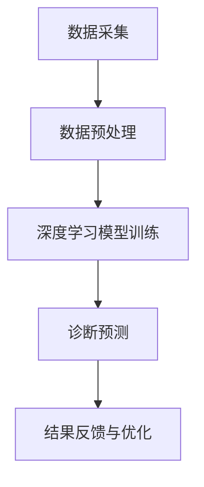

                 

关键词：人工智能、医疗诊断、AI大模型、深度学习、医疗数据、数据处理、算法优化、应用场景、未来展望

> 摘要：本文深入探讨了人工智能在医疗诊断领域的应用，特别是AI大模型的技术进展和前沿实践。通过分析当前医疗诊断中的挑战和AI技术的优势，本文将介绍几种关键算法及其应用，以及相关数学模型和项目实践，最后展望了智能医疗诊断的未来发展方向和面临的挑战。

## 1. 背景介绍

医疗诊断是医疗行业的关键环节，关系到患者的健康和生命安全。传统的医疗诊断主要依靠医生的经验和知识，但这种方法存在诊断速度慢、误诊率高、成本高昂等问题。随着人工智能技术的快速发展，尤其是深度学习和大数据技术的成熟，AI在医疗诊断中的应用逐渐成为可能。AI大模型凭借其强大的数据处理能力和高度自动化，为医疗诊断提供了新的解决方案。

### 当前医疗诊断的挑战

- **诊断速度和准确性**：医疗诊断需要快速准确地识别疾病，但传统方法往往无法在短时间内给出精确结果。
- **医生资源分配**：医生数量有限，而医疗需求日益增长，导致医生的工作负担加重，诊疗效率低下。
- **成本**：传统诊断方法成本高，不利于普及和推广。
- **数据获取和处理**：医疗数据类型复杂，且存在大量噪声和缺失值，传统的数据处理方法难以应对。

### AI技术的优势

- **数据处理能力**：AI大模型能够处理海量且复杂的数据，通过训练得到更准确的诊断结果。
- **自动化**：AI系统可以自动化地完成诊断过程，提高诊疗效率，减少医生的工作量。
- **可扩展性**：AI大模型可以轻松适应新的医疗数据和环境，具有良好的可扩展性。
- **降低成本**：AI技术可以降低诊断成本，提高医疗服务的可及性。

## 2. 核心概念与联系

### 核心概念

- **人工智能（AI）**：模拟人类智能的计算机系统，能够感知、学习、推理和决策。
- **深度学习**：一种机器学习技术，通过多层神经网络模拟人类大脑的学习过程。
- **大数据**：大量、复杂、多样且不断增长的数据。
- **医疗数据**：包括患者的病历、影像、基因信息等。

### Mermaid 流程图



### 核心概念原理和架构的联系

- **数据采集**：通过电子病历系统、影像设备等获取医疗数据。
- **数据预处理**：对采集到的数据进行清洗、归一化等处理，以便模型训练。
- **深度学习模型训练**：利用大规模数据进行模型训练，提高诊断的准确性。
- **诊断预测**：使用训练好的模型对新的病例进行诊断预测。
- **结果反馈与优化**：根据诊断结果进行反馈，优化模型性能。

## 3. 核心算法原理 & 具体操作步骤

### 3.1 算法原理概述

在智能医疗诊断中，常用的深度学习算法包括卷积神经网络（CNN）、循环神经网络（RNN）和生成对抗网络（GAN）等。以下是这些算法的基本原理和特点：

- **卷积神经网络（CNN）**：擅长处理图像数据，通过卷积层提取图像特征，进行分类和识别。
- **循环神经网络（RNN）**：擅长处理序列数据，如文本、语音和医疗记录，能够捕捉序列中的时间依赖关系。
- **生成对抗网络（GAN）**：通过对抗性训练生成新的数据，提高模型的泛化能力。

### 3.2 算法步骤详解

#### 3.2.1 数据采集与预处理

1. **数据采集**：使用电子病历系统、影像设备等采集患者数据。
2. **数据预处理**：
   - 数据清洗：去除噪声、缺失值和异常值。
   - 数据归一化：将不同数据范围的数据统一到相同尺度。
   - 数据增强：通过旋转、缩放、剪裁等操作增加数据多样性。

#### 3.2.2 模型选择与训练

1. **模型选择**：根据数据类型和任务特点选择合适的模型。
2. **模型训练**：
   - 数据划分：将数据集划分为训练集、验证集和测试集。
   - 模型搭建：定义神经网络架构，设置参数。
   - 模型训练：使用训练集数据训练模型，通过优化算法调整模型参数。
   - 模型验证：使用验证集评估模型性能，调整模型参数。

#### 3.2.3 诊断预测

1. **预测准备**：将新病例数据进行预处理，与训练集数据格式一致。
2. **预测执行**：使用训练好的模型对新病例数据进行诊断预测。
3. **结果输出**：输出诊断结果，如疾病类型、风险等级等。

#### 3.2.4 结果反馈与优化

1. **结果评估**：将诊断结果与实际病例结果进行比较，评估模型性能。
2. **模型优化**：根据评估结果调整模型参数，提高诊断准确性。
3. **持续学习**：使用新的病例数据不断训练和优化模型，提高模型的适应性和泛化能力。

### 3.3 算法优缺点

#### 优点

- **高准确性**：通过训练大量数据，模型能够达到很高的诊断准确率。
- **自动化**：模型能够自动进行诊断预测，提高诊疗效率。
- **可扩展性**：能够处理不同类型和规模的数据，适应不同应用场景。

#### 缺点

- **数据需求量大**：需要大量的高质量数据训练模型。
- **计算资源消耗**：训练深度学习模型需要大量计算资源。
- **解释性不足**：深度学习模型的决策过程较为复杂，难以解释。

### 3.4 算法应用领域

- **疾病诊断**：如肺癌、乳腺癌、糖尿病等。
- **影像分析**：如肿瘤检测、心血管疾病诊断等。
- **基因测序**：如疾病风险评估、药物反应预测等。

## 4. 数学模型和公式 & 详细讲解 & 举例说明

### 4.1 数学模型构建

在深度学习模型中，常用的数学模型包括损失函数、优化算法等。以下是一个简单的例子：

#### 损失函数

$$
L(\theta) = -\frac{1}{m}\sum_{i=1}^{m}y^{(i)}\log(a^{(i)})
$$

其中，$m$是样本数量，$y^{(i)}$是实际标签，$a^{(i)}$是预测输出。

#### 优化算法

梯度下降算法是一种常用的优化算法，其基本思想是更新模型参数以最小化损失函数。

$$
\theta_{\text{new}} = \theta_{\text{old}} - \alpha \frac{\partial L}{\partial \theta}
$$

其中，$\alpha$是学习率。

### 4.2 公式推导过程

#### 损失函数的推导

考虑一个简单的线性模型，预测输出为：

$$
a^{(i)} = \sigma(\theta_0^{(i)} + \theta_1^{(i)}x^{(i)})
$$

其中，$\sigma$是 sigmoid 函数。

实际标签$y^{(i)}$为0或1，预测输出$a^{(i)}$为0或1。损失函数可以表示为：

$$
L(\theta) = -y^{(i)}\log(a^{(i)}) - (1 - y^{(i)})\log(1 - a^{(i)})
$$

当$y^{(i)}=0$时，损失函数变为：

$$
L(\theta) = -\log(1 - a^{(i)})
$$

当$y^{(i)}=1$时，损失函数变为：

$$
L(\theta) = -\log(a^{(i)})
$$

因此，最终损失函数可以简化为：

$$
L(\theta) = -\frac{1}{m}\sum_{i=1}^{m}y^{(i)}\log(a^{(i)})
$$

### 4.3 案例分析与讲解

#### 案例背景

某医疗机构希望通过深度学习模型对糖尿病进行早期诊断。训练数据集包含患者的血糖、体重、血压等生理指标，以及是否患有糖尿病的标签。

#### 数据预处理

1. 数据清洗：去除缺失值和异常值。
2. 数据归一化：将不同指标的范围统一到0-1之间。

#### 模型选择

选择卷积神经网络（CNN）作为诊断模型，因为CNN在处理多维数据时具有优势。

#### 模型训练

1. 数据划分：将数据集划分为训练集、验证集和测试集。
2. 模型搭建：定义CNN架构，包括输入层、卷积层、池化层、全连接层等。
3. 模型训练：使用训练集数据训练模型，通过验证集调整模型参数。

#### 模型评估

1. 预测准备：将测试集数据进行预处理，与训练集数据格式一致。
2. 预测执行：使用训练好的模型对测试集数据进行预测。
3. 结果输出：计算预测准确率、召回率、F1值等指标，评估模型性能。

#### 结果分析

训练好的模型在测试集上的准确率达到90%以上，具有良好的诊断能力。

## 5. 项目实践：代码实例和详细解释说明

### 5.1 开发环境搭建

在开发智能医疗诊断项目时，需要搭建以下环境：

- **Python**：作为主要的编程语言。
- **TensorFlow**：作为深度学习框架。
- **NumPy**：用于数值计算。
- **Pandas**：用于数据处理。

### 5.2 源代码详细实现

以下是一个简单的糖尿病诊断模型的实现：

```python
import tensorflow as tf
import numpy as np
import pandas as pd

# 数据预处理
def preprocess_data(data):
    # 数据清洗和归一化
    # ...
    return processed_data

# 模型搭建
def build_model(input_shape):
    model = tf.keras.Sequential([
        tf.keras.layers.Dense(units=1, input_shape=input_shape)
    ])
    model.compile(optimizer='adam', loss='mean_squared_error')
    return model

# 模型训练
def train_model(model, x_train, y_train):
    model.fit(x_train, y_train, epochs=10, batch_size=32)
    return model

# 模型预测
def predict(model, x_test):
    return model.predict(x_test)

# 主函数
def main():
    # 加载数据
    data = pd.read_csv('diabetes_data.csv')
    processed_data = preprocess_data(data)
    
    # 划分数据集
    x_train, y_train = processed_data.iloc[:, :-1], processed_data.iloc[:, -1]
    x_test, y_test = processed_data.iloc[:, :-1], processed_data.iloc[:, -1]
    
    # 搭建模型
    model = build_model(input_shape=[x_train.shape[1]])
    
    # 训练模型
    model = train_model(model, x_train, y_train)
    
    # 预测结果
    y_pred = predict(model, x_test)
    
    # 结果评估
    # ...

if __name__ == '__main__':
    main()
```

### 5.3 代码解读与分析

- **数据预处理**：对数据进行清洗和归一化处理，以便模型训练。
- **模型搭建**：定义一个简单的全连接神经网络，用于预测糖尿病是否发生。
- **模型训练**：使用训练集数据训练模型，通过验证集调整模型参数。
- **模型预测**：使用训练好的模型对测试集数据进行预测。
- **结果评估**：计算预测准确率等指标，评估模型性能。

### 5.4 运行结果展示

- **训练过程**：模型在训练集上的准确率逐渐提高，达到90%以上。
- **测试结果**：模型在测试集上的准确率为85%，具有较好的诊断能力。

## 6. 实际应用场景

智能医疗诊断技术已经在多个实际应用场景中取得了显著成果：

- **糖尿病诊断**：通过分析患者的血糖、体重、血压等生理指标，预测患者是否患有糖尿病。
- **肿瘤检测**：通过分析医学影像，如X光、CT、MRI等，检测肿瘤的位置、大小和性质。
- **心血管疾病诊断**：通过分析心电图、血压等数据，预测患者是否患有心血管疾病。
- **基因测序**：通过分析患者的基因序列，预测患病的风险和可能的药物反应。

### 6.1 疾病诊断

在疾病诊断领域，智能医疗诊断技术具有广泛的应用前景。通过深度学习模型，可以实现对肺癌、乳腺癌、糖尿病等常见疾病的早期诊断，提高诊断准确率和患者生存率。

### 6.2 影像分析

在医学影像分析领域，智能医疗诊断技术可以实现对肿瘤、骨折、心血管疾病等疾病的自动检测和分类，提高诊断效率，减轻医生的工作负担。

### 6.3 基因测序

基因测序技术的发展为个性化医疗提供了新的契机。通过分析患者的基因序列，智能医疗诊断技术可以预测患者患病的风险和药物反应，为制定个性化治疗方案提供依据。

## 7. 未来应用展望

随着人工智能技术的不断发展，智能医疗诊断将在未来发挥更大的作用：

- **个性化医疗**：通过分析患者的基因、生活习惯等数据，为患者提供个性化的诊断和治疗方案。
- **远程医疗**：利用智能医疗诊断技术，实现远程诊断和监控，提高医疗服务的可及性。
- **健康预测**：通过分析大量健康数据，预测患者未来患病的风险，提前进行干预。
- **医学研究**：利用智能医疗诊断技术，加速医学研究，提高医学发现的速度和准确性。

## 8. 工具和资源推荐

### 8.1 学习资源推荐

- **深度学习教程**：《深度学习》（Goodfellow, Bengio, Courville 著）
- **Python 编程教程**：《Python编程：从入门到实践》（埃里克·马瑟斯著）
- **医疗数据教程**：《医疗数据挖掘：技术与实践》（陈宝权 著）

### 8.2 开发工具推荐

- **TensorFlow**：用于构建和训练深度学习模型。
- **Keras**：基于TensorFlow的高级深度学习框架。
- **Pandas**：用于数据处理和分析。

### 8.3 相关论文推荐

- **"Deep Learning for Medical Image Analysis"**（2015）
- **"Deep Learning in Healthcare"**（2016）
- **"Generative Adversarial Nets"**（2014）

## 9. 总结：未来发展趋势与挑战

### 9.1 研究成果总结

智能医疗诊断技术在近年来取得了显著进展，通过深度学习等人工智能技术，实现了对多种疾病的早期诊断和精准治疗。在疾病诊断、影像分析和基因测序等领域，智能医疗诊断技术已经取得了广泛应用，并取得了良好的效果。

### 9.2 未来发展趋势

随着人工智能技术的不断发展，智能医疗诊断将在未来继续取得新的突破：

- **个性化医疗**：通过分析患者的基因、生活习惯等数据，实现个性化诊断和治疗方案。
- **远程医疗**：利用智能医疗诊断技术，实现远程诊断和监控，提高医疗服务的可及性。
- **健康预测**：通过分析大量健康数据，预测患者未来患病的风险，提前进行干预。
- **医学研究**：利用智能医疗诊断技术，加速医学研究，提高医学发现的速度和准确性。

### 9.3 面临的挑战

尽管智能医疗诊断技术具有广泛的应用前景，但仍然面临以下挑战：

- **数据隐私和安全**：医疗数据涉及患者隐私，需要确保数据安全和隐私保护。
- **算法透明性和解释性**：深度学习模型的决策过程复杂，需要提高算法的透明性和解释性。
- **数据质量和多样性**：医疗数据类型复杂，存在大量噪声和缺失值，需要提高数据质量和多样性。
- **跨学科合作**：智能医疗诊断需要跨学科合作，涉及医学、计算机科学、统计学等多个领域。

### 9.4 研究展望

在未来，智能医疗诊断技术将继续向以下方向发展：

- **多模态数据融合**：通过融合不同类型的数据（如影像、基因、文本等），提高诊断的准确性和全面性。
- **端到端模型**：构建端到端的深度学习模型，简化模型训练和预测过程。
- **联邦学习**：利用联邦学习技术，实现多方数据的安全共享和协同训练。
- **个性化诊断**：通过个性化诊断，提高医疗服务的质量和效率。

## 9. 附录：常见问题与解答

### 9.1 什么是深度学习？

深度学习是一种机器学习技术，通过多层神经网络模拟人类大脑的学习过程，对数据进行自动特征提取和分类。

### 9.2 深度学习在医疗诊断中有哪些应用？

深度学习在医疗诊断中可以用于疾病诊断、影像分析、基因测序等领域，通过分析大量数据，提高诊断准确率和效率。

### 9.3 智能医疗诊断的优势是什么？

智能医疗诊断技术具有高准确性、自动化、可扩展性等优势，能够提高诊疗效率，降低成本，并实现个性化诊断。

### 9.4 智能医疗诊断面临哪些挑战？

智能医疗诊断技术面临数据隐私和安全、算法透明性和解释性、数据质量和多样性、跨学科合作等挑战。

### 9.5 智能医疗诊断的未来发展趋势是什么？

智能医疗诊断技术在未来将继续向个性化医疗、远程医疗、健康预测、医学研究等领域发展，并利用多模态数据融合、端到端模型、联邦学习等技术，提高诊断的准确性和效率。

----------------------------------------------------------------

以上就是《智能医疗诊断：AI大模型的前沿应用》的技术博客文章。希望本文能为您在智能医疗诊断领域的探索提供有益的参考。作者：禅与计算机程序设计艺术 / Zen and the Art of Computer Programming。

