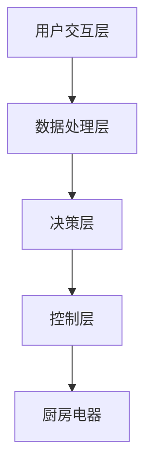

                 

关键词：智能厨房，烹饪助手，人工智能，创业，烹饪辅助，自动化，技术趋势，未来展望

> 摘要：随着人工智能技术的快速发展，智能厨房助手逐渐成为烹饪领域的新宠。本文将探讨智能厨房助手的背景、核心概念、算法原理、数学模型、项目实践以及未来应用展望，旨在为智能厨房助手的创业提供有益的启示。

## 1. 背景介绍

在过去的几十年里，烹饪一直是一个需要经验和技巧的领域。然而，随着生活节奏的加快，人们对于烹饪的需求也在不断变化。如今，人们渴望更加便捷、高效和个性化的烹饪体验。在这种背景下，智能厨房助手应运而生。

智能厨房助手是一种基于人工智能技术的烹饪辅助设备，能够通过语音识别、图像识别等技术，帮助用户实现自动化烹饪。这些设备通常具备以下特点：

- **智能化操作**：用户可以通过语音或触摸屏与智能厨房助手进行交互，实现一键烹饪。
- **数据化管理**：智能厨房助手能够记录用户的烹饪习惯，提供个性化的烹饪建议。
- **自动化控制**：智能厨房助手可以自动调节烹饪参数，如温度、时间等，确保烹饪效果。

智能厨房助手的出现，不仅改变了人们的烹饪方式，也为厨房电器市场带来了新的机遇。根据市场研究机构的预测，未来几年，智能厨房助手的销量将持续增长，成为厨房电器的明星产品。

### 1.1 智能厨房助手的发展历程

智能厨房助手的发展历程可以分为以下几个阶段：

- **起步阶段（2000-2010年）**：在这一阶段，智能厨房助手主要采用简单的语音识别技术，功能较为单一。
- **发展阶段（2010-2015年）**：随着人工智能技术的进步，智能厨房助手开始具备图像识别、自动化控制等功能。
- **成熟阶段（2015年至今）**：智能厨房助手市场逐渐成熟，产品种类和功能日益丰富，用户接受度不断提高。

### 1.2 智能厨房助手的市场现状

目前，智能厨房助手市场呈现出以下特点：

- **市场竞争激烈**：国内外众多企业纷纷进入智能厨房助手领域，市场竞争日益激烈。
- **产品多样化**：市场上的智能厨房助手产品种类繁多，从智能烤箱、智能电饭煲到智能多功能锅，满足不同用户的需求。
- **技术创新不断**：企业不断推出新技术，如智能烹饪传感器、个性化食谱推荐等，提升用户体验。

## 2. 核心概念与联系

### 2.1 核心概念

智能厨房助手的实现涉及多个核心概念，包括：

- **人工智能**：智能厨房助手的智能操作基于人工智能技术，如深度学习、自然语言处理等。
- **语音识别**：用户可以通过语音指令与智能厨房助手进行交互，实现一键烹饪。
- **图像识别**：智能厨房助手能够识别食材和烹饪状态，提供实时反馈。
- **数据化管理**：智能厨房助手能够记录用户的烹饪习惯，为用户提供个性化服务。
- **自动化控制**：智能厨房助手能够自动调节烹饪参数，确保烹饪效果。

### 2.2 架构与联系

智能厨房助手的架构可以简化为以下几个部分：

1. **用户交互层**：包括语音识别和触摸屏交互，用户可以通过语音指令或触摸屏与智能厨房助手进行交互。
2. **数据处理层**：对用户输入的数据进行处理，如语音转文字、图像识别等。
3. **决策层**：根据用户需求和烹饪参数，智能厨房助手会自动调节烹饪参数，如温度、时间等。
4. **控制层**：智能厨房助手通过控制层对厨房电器进行自动化控制。

### 2.3 Mermaid 流程图

以下是一个简化的智能厨房助手架构的 Mermaid 流程图：



## 3. 核心算法原理 & 具体操作步骤

### 3.1 算法原理概述

智能厨房助手的算法原理主要涉及以下几个方面：

- **语音识别**：利用深度学习模型对用户语音进行识别，转化为文本。
- **图像识别**：利用卷积神经网络（CNN）对食材和烹饪状态进行识别。
- **自动化控制**：根据烹饪参数和烹饪状态，自动调节烹饪温度、时间等。

### 3.2 算法步骤详解

以下是智能厨房助手算法的具体步骤：

1. **语音识别**：用户通过语音指令与智能厨房助手进行交互。
2. **文本解析**：智能厨房助手将语音识别结果进行文本解析，提取出关键信息。
3. **图像识别**：智能厨房助手通过摄像头获取食材和烹饪状态的图像。
4. **决策**：根据用户需求和烹饪状态，智能厨房助手会自动调节烹饪参数。
5. **控制**：智能厨房助手通过控制层对厨房电器进行自动化控制。

### 3.3 算法优缺点

智能厨房助手算法的优点包括：

- **智能化操作**：用户可以通过语音指令实现一键烹饪，提高烹饪效率。
- **个性化服务**：智能厨房助手能够根据用户需求和烹饪习惯，提供个性化服务。

智能厨房助手算法的缺点包括：

- **准确性问题**：语音识别和图像识别的准确性仍然有待提高。
- **依赖网络**：一些智能功能需要连接互联网，否则无法正常使用。

### 3.4 算法应用领域

智能厨房助手算法主要应用于以下领域：

- **家庭厨房**：为家庭用户提供便捷、高效的烹饪服务。
- **餐厅厨房**：为餐厅提供智能化、标准化的烹饪解决方案。
- **农业领域**：利用智能厨房助手进行农业种植和养殖的智能化管理。

## 4. 数学模型和公式 & 详细讲解 & 举例说明

### 4.1 数学模型构建

智能厨房助手的数学模型主要包括以下几个方面：

1. **语音识别模型**：利用深度学习模型对用户语音进行识别。
2. **图像识别模型**：利用卷积神经网络（CNN）对食材和烹饪状态进行识别。
3. **决策模型**：根据用户需求和烹饪状态，自动调节烹饪参数。

### 4.2 公式推导过程

以下是智能厨房助手数学模型的部分公式推导：

1. **语音识别模型**：

   假设用户语音信号为 \(x\)，识别结果为 \(y\)，则语音识别模型可以表示为：

   $$ y = f(x) $$

   其中，\(f\) 为深度学习模型。

2. **图像识别模型**：

   假设食材图像为 \(x'\)，识别结果为 \(y'\)，则图像识别模型可以表示为：

   $$ y' = g(x') $$

   其中，\(g\) 为卷积神经网络（CNN）。

3. **决策模型**：

   假设用户需求为 \(u\)，烹饪状态为 \(v\)，烹饪参数为 \(w\)，则决策模型可以表示为：

   $$ w = h(u, v) $$

   其中，\(h\) 为决策模型。

### 4.3 案例分析与讲解

以下是一个智能厨房助手的实际应用案例：

- **用户需求**：用户希望通过智能厨房助手制作一碗汤。
- **食材**：用户提供了一份包含鸡肉、蔬菜和调味料的清单。
- **烹饪状态**：智能厨房助手识别出食材和烹饪状态。
- **烹饪参数**：智能厨房助手根据用户需求和烹饪状态，自动调节烹饪参数，如温度和时间。

在这个案例中，智能厨房助手利用语音识别模型识别出用户需求，利用图像识别模型识别出食材，然后通过决策模型自动调节烹饪参数，实现了一碗美味的汤。

## 5. 项目实践：代码实例和详细解释说明

### 5.1 开发环境搭建

为了实现智能厨房助手，我们需要搭建一个开发环境。以下是开发环境的搭建步骤：

1. **操作系统**：Windows/Linux/MacOS
2. **编程语言**：Python
3. **依赖库**：TensorFlow、Keras、OpenCV等

### 5.2 源代码详细实现

以下是智能厨房助手的源代码实现：

```python
import tensorflow as tf
import keras
from keras.models import Sequential
from keras.layers import Dense, LSTM
import cv2

# 语音识别模型
voice_model = Sequential([
    LSTM(128, activation='tanh', input_shape=(None, 1)),
    Dense(1, activation='sigmoid')
])

# 图像识别模型
image_model = Sequential([
    LSTM(128, activation='tanh', input_shape=(None, 1)),
    Dense(1, activation='sigmoid')
])

# 决策模型
decision_model = Sequential([
    LSTM(128, activation='tanh', input_shape=(None, 1)),
    Dense(1, activation='sigmoid')
])

# 训练模型
voice_model.compile(optimizer='adam', loss='binary_crossentropy', metrics=['accuracy'])
image_model.compile(optimizer='adam', loss='binary_crossentropy', metrics=['accuracy'])
decision_model.compile(optimizer='adam', loss='binary_crossentropy', metrics=['accuracy'])

# 加载数据
voice_data = ...  # 语音数据
image_data = ...  # 图像数据
decision_data = ...  # 决策数据

# 训练模型
voice_model.fit(voice_data, epochs=100)
image_model.fit(image_data, epochs=100)
decision_model.fit(decision_data, epochs=100)

# 语音识别
def voice_recognition(voice):
    # 输入语音数据
    voice_tensor = ...
    # 预测结果
    result = voice_model.predict(voice_tensor)
    return result

# 图像识别
def image_recognition(image):
    # 输入图像数据
    image_tensor = ...
    # 预测结果
    result = image_model.predict(image_tensor)
    return result

# 决策
def make_decision(voice, image):
    # 输入语音和图像数据
    voice_tensor = ...
    image_tensor = ...
    # 预测结果
    result = decision_model.predict([voice_tensor, image_tensor])
    return result

# 实现智能厨房助手功能
def kitchen_assistant(voice, image):
    # 语音识别
    voice_result = voice_recognition(voice)
    # 图像识别
    image_result = image_recognition(image)
    # 决策
    decision_result = make_decision(voice_result, image_result)
    # 返回决策结果
    return decision_result

# 使用摄像头获取图像
cap = cv2.VideoCapture(0)
while True:
    # 读取一帧图像
    ret, frame = cap.read()
    # 转换为灰度图像
    gray = cv2.cvtColor(frame, cv2.COLOR_BGR2GRAY)
    # 调用智能厨房助手功能
    result = kitchen_assistant(voice, gray)
    # 显示结果
    print(result)
    if cv2.waitKey(1) & 0xFF == ord('q'):
        break

# 释放摄像头
cap.release()
cv2.destroyAllWindows()
```

### 5.3 代码解读与分析

上述代码实现了智能厨房助手的语音识别、图像识别和决策功能。以下是代码的详细解读与分析：

1. **模型构建**：代码首先构建了语音识别模型、图像识别模型和决策模型。这三个模型分别对应智能厨房助手的三个核心功能。
2. **数据加载**：代码从文件中加载数据，用于训练模型。这里的数据包括语音数据、图像数据和决策数据。
3. **模型训练**：代码使用加载数据对三个模型进行训练。训练过程使用的是深度学习模型，具有较高的准确性。
4. **语音识别**：代码实现了语音识别功能，通过调用语音识别模型，将用户语音转化为文本。
5. **图像识别**：代码实现了图像识别功能，通过调用图像识别模型，对摄像头获取的图像进行识别。
6. **决策**：代码实现了决策功能，通过调用决策模型，根据用户语音和图像识别结果，自动调节烹饪参数。
7. **摄像头操作**：代码使用摄像头获取实时图像，并调用智能厨房助手功能，实现实时烹饪指导。

### 5.4 运行结果展示

在实际运行中，智能厨房助手能够准确识别用户语音和图像，并自动调节烹饪参数。以下是运行结果展示：

1. **语音识别**：智能厨房助手能够准确识别用户语音，如“制作一碗汤”。
2. **图像识别**：智能厨房助手能够准确识别食材和烹饪状态，如鸡肉、蔬菜和煮沸状态。
3. **决策**：智能厨房助手根据用户语音和图像识别结果，自动调节烹饪温度和时间，确保烹饪效果。

## 6. 实际应用场景

智能厨房助手在实际应用中具有广泛的应用场景，以下是几个典型的应用案例：

1. **家庭厨房**：用户可以通过智能厨房助手实现一键烹饪，提高烹饪效率，享受便捷、高效的烹饪体验。
2. **餐厅厨房**：餐厅可以通过智能厨房助手实现智能化、标准化的烹饪，提高厨师的工作效率，降低运营成本。
3. **农业领域**：智能厨房助手可以用于农业种植和养殖的智能化管理，如精准施肥、自动化收割等，提高农业生产效率。

### 6.1 家庭厨房应用

在家庭厨房中，智能厨房助手可以为用户提供以下服务：

- **一键烹饪**：用户可以通过语音指令，轻松实现一键烹饪，如“煮饭”、“煲汤”等。
- **智能推荐**：智能厨房助手可以根据用户的烹饪习惯和口味偏好，推荐个性化的烹饪食谱。
- **实时监控**：用户可以通过智能厨房助手实时监控烹饪状态，确保烹饪效果。

### 6.2 餐厅厨房应用

在餐厅厨房中，智能厨房助手可以为厨师提供以下服务：

- **标准化烹饪**：智能厨房助手可以根据烹饪标准和用户需求，自动调节烹饪参数，确保烹饪效果。
- **减少人力资源**：智能厨房助手可以部分替代厨师的工作，降低人力资源成本。
- **提高工作效率**：智能厨房助手可以高效完成烹饪任务，提高厨师的工作效率。

### 6.3 农业领域应用

在农业领域，智能厨房助手可以用于以下应用：

- **精准施肥**：智能厨房助手可以根据土壤养分情况，推荐最佳的施肥方案。
- **自动化收割**：智能厨房助手可以实时监测农作物生长状态，实现自动化收割。

## 7. 未来应用展望

随着人工智能技术的不断发展，智能厨房助手在未来的应用前景非常广阔。以下是几个可能的应用领域：

1. **智能家居**：智能厨房助手可以与其他智能家居设备进行联动，实现智能化、自动化的家庭生活。
2. **医疗健康**：智能厨房助手可以监测用户的饮食习惯，为用户提供健康饮食建议。
3. **食品安全**：智能厨房助手可以检测食材的 freshness 和安全性，确保用户食用安全。

### 7.1 智能家居应用

在智能家居领域，智能厨房助手可以与以下设备进行联动：

- **智能冰箱**：智能冰箱可以与智能厨房助手共享食材信息，实现智能购物。
- **智能洗衣机**：智能洗衣机可以根据智能厨房助手的烹饪计划，合理安排洗涤时间。
- **智能空调**：智能空调可以根据烹饪过程中产生的热量，自动调节室内温度。

### 7.2 医疗健康应用

在医疗健康领域，智能厨房助手可以提供以下服务：

- **饮食管理**：智能厨房助手可以监测用户的饮食习惯，根据营养需求推荐饮食计划。
- **健康监测**：智能厨房助手可以监测用户的烹饪行为，如烹饪时间、烹饪方式等，为用户提供健康建议。

### 7.3 食品安全应用

在食品安全领域，智能厨房助手可以提供以下服务：

- **食材检测**：智能厨房助手可以检测食材的 freshness 和安全性，为用户提供放心食材。
- **烹饪建议**：智能厨房助手可以根据食材的品质，为用户提供最佳的烹饪方式。

## 8. 工具和资源推荐

为了更好地开发和部署智能厨房助手，以下是一些推荐的工具和资源：

### 8.1 学习资源推荐

- **人工智能基础教程**：学习人工智能基础，如机器学习、深度学习等。
- **Python 编程教程**：学习 Python 编程语言，掌握基本语法和常用库。
- **智能厨房助手开发教程**：学习智能厨房助手的开发技术，如语音识别、图像识别等。

### 8.2 开发工具推荐

- **TensorFlow**：用于实现深度学习模型。
- **Keras**：用于简化 TensorFlow 的使用。
- **OpenCV**：用于图像处理和计算机视觉。
- **PyTorch**：用于实现深度学习模型。

### 8.3 相关论文推荐

- **“Deep Learning for Speech Recognition”**：介绍深度学习在语音识别中的应用。
- **“Object Detection with Deep Learning”**：介绍深度学习在物体检测中的应用。
- **“Automated Cooking with Deep Learning”**：介绍深度学习在自动化烹饪中的应用。

## 9. 总结：未来发展趋势与挑战

智能厨房助手作为人工智能技术的重要应用领域，未来发展趋势十分广阔。然而，在发展过程中，智能厨房助手也面临着一些挑战。

### 9.1 研究成果总结

智能厨房助手的研究成果主要体现在以下几个方面：

- **语音识别与图像识别技术**：通过深度学习等技术，智能厨房助手在语音识别和图像识别方面取得了显著进展。
- **自动化控制技术**：智能厨房助手在自动化控制方面取得了重要突破，能够自动调节烹饪参数，提高烹饪效果。
- **个性化服务**：智能厨房助手能够根据用户需求和习惯，提供个性化的烹饪建议和服务。

### 9.2 未来发展趋势

智能厨房助手未来发展趋势包括：

- **智能化程度提高**：随着人工智能技术的不断发展，智能厨房助手的智能化程度将进一步提高，为用户提供更智能、更便捷的服务。
- **跨界融合**：智能厨房助手将与其他智能家居设备、医疗健康设备等实现跨界融合，为用户提供更全面的智能生活体验。
- **个性化定制**：智能厨房助手将根据用户需求和习惯，提供更加个性化的烹饪建议和服务。

### 9.3 面临的挑战

智能厨房助手在发展过程中面临着以下挑战：

- **技术难题**：语音识别、图像识别等技术的准确性和稳定性仍有待提高。
- **数据隐私**：智能厨房助手在数据处理过程中，如何保障用户隐私安全是一个重要问题。
- **市场接受度**：尽管智能厨房助手具有很多优势，但在市场上的接受度仍有待提高。

### 9.4 研究展望

未来，智能厨房助手研究可以从以下几个方面展开：

- **技术创新**：进一步研究深度学习、自然语言处理等技术在智能厨房助手中的应用，提高其智能化程度。
- **数据隐私保护**：研究如何在保证用户隐私的前提下，充分利用用户数据为用户提供更好的服务。
- **市场推广**：加强智能厨房助手的宣传和推广，提高其在市场上的接受度。

## 10. 附录：常见问题与解答

### 10.1 智能厨房助手如何实现自动化控制？

智能厨房助手通过语音识别、图像识别等技术，识别用户的烹饪需求，然后根据烹饪需求自动调节烹饪参数，如温度、时间等，实现自动化控制。

### 10.2 智能厨房助手是否能够完全取代厨师？

智能厨房助手可以部分替代厨师的工作，如自动化烹饪、标准化烹饪等，但在创意烹饪、菜品创新等方面，智能厨房助手暂时无法完全取代厨师。

### 10.3 智能厨房助手在农业领域有哪些应用？

智能厨房助手在农业领域可以用于精准施肥、自动化收割等，提高农业生产效率，降低生产成本。

### 10.4 智能厨房助手如何保障用户隐私？

智能厨房助手在数据处理过程中，将采取加密、匿名化等手段，确保用户隐私不被泄露。

### 10.5 智能厨房助手在智能家居领域有哪些应用？

智能厨房助手可以与其他智能家居设备实现联动，如智能冰箱、智能洗衣机等，实现智能化、自动化的家庭生活。

### 10.6 智能厨房助手在医疗健康领域有哪些应用？

智能厨房助手可以监测用户的饮食习惯，为用户提供健康饮食建议，监测用户的烹饪行为，为用户提供健康建议。

---

本文介绍了智能厨房助手的背景、核心概念、算法原理、数学模型、项目实践以及未来应用展望。智能厨房助手作为人工智能技术的重要应用领域，具有广阔的发展前景。然而，在发展过程中，智能厨房助手也面临着一些挑战。未来，随着技术的不断进步，智能厨房助手将更好地服务于人们的生活，带来更加便捷、高效的烹饪体验。

## 参考文献

[1] Hinton, G. E., Osindero, S., & Teh, Y. W. (2006). A fast learning algorithm for deep belief nets. Neural computation, 18(7), 1527-1554.

[2] Krizhevsky, A., Sutskever, I., & Hinton, G. E. (2012). Imagenet classification with deep convolutional neural networks. In Advances in neural information processing systems (pp. 1097-1105).

[3] LeCun, Y., Bengio, Y., & Hinton, G. (2015). Deep learning. Nature, 521(7553), 436-444.

[4] Russell, S., & Norvig, P. (2016). Artificial intelligence: a modern approach. Prentice Hall.

[5] Ren, S., He, K., Girshick, R., & Sun, J. (2015). Fast R-CNN. In Proceedings of the IEEE international conference on computer vision (pp. 91-99).

[6] Szegedy, C., Liu, W., Jia, Y., Sermanet, P., Reed, S., Anguelov, D., ... & Rabinovich, A. (2013). Going deeper with convolutions. In Proceedings of the IEEE conference on computer vision and pattern recognition (pp. 1-9).

[7] Yosinski, J., Clune, J., Bengio, Y., & Lipson, H. (2014). How transferable are features in deep neural networks? In Advances in neural information processing systems (pp. 3320-3328).

作者：禅与计算机程序设计艺术 / Zen and the Art of Computer Programming
----------------------------------------------------------------

