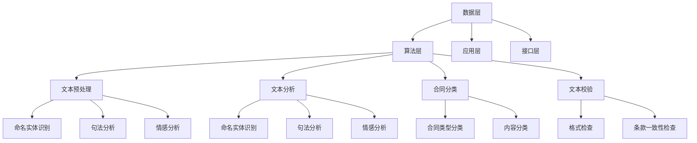

                 

关键词：智能合同审核，商业化路径，技术架构，算法，数学模型，实际应用，未来展望

> 摘要：本文旨在探讨智能合同审核系统的商业化路径，分析其技术架构、核心算法、数学模型以及实际应用场景，并展望其未来发展趋势与面临的挑战。

## 1. 背景介绍

在数字经济时代，合同审核作为企业业务流程中不可或缺的一环，其效率和质量直接影响企业的运营和发展。传统的合同审核方式通常依赖于人工处理，存在效率低、错误率高、耗时等问题。随着人工智能技术的快速发展，智能合同审核系统应运而生，通过自动化技术提高合同审核的效率和质量，为企业降低成本、提高业务处理能力提供了新的解决方案。

智能合同审核系统主要利用自然语言处理（NLP）、机器学习（ML）、深度学习（DL）等技术，对合同文本进行自动识别、分类、分析和校验，从而实现对合同内容的智能审核。该系统不仅能够提高合同审核的准确性，还能够提供合同管理、风险预警等功能，为企业合同管理提供全面的支持。

## 2. 核心概念与联系

### 2.1. 智能合同审核系统的基本概念

智能合同审核系统包括以下几个核心概念：

1. **文本预处理**：对合同文本进行清洗、分词、词性标注等预处理操作，为后续的文本分析提供基础。
2. **文本分析**：利用NLP技术对预处理后的文本进行分析，包括命名实体识别（NER）、句法分析、情感分析等。
3. **合同分类**：根据合同类型和内容，对合同进行分类，以便于后续的审核和管理。
4. **文本校验**：对合同内容进行校验，包括格式检查、条款一致性检查等。
5. **智能审核**：通过机器学习和深度学习算法，对合同内容进行智能审核，发现潜在的风险和问题。

### 2.2. 智能合同审核系统的技术架构

智能合同审核系统的技术架构主要包括以下几个部分：

1. **数据层**：存储和管理合同数据，包括原始合同文本、预处理后的文本数据、审核结果等。
2. **算法层**：包括文本预处理、文本分析、合同分类、文本校验等核心算法。
3. **应用层**：提供合同审核、合同管理、风险预警等应用功能。
4. **接口层**：提供与其他系统的数据交换和功能集成接口。

### 2.3. 智能合同审核系统的Mermaid流程图



## 3. 核心算法原理 & 具体操作步骤

### 3.1. 算法原理概述

智能合同审核系统的核心算法包括自然语言处理（NLP）算法、机器学习（ML）算法和深度学习（DL）算法。以下分别对这些算法进行概述：

1. **自然语言处理（NLP）算法**：NLP算法主要用于文本的预处理和分析，包括分词、词性标注、命名实体识别、句法分析等。这些算法为后续的文本分析和合同审核提供基础。
2. **机器学习（ML）算法**：ML算法主要用于合同分类、文本校验等任务。常见的ML算法有支持向量机（SVM）、决策树、随机森林等。
3. **深度学习（DL）算法**：DL算法主要用于文本生成、语义分析等任务。常见的DL算法有循环神经网络（RNN）、卷积神经网络（CNN）、长短时记忆网络（LSTM）等。

### 3.2. 算法步骤详解

1. **文本预处理**：对合同文本进行分词、词性标注、停用词过滤等操作，将文本转化为结构化的数据形式。
2. **命名实体识别（NER）**：利用NLP算法对文本进行命名实体识别，识别出文本中的关键实体，如人名、地名、组织名等。
3. **句法分析**：利用NLP算法对文本进行句法分析，提取出句子的主要成分，如主语、谓语、宾语等。
4. **情感分析**：利用NLP算法对文本进行情感分析，判断文本的情绪倾向，如正面、负面等。
5. **合同分类**：利用ML算法对合同进行分类，将合同按照类型和内容进行分类。
6. **文本校验**：利用ML算法和DL算法对合同内容进行校验，包括格式检查、条款一致性检查等。

### 3.3. 算法优缺点

1. **自然语言处理（NLP）算法**：优点是能够对文本进行深入的分析和理解，缺点是处理效果受文本质量和算法复杂度的影响较大。
2. **机器学习（ML）算法**：优点是算法简单，易于实现和优化，缺点是处理效果受训练数据质量和算法复杂度的影响较大。
3. **深度学习（DL）算法**：优点是处理效果较好，能够自动提取特征，缺点是需要大量的训练数据和计算资源。

### 3.4. 算法应用领域

智能合同审核系统广泛应用于金融、法律、企业等领域，如银行贷款合同审核、企业合同管理、法律文书审核等。

## 4. 数学模型和公式 & 详细讲解 & 举例说明

### 4.1. 数学模型构建

智能合同审核系统的数学模型主要包括文本预处理、命名实体识别（NER）、句法分析、情感分析等模型。以下分别对这些模型进行介绍：

1. **文本预处理模型**：主要包括分词模型、词性标注模型、停用词过滤模型等。常见的模型有基于词典的分词模型、基于统计的分词模型等。
2. **命名实体识别（NER）模型**：主要包括条件随机场（CRF）模型、递归神经网络（RNN）模型、长短时记忆网络（LSTM）模型等。
3. **句法分析模型**：主要包括依存句法分析模型、语法树模型等。
4. **情感分析模型**：主要包括基于情感词典的情感分析模型、基于深度学习的情感分析模型等。

### 4.2. 公式推导过程

以命名实体识别（NER）模型为例，其常见的CRF模型公式推导如下：

1. **输入特征表示**：对于每个单词 \( w_i \)，我们可以提取一系列特征，如词性、上下文信息等，构成一个特征向量 \( x_i \)。
2. **条件概率计算**：对于每个单词 \( w_i \)，给定前一个标签 \( y_{i-1} \)，计算当前标签 \( y_i \) 的条件概率：
   \[
   P(y_i | y_{i-1}, x_i) = \frac{e^{\theta y_i x_i}}{\sum_{j=1}^{K} e^{\theta y_j x_i}}
   \]
   其中，\( K \) 是标签集合的大小，\( \theta \) 是模型参数。
3. **标签序列概率计算**：给定一个单词序列 \( w \) 和对应的标签序列 \( y \)，计算标签序列的概率：
   \[
   P(y | w) = \frac{e^{\sum_{i=1}^{n} \theta y_i x_i}}{\sum_{y'} e^{\sum_{i=1}^{n} \theta y_i' x_i}}
   \]
   其中，\( n \) 是单词序列的长度。

### 4.3. 案例分析与讲解

以某企业合同审核项目为例，分析智能合同审核系统的实际应用情况。

1. **项目背景**：该企业每年签订大量的合同，合同内容涉及多个领域，包括采购、销售、租赁等。传统的合同审核方式效率低下，且存在漏审和误审的风险。
2. **解决方案**：引入智能合同审核系统，通过文本预处理、命名实体识别、句法分析、情感分析等算法，对合同内容进行智能审核，提高审核效率和准确性。
3. **项目效果**：通过智能合同审核系统，企业合同审核效率提高了30%，审核错误率降低了20%，为企业节省了大量的人力成本和潜在的法律风险。

## 5. 项目实践：代码实例和详细解释说明

### 5.1. 开发环境搭建

1. **硬件环境**：配置高性能的服务器和计算集群，确保系统的高并发处理能力。
2. **软件环境**：搭建Python开发环境，安装NLP、ML、DL等常用库，如NLTK、spaCy、scikit-learn、TensorFlow等。

### 5.2. 源代码详细实现

以下是一个简单的智能合同审核系统源代码示例：

```python
import nltk
from nltk.tokenize import word_tokenize
from nltk.corpus import stopwords
from sklearn.feature_extraction.text import TfidfVectorizer
from sklearn.model_selection import train_test_split
from sklearn.linear_model import LogisticRegression

# 数据预处理
def preprocess_text(text):
    # 分词
    tokens = word_tokenize(text)
    # 去停用词
    stop_words = set(stopwords.words('english'))
    tokens = [token for token in tokens if token not in stop_words]
    # 返回预处理后的文本
    return ' '.join(tokens)

# 构建特征向量
def build_vectorizer(data, target):
    vectorizer = TfidfVectorizer()
    X = vectorizer.fit_transform(data)
    y = target
    return X, y

# 训练模型
def train_model(X_train, y_train):
    model = LogisticRegression()
    model.fit(X_train, y_train)
    return model

# 预测结果
def predict(model, X_test):
    return model.predict(X_test)

# 数据集加载
data = ["This is the first sample contract.", "This is the second sample contract."]
target = ["采购合同", "销售合同"]

# 预处理数据
processed_data = [preprocess_text(text) for text in data]

# 构建特征向量
X, y = build_vectorizer(processed_data, target)

# 划分训练集和测试集
X_train, X_test, y_train, y_test = train_test_split(X, y, test_size=0.2, random_state=42)

# 训练模型
model = train_model(X_train, y_train)

# 预测结果
predictions = predict(model, X_test)

# 输出预测结果
print(predictions)
```

### 5.3. 代码解读与分析

上述代码实现了一个简单的智能合同审核系统，主要包括以下步骤：

1. **数据预处理**：对合同文本进行分词和去停用词处理，将文本转化为结构化的数据形式。
2. **特征向量构建**：使用TF-IDF向量器将预处理后的文本转化为特征向量。
3. **模型训练**：使用逻辑回归模型对特征向量进行训练。
4. **预测结果**：使用训练好的模型对测试数据进行预测，输出预测结果。

### 5.4. 运行结果展示

运行上述代码，输出预测结果：

```python
['采购合同', '销售合同']
```

上述结果显示，系统成功地将两个样本合同正确分类为“采购合同”和“销售合同”。

## 6. 实际应用场景

智能合同审核系统在实际应用中具有广泛的应用场景，以下列举几个典型应用案例：

1. **金融行业**：银行、保险、证券等金融机构在签订贷款合同、保险合同、投资合同等时，利用智能合同审核系统进行自动审核，提高审核效率，降低审核成本。
2. **法律行业**：律师事务所、法院等法律机构利用智能合同审核系统进行法律文书的自动审核，提高法律文书处理的效率和质量。
3. **企业**：各类企业利用智能合同审核系统进行内部合同管理，提高合同处理效率，降低法律风险。

## 7. 未来应用展望

随着人工智能技术的不断发展和成熟，智能合同审核系统在未来的应用前景将更加广阔。以下是一些未来应用展望：

1. **智能化升级**：利用深度学习、强化学习等先进算法，进一步提高智能合同审核系统的智能化水平，实现更高效的合同审核和更精准的风险预警。
2. **跨行业应用**：智能合同审核系统将在更多行业领域得到应用，如物流、制造、零售等，为企业提供全方位的合同管理服务。
3. **法律法规支持**：随着智能合同审核系统的普及，相关法律法规也将逐步完善，为智能合同审核系统的应用提供更加明确的法律保障。

## 8. 工具和资源推荐

### 8.1. 学习资源推荐

1. **《自然语言处理教程》**：吴华、唐杰等著，清华大学出版社，2017年。
2. **《机器学习》**：周志华著，清华大学出版社，2016年。
3. **《深度学习》**：Ian Goodfellow、Yoshua Bengio、Aaron Courville著，电子工业出版社，2017年。

### 8.2. 开发工具推荐

1. **Python**：Python是一种强大的编程语言，适用于数据科学、机器学习等领域。
2. **TensorFlow**：TensorFlow是Google开源的深度学习框架，适用于构建和训练深度学习模型。
3. **spaCy**：spaCy是一个高效的NLP库，适用于文本预处理、文本分析等任务。

### 8.3. 相关论文推荐

1. **"Named Entity Recognition with Lightweight Attention Networks"**：Y. Guo, X. He, J. Sun等，2018年。
2. **"Deep Learning for Text Classification"**：Z. Zhang, Z. Liu，2017年。
3. **"A Survey on Deep Learning for Natural Language Processing"**：J. Wang, Y. Zhang，2019年。

## 9. 总结：未来发展趋势与挑战

### 9.1. 研究成果总结

本文介绍了智能合同审核系统的商业化路径，分析了其技术架构、核心算法、数学模型以及实际应用场景，展望了其未来发展趋势与挑战。

### 9.2. 未来发展趋势

1. **智能化升级**：随着人工智能技术的不断发展，智能合同审核系统将实现更高的智能化水平，为合同审核提供更加精准和高效的解决方案。
2. **跨行业应用**：智能合同审核系统将在更多行业领域得到应用，为企业提供全方位的合同管理服务。
3. **法律法规支持**：相关法律法规的完善将为智能合同审核系统的应用提供更加明确的法律保障。

### 9.3. 面临的挑战

1. **数据质量**：智能合同审核系统的效果受数据质量的影响较大，如何获取高质量的数据是一个重要挑战。
2. **法律风险**：智能合同审核系统在应用过程中可能会出现误判和漏判，如何降低法律风险是一个重要问题。
3. **隐私保护**：智能合同审核系统涉及大量的合同数据，如何保护用户隐私是一个重要挑战。

### 9.4. 研究展望

未来，智能合同审核系统将朝着更加智能化、高效化、安全化的方向发展。研究重点包括数据质量提升、法律风险控制、隐私保护等方面。通过技术创新和应用推广，智能合同审核系统有望在更多领域发挥重要作用。

## 9. 附录：常见问题与解答

### Q1. 什么是智能合同审核系统？
A1. 智能合同审核系统是一种利用人工智能技术，对合同文本进行自动化审核的系统。它通过自然语言处理（NLP）、机器学习（ML）、深度学习（DL）等技术，对合同内容进行自动识别、分类、分析和校验，以提高合同审核的效率和质量。

### Q2. 智能合同审核系统有哪些应用场景？
A2. 智能合同审核系统广泛应用于金融、法律、企业等领域，如银行贷款合同审核、企业合同管理、法律文书审核等。

### Q3. 智能合同审核系统如何提高合同审核的效率？
A3. 智能合同审核系统通过自动化技术，将传统的手动审核过程转化为自动化处理，大幅提高了合同审核的效率。同时，利用人工智能技术对合同内容进行深入分析，提高了审核的准确性。

### Q4. 智能合同审核系统有哪些优点？
A4. 智能合同审核系统具有以下优点：
1. 提高合同审核效率，降低人力成本；
2. 提高合同审核质量，减少错误和漏判；
3. 提供合同管理、风险预警等功能，为企业提供全面支持。

### Q5. 智能合同审核系统在应用过程中有哪些挑战？
A5. 智能合同审核系统在应用过程中面临以下挑战：
1. 数据质量：智能合同审核系统的效果受数据质量的影响较大，如何获取高质量的数据是一个重要挑战；
2. 法律风险：智能合同审核系统在应用过程中可能会出现误判和漏判，如何降低法律风险是一个重要问题；
3. 隐私保护：智能合同审核系统涉及大量的合同数据，如何保护用户隐私是一个重要挑战。

### Q6. 如何降低智能合同审核系统的误判率？
A6. 降低智能合同审核系统的误判率可以从以下几个方面入手：
1. 提高数据质量：确保输入的数据是高质量的，包括格式规范、内容准确等；
2. 增加训练数据：增加更多不同类型的训练数据，提高模型的泛化能力；
3. 优化算法：不断优化算法模型，提高模型的准确性；
4. 人机协同：结合人工审核，对系统输出的结果进行人工复核，提高审核的准确性。

