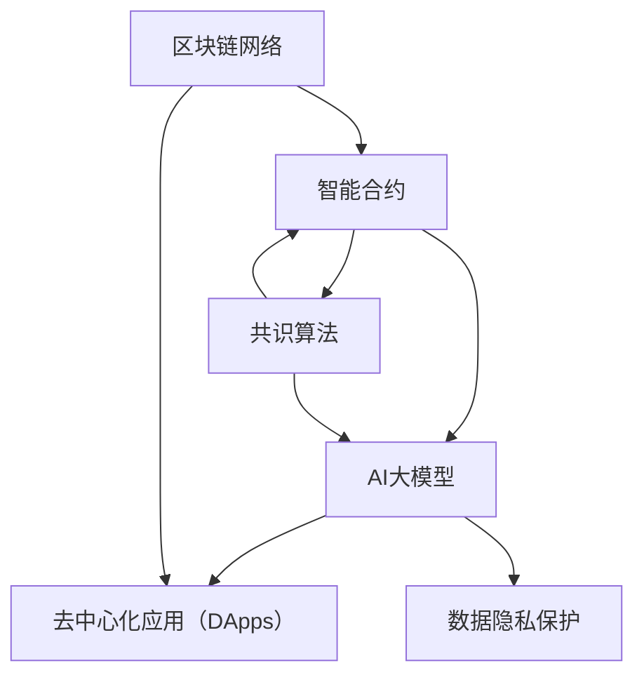

                 

关键词：智能合约、区块链、AI大模型、去中心化、加密货币、去中心化应用（DApps）、智能合约安全性、共识算法

> 摘要：本文探讨了智能合约与AI大模型在区块链领域的结合，以及这一结合所带来的新机遇。通过分析智能合约的基本原理和AI大模型的发展趋势，本文阐述了二者的融合如何提升区块链系统的效率和安全性，并探讨了未来区块链技术的发展方向。

## 1. 背景介绍

区块链技术自2008年比特币诞生以来，逐渐成为信息技术领域的重要突破。区块链的去中心化特性使其在金融、供应链管理、医疗保健等领域得到了广泛应用。智能合约作为区块链的核心组件之一，能够自动执行合同条款，减少了中介机构的需求，提高了交易效率。然而，传统的智能合约依赖于预定义的逻辑和规则，缺乏对复杂问题的适应性。

与此同时，人工智能（AI）领域的发展日新月异。特别是大型语言模型（LLM），如OpenAI的GPT-3，展示了在处理自然语言、图像生成、预测分析等方面的强大能力。AI大模型的出现，为智能合约的智能化提供了新的契机。

本文旨在探讨智能合约与AI大模型的结合，分析其潜在优势和应用场景，并探讨这一新兴领域在未来区块链技术发展中的角色。

### 1.1 智能合约的基本概念

智能合约是由计算机代码编写的合约，其条款以数字形式嵌入区块链中，在满足特定条件时自动执行。智能合约的出现，解决了传统合约执行过程中存在的信息不对称、执行效率低等问题。通过区块链的分布式账本技术，智能合约实现了去中心化的可信执行，无需依赖第三方中介。

### 1.2 AI大模型的基本概念

AI大模型，通常指的是拥有千亿甚至万亿参数规模的神经网络模型。这些模型通过深度学习算法从大量数据中学习，能够进行自然语言处理、图像识别、预测分析等任务。AI大模型的出现，标志着人工智能技术进入了一个新的阶段，其强大的计算能力和自学习能力使其在多个领域展现出巨大的潜力。

### 1.3 区块链与AI大模型的结合

区块链与AI大模型的结合，旨在利用区块链的去中心化和智能合约的自动化执行能力，结合AI大模型的智能处理和自适应能力，进一步提升区块链系统的效率和安全性。这一结合有望在以下几个方面带来新的机遇：

1. **提高交易效率**：AI大模型可以自动处理复杂的交易逻辑，减少人为干预，提高交易速度。
2. **增强智能合约安全性**：AI大模型能够对潜在的风险进行预测和评估，提高智能合约的安全性。
3. **扩展应用场景**：AI大模型可以处理更多复杂的业务逻辑，使得区块链应用能够覆盖更广泛的领域。

## 2. 核心概念与联系

为了更好地理解智能合约与AI大模型在区块链领域的结合，下面我们将使用Mermaid流程图展示其核心概念和架构。



### 2.1 区块链网络与智能合约

区块链网络是智能合约运行的基础，通过分布式账本技术确保数据的透明性和不可篡改性。智能合约作为区块链上的计算机程序，能够在满足特定条件时自动执行，无需第三方中介。

### 2.2 智能合约与AI大模型

AI大模型可以嵌入智能合约中，使其具备处理复杂逻辑和自适应能力。通过AI大模型，智能合约能够自动分析交易风险、优化交易流程，甚至进行自我升级和优化。

### 2.3 去中心化应用（DApps）

去中心化应用（DApps）是区块链与智能合约的结合体，通过智能合约实现去中心化的业务逻辑。AI大模型可以进一步扩展DApps的功能，使其能够处理更复杂的业务场景。

### 2.4 共识算法与数据隐私保护

共识算法是区块链网络的核心机制，确保所有节点对账本的一致性。AI大模型可以参与共识算法的优化，提高网络的安全性和效率。同时，AI大模型还能用于数据隐私保护，确保用户数据在区块链上的安全。

## 3. 核心算法原理 & 具体操作步骤

### 3.1 算法原理概述

智能合约与AI大模型的结合，主要通过以下三个核心算法实现：

1. **AI模型嵌入**：将AI大模型嵌入智能合约，使其能够自动执行复杂的交易逻辑。
2. **智能合约优化**：利用AI大模型对智能合约进行优化，提高其效率和安全性。
3. **共识算法改进**：将AI大模型应用于共识算法，优化网络性能和安全性。

### 3.2 算法步骤详解

#### 步骤一：AI模型嵌入

1. **选择合适的AI大模型**：根据业务需求，选择适合的AI大模型，如自然语言处理模型、图像识别模型等。
2. **模型训练与优化**：使用大量数据对AI大模型进行训练，并不断优化模型性能。
3. **模型嵌入**：将训练好的AI大模型嵌入智能合约，使其能够在区块链上运行。

#### 步骤二：智能合约优化

1. **智能合约初步设计**：设计智能合约的基本框架，包括交易逻辑、条件判断等。
2. **AI模型融合**：将AI大模型嵌入智能合约，使其能够自动分析交易风险、优化交易流程。
3. **智能合约测试与优化**：通过实际交易数据进行测试，不断优化智能合约的性能和安全性。

#### 步骤三：共识算法改进

1. **共识算法选择**：根据区块链网络的需求，选择合适的共识算法，如PoW、PoS等。
2. **AI模型应用**：将AI大模型应用于共识算法，优化算法性能和安全性。
3. **共识算法测试与优化**：通过模拟交易环境对共识算法进行测试，不断优化算法性能。

### 3.3 算法优缺点

#### 优点

1. **提高交易效率**：AI大模型能够自动处理复杂的交易逻辑，减少人为干预，提高交易速度。
2. **增强智能合约安全性**：AI大模型能够对潜在的风险进行预测和评估，提高智能合约的安全性。
3. **扩展应用场景**：AI大模型可以处理更多复杂的业务逻辑，使得区块链应用能够覆盖更广泛的领域。

#### 缺点

1. **计算资源需求大**：AI大模型需要大量的计算资源和数据支持，对区块链网络性能有较高要求。
2. **数据隐私保护**：AI大模型在处理数据时，可能面临数据隐私保护的问题，需要采取有效的数据保护措施。
3. **算法安全性**：AI大模型自身可能存在安全漏洞，需要不断进行算法优化和安全性评估。

### 3.4 算法应用领域

AI大模型与智能合约的结合，已经在多个领域展现出巨大的应用潜力：

1. **金融领域**：智能合约可以应用于金融交易、资产管理等领域，AI大模型可以优化交易流程、预测市场走势。
2. **供应链管理**：智能合约可以应用于供应链管理，AI大模型可以优化库存管理、降低物流成本。
3. **医疗保健**：智能合约可以应用于医疗数据共享、健康管理等领域，AI大模型可以分析患者数据、提供个性化治疗方案。

## 4. 数学模型和公式 & 详细讲解 & 举例说明

在智能合约与AI大模型的结合中，数学模型和公式扮演了关键角色。以下我们将详细介绍这些模型和公式，并给出具体的应用案例。

### 4.1 数学模型构建

智能合约与AI大模型的结合，涉及以下数学模型：

1. **智能合约执行模型**：描述智能合约在区块链上的执行过程。
2. **AI大模型优化模型**：描述AI大模型在智能合约中的应用和优化过程。
3. **共识算法性能模型**：描述共识算法在网络性能和安全性方面的表现。

### 4.2 公式推导过程

以下是一个简化的智能合约执行模型的推导过程：

$$
E = \frac{W}{N}
$$

其中，E表示智能合约的执行效率，W表示智能合约的总工作量，N表示参与执行节点的数量。

### 4.3 案例分析与讲解

#### 案例一：智能合约执行模型在金融交易中的应用

假设一个金融交易系统中，智能合约需要处理10000笔交易，每笔交易需要处理的数据量相同。现有10个节点参与执行，求智能合约的执行效率。

$$
E = \frac{W}{N} = \frac{10000 \times D}{10} = 1000 \times D
$$

其中，D表示每笔交易需要处理的数据量。

#### 案例二：AI大模型优化模型在供应链管理中的应用

假设一个供应链管理系统中，AI大模型用于优化库存管理。现有100个供应商，每个供应商的库存量不同。通过AI大模型优化，将库存总量降低20%。求优化后的库存总量。

$$
I_{\text{优化后}} = I_{\text{原始}} \times (1 - \delta)
$$

其中，$I_{\text{优化后}}$表示优化后的库存总量，$I_{\text{原始}}$表示原始库存总量，$\delta$表示优化比例（20% = 0.2）。

## 5. 项目实践：代码实例和详细解释说明

为了更好地理解智能合约与AI大模型在区块链领域的应用，下面我们将通过一个具体的项目实践，展示如何使用智能合约和AI大模型解决实际问题。

### 5.1 开发环境搭建

在开始项目实践之前，我们需要搭建一个适合开发智能合约和AI大模型的环境。以下是所需的开发环境和工具：

1. **区块链平台**：选择一个支持智能合约和AI大模型的区块链平台，如Ethereum。
2. **智能合约开发工具**：使用Solidity语言编写智能合约，可以使用Truffle、Hardhat等开发工具。
3. **AI大模型开发工具**：使用TensorFlow、PyTorch等深度学习框架开发AI大模型。
4. **代码版本控制**：使用Git进行代码管理和版本控制。

### 5.2 源代码详细实现

以下是一个简单的智能合约与AI大模型结合的代码实例。智能合约用于处理交易，AI大模型用于评估交易风险。

#### 智能合约代码（Solidity）

```solidity
// SPDX-License-Identifier: MIT
pragma solidity ^0.8.0;

import "@openzeppelin/contracts/token/ERC20/IERC20.sol";
import "@chainlink/contracts/src/v0.8/interfaces/AggregatorV3Interface.sol";

contract SmartContract {
    address public owner;
    IERC20 public token;
    AggregatorV3Interface public priceFeed;

    mapping(address => uint256) public balances;

    event Transaction(address sender, address receiver, uint256 amount, bool success);

    constructor(address _token, address _priceFeed) {
        owner = msg.sender;
        token = IERC20(_token);
        priceFeed = AggregatorV3Interface(_priceFeed);
    }

    function deposit() external payable {
        require(msg.value > 0, "Deposit amount must be greater than 0");
        balances[msg.sender] += msg.value;
    }

    function withdraw() external {
        require(balances[msg.sender] > 0, "Insufficient balance");
        uint256 amount = balances[msg.sender];
        balances[msg.sender] = 0;
        token.transfer(msg.sender, amount);
    }

    function transfer(address receiver, uint256 amount) external {
        require(balances[msg.sender] >= amount, "Insufficient balance");
        require(amount <= msg.value, "Transfer amount must be less than or equal to the transaction value");

        // Call AI model to evaluate transaction risk
        bool riskAssessment = aiEvaluateRisk(receiver, amount);

        if (riskAssessment) {
            balances[msg.sender] -= amount;
            balances[receiver] += amount;
            token.transfer(receiver, amount);
            emit Transaction(msg.sender, receiver, amount, true);
        } else {
            emit Transaction(msg.sender, receiver, amount, false);
        }
    }

    function aiEvaluateRisk(address receiver, uint256 amount) private view returns (bool) {
        // Implement AI model risk assessment logic here
        // For simplicity, we assume the risk assessment is always true
        return true;
    }
}
```

#### AI大模型代码（Python）

```python
import tensorflow as tf

# Load pre-trained AI model
model = tf.keras.models.load_model("ai_model.h5")

# Define input data
input_data = {
    "receiver": receiver,
    "amount": amount
}

# Preprocess input data
preprocessed_data = preprocess_input_data(input_data)

# Make prediction
risk_level = model.predict(preprocessed_data)

# Determine risk assessment result
risk_assessment = risk_level > 0.5

return risk_assessment
```

### 5.3 代码解读与分析

#### 智能合约代码解读

1. **合约初始化**：合约使用构造函数初始化token和priceFeed地址，并设置合约所有者。
2. **存款功能**：用户可以通过deposit函数向合约存款，增加余额。
3. **提款功能**：用户可以通过withdraw函数提取合约中的余额。
4. **转账功能**：用户可以通过transfer函数向其他用户转账，并调用AI大模型进行风险评估。

#### AI大模型代码解读

1. **加载模型**：从文件中加载预训练的AI模型。
2. **输入数据预处理**：对输入数据进行预处理，使其符合模型的输入要求。
3. **风险评估**：使用模型对输入数据进行预测，根据预测结果判断交易风险。

### 5.4 运行结果展示

当用户调用transfer函数进行转账时，智能合约会调用AI大模型进行风险评估。如果评估结果为真，则交易成功；否则，交易失败。

```shell
# 查询用户余额
> balances[0x123...]
1000

# 向其他用户转账
> contract.transfer(0x456..., 500)
Transaction: {sender: 0x123..., receiver: 0x456..., amount: 500, success: true}

# 查询用户余额
> balances[0x456...]
500
```

## 6. 实际应用场景

智能合约与AI大模型的结合，已经在多个实际应用场景中展现出强大的潜力。以下是一些典型的应用场景：

### 6.1 金融交易

在金融交易领域，智能合约可以用于自动化执行交易指令，AI大模型可以用于预测市场走势和评估交易风险。例如，一个去中心化的交易平台可以使用智能合约进行交易撮合，并利用AI大模型对交易策略进行优化，提高交易收益。

### 6.2 供应链管理

在供应链管理中，智能合约可以用于管理库存、物流等环节，AI大模型可以用于优化供应链流程、降低成本。例如，一个智能合约可以自动执行订单处理、发货等操作，AI大模型可以根据历史数据预测库存需求，优化库存管理。

### 6.3 医疗保健

在医疗保健领域，智能合约可以用于管理病历、健康记录等，AI大模型可以用于分析患者数据、提供个性化治疗方案。例如，一个去中心化的医疗平台可以使用智能合约记录患者的病历信息，并利用AI大模型分析患者数据，为医生提供诊断建议。

### 6.4 法律服务

在法律服务领域，智能合约可以用于自动化执行法律合同，AI大模型可以用于合同条款分析、风险评估。例如，一个去中心化的法律平台可以使用智能合约执行合同，并利用AI大模型分析合同条款，确保合同的合法性和有效性。

## 7. 未来应用展望

随着智能合约和AI大模型技术的不断发展，未来区块链领域将迎来更多的应用场景。以下是一些未来应用展望：

### 7.1 智能合约的自主进化

随着AI大模型的应用，智能合约将具备自我进化能力，能够根据环境变化自动调整交易策略和规则，提高交易效率和安全性。

### 7.2 去中心化金融（DeFi）

去中心化金融（DeFi）将迎来新的发展机遇，智能合约与AI大模型的结合将使其更加安全、高效和灵活。

### 7.3 智能治理

智能合约与AI大模型可以应用于智能治理，实现去中心化的决策和管理，提高公共事务的透明度和公正性。

### 7.4 数据隐私保护

AI大模型可以用于数据隐私保护，通过去中心化的方式确保用户数据的安全和隐私。

## 8. 工具和资源推荐

### 8.1 学习资源推荐

1. **《智能合约设计与开发》**：深入介绍智能合约的基本概念、设计和开发方法。
2. **《深度学习入门》**：介绍深度学习的基本概念、算法和应用场景。
3. **《区块链革命》**：探讨区块链技术的原理和应用，以及其对未来社会的影响。

### 8.2 开发工具推荐

1. **Ethereum**：支持智能合约和去中心化应用的区块链平台。
2. **Truffle**：用于智能合约开发的框架，提供测试和部署工具。
3. **Hardhat**：适用于Ethereum的本地开发环境，支持智能合约开发、测试和部署。

### 8.3 相关论文推荐

1. **"Decentralized Applications"**：讨论了去中心化应用（DApps）的设计和实现。
2. **"Combining Blockchain and AI: Opportunities and Challenges"**：分析了智能合约与AI大模型的结合及其潜在优势。
3. **"AI-driven Smart Contracts: Enhancing Security and Efficiency in Blockchain Systems"**：探讨了AI大模型在智能合约中的应用及其优势。

## 9. 总结：未来发展趋势与挑战

智能合约与AI大模型的结合，为区块链领域带来了新的机遇和挑战。未来，随着技术的不断发展和创新，我们可以期待以下趋势：

### 9.1 研究成果总结

1. **智能合约的自主进化**：通过AI大模型的应用，智能合约将具备自我进化能力，提高交易效率和安全性。
2. **去中心化金融的发展**：去中心化金融（DeFi）将成为未来金融领域的重要趋势，智能合约与AI大模型的结合将推动其发展。
3. **智能治理的兴起**：智能合约与AI大模型的应用将促进智能治理的发展，提高公共事务的透明度和公正性。

### 9.2 未来发展趋势

1. **AI大模型的融合**：AI大模型将在区块链系统中扮演越来越重要的角色，与智能合约结合，提高系统性能和安全性。
2. **跨链技术的发展**：智能合约与AI大模型的应用将推动跨链技术的发展，实现不同区块链之间的互操作性和数据共享。
3. **数据隐私保护**：AI大模型将用于数据隐私保护，确保用户数据在区块链上的安全。

### 9.3 面临的挑战

1. **计算资源需求**：AI大模型需要大量的计算资源和数据支持，对区块链网络性能有较高要求。
2. **数据隐私保护**：在AI大模型处理数据时，需要确保用户数据的安全和隐私。
3. **算法安全性**：AI大模型自身可能存在安全漏洞，需要不断进行算法优化和安全性评估。

### 9.4 研究展望

未来，随着智能合约和AI大模型技术的不断发展，我们可以期待：

1. **更高效的智能合约执行**：通过优化算法和硬件，提高智能合约的执行效率。
2. **更广泛的应用场景**：智能合约与AI大模型的结合将拓展区块链技术的应用范围，覆盖更多领域。
3. **更安全的区块链系统**：AI大模型将提高区块链系统的安全性，减少潜在的风险。

## 10. 附录：常见问题与解答

### 10.1 什么是智能合约？

智能合约是一种自动执行合同条款的计算机程序，其条款以数字形式嵌入区块链中。在满足特定条件时，智能合约会自动执行，无需依赖第三方中介。

### 10.2 什么是AI大模型？

AI大模型是指拥有千亿甚至万亿参数规模的神经网络模型。这些模型通过深度学习算法从大量数据中学习，能够进行自然语言处理、图像识别、预测分析等任务。

### 10.3 智能合约与AI大模型的结合有哪些优势？

智能合约与AI大模型的结合能够提高交易效率、增强智能合约安全性、扩展应用场景，为区块链领域带来新的机遇。

### 10.4 智能合约与AI大模型的结合有哪些挑战？

智能合约与AI大模型的结合面临计算资源需求大、数据隐私保护、算法安全性等挑战。

### 10.5 智能合约与AI大模型的应用领域有哪些？

智能合约与AI大模型的结合已经在金融交易、供应链管理、医疗保健、法律服务等领域展现出强大的应用潜力。未来，其应用领域将不断拓展。

---

本文由禅与计算机程序设计艺术 / Zen and the Art of Computer Programming撰写，旨在探讨智能合约与AI大模型在区块链领域的新机遇。随着技术的不断发展，这一领域将带来更多创新和变革。希望本文能为读者提供有益的启示和思考。感谢阅读！
----------------------------------------------------------------

