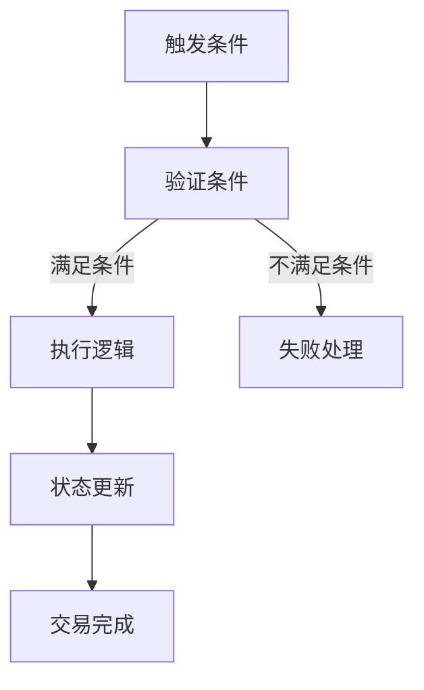

                 

关键词：智能合约、区块链、自动化交易、去中心化、加密货币、安全性、可信性、透明性

> 摘要：本文将探讨智能合约创业的背景和未来趋势，重点关注其在自动化交易领域的应用。通过深入分析智能合约的原理、数学模型以及实际项目案例，我们将揭示智能合约技术的潜力及其面临的挑战，为创业者提供有价值的见解。

## 1. 背景介绍

智能合约是区块链技术的重要应用之一，起源于1994年尼克·萨博（Nick Szabo）的构想。智能合约是一种自执行合同，通过计算机程序在区块链上进行验证和执行。其核心思想是将合同条款和逻辑编码在区块链上，确保交易过程中的自动化和去中心化。

近年来，随着区块链技术的发展和加密货币的兴起，智能合约的应用场景不断扩展。自动化交易是其中最具潜力的领域之一。自动化交易通过智能合约实现，可以在无需人工干预的情况下进行交易，提高了交易效率，降低了成本，同时确保了交易的透明性和安全性。

## 2. 核心概念与联系

### 2.1 智能合约原理

智能合约的原理可以概括为三个关键部分：触发条件、执行逻辑和状态更新。

1. **触发条件**：智能合约在满足特定条件时才会执行。这些条件可以是时间、金额、交易双方的身份或其他复杂逻辑。

2. **执行逻辑**：当触发条件满足时，智能合约按照预定的逻辑执行操作，如转账、释放锁定资产等。

3. **状态更新**：执行逻辑完成后，智能合约会更新区块链上的状态，确保交易记录的不可篡改性。

### 2.2 智能合约架构

智能合约的架构可以分为三个层次：底层区块链、智能合约平台和应用层。

1. **底层区块链**：提供分布式账本和去中心化的基础架构，确保数据的可靠性和安全性。

2. **智能合约平台**：提供编写、部署和执行智能合约的环境，如以太坊、EOS等。

3. **应用层**：构建在实际智能合约平台之上的应用程序，实现具体的业务逻辑和功能。

### 2.3 Mermaid 流程图

以下是一个简化的智能合约执行流程的 Mermaid 流程图：



## 3. 核心算法原理 & 具体操作步骤

### 3.1 算法原理概述

智能合约的算法原理基于区块链技术的分布式账本和加密算法。智能合约通过预定义的逻辑和规则，实现自动化交易的执行和状态更新。

### 3.2 算法步骤详解

1. **编写智能合约**：开发者使用智能合约平台提供的编程语言（如Solidity）编写合约代码，定义交易逻辑和触发条件。

2. **部署智能合约**：将编写好的智能合约部署到区块链上，创建一个唯一的合约地址。

3. **触发智能合约**：当满足触发条件时，交易双方通过智能合约执行交易。

4. **执行逻辑**：智能合约根据预定的逻辑执行操作，如转账、释放锁定资产等。

5. **状态更新**：执行逻辑完成后，智能合约更新区块链上的状态，记录交易信息。

6. **交易确认**：智能合约执行完成后，交易记录将被区块链网络中的节点确认，确保交易不可篡改。

### 3.3 算法优缺点

**优点：**
- **去中心化**：智能合约去中心化的特性，确保了交易的透明性和安全性。
- **自动化**：智能合约自动化执行，提高了交易效率，降低了人工成本。
- **不可篡改**：区块链上的交易记录不可篡改，确保了数据的可靠性。

**缺点：**
- **技术门槛**：智能合约的开发和部署需要一定的技术门槛，对非技术人员友好性较差。
- **安全性风险**：智能合约代码的漏洞可能导致严重的后果，如资金损失。

### 3.4 算法应用领域

智能合约在多个领域都有广泛应用，包括但不限于：

- **金融领域**：自动化交易、数字资产管理、保险理赔等。
- **供应链管理**：确保供应链的透明性和可追溯性。
- **版权保护**：数字版权的管理和保护。
- **投票系统**：去中心化的投票系统，确保投票的公正性和透明性。

## 4. 数学模型和公式 & 详细讲解 & 举例说明

### 4.1 数学模型构建

智能合约的数学模型主要涉及加密算法和区块链网络中的节点计算。以下是智能合约中常用的数学模型：

1. **椭圆曲线加密算法（ECC）**：用于智能合约的安全通信和数字签名。
2. **哈希函数**：用于确保区块链上的数据一致性和完整性。
3. **共识算法**：用于确保区块链网络中的节点达成共识，如工作量证明（PoW）、权益证明（PoS）等。

### 4.2 公式推导过程

1. **椭圆曲线加密算法（ECC）**：
   - **椭圆曲线**：定义为 \( y^2 = x^3 + ax + b \) 的曲线。
   - **点乘**：椭圆曲线上的点与整数 \( k \) 的乘积。

2. **哈希函数**：
   - **MD5**：将输入数据映射为32位十六进制字符串。
   - **SHA-256**：将输入数据映射为256位十六进制字符串。

3. **共识算法**：
   - **PoW**：通过计算找到满足特定条件的随机数，验证节点合法性。
   - **PoS**：通过持有代币数量和持币时间，决定节点合法性。

### 4.3 案例分析与讲解

假设我们有一个简单的智能合约，用于实现自动转账功能。以下是该智能合约的数学模型和公式：

1. **椭圆曲线加密算法（ECC）**：
   - **公钥**：\( P = k \cdot G \)，其中 \( G \) 是椭圆曲线上的基点，\( k \) 是私钥。
   - **签名**：\( (r, s) = sign(m, k) \)，其中 \( m \) 是消息，\( r \) 和 \( s \) 是签名。

2. **哈希函数**：
   - **消息哈希**：\( H(m) \)，将消息 \( m \) 映射为哈希值。

3. **共识算法**：
   - **PoW**：找到满足 \( hash(nonce) \leq target \) 的随机数 \( nonce \)。

该智能合约的数学模型和公式确保了交易的安全性、不可篡改性以及去中心化特性。

## 5. 项目实践：代码实例和详细解释说明

### 5.1 开发环境搭建

1. 安装Node.js（版本8.0以上）。
2. 安装Truffle框架：`npm install -g truffle`。
3. 创建一个新的Truffle项目：`truffle init`。

### 5.2 源代码详细实现

以下是一个简单的智能合约示例，实现自动转账功能：

```solidity
pragma solidity ^0.8.0;

contract AutoTransfer {
    address public owner;
    mapping(address => uint256) public balances;

    constructor() {
        owner = msg.sender;
        balances[owner] = 1000; // 初始余额为1000
    }

    function deposit() external payable {
        balances[msg.sender] += msg.value;
    }

    function transfer(address to, uint256 amount) external {
        require(to != address(0), "Invalid recipient");
        require(balances[msg.sender] >= amount, "Insufficient balance");
        balances[msg.sender] -= amount;
        balances[to] += amount;
    }

    function withdraw() external {
        require(msg.sender == owner, "Only owner can withdraw");
        payable(owner).transfer(balances[owner]);
    }
}
```

### 5.3 代码解读与分析

1. **构造函数**：定义合约的创建者和初始余额。
2. **deposit() 函数**：实现存款功能，将资金存入合约账户。
3. **transfer() 函数**：实现转账功能，从发送者账户扣除金额，并向接收者账户添加金额。
4. **withdraw() 函数**：实现提现功能，只有合约创建者（owner）可以调用。

### 5.4 运行结果展示

1. **部署合约**：使用Truffle部署合约到以太坊测试网络。
2. **调用函数**：通过Truffle进行交互，测试合约的功能。

## 6. 实际应用场景

### 6.1 金融领域

智能合约在金融领域具有广泛的应用，如自动化交易、数字资产管理、去中心化金融（DeFi）等。智能合约可以确保金融交易的自动化、透明性和安全性。

### 6.2 物流与供应链管理

智能合约可以确保供应链的透明性和可追溯性。例如，通过智能合约实现供应链中的物流跟踪、支付结算等功能，确保交易的合法性和效率。

### 6.3 版权保护

智能合约可以用于数字版权的管理和保护。通过智能合约，版权方可以设定授权条款，确保内容的合法使用和收益分配。

### 6.4 政府与公共服务

智能合约可以用于政府与公共服务的优化，如投票系统、身份验证、合同管理等。智能合约确保了数据的透明性和不可篡改性，提高了公共服务效率。

## 7. 工具和资源推荐

### 7.1 学习资源推荐

- 《智能合约设计与开发》
- 《区块链技术指南》
- 《以太坊从入门到实战》

### 7.2 开发工具推荐

- Truffle：智能合约开发框架。
- Remix：在线智能合约编辑器。
- Ganache：本地以太坊测试网络。

### 7.3 相关论文推荐

- "Smart Contracts: A New Paradigm for Distributed Systems"
- "Decentralized Applications: Building Blockchains from Scratch"
- "The Ethereum Yellow Paper"

## 8. 总结：未来发展趋势与挑战

### 8.1 研究成果总结

智能合约技术在过去几年取得了显著进展，已广泛应用于金融、物流、版权等多个领域。智能合约确保了交易的自动化、透明性和安全性，具有巨大的商业潜力。

### 8.2 未来发展趋势

1. **智能合约标准化**：推动智能合约的标准化，提高开发效率和互操作性。
2. **跨链技术**：实现不同区块链之间的互操作，扩大智能合约的应用范围。
3. **隐私保护**：增强智能合约的隐私保护能力，满足不同应用场景的需求。

### 8.3 面临的挑战

1. **安全性风险**：智能合约的安全性问题依然存在，需要不断提高代码审查和测试标准。
2. **技术门槛**：智能合约的开发和部署需要一定的技术背景，降低门槛是未来发展的重要方向。
3. **法律监管**：智能合约在法律监管方面的挑战，需要制定相应的法律法规和标准。

### 8.4 研究展望

智能合约技术将继续发展，为各行业带来创新和变革。未来，我们将看到更多跨领域、跨平台的智能合约应用，实现更加高效、安全、透明的交易环境。

## 9. 附录：常见问题与解答

### 9.1 智能合约如何确保安全性？

- **代码审查**：对智能合约代码进行严格的代码审查，发现和修复潜在的安全漏洞。
- **测试**：通过自动化测试和手工测试，验证智能合约的功能和性能。
- **安全审计**：聘请专业安全团队进行安全审计，提高智能合约的安全性和可靠性。

### 9.2 智能合约是否可以完全取代传统合同？

- 智能合约不能完全取代传统合同，但在某些场景下具有优势。智能合约适用于标准化的合同条款，而传统合同适用于复杂的商业协议。

### 9.3 智能合约的数据如何保证隐私？

- **加密技术**：使用加密技术保护智能合约中的数据，确保数据在传输和存储过程中的安全性。
- **隐私保护合约**：开发专门用于隐私保护的智能合约，确保数据在区块链上的隐私性。

---

作者：禅与计算机程序设计艺术 / Zen and the Art of Computer Programming
----------------------------------------------------------------


