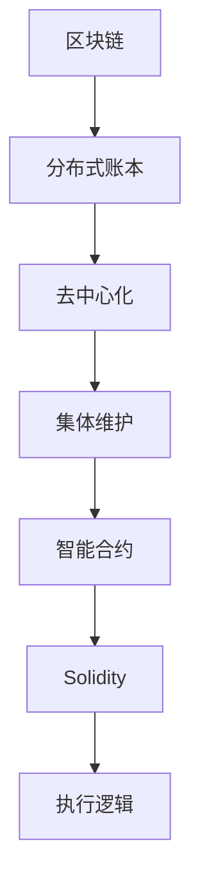
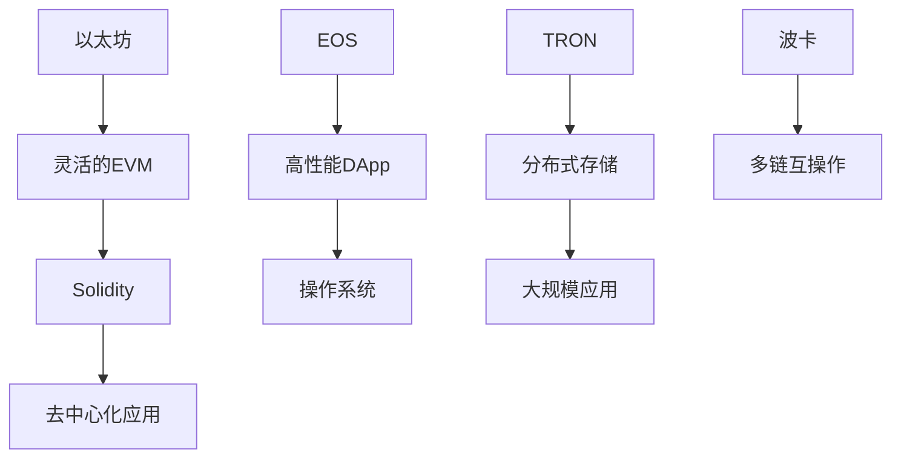

                 

关键词：智能合约、以太坊、区块链、平台比较、开发技术

> 摘要：本文旨在探讨智能合约开发领域的主要平台——以太坊，以及与其具有竞争关系的其他平台，通过对比分析，帮助开发者了解各自的优势和不足，以便选择最适合自己的开发环境。

## 1. 背景介绍

随着区块链技术的迅猛发展，智能合约作为区块链的核心应用之一，受到了越来越多的关注。智能合约是一种运行在区块链上的自执行合同，通过预设的逻辑规则自动执行合约条款。在以太坊平台上，智能合约以Solidity编程语言编写，具有高度的灵活性和可扩展性。

然而，随着智能合约应用的不断普及，市场上出现了多种智能合约平台，它们各自具有独特的特点。本文将主要围绕以太坊，分析其与其他平台在技术、性能、安全性等方面的比较，帮助开发者做出更加明智的选择。

## 2. 核心概念与联系

### 2.1 区块链与智能合约

区块链是一种分布式账本技术，其核心特点包括不可篡改、去中心化和集体维护。智能合约是运行在区块链上的程序，能够自动执行预定的逻辑，实现合约条款的执行。

下面是一个简单的Mermaid流程图，展示区块链与智能合约的基本架构：



### 2.2 智能合约平台

智能合约平台是支持智能合约编写、部署和执行的环境。目前市场上主要有以下几种平台：

- **以太坊**：以太坊是当前最流行的智能合约平台，以其灵活的EVM（以太坊虚拟机）和Solidity编程语言著称。
- **EOS**：EOS旨在实现一个去中心化的操作系统，支持高性能的DApp（分布式应用程序）开发。
- **TRON**：TRON致力于构建一个全球性的分布式存储和计算网络，支持大规模智能合约应用。
- **波卡**：波卡是一个多链平台，支持各种区块链之间的互操作。

以下是一个Mermaid流程图，展示了几大智能合约平台及其主要特点：



## 3. 核心算法原理 & 具体操作步骤

### 3.1 算法原理概述

智能合约的开发主要依赖于区块链平台的底层架构。以以太坊为例，其核心算法包括：

- **EVM（以太坊虚拟机）**：以太坊的虚拟机负责执行智能合约中的代码。
- **Gas模型**：以太坊采用Gas模型来计算执行智能合约所需计算资源，确保网络资源得到合理利用。

### 3.2 算法步骤详解

#### 以太坊智能合约开发流程

1. **需求分析**：明确智能合约的需求，确定合约功能。
2. **编写代码**：使用Solidity语言编写智能合约代码。
3. **编译代码**：使用以太坊编译器将Solidity代码编译为EVM字节码。
4. **部署合约**：将编译后的字节码部署到以太坊网络，生成合约地址。
5. **调用合约**：通过以太坊网络调用智能合约的方法，执行预设逻辑。

### 3.3 算法优缺点

#### 以太坊智能合约

**优点**：

- **灵活性高**：Solidity语言具有高度的灵活性，支持复杂的逻辑编写。
- **去中心化**：以太坊网络采用去中心化架构，确保合约执行过程透明可信。

**缺点**：

- **性能瓶颈**：由于Gas模型的存在，大型合约执行可能会遇到性能瓶颈。
- **安全性问题**：尽管以太坊在安全性方面做了大量工作，但仍存在潜在的安全风险。

### 3.4 算法应用领域

智能合约的应用领域非常广泛，包括但不限于以下方面：

- **金融领域**：智能合约可以用于去中心化的金融产品，如去中心化交易所、稳定币等。
- **供应链管理**：智能合约可以确保供应链的透明性和可追溯性。
- **智能财产**：智能合约可以用于创建数字资产，如NFT（非同质化代币）。

## 4. 数学模型和公式 & 详细讲解 & 举例说明

### 4.1 数学模型构建

在智能合约开发中，数学模型和公式是不可或缺的部分。以下是构建智能合约中常见的数学模型：

- **余额模型**：描述合约账户余额的变化。
- **状态模型**：描述合约状态变量的变化。

### 4.2 公式推导过程

以余额模型为例，假设合约账户初始余额为$B_0$，在一段时间$t$后，余额变为$B_t$，则余额变化的公式为：

$$
B_t = B_0 + \sum_{i=1}^{n} \Delta B_i
$$

其中，$\Delta B_i$表示在时间段$i$内账户余额的变化量。

### 4.3 案例分析与讲解

假设一个简单的智能合约，用于记录一个账户的余额变化。以下是一个具体的例子：

```solidity
pragma solidity ^0.8.0;

contract Balance {
    uint256 private balance;

    constructor() {
        balance = 1000; // 初始余额为1000
    }

    function deposit(uint256 amount) public {
        balance += amount; // 存款操作
    }

    function withdraw(uint256 amount) public {
        require(amount <= balance, "余额不足");
        balance -= amount; // 取款操作
    }

    function getBalance() public view returns (uint256) {
        return balance; // 获取当前余额
    }
}
```

在这个例子中，我们可以看到余额模型的具体实现。初始余额为1000，通过deposit和withdraw函数，账户余额可以增加或减少。

## 5. 项目实践：代码实例和详细解释说明

### 5.1 开发环境搭建

在开始智能合约开发之前，我们需要搭建一个开发环境。以下是一个基于Windows操作系统的开发环境搭建步骤：

1. 安装Node.js（版本8.9.4以上）。
2. 安装npm（Node.js的包管理器）。
3. 安装Truffle框架（用于智能合约开发）。

### 5.2 源代码详细实现

以下是一个简单的智能合约示例，用于记录账户余额变化：

```solidity
pragma solidity ^0.8.0;

contract Balance {
    uint256 private balance;

    constructor() {
        balance = 1000; // 初始余额为1000
    }

    function deposit(uint256 amount) public {
        balance += amount; // 存款操作
    }

    function withdraw(uint256 amount) public {
        require(amount <= balance, "余额不足");
        balance -= amount; // 取款操作
    }

    function getBalance() public view returns (uint256) {
        return balance; // 获取当前余额
    }
}
```

### 5.3 代码解读与分析

在这个示例中，我们定义了一个名为`Balance`的智能合约，包含三个函数：

- `constructor`：构造函数，用于初始化合约状态。
- `deposit`：存款函数，用于增加账户余额。
- `withdraw`：取款函数，用于减少账户余额。
- `getBalance`：获取账户余额函数。

### 5.4 运行结果展示

在Truffle环境中，我们可以使用以下命令部署这个智能合约：

```
truffle deploy
```

部署成功后，我们可以使用Truffle提供的命令行工具与合约进行交互，例如获取账户余额：

```
truffle exec scripts/get_balance.js
```

其中，`scripts/get_balance.js`是一个简单的JavaScript脚本，用于调用合约的`getBalance`函数。

```javascript
const truffle = require('truffle-contract');
const Balance = require('../build/contracts/Balance.json');

async function getBalance() {
    const instance = await Balance.deployed();
    const balance = await instance.getBalance();
    console.log("Account balance:", balance.toString());
}

getBalance();
```

运行结果将显示账户的当前余额。

## 6. 实际应用场景

智能合约在金融、供应链管理、智能财产等多个领域具有广泛的应用场景。以下是一些实际应用案例：

- **金融领域**：智能合约可以用于去中心化金融产品，如去中心化交易所、借贷平台等。
- **供应链管理**：智能合约可以确保供应链的透明性和可追溯性，提高供应链的效率。
- **智能财产**：智能合约可以用于创建数字资产，如NFT（非同质化代币）。

## 7. 工具和资源推荐

### 7.1 学习资源推荐

- **《智能合约与区块链编程》**：这本书提供了详细的智能合约编程指南，适合初学者。
- **以太坊官方文档**：以太坊的官方文档是学习智能合约开发的绝佳资源。

### 7.2 开发工具推荐

- **Truffle**：一个用于智能合约开发的框架，提供合约编译、部署和交互等功能。
- **Remix**：一个在线IDE，方便开发者编写、测试和部署智能合约。

### 7.3 相关论文推荐

- **"Ethereum: The World's Computer"**：这是一篇介绍以太坊平台原理的论文，对理解智能合约开发有很大帮助。

## 8. 总结：未来发展趋势与挑战

智能合约作为区块链技术的核心应用，在未来将继续发挥重要作用。随着技术的不断进步，智能合约开发将更加高效、安全。然而，智能合约仍面临许多挑战，如性能瓶颈、安全性问题等。未来研究应重点关注提高智能合约的性能和安全性，推动智能合约技术的广泛应用。

### 8.1 研究成果总结

本文通过对比分析以太坊与其他智能合约平台，总结了各自的优势和不足，为开发者提供了参考。

### 8.2 未来发展趋势

智能合约开发将在金融、供应链管理、智能财产等领域得到广泛应用，未来将更加注重性能和安全。

### 8.3 面临的挑战

性能瓶颈、安全性问题等是智能合约开发面临的主要挑战。

### 8.4 研究展望

提高智能合约的性能和安全性，推动智能合约技术的广泛应用。

## 9. 附录：常见问题与解答

### 什么是智能合约？

智能合约是一种运行在区块链上的自执行合同，通过预设的逻辑规则自动执行合约条款。

### 智能合约平台有哪些？

常见的智能合约平台包括以太坊、EOS、TRON、波卡等。

### 智能合约的开发流程是怎样的？

智能合约的开发流程包括需求分析、编写代码、编译代码、部署合约和调用合约等步骤。

### 如何选择智能合约平台？

根据项目的需求、性能要求、安全性等因素来选择合适的智能合约平台。

---

作者：禅与计算机程序设计艺术 / Zen and the Art of Computer Programming
----------------------------------------------------------------

（请注意，本文仅为示例，实际撰写时需要根据具体要求进行调整。）

