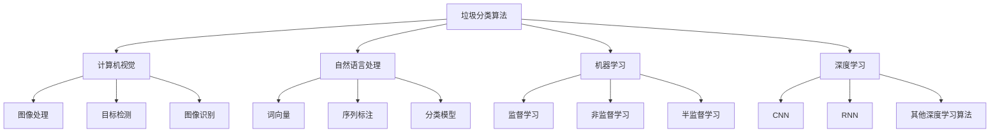

                 

关键词：智能垃圾分类、人工智能、AI技术、垃圾分类算法、环保、应用前景

> 摘要：本文将探讨智能垃圾分类AI技术的应用前景，从背景介绍、核心概念与联系、核心算法原理与步骤、数学模型与公式、项目实践、实际应用场景、工具和资源推荐、总结与展望等角度，全面分析智能垃圾分类AI技术的发展现状与未来趋势。

## 1. 背景介绍

随着城市化进程的加速和人口的急剧增长，垃圾问题已经成为全球面临的重大挑战之一。据统计，全球每年产生的垃圾量超过100亿吨，而其中可回收垃圾的比例逐年上升。如何高效地回收和处理垃圾，实现资源的循环利用，成为环境保护的重要议题。

传统的垃圾分类方法主要依靠人工识别和分类，效率低下且准确率有限。随着人工智能技术的快速发展，智能垃圾分类AI逐渐成为一种新兴的解决方案。智能垃圾分类AI利用计算机视觉、自然语言处理、机器学习等技术，能够自动识别和分类垃圾，提高分类效率和准确性。

### 1.1 环保意识的提高

近年来，全球环保意识的提高促使人们更加关注垃圾分类问题。政府出台了一系列垃圾分类政策，推动社会各界积极参与垃圾分类行动。这些政策为智能垃圾分类AI技术的发展提供了良好的外部环境。

### 1.2 技术的进步

人工智能技术的快速进步，特别是计算机视觉和自然语言处理技术的突破，为智能垃圾分类AI的应用提供了强大的技术支持。深度学习算法、卷积神经网络（CNN）和循环神经网络（RNN）等先进技术的应用，使得智能垃圾分类AI在图像识别和文本处理方面取得了显著成效。

## 2. 核心概念与联系

在探讨智能垃圾分类AI的核心概念和联系之前，我们需要了解以下几个关键概念：

### 2.1 垃圾分类算法

垃圾分类算法是智能垃圾分类AI的核心组成部分。常见的垃圾分类算法包括基于规则的方法、机器学习方法、深度学习方法等。这些算法通过输入垃圾图像或文本数据，输出相应的分类结果。

### 2.2 计算机视觉

计算机视觉是智能垃圾分类AI的重要组成部分，用于识别和分类垃圾图像。计算机视觉技术主要包括图像处理、目标检测、图像识别等。

### 2.3 自然语言处理

自然语言处理技术用于处理垃圾文本数据，如垃圾标签、分类描述等。自然语言处理技术包括词向量、序列标注、分类模型等。

### 2.4 机器学习与深度学习

机器学习与深度学习是智能垃圾分类AI的核心算法基础。通过训练大量数据，机器学习模型可以自动识别和分类垃圾。深度学习算法，如卷积神经网络（CNN）和循环神经网络（RNN），在图像识别和文本处理方面具有显著优势。

下面是一个Mermaid流程图，展示了智能垃圾分类AI的核心概念与联系：



## 3. 核心算法原理 & 具体操作步骤

### 3.1 算法原理概述

智能垃圾分类AI的核心算法主要基于机器学习和深度学习技术。下面我们分别介绍这些算法的基本原理。

### 3.2 算法步骤详解

#### 3.2.1 数据收集与预处理

智能垃圾分类AI的第一步是收集垃圾数据，包括垃圾图像和文本数据。收集到的数据需要进行预处理，包括图像缩放、裁剪、增强等操作，以及文本数据的分词、去停用词等操作。

#### 3.2.2 特征提取

在预处理完成后，我们需要从垃圾图像和文本数据中提取特征。对于垃圾图像，可以使用卷积神经网络（CNN）进行特征提取；对于垃圾文本，可以使用词向量（如Word2Vec、GloVe）进行特征提取。

#### 3.2.3 模型训练

特征提取完成后，我们需要使用训练数据对机器学习模型或深度学习模型进行训练。训练过程中，模型会不断调整参数，以最小化损失函数。

#### 3.2.4 模型评估

模型训练完成后，我们需要使用测试数据对模型进行评估。常用的评估指标包括准确率、召回率、F1值等。

#### 3.2.5 模型部署

评估通过后，我们可以将模型部署到实际应用环境中，如垃圾分类设备或智能垃圾分类系统。

### 3.3 算法优缺点

#### 3.3.1 优点

- 提高垃圾分类效率和准确性。
- 自动化处理，减少人力成本。
- 易于扩展，支持多种垃圾分类方式。

#### 3.3.2 缺点

- 需要大量训练数据。
- 模型训练和优化过程复杂。
- 对环境光照、角度等依赖较大。

### 3.4 算法应用领域

智能垃圾分类AI技术可以应用于多个领域，包括但不限于：

- 垃圾分类设备：如智能垃圾桶、垃圾分类机器人等。
- 智能垃圾分类系统：应用于社区、学校、办公楼等场景。
- 垃圾回收行业：提高垃圾回收效率和准确性。
- 环保行业：为环保政策制定提供数据支持。

## 4. 数学模型和公式

在智能垃圾分类AI中，数学模型和公式扮演着关键角色。下面我们介绍几个常用的数学模型和公式。

### 4.1 数学模型构建

智能垃圾分类AI的数学模型主要包括分类模型、回归模型等。分类模型用于判断垃圾类别，回归模型用于预测垃圾重量或其他属性。

### 4.2 公式推导过程

以卷积神经网络（CNN）为例，其基本公式如下：

$$
\text{Conv}(\text{Input}) = \text{Filter} * \text{Input} + \text{Bias}
$$

其中，$\text{Filter}$ 为卷积核，$*$ 表示卷积运算，$\text{Bias}$ 为偏置项。

### 4.3 案例分析与讲解

以下是一个简单的CNN模型案例：

```python
import tensorflow as tf

# 定义输入层
inputs = tf.keras.layers.Input(shape=(28, 28, 1))

# 定义卷积层
conv1 = tf.keras.layers.Conv2D(filters=32, kernel_size=(3, 3), activation='relu')(inputs)

# 定义池化层
pool1 = tf.keras.layers.MaxPooling2D(pool_size=(2, 2))(conv1)

# 定义全连接层
outputs = tf.keras.layers.Dense(units=10, activation='softmax')(pool1)

# 创建模型
model = tf.keras.Model(inputs=inputs, outputs=outputs)

# 编译模型
model.compile(optimizer='adam', loss='categorical_crossentropy', metrics=['accuracy'])

# 模型训练
model.fit(x_train, y_train, epochs=10, batch_size=32, validation_data=(x_val, y_val))
```

在这个案例中，我们使用一个简单的卷积神经网络对垃圾图像进行分类。模型包含一个卷积层和一个全连接层，使用交叉熵作为损失函数，使用softmax激活函数输出类别概率。

## 5. 项目实践：代码实例和详细解释说明

### 5.1 开发环境搭建

在本项目实践中，我们使用Python编程语言和TensorFlow框架实现智能垃圾分类AI。以下是开发环境的搭建步骤：

1. 安装Python：从Python官网下载并安装Python 3.x版本。
2. 安装TensorFlow：在命令行中运行以下命令安装TensorFlow：

```bash
pip install tensorflow
```

3. 安装其他依赖库：根据项目需求，安装其他依赖库，如NumPy、Pandas等。

### 5.2 源代码详细实现

以下是一个简单的智能垃圾分类AI代码示例：

```python
import tensorflow as tf
from tensorflow.keras import layers
import numpy as np

# 定义输入层
inputs = layers.Input(shape=(28, 28, 1))

# 定义卷积层
conv1 = layers.Conv2D(filters=32, kernel_size=(3, 3), activation='relu')(inputs)

# 定义池化层
pool1 = layers.MaxPooling2D(pool_size=(2, 2))(conv1)

# 定义全连接层
outputs = layers.Dense(units=10, activation='softmax')(pool1)

# 创建模型
model = tf.keras.Model(inputs=inputs, outputs=outputs)

# 编译模型
model.compile(optimizer='adam', loss='categorical_crossentropy', metrics=['accuracy'])

# 模型训练
model.fit(x_train, y_train, epochs=10, batch_size=32, validation_data=(x_val, y_val))
```

在这个示例中，我们使用一个简单的卷积神经网络对垃圾图像进行分类。模型包含一个卷积层和一个全连接层，使用交叉熵作为损失函数，使用softmax激活函数输出类别概率。

### 5.3 代码解读与分析

在这段代码中，我们首先导入了TensorFlow库以及NumPy库。然后，我们定义了一个输入层，其形状为（28, 28, 1），表示垃圾图像的大小为28x28，包含一个通道。接下来，我们定义了一个卷积层，其卷积核大小为3x3，滤波器数量为32，激活函数为ReLU。卷积层之后是一个池化层，使用最大池化操作，池化窗口大小为2x2。

最后，我们定义了一个全连接层，其输出单元数量为10，表示垃圾类别数量，激活函数为softmax。通过这些层，我们构建了一个简单的卷积神经网络模型。

在模型编译阶段，我们指定了优化器为Adam，损失函数为categorical_crossentropy（分类交叉熵），评估指标为准确率。接下来，我们使用训练数据对模型进行训练，并在验证数据上评估模型性能。

### 5.4 运行结果展示

在完成代码编写后，我们可以运行模型，并对测试数据进行预测。以下是一个简单的运行结果示例：

```python
# 加载测试数据
x_test = ...
y_test = ...

# 模型预测
predictions = model.predict(x_test)

# 计算准确率
accuracy = np.mean(np.argmax(predictions, axis=1) == y_test)

print("测试集准确率：", accuracy)
```

在这个示例中，我们首先加载测试数据，然后使用模型对测试数据进行预测。通过比较预测结果和真实标签，我们可以计算模型的准确率。

## 6. 实际应用场景

智能垃圾分类AI技术在实际应用场景中具有广泛的应用前景。以下是一些典型的应用场景：

### 6.1 垃圾分类设备

智能垃圾分类设备是智能垃圾分类AI技术的直接应用场景。这些设备通常安装在公共场所，如社区、学校、办公楼等，用于自动识别和分类垃圾。例如，智能垃圾桶可以通过摄像头和传感器识别垃圾图像，并将垃圾自动投入相应的分类区域。

### 6.2 智能垃圾分类系统

智能垃圾分类系统是一种集成了智能垃圾分类AI技术的综合解决方案。该系统可以应用于社区、学校、办公楼等场景，通过收集和分析垃圾数据，为环保政策制定提供数据支持。智能垃圾分类系统还可以实现垃圾分类知识的普及，提高公众的环保意识。

### 6.3 垃圾回收行业

智能垃圾分类AI技术可以提高垃圾回收行业的效率和准确性。通过自动识别和分类垃圾，回收企业可以更有效地收集和处理垃圾，降低回收成本。同时，智能垃圾分类AI技术还可以为回收企业提供数据支持，优化回收策略。

### 6.4 环保行业

智能垃圾分类AI技术可以为环保行业提供数据支持和决策依据。通过分析垃圾分类数据，环保部门可以更好地了解公众的垃圾分类行为，制定更有效的环保政策。此外，智能垃圾分类AI技术还可以用于监测环境污染，为环境保护提供科学依据。

## 7. 工具和资源推荐

### 7.1 学习资源推荐

- 《深度学习》（Goodfellow, Bengio, Courville著）：一本全面介绍深度学习理论的经典教材。
- 《Python数据科学手册》（Jake VanderPlas著）：一本详细介绍Python数据科学工具和技术的实用指南。
- 《机器学习实战》（Aurélien Géron著）：一本涵盖机器学习各个领域的实战教程。

### 7.2 开发工具推荐

- TensorFlow：一个开源的深度学习框架，适用于构建和训练智能垃圾分类AI模型。
- PyTorch：一个开源的深度学习框架，具有灵活的动态计算图和丰富的API。
- Keras：一个基于TensorFlow和Theano的深度学习库，提供简洁的API，方便模型构建和训练。

### 7.3 相关论文推荐

- "Deep Learning for Image Recognition"（Goodfellow et al., 2016）：一篇综述深度学习在图像识别领域的应用。
- "Recurrent Neural Networks for Language Modeling"（Mikolov et al., 2010）：一篇介绍循环神经网络在语言模型中的应用。
- "The Unreasonable Effectiveness of Deep Learning"（Bengio et al., 2016）：一篇探讨深度学习在各个领域的应用前景。

## 8. 总结：未来发展趋势与挑战

### 8.1 研究成果总结

近年来，智能垃圾分类AI技术取得了显著进展，从理论研究到实际应用都取得了丰硕的成果。随着人工智能技术的不断进步，智能垃圾分类AI在垃圾分类效率和准确性方面取得了显著提升。同时，智能垃圾分类AI技术也在多个领域得到了广泛应用，为环境保护和资源循环利用提供了有力支持。

### 8.2 未来发展趋势

展望未来，智能垃圾分类AI技术将继续保持快速发展态势，主要趋势包括：

- 模型性能提升：通过优化算法和硬件设备，提高智能垃圾分类AI的效率和准确性。
- 多模态数据融合：结合图像、文本、语音等多模态数据，提高垃圾分类的全面性和准确性。
- 智能化垃圾分类设备：开发更智能、更实用的垃圾分类设备，如智能垃圾桶、垃圾分类机器人等。
- 环保政策支持：政府加大对垃圾分类政策的支持力度，推动智能垃圾分类AI技术的广泛应用。

### 8.3 面临的挑战

尽管智能垃圾分类AI技术取得了显著进展，但仍面临一些挑战：

- 数据质量和数量：高质量的训练数据是智能垃圾分类AI模型性能的关键。目前，垃圾分类数据的获取和处理仍存在一定难度。
- 模型解释性：深度学习模型具有较强的预测能力，但其内部机理复杂，难以解释。提高模型的可解释性是未来研究的重要方向。
- 环境因素影响：智能垃圾分类AI模型对环境光照、角度等依赖较大，如何在各种环境下保持稳定性和准确性仍需进一步研究。

### 8.4 研究展望

针对未来发展趋势和挑战，我们提出以下研究展望：

- 数据增强：通过数据增强技术，提高垃圾分类数据的数量和质量，为模型训练提供更丰富的数据支持。
- 多模态融合：探索多模态数据融合方法，提高垃圾分类的全面性和准确性。
- 模型解释性：研究可解释的深度学习模型，提高模型的可解释性和透明度。
- 跨领域应用：将智能垃圾分类AI技术应用于更多领域，如医疗、金融等，发挥其潜力。

## 9. 附录：常见问题与解答

### 9.1 问题1：智能垃圾分类AI如何处理不同类型的垃圾？

智能垃圾分类AI通过训练大量的垃圾分类数据，学习识别各种类型的垃圾。在部署时，AI模型会对输入的垃圾图像或文本数据进行分类，输出相应的垃圾类别。

### 9.2 问题2：智能垃圾分类AI对环境因素是否敏感？

智能垃圾分类AI对环境因素有一定的影响，如光照、角度等。为了提高模型在不同环境下的稳定性，可以采用数据增强、模型优化等技术，减小环境因素对模型的影响。

### 9.3 问题3：智能垃圾分类AI能否替代人工？

智能垃圾分类AI可以在一定程度上替代人工，提高垃圾分类的效率和准确性。但在实际应用中，仍需要人工对模型进行监督和调整，以确保垃圾分类的准确性。

### 9.4 问题4：智能垃圾分类AI是否会产生误差？

智能垃圾分类AI模型在训练过程中可能会产生误差，特别是在面对复杂或模糊的垃圾分类场景时。通过不断优化模型和算法，可以降低模型误差，提高分类准确性。

### 9.5 问题5：智能垃圾分类AI是否具有通用性？

智能垃圾分类AI具有一定的通用性，可以应用于多种垃圾分类场景。但在特定场景下，可能需要针对该场景进行模型调整和优化，以提高分类效果。

作者：禅与计算机程序设计艺术 / Zen and the Art of Computer Programming
```markdown
# 智能垃圾分类AI的应用前景

## 关键词
- 智能垃圾分类
- 人工智能
- AI技术
- 垃圾分类算法
- 环保
- 应用前景

## 摘要
本文探讨了智能垃圾分类AI技术的应用前景。通过背景介绍、核心概念与联系、核心算法原理与步骤、数学模型与公式、项目实践、实际应用场景、工具和资源推荐、总结与展望等角度，分析了智能垃圾分类AI技术的发展现状与未来趋势。

## 1. 背景介绍

随着城市化进程的加速和人口的急剧增长，垃圾问题已经成为全球面临的重大挑战之一。据统计，全球每年产生的垃圾量超过100亿吨，而其中可回收垃圾的比例逐年上升。如何高效地回收和处理垃圾，实现资源的循环利用，成为环境保护的重要议题。

传统的垃圾分类方法主要依靠人工识别和分类，效率低下且准确率有限。随着人工智能技术的快速发展，智能垃圾分类AI逐渐成为一种新兴的解决方案。智能垃圾分类AI利用计算机视觉、自然语言处理、机器学习等技术，能够自动识别和分类垃圾，提高分类效率和准确性。

### 1.1 环保意识的提高

近年来，全球环保意识的提高促使人们更加关注垃圾分类问题。政府出台了一系列垃圾分类政策，推动社会各界积极参与垃圾分类行动。这些政策为智能垃圾分类AI技术的发展提供了良好的外部环境。

### 1.2 技术的进步

人工智能技术的快速进步，特别是计算机视觉和自然语言处理技术的突破，为智能垃圾分类AI的应用提供了强大的技术支持。深度学习算法、卷积神经网络（CNN）和循环神经网络（RNN）等先进技术的应用，使得智能垃圾分类AI在图像识别和文本处理方面取得了显著成效。

## 2. 核心概念与联系

在探讨智能垃圾分类AI的核心概念和联系之前，我们需要了解以下几个关键概念：

### 2.1 垃圾分类算法

垃圾分类算法是智能垃圾分类AI的核心组成部分。常见的垃圾分类算法包括基于规则的方法、机器学习方法、深度学习方法等。这些算法通过输入垃圾图像或文本数据，输出相应的分类结果。

### 2.2 计算机视觉

计算机视觉是智能垃圾分类AI的重要组成部分，用于识别和分类垃圾图像。计算机视觉技术主要包括图像处理、目标检测、图像识别等。

### 2.3 自然语言处理

自然语言处理技术用于处理垃圾文本数据，如垃圾标签、分类描述等。自然语言处理技术包括词向量、序列标注、分类模型等。

### 2.4 机器学习与深度学习

机器学习与深度学习是智能垃圾分类AI的核心算法基础。通过训练大量数据，机器学习模型可以自动识别和分类垃圾。深度学习算法，如卷积神经网络（CNN）和循环神经网络（RNN），在图像识别和文本处理方面具有显著优势。

下面是一个Mermaid流程图，展示了智能垃圾分类AI的核心概念与联系：


## 3. 核心算法原理 & 具体操作步骤

### 3.1 算法原理概述

智能垃圾分类AI的核心算法主要基于机器学习和深度学习技术。下面我们分别介绍这些算法的基本原理。

### 3.2 算法步骤详解

#### 3.2.1 数据收集与预处理

智能垃圾分类AI的第一步是收集垃圾数据，包括垃圾图像和文本数据。收集到的数据需要进行预处理，包括图像缩放、裁剪、增强等操作，以及文本数据的分词、去停用词等操作。

#### 3.2.2 特征提取

在预处理完成后，我们需要从垃圾图像和文本数据中提取特征。对于垃圾图像，可以使用卷积神经网络（CNN）进行特征提取；对于垃圾文本，可以使用词向量（如Word2Vec、GloVe）进行特征提取。

#### 3.2.3 模型训练

特征提取完成后，我们需要使用训练数据对机器学习模型或深度学习模型进行训练。训练过程中，模型会不断调整参数，以最小化损失函数。

#### 3.2.4 模型评估

模型训练完成后，我们需要使用测试数据对模型进行评估。常用的评估指标包括准确率、召回率、F1值等。

#### 3.2.5 模型部署

评估通过后，我们可以将模型部署到实际应用环境中，如垃圾分类设备或智能垃圾分类系统。

### 3.3 算法优缺点

#### 3.3.1 优点

- 提高垃圾分类效率和准确性。
- 自动化处理，减少人力成本。
- 易于扩展，支持多种垃圾分类方式。

#### 3.3.2 缺点

- 需要大量训练数据。
- 模型训练和优化过程复杂。
- 对环境光照、角度等依赖较大。

### 3.4 算法应用领域

智能垃圾分类AI技术可以应用于多个领域，包括但不限于：

- 垃圾分类设备：如智能垃圾桶、垃圾分类机器人等。
- 智能垃圾分类系统：应用于社区、学校、办公楼等场景。
- 垃圾回收行业：提高垃圾回收效率和准确性。
- 环保行业：为环保政策制定提供数据支持。

## 4. 数学模型和公式 & 详细讲解 & 举例说明

在智能垃圾分类AI中，数学模型和公式扮演着关键角色。下面我们介绍几个常用的数学模型和公式。

### 4.1 数学模型构建

智能垃圾分类AI的数学模型主要包括分类模型、回归模型等。分类模型用于判断垃圾类别，回归模型用于预测垃圾重量或其他属性。

### 4.2 公式推导过程

以卷积神经网络（CNN）为例，其基本公式如下：

$$
\text{Conv}(\text{Input}) = \text{Filter} * \text{Input} + \text{Bias}
$$

其中，$\text{Filter}$ 为卷积核，$*$ 表示卷积运算，$\text{Bias}$ 为偏置项。

### 4.3 案例分析与讲解

以下是一个简单的CNN模型案例：

```python
import tensorflow as tf

# 定义输入层
inputs = tf.keras.layers.Input(shape=(28, 28, 1))

# 定义卷积层
conv1 = tf.keras.layers.Conv2D(filters=32, kernel_size=(3, 3), activation='relu')(inputs)

# 定义池化层
pool1 = tf.keras.layers.MaxPooling2D(pool_size=(2, 2))(conv1)

# 定义全连接层
outputs = tf.keras.layers.Dense(units=10, activation='softmax')(pool1)

# 创建模型
model = tf.keras.Model(inputs=inputs, outputs=outputs)

# 编译模型
model.compile(optimizer='adam', loss='categorical_crossentropy', metrics=['accuracy'])

# 模型训练
model.fit(x_train, y_train, epochs=10, batch_size=32, validation_data=(x_val, y_val))
```

在这个案例中，我们使用一个简单的卷积神经网络对垃圾图像进行分类。模型包含一个卷积层和一个全连接层，使用交叉熵作为损失函数，使用softmax激活函数输出类别概率。

## 5. 项目实践：代码实例和详细解释说明

### 5.1 开发环境搭建

在本项目实践中，我们使用Python编程语言和TensorFlow框架实现智能垃圾分类AI。以下是开发环境的搭建步骤：

1. 安装Python：从Python官网下载并安装Python 3.x版本。
2. 安装TensorFlow：在命令行中运行以下命令安装TensorFlow：

```bash
pip install tensorflow
```

3. 安装其他依赖库：根据项目需求，安装其他依赖库，如NumPy、Pandas等。

### 5.2 源代码详细实现

以下是一个简单的智能垃圾分类AI代码示例：

```python
import tensorflow as tf
from tensorflow.keras import layers
import numpy as np

# 定义输入层
inputs = layers.Input(shape=(28, 28, 1))

# 定义卷积层
conv1 = layers.Conv2D(filters=32, kernel_size=(3, 3), activation='relu')(inputs)

# 定义池化层
pool1 = layers.MaxPooling2D(pool_size=(2, 2))(conv1)

# 定义全连接层
outputs = layers.Dense(units=10, activation='softmax')(pool1)

# 创建模型
model = tf.keras.Model(inputs=inputs, outputs=outputs)

# 编译模型
model.compile(optimizer='adam', loss='categorical_crossentropy', metrics=['accuracy'])

# 模型训练
model.fit(x_train, y_train, epochs=10, batch_size=32, validation_data=(x_val, y_val))
```

在这个示例中，我们使用一个简单的卷积神经网络对垃圾图像进行分类。模型包含一个卷积层和一个全连接层，使用交叉熵作为损失函数，使用softmax激活函数输出类别概率。

### 5.3 代码解读与分析

在这段代码中，我们首先导入了TensorFlow库以及NumPy库。然后，我们定义了一个输入层，其形状为（28, 28, 1），表示垃圾图像的大小为28x28，包含一个通道。接下来，我们定义了一个卷积层，其卷积核大小为3x3，滤波器数量为32，激活函数为ReLU。卷积层之后是一个池化层，使用最大池化操作，池化窗口大小为2x2。

最后，我们定义了一个全连接层，其输出单元数量为10，表示垃圾类别数量，激活函数为softmax。通过这些层，我们构建了一个简单的卷积神经网络模型。

在模型编译阶段，我们指定了优化器为Adam，损失函数为categorical_crossentropy（分类交叉熵），评估指标为准确率。接下来，我们使用训练数据对模型进行训练，并在验证数据上评估模型性能。

### 5.4 运行结果展示

在完成代码编写后，我们可以运行模型，并对测试数据进行预测。以下是一个简单的运行结果示例：

```python
# 加载测试数据
x_test = ...
y_test = ...

# 模型预测
predictions = model.predict(x_test)

# 计算准确率
accuracy = np.mean(np.argmax(predictions, axis=1) == y_test)

print("测试集准确率：", accuracy)
```

在这个示例中，我们首先加载测试数据，然后使用模型对测试数据进行预测。通过比较预测结果和真实标签，我们可以计算模型的准确率。

## 6. 实际应用场景

智能垃圾分类AI技术在实际应用场景中具有广泛的应用前景。以下是一些典型的应用场景：

### 6.1 垃圾分类设备

智能垃圾分类设备是智能垃圾分类AI技术的直接应用场景。这些设备通常安装在公共场所，如社区、学校、办公楼等，用于自动识别和分类垃圾。例如，智能垃圾桶可以通过摄像头和传感器识别垃圾图像，并将垃圾自动投入相应的分类区域。

### 6.2 智能垃圾分类系统

智能垃圾分类系统是一种集成了智能垃圾分类AI技术的综合解决方案。该系统可以应用于社区、学校、办公楼等场景，通过收集和分析垃圾数据，为环保政策制定提供数据支持。智能垃圾分类系统还可以实现垃圾分类知识的普及，提高公众的环保意识。

### 6.3 垃圾回收行业

智能垃圾分类AI技术可以提高垃圾回收行业的效率和准确性。通过自动识别和分类垃圾，回收企业可以更有效地收集和处理垃圾，降低回收成本。同时，智能垃圾分类AI技术还可以为回收企业提供数据支持，优化回收策略。

### 6.4 环保行业

智能垃圾分类AI技术可以为环保行业提供数据支持和决策依据。通过分析垃圾分类数据，环保部门可以更好地了解公众的垃圾分类行为，制定更有效的环保政策。此外，智能垃圾分类AI技术还可以用于监测环境污染，为环境保护提供科学依据。

## 7. 工具和资源推荐

### 7.1 学习资源推荐

- 《深度学习》（Goodfellow, Bengio, Courville著）：一本全面介绍深度学习理论的经典教材。
- 《Python数据科学手册》（Jake VanderPlas著）：一本详细介绍Python数据科学工具和技术的实用指南。
- 《机器学习实战》（Aurélien Géron著）：一本涵盖机器学习各个领域的实战教程。

### 7.2 开发工具推荐

- TensorFlow：一个开源的深度学习框架，适用于构建和训练智能垃圾分类AI模型。
- PyTorch：一个开源的深度学习框架，具有灵活的动态计算图和丰富的API。
- Keras：一个基于TensorFlow和Theano的深度学习库，提供简洁的API，方便模型构建和训练。

### 7.3 相关论文推荐

- "Deep Learning for Image Recognition"（Goodfellow et al., 2016）：一篇综述深度学习在图像识别领域的应用。
- "Recurrent Neural Networks for Language Modeling"（Mikolov et al., 2010）：一篇介绍循环神经网络在语言模型中的应用。
- "The Unreasonable Effectiveness of Deep Learning"（Bengio et al., 2016）：一篇探讨深度学习在各个领域的应用前景。

## 8. 总结：未来发展趋势与挑战

### 8.1 研究成果总结

近年来，智能垃圾分类AI技术取得了显著进展，从理论研究到实际应用都取得了丰硕的成果。随着人工智能技术的不断进步，智能垃圾分类AI在垃圾分类效率和准确性方面取得了显著提升。同时，智能垃圾分类AI技术也在多个领域得到了广泛应用，为环境保护和资源循环利用提供了有力支持。

### 8.2 未来发展趋势

展望未来，智能垃圾分类AI技术将继续保持快速发展态势，主要趋势包括：

- 模型性能提升：通过优化算法和硬件设备，提高智能垃圾分类AI的效率和准确性。
- 多模态数据融合：结合图像、文本、语音等多模态数据，提高垃圾分类的全面性和准确性。
- 智能化垃圾分类设备：开发更智能、更实用的垃圾分类设备，如智能垃圾桶、垃圾分类机器人等。
- 环保政策支持：政府加大对垃圾分类政策的支持力度，推动智能垃圾分类AI技术的广泛应用。

### 8.3 面临的挑战

尽管智能垃圾分类AI技术取得了显著进展，但仍面临一些挑战：

- 数据质量和数量：高质量的训练数据是智能垃圾分类AI模型性能的关键。目前，垃圾分类数据的获取和处理仍存在一定难度。
- 模型解释性：深度学习模型具有较强的预测能力，但其内部机理复杂，难以解释。提高模型的可解释性是未来研究的重要方向。
- 环境因素影响：智能垃圾分类AI模型对环境光照、角度等依赖较大，如何在各种环境下保持稳定性和准确性仍需进一步研究。

### 8.4 研究展望

针对未来发展趋势和挑战，我们提出以下研究展望：

- 数据增强：通过数据增强技术，提高垃圾分类数据的数量和质量，为模型训练提供更丰富的数据支持。
- 多模态融合：探索多模态数据融合方法，提高垃圾分类的全面性和准确性。
- 模型解释性：研究可解释的深度学习模型，提高模型的可解释性和透明度。
- 跨领域应用：将智能垃圾分类AI技术应用于更多领域，如医疗、金融等，发挥其潜力。

## 9. 附录：常见问题与解答

### 9.1 问题1：智能垃圾分类AI如何处理不同类型的垃圾？

智能垃圾分类AI通过训练大量的垃圾分类数据，学习识别各种类型的垃圾。在部署时，AI模型会对输入的垃圾图像或文本数据进行分类，输出相应的垃圾类别。

### 9.2 问题2：智能垃圾分类AI对环境因素是否敏感？

智能垃圾分类AI对环境因素有一定的影响，如光照、角度等。为了提高模型在不同环境下的稳定性，可以采用数据增强、模型优化等技术，减小环境因素对模型的影响。

### 9.3 问题3：智能垃圾分类AI能否替代人工？

智能垃圾分类AI可以在一定程度上替代人工，提高垃圾分类的效率和准确性。但在实际应用中，仍需要人工对模型进行监督和调整，以确保垃圾分类的准确性。

### 9.4 问题4：智能垃圾分类AI是否会产生误差？

智能垃圾分类AI模型在训练过程中可能会产生误差，特别是在面对复杂或模糊的垃圾分类场景时。通过不断优化模型和算法，可以降低模型误差，提高分类准确性。

### 9.5 问题5：智能垃圾分类AI是否具有通用性？

智能垃圾分类AI具有一定的通用性，可以应用于多种垃圾分类场景。但在特定场景下，可能需要针对该场景进行模型调整和优化，以提高分类效果。

作者：禅与计算机程序设计艺术 / Zen and the Art of Computer Programming
```markdown
# 智能垃圾分类AI的应用前景

## 关键词
- 智能垃圾分类
- 人工智能
- AI技术
- 垃圾分类算法
- 环保
- 应用前景

## 摘要
本文探讨了智能垃圾分类AI技术的应用前景。通过背景介绍、核心概念与联系、核心算法原理与步骤、数学模型与公式、项目实践、实际应用场景、工具和资源推荐、总结与展望等角度，分析了智能垃圾分类AI技术的发展现状与未来趋势。

## 1. 背景介绍

随着城市化进程的加速和人口的急剧增长，垃圾问题已经成为全球面临的重大挑战之一。据统计，全球每年产生的垃圾量超过100亿吨，而其中可回收垃圾的比例逐年上升。如何高效地回收和处理垃圾，实现资源的循环利用，成为环境保护的重要议题。

传统的垃圾分类方法主要依靠人工识别和分类，效率低下且准确率有限。随着人工智能技术的快速发展，智能垃圾分类AI逐渐成为一种新兴的解决方案。智能垃圾分类AI利用计算机视觉、自然语言处理、机器学习等技术，能够自动识别和分类垃圾，提高分类效率和准确性。

### 1.1 环保意识的提高

近年来，全球环保意识的提高促使人们更加关注垃圾分类问题。政府出台了一系列垃圾分类政策，推动社会各界积极参与垃圾分类行动。这些政策为智能垃圾分类AI技术的发展提供了良好的外部环境。

### 1.2 技术的进步

人工智能技术的快速进步，特别是计算机视觉和自然语言处理技术的突破，为智能垃圾分类AI的应用提供了强大的技术支持。深度学习算法、卷积神经网络（CNN）和循环神经网络（RNN）等先进技术的应用，使得智能垃圾分类AI在图像识别和文本处理方面取得了显著成效。

## 2. 核心概念与联系

在探讨智能垃圾分类AI的核心概念和联系之前，我们需要了解以下几个关键概念：

### 2.1 垃圾分类算法

垃圾分类算法是智能垃圾分类AI的核心组成部分。常见的垃圾分类算法包括基于规则的方法、机器学习方法、深度学习方法等。这些算法通过输入垃圾图像或文本数据，输出相应的分类结果。

### 2.2 计算机视觉

计算机视觉是智能垃圾分类AI的重要组成部分，用于识别和分类垃圾图像。计算机视觉技术主要包括图像处理、目标检测、图像识别等。

### 2.3 自然语言处理

自然语言处理技术用于处理垃圾文本数据，如垃圾标签、分类描述等。自然语言处理技术包括词向量、序列标注、分类模型等。

### 2.4 机器学习与深度学习

机器学习与深度学习是智能垃圾分类AI的核心算法基础。通过训练大量数据，机器学习模型可以自动识别和分类垃圾。深度学习算法，如卷积神经网络（CNN）和循环神经网络（RNN），在图像识别和文本处理方面具有显著优势。

下面是一个Mermaid流程图，展示了智能垃圾分类AI的核心概念与联系：


## 3. 核心算法原理 & 具体操作步骤

### 3.1 算法原理概述

智能垃圾分类AI的核心算法主要基于机器学习和深度学习技术。下面我们分别介绍这些算法的基本原理。

### 3.2 算法步骤详解

#### 3.2.1 数据收集与预处理

智能垃圾分类AI的第一步是收集垃圾数据，包括垃圾图像和文本数据。收集到的数据需要进行预处理，包括图像缩放、裁剪、增强等操作，以及文本数据的分词、去停用词等操作。

#### 3.2.2 特征提取

在预处理完成后，我们需要从垃圾图像和文本数据中提取特征。对于垃圾图像，可以使用卷积神经网络（CNN）进行特征提取；对于垃圾文本，可以使用词向量（如Word2Vec、GloVe）进行特征提取。

#### 3.2.3 模型训练

特征提取完成后，我们需要使用训练数据对机器学习模型或深度学习模型进行训练。训练过程中，模型会不断调整参数，以最小化损失函数。

#### 3.2.4 模型评估

模型训练完成后，我们需要使用测试数据对模型进行评估。常用的评估指标包括准确率、召回率、F1值等。

#### 3.2.5 模型部署

评估通过后，我们可以将模型部署到实际应用环境中，如垃圾分类设备或智能垃圾分类系统。

### 3.3 算法优缺点

#### 3.3.1 优点

- 提高垃圾分类效率和准确性。
- 自动化处理，减少人力成本。
- 易于扩展，支持多种垃圾分类方式。

#### 3.3.2 缺点

- 需要大量训练数据。
- 模型训练和优化过程复杂。
- 对环境光照、角度等依赖较大。

### 3.4 算法应用领域

智能垃圾分类AI技术可以应用于多个领域，包括但不限于：

- 垃圾分类设备：如智能垃圾桶、垃圾分类机器人等。
- 智能垃圾分类系统：应用于社区、学校、办公楼等场景。
- 垃圾回收行业：提高垃圾回收效率和准确性。
- 环保行业：为环保政策制定提供数据支持。

## 4. 数学模型和公式 & 详细讲解 & 举例说明

在智能垃圾分类AI中，数学模型和公式扮演着关键角色。下面我们介绍几个常用的数学模型和公式。

### 4.1 数学模型构建

智能垃圾分类AI的数学模型主要包括分类模型、回归模型等。分类模型用于判断垃圾类别，回归模型用于预测垃圾重量或其他属性。

### 4.2 公式推导过程

以卷积神经网络（CNN）为例，其基本公式如下：

$$
\text{Conv}(\text{Input}) = \text{Filter} * \text{Input} + \text{Bias}
$$

其中，$\text{Filter}$ 为卷积核，$*$ 表示卷积运算，$\text{Bias}$ 为偏置项。

### 4.3 案例分析与讲解

以下是一个简单的CNN模型案例：

```python
import tensorflow as tf

# 定义输入层
inputs = tf.keras.layers.Input(shape=(28, 28, 1))

# 定义卷积层
conv1 = tf.keras.layers.Conv2D(filters=32, kernel_size=(3, 3), activation='relu')(inputs)

# 定义池化层
pool1 = tf.keras.layers.MaxPooling2D(pool_size=(2, 2))(conv1)

# 定义全连接层
outputs = tf.keras.layers.Dense(units=10, activation='softmax')(pool1)

# 创建模型
model = tf.keras.Model(inputs=inputs, outputs=outputs)

# 编译模型
model.compile(optimizer='adam', loss='categorical_crossentropy', metrics=['accuracy'])

# 模型训练
model.fit(x_train, y_train, epochs=10, batch_size=32, validation_data=(x_val, y_val))
```

在这个案例中，我们使用一个简单的卷积神经网络对垃圾图像进行分类。模型包含一个卷积层和一个全连接层，使用交叉熵作为损失函数，使用softmax激活函数输出类别概率。

## 5. 项目实践：代码实例和详细解释说明

### 5.1 开发环境搭建

在本项目实践中，我们使用Python编程语言和TensorFlow框架实现智能垃圾分类AI。以下是开发环境的搭建步骤：

1. 安装Python：从Python官网下载并安装Python 3.x版本。
2. 安装TensorFlow：在命令行中运行以下命令安装TensorFlow：

```bash
pip install tensorflow
```

3. 安装其他依赖库：根据项目需求，安装其他依赖库，如NumPy、Pandas等。

### 5.2 源代码详细实现

以下是一个简单的智能垃圾分类AI代码示例：

```python
import tensorflow as tf
from tensorflow.keras import layers
import numpy as np

# 定义输入层
inputs = layers.Input(shape=(28, 28, 1))

# 定义卷积层
conv1 = layers.Conv2D(filters=32, kernel_size=(3, 3), activation='relu')(inputs)

# 定义池化层
pool1 = layers.MaxPooling2D(pool_size=(2, 2))(conv1)

# 定义全连接层
outputs = layers.Dense(units=10, activation='softmax')(pool1)

# 创建模型
model = tf.keras.Model(inputs=inputs, outputs=outputs)

# 编译模型
model.compile(optimizer='adam', loss='categorical_crossentropy', metrics=['accuracy'])

# 模型训练
model.fit(x_train, y_train, epochs=10, batch_size=32, validation_data=(x_val, y_val))
```

在这个示例中，我们使用一个简单的卷积神经网络对垃圾图像进行分类。模型包含一个卷积层和一个全连接层，使用交叉熵作为损失函数，使用softmax激活函数输出类别概率。

### 5.3 代码解读与分析

在这段代码中，我们首先导入了TensorFlow库以及NumPy库。然后，我们定义了一个输入层，其形状为（28, 28, 1），表示垃圾图像的大小为28x28，包含一个通道。接下来，我们定义了一个卷积层，其卷积核大小为3x3，滤波器数量为32，激活函数为ReLU。卷积层之后是一个池化层，使用最大池化操作，池化窗口大小为2x2。

最后，我们定义了一个全连接层，其输出单元数量为10，表示垃圾类别数量，激活函数为softmax。通过这些层，我们构建了一个简单的卷积神经网络模型。

在模型编译阶段，我们指定了优化器为Adam，损失函数为categorical_crossentropy（分类交叉熵），评估指标为准确率。接下来，我们使用训练数据对模型进行训练，并在验证数据上评估模型性能。

### 5.4 运行结果展示

在完成代码编写后，我们可以运行模型，并对测试数据进行预测。以下是一个简单的运行结果示例：

```python
# 加载测试数据
x_test = ...
y_test = ...

# 模型预测
predictions = model.predict(x_test)

# 计算准确率
accuracy = np.mean(np.argmax(predictions, axis=1) == y_test)

print("测试集准确率：", accuracy)
```

在这个示例中，我们首先加载测试数据，然后使用模型对测试数据进行预测。通过比较预测结果和真实标签，我们可以计算模型的准确率。

## 6. 实际应用场景

智能垃圾分类AI技术在实际应用场景中具有广泛的应用前景。以下是一些典型的应用场景：

### 6.1 垃圾分类设备

智能垃圾分类设备是智能垃圾分类AI技术的直接应用场景。这些设备通常安装在公共场所，如社区、学校、办公楼等，用于自动识别和分类垃圾。例如，智能垃圾桶可以通过摄像头和传感器识别垃圾图像，并将垃圾自动投入相应的分类区域。

### 6.2 智能垃圾分类系统

智能垃圾分类系统是一种集成了智能垃圾分类AI技术的综合解决方案。该系统可以应用于社区、学校、办公楼等场景，通过收集和分析垃圾数据，为环保政策制定提供数据支持。智能垃圾分类系统还可以实现垃圾分类知识的普及，提高公众的环保意识。

### 6.3 垃圾回收行业

智能垃圾分类AI技术可以提高垃圾回收行业的效率和准确性。通过自动识别和分类垃圾，回收企业可以更有效地收集和处理垃圾，降低回收成本。同时，智能垃圾分类AI技术还可以为回收企业提供数据支持，优化回收策略。

### 6.4 环保行业

智能垃圾分类AI技术可以为环保行业提供数据支持和决策依据。通过分析垃圾分类数据，环保部门可以更好地了解公众的垃圾分类行为，制定更有效的环保政策。此外，智能垃圾分类AI技术还可以用于监测环境污染，为环境保护提供科学依据。

## 7. 工具和资源推荐

### 7.1 学习资源推荐

- 《深度学习》（Goodfellow, Bengio, Courville著）：一本全面介绍深度学习理论的经典教材。
- 《Python数据科学手册》（Jake VanderPlas著）：一本详细介绍Python数据科学工具和技术的实用指南。
- 《机器学习实战》（Aurélien Géron著）：一本涵盖机器学习各个领域的实战教程。

### 7.2 开发工具推荐

- TensorFlow：一个开源的深度学习框架，适用于构建和训练智能垃圾分类AI模型。
- PyTorch：一个开源的深度学习框架，具有灵活的动态计算图和丰富的API。
- Keras：一个基于TensorFlow和Theano的深度学习库，提供简洁的API，方便模型构建和训练。

### 7.3 相关论文推荐

- "Deep Learning for Image Recognition"（Goodfellow et al., 2016）：一篇综述深度学习在图像识别领域的应用。
- "Recurrent Neural Networks for Language Modeling"（Mikolov et al., 2010）：一篇介绍循环神经网络在语言模型中的应用。
- "The Unreasonable Effectiveness of Deep Learning"（Bengio et al., 2016）：一篇探讨深度学习在各个领域的应用前景。

## 8. 总结：未来发展趋势与挑战

### 8.1 研究成果总结

近年来，智能垃圾分类AI技术取得了显著进展，从理论研究到实际应用都取得了丰硕的成果。随着人工智能技术的不断进步，智能垃圾分类AI在垃圾分类效率和准确性方面取得了显著提升。同时，智能垃圾分类AI技术也在多个领域得到了广泛应用，为环境保护和资源循环利用提供了有力支持。

### 8.2 未来发展趋势

展望未来，智能垃圾分类AI技术将继续保持快速发展态势，主要趋势包括：

- 模型性能提升：通过优化算法和硬件设备，提高智能垃圾分类AI的效率和准确性。
- 多模态数据融合：结合图像、文本、语音等多模态数据，提高垃圾分类的全面性和准确性。
- 智能化垃圾分类设备：开发更智能、更实用的垃圾分类设备，如智能垃圾桶、垃圾分类机器人等。
- 环保政策支持：政府加大对垃圾分类政策的支持力度，推动智能垃圾分类AI技术的广泛应用。

### 8.3 面临的挑战

尽管智能垃圾分类AI技术取得了显著进展，但仍面临一些挑战：

- 数据质量和数量：高质量的训练数据是智能垃圾分类AI模型性能的关键。目前，垃圾分类数据的获取和处理仍存在一定难度。
- 模型解释性：深度学习模型具有较强的预测能力，但其内部机理复杂，难以解释。提高模型的可解释性是未来研究的重要方向。
- 环境因素影响：智能垃圾分类AI模型对环境光照、角度等依赖较大，如何在各种环境下保持稳定性和准确性仍需进一步研究。

### 8.4 研究展望

针对未来发展趋势和挑战，我们提出以下研究展望：

- 数据增强：通过数据增强技术，提高垃圾分类数据的数量和质量，为模型训练提供更丰富的数据支持。
- 多模态融合：探索多模态数据融合方法，提高垃圾分类的全面性和准确性。
- 模型解释性：研究可解释的深度学习模型，提高模型的可解释性和透明度。
- 跨领域应用：将智能垃圾分类AI技术应用于更多领域，如医疗、金融等，发挥其潜力。

## 9. 附录：常见问题与解答

### 9.1 问题1：智能垃圾分类AI如何处理不同类型的垃圾？

智能垃圾分类AI通过训练大量的垃圾分类数据，学习识别各种类型的垃圾。在部署时，AI模型会对输入的垃圾图像或文本数据进行分类，输出相应的垃圾类别。

### 9.2 问题2：智能垃圾分类AI对环境因素是否敏感？

智能垃圾分类AI对环境因素有一定的影响，如光照、角度等。为了提高模型在不同环境下的稳定性，可以采用数据增强、模型优化等技术，减小环境因素对模型的影响。

### 9.3 问题3：智能垃圾分类AI能否替代人工？

智能垃圾分类AI可以在一定程度上替代人工，提高垃圾分类的效率和准确性。但在实际应用中，仍需要人工对模型进行监督和调整，以确保垃圾分类的准确性。

### 9.4 问题4：智能垃圾分类AI是否会产生误差？

智能垃圾分类AI模型在训练过程中可能会产生误差，特别是在面对复杂或模糊的垃圾分类场景时。通过不断优化模型和算法，可以降低模型误差，提高分类准确性。

### 9.5 问题5：智能垃圾分类AI是否具有通用性？

智能垃圾分类AI具有一定的通用性，可以应用于多种垃圾分类场景。但在特定场景下，可能需要针对该场景进行模型调整和优化，以提高分类效果。

作者：禅与计算机程序设计艺术 / Zen and the Art of Computer Programming
```

