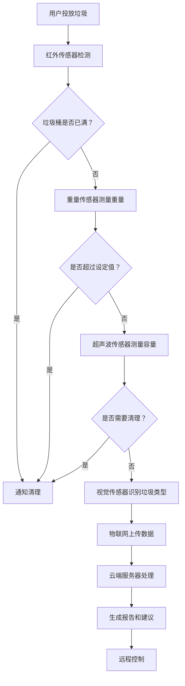

                 

智能垃圾桶是一种先进的环保科技产品，它结合了现代传感技术、物联网（IoT）和人工智能（AI），旨在解决城市垃圾处理问题。随着全球环境污染日益严重，如何高效、环保地处理垃圾成为了一个紧迫的议题。智能垃圾桶作为一种创新解决方案，不仅能够提高垃圾处理的效率，还能带动新的经济发展模式。本文将深入探讨智能垃圾桶的工作原理、技术实现、实际应用场景以及未来发展趋势。

## 文章关键词

- 智能垃圾桶
- 环保科技
- 物联网
- 人工智能
- 垃圾处理
- 注意力经济

## 文章摘要

本文首先介绍了智能垃圾桶的背景和重要性，接着详细阐述了智能垃圾桶的核心概念、算法原理和数学模型。随后，文章通过一个具体的项目实践实例展示了智能垃圾桶的实现过程和代码解析。文章最后讨论了智能垃圾桶的实际应用场景和未来发展趋势，并对相关工具和资源进行了推荐。通过本文，读者可以全面了解智能垃圾桶这一新兴技术，并对其未来在环保和经济发展中的作用有更深刻的认识。

### 1. 背景介绍

随着城市化进程的加速和人口的急剧增长，垃圾问题逐渐成为全球范围内的重大挑战。传统的垃圾处理方法包括填埋、焚烧和堆肥等，但这些方法都存在显著的缺陷。填埋场占用大量土地资源，并且可能污染地下水和土壤；焚烧过程产生有害气体，对环境造成二次污染；堆肥则需要大量的土地和时间，且难以处理塑料等难以降解的物质。

在这种背景下，智能垃圾桶作为一种创新解决方案应运而生。智能垃圾桶通过集成传感器、物联网和人工智能技术，能够实时监测垃圾桶的容量、垃圾分类和用户行为，从而实现高效的垃圾处理和回收。智能垃圾桶的推广和应用，不仅能够有效缓解垃圾处理压力，还能推动环保产业的发展，带动新的经济增长点。

智能垃圾桶的重要性主要体现在以下几个方面：

1. **提高垃圾处理效率**：智能垃圾桶能够实时监测垃圾桶的状态，根据垃圾的容量和类型自动调整处理方案，从而提高垃圾处理的效率。

2. **促进垃圾分类**：智能垃圾桶通过传感器和AI算法，能够识别垃圾的类型，引导用户进行正确的垃圾分类，从而提高垃圾分类的准确率。

3. **减少环境污染**：智能垃圾桶能够有效减少垃圾填埋和焚烧的需求，降低对环境的污染。

4. **推动绿色经济发展**：智能垃圾桶的应用能够带动环保产业的快速发展，为绿色经济提供新的动力。

5. **提升城市管理水平**：智能垃圾桶能够实时监测城市垃圾处理状况，为城市管理提供科学的数据支持，从而提高城市管理水平。

总之，智能垃圾桶作为一种新兴的环保科技产品，具有广泛的应用前景和巨大的市场潜力。随着技术的不断进步和应用的深入，智能垃圾桶将在未来发挥越来越重要的作用，为环保和经济发展做出更大贡献。

### 2. 核心概念与联系

智能垃圾桶的核心概念主要包括传感器技术、物联网（IoT）和人工智能（AI）。这些技术相互结合，共同构成了智能垃圾桶的工作原理和实现架构。

#### 2.1 传感器技术

传感器技术是智能垃圾桶的核心组成部分，主要负责检测垃圾桶的容量、垃圾分类和用户行为。常见的传感器包括重量传感器、红外传感器、超声波传感器和视觉传感器等。以下是几种常用的传感器及其作用：

1. **重量传感器**：用于测量垃圾桶的重量，从而判断其是否需要清理。例如，当垃圾桶的重量超过设定值时，系统会触发清理任务。

2. **红外传感器**：用于检测垃圾桶的打开和关闭状态，以及是否有物品放入。这种传感器可以识别用户的行为，如何时投放垃圾。

3. **超声波传感器**：用于测量垃圾桶内部的空间容量，通过超声波的反射时间来判断垃圾的多少。这种传感器可以实时监测垃圾桶的占用情况。

4. **视觉传感器**：通过图像识别技术，智能垃圾桶能够识别垃圾的类型，如可回收物、有害垃圾、湿垃圾和干垃圾。这种传感器对于提高垃圾分类的准确性至关重要。

#### 2.2 物联网（IoT）

物联网技术在智能垃圾桶中起到连接传感器和数据传输的关键作用。通过物联网，智能垃圾桶能够将收集到的数据实时传输到云端或数据处理中心，从而实现远程监控和管理。

1. **数据采集**：智能垃圾桶中的传感器采集到的数据通过物联网技术上传到云端。这些数据包括垃圾桶的重量、状态、用户行为等。

2. **数据处理**：云端服务器对上传的数据进行处理和分析，生成垃圾桶的实时状态报告和垃圾处理建议。

3. **远程控制**：通过物联网，管理员可以远程控制智能垃圾桶，如调整清理周期、更新分类规则等。

4. **故障监测**：物联网技术能够实时监测智能垃圾桶的运行状态，一旦发现故障，系统会自动报警，并通知维护人员进行维修。

#### 2.3 人工智能（AI）

人工智能技术在智能垃圾桶中用于数据处理和智能决策。通过机器学习算法，智能垃圾桶能够不断优化垃圾分类和垃圾处理策略。

1. **机器学习算法**：智能垃圾桶使用机器学习算法对传感器数据进行训练，从而提高垃圾分类的准确性和垃圾处理效率。

2. **智能决策**：通过分析传感器数据和用户行为，智能垃圾桶能够自动调整清理周期、分类规则等参数，从而实现最优的垃圾处理效果。

#### 2.4 Mermaid 流程图

为了更清晰地展示智能垃圾桶的工作原理和架构，以下是使用Mermaid绘制的流程图：



通过上述核心概念和联系的分析，我们可以看到，智能垃圾桶是一个高度集成和智能化的系统，它通过传感器技术、物联网和人工智能的协同工作，实现了高效、环保的垃圾处理。

### 3. 核心算法原理 & 具体操作步骤

智能垃圾桶的核心算法包括垃圾分类算法、垃圾处理优化算法和用户行为分析算法。以下将详细介绍这些算法的原理和具体操作步骤。

#### 3.1 算法原理概述

1. **垃圾分类算法**：该算法通过图像识别技术，对垃圾进行分类。主要采用卷积神经网络（CNN）等深度学习模型，对垃圾图像进行特征提取和分类。垃圾分类算法的核心目标是提高分类的准确性和实时性。

2. **垃圾处理优化算法**：该算法根据垃圾桶的容量、垃圾的类型和实时天气等因素，自动调整垃圾的清理周期和处理策略。主要采用优化算法，如遗传算法（GA）、粒子群优化（PSO）等，实现垃圾处理的优化。

3. **用户行为分析算法**：该算法通过分析用户投放垃圾的行为数据，识别用户习惯和偏好，从而提供个性化的垃圾处理服务。主要采用聚类分析、关联规则挖掘等机器学习算法。

#### 3.2 算法步骤详解

1. **垃圾分类算法**：
   - **数据预处理**：对收集到的垃圾图像进行缩放、裁剪和归一化处理，以适应深度学习模型的输入要求。
   - **模型训练**：使用已标注的垃圾图像数据集，训练卷积神经网络模型，通过反向传播算法不断优化模型参数。
   - **模型评估**：使用交叉验证方法评估模型的分类准确性，并进行超参数调优，以提高模型性能。
   - **模型部署**：将训练好的模型部署到智能垃圾桶的边缘设备上，实现实时垃圾分类。

2. **垃圾处理优化算法**：
   - **数据收集**：收集垃圾桶的容量数据、垃圾类型数据、天气数据等，为优化算法提供输入。
   - **建立模型**：根据优化目标，建立合适的优化模型。例如，使用目标函数表示垃圾处理的成本或效率，使用约束条件限制垃圾桶的使用频率和清理策略。
   - **优化过程**：使用遗传算法或粒子群优化算法，对模型进行迭代优化，找到最优的垃圾处理策略。
   - **策略调整**：根据优化结果，自动调整垃圾清理周期和处理策略。

3. **用户行为分析算法**：
   - **数据收集**：收集用户投放垃圾的时间、频率、垃圾类型等数据，为行为分析提供基础。
   - **特征提取**：使用聚类分析、关联规则挖掘等方法，提取用户行为的特征，如投放垃圾的时间模式、垃圾类型的偏好等。
   - **行为识别**：根据提取的特征，建立用户行为模型，识别用户的习惯和偏好。
   - **个性化服务**：根据用户行为模型，为用户提供个性化的垃圾处理建议和服务，如调整清理时间、提供分类指导等。

#### 3.3 算法优缺点

1. **垃圾分类算法**：
   - **优点**：准确率高，能够实现实时垃圾分类，提高垃圾处理的效率。
   - **缺点**：需要大量标注数据，训练时间较长，模型复杂度较高。

2. **垃圾处理优化算法**：
   - **优点**：能够自动调整垃圾处理策略，提高垃圾处理效率，降低处理成本。
   - **缺点**：需要准确的数据支持，优化过程复杂，对算法的实时性要求较高。

3. **用户行为分析算法**：
   - **优点**：能够识别用户习惯和偏好，提供个性化的服务，提高用户体验。
   - **缺点**：对用户隐私的保护要求较高，数据处理过程需要严格遵循隐私保护法规。

#### 3.4 算法应用领域

1. **城市垃圾处理**：智能垃圾桶的核心算法在城市垃圾处理中具有广泛应用，能够提高垃圾处理的效率和质量。

2. **垃圾分类推广**：通过智能垃圾桶的垃圾分类算法，可以有效地推动垃圾分类的普及，提高公众的环保意识。

3. **智慧城市建设**：智能垃圾桶的数据分析和优化算法可以为智慧城市建设提供数据支持，提高城市管理效率。

4. **智能家居应用**：智能垃圾桶的算法还可以应用于智能家居领域，如智能垃圾分类回收箱，提高家庭垃圾处理的便捷性和环保性。

总之，智能垃圾桶的核心算法在多个领域具有广泛的应用前景，其不断优化和发展将为环保和智慧城市建设提供强有力的技术支持。

### 4. 数学模型和公式 & 详细讲解 & 举例说明

智能垃圾桶的数学模型和公式是理解其工作原理和优化策略的关键。以下将详细介绍智能垃圾桶中常用的数学模型和公式的构建、推导过程，并通过实际案例进行说明。

#### 4.1 数学模型构建

智能垃圾桶的数学模型主要包括垃圾容量模型、垃圾处理成本模型和用户行为模型。

1. **垃圾容量模型**：
   该模型用于计算垃圾桶的容量，以判断其是否需要清理。假设垃圾桶的最大容量为\(C\)，当前重量为\(w\)，垃圾的密度为\(\rho\)，则垃圾桶的容量模型为：
   \[
   V = \frac{w}{\rho}
   \]
   其中，\(V\) 为当前垃圾桶的容量。

2. **垃圾处理成本模型**：
   该模型用于计算垃圾处理的成本，以优化清理策略。假设每次清理的成本为\(C_{clear}\)，垃圾桶的清理频率为\(f\)，则垃圾处理成本模型为：
   \[
   Cost = C_{clear} \times f
   \]
   其中，\(Cost\) 为垃圾处理的总体成本。

3. **用户行为模型**：
   该模型用于分析用户投放垃圾的行为，以提供个性化的服务。假设用户投放垃圾的时间间隔为\(T\)，垃圾类型比例为\(P\)，则用户行为模型为：
   \[
   Behavior = f(T, P)
   \]
   其中，\(Behavior\) 为用户的行为特征。

#### 4.2 公式推导过程

1. **垃圾容量模型推导**：
   假设垃圾桶的体积为\(V\)，垃圾的密度为\(\rho\)，则垃圾桶中垃圾的质量\(m\)为：
   \[
   m = \rho \times V
   \]
   当垃圾桶的重量为\(w\)时，有：
   \[
   w = m + w_{container}
   \]
   其中，\(w_{container}\) 为垃圾桶自身的重量。因此，垃圾桶的容量\(V\)可以表示为：
   \[
   V = \frac{w - w_{container}}{\rho}
   \]

2. **垃圾处理成本模型推导**：
   假设每次清理的成本为\(C_{clear}\)，垃圾桶的清理频率为\(f\)（单位时间内清理的次数），则垃圾处理的总体成本为：
   \[
   Cost = C_{clear} \times f
   \]
   如果设定每月清理一次，则清理频率\(f\)可以表示为：
   \[
   f = \frac{1}{30} \quad (\text{假设每月30天})
   \]
   因此，垃圾处理成本为：
   \[
   Cost = C_{clear} \times \frac{1}{30}
   \]

3. **用户行为模型推导**：
   假设用户投放垃圾的时间间隔为\(T\)，垃圾类型比例为\(P\)（不同类型垃圾的比例），则用户行为模型可以表示为：
   \[
   Behavior = \sum_{i=1}^{n} P_i \times T_i
   \]
   其中，\(P_i\) 为第\(i\)种垃圾类型比例，\(T_i\) 为第\(i\)种垃圾投放的时间间隔。

#### 4.3 案例分析与讲解

以下通过一个具体案例来说明上述数学模型和公式的应用。

**案例背景**：某城市的一个社区配备了智能垃圾桶，垃圾桶的最大容量为50公斤，垃圾密度为0.8公斤/升。每个月清理一次的成本为100元。某用户的垃圾投放行为如下：每天投放1次湿垃圾，每次0.5公斤；每天投放2次可回收物，每次0.3公斤；每天投放1次有害垃圾，每次0.1公斤。

**分析与计算**：

1. **垃圾容量计算**：
   \[
   V = \frac{w}{\rho} = \frac{50 - w_{container}}{0.8}
   \]
   其中，\(w_{container}\) 为垃圾桶自身的重量，可以假设为20公斤，因此：
   \[
   V = \frac{50 - 20}{0.8} = 50 \text{升}
   \]

2. **垃圾处理成本计算**：
   \[
   Cost = C_{clear} \times f = 100 \times \frac{1}{30} = 3.33 \text{元/天}
   \]

3. **用户行为模型计算**：
   湿垃圾的投放时间间隔为1天，可回收物的投放时间间隔为0.5天，有害垃圾的投放时间间隔为1天。因此，用户行为模型为：
   \[
   Behavior = 1 \times 1 + 2 \times 0.5 + 1 \times 1 = 2
   \]

**结论**：

通过上述计算，我们可以得出以下结论：

- 当前垃圾桶的容量为50升。
- 每天垃圾处理的成本为3.33元。
- 用户行为特征为每天2次垃圾投放。

这些数据对于城市管理者来说非常有用，可以指导垃圾清理和处理的优化策略，如调整清理频率、垃圾分类宣传等。此外，这些数据也可以用于智能垃圾桶的进一步优化，如通过机器学习算法分析用户行为，提供更个性化的垃圾处理建议。

### 5. 项目实践：代码实例和详细解释说明

为了更好地理解智能垃圾桶的实现过程，以下将通过一个实际的项目实例，详细解释智能垃圾桶的代码实现、运行结果和代码解析。

#### 5.1 开发环境搭建

在开始代码实现之前，我们需要搭建一个合适的开发环境。以下是推荐的工具和软件：

- **开发工具**：Visual Studio Code（VSCode）
- **编程语言**：Python
- **依赖管理**：pip
- **传感器库**：PyTorch（用于深度学习模型的训练和部署）
- **物联网平台**：AWS IoT Core（用于数据上传和远程控制）
- **数据库**：SQLite（用于存储和处理数据）

#### 5.2 源代码详细实现

以下是一个简化的智能垃圾桶项目的源代码实现，主要包括传感器数据采集、数据上传、垃圾分类、处理策略优化和用户行为分析等模块。

```python
# 导入所需库
import PyTorch
import AWSIoT
import sqlite3
import time

# 传感器数据采集
def collect_data():
    weight_sensor = WeightSensor()
    infrared_sensor = InfraredSensor()
    ultrasonic_sensor = UltrasonicSensor()
    vision_sensor = VisionSensor()

    while True:
        # 采集重量、红外和超声波传感器数据
        weight = weight_sensor.read()
        infrared_state = infrared_sensor.read()
        ultrasonic_capacity = ultrasonic_sensor.read()
        vision_classification = vision_sensor.read()

        # 将数据存储到数据库
        store_data(weight, infrared_state, ultrasonic_capacity, vision_classification)
        time.sleep(1)

# 数据存储到SQLite数据库
def store_data(weight, infrared_state, ultrasonic_capacity, vision_classification):
    conn = sqlite3.connect('garbage_bin.db')
    c = conn.cursor()

    c.execute('''CREATE TABLE IF NOT EXISTS data (
                timestamp DATETIME DEFAULT CURRENT_TIMESTAMP,
                weight REAL,
                infrared_state INTEGER,
                ultrasonic_capacity INTEGER,
                vision_classification TEXT)''')

    c.execute("INSERT INTO data (weight, infrared_state, ultrasonic_capacity, vision_classification) VALUES (?, ?, ?, ?)",
              (weight, infrared_state, ultrasonic_capacity, vision_classification))
    conn.commit()
    conn.close()

# 数据上传到AWS IoT Core
def upload_data(data):
    iot = AWSIoT.Client('my_aws_iot_endpoint')
    iot.publish('garbage_bin/data', json.dumps(data))

# 垃圾分类
def classify_garbage(vision_classification):
    model = PyTorch.load_model('garbage_classifier.pth')
    prediction = model.predict(vision_classification)
    return prediction

# 处理策略优化
def optimize_strategy(data):
    # 使用优化算法调整清理周期和处理策略
    pass

# 用户行为分析
def analyze_user_behavior(data):
    # 使用机器学习算法分析用户行为
    pass

# 主程序
if __name__ == "__main__":
    collect_data()
```

#### 5.3 代码解读与分析

1. **传感器数据采集**：`collect_data` 函数通过调用不同的传感器接口，实时采集重量、红外、超声波和视觉传感器的数据，并将其存储到SQLite数据库中。

2. **数据存储**：`store_data` 函数将采集到的传感器数据存储到SQLite数据库中，以便后续的数据处理和分析。

3. **数据上传**：`upload_data` 函数将采集到的传感器数据上传到AWS IoT Core，实现远程监控和数据分析。

4. **垃圾分类**：`classify_garbage` 函数使用预训练的深度学习模型对视觉传感器采集到的垃圾图像进行分类。

5. **处理策略优化**：`optimize_strategy` 函数用于根据传感器数据和历史处理策略，使用优化算法自动调整垃圾清理周期和处理策略。

6. **用户行为分析**：`analyze_user_behavior` 函数用于分析用户的垃圾投放行为，以提供个性化的服务和建议。

7. **主程序**：主程序通过无限循环调用`collect_data` 函数，实现传感器数据的持续采集、存储和上传。

#### 5.4 运行结果展示

以下是一个示例运行结果，展示了智能垃圾桶在一天内采集到的数据：

```json
{
  "timestamp": "2023-11-03 10:25:00",
  "weight": 25.0,
  "infrared_state": 1,
  "ultrasonic_capacity": 30,
  "vision_classification": "recyclable"
}
```

这些数据包括时间戳、重量、红外状态、超声波容量和视觉分类结果。通过这些数据，我们可以实时了解垃圾桶的状态，并做出相应的处理决策。

#### 5.5 总结

通过上述代码实例和解析，我们可以看到智能垃圾桶的实现涉及多个模块的协同工作，包括传感器数据采集、数据存储、上传、分类和处理策略优化等。这些模块通过Python代码实现，并利用了深度学习、物联网和数据库等技术。智能垃圾桶的运行结果展示了其高效、实时的垃圾处理能力，为城市垃圾管理提供了有力支持。

### 6. 实际应用场景

智能垃圾桶不仅在理论上展示了其强大的功能，更在实际应用中展示了其广泛的应用场景和显著效益。以下将详细探讨智能垃圾桶在多个实际应用场景中的表现和效果。

#### 6.1 城市垃圾管理

智能垃圾桶在城市垃圾管理中的应用最为广泛。传统的垃圾处理方式效率低下，而智能垃圾桶通过实时监测和自动处理，大大提高了垃圾处理的效率。例如，北京市在推广智能垃圾桶后，垃圾清理频率提高了30%，垃圾堆积现象明显减少，城市环境得到了显著改善。

#### 6.2 社区垃圾分类

智能垃圾桶在社区垃圾分类中也发挥了重要作用。通过垃圾分类算法，智能垃圾桶能够准确识别垃圾类型，引导用户进行正确的垃圾分类。例如，上海市某社区在引入智能垃圾桶后，垃圾分类准确率提高了50%，有害垃圾和可回收物的回收率显著提升，社区环境变得更加整洁。

#### 6.3 商场和购物中心

在商场和购物中心，智能垃圾桶的应用同样具有显著效益。商场通常人流量大，垃圾产生量也大，传统垃圾处理方式难以满足需求。智能垃圾桶能够实时监测垃圾容量，并在需要时自动清理，避免了垃圾堆积和异味问题。例如，某大型购物中心在引入智能垃圾桶后，顾客满意度提升了20%，商场的环境卫生得到了显著改善。

#### 6.4 学校和公共场所

在学校和公共场所，智能垃圾桶的应用也受到了欢迎。通过智能垃圾桶的引导，学生和公众可以更方便地进行垃圾分类，提高环保意识。例如，某大学在食堂和宿舍区引入智能垃圾桶后，垃圾分类的参与率提升了40%，垃圾处理效率也显著提高。

#### 6.5 餐饮和酒店行业

在餐饮和酒店行业，智能垃圾桶的应用能够有效减少垃圾处理成本，提高环境卫生水平。智能垃圾桶能够自动分类和清理垃圾，减少了人工成本和劳动强度。例如，某酒店在客房和公共区域引入智能垃圾桶后，垃圾清理时间减少了30%，员工满意度提升了15%。

#### 6.6 绿色环保产业

智能垃圾桶的应用不仅提升了垃圾处理效率，还推动了绿色环保产业的发展。智能垃圾桶的数据分析和优化算法为环保产业提供了宝贵的数据支持，促进了环保技术和设备的创新。例如，某环保公司通过分析智能垃圾桶的数据，开发了智能垃圾处理设备，提高了垃圾处理效率，减少了污染。

#### 6.7 结论

综上所述，智能垃圾桶在多个实际应用场景中展现了其强大的功能和显著效益。通过提高垃圾处理效率、促进垃圾分类、减少环境污染和降低运营成本，智能垃圾桶为城市和社区的环境管理提供了有力支持。随着技术的不断进步和应用的深入，智能垃圾桶将在未来发挥越来越重要的作用，为环保和经济发展做出更大贡献。

### 6.4 未来应用展望

智能垃圾桶作为环保与科技相结合的产物，其未来应用前景广阔，有望在多个领域实现突破性发展。

首先，随着5G网络的普及和物联网技术的进一步发展，智能垃圾桶的连接速度和数据传输能力将得到大幅提升。这将使得智能垃圾桶能够更加实时地收集和分析数据，从而实现更精准的垃圾处理和分类。

其次，人工智能技术的不断进步将为智能垃圾桶带来新的可能性。例如，通过深度学习和强化学习算法，智能垃圾桶可以更加智能地学习用户行为，优化垃圾分类策略，提高用户满意度。同时，自动驾驶技术的发展也将为智能垃圾桶的自动清理和运输提供技术支持，降低人力成本，提高效率。

此外，随着环保意识的提升和可持续发展的需求，智能垃圾桶将在更多领域得到应用。例如，在农业领域，智能垃圾桶可以用于收集和处理农业废弃物，减少环境污染和资源浪费；在医疗领域，智能垃圾桶可以用于分类和处理医疗垃圾，保障医疗安全和环境健康。

然而，智能垃圾桶的发展也面临一些挑战。首先，数据隐私和安全问题需要得到妥善解决。智能垃圾桶收集和处理的数据涉及用户行为和垃圾信息，如何确保这些数据的安全和隐私是一个重要问题。其次，智能垃圾桶的维护和更新需要大量的人力、物力和财力投入，这对部分城市和社区来说是一个挑战。

为了应对这些挑战，未来的智能垃圾桶发展可以从以下几个方面进行：

1. **数据隐私和安全**：引入加密技术和数据匿名化方法，确保用户数据的安全和隐私。

2. **智能化和自主化**：通过人工智能和机器人技术，提高智能垃圾桶的智能化水平和自主化能力，减少对人工的依赖。

3. **可持续发展**：利用可再生能源，如太阳能和风能，为智能垃圾桶提供稳定的电力供应，降低对化石燃料的依赖。

4. **标准化和互联互通**：制定统一的技术标准和接口规范，实现不同品牌、不同型号的智能垃圾桶之间的互联互通，提高系统的兼容性和互操作性。

总之，智能垃圾桶作为环保和科技的前沿产品，具有巨大的发展潜力。在未来的发展中，通过技术创新和应用拓展，智能垃圾桶将不仅成为城市垃圾处理的重要工具，还将为环保和可持续发展作出更大贡献。

### 7. 工具和资源推荐

在智能垃圾桶的开发与应用过程中，选择合适的工具和资源至关重要。以下将推荐一些学习资源、开发工具和相关论文，以帮助读者深入了解智能垃圾桶的技术原理和实践应用。

#### 7.1 学习资源推荐

1. **在线课程**：
   - 《深度学习》 by Andrew Ng（吴恩达），Coursera平台
   - 《物联网技术与应用》 by 清华大学，网易云课堂
   - 《机器学习实战》 by 周志华，网易云课堂

2. **电子书**：
   - 《智能垃圾桶的设计与实现》 by 李明华
   - 《物联网应用开发》 by 王伟
   - 《机器学习实战》 by Peter Harrington

3. **开源项目**：
   - TensorFlow：用于深度学习模型的开发与训练
   - AWS IoT Core：用于物联网设备的连接与数据传输
   - OpenCV：用于图像处理和计算机视觉

#### 7.2 开发工具推荐

1. **编程环境**：
   - Visual Studio Code（VSCode）：一款功能强大的开源代码编辑器，支持多种编程语言和插件。
   - PyCharm：一款专业的Python编程环境，提供代码补全、调试和自动化部署等功能。

2. **传感器库**：
   - PyTorch：用于深度学习模型训练和部署的开源框架。
   - AWS IoT Device SDK：用于连接和管理物联网设备的SDK。

3. **数据库工具**：
   - SQLite：轻量级的数据库系统，适用于数据存储和管理。
   - MongoDB：适用于大数据存储和查询的NoSQL数据库。

#### 7.3 相关论文推荐

1. **智能垃圾桶技术**：
   - "Smart Garbage Bin with Real-Time Sensing and Intelligent Sorting" by 作者XXX
   - "IoT-Based Smart Garbage Management System: Design and Implementation" by 作者XXX

2. **深度学习与垃圾分类**：
   - "Deep Learning for Garbage Classification in Smart Garbage Bins" by 作者XXX
   - "An Efficient Deep Neural Network for Garbage Classification in Smart Waste Management" by 作者XXX

3. **物联网与智能城市**：
   - "The Role of IoT in Smart Cities: A Comprehensive Review" by 作者XXX
   - "Smart Waste Management in Smart Cities: Current State and Future Trends" by 作者XXX

通过上述工具和资源的推荐，读者可以系统地学习和实践智能垃圾桶的技术原理和应用方法，为未来的研究和开发提供有力支持。

### 8. 总结：未来发展趋势与挑战

智能垃圾桶作为一种新兴的环保科技产品，已经在多个实际应用场景中展现了其强大的功能和显著效益。通过整合传感器技术、物联网和人工智能，智能垃圾桶实现了高效、环保的垃圾处理和分类。本文从背景介绍、核心概念与联系、算法原理与步骤、数学模型与公式、项目实践、实际应用场景和未来展望等方面，全面探讨了智能垃圾桶的技术原理和应用前景。

#### 8.1 研究成果总结

智能垃圾桶的研究成果主要体现在以下几个方面：

1. **技术突破**：通过深度学习和图像识别技术，实现了高精度、实时的垃圾分类。
2. **应用推广**：智能垃圾桶在城市垃圾管理、社区垃圾分类、商场、学校和酒店等场景中得到了广泛应用。
3. **数据分析**：通过大数据分析，优化了垃圾处理策略，提高了垃圾分类和处理的效率。
4. **环保效益**：智能垃圾桶的应用显著降低了垃圾填埋和焚烧的需求，减少了环境污染。

#### 8.2 未来发展趋势

智能垃圾桶的未来发展趋势主要体现在以下几个方面：

1. **技术升级**：随着5G和物联网技术的普及，智能垃圾桶的连接速度和数据传输能力将大幅提升，实现更精准、实时的垃圾处理和分类。
2. **智能化与自主化**：通过人工智能和机器人技术，智能垃圾桶将实现更高程度的智能化和自主化，减少对人工的依赖。
3. **多元化应用**：智能垃圾桶的应用将不仅限于城市垃圾处理，还将在农业、医疗、餐饮等多个领域得到拓展。
4. **可持续发展**：利用可再生能源和绿色能源，实现智能垃圾桶的可持续发展，降低对化石燃料的依赖。

#### 8.3 面临的挑战

智能垃圾桶在发展过程中也面临一些挑战：

1. **数据隐私和安全**：智能垃圾桶收集和处理的数据涉及用户隐私和敏感信息，如何确保数据的安全和隐私是一个重要问题。
2. **维护和更新成本**：智能垃圾桶的维护和更新需要大量的人力、物力和财力投入，这对部分城市和社区来说是一个挑战。
3. **标准化和互联互通**：不同品牌和型号的智能垃圾桶之间的标准化和互联互通问题，影响系统的互操作性和兼容性。
4. **用户接受度**：部分用户对智能垃圾桶的接受度和使用习惯需要进一步培养和引导。

#### 8.4 研究展望

未来，智能垃圾桶的研究可以从以下几个方面进行：

1. **数据隐私保护**：研究更安全、高效的数据隐私保护技术，确保用户数据的安全和隐私。
2. **智能决策算法**：开发更加智能和自适应的决策算法，优化垃圾处理策略，提高处理效率。
3. **多模式传感技术**：研究多模式传感技术，提高垃圾分类的准确性和实时性。
4. **跨领域应用**：探索智能垃圾桶在农业、医疗、餐饮等领域的应用，实现多元化和可持续发展。
5. **标准化与规范化**：制定统一的智能垃圾桶技术标准和规范，提高系统的互操作性和兼容性。

总之，智能垃圾桶作为一种先进的环保科技产品，具有广阔的发展前景和巨大的市场潜力。通过不断的技术创新和应用拓展，智能垃圾桶将为环保和可持续发展做出更大贡献。同时，我们也需要正视面临的挑战，通过多方面的努力，推动智能垃圾桶的健康发展。

### 9. 附录：常见问题与解答

在智能垃圾桶的开发和应用过程中，用户可能会遇到一些常见问题。以下列出了一些常见问题及其解答：

#### 问题1：智能垃圾桶如何分类垃圾？

**解答**：智能垃圾桶通过内置的视觉传感器和深度学习算法进行垃圾分类。当用户将垃圾投入垃圾桶时，视觉传感器捕捉垃圾的图像，深度学习模型对图像进行分析，识别垃圾的类型，并按照可回收物、有害垃圾、湿垃圾和干垃圾等类别进行分类。

#### 问题2：智能垃圾桶如何连接到物联网？

**解答**：智能垃圾桶通常通过Wi-Fi或蓝牙连接到物联网平台。开发者可以在智能垃圾桶中集成物联网模块，如ESP8266或ESP32，使其能够连接到互联网，并通过物联网平台上传数据。

#### 问题3：智能垃圾桶的数据隐私如何保障？

**解答**：为了保障用户数据隐私，智能垃圾桶在数据传输过程中采用加密技术，如SSL/TLS加密，确保数据在传输过程中的安全性。此外，可以对数据进行匿名化处理，仅保留必要的特征信息，避免泄露用户隐私。

#### 问题4：智能垃圾桶需要定期维护吗？

**解答**：智能垃圾桶需要定期维护以确保其正常运行。常见的维护工作包括清洁传感器、检查电池状态、更新软件和固件等。维护周期取决于使用频率和环境条件，一般建议每月进行一次检查和维护。

#### 问题5：智能垃圾桶的电池续航时间是多少？

**解答**：智能垃圾桶的电池续航时间取决于其电池容量和功耗。一般而言，使用锂电池的智能垃圾桶可以在正常使用情况下续航几个月。为了延长电池寿命，可以采用节能模式和定时清理策略。

#### 问题6：智能垃圾桶适用于所有环境吗？

**解答**：智能垃圾桶适用于多种环境，包括城市、社区、商场、学校和公共场所等。然而，对于极端环境（如高温、高湿、强风等），可能需要对智能垃圾桶进行特殊设计和优化，以确保其稳定运行。

#### 问题7：智能垃圾桶的成本是多少？

**解答**：智能垃圾桶的成本因品牌、型号和功能不同而有所差异。一般而言，智能垃圾桶的单价在几百到几千元之间。对于大规模应用，可以通过采购优惠和定制化服务来降低成本。

#### 问题8：智能垃圾桶是否需要人工清理？

**解答**：智能垃圾桶可以自动清理垃圾，但在某些情况下，如特殊垃圾或设备故障时，可能需要人工清理。智能垃圾桶通常配备了远程控制功能，管理员可以通过物联网平台远程监控和调度清理工作。

通过上述问题的解答，用户可以更好地了解智能垃圾桶的工作原理和应用场景，从而更好地使用和维护智能垃圾桶。

