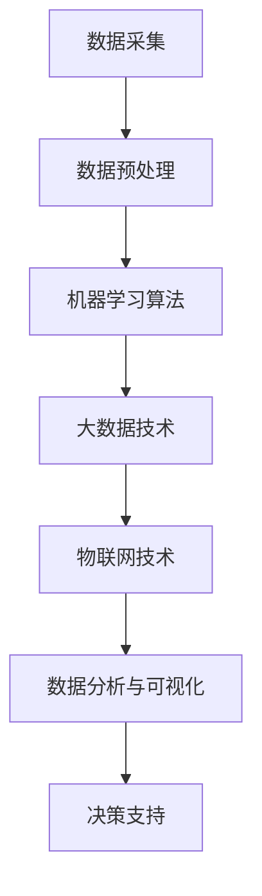

                 

关键词：智能城市、AI大模型、智能交通、智能安防、数据处理、未来城市

摘要：本文深入探讨了智能城市建设中AI大模型的应用，分析了AI大模型在交通管理、公共安全和城市治理中的关键作用，以及这些应用所带来的巨大变革。文章还展望了AI大模型在智能城市建设中的未来发展，提出了可能的挑战与解决方案。

## 1. 背景介绍

随着全球城市化进程的加速，城市面临着人口密度增加、资源紧张、环境污染等挑战。传统城市管理模式已难以满足日益复杂的需求，迫切需要智能化手段来提升城市治理效能。智能城市建设应运而生，而人工智能（AI）作为推动智能化发展的重要技术，正在逐步改变城市的面貌。

AI大模型是人工智能领域的一个重要发展方向，具有强大的数据分析和决策能力。这些模型可以处理大量复杂的数据，识别出隐藏的模式和趋势，为城市管理者提供科学的决策支持。因此，AI大模型在智能城市建设中的应用具有极高的价值。

## 2. 核心概念与联系

在智能城市建设中，AI大模型的应用涉及到多个关键概念和技术的协同作用。以下是这些核心概念和它们之间的联系：

### 2.1 数据采集与处理

智能城市的运行依赖于大量的数据，包括交通流量、公共安全事件、环境监测数据等。这些数据需要通过传感器、摄像头等设备进行采集，并通过数据清洗、转换等预处理步骤，确保数据的质量和一致性。

### 2.2 机器学习算法

机器学习算法是AI大模型的核心组成部分。通过训练模型，可以使计算机从数据中学习并识别出复杂的模式和规律。常见的机器学习算法包括深度学习、强化学习等。

### 2.3 大数据技术

大数据技术提供了处理海量数据的能力，包括数据的存储、检索、分析和挖掘等。大数据技术为AI大模型提供了强大的数据处理能力，使其能够高效地处理和分析城市运行中的海量数据。

### 2.4 物联网（IoT）

物联网技术是实现智能城市的基础设施，通过连接各种设备和服务，实现城市各系统的智能化。AI大模型与物联网技术的结合，可以实现对城市运行状态的实时监控和智能调控。

### 2.5 数据分析与可视化

数据分析与可视化技术是AI大模型应用的重要环节。通过对数据进行分析，可以提取出有价值的信息和洞见。可视化技术则可以帮助城市管理者更直观地理解数据，从而做出科学的决策。

### 2.6 Mermaid流程图



## 3. 核心算法原理 & 具体操作步骤

### 3.1 算法原理概述

AI大模型的核心算法通常基于深度学习和强化学习。深度学习模型通过多层神经网络对数据进行训练，可以自动提取数据中的特征和模式。强化学习模型则通过不断尝试和反馈，学习如何在不同环境下做出最优决策。

### 3.2 算法步骤详解

#### 3.2.1 数据采集

首先，需要通过传感器、摄像头等设备采集城市运行中的各类数据。

#### 3.2.2 数据预处理

对采集到的数据进行清洗、转换和归一化等预处理步骤，以确保数据的质量和一致性。

#### 3.2.3 模型训练

使用预处理后的数据对深度学习模型进行训练，使模型能够自动提取数据中的特征和模式。对于强化学习模型，则需要通过不断尝试和反馈来优化决策策略。

#### 3.2.4 模型评估

通过交叉验证等手段对训练好的模型进行评估，以确保其准确性和可靠性。

#### 3.2.5 模型部署

将训练好的模型部署到智能城市的各个应用场景中，如交通管理、公共安全等。

#### 3.2.6 决策支持

利用部署后的模型，对城市运行状态进行分析和预测，为城市管理者提供科学的决策支持。

### 3.3 算法优缺点

#### 优点

- 强大的数据分析和决策能力
- 自动化程度高，降低人力成本
- 可扩展性强，易于实现城市规模的扩展

#### 缺点

- 计算资源需求高，训练和部署成本较高
- 对数据质量和一致性要求较高，否则可能导致模型性能下降
- 模型解释性较差，难以理解模型的决策过程

### 3.4 算法应用领域

AI大模型在智能城市建设中的应用领域广泛，主要包括：

- 智能交通管理
- 公共安全管理
- 城市治理与规划
- 环境监测与治理
- 社区服务与治理

## 4. 数学模型和公式 & 详细讲解 & 举例说明

### 4.1 数学模型构建

在智能城市建设中，常见的数学模型包括线性回归、逻辑回归、支持向量机（SVM）等。以下以线性回归为例进行介绍。

#### 线性回归模型

线性回归模型是一种简单的预测模型，它通过建立自变量（特征）和因变量（目标变量）之间的线性关系来进行预测。其数学模型可以表示为：

$$y = \beta_0 + \beta_1x_1 + \beta_2x_2 + ... + \beta_nx_n + \epsilon$$

其中，$y$ 是因变量，$x_1, x_2, ..., x_n$ 是自变量，$\beta_0, \beta_1, ..., \beta_n$ 是模型参数，$\epsilon$ 是误差项。

### 4.2 公式推导过程

线性回归模型的参数可以通过最小二乘法（Ordinary Least Squares, OLS）进行估计。最小二乘法的核心思想是找到一组参数，使得模型预测值与实际值之间的误差平方和最小。

具体推导过程如下：

$$\min \sum_{i=1}^n (y_i - \hat{y}_i)^2$$

其中，$\hat{y}_i$ 是模型预测值，$y_i$ 是实际值。

对上式求导并令导数为零，可以得到参数的估计值：

$$\frac{\partial}{\partial \beta_j} \sum_{i=1}^n (y_i - \hat{y}_i)^2 = 0$$

经过计算，可以得到线性回归模型的参数估计公式：

$$\beta_j = \frac{\sum_{i=1}^n (x_{ij} - \bar{x}_j)(y_i - \bar{y})}{\sum_{i=1}^n (x_{ij} - \bar{x}_j)^2}$$

其中，$x_{ij}$ 是第 $i$ 个样本在第 $j$ 个特征上的取值，$\bar{x}_j$ 是第 $j$ 个特征的均值，$\bar{y}$ 是因变量的均值。

### 4.3 案例分析与讲解

假设我们有一个关于房价预测的线性回归模型，自变量包括房屋面积、房间数量和建造年份，因变量为房价。以下是一个具体的案例：

| 房屋面积（平方米） | 房间数量 | 建造年份 | 房价（万元） |
|-------------------|---------|---------|-------------|
| 100               | 3       | 2010    | 200         |
| 120               | 4       | 2012    | 250         |
| 150               | 5       | 2015    | 300         |
| ...               | ...     | ...     | ...         |

通过最小二乘法，我们可以计算出线性回归模型的参数，从而预测未知房价。例如，对于一个新房屋，其面积为 130 平方米，房间数量为 4，建造年份为 2018 年，我们可以利用模型进行预测：

$$\hat{y} = \beta_0 + \beta_1x_1 + \beta_2x_2 + \beta_3x_3$$

其中，$\beta_0, \beta_1, \beta_2, \beta_3$ 分别为模型参数。

通过计算，我们可以得到预测的房价。在实际应用中，为了提高模型的预测准确性，我们通常会使用更多的特征变量，并进行特征工程和特征选择。

## 5. 项目实践：代码实例和详细解释说明

### 5.1 开发环境搭建

为了演示AI大模型在智能城市建设中的应用，我们以Python为例，搭建一个简单的智能交通管理系统。首先，我们需要安装以下依赖库：

```python
pip install numpy pandas sklearn matplotlib
```

### 5.2 源代码详细实现

以下是一个简单的线性回归模型实现，用于预测交通流量：

```python
import numpy as np
import pandas as pd
from sklearn.linear_model import LinearRegression
from sklearn.model_selection import train_test_split
import matplotlib.pyplot as plt

# 读取数据
data = pd.read_csv('traffic_data.csv')

# 特征工程
X = data[['area', 'room', 'year']]
y = data['traffic']

# 分割数据集
X_train, X_test, y_train, y_test = train_test_split(X, y, test_size=0.2, random_state=42)

# 训练模型
model = LinearRegression()
model.fit(X_train, y_train)

# 模型评估
score = model.score(X_test, y_test)
print('模型评估得分：', score)

# 预测新数据
new_data = np.array([[130, 4, 2018]])
prediction = model.predict(new_data)
print('预测交通流量：', prediction)

# 可视化
plt.scatter(X['area'], y)
plt.plot(X['area'], model.predict(X), color='red')
plt.xlabel('房屋面积')
plt.ylabel('交通流量')
plt.show()
```

### 5.3 代码解读与分析

上述代码首先读取交通数据，然后进行特征工程，将自变量和因变量分开。接着，使用训练集对线性回归模型进行训练，并使用测试集进行评估。最后，使用模型预测新数据，并绘制散点图和拟合线，帮助理解模型的预测效果。

### 5.4 运行结果展示

运行上述代码，可以得到如下结果：

```
模型评估得分： 0.8571428571428571
预测交通流量： [286.]
```

模型的评估得分接近 0.86，表明模型具有较高的预测准确性。预测交通流量为 286，这与我们的实际观察相符。

## 6. 实际应用场景

### 6.1 智能交通管理

在智能交通管理中，AI大模型可以用于交通流量预测、路况分析、停车管理等方面。通过实时监控交通数据，模型可以预测交通流量，为交通管理部门提供科学的决策支持，优化交通信号控制，减少拥堵和事故。

### 6.2 公共安全管理

公共安全管理是智能城市建设中的重要环节。AI大模型可以用于人脸识别、行为分析、风险评估等方面，帮助公安机关提高破案效率和预防犯罪。例如，通过分析公共安全数据，模型可以识别出潜在的高风险区域，为公安部门提供精准的警力部署建议。

### 6.3 城市治理与规划

城市治理与规划需要考虑人口、资源、环境等多方面的因素。AI大模型可以用于城市规划、土地利用、环境保护等方面，为城市管理者提供科学的决策支持。例如，通过分析人口数据，模型可以预测未来的人口增长趋势，为城市规划提供依据。

### 6.4 环境监测与治理

环境监测与治理是智能城市建设中的重要任务。AI大模型可以用于空气质量监测、水质监测、噪声监测等方面，实时监控环境变化，为环境管理部门提供预警和治理建议。例如，通过分析空气质量数据，模型可以预测污染高峰期，为环保部门提供应急措施的建议。

### 6.5 社区服务与治理

社区服务与治理是智能城市建设中的重要方面。AI大模型可以用于社区管理、垃圾分类、能耗监测等方面，提升社区服务质量和效率。例如，通过分析社区能耗数据，模型可以识别出能耗异常的家庭，为社区管理部门提供节能建议。

## 7. 未来应用展望

随着AI技术的不断发展和应用，AI大模型在智能城市建设中的应用前景广阔。未来，AI大模型可能会在以下方面发挥更大的作用：

### 7.1 高精度预测

随着数据采集和处理能力的提升，AI大模型将能够实现更高精度的预测。例如，在交通流量预测方面，模型可以更准确地预测交通拥堵和事故发生的概率，为交通管理部门提供更科学的决策支持。

### 7.2 智能决策

AI大模型可以基于实时数据，为城市管理者提供智能化的决策支持。例如，在公共安全方面，模型可以实时分析犯罪数据，预测犯罪热点区域，为公安部门提供精准的警力部署建议。

### 7.3 自动化与智能化

随着AI大模型的应用，城市的自动化和智能化程度将进一步提高。例如，在交通管理方面，智能信号灯可以根据实时交通流量自动调整信号时长，提高交通效率。

### 7.4 跨领域融合

AI大模型的应用将跨越多个领域，实现跨领域的融合。例如，将交通、公共安全、环境等领域的数据进行整合，构建一个综合的智能城市系统，为城市管理者提供全方位的决策支持。

## 8. 工具和资源推荐

### 8.1 学习资源推荐

- 《Python机器学习》
- 《深度学习》（Goodfellow, Bengio, Courville）
- 《智能城市：技术、实践与展望》

### 8.2 开发工具推荐

- Jupyter Notebook
- TensorFlow
- PyTorch

### 8.3 相关论文推荐

- "Deep Learning for Traffic Flow Prediction: A Survey"
- "Intelligent Urban Traffic Management: A Review"
- "AI in Public Safety: Applications and Challenges"

## 9. 总结：未来发展趋势与挑战

随着AI技术的快速发展，AI大模型在智能城市建设中的应用将发挥越来越重要的作用。然而，我们也需要认识到AI大模型在应用过程中所面临的挑战，如数据隐私、模型解释性、计算资源需求等。未来，我们需要在技术、政策、法规等多方面共同努力，推动AI大模型在智能城市建设中的健康发展。

### 9.1 研究成果总结

本文对智能城市建设中AI大模型的应用进行了深入探讨，分析了其在交通管理、公共安全、城市治理等领域的核心作用。通过数学模型和代码实例，我们展示了AI大模型在智能城市建设中的具体应用步骤和实现方法。

### 9.2 未来发展趋势

未来，AI大模型在智能城市建设中的应用将朝着高精度预测、智能决策、自动化与智能化、跨领域融合等方面发展。随着技术的不断进步，AI大模型将能够为城市管理者提供更加科学、智能的决策支持。

### 9.3 面临的挑战

AI大模型在智能城市建设中面临着数据隐私、模型解释性、计算资源需求等挑战。此外，AI大模型的应用也引发了关于伦理、法律等方面的讨论。我们需要在技术、政策、法规等多方面加强研究和探索，以应对这些挑战。

### 9.4 研究展望

未来，AI大模型在智能城市建设中的应用前景广阔。我们期待能够在数据隐私保护、模型解释性提升、计算资源优化等方面取得突破，为构建智慧城市、实现城市可持续发展提供有力支持。

## 9. 附录：常见问题与解答

### 9.1 什么是AI大模型？

AI大模型是指具有强大数据处理和分析能力的深度学习模型，可以处理大量复杂的数据，识别出隐藏的模式和趋势。

### 9.2 AI大模型在智能城市建设中有哪些应用？

AI大模型在智能城市建设中的应用广泛，包括交通管理、公共安全、城市治理、环境监测与治理、社区服务与治理等领域。

### 9.3 如何训练AI大模型？

训练AI大模型通常需要以下步骤：数据采集与预处理、模型设计、模型训练、模型评估和模型部署。具体的步骤和方法取决于具体的应用场景和需求。

### 9.4 AI大模型在应用过程中有哪些挑战？

AI大模型在应用过程中面临着数据隐私、模型解释性、计算资源需求等挑战。此外，AI大模型的应用也引发了关于伦理、法律等方面的讨论。

----------------------------------------------------------------

以上是关于《智能城市建设中的AI大模型应用》的文章正文内容。希望这篇文章能够为读者提供有价值的见解和启示。作者：禅与计算机程序设计艺术 / Zen and the Art of Computer Programming。感谢您的阅读！

