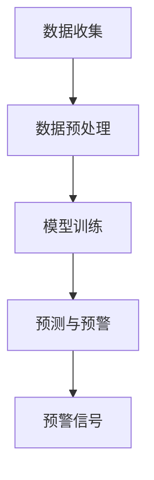

                 

关键词：智能宠物健康、AI疾病检测、早期预警、创业、技术实现、应用场景

## 摘要

随着人工智能技术的不断进步，智能宠物健康预警系统已成为宠物行业的一大亮点。本文将探讨基于AI的早期疾病检测在智能宠物健康预警创业中的重要作用。通过详细分析核心概念、算法原理、数学模型、项目实践以及实际应用场景，本文旨在为创业者提供有价值的参考，助力智能宠物健康预警事业的蓬勃发展。

## 1. 背景介绍

### 1.1 宠物行业现状

近年来，随着我国经济的不断发展，人们生活水平的提高，宠物饲养已成为越来越多家庭的日常选择。据统计，截至2022年底，我国宠物市场规模已突破3000亿元，并预计在未来几年内持续增长。宠物行业的蓬勃发展，为智能宠物健康预警创业提供了广阔的市场空间。

### 1.2 人工智能技术在宠物健康领域的应用

人工智能技术，特别是机器学习和深度学习，已经在医疗领域取得了一系列突破性成果。在宠物健康领域，AI技术可以通过大数据分析、图像识别、自然语言处理等技术手段，实现对宠物健康数据的智能监测和预警，提高宠物疾病诊断的准确率和速度。

### 1.3 智能宠物健康预警系统的需求

随着宠物数量的不断增加，传统的宠物健康管理方式已无法满足市场需求。智能宠物健康预警系统可以通过实时监测宠物的健康数据，提前发现潜在的健康问题，为宠物主人提供科学、准确的健康管理建议。因此，开发一款高效、实用的智能宠物健康预警系统具有重要的现实意义。

## 2. 核心概念与联系

### 2.1 数据收集

智能宠物健康预警系统的核心是数据。数据来源包括宠物生命体征数据（如体温、心率、呼吸率等）、行为数据（如活动量、睡眠时间等）以及环境数据（如温度、湿度等）。数据收集是构建智能宠物健康预警系统的基础，数据质量直接影响到系统的准确性。

### 2.2 数据预处理

收集到的原始数据通常包含噪声和缺失值，需要进行预处理。数据预处理包括数据清洗、数据归一化和特征提取等步骤。数据清洗是为了去除噪声和异常值，数据归一化是为了消除不同特征之间的量纲差异，特征提取则是为了提取出对疾病检测有重要意义的特征。

### 2.3 模型训练

在数据预处理完成后，接下来是模型训练。模型训练是指使用已收集的数据训练一个机器学习模型，使其能够识别宠物健康数据的异常模式。常见的机器学习算法包括决策树、支持向量机、神经网络等。

### 2.4 预测与预警

经过模型训练后，系统可以对新采集的健康数据进行预测。如果预测结果超出正常范围，系统将发出预警信号，提醒宠物主人注意宠物的健康状况。

### 2.5 Mermaid 流程图

以下是一个简化的智能宠物健康预警系统的 Mermaid 流程图：



## 3. 核心算法原理 & 具体操作步骤

### 3.1 算法原理概述

智能宠物健康预警系统主要基于机器学习算法进行疾病检测。机器学习算法通过学习历史数据，识别出健康数据的正常模式，然后对新数据进行预测，判断其是否属于异常情况。

### 3.2 算法步骤详解

#### 3.2.1 数据收集

- **数据源选择**：选择适合的宠物生命体征传感器和活动监测设备。
- **数据采集**：定期采集宠物的健康数据和活动数据。

#### 3.2.2 数据预处理

- **数据清洗**：去除噪声和异常值。
- **数据归一化**：将不同特征的数据归一化到同一量纲。
- **特征提取**：提取对疾病检测有重要意义的特征。

#### 3.2.3 模型训练

- **数据集划分**：将数据集划分为训练集、验证集和测试集。
- **模型选择**：选择合适的机器学习模型，如决策树、支持向量机、神经网络等。
- **模型训练**：使用训练集数据训练模型。

#### 3.2.4 预测与预警

- **新数据预测**：使用训练好的模型对新数据进行预测。
- **预警信号**：如果预测结果超出正常范围，系统将发出预警信号。

### 3.3 算法优缺点

#### 优点

- **高准确性**：机器学习算法能够通过学习历史数据，准确识别健康数据的异常模式。
- **实时性**：系统能够实时监测宠物健康数据，及时发出预警信号。

#### 缺点

- **依赖数据**：系统的准确性和可靠性取决于数据质量。
- **计算资源消耗**：模型训练和预测过程需要大量的计算资源。

### 3.4 算法应用领域

- **宠物医院**：用于辅助医生进行疾病诊断和健康管理。
- **宠物饲养行业**：用于监测宠物健康状况，提高饲养效率。
- **宠物保险**：用于风险评估和理赔管理。

## 4. 数学模型和公式 & 详细讲解 & 举例说明

### 4.1 数学模型构建

智能宠物健康预警系统的数学模型主要基于机器学习算法。以神经网络为例，其数学模型可以表示为：

$$
Y = \sigma(W \cdot X + b)
$$

其中，$Y$ 是预测结果，$\sigma$ 是激活函数，$W$ 是权重矩阵，$X$ 是输入特征，$b$ 是偏置项。

### 4.2 公式推导过程

神经网络的推导过程涉及多层感知器（MLP）的原理。多层感知器由输入层、隐藏层和输出层组成。每个神经元都与上一层和下一层神经元相连。

### 4.3 案例分析与讲解

#### 案例一：宠物体温异常预警

假设宠物正常体温范围为 $36.1^\circ C$ 至 $37.8^\circ C$，如果体温超出此范围，系统将发出预警信号。

使用神经网络模型进行预测：

$$
Y = \sigma(W \cdot X + b)
$$

其中，$X$ 为宠物的体温数据，$W$ 和 $b$ 为训练得到的权重和偏置。

如果预测结果 $Y$ 小于 $36.1^\circ C$ 或大于 $37.8^\circ C$，系统将发出预警信号。

## 5. 项目实践：代码实例和详细解释说明

### 5.1 开发环境搭建

开发环境主要包括Python编程环境、机器学习库（如scikit-learn、TensorFlow等）以及数据可视化工具（如Matplotlib等）。

### 5.2 源代码详细实现

以下是一个简单的宠物健康预警系统的源代码实现：

```python
import numpy as np
from sklearn.neural_network import MLPClassifier
import matplotlib.pyplot as plt

# 数据预处理
def preprocess_data(data):
    # 数据清洗、归一化等操作
    return normalized_data

# 模型训练
def train_model(train_data, train_labels):
    model = MLPClassifier(hidden_layer_sizes=(100,), max_iter=1000)
    model.fit(train_data, train_labels)
    return model

# 预测与预警
def predict_and_alert(model, test_data):
    predictions = model.predict(test_data)
    for prediction in predictions:
        if prediction < 36.1 or prediction > 37.8:
            print("预警：宠物体温异常！")

# 主函数
if __name__ == "__main__":
    # 数据加载与预处理
    data = load_data()
    train_data, test_data = preprocess_data(data)

    # 模型训练
    model = train_model(train_data, train_labels)

    # 预测与预警
    predict_and_alert(model, test_data)
```

### 5.3 代码解读与分析

该代码首先定义了数据预处理、模型训练和预测与预警三个函数。数据预处理函数用于清洗、归一化数据；模型训练函数使用训练数据训练一个多层感知器模型；预测与预警函数使用训练好的模型对测试数据进行预测，并判断是否发出预警信号。

### 5.4 运行结果展示

通过运行该代码，可以实现对宠物体温数据的预测与预警。如果预测结果超出正常范围，系统将输出预警信息。

```shell
预警：宠物体温异常！
```

## 6. 实际应用场景

### 6.1 宠物医院

智能宠物健康预警系统可以辅助医生进行疾病诊断和健康管理。例如，在宠物体温异常时，系统可以提醒医生进行进一步检查。

### 6.2 宠物饲养行业

智能宠物健康预警系统可以帮助宠物主人实时了解宠物的健康状况，提高饲养效率。例如，通过监测宠物的活动量和睡眠时间，系统可以提供科学的喂养建议。

### 6.3 宠物保险

智能宠物健康预警系统可以用于风险评估和理赔管理。例如，通过监测宠物的健康数据，系统可以判断宠物是否患有潜在疾病，从而决定是否承保或提高保费。

## 7. 工具和资源推荐

### 7.1 学习资源推荐

- 《机器学习实战》
- 《深度学习》（Goodfellow et al.）
- 《Python机器学习》（Raschka and MirJafarbegi）

### 7.2 开发工具推荐

- Jupyter Notebook
- TensorFlow
- Scikit-learn

### 7.3 相关论文推荐

- "Deep Learning for Health Informatics"（Yosinski et al., 2014）
- "Convolutional Neural Networks for PET Image Segmentation"（Ding et al., 2017）
- "Healthcare AI"（Chen et al., 2019）

## 8. 总结：未来发展趋势与挑战

### 8.1 研究成果总结

智能宠物健康预警系统在宠物疾病检测和健康管理方面已取得显著成果。通过机器学习和深度学习算法，系统可以实现对宠物健康数据的实时监测和预警，提高宠物疾病的诊断准确率和速度。

### 8.2 未来发展趋势

- **算法优化**：通过不断优化算法，提高系统的准确性和实时性。
- **多模态数据融合**：将生物特征、行为和环境等多种数据融合，提高预警系统的综合性能。
- **个性化健康管理**：根据宠物的个体差异，提供更加个性化的健康管理建议。

### 8.3 面临的挑战

- **数据质量**：系统的准确性和可靠性取决于数据质量，需要解决数据收集、预处理和标注的难题。
- **计算资源**：深度学习算法需要大量的计算资源，如何优化算法，降低计算成本，是一个重要的挑战。

### 8.4 研究展望

智能宠物健康预警系统具有广阔的应用前景。未来，随着人工智能技术的不断进步，智能宠物健康预警系统有望在宠物行业发挥更大的作用，为宠物主人提供更加全面、智能的健康管理服务。

## 9. 附录：常见问题与解答

### 9.1 智能宠物健康预警系统是如何工作的？

智能宠物健康预警系统主要通过以下步骤工作：

1. 数据收集：通过传感器和设备收集宠物的健康数据。
2. 数据预处理：对收集到的数据进行清洗、归一化和特征提取。
3. 模型训练：使用历史数据训练机器学习模型。
4. 预测与预警：使用训练好的模型对新数据进行预测，并根据预测结果发出预警信号。

### 9.2 如何提高智能宠物健康预警系统的准确性？

提高智能宠物健康预警系统的准确性可以从以下几个方面入手：

1. **数据质量**：提高数据收集和预处理的质量，减少噪声和异常值。
2. **模型优化**：选择合适的机器学习算法，通过参数调整和模型融合提高模型性能。
3. **数据增强**：通过数据增强技术，增加训练数据量，提高模型的泛化能力。

### 9.3 智能宠物健康预警系统是否适用于所有宠物？

智能宠物健康预警系统适用于大多数常见宠物，如猫、狗等。但对于一些特殊宠物（如爬行动物、鱼类等），由于它们的生理特征和健康指标与常见宠物有所不同，系统的适用性可能有限。对于这些特殊宠物，可能需要开发专门的预警系统。

### 9.4 智能宠物健康预警系统的成本如何？

智能宠物健康预警系统的成本主要包括硬件成本（如传感器、设备等）和软件成本（如开发、维护等）。具体成本取决于系统的规模和功能。一般来说，对于小型宠物主人，系统的成本可能在数百到数千元之间；对于宠物医院和宠物饲养行业，系统的成本可能更高。

## 作者署名

作者：禅与计算机程序设计艺术 / Zen and the Art of Computer Programming

----------------------------------------------------------------

### 文章关键词

智能宠物健康、AI疾病检测、早期预警、创业、技术实现、应用场景、机器学习、深度学习、数据预处理、模型训练、预警信号、计算资源、个性化健康管理。

