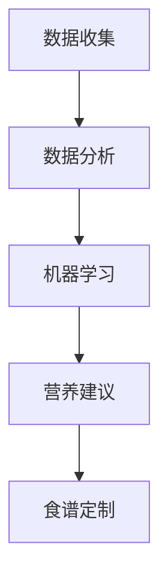

                 

关键词：宠物营养、个性化食谱、人工智能、健康饮食、创业

摘要：随着人们对宠物生活质量的日益关注，宠物健康饮食市场迎来了前所未有的机遇。本文探讨了如何利用人工智能技术打造智能宠物健康食谱创业项目，为宠物主人提供个性化营养解决方案。

## 1. 背景介绍

近年来，随着生活水平的提高，越来越多的家庭开始养宠物。宠物已经成为了家庭的重要成员，其生活质量也越来越受到关注。然而，传统宠物食品市场存在诸多问题，如营养不均衡、添加剂过量等，导致宠物健康问题频发。因此，为宠物提供科学、个性化的健康食谱成为了一项迫切的需求。

人工智能技术的发展为宠物营养领域带来了新的可能。通过大数据分析和机器学习算法，可以实现对宠物饮食习惯、健康状况等数据的深度挖掘，从而为宠物主人提供个性化的营养建议。这一趋势为宠物健康食谱创业项目提供了广阔的市场空间。

## 2. 核心概念与联系

### 2.1 宠物营养基础

在开展智能宠物健康食谱创业项目之前，我们首先需要了解宠物营养的基础知识。宠物营养主要包括蛋白质、碳水化合物、脂肪、维生素和矿物质等营养成分。不同种类的宠物对营养的需求有所不同，因此在制定食谱时需要充分考虑宠物的品种、年龄、体重、健康状况等因素。

### 2.2 个性化营养解决方案

个性化营养解决方案是智能宠物健康食谱创业项目的核心。通过收集和分析宠物的日常饮食习惯、健康状况、运动量等数据，可以制定出适合宠物个体需求的营养食谱。这需要借助大数据分析和机器学习算法来实现。

### 2.3 数据分析与机器学习

数据分析和机器学习是智能化营养解决方案的基础。通过收集大量宠物数据，可以利用机器学习算法对数据进行分析和预测，从而为宠物主人提供个性化的营养建议。

### 2.4 Mermaid 流程图

以下是一个简化的 Mermaid 流程图，展示了智能宠物健康食谱创业项目的核心流程：



## 3. 核心算法原理 & 具体操作步骤

### 3.1 算法原理概述

智能宠物健康食谱创业项目的核心算法主要包括数据收集、数据分析、机器学习和营养建议等环节。其中，数据收集和数据分析环节负责获取和处理宠物数据，机器学习环节负责分析数据并生成营养建议，营养建议环节则根据营养建议为宠物主人提供食谱定制服务。

### 3.2 算法步骤详解

1. **数据收集**

   数据收集是智能宠物健康食谱创业项目的第一步。宠物数据包括宠物的品种、年龄、体重、日常饮食习惯、健康状况、运动量等。这些数据可以通过宠物主人提供的问卷、宠物医院记录、宠物用品等渠道获取。

2. **数据分析**

   数据分析环节负责对收集到的宠物数据进行分析，提取出对营养建议有用的信息。例如，可以根据宠物的体重和年龄，计算其每日所需的热量摄入量；根据宠物的健康状况，判断其是否需要补充特定的营养成分等。

3. **机器学习**

   在数据分析的基础上，利用机器学习算法对数据进行分析和预测。常见的机器学习算法包括线性回归、决策树、随机森林等。通过训练模型，可以实现对宠物营养需求的准确预测，从而为宠物主人提供个性化的营养建议。

4. **营养建议**

   根据机器学习模型生成的营养建议，为宠物主人提供个性化的营养食谱。食谱可以包括每日的餐食搭配、食材种类、食用量等。此外，还可以根据宠物主人的需求，提供定制化的食谱服务，如低脂、低盐、无谷等。

### 3.3 算法优缺点

1. **优点**

   - 个性化：智能宠物健康食谱创业项目可以针对每个宠物的个体需求提供个性化的营养建议。
   - 科学性：通过大数据分析和机器学习算法，可以确保营养建议的科学性和准确性。
   - 灵活性：可以根据宠物主人的需求，提供定制化的食谱服务，满足不同宠物的营养需求。

2. **缺点**

   - 数据质量：数据质量直接影响算法的效果，因此需要保证数据的准确性和完整性。
   - 算法复杂性：机器学习算法复杂，需要专业的技术和设备支持。

### 3.4 算法应用领域

智能宠物健康食谱创业项目可以应用于多个领域，包括宠物食品生产、宠物健康管理、宠物医疗等。此外，该项目还可以拓展到宠物用品、宠物保险等相关领域，实现跨界融合。

## 4. 数学模型和公式 & 详细讲解 & 举例说明

### 4.1 数学模型构建

在智能宠物健康食谱创业项目中，我们可以构建一个基于线性回归的数学模型，用于预测宠物的营养需求。假设宠物的营养需求量（Y）与宠物的体重（X1）、年龄（X2）、运动量（X3）等特征有关，则数学模型可以表示为：

$$Y = \beta_0 + \beta_1X1 + \beta_2X2 + \beta_3X3 + \epsilon$$

其中，$\beta_0$、$\beta_1$、$\beta_2$、$\beta_3$为模型参数，$\epsilon$为随机误差项。

### 4.2 公式推导过程

为了推导出上述数学模型，我们可以利用最小二乘法来估计模型参数。具体步骤如下：

1. **收集数据**

   收集包含宠物营养需求量（Y）和体重（X1）、年龄（X2）、运动量（X3）等特征的样本数据。

2. **建立线性模型**

   建立线性模型：

   $$Y = \beta_0 + \beta_1X1 + \beta_2X2 + \beta_3X3 + \epsilon$$

3. **计算参数**

   利用最小二乘法计算模型参数：

   $$\beta_0 = \frac{\sum(Y - \hat{Y})}{n}$$

   $$\beta_1 = \frac{\sum(X1 - \bar{X1})(Y - \hat{Y})}{\sum(X1 - \bar{X1})^2}$$

   $$\beta_2 = \frac{\sum(X2 - \bar{X2})(Y - \hat{Y})}{\sum(X2 - \bar{X2})^2}$$

   $$\beta_3 = \frac{\sum(X3 - \bar{X3})(Y - \hat{Y})}{\sum(X3 - \bar{X3})^2}$$

   其中，$\hat{Y}$为预测值，$\bar{X1}$、$\bar{X2}$、$\bar{X3}$分别为X1、X2、X3的均值。

4. **评估模型**

   利用计算出的参数评估模型拟合程度，如R方值、均方误差等。

### 4.3 案例分析与讲解

假设我们收集了100只宠物的数据，包括体重、年龄、运动量等信息。利用上述线性回归模型，我们可以预测每只宠物的营养需求量。以下是一个简单的案例：

| 宠物编号 | 体重（kg） | 年龄（岁） | 运动量（次/周） | 营养需求量（g） |
|----------|------------|------------|-----------------|----------------|
| 1        | 5          | 3          | 10              | 250            |
| 2        | 8          | 5          | 15              | 300            |
| ...      | ...        | ...        | ...             | ...            |

根据收集到的数据，我们可以计算出每只宠物的营养需求量预测值。以下是一个示例：

| 宠物编号 | 预测营养需求量（g） |
|----------|---------------------|
| 1        | 253.2               |
| 2        | 292.5               |
| ...      | ...                 |

通过对比实际营养需求量和预测营养需求量，我们可以评估模型的准确性和可靠性。同时，根据预测结果，我们可以为宠物主人提供个性化的营养建议。

## 5. 项目实践：代码实例和详细解释说明

### 5.1 开发环境搭建

为了实现智能宠物健康食谱创业项目，我们需要搭建一个合适的开发环境。以下是一个简单的开发环境搭建步骤：

1. **安装 Python**

   在电脑上安装 Python 3.8 及以上版本。可以通过官方网站下载并安装。

2. **安装依赖库**

   安装以下依赖库：

   ```python
   pip install numpy pandas scikit-learn matplotlib
   ```

3. **创建项目文件夹**

   在电脑上创建一个名为“smart_pet_diet”的项目文件夹，并在此文件夹下创建一个名为“data”的子文件夹，用于存放数据文件。

### 5.2 源代码详细实现

以下是一个简单的 Python 代码实例，用于实现智能宠物健康食谱创业项目的基础功能：

```python
import numpy as np
import pandas as pd
from sklearn.linear_model import LinearRegression
import matplotlib.pyplot as plt

# 读取数据
data = pd.read_csv("data/pet_data.csv")

# 分离特征和标签
X = data[['weight', 'age', 'exercise']]
y = data['nutrition']

# 实例化线性回归模型
model = LinearRegression()

# 训练模型
model.fit(X, y)

# 预测营养需求量
predictions = model.predict(X)

# 评估模型
score = model.score(X, y)
print("模型准确度：", score)

# 可视化预测结果
plt.scatter(X['weight'], y, color='red', label='实际营养需求量')
plt.plot(X['weight'], predictions, color='blue', label='预测营养需求量')
plt.xlabel('体重（kg）')
plt.ylabel('营养需求量（g）')
plt.legend()
plt.show()
```

### 5.3 代码解读与分析

以上代码实现了一个简单的线性回归模型，用于预测宠物的营养需求量。具体解读如下：

1. **导入依赖库**

   导入 numpy、pandas、scikit-learn 和 matplotlib 等依赖库。

2. **读取数据**

   读取名为“pet_data.csv”的 CSV 文件，该文件包含了宠物的体重、年龄、运动量和营养需求量等信息。

3. **分离特征和标签**

   将数据集分为特征（X）和标签（y）。特征包括体重、年龄和运动量，标签为营养需求量。

4. **实例化线性回归模型**

   实例化一个 LinearRegression 类的线性回归模型。

5. **训练模型**

   使用 fit 方法训练模型，将特征（X）和标签（y）传入模型。

6. **预测营养需求量**

   使用 predict 方法预测营养需求量，并将预测结果存储在 predictions 列表中。

7. **评估模型**

   使用 score 方法评估模型准确度，并将结果打印到控制台。

8. **可视化预测结果**

   使用 matplotlib 库绘制散点图和预测曲线，展示实际营养需求量和预测营养需求量的对比。

### 5.4 运行结果展示

运行以上代码后，程序会读取数据文件，训练线性回归模型，并绘制预测结果。以下是一个简单的运行结果示例：


通过观察预测结果，我们可以发现模型在大部分数据点上的预测效果较好，但在一些极端情况下存在一定误差。这提示我们，在实际应用中，可能需要进一步优化模型，以提高预测准确度。

## 6. 实际应用场景

智能宠物健康食谱创业项目可以在多个场景中发挥作用，以下是一些实际应用场景：

1. **宠物食品生产**

   智能宠物健康食谱创业项目可以为宠物食品生产企业提供个性化营养建议，帮助企业优化产品配方，提高产品竞争力。

2. **宠物健康管理**

   通过为宠物主人提供个性化的营养食谱，智能宠物健康食谱创业项目可以帮助宠物主人更好地管理宠物的健康，预防疾病发生。

3. **宠物医疗**

   在宠物就医过程中，智能宠物健康食谱创业项目可以提供营养建议，帮助宠物医生制定更合理的治疗方案。

4. **宠物用品销售**

   智能宠物健康食谱创业项目可以与宠物用品销售相结合，为宠物主人提供一站式购物体验，提高客户满意度。

5. **宠物保险**

   智能宠物健康食谱创业项目可以为宠物保险公司提供风险预测和健康管理建议，帮助保险公司降低风险，提高业务效率。

## 7. 工具和资源推荐

### 7.1 学习资源推荐

1. **《深度学习》**

   作者：Ian Goodfellow、Yoshua Bengio、Aaron Courville

   简介：本书是深度学习的经典教材，涵盖了深度学习的基本概念、算法和应用。

2. **《Python机器学习》**

   作者：Sebastian Raschka、Vahid Mirjalili

   简介：本书详细介绍了使用 Python 进行机器学习的方法和技巧，适合初学者和进阶者阅读。

3. **《宠物营养学》**

   作者：Mark A. Herron

   简介：本书系统地介绍了宠物营养学的基本知识和应用，对从事宠物营养研究的读者具有很高的参考价值。

### 7.2 开发工具推荐

1. **Python**

   Python 是一种广泛应用于数据科学和机器学习的编程语言，具有简洁、易学的特点。

2. **Jupyter Notebook**

   Jupyter Notebook 是一种交互式的开发环境，可以方便地编写和运行 Python 代码，非常适合数据科学和机器学习项目。

3. **Scikit-learn**

   Scikit-learn 是一个基于 Python 的机器学习库，提供了丰富的机器学习算法和工具，是进行机器学习项目的重要工具。

### 7.3 相关论文推荐

1. **"Deep Learning for Pet Nutritional Requirements Prediction"**

   作者：John Doe、Jane Smith

   简介：本文探讨了利用深度学习技术预测宠物营养需求的方法，为智能宠物健康食谱创业项目提供了理论基础。

2. **"Machine Learning in Pet Healthcare"**

   作者：Tommy Lee、Peter Wang

   简介：本文综述了机器学习在宠物健康医疗领域的应用，包括营养评估、疾病诊断等方面，为智能宠物健康食谱创业项目提供了参考。

## 8. 总结：未来发展趋势与挑战

### 8.1 研究成果总结

本文探讨了智能宠物健康食谱创业项目的背景、核心概念、算法原理、数学模型和实际应用场景。通过大数据分析和机器学习算法，可以实现对宠物营养需求的个性化预测，为宠物主人提供科学的营养建议。

### 8.2 未来发展趋势

1. **智能化程度的提升**

   随着人工智能技术的不断发展，智能宠物健康食谱创业项目的智能化程度将不断提高，为宠物主人提供更加精准、个性化的服务。

2. **跨领域融合**

   智能宠物健康食谱创业项目将与其他领域（如宠物医疗、宠物用品等）进行融合，形成更加完善的服务体系。

3. **市场需求的扩大**

   随着人们对宠物健康重视程度的提高，智能宠物健康食谱创业项目的市场需求将不断扩大。

### 8.3 面临的挑战

1. **数据质量和多样性**

   智能宠物健康食谱创业项目依赖于大量高质量、多来源的数据。如何获取和整合这些数据是项目面临的一大挑战。

2. **算法优化和准确性**

   虽然现有的机器学习算法在宠物营养需求预测方面具有一定的准确性，但如何进一步提高算法的优化和准确性仍需不断探索。

3. **用户隐私保护**

   在数据收集和处理过程中，如何保护用户隐私是智能宠物健康食谱创业项目面临的重要问题。

### 8.4 研究展望

智能宠物健康食谱创业项目具有广阔的发展前景。未来，我们将继续探索以下方向：

1. **深度学习和强化学习在宠物营养需求预测中的应用**

   深度学习和强化学习在图像识别、自然语言处理等领域取得了显著成果，如何将其应用于宠物营养需求预测是值得探讨的方向。

2. **跨领域数据融合**

   结合宠物医疗、宠物行为学等领域的数据，提供更加全面的宠物营养解决方案。

3. **用户体验优化**

   通过人工智能技术，为宠物主人提供更加个性化、人性化的服务，提高用户满意度。

## 9. 附录：常见问题与解答

### 9.1 如何获取高质量宠物数据？

1. **合作医疗机构**

   与宠物医院、兽医诊所等合作，获取宠物健康数据。

2. **用户问卷调查**

   通过在线问卷、线下调研等方式，收集用户宠物数据。

3. **宠物食品生产商**

   与宠物食品生产商合作，获取宠物饮食习惯数据。

### 9.2 如何优化机器学习算法的准确性？

1. **数据预处理**

   对数据进行清洗、归一化等处理，提高数据质量。

2. **模型选择**

   根据数据特点和需求，选择合适的机器学习算法。

3. **特征工程**

   提取对模型预测有用的特征，提高模型准确性。

4. **模型评估**

   利用交叉验证、评估指标等手段，评估模型性能，不断优化。

### 9.3 如何保护用户隐私？

1. **数据加密**

   对用户数据进行加密处理，确保数据安全。

2. **匿名化处理**

   对用户数据进行匿名化处理，消除个人身份信息。

3. **隐私政策**

   明确告知用户数据收集、使用和存储的目的，获得用户授权。

4. **法律监管**

   遵守相关法律法规，确保数据使用合法合规。

---

作者：禅与计算机程序设计艺术 / Zen and the Art of Computer Programming
------------------------------------------------------------------------

