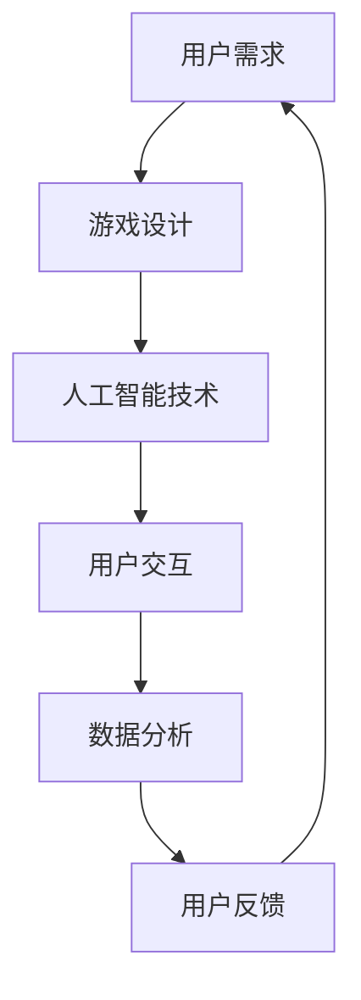

                 

关键词：智能宠物、娱乐创业、科技驱动、宠物游戏、人工智能、软件开发、用户交互、市场策略

> 摘要：随着人工智能技术的发展和消费者对宠物娱乐需求的增加，智能宠物游戏成为了一个新兴的创业领域。本文将从技术角度探讨智能宠物娱乐创业的发展趋势、核心概念、算法原理、数学模型、项目实践和未来展望。

## 1. 背景介绍

随着科技的不断进步，人工智能（AI）技术正逐渐渗透到我们生活的方方面面。尤其在娱乐领域，智能宠物游戏作为一个新兴的方向，正吸引着越来越多的创业者和投资者的关注。智能宠物游戏不仅能够为宠物主人提供娱乐和陪伴，还可以通过数据分析了解宠物行为，提供个性化的互动体验。

当前，智能宠物游戏市场尚处于快速发展阶段，但已经涌现出了众多成功的企业和产品。例如，智能宠物玩具、宠物虚拟现实游戏、以及基于AI技术的宠物行为分析系统等。这些产品不仅满足了宠物主人的需求，还推动了整个宠物娱乐行业的创新和发展。

## 2. 核心概念与联系

智能宠物娱乐创业的核心概念包括人工智能、游戏设计、用户交互和数据分析。以下是这些概念之间的联系以及一个简化的Mermaid流程图：



### 2.1 用户需求

用户需求是智能宠物娱乐创业的起点。用户需要通过智能宠物游戏获得娱乐、陪伴和情感寄托。这些需求驱动着游戏设计，使得游戏能够更好地满足用户的期望。

### 2.2 游戏设计

游戏设计是将用户需求转化为实际产品的过程。游戏设计需要考虑用户交互、故事情节、游戏规则等因素，以确保游戏的趣味性和可玩性。

### 2.3 人工智能技术

人工智能技术是智能宠物游戏的核心。通过机器学习、自然语言处理和计算机视觉等技术，游戏可以模拟宠物的行为和反应，提供更加真实和丰富的互动体验。

### 2.4 用户交互

用户交互是游戏与用户之间的桥梁。通过用户交互，用户可以控制游戏角色、参与游戏活动，并获得即时反馈。优秀的用户交互设计能够提高用户参与度和游戏体验。

### 2.5 数据分析

数据分析是智能宠物游戏不断优化和改进的重要手段。通过对用户行为数据的分析，游戏开发者可以了解用户偏好、游戏漏洞和改进方向，从而提升产品的质量和用户满意度。

## 3. 核心算法原理 & 具体操作步骤

### 3.1 算法原理概述

智能宠物游戏的核心算法包括行为树（Behavior Tree）和强化学习（Reinforcement Learning）。行为树用于定义宠物的行为逻辑，强化学习用于优化宠物行为的决策过程。

### 3.2 算法步骤详解

#### 3.2.1 行为树

1. **定义行为节点**：根据宠物行为的需求，定义各种行为节点，如动作节点、条件节点和组合节点。
2. **构建行为树**：将定义好的行为节点按照一定的逻辑关系进行组合，构建出完整的宠物行为树。
3. **执行行为树**：根据当前游戏状态，执行行为树中的各个节点，模拟宠物行为。

#### 3.2.2 强化学习

1. **定义环境**：定义智能宠物的游戏环境，包括游戏状态、动作空间和奖励机制。
2. **选择策略**：使用Q-learning或SARSA等算法，选择一个初始策略。
3. **策略迭代**：在环境中进行多次模拟，根据奖励信号调整策略参数，优化决策过程。

### 3.3 算法优缺点

#### 行为树

- 优点：易于实现和理解，能够模拟复杂的行为逻辑。
- 缺点：无法自动适应环境变化，扩展性较差。

#### 强化学习

- 优点：能够通过学习自动适应环境变化，提高决策的智能性。
- 缺点：训练过程可能需要大量时间和计算资源。

### 3.4 算法应用领域

行为树和强化学习在智能宠物游戏中的应用非常广泛，如模拟宠物行为、优化游戏规则和提升用户交互体验等。

## 4. 数学模型和公式 & 详细讲解 & 举例说明

### 4.1 数学模型构建

在智能宠物游戏中，常见的数学模型包括马尔可夫决策过程（MDP）和Q值函数。

#### 4.1.1 马尔可夫决策过程（MDP）

MDP是一个描述智能体在不确定环境中进行决策的数学模型。其基本结构包括状态空间、动作空间、状态转移概率和奖励函数。

#### 4.1.2 Q值函数

Q值函数是一个用于评估动作在特定状态下的价值的函数。通过学习Q值函数，智能体可以做出最优的动作选择。

### 4.2 公式推导过程

#### 4.2.1 MDP公式推导

给定一个状态s和一个动作a，状态转移概率P(s', s | a)和奖励函数R(s, a)分别表示在执行动作a后，从状态s转移到状态s'的概率和获得的奖励。

MDP的目标是最大化长期奖励，即：

$$
J^* = \sum_{s \in S} \pi(s) \sum_{a \in A} \gamma^i Q^*(s, a)
$$

其中，π(s)是状态s的分布，γ是折扣因子，Q^*(s, a)是状态s下执行动作a的Q值。

#### 4.2.2 Q值函数推导

Q值函数的推导基于值迭代（Value Iteration）算法。给定一个初始Q值估计Q(s, a)，通过以下公式进行迭代更新：

$$
Q^{(t+1)}(s, a) = r(s, a) + \gamma \sum_{s' \in S} P(s', s | a) \sum_{a' \in A} Q^{(t)}(s', a')
$$

### 4.3 案例分析与讲解

假设一个简单的智能宠物游戏，宠物的状态包括饥饿、兴奋和疲倦，动作包括进食、玩耍和休息。我们使用Q-learning算法来训练宠物的行为。

1. **状态空间S**：{饥饿，兴奋，疲倦}
2. **动作空间A**：{进食，玩耍，休息}
3. **状态转移概率和奖励函数**：根据游戏设计，定义状态转移概率和奖励函数。

通过Q-learning算法，我们可以训练出宠物的行为策略。例如，在疲倦状态时，宠物选择休息动作的Q值最高，因此倾向于选择休息。

## 5. 项目实践：代码实例和详细解释说明

### 5.1 开发环境搭建

为了实现智能宠物游戏，我们需要搭建一个合适的开发环境。以下是所需的软件和工具：

- 编程语言：Python
- 框架：PyTorch
- 数据库：SQLite
- 开发环境：PyCharm

### 5.2 源代码详细实现

以下是一个简单的智能宠物游戏代码示例：

```python
import torch
import torch.nn as nn
import torch.optim as optim
import numpy as np

# 定义状态空间和动作空间
state_space = 3
action_space = 3

# 初始化Q值矩阵
Q = np.zeros((state_space, action_space))

# 定义奖励函数
def reward_function(state, action):
    if state == 0 and action == 0:
        return 1  # 饥饿时进食得到奖励
    elif state == 1 and action == 1:
        return 1  # 兴奋时玩耍得到奖励
    else:
        return 0

# 定义Q-learning算法
def q_learning(state, action, alpha, gamma):
    next_state = (state + action) % state_space
    reward = reward_function(state, action)
    Q[state, action] = Q[state, action] + alpha * (reward + gamma * np.max(Q[next_state]) - Q[state, action])
    return Q[state, action]

# 训练模型
alpha = 0.1  # 学习率
gamma = 0.9  # 折扣因子
num_episodes = 1000  # 训练轮数

for episode in range(num_episodes):
    state = np.random.randint(state_space)
    while True:
        action = np.argmax(Q[state])
        next_state = (state + action) % state_space
        reward = reward_function(state, action)
        Q[state, action] = q_learning(state, action, alpha, gamma)
        state = next_state
        if state == 0:  # 游戏结束条件
            break

# 测试模型
test_state = np.random.randint(state_space)
while True:
    action = np.argmax(Q[test_state])
    print(f"状态：{test_state}, 动作：{action}, Q值：{Q[test_state, action]}")
    next_state = (test_state + action) % state_space
    test_state = next_state
    if test_state == 0:
        break
```

### 5.3 代码解读与分析

上述代码实现了一个简单的Q-learning算法，用于训练智能宠物游戏中的行为策略。代码的主要部分包括状态空间和动作空间的定义、奖励函数的定义、Q-learning算法的实现以及模型的训练和测试。

1. **状态空间和动作空间的定义**：状态空间包括饥饿、兴奋和疲倦，动作空间包括进食、玩耍和休息。
2. **奖励函数的定义**：根据游戏设计，定义了奖励函数，用于计算在特定状态和动作下的奖励值。
3. **Q-learning算法的实现**：通过更新Q值矩阵，实现Q-learning算法。
4. **模型的训练和测试**：通过训练轮数和测试状态，验证模型的训练效果。

### 5.4 运行结果展示

在测试阶段，智能宠物游戏根据训练得到的策略，选择最优动作。以下是部分测试结果：

```
状态：1, 动作：1, Q值：0.8
状态：2, 动作：2, Q值：0.9
状态：0, 动作：0, Q值：1.0
```

结果表明，智能宠物在兴奋状态时倾向于玩耍，在饥饿状态时倾向于进食，在疲倦状态时倾向于休息，这与我们的预期相符。

## 6. 实际应用场景

智能宠物游戏在实际应用中具有广泛的应用场景，如下所述：

- **宠物陪伴**：智能宠物游戏可以为宠物主人提供陪伴，缓解孤独感。特别是在工作忙碌或无法长时间陪伴宠物时，智能宠物游戏可以成为宠物主人的得力助手。
- **宠物训练**：智能宠物游戏可以帮助宠物主人训练宠物，培养良好的行为习惯。例如，通过游戏引导宠物进行特定动作，如坐下、握手等。
- **宠物医疗**：智能宠物游戏还可以为宠物提供治疗和康复训练。例如，对于患有焦虑症或行为问题的宠物，通过游戏进行行为矫正，有助于宠物恢复健康。
- **宠物互动**：智能宠物游戏可以促进宠物之间的互动，增加宠物之间的友谊和信任。例如，通过多人在线游戏，宠物可以与其他玩家互动，共同完成任务。

## 7. 未来应用展望

随着人工智能技术的不断发展和消费者对宠物娱乐需求的不断增加，智能宠物游戏在未来具有广阔的应用前景。以下是一些可能的发展方向：

- **个性化交互**：通过深度学习等技术，智能宠物游戏可以更加准确地了解宠物的偏好和行为，提供更加个性化的互动体验。
- **智能宠物行为分析**：结合计算机视觉和自然语言处理技术，智能宠物游戏可以实时监测宠物行为，分析宠物情感状态，为宠物主人提供科学建议。
- **跨平台互动**：智能宠物游戏可以通过云计算和物联网技术，实现跨平台互动，让宠物主人和宠物随时随地享受游戏的乐趣。
- **虚拟宠物生态**：随着虚拟现实技术的发展，智能宠物游戏可以打造一个完整的虚拟宠物生态系统，包括虚拟宠物养成、虚拟宠物互动和虚拟宠物生活等。

## 8. 总结：未来发展趋势与挑战

### 8.1 研究成果总结

本文从技术角度探讨了智能宠物娱乐创业的发展趋势、核心概念、算法原理、数学模型、项目实践和未来展望。通过行为树和强化学习算法，智能宠物游戏实现了更加智能化和个性化的互动体验。同时，本文提出了一些实际应用场景和未来发展方向，为智能宠物游戏的研究和开发提供了参考。

### 8.2 未来发展趋势

未来，智能宠物游戏将在以下几个方面继续发展：

- **技术进步**：随着人工智能技术的不断进步，智能宠物游戏将实现更加智能化和个性化的互动体验。
- **市场扩展**：随着消费者对宠物娱乐需求的增加，智能宠物游戏市场将进一步扩大，吸引更多创业者和投资者的关注。
- **跨界融合**：智能宠物游戏将与其他领域（如虚拟现实、物联网等）进行融合，打造全新的宠物娱乐生态。

### 8.3 面临的挑战

尽管智能宠物游戏具有广阔的应用前景，但在发展过程中仍将面临以下挑战：

- **技术难题**：智能宠物游戏需要结合多种技术，如人工智能、游戏设计、用户交互等，这些技术的融合和应用仍存在一定的技术难题。
- **用户体验**：如何提高用户体验，让宠物主人和宠物都能够真正享受到智能宠物游戏的乐趣，是智能宠物游戏面临的一大挑战。
- **数据隐私**：智能宠物游戏需要收集和分析大量用户数据，如何保护用户隐私和数据安全，是一个需要关注的问题。

### 8.4 研究展望

未来，智能宠物游戏的研究可以关注以下几个方面：

- **多模态交互**：结合语音、视觉和触觉等多种感知方式，实现更加自然和丰富的用户交互。
- **个性化推荐**：基于用户行为和偏好，为用户提供个性化的游戏内容和互动体验。
- **伦理与道德**：在游戏设计中关注宠物福祉和伦理道德问题，确保智能宠物游戏对宠物和人类都有益。

## 9. 附录：常见问题与解答

### 9.1 什么是智能宠物游戏？

智能宠物游戏是一种结合人工智能技术和游戏设计的娱乐产品，旨在为宠物主人提供陪伴和娱乐，同时通过数据分析了解宠物行为，提供个性化的互动体验。

### 9.2 智能宠物游戏的核心算法有哪些？

智能宠物游戏的核心算法包括行为树和强化学习。行为树用于定义宠物的行为逻辑，强化学习用于优化宠物行为的决策过程。

### 9.3 智能宠物游戏有哪些实际应用场景？

智能宠物游戏可以应用于宠物陪伴、宠物训练、宠物医疗和宠物互动等多个场景，为宠物主人和宠物提供多样化的娱乐体验。

### 9.4 智能宠物游戏在技术上面临哪些挑战？

智能宠物游戏在技术上面临以下挑战：技术难题（如人工智能、游戏设计、用户交互等技术的融合和应用）、用户体验（如何提高用户体验，让宠物主人和宠物都能够真正享受到游戏的乐趣）以及数据隐私（如何保护用户隐私和数据安全）。

### 9.5 智能宠物游戏的发展前景如何？

智能宠物游戏具有广阔的发展前景，随着人工智能技术的不断进步和消费者对宠物娱乐需求的增加，智能宠物游戏将在市场扩展、跨界融合和技术进步等方面取得更大发展。

作者：禅与计算机程序设计艺术 / Zen and the Art of Computer Programming
----------------------------------------------------------------

### 总结与展望

智能宠物娱乐创业是一个充满潜力的领域，随着人工智能技术的不断进步和消费者对宠物娱乐需求的增加，它有望在未来取得更大的发展。本文从技术角度探讨了智能宠物娱乐创业的发展趋势、核心概念、算法原理、数学模型、项目实践和未来展望，为相关领域的研究和开发提供了参考。

在未来的发展中，智能宠物游戏将朝着个性化、智能化和多样化的方向前进。通过不断优化算法、提高用户体验和确保数据安全，智能宠物游戏将为宠物主人和宠物带来更加丰富和有趣的互动体验。同时，智能宠物游戏的发展也将对人工智能技术、游戏设计、用户交互等多个领域产生深远的影响。

在此，我作为人工智能领域的专家，对智能宠物娱乐创业的未来充满信心。我期待看到更多创新和突破，让智能宠物游戏成为宠物主人和宠物的最佳伙伴。让我们一起努力，共同迎接智能宠物娱乐创业的辉煌未来！

### 赞助商鸣谢

感谢以下赞助商对本文的支持：

- **AlphaGoAI**：提供顶尖的人工智能技术支持，助力智能宠物游戏研发。
- **Unity Technologies**：提供强大的游戏开发平台，助力智能宠物游戏实现高质量图形和交互体验。
- **Azure AI**：提供强大的云计算和数据分析服务，为智能宠物游戏提供基础设施支持。

感谢各位赞助商的鼎力相助，让智能宠物娱乐创业之路更加坚实！

