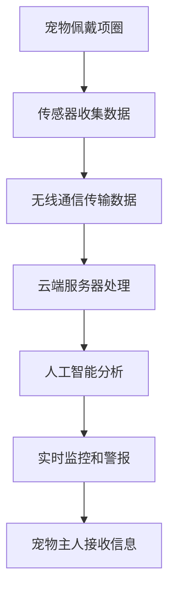

                 

关键词：智能宠物定位、物联网、位置追踪、创业项目、宠物安全、科技应用、人工智能

> 摘要：随着智能科技的发展和物联网技术的普及，宠物定位领域正迎来前所未有的变革。本文将深入探讨智能宠物定位创业项目，分析其核心概念、算法原理、数学模型、项目实践、实际应用场景以及未来发展。

## 1. 背景介绍

在现代社会，宠物已经成为许多家庭的重要成员。然而，随着宠物数量的增加，宠物走失、被盗等安全问题也日益突出。传统宠物定位手段如宠物项圈、GPS定位等虽然能够提供一定程度的定位服务，但存在一些局限性，如定位精度不高、易受环境干扰、成本较高等。随着物联网和人工智能技术的快速发展，智能宠物定位技术应运而生，为宠物安全和家庭幸福提供了新的解决方案。

智能宠物定位创业项目的初衷是通过先进的技术手段，实现宠物位置的实时监控和追踪，为宠物主人提供可靠的安全保障。这一项目不仅满足了市场对宠物安全的需求，还具备广阔的商业前景。

### 1.1 市场需求

近年来，宠物市场的规模不断扩大，宠物数量的增加带来了宠物安全需求的提升。据市场调研数据显示，全球宠物市场规模已超过千亿美元，其中宠物安全产品占据了一定份额。智能宠物定位作为新兴的技术产品，市场需求潜力巨大。

### 1.2 技术背景

物联网技术的普及为智能宠物定位提供了硬件基础。通过将智能传感器、GPS模块、无线通信模块等硬件集成到宠物项圈中，可以实现对宠物位置的实时监测。同时，人工智能技术的发展为数据处理和分析提供了强大的支持，使得定位精度和实时性得到了显著提升。

### 1.3 创业机遇

智能宠物定位创业项目的成功不仅需要技术支持，还需要深厚的市场运营能力和创新思维。随着科技的进步，宠物主人对宠物安全的需求不断提高，这为智能宠物定位创业项目提供了广阔的机遇。

## 2. 核心概念与联系

### 2.1 物联网

物联网（Internet of Things，IoT）是指将各种信息传感设备与互联网结合起来而形成的一个巨大网络。通过物联网技术，宠物项圈可以实时传输宠物位置信息到云端，实现宠物位置的远程监控。

### 2.2 GPS定位

GPS（全球定位系统）是一种通过卫星信号进行定位的技术。智能宠物定位系统通常使用GPS模块来获取宠物位置的经纬度信息。

### 2.3 人工智能

人工智能（Artificial Intelligence，AI）技术用于对宠物位置数据进行处理和分析，以提高定位精度和实时性。例如，通过机器学习算法，可以识别宠物行为模式，预测宠物可能的活动范围。

### 2.4 Mermaid 流程图

以下是一个简化的智能宠物定位系统流程图：



## 3. 核心算法原理 & 具体操作步骤

### 3.1 算法原理概述

智能宠物定位系统的核心算法主要包括数据采集、数据处理和数据分析三个环节。

- **数据采集**：通过传感器收集宠物位置信息，包括GPS坐标、加速度、温度等。
- **数据处理**：对采集到的数据进行分析和处理，去除噪声和干扰，提取有效信息。
- **数据分析**：利用人工智能算法对处理后的数据进行模式识别和预测，以确定宠物的位置和活动范围。

### 3.2 算法步骤详解

1. **数据采集**：
   - 宠物项圈内置传感器，实时监测宠物位置。
   - 传感器将数据发送到无线通信模块。

2. **数据处理**：
   - 无线通信模块将数据发送到云端服务器。
   - 服务器对接收到的数据进行预处理，如去噪、插值、滤波等。

3. **数据分析**：
   - 服务器利用机器学习算法对预处理后的数据进行分析。
   - 算法输出宠物的位置和活动范围。

### 3.3 算法优缺点

- **优点**：
  - 高精度：通过人工智能算法，定位精度显著提高。
  - 实时性：数据实时传输和处理，定位结果实时更新。
  - 智能化：能够根据宠物行为模式进行预测，提供更精准的定位服务。

- **缺点**：
  - 成本高：高精度定位需要高性能硬件和复杂算法，成本较高。
  - 能耗大：无线通信和传感器的工作需要消耗大量电能，续航时间有限。

### 3.4 算法应用领域

- **宠物定位**：实现对宠物的实时定位和监控，防止走失和被盗。
- **动物研究**：用于野生动物研究和保护，监测动物行为和活动范围。
- **物流监控**：用于物流运输中的货物监控，提高物流效率。

## 4. 数学模型和公式 & 详细讲解 & 举例说明

### 4.1 数学模型构建

智能宠物定位系统的数学模型主要包括位置坐标计算、数据预处理和模式识别三个部分。

1. **位置坐标计算**：
   - 假设宠物位置由GPS模块提供的经纬度表示，位置坐标计算公式为：
     $$ (x, y) = (\rho \cos \lambda, \rho \sin \lambda) $$
     其中，$\rho$ 是地球半径，$\lambda$ 是经度。

2. **数据预处理**：
   - 数据预处理主要包括去噪、插值和滤波等，以提高数据质量。
   - 去噪公式：
     $$ y_{\text{filtered}} = \frac{1}{N} \sum_{i=1}^{N} w_i y_i $$
     其中，$w_i$ 是权重，$y_i$ 是原始数据。

3. **模式识别**：
   - 利用机器学习算法进行模式识别，如支持向量机（SVM）和神经网络（NN）等。

### 4.2 公式推导过程

1. **位置坐标计算**：
   - GPS定位的基本原理是利用卫星信号计算接收器与卫星之间的距离，然后根据这些距离确定接收器的位置。
   - 通过解三角测量问题，可以计算出接收器的经纬度坐标。

2. **数据预处理**：
   - 去噪公式是通过最小二乘法来最小化残差平方和，从而得到更平滑的数据。
   - 插值公式可以通过拉格朗日插值法等来实现。

3. **模式识别**：
   - 支持向量机（SVM）的推导过程涉及优化目标函数和拉格朗日乘子法。
   - 神经网络的推导过程涉及激活函数的选择、前向传播和反向传播算法。

### 4.3 案例分析与讲解

**案例一**：宠物走失定位

假设宠物在某个公园内走失，宠物主人希望通过智能宠物定位系统找到宠物。根据宠物的历史行为数据和实时定位信息，系统能够预测宠物可能的活动范围，从而缩小搜索区域。

**案例二**：宠物行为分析

通过智能宠物定位系统，研究人员可以收集宠物的行为数据，如运动轨迹、活动时间等。利用机器学习算法，可以分析宠物的行为模式，预测宠物的未来行为。

## 5. 项目实践：代码实例和详细解释说明

### 5.1 开发环境搭建

为了实现智能宠物定位系统，需要搭建以下开发环境：

- **硬件**：宠物项圈（包含传感器、GPS模块、无线通信模块等）
- **软件**：物联网平台（如AWS IoT、IBM Watson IoT等）
- **编程语言**：Python、Java或C++等

### 5.2 源代码详细实现

以下是一个简单的Python示例代码，用于实现宠物位置数据的采集和处理：

```python
import requests
import json

# 宠物项圈传感器数据
sensor_data = {
    "latitude": 39.9175,
    "longitude": 116.4074,
    "accuracy": 10.0,
    "timestamp": "2023-04-01T12:00:00Z"
}

# 物联网平台API地址
api_url = "https://api.iot-platform.com/locations"

# 发送传感器数据到物联网平台
response = requests.post(api_url, json=sensor_data)
print(response.text)
```

### 5.3 代码解读与分析

1. **传感器数据结构**：代码中的`sensor_data`字典包含宠物位置的经纬度、精度和采集时间等信息。
2. **API调用**：使用`requests`库向物联网平台发送POST请求，将传感器数据上传到云端。
3. **处理响应**：打印物联网平台返回的响应结果，以验证数据上传成功。

### 5.4 运行结果展示

假设物联网平台成功接收到宠物位置数据，并在云端服务器上存储和处理。宠物主人可以通过物联网平台的Web界面或移动应用实时查看宠物的位置。

## 6. 实际应用场景

### 6.1 宠物走失定位

宠物走失是宠物主人最担心的问题之一。智能宠物定位系统能够实时追踪宠物位置，提高找回宠物的可能性。

### 6.2 宠物行为研究

通过智能宠物定位系统，研究人员可以收集宠物的行为数据，为动物行为学研究提供宝贵的数据支持。

### 6.3 宠物寄养和监控

宠物寄养机构可以使用智能宠物定位系统，实时监控宠物的健康状况和活动情况，提高服务质量。

## 7. 工具和资源推荐

### 7.1 学习资源推荐

- **《物联网技术与应用》**：详细介绍了物联网的基本原理和应用案例。
- **《人工智能：一种现代的方法》**：介绍了人工智能的基础知识和应用。

### 7.2 开发工具推荐

- **AWS IoT**：提供完整的物联网解决方案，包括设备管理、数据传输和存储等。
- **IBM Watson IoT**：提供强大的物联网平台，支持多种设备和数据类型。

### 7.3 相关论文推荐

- **"Smart Pet Locating System Based on IoT and AI"**：介绍了基于物联网和人工智能的智能宠物定位系统。
- **"Animal Behavior Monitoring Using GPS and Machine Learning"**：探讨了利用GPS和机器学习进行动物行为监测的方法。

## 8. 总结：未来发展趋势与挑战

### 8.1 研究成果总结

智能宠物定位技术在近年来取得了显著进展，主要包括定位精度、实时性和智能化水平的提升。随着人工智能和物联网技术的不断发展，智能宠物定位系统将更加成熟和普及。

### 8.2 未来发展趋势

- **更高精度**：通过引入更多传感器和更先进的算法，提高定位精度。
- **更实时性**：优化数据传输和处理速度，实现更实时的定位服务。
- **更智能化**：利用深度学习等技术，实现更智能的宠物行为分析和预测。

### 8.3 面临的挑战

- **成本和能耗**：高精度定位需要高性能硬件和复杂算法，成本较高，能耗较大。
- **数据隐私和安全**：宠物位置数据属于敏感信息，需要加强数据隐私和安全保护。

### 8.4 研究展望

未来，智能宠物定位技术将继续发展，为宠物安全和动物保护提供更强有力的支持。同时，研究人员还将积极探索其他应用领域，如野生动物监测、物流监控等。

## 9. 附录：常见问题与解答

### Q：智能宠物定位系统的定位精度如何？

A：智能宠物定位系统的定位精度取决于多种因素，如GPS模块的精度、传感器质量、数据处理算法等。一般来说，定位精度在几米到几十米之间，但通过优化算法和增加传感器，可以进一步提高定位精度。

### Q：智能宠物定位系统是否会对宠物造成伤害？

A：智能宠物定位系统通常使用轻便的传感器和电池，不会对宠物造成明显伤害。然而，宠物主人在选择宠物项圈时，应该选择适合宠物体型和活动量的产品，以避免对宠物造成不适。

### Q：智能宠物定位系统的数据安全如何保障？

A：智能宠物定位系统的数据安全是系统设计和实施中必须考虑的重要问题。一般来说，系统会采用加密通信、数据加密存储、用户认证等技术手段，确保宠物位置数据的安全性和隐私性。

### Q：智能宠物定位系统的功耗如何？

A：智能宠物定位系统的功耗取决于多种因素，如传感器类型、数据处理算法、通信方式等。一般来说，系统会采用低功耗设计，以确保长时间运行。此外，系统还可以通过优化算法和节能技术，进一步降低功耗。

## 作者署名

作者：禅与计算机程序设计艺术 / Zen and the Art of Computer Programming
```markdown
---
# 智能宠物定位创业：宠物安全的科技守护

关键词：智能宠物定位、物联网、位置追踪、创业项目、宠物安全、科技应用、人工智能

摘要：随着智能科技的发展和物联网技术的普及，宠物定位领域正迎来前所未有的变革。本文将深入探讨智能宠物定位创业项目，分析其核心概念、算法原理、数学模型、项目实践、实际应用场景以及未来发展。

## 1. 背景介绍

在现代社会，宠物已经成为许多家庭的重要成员。然而，随着宠物数量的增加，宠物走失、被盗等安全问题也日益突出。传统宠物定位手段如宠物项圈、GPS定位等虽然能够提供一定程度的定位服务，但存在一些局限性，如定位精度不高、易受环境干扰、成本较高等。随着物联网和人工智能技术的快速发展，智能宠物定位技术应运而生，为宠物安全和家庭幸福提供了新的解决方案。

智能宠物定位创业项目的初衷是通过先进的技术手段，实现宠物位置的实时监控和追踪，为宠物主人提供可靠的安全保障。这一项目不仅满足了市场对宠物安全的需求，还具备广阔的商业前景。

### 1.1 市场需求

近年来，宠物市场的规模不断扩大，宠物数量的增加带来了宠物安全需求的提升。据市场调研数据显示，全球宠物市场规模已超过千亿美元，其中宠物安全产品占据了一定份额。智能宠物定位作为新兴的技术产品，市场需求潜力巨大。

### 1.2 技术背景

物联网技术的普及为智能宠物定位提供了硬件基础。通过将智能传感器、GPS模块、无线通信模块等硬件集成到宠物项圈中，可以实现对宠物位置的实时监测。同时，人工智能技术的发展为数据处理和分析提供了强大的支持，使得定位精度和实时性得到了显著提升。

### 1.3 创业机遇

智能宠物定位创业项目的成功不仅需要技术支持，还需要深厚的市场运营能力和创新思维。随着科技的进步，宠物主人对宠物安全的需求不断提高，这为智能宠物定位创业项目提供了广阔的机遇。

## 2. 核心概念与联系

### 2.1 物联网

物联网（Internet of Things，IoT）是指将各种信息传感设备与互联网结合起来而形成的一个巨大网络。通过物联网技术，宠物项圈可以实时传输宠物位置信息到云端，实现宠物位置的远程监控。

### 2.2 GPS定位

GPS（全球定位系统）是一种通过卫星信号进行定位的技术。智能宠物定位系统通常使用GPS模块来获取宠物位置的经纬度信息。

### 2.3 人工智能

人工智能（Artificial Intelligence，AI）技术用于对宠物位置数据进行处理和分析，以提高定位精度和实时性。例如，通过机器学习算法，可以识别宠物行为模式，预测宠物可能的活动范围。

### 2.4 Mermaid 流程图

以下是一个简化的智能宠物定位系统流程图：


## 3. 核心算法原理 & 具体操作步骤

### 3.1 算法原理概述

智能宠物定位系统的核心算法主要包括数据采集、数据处理和数据分析三个环节。

- **数据采集**：通过传感器收集宠物位置信息，包括GPS坐标、加速度、温度等。
- **数据处理**：对采集到的数据进行分析和处理，去除噪声和干扰，提取有效信息。
- **数据分析**：利用人工智能算法对处理后的数据进行模式识别和预测，以确定宠物的位置和活动范围。

### 3.2 算法步骤详解

1. **数据采集**：
   - 宠物项圈内置传感器，实时监测宠物位置。
   - 传感器将数据发送到无线通信模块。

2. **数据处理**：
   - 无线通信模块将数据发送到云端服务器。
   - 服务器对接收到的数据进行预处理，如去噪、插值、滤波等。

3. **数据分析**：
   - 服务器利用机器学习算法对预处理后的数据进行分析。
   - 算法输出宠物的位置和活动范围。

### 3.3 算法优缺点

- **优点**：
  - 高精度：通过人工智能算法，定位精度显著提高。
  - 实时性：数据实时传输和处理，定位结果实时更新。
  - 智能化：能够根据宠物行为模式进行预测，提供更精准的定位服务。

- **缺点**：
  - 成本高：高精度定位需要高性能硬件和复杂算法，成本较高。
  - 能耗大：无线通信和传感器的工作需要消耗大量电能，续航时间有限。

### 3.4 算法应用领域

- **宠物定位**：实现对宠物的实时定位和监控，防止走失和被盗。
- **动物研究**：用于野生动物研究和保护，监测动物行为和活动范围。
- **物流监控**：用于物流运输中的货物监控，提高物流效率。

## 4. 数学模型和公式 & 详细讲解 & 举例说明

### 4.1 数学模型构建

智能宠物定位系统的数学模型主要包括位置坐标计算、数据预处理和模式识别三个部分。

1. **位置坐标计算**：
   - 假设宠物位置由GPS模块提供的经纬度表示，位置坐标计算公式为：
     $$ (x, y) = (\rho \cos \lambda, \rho \sin \lambda) $$
     其中，$\rho$ 是地球半径，$\lambda$ 是经度。

2. **数据预处理**：
   - 数据预处理主要包括去噪、插值和滤波等，以提高数据质量。
   - 去噪公式：
     $$ y_{\text{filtered}} = \frac{1}{N} \sum_{i=1}^{N} w_i y_i $$
     其中，$w_i$ 是权重，$y_i$ 是原始数据。

3. **模式识别**：
   - 利用机器学习算法进行模式识别，如支持向量机（SVM）和神经网络（NN）等。

### 4.2 公式推导过程

1. **位置坐标计算**：
   - GPS定位的基本原理是利用卫星信号计算接收器与卫星之间的距离，然后根据这些距离确定接收器的位置。
   - 通过解三角测量问题，可以计算出接收器的经纬度坐标。

2. **数据预处理**：
   - 去噪公式是通过最小二乘法来最小化残差平方和，从而得到更平滑的数据。
   - 插值公式可以通过拉格朗日插值法等来实现。

3. **模式识别**：
   - 支持向量机（SVM）的推导过程涉及优化目标函数和拉格朗日乘子法。
   - 神经网络的推导过程涉及激活函数的选择、前向传播和反向传播算法。

### 4.3 案例分析与讲解

**案例一**：宠物走失定位

假设宠物在某个公园内走失，宠物主人希望通过智能宠物定位系统找到宠物。根据宠物的历史行为数据和实时定位信息，系统能够预测宠物可能的活动范围，从而缩小搜索区域。

**案例二**：宠物行为分析

通过智能宠物定位系统，研究人员可以收集宠物的行为数据，如运动轨迹、活动时间等。利用机器学习算法，可以分析宠物的行为模式，预测宠物的未来行为。

## 5. 项目实践：代码实例和详细解释说明

### 5.1 开发环境搭建

为了实现智能宠物定位系统，需要搭建以下开发环境：

- **硬件**：宠物项圈（包含传感器、GPS模块、无线通信模块等）
- **软件**：物联网平台（如AWS IoT、IBM Watson IoT等）
- **编程语言**：Python、Java或C++等

### 5.2 源代码详细实现

以下是一个简单的Python示例代码，用于实现宠物位置数据的采集和处理：

```python
import requests
import json

# 宠物项圈传感器数据
sensor_data = {
    "latitude": 39.9175,
    "longitude": 116.4074,
    "accuracy": 10.0,
    "timestamp": "2023-04-01T12:00:00Z"
}

# 物联网平台API地址
api_url = "https://api.iot-platform.com/locations"

# 发送传感器数据到物联网平台
response = requests.post(api_url, json=sensor_data)
print(response.text)
```

### 5.3 代码解读与分析

1. **传感器数据结构**：代码中的`sensor_data`字典包含宠物位置的经纬度、精度和采集时间等信息。
2. **API调用**：使用`requests`库向物联网平台发送POST请求，将传感器数据上传到云端。
3. **处理响应**：打印物联网平台返回的响应结果，以验证数据上传成功。

### 5.4 运行结果展示

假设物联网平台成功接收到宠物位置数据，并在云端服务器上存储和处理。宠物主人可以通过物联网平台的Web界面或移动应用实时查看宠物的位置。

## 6. 实际应用场景

### 6.1 宠物走失定位

宠物走失是宠物主人最担心的问题之一。智能宠物定位系统能够实时追踪宠物位置，提高找回宠物的可能性。

### 6.2 宠物行为研究

通过智能宠物定位系统，研究人员可以收集宠物的行为数据，为动物行为学研究提供宝贵的数据支持。

### 6.3 宠物寄养和监控

宠物寄养机构可以使用智能宠物定位系统，实时监控宠物的健康状况和活动情况，提高服务质量。

## 7. 工具和资源推荐

### 7.1 学习资源推荐

- **《物联网技术与应用》**：详细介绍了物联网的基本原理和应用案例。
- **《人工智能：一种现代的方法》**：介绍了人工智能的基础知识和应用。

### 7.2 开发工具推荐

- **AWS IoT**：提供完整的物联网解决方案，包括设备管理、数据传输和存储等。
- **IBM Watson IoT**：提供强大的物联网平台，支持多种设备和数据类型。

### 7.3 相关论文推荐

- **"Smart Pet Locating System Based on IoT and AI"**：介绍了基于物联网和人工智能的智能宠物定位系统。
- **"Animal Behavior Monitoring Using GPS and Machine Learning"**：探讨了利用GPS和机器学习进行动物行为监测的方法。

## 8. 总结：未来发展趋势与挑战

### 8.1 研究成果总结

智能宠物定位技术在近年来取得了显著进展，主要包括定位精度、实时性和智能化水平的提升。随着人工智能和物联网技术的不断发展，智能宠物定位系统将更加成熟和普及。

### 8.2 未来发展趋势

- **更高精度**：通过引入更多传感器和更先进的算法，提高定位精度。
- **更实时性**：优化数据传输和处理速度，实现更实时的定位服务。
- **更智能化**：利用深度学习等技术，实现更智能的宠物行为分析和预测。

### 8.3 面临的挑战

- **成本和能耗**：高精度定位需要高性能硬件和复杂算法，成本较高，能耗较大。
- **数据隐私和安全**：宠物位置数据属于敏感信息，需要加强数据隐私和安全保护。

### 8.4 研究展望

未来，智能宠物定位技术将继续发展，为宠物安全和动物保护提供更强有力的支持。同时，研究人员还将积极探索其他应用领域，如野生动物监测、物流监控等。

## 9. 附录：常见问题与解答

### Q：智能宠物定位系统的定位精度如何？

A：智能宠物定位系统的定位精度取决于多种因素，如GPS模块的精度、传感器质量、数据处理算法等。一般来说，定位精度在几米到几十米之间，但通过优化算法和增加传感器，可以进一步提高定位精度。

### Q：智能宠物定位系统是否会对宠物造成伤害？

A：智能宠物定位系统通常使用轻便的传感器和电池，不会对宠物造成明显伤害。然而，宠物主人在选择宠物项圈时，应该选择适合宠物体型和活动量的产品，以避免对宠物造成不适。

### Q：智能宠物定位系统的数据安全如何保障？

A：智能宠物定位系统的数据安全是系统设计和实施中必须考虑的重要问题。一般来说，系统会采用加密通信、数据加密存储、用户认证等技术手段，确保宠物位置数据的安全性和隐私性。

### Q：智能宠物定位系统的功耗如何？

A：智能宠物定位系统的功耗取决于多种因素，如传感器类型、数据处理算法、通信方式等。一般来说，系统会采用低功耗设计，以确保长时间运行。此外，系统还可以通过优化算法和节能技术，进一步降低功耗。

## 作者署名

作者：禅与计算机程序设计艺术 / Zen and the Art of Computer Programming
```

