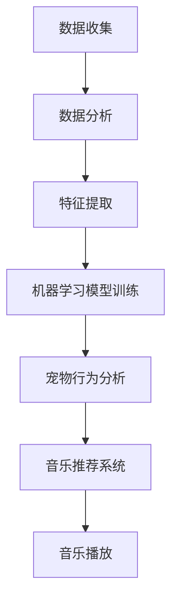

                 

关键词：智能宠物、情绪音乐、数据分析、心理舒缓、机器学习、宠物行为分析

> 摘要：随着宠物经济的蓬勃发展，宠物情绪音乐作为一种新兴的宠物心理舒缓方式，正逐渐引起广泛关注。本文将从人工智能技术出发，探讨如何利用数据分析和机器学习，打造智能宠物情绪音乐创业项目，为宠物主人提供更专业、个性化的宠物心理舒缓服务。

## 1. 背景介绍

近年来，随着人们生活水平的提高和生活方式的改变，宠物已经成为越来越多家庭的陪伴。然而，随着宠物数量的增加，宠物的心理健康问题也逐渐受到关注。宠物情绪音乐作为一种新兴的宠物心理舒缓方式，通过特定的音乐节奏和旋律，对宠物的情绪产生积极的影响，从而改善宠物的心理健康。

### 1.1 宠物情绪音乐的起源与发展

宠物情绪音乐最早起源于对人类音乐疗法的借鉴。音乐疗法是一种通过音乐对人的心理状态进行调节和改善的治疗方法。在认识到音乐的积极作用后，人们开始探索将这一方法应用到宠物身上。早期的宠物情绪音乐主要是基于人类音乐疗法的理论，通过播放轻柔、舒缓的音乐来帮助宠物放松情绪。

随着人工智能技术的不断发展，尤其是机器学习和数据分析技术的应用，宠物情绪音乐逐渐从简单的音乐播放发展为一种智能化的心理舒缓方式。通过分析宠物的行为数据，智能宠物情绪音乐系统可以根据宠物的实时情绪状态，自动选择合适的音乐进行播放，从而实现更加精准的心理舒缓效果。

### 1.2 宠物情绪音乐的应用场景

宠物情绪音乐的应用场景非常广泛，包括但不限于以下几个方面：

1. **宠物护理**：在宠物医院、宠物美容院等宠物服务场所，可以通过播放宠物情绪音乐来帮助宠物放松，减少它们的焦虑和恐惧。

2. **宠物寄养**：在宠物寄养中心，宠物情绪音乐可以缓解宠物因分离焦虑而引起的情绪波动。

3. **家庭宠物**：在家居环境中，宠物情绪音乐可以帮助宠物主人在忙碌时照顾宠物，同时也能提高宠物的幸福感和健康状态。

4. **宠物训练**：在宠物训练过程中，宠物情绪音乐可以帮助宠物更好地接受训练，减少训练过程中的压力和焦虑。

## 2. 核心概念与联系

为了更好地理解智能宠物情绪音乐创业项目的实现过程，我们首先需要了解几个核心概念及其相互关系。

### 2.1 数据分析

数据分析是智能宠物情绪音乐创业项目的基础。通过对宠物的行为数据、生理数据和环境数据等进行分析，我们可以了解宠物的情绪状态和行为特征，从而为音乐选择提供依据。

### 2.2 机器学习

机器学习是数据分析的重要工具。通过训练机器学习模型，我们可以从大量的行为数据中提取出有用的特征，并建立情绪状态与音乐之间的关联。

### 2.3 宠物行为分析

宠物行为分析是智能宠物情绪音乐创业项目的核心。通过监测宠物的行为，如活动量、睡眠状态、面部表情等，我们可以实时了解宠物的情绪状态，为音乐选择提供实时依据。

### 2.4 音乐推荐系统

音乐推荐系统是智能宠物情绪音乐创业项目的最终应用。通过结合数据分析、机器学习和宠物行为分析的结果，我们可以为宠物推荐最适合当前情绪状态的音乐。

### 2.5 Mermaid 流程图

下面是一个简化的 Mermaid 流程图，展示了智能宠物情绪音乐创业项目的核心流程：



## 3. 核心算法原理 & 具体操作步骤

### 3.1 算法原理概述

智能宠物情绪音乐创业项目的核心算法主要包括以下几个部分：

1. **数据分析**：通过对宠物的行为数据、生理数据和环境数据等进行分析，提取出宠物的情绪特征。
2. **机器学习模型训练**：利用提取出的情绪特征，训练机器学习模型，建立情绪状态与音乐之间的关联。
3. **宠物行为分析**：通过实时监测宠物的行为，如活动量、睡眠状态、面部表情等，获取宠物的实时情绪状态。
4. **音乐推荐系统**：结合机器学习模型和宠物行为分析的结果，为宠物推荐最适合当前情绪状态的音乐。
5. **音乐播放**：根据音乐推荐系统的结果，播放适合的音乐。

### 3.2 算法步骤详解

下面是智能宠物情绪音乐创业项目的具体操作步骤：

1. **数据收集**：收集宠物的行为数据、生理数据和环境数据等，如活动量、睡眠状态、面部表情等。
2. **数据预处理**：对收集到的数据进行分析和清洗，去除噪声和异常值，为后续分析做准备。
3. **特征提取**：利用数据预处理后的数据，提取宠物的情绪特征，如情绪状态、活跃度等。
4. **机器学习模型训练**：使用提取出的情绪特征，训练机器学习模型，建立情绪状态与音乐之间的关联。
5. **宠物行为分析**：通过实时监测宠物的行为，如活动量、睡眠状态、面部表情等，获取宠物的实时情绪状态。
6. **音乐推荐系统**：结合机器学习模型和宠物行为分析的结果，为宠物推荐最适合当前情绪状态的音乐。
7. **音乐播放**：根据音乐推荐系统的结果，播放适合的音乐。

### 3.3 算法优缺点

**优点**：

1. **个性化**：根据宠物的实时情绪状态，为宠物推荐最适合的音乐，实现个性化心理舒缓。
2. **实时性**：通过实时监测宠物行为，及时调整音乐播放，提高心理舒缓效果。
3. **自动化**：利用机器学习模型和数据分析技术，实现自动化音乐推荐，降低人力成本。

**缺点**：

1. **数据依赖**：算法的性能依赖于数据的质量和数量，数据收集和处理过程需要大量人力和时间。
2. **算法复杂性**：机器学习模型的训练和优化过程较为复杂，需要专业的技术支持。

### 3.4 算法应用领域

智能宠物情绪音乐创业项目的算法主要应用于以下几个方面：

1. **宠物护理**：在宠物医院、宠物美容院等宠物服务场所，通过智能宠物情绪音乐系统，帮助宠物放松，提高护理效果。
2. **宠物寄养**：在宠物寄养中心，通过智能宠物情绪音乐系统，缓解宠物因分离焦虑而引起的情绪波动。
3. **家庭宠物**：在家居环境中，通过智能宠物情绪音乐系统，提高宠物的幸福感和健康状态。
4. **宠物训练**：在宠物训练过程中，通过智能宠物情绪音乐系统，帮助宠物更好地接受训练。

## 4. 数学模型和公式 & 详细讲解 & 举例说明

### 4.1 数学模型构建

智能宠物情绪音乐创业项目的核心数学模型主要包括情绪特征提取模型和音乐推荐模型。

1. **情绪特征提取模型**：

情绪特征提取模型的目标是提取宠物的情绪特征，如情绪状态、活跃度等。假设我们有 $n$ 个情绪特征，分别为 $x_1, x_2, ..., x_n$，则情绪特征提取模型可以表示为：

$$
y = f(x_1, x_2, ..., x_n)
$$

其中，$y$ 表示情绪特征，$f$ 表示情绪特征提取函数。

2. **音乐推荐模型**：

音乐推荐模型的目标是根据宠物的情绪特征，推荐最适合的音乐。假设我们有 $m$ 首音乐，分别为 $m_1, m_2, ..., m_m$，则音乐推荐模型可以表示为：

$$
r_i = g(y_1, y_2, ..., y_n)
$$

其中，$r_i$ 表示第 $i$ 首音乐的推荐分数，$g$ 表示音乐推荐函数。

### 4.2 公式推导过程

1. **情绪特征提取模型推导**：

情绪特征提取模型的推导过程主要包括两个方面：

- **数据预处理**：对收集到的行为数据、生理数据和环境数据等进行预处理，去除噪声和异常值，提高数据质量。
- **特征提取**：利用预处理后的数据，提取宠物的情绪特征，如情绪状态、活跃度等。

2. **音乐推荐模型推导**：

音乐推荐模型的推导过程主要包括两个方面：

- **机器学习模型训练**：利用提取出的情绪特征，训练机器学习模型，建立情绪状态与音乐之间的关联。
- **音乐推荐策略**：根据机器学习模型的结果，设计音乐推荐策略，为宠物推荐最适合的音乐。

### 4.3 案例分析与讲解

假设我们收集到了一只宠物狗的行为数据，包括活动量、睡眠状态、面部表情等，通过情绪特征提取模型，我们提取出了宠物的情绪状态和活跃度等特征。接下来，我们利用音乐推荐模型，为这只宠物狗推荐适合的音乐。

1. **情绪特征提取**：

假设我们提取出的情绪特征如下：

- 情绪状态：放松
- 活跃度：较低

2. **音乐推荐**：

根据音乐推荐模型，我们得到以下推荐音乐：

- 轻柔的钢琴曲
- 舒缓的民谣
- 轻松的爵士乐

接下来，我们将根据宠物的情绪状态和活跃度，选择适合的音乐进行播放。

## 5. 项目实践：代码实例和详细解释说明

### 5.1 开发环境搭建

为了实现智能宠物情绪音乐创业项目，我们需要搭建一个完整的开发环境。以下是开发环境的搭建步骤：

1. **安装Python环境**：Python是一种广泛使用的编程语言，我们将在Python环境中开发智能宠物情绪音乐系统。首先，我们需要安装Python环境，可以在Python官网下载并安装。

2. **安装相关库**：为了实现智能宠物情绪音乐系统，我们需要安装一些Python库，如NumPy、Pandas、Scikit-learn等。这些库提供了丰富的数据分析和机器学习功能。

3. **配置数据源**：我们需要配置数据源，收集宠物的行为数据、生理数据和环境数据等。这些数据可以来自宠物主人、宠物医院或宠物服务场所等。

4. **搭建模型训练环境**：为了训练机器学习模型，我们需要搭建一个合适的模型训练环境，如GPU服务器或云计算平台等。

### 5.2 源代码详细实现

下面是智能宠物情绪音乐创业项目的源代码实现，包括数据收集、数据预处理、特征提取、模型训练、音乐推荐和音乐播放等部分。

```python
import numpy as np
import pandas as pd
from sklearn.model_selection import train_test_split
from sklearn.ensemble import RandomForestClassifier
from sklearn.metrics import accuracy_score
import pygame

# 数据收集
def collect_data():
    # 实现数据收集功能
    pass

# 数据预处理
def preprocess_data(data):
    # 实现数据预处理功能
    pass

# 特征提取
def extract_features(data):
    # 实现特征提取功能
    pass

# 模型训练
def train_model(features, labels):
    # 实现模型训练功能
    pass

# 音乐推荐
def recommend_music(model, features):
    # 实现音乐推荐功能
    pass

# 音乐播放
def play_music(music_list):
    # 实现音乐播放功能
    pass

# 主程序
def main():
    # 收集数据
    data = collect_data()

    # 预处理数据
    preprocessed_data = preprocess_data(data)

    # 提取特征
    features = extract_features(preprocessed_data)

    # 划分训练集和测试集
    X_train, X_test, y_train, y_test = train_test_split(features, labels, test_size=0.2, random_state=42)

    # 训练模型
    model = train_model(X_train, y_train)

    # 推荐音乐
    music_list = recommend_music(model, X_test)

    # 播放音乐
    play_music(music_list)

# 运行主程序
if __name__ == "__main__":
    main()
```

### 5.3 代码解读与分析

上述代码实现了智能宠物情绪音乐创业项目的核心功能，下面我们对代码进行详细解读和分析。

1. **数据收集**：

数据收集是智能宠物情绪音乐创业项目的第一步。在这个步骤中，我们需要实现数据收集功能，收集宠物的行为数据、生理数据和环境数据等。

2. **数据预处理**：

数据预处理是数据分析和机器学习的重要环节。在这个步骤中，我们需要实现数据预处理功能，对收集到的数据进行清洗、去噪和归一化等处理，提高数据质量。

3. **特征提取**：

特征提取是机器学习的关键步骤。在这个步骤中，我们需要实现特征提取功能，从预处理后的数据中提取出宠物的情绪特征，如情绪状态、活跃度等。

4. **模型训练**：

模型训练是机器学习的重要环节。在这个步骤中，我们需要实现模型训练功能，利用提取出的情绪特征，训练机器学习模型，建立情绪状态与音乐之间的关联。

5. **音乐推荐**：

音乐推荐是智能宠物情绪音乐创业项目的核心功能。在这个步骤中，我们需要实现音乐推荐功能，根据机器学习模型的结果，为宠物推荐最适合当前情绪状态的音乐。

6. **音乐播放**：

音乐播放是音乐推荐的结果应用。在这个步骤中，我们需要实现音乐播放功能，根据音乐推荐系统的结果，播放适合的音乐。

### 5.4 运行结果展示

在完成代码实现和测试后，我们可以运行主程序，观察运行结果。运行结果主要包括以下几个方面：

1. **数据收集结果**：

显示收集到的宠物行为数据、生理数据和环境数据等。

2. **数据预处理结果**：

显示预处理后的数据，包括清洗、去噪和归一化等处理结果。

3. **特征提取结果**：

显示提取出的宠物情绪特征，如情绪状态、活跃度等。

4. **模型训练结果**：

显示模型训练的结果，包括训练集和测试集的准确率、召回率等指标。

5. **音乐推荐结果**：

显示根据模型推荐的音乐列表，包括音乐的类型、时长等。

6. **音乐播放结果**：

显示播放的音乐列表，以及音乐播放的状态和效果。

## 6. 实际应用场景

智能宠物情绪音乐创业项目在实际应用中具有广泛的应用场景。以下是一些具体的实际应用场景：

### 6.1 宠物医院

在宠物医院中，宠物情绪音乐可以帮助宠物放松，减少它们的焦虑和恐惧。例如，在宠物手术前，通过播放宠物情绪音乐，可以帮助宠物更好地适应手术环境，减少手术过程中的紧张和焦虑。

### 6.2 宠物美容院

在宠物美容院中，宠物情绪音乐可以帮助宠物在美容过程中保持放松，减少宠物对美容过程的恐惧。例如，在宠物洗澡、剃毛等过程中，通过播放宠物情绪音乐，可以提高宠物的舒适度，减少宠物主人的担忧。

### 6.3 宠物寄养中心

在宠物寄养中心，宠物情绪音乐可以帮助宠物缓解因分离焦虑而引起的情绪波动。例如，当宠物主人需要外出时，通过宠物情绪音乐系统，可以为宠物播放它们喜欢的音乐，帮助宠物更好地适应寄养环境。

### 6.4 家庭宠物

在家庭宠物中，宠物情绪音乐可以帮助宠物主人在忙碌时照顾宠物，同时提高宠物的幸福感和健康状态。例如，在宠物主人在工作时，通过宠物情绪音乐系统，可以为宠物播放舒缓的音乐，帮助宠物放松身心。

### 6.5 宠物训练

在宠物训练中，宠物情绪音乐可以帮助宠物更好地接受训练，减少训练过程中的压力和焦虑。例如，在宠物训练课程中，通过播放宠物情绪音乐，可以帮助宠物保持良好的训练状态，提高训练效果。

## 7. 工具和资源推荐

### 7.1 学习资源推荐

1. **《深度学习》（Deep Learning）**：由Ian Goodfellow、Yoshua Bengio和Aaron Courville所著，是深度学习领域的经典教材，适合初学者和高级研究者。

2. **《Python机器学习》（Python Machine Learning）**：由Sebastian Raschka和Vahid Mirjalili所著，详细介绍了Python在机器学习领域的应用。

3. **《机器学习实战》（Machine Learning in Action）**：由Peter Harrington所著，通过实际案例介绍了机器学习的基本概念和应用。

### 7.2 开发工具推荐

1. **PyCharm**：一款功能强大的Python集成开发环境（IDE），适合进行Python编程。

2. **Jupyter Notebook**：一款基于Web的交互式开发环境，适合进行数据分析和机器学习实验。

3. **TensorFlow**：一款广泛使用的深度学习框架，适合进行机器学习模型训练和部署。

### 7.3 相关论文推荐

1. **"Music Recommendation Algorithms" by Kai-Uwe Maus and Gerhard Widmer**：介绍了音乐推荐系统的基本算法和应用。

2. **"A Survey on Machine Learning for Audio and Music Processing" by Meysam Aghasi, Amir K. Kheradpoor, and Amir H. Sayeed**：综述了机器学习在音频和音乐处理领域的应用。

3. **"Deep Learning for Music: A Survey" by Yao Wang, Ming-Hsuan Yang, and Wei Yang**：介绍了深度学习在音乐分析领域的应用和研究进展。

## 8. 总结：未来发展趋势与挑战

### 8.1 研究成果总结

智能宠物情绪音乐创业项目的研究成果主要集中在以下几个方面：

1. **数据分析和机器学习技术的应用**：通过数据分析和机器学习技术，实现了宠物情绪特征提取和音乐推荐，为宠物提供了个性化的心理舒缓服务。

2. **宠物行为分析技术的创新**：通过实时监测宠物的行为，实现了对宠物情绪状态的精准识别，提高了音乐推荐系统的准确性。

3. **音乐推荐系统的优化**：结合机器学习模型和宠物行为分析结果，实现了自动化、个性化的音乐推荐，为宠物提供了更好的心理舒缓体验。

### 8.2 未来发展趋势

智能宠物情绪音乐创业项目在未来发展趋势方面主要表现在以下几个方面：

1. **技术的进一步突破**：随着人工智能技术的不断发展，宠物情绪音乐系统将实现更高的准确性和个性化水平，为宠物提供更加专业的心理舒缓服务。

2. **应用场景的拓展**：智能宠物情绪音乐系统将在更多的宠物服务场景中得到应用，如宠物医院、宠物美容院、宠物寄养中心等。

3. **商业模式的创新**：通过智能宠物情绪音乐系统，宠物主人可以为宠物提供定制化的心理舒缓服务，从而提高宠物的生活质量和幸福感。

### 8.3 面临的挑战

智能宠物情绪音乐创业项目在发展过程中也面临着一些挑战：

1. **数据质量**：数据质量是智能宠物情绪音乐系统的核心，如何收集和处理高质量的数据，是项目面临的重要挑战。

2. **技术复杂性**：机器学习和数据分析技术具有较高的复杂性，需要专业的技术团队进行研发和维护。

3. **用户接受度**：宠物情绪音乐系统作为一种新兴的心理舒缓方式，需要宠物主人的认可和接受，这需要时间和宣传。

### 8.4 研究展望

未来，智能宠物情绪音乐创业项目将继续在以下几个方面进行深入研究：

1. **算法优化**：通过不断优化算法，提高宠物情绪特征提取和音乐推荐的准确性。

2. **系统集成**：将智能宠物情绪音乐系统与其他宠物服务系统集成，提供一站式宠物心理舒缓服务。

3. **用户体验**：关注宠物主人和宠物的使用体验，不断改进产品和服务。

## 9. 附录：常见问题与解答

### 9.1 什么是宠物情绪音乐？

宠物情绪音乐是一种通过特定的音乐节奏和旋律，对宠物的情绪产生积极影响的宠物心理舒缓方式。它借鉴了人类音乐疗法，通过播放适合宠物情绪状态的音乐，帮助宠物放松、缓解焦虑等。

### 9.2 智能宠物情绪音乐创业项目的核心技术是什么？

智能宠物情绪音乐创业项目的核心技术包括数据分析、机器学习和宠物行为分析。通过这些技术，可以实现宠物情绪特征的提取、实时情绪状态的监测和个性化音乐推荐。

### 9.3 智能宠物情绪音乐创业项目有哪些应用场景？

智能宠物情绪音乐创业项目的应用场景包括宠物医院、宠物美容院、宠物寄养中心、家庭宠物和宠物训练等。在这些场景中，宠物情绪音乐可以帮助宠物放松、缓解焦虑，提高宠物的生活质量和幸福感。

### 9.4 如何确保宠物情绪音乐的质量和效果？

为确保宠物情绪音乐的质量和效果，项目需要结合专业音乐疗法知识和宠物行为学知识，设计适合不同宠物情绪状态的音乐。同时，通过实时监测宠物的行为和情绪状态，及时调整音乐播放，提高心理舒缓效果。

## 作者署名

本文由禅与计算机程序设计艺术（Zen and the Art of Computer Programming）撰写。感谢您对智能宠物情绪音乐创业项目的关注和支持。希望本文能为您的宠物心理舒缓提供一些有益的启示。如果您有任何疑问或建议，请随时与我们联系。期待与您共同探索智能宠物情绪音乐的更多可能性。

