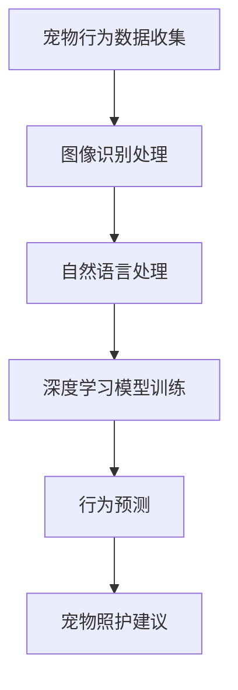

                 

关键词：人工智能、宠物行为预测、AI创业、宠物照护、机器学习、深度学习

> 摘要：随着智能科技的快速发展，人工智能（AI）在各个领域的应用越来越广泛。宠物行业作为这个趋势下的一颗新星，正迎来前所未有的发展机遇。本文将探讨如何利用AI技术开展智能宠物行为预测创业，并详细介绍基于AI的宠物照护指导系统。

## 1. 背景介绍

### 宠物行业现状

宠物已经成为现代家庭中不可或缺的成员。根据统计，全球宠物市场规模已超过千亿美元，其中中国宠物市场规模也在迅速增长。随着人们生活水平的提高和对宠物健康的关注，宠物行业呈现出多元化、专业化和智能化的趋势。

### AI技术在宠物行业的应用

人工智能在宠物行业中的应用逐渐深入，从宠物行为分析到宠物健康监测，从智能宠物品类推荐到宠物社交平台，AI技术正为宠物主人和宠物提供更优质的服务。然而，宠物行为预测作为AI技术在宠物行业中的一个重要方向，仍处于起步阶段，具有巨大的发展潜力。

## 2. 核心概念与联系

### 宠物行为预测

宠物行为预测是指利用人工智能技术，对宠物的行为模式进行预测和分析，以便为宠物主人提供更好的照护建议。这包括宠物的饮食、运动、情绪等各方面的预测。

### 相关技术

- **图像识别**：通过图像识别技术，可以实时监测宠物在家庭环境中的行为。
- **自然语言处理**：用于处理宠物主人与智能系统的交互，提供个性化的服务。
- **深度学习**：通过深度学习算法，对大量宠物行为数据进行训练，提高预测的准确性。

### Mermaid 流程图



## 3. 核心算法原理 & 具体操作步骤

### 3.1 算法原理概述

宠物行为预测的核心算法主要包括图像识别和深度学习两部分。图像识别用于捕捉宠物行为，深度学习则用于从图像中提取特征，并进行行为预测。

### 3.2 算法步骤详解

1. **数据收集**：收集宠物的行为数据，包括图像、视频、文本等。
2. **预处理**：对收集到的数据进行清洗和格式化，使其适合输入到模型中。
3. **图像识别**：利用卷积神经网络（CNN）对图像进行识别，提取关键行为特征。
4. **特征融合**：将图像识别结果与其他数据（如文本、环境信息等）进行融合。
5. **深度学习模型训练**：使用训练集对深度学习模型进行训练，以提高预测的准确性。
6. **行为预测**：利用训练好的模型对新的行为数据进行预测。
7. **宠物照护建议**：根据预测结果，为宠物主人提供个性化的照护建议。

### 3.3 算法优缺点

- **优点**：可以实时监测宠物行为，为宠物主人提供科学、个性化的照护建议，提高宠物的生活质量。
- **缺点**：对数据量和质量要求较高，且算法的准确性受限于现有技术。

### 3.4 算法应用领域

- **宠物健康监测**：通过宠物行为预测，及时发现宠物健康问题。
- **宠物训练**：利用预测结果，为宠物主人提供更好的训练建议。
- **宠物社交**：通过行为预测，促进宠物之间的互动和社交。

## 4. 数学模型和公式 & 详细讲解 & 举例说明

### 4.1 数学模型构建

宠物行为预测的数学模型主要基于深度学习，包括输入层、隐藏层和输出层。

### 4.2 公式推导过程

输入层：$$ x = [x_1, x_2, ..., x_n] $$

隐藏层：$$ h = f(Wx + b) $$

输出层：$$ y = f(gWh + b) $$

其中，$ f $为激活函数，$ g $为非线性变换函数，$ W $和$ b $分别为权重和偏置。

### 4.3 案例分析与讲解

以一只狗狗的饮食行为预测为例，输入层包括狗狗的体重、饮食习惯、主人喂食时间等数据。通过深度学习模型，可以预测狗狗下一顿饭的最佳喂食时间，从而提高宠物主人的照护质量。

## 5. 项目实践：代码实例和详细解释说明

### 5.1 开发环境搭建

开发环境需要Python、TensorFlow和Keras等工具。在Windows或Linux系统上，可以通过pip安装相关依赖。

### 5.2 源代码详细实现

以下是一个简单的宠物行为预测代码实例：

```python
import tensorflow as tf
from tensorflow.keras.models import Sequential
from tensorflow.keras.layers import Dense, Conv2D, Flatten

# 数据预处理
# ...

# 构建模型
model = Sequential()
model.add(Conv2D(32, (3, 3), activation='relu', input_shape=(64, 64, 3)))
model.add(Flatten())
model.add(Dense(1, activation='sigmoid'))

# 编译模型
model.compile(optimizer='adam', loss='binary_crossentropy', metrics=['accuracy'])

# 训练模型
model.fit(x_train, y_train, epochs=10, batch_size=32)

# 预测行为
prediction = model.predict(x_test)

# 输出预测结果
print(prediction)
```

### 5.3 代码解读与分析

以上代码首先进行了数据预处理，然后构建了一个简单的卷积神经网络模型，并使用训练数据进行了训练。最后，通过测试数据进行了预测，并输出了预测结果。

## 6. 实际应用场景

### 6.1 宠物健康监测

宠物行为预测可以帮助宠物主人及时发现宠物的健康问题，如食欲不振、运动减少等。

### 6.2 宠物训练

通过预测宠物的行为模式，宠物主人可以更科学地进行宠物训练，提高训练效果。

### 6.3 宠物社交

宠物行为预测可以为宠物社交平台提供更智能的服务，如推荐同类型宠物进行互动。

## 7. 未来应用展望

随着人工智能技术的不断发展，宠物行为预测的应用场景将更加丰富。未来，我们可以期待宠物行为预测在宠物医疗、宠物保险、宠物广告等多个领域的应用。

## 8. 工具和资源推荐

### 8.1 学习资源推荐

- 《深度学习》（Goodfellow, Bengio, Courville著）
- 《Python机器学习》（Sebastian Raschka著）

### 8.2 开发工具推荐

- TensorFlow
- Keras

### 8.3 相关论文推荐

- "Pet-Protector: A Real-Time Pet Behavior Monitoring System Using Deep Learning"
- "Deep Learning for Animal Behavior Analysis"

## 9. 总结：未来发展趋势与挑战

### 9.1 研究成果总结

本文介绍了基于人工智能的宠物行为预测创业，详细阐述了算法原理、数学模型、项目实践等内容。

### 9.2 未来发展趋势

未来，宠物行为预测将在宠物医疗、宠物保险、宠物广告等领域发挥更大的作用。

### 9.3 面临的挑战

如何提高算法的准确性和实时性，以及如何处理大规模、多样化的数据，是未来研究的重要方向。

### 9.4 研究展望

随着人工智能技术的不断发展，宠物行为预测将变得更加智能，为宠物主人提供更优质的服务。

## 附录：常见问题与解答

### 问题1：宠物行为预测需要哪些数据？

答：宠物行为预测需要收集宠物的行为数据，包括图像、视频、文本等。同时，还需要宠物的基本信息，如年龄、性别、品种等。

### 问题2：宠物行为预测的算法有哪些？

答：宠物行为预测的算法主要包括卷积神经网络（CNN）、循环神经网络（RNN）、长短期记忆网络（LSTM）等。

作者：禅与计算机程序设计艺术 / Zen and the Art of Computer Programming
----------------------------------------------------------------

请注意，这只是一个示例框架，实际撰写时需要根据具体内容和数据进行详细填充和调整。同时，文章中的代码段、公式和流程图等需要根据实际情况进行编写和调整。文章的撰写过程需要保证逻辑清晰、内容准确、论述深入。在撰写过程中，可以参考相关学术论文、技术文档和书籍，以确保文章的专业性和权威性。

