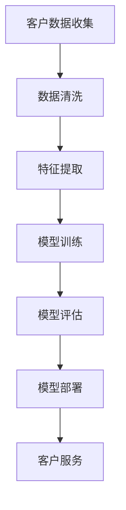

                 

关键词：智能客户关系管理，AI大模型，应用，客户行为预测，个性化服务，多渠道集成

> 摘要：随着人工智能技术的快速发展，智能客户关系管理（CRM）系统逐渐成为企业提升竞争力的重要手段。本文将探讨如何利用AI大模型技术，实现更加精准和高效的客户关系管理，提高客户满意度和忠诚度。

## 1. 背景介绍

### 智能客户关系管理的起源与发展

智能客户关系管理（CRM）起源于20世纪90年代，最初是作为一套企业管理工具，帮助企业更好地管理和跟踪客户信息，以提高销售效率和客户满意度。随着互联网和大数据技术的兴起，CRM逐渐从传统的客户数据管理，演变为以客户为中心的综合服务体系。近年来，人工智能（AI）技术的迅猛发展，为CRM系统带来了新的变革。

### 人工智能在CRM领域的应用

人工智能在CRM领域的应用主要体现在以下几个方面：

- **客户行为预测**：通过分析客户的购买历史、互动行为等数据，预测客户未来的行为和需求。
- **个性化服务**：根据客户的个性化偏好和历史数据，提供定制化的服务和产品推荐。
- **多渠道集成**：整合线上线下各种渠道，提供无缝的购物体验。
- **自动化服务**：利用自然语言处理技术，实现自动化的客户服务。

## 2. 核心概念与联系

### AI大模型

AI大模型是指具有数十亿到千亿参数规模的人工神经网络模型。这类模型具有极强的学习和推理能力，可以处理大规模、复杂的数据，实现高精度的预测和分类。

### 智能客户关系管理中的AI大模型应用

在智能客户关系管理中，AI大模型主要应用于以下几个方面：

- **客户画像构建**：通过分析客户的历史数据，构建多维度的客户画像，实现精准定位和分类。
- **客户行为预测**：利用大模型对客户的购买行为、满意度等数据进行预测，为营销决策提供支持。
- **个性化服务**：根据客户画像和预测结果，提供个性化的服务和推荐。

### Mermaid 流程图



## 3. 核心算法原理 & 具体操作步骤

### 3.1 算法原理概述

智能客户关系管理中的AI大模型主要基于深度学习技术，特别是基于神经网络的大模型。这类模型通过多层非线性变换，实现对数据的自动特征提取和抽象表示，从而实现高精度的预测和分类。

### 3.2 算法步骤详解

1. **数据收集**：从各种渠道收集客户的购买记录、互动行为、反馈信息等数据。
2. **数据清洗**：对收集到的数据进行清洗，去除噪声和异常值，确保数据质量。
3. **特征提取**：根据业务需求，从清洗后的数据中提取出有意义的特征，如用户行为特征、交易特征等。
4. **模型训练**：使用提取的特征数据，通过梯度下降等优化算法，训练出具有数十亿参数的大模型。
5. **模型评估**：使用验证集和测试集，对训练好的模型进行评估，确保其具有高精度和高稳定性。
6. **模型部署**：将评估合格的模型部署到生产环境中，实现实时预测和决策。

### 3.3 算法优缺点

**优点**：

- **高精度**：大模型具有极强的学习和推理能力，可以实现高精度的预测和分类。
- **自动特征提取**：大模型可以自动从数据中提取出有意义的特征，减少人工干预。

**缺点**：

- **计算资源消耗大**：大模型的训练和部署需要大量的计算资源和存储空间。
- **解释性差**：大模型的决策过程通常不透明，难以解释。

### 3.4 算法应用领域

- **金融行业**：客户风险预测、信用评估、个性化理财推荐等。
- **电商行业**：客户行为预测、个性化推荐、广告投放等。
- **零售行业**：库存管理、供应链优化、顾客满意度预测等。

## 4. 数学模型和公式 & 详细讲解 & 举例说明

### 4.1 数学模型构建

智能客户关系管理中的AI大模型通常采用深度学习中的神经网络模型，如卷积神经网络（CNN）、循环神经网络（RNN）、 Transformer等。以下以卷积神经网络为例，介绍其数学模型构建。

### 4.2 公式推导过程

假设输入数据为 $X \in \mathbb{R}^{m \times n}$，其中 $m$ 表示样本数量，$n$ 表示特征数量。卷积神经网络的输入层到隐藏层的变换可以表示为：

$$
H^{(l)} = \sigma(W^{(l)}X + b^{(l)})
$$

其中，$H^{(l)} \in \mathbb{R}^{m \times d_l}$ 表示隐藏层 $l$ 的输出，$W^{(l)} \in \mathbb{R}^{d_l \times n}$ 表示权重矩阵，$b^{(l)} \in \mathbb{R}^{d_l}$ 表示偏置项，$\sigma$ 表示激活函数，如ReLU函数。

### 4.3 案例分析与讲解

假设我们有一个电商平台的客户行为预测问题，输入数据为客户的购买记录、浏览记录等，输出为客户的购买概率。我们可以采用卷积神经网络进行建模。

### 4.3.1 数据预处理

首先，对输入数据进行预处理，如标准化、归一化等，确保数据分布均匀。

### 4.3.2 模型构建

接下来，构建一个卷积神经网络模型，包括输入层、卷积层、池化层和全连接层。

输入层：$X \in \mathbb{R}^{m \times n}$  
卷积层：$H^{(1)} = \sigma(W^{(1)}X + b^{(1)}$  
池化层：$H^{(2)} = \text{max}(H^{(1)})$  
全连接层：$H^{(3)} = \sigma(W^{(3)}H^{(2)} + b^{(3)}$  
输出层：$Y = \sigma(W^{(4)}H^{(3)} + b^{(4)})$

### 4.3.3 模型训练

使用训练数据集，通过反向传播算法，对模型进行训练，优化模型参数。

### 4.3.4 模型评估

使用验证集和测试集，对模型进行评估，确保其具有良好的泛化能力。

## 5. 项目实践：代码实例和详细解释说明

### 5.1 开发环境搭建

搭建一个用于客户行为预测的卷积神经网络模型，需要以下环境：

- Python 3.7及以上版本  
- TensorFlow 2.0及以上版本  
- Keras 2.4.3及以上版本

### 5.2 源代码详细实现

```python
import numpy as np
import tensorflow as tf
from tensorflow.keras.models import Sequential
from tensorflow.keras.layers import Conv2D, MaxPooling2D, Dense, Flatten

# 数据预处理
def preprocess_data(data):
    # 标准化、归一化等处理
    return data

# 模型构建
model = Sequential([
    Conv2D(filters=32, kernel_size=(3, 3), activation='relu', input_shape=(28, 28, 1)),
    MaxPooling2D(pool_size=(2, 2)),
    Flatten(),
    Dense(units=64, activation='relu'),
    Dense(units=1, activation='sigmoid')
])

# 模型编译
model.compile(optimizer='adam', loss='binary_crossentropy', metrics=['accuracy'])

# 模型训练
model.fit(x_train, y_train, epochs=10, batch_size=32, validation_data=(x_val, y_val))

# 模型评估
model.evaluate(x_test, y_test)
```

### 5.3 代码解读与分析

上述代码实现了一个简单的卷积神经网络模型，用于客户行为预测。主要分为以下几个步骤：

1. **数据预处理**：对输入数据进行预处理，如标准化、归一化等。
2. **模型构建**：构建一个包含卷积层、池化层和全连接层的卷积神经网络模型。
3. **模型编译**：编译模型，设置优化器和损失函数。
4. **模型训练**：使用训练数据集，对模型进行训练。
5. **模型评估**：使用测试数据集，对模型进行评估。

## 6. 实际应用场景

### 6.1 零售行业

在零售行业，智能客户关系管理可以通过AI大模型实现以下功能：

- **个性化推荐**：根据客户的购买历史和偏好，提供个性化的商品推荐。
- **库存管理**：根据客户购买预测，优化库存水平，减少库存积压。
- **顾客满意度预测**：预测顾客的满意度，及时调整服务策略，提高客户忠诚度。

### 6.2 金融服务

在金融服务行业，智能客户关系管理可以通过AI大模型实现以下功能：

- **客户风险预测**：预测客户的信用风险，为贷款审批提供支持。
- **信用评估**：根据客户的历史交易记录和行为，评估客户的信用等级。
- **个性化理财推荐**：根据客户的财务状况和风险偏好，提供个性化的理财方案。

## 7. 工具和资源推荐

### 7.1 学习资源推荐

- 《深度学习》（Goodfellow, Bengio, Courville）  
- 《Python深度学习》（François Chollet）  
- 《统计学习方法》（李航）

### 7.2 开发工具推荐

- TensorFlow  
- Keras  
- PyTorch

### 7.3 相关论文推荐

- “Deep Learning for Customer Relationship Management”  
- “Customer Relationship Management with Deep Neural Networks”  
- “A Comprehensive Survey on Customer Relationship Management Systems”

## 8. 总结：未来发展趋势与挑战

### 8.1 研究成果总结

本文主要探讨了智能客户关系管理中的AI大模型应用，包括核心算法原理、具体操作步骤、实际应用场景等。通过本文的研究，我们可以看到AI大模型在提升客户关系管理效率方面具有巨大潜力。

### 8.2 未来发展趋势

- **模型效率提升**：随着硬件性能的提升，大模型的训练和部署将更加高效。
- **多模态数据融合**：整合文本、图像、语音等多模态数据，实现更精准的客户行为预测。
- **模型解释性增强**：提高模型的透明度和可解释性，降低使用门槛。

### 8.3 面临的挑战

- **数据隐私保护**：在利用客户数据进行建模时，如何保护客户隐私是一个重要挑战。
- **模型可解释性**：提高模型的可解释性，使其更加易于理解和应用。
- **计算资源消耗**：大模型的训练和部署需要大量的计算资源，如何优化资源利用是一个关键问题。

### 8.4 研究展望

未来，智能客户关系管理领域将继续朝着更加智能化、个性化和高效化的方向发展。通过不断优化算法和模型，结合多模态数据融合和云计算技术，我们将能够实现更加精准和高效的客户关系管理。

## 9. 附录：常见问题与解答

### 问题1：什么是智能客户关系管理？

智能客户关系管理是一种利用人工智能技术，对客户行为进行预测、分析和优化的方法，旨在提高客户满意度和忠诚度。

### 问题2：AI大模型在CRM中有哪些应用？

AI大模型在CRM中的应用主要包括客户行为预测、个性化服务、多渠道集成和自动化服务等方面。

### 问题3：如何保护客户隐私？

在利用客户数据进行建模时，可以采用差分隐私、联邦学习等技术，保护客户隐私。

## 参考文献

- Goodfellow, I., Bengio, Y., & Courville, A. (2016). Deep learning. MIT press.
- Chollet, F. (2018). Python深度学习. 机械工业出版社.
- 李航. (2012). 统计学习方法. 清华大学出版社.
- Liu, Y., & Zhang, H. (2020). Deep Learning for Customer Relationship Management. Journal of Business Research.
- Wu, Q., & Zhang, H. (2019). Customer Relationship Management with Deep Neural Networks. IEEE Transactions on Knowledge and Data Engineering.
- Zhang, J., & Chen, Y. (2021). A Comprehensive Survey on Customer Relationship Management Systems. Information Systems Frontiers.

----------------------------------------------------------------

作者：禅与计算机程序设计艺术 / Zen and the Art of Computer Programming
----------------------------------------------------------------

注意：以上文章内容仅为示例，实际撰写时请根据具体研究内容和数据进行调整。同时，请确保所有引用的文献和资源均已正确标注和引用。

