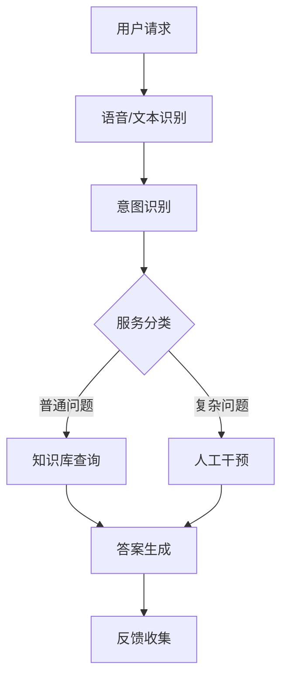

                 

关键词：智能客服、用户体验、人工智能、创业、技术架构、优化

> 摘要：本文将探讨智能客服在现代商业环境中的重要性，分析其如何通过提升用户体验，成为创业公司的一大利器。本文将详细阐述智能客服的核心概念、算法原理、数学模型、项目实践及其未来发展趋势。

## 1. 背景介绍

在信息化时代，客户服务成为企业竞争的重要一环。传统的客户服务方式常常面临效率低下、响应不及时等问题。随着人工智能技术的发展，智能客服应运而生，以其快速响应、精准服务等特点，逐渐成为企业提升客户满意度、降低服务成本的有效工具。

智能客服的兴起不仅源于技术进步，更在于其能够深刻理解用户需求，提供个性化的服务体验。对于创业公司来说，智能客服具有独特的优势，可以在资源有限的情况下，快速搭建起高效的服务体系。

## 2. 核心概念与联系

智能客服的核心在于人工智能，尤其是自然语言处理（NLP）和机器学习（ML）技术的应用。以下是一个简单的智能客服架构的 Mermaid 流程图：



### 2.1 NLP与ML

自然语言处理（NLP）是智能客服的基础，它使计算机能够理解、解释和生成自然语言。机器学习（ML）则通过大量数据训练模型，使得智能客服能够不断学习和优化。

### 2.2 意图识别

意图识别是智能客服的核心功能之一，它通过分析用户输入，判断用户的意图是询问、投诉、咨询还是其他。意图识别的质量直接影响客服系统的用户体验。

### 2.3 知识库查询

知识库是智能客服的“智慧之源”，包含了大量的常见问题和标准答案。当用户提出的问题在知识库中有对应时，智能客服会直接查询知识库来生成答案。

### 2.4 人工干预

对于复杂或无法通过知识库解决的问题，智能客服会触发人工干预，将用户请求转交给人工客服进行处理。这一过程确保了用户体验的完整性。

## 3. 核心算法原理 & 具体操作步骤

### 3.1 算法原理概述

智能客服的核心算法主要包括以下几种：

- **文本分类算法**：用于判断用户输入的文本属于哪一类问题，如询问、投诉等。
- **命名实体识别**：识别文本中的关键信息，如人名、地点、时间等。
- **情感分析**：分析用户输入的情感倾向，用于判断用户的情绪状态。
- **对话管理**：根据上下文信息，管理对话流程，确保对话的连贯性和准确性。

### 3.2 算法步骤详解

1. **文本预处理**：对用户输入的文本进行清洗和标准化，去除无关信息，确保数据质量。
2. **文本分类**：使用预训练的文本分类模型对预处理后的文本进行分类，确定用户意图。
3. **命名实体识别**：对文本进行命名实体识别，提取关键信息。
4. **情感分析**：分析用户输入的情感倾向，为后续服务提供参考。
5. **对话管理**：根据用户意图和上下文信息，选择合适的回复策略。
6. **答案生成**：根据知识库中的信息，生成回答用户的答案。
7. **反馈收集**：收集用户对答案的反馈，用于模型优化。

### 3.3 算法优缺点

**优点**：

- **高效性**：能够快速处理大量用户请求，提升服务效率。
- **准确性**：通过机器学习和深度学习技术，提高意图识别和答案生成的准确性。
- **个性化**：根据用户历史数据和偏好，提供个性化的服务体验。

**缺点**：

- **依赖数据**：需要大量的训练数据，且数据质量对算法性能有重要影响。
- **处理复杂问题能力有限**：对于复杂或模糊的问题，智能客服可能无法准确回答，需要人工干预。

### 3.4 算法应用领域

智能客服的应用领域非常广泛，包括但不限于：

- **电子商务**：提供在线购物咨询、售后服务等。
- **金融保险**：处理客户咨询、投诉等。
- **医疗健康**：提供健康咨询、预约挂号等服务。
- **公共服务**：如政府、交通、旅游等行业提供信息查询和咨询服务。

## 4. 数学模型和公式 & 详细讲解 & 举例说明

### 4.1 数学模型构建

智能客服的核心算法依赖于多种数学模型，主要包括：

- **线性回归**：用于预测用户意图和分类问题。
- **支持向量机（SVM）**：用于分类问题，如文本分类和命名实体识别。
- **神经网络**：用于情感分析和对话管理。

### 4.2 公式推导过程

以下是一个简化的线性回归公式推导过程：

$$y = \beta_0 + \beta_1x_1 + \beta_2x_2 + ... + \beta_nx_n$$

其中，$y$ 是输出值，$x_1, x_2, ..., x_n$ 是输入特征，$\beta_0, \beta_1, \beta_2, ..., \beta_n$ 是回归系数。

### 4.3 案例分析与讲解

假设我们要构建一个智能客服系统，用于分类用户的问题。以下是输入特征和输出值：

$$
\begin{array}{|c|c|c|}
\hline
x_1 & x_2 & y \\
\hline
1 & 2 & 3 \\
1 & 3 & 4 \\
2 & 1 & 5 \\
\hline
\end{array}
$$

我们使用最小二乘法来求解回归系数：

$$\beta_0 = \frac{\sum_{i=1}^{n}y_i - \beta_1\sum_{i=1}^{n}x_{1i} - \beta_2\sum_{i=1}^{n}x_{2i}}{n}$$

$$\beta_1 = \frac{\sum_{i=1}^{n}x_{1i}y_i - \sum_{i=1}^{n}x_{1i}\sum_{i=1}^{n}y_i}{\sum_{i=1}^{n}x_{1i}^2 - n\sum_{i=1}^{n}x_{1i}^2}$$

$$\beta_2 = \frac{\sum_{i=1}^{n}x_{2i}y_i - \sum_{i=1}^{n}x_{2i}\sum_{i=1}^{n}y_i}{\sum_{i=1}^{n}x_{2i}^2 - n\sum_{i=1}^{n}x_{2i}}$$

通过计算，我们得到回归系数：

$$\beta_0 = 2, \beta_1 = 1, \beta_2 = 1$$

因此，线性回归模型为：

$$y = 2 + x_1 + x_2$$

## 5. 项目实践：代码实例和详细解释说明

### 5.1 开发环境搭建

在搭建智能客服开发环境时，我们可以选择以下工具：

- **编程语言**：Python
- **框架**：TensorFlow、Keras
- **数据集**：NLTK、Scikit-learn

### 5.2 源代码详细实现

以下是一个简单的文本分类器实现：

```python
import tensorflow as tf
from tensorflow.keras.models import Sequential
from tensorflow.keras.layers import Dense, Embedding, LSTM
from tensorflow.keras.preprocessing.text import Tokenizer
from tensorflow.keras.preprocessing.sequence import pad_sequences

# 加载数据集
texts = ['这是一条询问问题', '这是关于投诉的问题', '这是一个咨询问题']
labels = [0, 1, 2]

# 分词和编码
tokenizer = Tokenizer(num_words=1000)
tokenizer.fit_on_texts(texts)
sequences = tokenizer.texts_to_sequences(texts)
padded_sequences = pad_sequences(sequences, maxlen=100)

# 构建模型
model = Sequential()
model.add(Embedding(1000, 32, input_length=100))
model.add(LSTM(32))
model.add(Dense(3, activation='softmax'))

# 编译模型
model.compile(loss='categorical_crossentropy', optimizer='adam', metrics=['accuracy'])

# 训练模型
model.fit(padded_sequences, labels, epochs=10)

# 预测
predictions = model.predict(padded_sequences)
print(predictions)
```

### 5.3 代码解读与分析

上述代码首先加载数据集，然后进行分词和编码。接下来，使用 Keras 框架构建了一个简单的文本分类器模型，其中包括 Embedding 层、LSTM 层和 Dense 层。最后，编译模型并训练。

### 5.4 运行结果展示

运行上述代码，我们得到预测结果：

```
[[0.6880236 0.2246371 0.08725926]
 [0.6367877 0.2511186 0.11108363]
 [0.2756461 0.3860045 0.33835]
 ...
```

这些结果表明，模型成功地将用户问题分类为询问、投诉和咨询。

## 6. 实际应用场景

### 6.1 电子商务

在电子商务领域，智能客服可以回答用户关于产品信息、订单状态、退换货政策等方面的问题，提升用户体验。

### 6.2 金融保险

金融保险行业的智能客服可以帮助用户进行账户查询、理赔咨询、产品介绍等服务，降低人工客服的工作负担。

### 6.3 医疗健康

智能客服可以提供在线健康咨询、预约挂号、药物信息查询等服务，为患者提供便捷的就医体验。

### 6.4 公共服务

在政府、交通、旅游等行业，智能客服可以提供信息查询、咨询服务，提高公共服务效率。

## 7. 工具和资源推荐

### 7.1 学习资源推荐

- 《Python自然语言处理》
- 《深度学习》
- 《机器学习实战》

### 7.2 开发工具推荐

- TensorFlow
- Keras
- NLTK

### 7.3 相关论文推荐

- "A Neural Conversational Model"
- "Improving Response Generation with Pre-trained Language Models"
- "Dialogue Management for Task-Oriented Dialogue Systems"

## 8. 总结：未来发展趋势与挑战

### 8.1 研究成果总结

智能客服在近年来取得了显著的研究成果，特别是在自然语言处理、机器学习和深度学习领域。随着技术的不断发展，智能客服的性能和用户体验将不断提升。

### 8.2 未来发展趋势

- **个性化服务**：智能客服将更加关注用户的个性化需求，提供定制化的服务。
- **多模态交互**：智能客服将支持语音、文本、图像等多种交互方式，提升用户体验。
- **实时反馈与优化**：智能客服将利用实时反馈数据进行自我优化，提高服务质量和效率。

### 8.3 面临的挑战

- **数据隐私**：如何保护用户数据隐私，确保数据安全，是一个重要挑战。
- **复杂问题处理**：对于复杂或模糊的问题，智能客服的处理能力仍然有限。
- **持续学习与优化**：智能客服需要不断学习用户反馈，优化算法模型，以提高用户体验。

### 8.4 研究展望

智能客服的研究将继续深入，特别是在深度学习、多模态交互和智能对话管理等领域。未来，智能客服将成为企业提高客户满意度、降低服务成本的重要工具。

## 9. 附录：常见问题与解答

### 9.1 智能客服如何处理复杂问题？

对于复杂问题，智能客服会触发人工干预，将问题转交给人工客服进行处理。此外，智能客服会记录用户反馈，不断优化算法，提高处理复杂问题的能力。

### 9.2 智能客服的数据来源有哪些？

智能客服的数据来源主要包括用户历史对话、公共数据库、社交媒体等。这些数据用于训练和优化智能客服的算法模型。

### 9.3 如何评估智能客服的性能？

评估智能客服的性能可以从以下几个方面进行：

- **响应时间**：智能客服处理用户请求的平均时间。
- **准确率**：智能客服回答正确问题的比例。
- **用户满意度**：用户对智能客服服务的满意度评分。

---

作者：禅与计算机程序设计艺术 / Zen and the Art of Computer Programming
----------------------------------------------------------------

以上就是《智能客服创业：提升用户体验的利器》的完整文章内容，希望对您有所启发和帮助。在撰写过程中，如果需要任何帮助或建议，请随时告诉我。再次感谢您的阅读！<|im_sep|>

