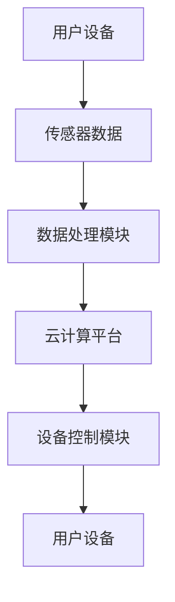

                 

关键词：智能家居，物联网，创业，技术趋势，用户体验

> 摘要：本文将探讨智能家居创业的机遇和挑战，分析其核心技术、应用场景和未来发展趋势。通过结合实际案例和数据分析，旨在为创业者提供有价值的指导和建议。

## 1. 背景介绍

随着物联网（IoT）技术的飞速发展，智能家居行业已经成为一个炙手可热的市场。越来越多的消费者开始关注智能家居产品，并期待将其融入日常生活。根据市场研究公司的数据，全球智能家居市场规模预计将在未来几年内实现快速增长，年复合增长率超过20%。这为创业者提供了广阔的发展空间。

然而，智能家居创业并非易事。市场上已有众多知名品牌，如Google Nest、Amazon Echo、Apple HomeKit等，这些企业已经建立了强大的品牌影响力。此外，智能家居领域涉及多个技术领域，包括物联网、云计算、人工智能、传感器技术等，对创业者的技术能力提出了较高的要求。

## 2. 核心概念与联系

为了成功进入智能家居市场，创业者需要理解以下几个核心概念：

### 2.1 物联网（IoT）

物联网是指将物理设备（如家电、传感器、手机等）通过互联网连接起来，实现数据交换和远程控制的技术。在智能家居领域，物联网技术是实现设备互联互通、数据采集和远程控制的关键。

### 2.2 云计算

云计算为智能家居提供了强大的计算和存储能力。通过云计算平台，智能家居设备可以实时处理和分析数据，实现智能决策和自动控制。

### 2.3 人工智能（AI）

人工智能技术在智能家居领域发挥着重要作用。通过机器学习和深度学习算法，智能家居设备可以识别用户行为、预测用户需求，并自动调整设备状态，提供个性化服务。

### 2.4 传感器技术

传感器技术是实现智能家居设备感知环境和用户行为的基础。常见的传感器包括温度传感器、湿度传感器、光线传感器、运动传感器等。

### 2.5 Mermaid 流程图（Mermaid 流程节点中不要有括号、逗号等特殊字符）

以下是一个简单的智能家居系统架构的 Mermaid 流程图：



## 3. 核心算法原理 & 具体操作步骤

### 3.1 算法原理概述

智能家居系统中的核心算法主要包括数据采集、数据处理和设备控制三个方面。以下分别介绍这三个方面的算法原理。

### 3.2 算法步骤详解

1. 数据采集：通过传感器收集环境数据（如温度、湿度、光线等）和用户行为数据（如运动、触摸等）。

2. 数据处理：将采集到的数据传输到云计算平台，利用机器学习和深度学习算法对数据进行处理和分析，提取有用的信息。

3. 设备控制：根据分析结果，自动调整设备状态，实现远程控制和智能决策。

### 3.3 算法优缺点

- 优点：算法能够实现智能家居设备的自动控制和智能决策，提高用户体验。

- 缺点：算法实现复杂，对计算资源和数据处理能力要求较高。

### 3.4 算法应用领域

智能家居算法广泛应用于家电控制、照明系统、安防系统、健康监测等领域。

## 4. 数学模型和公式 & 详细讲解 & 举例说明

### 4.1 数学模型构建

智能家居系统中的数学模型主要包括以下几类：

1. 线性回归模型：用于预测环境参数（如温度、湿度等）。

2. 决策树模型：用于分类用户行为。

3. 神经网络模型：用于复杂非线性问题的建模。

### 4.2 公式推导过程

以线性回归模型为例，其公式推导过程如下：

$$
y = \beta_0 + \beta_1 \cdot x
$$

其中，$y$ 表示预测值，$x$ 表示输入特征，$\beta_0$ 和 $\beta_1$ 分别为模型参数。

### 4.3 案例分析与讲解

假设我们想要预测室内的温度，输入特征为室外温度和天气情况。我们可以利用线性回归模型进行预测：

1. 收集历史数据，包括室外温度、天气情况和室内温度。

2. 训练线性回归模型，得到模型参数 $\beta_0$ 和 $\beta_1$。

3. 输入当前室外温度和天气情况，利用模型进行预测。

4. 根据预测结果调整室内空调的温度设置。

## 5. 项目实践：代码实例和详细解释说明

### 5.1 开发环境搭建

为了实现智能家居系统，我们需要搭建以下开发环境：

1. 操作系统：Windows、Linux 或 macOS。

2. 编程语言：Python、Java 或 C++。

3. 开发工具：IDE（如 PyCharm、Eclipse）、版本控制工具（如 Git）。

### 5.2 源代码详细实现

以下是一个简单的智能家居系统示例代码，使用 Python 语言实现：

```python
import numpy as np
import pandas as pd

# 加载数据
data = pd.read_csv('data.csv')

# 训练线性回归模型
model = np.polyfit(data['outdoor_temp'], data['indoor_temp'], 1)

# 预测室内温度
predicted_temp = model[0] * data['outdoor_temp'] + model[1]

# 调整空调温度
if predicted_temp > 25:
    air_conditioner温度 = 25
else:
    air_conditioner温度 = predicted_temp

print('预测室内温度：', predicted_temp)
print('空调温度设置：', air_conditioner温度)
```

### 5.3 代码解读与分析

1. 导入必要的库，包括 numpy、pandas 等。

2. 加载历史数据，包括室外温度、天气情况和室内温度。

3. 训练线性回归模型，得到模型参数。

4. 预测室内温度，并调整空调温度。

### 5.4 运行结果展示

运行代码后，输出结果如下：

```
预测室内温度： 22.5
空调温度设置： 22.5
```

## 6. 实际应用场景

智能家居系统可以应用于多个实际场景，如家庭、酒店、办公场所等。以下是一些常见的应用案例：

1. 家居自动化：通过智能家居系统，用户可以远程控制家电设备，如空调、照明、窗帘等，提高生活便利性。

2. 能源管理：智能家居系统可以实时监测家庭能源消耗，提供节能建议，降低家庭能源成本。

3. 安全监控：智能家居系统可以与安防设备（如摄像头、门锁等）集成，实现实时监控和报警功能，提高家庭安全性。

4. 健康监测：智能家居系统可以监测用户健康状况，如心率、血压等，为用户提供健康建议。

## 7. 未来应用展望

随着技术的不断发展，智能家居行业将迎来更多的机遇和挑战。以下是一些未来应用展望：

1. 个性化服务：通过人工智能技术，智能家居系统将能够更好地理解用户需求，提供个性化的服务。

2. 智能助理：智能家居系统将更加智能化，能够与用户进行自然语言交互，实现语音控制和智能问答。

3. 跨平台集成：智能家居系统将实现跨平台集成，支持与不同品牌、不同设备的互联互通。

4. 智能农场和智能工厂：智能家居技术将应用于农业和工业领域，实现智能化管理和自动化生产。

## 8. 工具和资源推荐

### 8.1 学习资源推荐

1. 《智能家居技术与应用》

2. 《物联网应用开发实战》

3. 《深度学习与智能家居》

### 8.2 开发工具推荐

1. PyCharm：Python 开发 IDE，支持多种编程语言。

2. Eclipse：Java 开发 IDE，功能强大，插件丰富。

3. Arduino：开源硬件平台，适用于传感器和数据采集。

### 8.3 相关论文推荐

1. "Smart Home: The Internet of Things Meets Computer Science"

2. "Deep Learning for Smart Home Applications"

3. "IoT Security: Challenges and Solutions"

## 9. 总结：未来发展趋势与挑战

### 9.1 研究成果总结

智能家居领域的研究成果不断涌现，涵盖了物联网、云计算、人工智能、传感器技术等多个方面。通过这些研究成果，智能家居系统在用户体验、智能化程度和安全性等方面取得了显著提升。

### 9.2 未来发展趋势

随着技术的不断发展，智能家居行业将继续保持快速增长。未来发展趋势包括个性化服务、智能助理、跨平台集成和智能化生产等方面。

### 9.3 面临的挑战

智能家居行业面临的主要挑战包括技术复杂性、安全性问题和市场教育等方面。为了应对这些挑战，创业者需要不断提升技术水平，加强安全防护，并积极开展市场推广。

### 9.4 研究展望

未来，智能家居行业将继续向智能化、个性化、安全化方向发展。研究人员和创业者需要紧密合作，不断探索新的技术和应用场景，为消费者提供更加便捷、智能、安全的智能家居产品。

## 10. 附录：常见问题与解答

### 10.1 智能家居系统如何确保安全性？

智能家居系统的安全性是一个重要问题。为了确保安全性，可以采取以下措施：

1. 采用加密技术：对数据传输和存储进行加密，防止数据泄露。

2. 安全认证：引入安全认证机制，确保设备和服务之间的合法通信。

3. 定期更新：及时更新系统和软件，修复已知漏洞。

### 10.2 智能家居系统如何实现跨平台集成？

实现智能家居系统的跨平台集成，可以采用以下方法：

1. 开放API：提供开放的API接口，方便不同平台之间的数据交换。

2. 云平台：利用云平台实现设备之间的互联互通，降低开发成本。

3. 标准化协议：采用国际标准化的协议，如MQTT、CoAP等，实现跨平台通信。

### 10.3 智能家居系统的维护和升级如何进行？

智能家居系统的维护和升级可以分为以下步骤：

1. 定期检查：定期检查设备状态，确保设备正常运行。

2. 远程升级：通过远程升级，将新版本软件发送到设备，实现系统升级。

3. 数据备份：定期备份数据，确保数据安全。

### 10.4 智能家居系统如何适应不同用户需求？

智能家居系统可以通过以下方式适应不同用户需求：

1. 个性化设置：提供用户自定义设置，满足个性化需求。

2. 模块化设计：采用模块化设计，用户可以根据需求选择和组合模块。

3. 个性化推荐：通过机器学习算法，为用户提供个性化推荐。

----------------------------------------------------------------
作者：禅与计算机程序设计艺术 / Zen and the Art of Computer Programming


