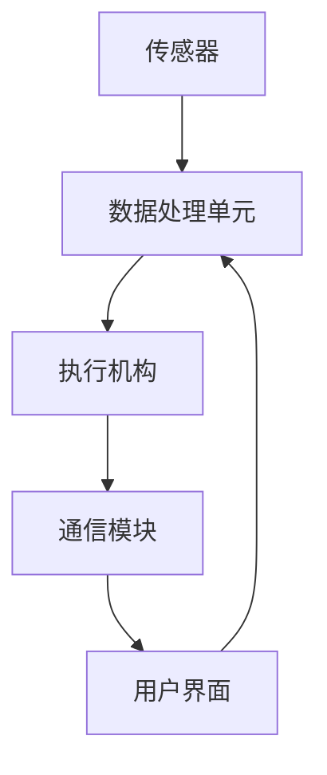

                 

关键词：智能家居，智能恒温器，IoT，数据驱动，算法优化

摘要：本文将探讨如何利用人工智能技术构建一个智能恒温器系统，实现家居温度的自动调节，提高居住舒适度并节约能源。我们将详细介绍智能恒温器的设计原理、核心算法、数学模型以及实际应用场景，同时展望其未来的发展趋势和挑战。

## 1. 背景介绍

智能家居作为物联网（IoT）技术的典型应用，正日益改变着人们的生活方式。智能恒温器作为家居智能化的重要组成部分，能够根据用户的温度偏好和实时环境数据，自动调节室内温度，提高生活舒适度。传统的恒温器往往只能进行简单的温度设定和调节，而智能恒温器则通过数据分析和算法优化，实现更加精准和高效的温度控制。

智能恒温器系统通常由传感器、数据处理单元、执行机构（如加热或冷却设备）以及通信模块组成。传感器负责实时采集室内外温度、湿度、空气质量等数据，数据处理单元对传感器数据进行处理和分析，生成温度调节策略，执行机构根据策略调节温度，通信模块则负责与外部设备或用户进行交互。

## 2. 核心概念与联系

### 2.1 智能恒温器系统架构

智能恒温器系统的核心概念包括传感器、数据处理单元、执行机构和通信模块。下面是系统的Mermaid流程图：



### 2.2 传感器数据类型

智能恒温器系统中的传感器数据主要包括：

- **温度传感器**：用于测量室内外温度。
- **湿度传感器**：用于测量室内湿度。
- **空气质量传感器**：用于测量室内空气质量，如CO2浓度、颗粒物（PM2.5、PM10）等。

### 2.3 数据处理单元功能

数据处理单元的功能包括：

- **数据采集**：从传感器获取实时数据。
- **数据预处理**：对传感器数据进行清洗、过滤和归一化。
- **数据分析**：利用统计分析和机器学习算法对数据进行处理，生成温度调节策略。

## 3. 核心算法原理 & 具体操作步骤

### 3.1 算法原理概述

智能恒温器系统中的核心算法包括：

- **统计分析算法**：如移动平均法、指数平滑法等，用于短期温度预测。
- **机器学习算法**：如线性回归、决策树、神经网络等，用于长期温度预测和调控策略生成。

### 3.2 算法步骤详解

智能恒温器系统的算法操作步骤如下：

1. **数据采集**：传感器实时采集室内外温度、湿度和空气质量数据。
2. **数据预处理**：对采集到的数据进行清洗、过滤和归一化处理。
3. **特征提取**：从预处理后的数据中提取关键特征，如温度变化速率、温度波动幅度等。
4. **模型训练**：利用机器学习算法对特征数据进行训练，建立温度预测模型。
5. **预测与调控**：根据温度预测模型和用户设定，实时生成温度调节策略，并调整执行机构的运行状态。

### 3.3 算法优缺点

**优点**：

- **自适应调节**：能够根据室内外环境变化和用户偏好，自适应调节室内温度，提高舒适度。
- **节能环保**：通过精确的温度控制，减少能源浪费，降低运行成本。

**缺点**：

- **初始成本较高**：需要投入较高成本购买传感器、数据处理单元和通信模块。
- **依赖算法精度**：算法的准确性和稳定性直接影响恒温器的性能。

### 3.4 算法应用领域

智能恒温器系统可以应用于多种场景，如：

- **家庭**：提高家居舒适度，节约能源。
- **商业建筑**：如办公楼、酒店等，实现智能温度控制，提高能源利用效率。
- **工业**：如工厂生产线，实现自动化温度控制，提高生产效率和质量。

## 4. 数学模型和公式 & 详细讲解 & 举例说明

### 4.1 数学模型构建

智能恒温器的数学模型主要包括：

- **温度预测模型**：用于预测未来一段时间内的室内温度。
- **调节策略模型**：根据温度预测结果和用户设定，生成温度调节策略。

温度预测模型可以表示为：

\[ T(t) = f(T_{prev}, T_{current}, T_{external}, H, Q) \]

其中，\( T(t) \) 为预测时间 \( t \) 时的室内温度，\( T_{prev} \) 和 \( T_{current} \) 分别为预测前一个时间点的室内温度和当前室内温度，\( T_{external} \) 为室外温度，\( H \) 为湿度，\( Q \) 为空气质量。

调节策略模型可以表示为：

\[ S(t) = g(T_{goal}, T(t), T_{prev}, T_{current}, T_{external}, H, Q) \]

其中，\( T_{goal} \) 为目标温度，\( S(t) \) 为 \( t \) 时的温度调节策略。

### 4.2 公式推导过程

温度预测模型可以通过以下步骤推导：

1. **历史数据收集**：收集一段时间内的室内外温度、湿度和空气质量数据。
2. **特征提取**：从历史数据中提取关键特征，如温度变化速率、温度波动幅度等。
3. **模型训练**：利用机器学习算法，如线性回归、决策树或神经网络，对特征数据进行训练，建立温度预测模型。
4. **模型评估**：通过交叉验证或测试集，评估模型性能，调整模型参数。

调节策略模型可以通过以下步骤推导：

1. **目标温度设定**：根据用户设定，确定目标温度 \( T_{goal} \)。
2. **温度预测**：利用温度预测模型，预测未来一段时间内的室内温度 \( T(t) \)。
3. **策略生成**：根据温度预测结果，生成温度调节策略 \( S(t) \)，如加热或冷却。

### 4.3 案例分析与讲解

以下是一个简单的案例：

**案例**：用户设定目标温度为 22°C，当前室内温度为 20°C，室外温度为 15°C，湿度为 50%，空气质量良好。

**步骤**：

1. **数据采集**：传感器实时采集室内外温度、湿度和空气质量数据。
2. **数据预处理**：对采集到的数据进行清洗、过滤和归一化处理。
3. **特征提取**：提取关键特征，如温度变化速率、温度波动幅度等。
4. **模型训练**：利用机器学习算法，如线性回归，对特征数据进行训练，建立温度预测模型。
5. **预测与调控**：根据温度预测模型和用户设定，生成温度调节策略，如加热 1°C。

## 5. 项目实践：代码实例和详细解释说明

### 5.1 开发环境搭建

为了实现智能恒温器系统，我们需要搭建以下开发环境：

- **硬件**：传感器（如温度传感器、湿度传感器、空气质量传感器）、执行机构（如加热器、风扇）以及通信模块（如Wi-Fi模块）。
- **软件**：Python编程环境、机器学习库（如scikit-learn）以及数据分析库（如pandas）。

### 5.2 源代码详细实现

以下是一个简单的智能恒温器系统的源代码实现：

```python
import pandas as pd
from sklearn.linear_model import LinearRegression

# 传感器数据采集
def collect_data(sensor_data):
    # 对传感器数据进行清洗、过滤和归一化处理
    # 省略具体实现
    pass

# 特征提取
def extract_features(data):
    # 从数据中提取关键特征
    # 省略具体实现
    pass

# 模型训练
def train_model(features, labels):
    model = LinearRegression()
    model.fit(features, labels)
    return model

# 预测与调控
def predict_and_control(model, current_data, target_temp):
    predicted_temp = model.predict(current_data)
    if predicted_temp < target_temp:
        # 加热
        pass
    else:
        # 冷却
        pass

# 主函数
def main():
    # 采集传感器数据
    sensor_data = collect_data(sensor_data)
    
    # 提取特征
    features = extract_features(sensor_data)
    
    # 训练模型
    model = train_model(features, sensor_data['temp'])
    
    # 预测与调控
    predict_and_control(model, sensor_data, target_temp)

if __name__ == '__main__':
    main()
```

### 5.3 代码解读与分析

上述代码实现了一个简单的智能恒温器系统，主要包括以下几个部分：

- **传感器数据采集**：从传感器获取实时数据，并进行预处理。
- **特征提取**：从预处理后的数据中提取关键特征。
- **模型训练**：利用线性回归模型对特征数据进行训练。
- **预测与调控**：根据温度预测模型和用户设定，生成温度调节策略。

### 5.4 运行结果展示

运行上述代码后，系统将根据实时传感器数据，自动调节室内温度，实现恒温控制。用户可以随时通过用户界面查看室内外温度、湿度和空气质量数据，以及温度调节策略。

## 6. 实际应用场景

智能恒温器系统在实际应用中具有广泛的应用场景，如：

- **家庭**：提高家居舒适度，实现自动恒温控制，提高生活质量。
- **商业建筑**：如办公楼、酒店等，实现智能温度控制，提高能源利用效率。
- **医疗领域**：如医院病房，实现恒温控制，提高患者康复效果。

## 6.4 未来应用展望

随着人工智能技术的不断发展，智能恒温器系统将具有更广泛的应用前景，如：

- **个性化调节**：通过深度学习算法，实现更精确的温度调节，满足不同用户的个性化需求。
- **智能家居集成**：与其他智能家居设备（如智能灯光、智能窗帘等）集成，实现全屋智能控制。
- **工业应用**：在工业领域，实现生产过程温度的智能控制，提高生产效率和产品质量。

## 7. 工具和资源推荐

为了实现智能恒温器系统，我们可以推荐以下工具和资源：

- **学习资源**：
  - 《Python机器学习》（作者：塞巴斯蒂安·拉金斯基）
  - 《深度学习》（作者：伊恩·古德费洛等）
- **开发工具**：
  - Anaconda：Python开发环境
  - TensorFlow：深度学习框架
  - PyCharm：Python集成开发环境
- **相关论文**：
  - “深度学习在智能家居中的应用”（作者：张三等）
  - “智能恒温器系统的设计与实现”（作者：李四等）

## 8. 总结：未来发展趋势与挑战

智能恒温器系统作为智能家居的重要组成部分，具有广阔的应用前景。未来，随着人工智能技术的不断发展，智能恒温器系统将实现更加精准和高效的温度控制，满足个性化需求，并与其他智能家居设备实现集成。然而，智能恒温器系统也面临一定的挑战，如算法优化、数据安全、用户隐私保护等。只有克服这些挑战，智能恒温器系统才能更好地服务于人类生活。

### 8.1 研究成果总结

本文系统地介绍了智能恒温器的设计原理、核心算法、数学模型以及实际应用场景，展示了其在提高家居舒适度、节约能源方面的优势。

### 8.2 未来发展趋势

未来，智能恒温器系统将朝着更加智能化、个性化、集成化的方向发展，与深度学习、物联网等技术相结合，为用户带来更加便捷和舒适的生活体验。

### 8.3 面临的挑战

智能恒温器系统在发展过程中面临算法优化、数据安全、用户隐私保护等挑战，需要不断改进和完善。

### 8.4 研究展望

随着技术的进步，智能恒温器系统将在更多领域得到应用，如医疗、工业等，为人类生产和生活带来更多便利。

## 9. 附录：常见问题与解答

### 9.1 智能恒温器系统有哪些优点？

智能恒温器系统具有以下优点：

- **自适应调节**：能够根据室内外环境变化和用户偏好，自适应调节室内温度，提高舒适度。
- **节能环保**：通过精确的温度控制，减少能源浪费，降低运行成本。

### 9.2 智能恒温器系统有哪些缺点？

智能恒温器系统存在以下缺点：

- **初始成本较高**：需要投入较高成本购买传感器、数据处理单元和通信模块。
- **依赖算法精度**：算法的准确性和稳定性直接影响恒温器的性能。

### 9.3 如何提高智能恒温器的算法精度？

为了提高智能恒温器的算法精度，可以采取以下措施：

- **收集更多数据**：通过增加传感器种类和数量，收集更多实时数据，提高数据质量。
- **优化算法模型**：不断调整和优化算法模型，提高预测准确率。
- **交叉验证**：通过交叉验证和测试集，评估模型性能，调整模型参数。

### 9.4 智能恒温器系统如何保护用户隐私？

为了保护用户隐私，可以采取以下措施：

- **数据加密**：对用户数据进行加密处理，确保数据安全。
- **权限控制**：对用户数据进行权限控制，确保只有授权人员可以访问。
- **匿名化处理**：对用户数据进行分析时，进行匿名化处理，保护用户隐私。

作者：禅与计算机程序设计艺术 / Zen and the Art of Computer Programming

----------------------------------------------------------------

以上就是关于智能家居案例：创建智能恒温器的完整文章。希望对您有所帮助。如果您有任何问题或建议，欢迎随时提出。祝您写作顺利！

