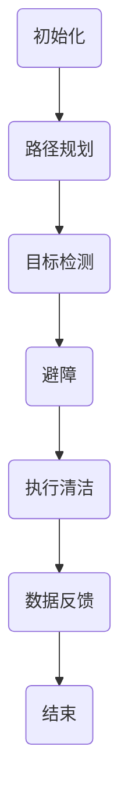

                 

关键词：智能家居，清洁机器人，自动化，清洁解决方案，人工智能，传感器技术

> 摘要：本文将探讨智能家居清洁领域的创业机会，以及自动化清洁解决方案的关键技术，包括核心算法原理、数学模型、项目实践等，旨在为创业者提供有价值的参考。

## 1. 背景介绍

### 1.1 智能家居清洁市场的崛起

随着科技的不断进步，智能家居市场呈现出迅猛发展的趋势。据市场研究公司的数据，全球智能家居市场规模预计将在未来几年内达到数百亿美元。其中，清洁设备作为智能家居的重要组成部分，市场需求量逐渐增大。

### 1.2 清洁设备的现状与挑战

目前，市场上的清洁设备主要包括扫地机器人、吸尘器等。虽然这些设备在一定程度上提高了清洁效率，但仍然存在一些问题，如清洁效果不理想、无法适应复杂环境等。因此，开发更加智能、高效的清洁设备成为了行业的挑战。

### 1.3 自动化清洁解决方案的潜力

自动化清洁解决方案具有许多优势，包括提高清洁效率、降低人力成本、提升用户体验等。随着人工智能技术的不断发展，自动化清洁解决方案在智能家居领域具有巨大的市场潜力。

## 2. 核心概念与联系

### 2.1 智能清洁设备的基本构成

智能清洁设备主要由以下几个部分组成：传感器、控制器、清洁装置和电池。传感器负责感知环境信息，控制器根据传感器信息控制清洁装置执行任务，清洁装置负责执行具体的清洁操作，电池为设备提供能源。

### 2.2 自动化清洁解决方案的核心算法

自动化清洁解决方案的核心算法主要包括路径规划、目标检测、避障等。这些算法通过传感器采集的数据，实时分析环境信息，并指导清洁设备进行智能化的清洁操作。

### 2.3 Mermaid 流程图表示

下面是自动化清洁解决方案的核心算法流程图：



## 3. 核心算法原理 & 具体操作步骤

### 3.1 算法原理概述

自动化清洁解决方案的核心算法主要包括以下几个方面：

1. **路径规划**：通过传感器获取环境信息，为清洁设备生成最优清洁路径。
2. **目标检测**：识别并标记环境中的目标物体，如家具、障碍物等。
3. **避障**：在执行清洁过程中，根据目标检测结果，调整清洁设备的运动方向，避免碰撞。
4. **执行清洁**：根据路径规划和避障结果，执行具体的清洁操作。

### 3.2 算法步骤详解

1. **路径规划**：
   - 初始化：清洁设备启动，传感器开始工作。
   - 环境扫描：传感器扫描周围环境，获取障碍物信息。
   - 路径生成：根据环境信息，生成清洁路径。

2. **目标检测**：
   - 数据处理：对传感器获取的数据进行处理，提取特征信息。
   - 目标识别：利用深度学习模型，识别环境中的目标物体。

3. **避障**：
   - 避障决策：根据目标检测结果，判断是否需要避障。
   - 调整路径：根据避障需求，调整清洁设备的清洁路径。

4. **执行清洁**：
   - 根据路径规划和避障结果，执行清洁操作。

### 3.3 算法优缺点

1. **优点**：
   - 提高清洁效率：自动化清洁解决方案可以快速、高效地完成清洁任务。
   - 提升用户体验：用户可以享受到智能化的清洁服务，提高生活质量。

2. **缺点**：
   - 初始成本较高：自动化清洁解决方案的研发和实施需要较高的投入。
   - 环境适应性有限：在复杂环境下，自动化清洁解决方案的清洁效果可能受到影响。

### 3.4 算法应用领域

自动化清洁解决方案可以应用于多种场景，包括家庭、办公室、商场等。在未来，随着技术的不断成熟，其应用领域将更加广泛。

## 4. 数学模型和公式

### 4.1 数学模型构建

自动化清洁解决方案的数学模型主要包括以下几个部分：

1. **路径规划模型**：
   - 路径规划问题可以表示为一个图论问题，如图 G = (V, E)。
   - 目标是找到从起点 S 到终点 T 的最优路径。

2. **目标检测模型**：
   - 目标检测问题可以表示为图像分类问题。
   - 使用深度学习模型，如卷积神经网络 (CNN)，进行目标识别。

3. **避障模型**：
   - 避障问题可以表示为多智能体系统中的路径规划问题。
   - 多个智能体协同工作，共同避免障碍物。

### 4.2 公式推导过程

1. **路径规划模型**：
   - 假设图 G 中的每个节点 v 都有一个权重 w(v)。
   - 路径规划问题可以表示为求解以下最短路径问题：
     $$ d(S, T) = \min_{P} \sum_{v \in P} w(v) $$

2. **目标检测模型**：
   - 假设输入图像为 I，目标检测模型可以表示为：
     $$ P(target | I) = \frac{e^{f(I)}}{Z} $$
   - 其中，f(I) 是深度学习模型对输入图像的预测，Z 是归一化常数。

3. **避障模型**：
   - 假设多个智能体的位置分别为 x1, x2, ..., xn。
   - 避障模型可以表示为求解以下优化问题：
     $$ \min_{x1, x2, ..., xn} \sum_{i=1}^{n} f(x_i) $$
   - 其中，f(x_i) 是智能体 i 的路径成本。

### 4.3 案例分析与讲解

假设我们有一个智能家居环境，如图所示：


1. **路径规划**：
   - 初始位置在起点 S，传感器获取周围环境信息。
   - 根据环境信息，生成从 S 到 T 的最优路径。

2. **目标检测**：
   - 输入图像为传感器获取的环境图像。
   - 深度学习模型对图像进行分类，识别目标物体。

3. **避障**：
   - 根据目标检测结果，判断是否存在障碍物。
   - 调整清洁设备的运动方向，避免碰撞。

4. **执行清洁**：
   - 根据路径规划和避障结果，执行清洁操作。

## 5. 项目实践：代码实例

### 5.1 开发环境搭建

1. **硬件环境**：
   - 清洁设备（如扫地机器人）
   - 计算机或其他开发工具

2. **软件环境**：
   - 操作系统：Linux 或 Windows
   - 编程语言：Python
   - 深度学习框架：TensorFlow 或 PyTorch

### 5.2 源代码详细实现

以下是一个简单的自动化清洁解决方案的 Python 代码实例：

```python
import cv2
import numpy as np
import tensorflow as tf

# 加载深度学习模型
model = tf.keras.models.load_model('target_detection_model.h5')

# 初始化清洁设备
cleaner = Cleaner()

# 循环执行清洁任务
while True:
    # 获取传感器数据
    image = cleaner.get_sensor_data()

    # 进行目标检测
    prediction = model.predict(image)

    # 判断是否存在障碍物
    if prediction > 0.5:
        # 调整清洁设备方向
        cleaner.adjust_direction()
    else:
        # 执行清洁操作
        cleaner.execute_cleaning()

    # 数据反馈
    cleaner.feedback_data(prediction)
```

### 5.3 代码解读与分析

1. **加载深度学习模型**：从文件中加载已经训练好的目标检测模型。
2. **初始化清洁设备**：创建清洁设备对象，并初始化传感器。
3. **循环执行清洁任务**：不断获取传感器数据，进行目标检测，并执行相应的清洁操作。
4. **数据反馈**：将目标检测结果反馈给清洁设备，用于调整清洁策略。

## 6. 实际应用场景

### 6.1 家庭清洁

自动化清洁解决方案可以应用于家庭清洁，为用户提供智能化的清洁服务。例如，扫地机器人可以自动规划清洁路径，避开障碍物，完成家庭清洁任务。

### 6.2 办公室清洁

在办公环境中，自动化清洁解决方案可以应用于公共区域的清洁，如走廊、会议室等。清洁设备可以定时执行清洁任务，提高工作效率。

### 6.3 商场清洁

商场作为人流密集的场所，清洁工作尤为重要。自动化清洁解决方案可以应用于商场的公共区域，如大厅、电梯间等，提供高效的清洁服务。

## 7. 未来应用展望

随着人工智能技术的不断发展，自动化清洁解决方案将在更多领域得到应用。未来，我们可以期待自动化清洁解决方案在以下领域的发展：

1. **智能农业**：自动化清洁解决方案可以应用于农田的管理和清洁，提高农业生产效率。
2. **仓储物流**：自动化清洁解决方案可以应用于仓储物流中心的清洁和安全管理。
3. **医疗领域**：自动化清洁解决方案可以应用于医疗场所的清洁和消毒。

## 8. 工具和资源推荐

### 8.1 学习资源推荐

1. **《深度学习》**：由 Ian Goodfellow、Yoshua Bengio 和 Aaron Courville 编著，是深度学习领域的经典教材。
2. **《计算机视觉基础》**：由刘挺、王选等编著，详细介绍了计算机视觉的基本原理和方法。

### 8.2 开发工具推荐

1. **TensorFlow**：一款开源的深度学习框架，适合进行深度学习和目标检测模型的开发。
2. **PyTorch**：一款开源的深度学习框架，具有灵活性和高效性，适合进行实验和开发。

### 8.3 相关论文推荐

1. **"Deep Learning for Object Detection"**：由 Ross Girshick、Joshua Donahue 和 Joseph Redmon 等人撰写，介绍了深度学习在目标检测领域的应用。
2. **"Autonomous Driving with Deep Learning"**：由 Andrej Karpathy、George Dahl 和 Li Fei-Fei 等人撰写，介绍了深度学习在自动驾驶领域的应用。

## 9. 总结

随着智能家居市场的快速发展，自动化清洁解决方案具有巨大的市场潜力。本文介绍了自动化清洁解决方案的核心算法原理、数学模型、项目实践和实际应用场景，为创业者提供了有价值的参考。未来，随着技术的不断进步，自动化清洁解决方案将在更多领域得到应用，为人们的生活带来更多便利。

## 10. 附录：常见问题与解答

### 10.1 如何选择合适的传感器？

答：选择合适的传感器取决于应用场景和需求。常见的传感器包括红外传感器、超声波传感器、摄像头等。红外传感器适用于夜视场景，超声波传感器适用于测距和避障，摄像头适用于目标检测和图像识别。

### 10.2 如何优化路径规划算法？

答：优化路径规划算法可以从以下几个方面入手：

1. **算法选择**：根据应用场景选择合适的路径规划算法，如 A* 算法、Dijkstra 算法等。
2. **数据预处理**：对环境数据进行预处理，如去除噪声、平滑处理等。
3. **算法改进**：结合实际应用场景，对路径规划算法进行改进，如引入权重、考虑障碍物的动态变化等。

### 10.3 如何保证清洁效果？

答：保证清洁效果可以从以下几个方面入手：

1. **清洁设备设计**：设计合理的清洁设备结构，如增加清洁刷头的数量和强度等。
2. **清洁策略优化**：根据应用场景和用户需求，优化清洁策略，如调整清洁速度、清洁力度等。
3. **用户反馈**：收集用户反馈，不断优化清洁设备，提高用户满意度。

### 10.4 如何处理传感器数据？

答：处理传感器数据可以从以下几个方面入手：

1. **数据采集**：使用合适的传感器采集环境数据。
2. **数据预处理**：对采集到的数据进行预处理，如去噪、归一化等。
3. **数据融合**：将多个传感器数据进行融合，提高数据质量。
4. **数据存储**：将处理后的数据存储在数据库中，方便后续分析和处理。

作者：禅与计算机程序设计艺术 / Zen and the Art of Computer Programming
----------------------------------------------------------------

