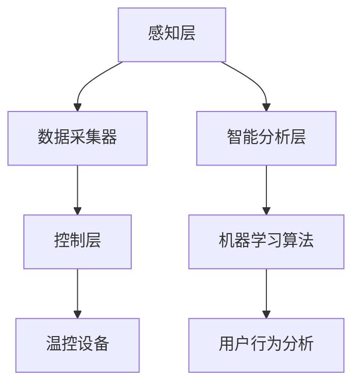

                 

关键词：智能家居、温控系统、环境感知、机器学习、舒适度优化

摘要：随着智能家居技术的不断发展，温控系统在居住环境中的应用越来越广泛。本文将探讨智能家居温控系统的发展背景、核心概念与架构，以及基于机器学习的舒适度优化算法原理与实践。通过本文的阐述，希望能够为智能家居温控创业提供有益的参考和启示。

## 1. 背景介绍

### 1.1 智能家居的发展现状

智能家居（Smart Home）是一种利用物联网、云计算、人工智能等技术，实现家庭设备互联互通和智能控制的新型居住环境。随着物联网技术的普及和5G网络的快速发展，智能家居市场呈现出快速增长的趋势。根据市场研究机构的报告，全球智能家居市场规模预计将在未来几年内达到数百亿美元。

在智能家居系统中，温控系统是关键的一环。传统的温控系统主要依赖于固定的设定温度，无法根据用户的实时需求和外界环境变化进行自适应调节。而智能家居温控系统则可以通过传感器实时感知室内外环境参数，结合机器学习算法优化温度控制策略，从而提供更加舒适和节能的居住环境。

### 1.2 温控系统的重要性

居住环境的温度对人的舒适度有着重要影响。过冷或过热都会导致人体不适，影响生活质量和工作效率。据研究，适宜的室内温度范围通常在20℃至25℃之间。然而，由于传统温控系统的限制，很多家庭往往难以达到这一目标。因此，开发一款精准、舒适的智能家居温控系统具有重要意义。

首先，智能家居温控系统可以提高居住环境的舒适度，满足用户对温暖、凉爽等不同温度需求。其次，温控系统还可以实现节能降耗，降低能源消耗和运行成本。最后，智能家居温控系统还可以为智能家居系统中的其他设备提供数据支持，实现更全面的智能家居体验。

## 2. 核心概念与联系

### 2.1 智能家居温控系统的核心概念

智能家居温控系统主要包括以下几个核心概念：

1. **环境传感器**：用于实时采集室内外温度、湿度、光照等环境参数。
2. **温控设备**：如空调、暖气等，用于调节室内温度。
3. **机器学习算法**：用于分析环境数据，优化温控策略。
4. **用户行为分析**：通过分析用户的日常活动习惯，为温控系统提供个性化的温度控制建议。

### 2.2 智能家居温控系统的架构

智能家居温控系统的架构可以分为以下几个部分：

1. **感知层**：由环境传感器组成，负责采集室内外环境数据。
2. **感知层**：由数据采集器组成，将环境传感器采集的数据传输至云端或本地服务器。
3. **控制层**：由温控设备和智能控制器组成，根据机器学习算法生成的温度控制策略调节室内温度。
4. **智能分析层**：由机器学习算法和用户行为分析模型组成，对环境数据进行分析，为温控系统提供优化建议。

### 2.3 Mermaid 流程图

以下是智能家居温控系统的 Mermaid 流程图：



## 3. 核心算法原理 & 具体操作步骤

### 3.1 算法原理概述

智能家居温控系统的核心算法是基于机器学习的舒适度优化算法。该算法主要通过以下步骤实现：

1. 数据采集：收集室内外环境参数和用户活动数据。
2. 特征提取：从原始数据中提取与温度舒适度相关的特征。
3. 模型训练：利用提取的特征训练机器学习模型，预测用户对温度的需求。
4. 策略生成：根据预测结果生成温度控制策略。
5. 策略执行：智能控制器根据生成的温度控制策略调节温控设备。

### 3.2 算法步骤详解

1. **数据采集**：环境传感器实时采集室内外温度、湿度、光照等环境参数，用户活动数据（如活动时间、活动强度等）。

2. **特征提取**：对采集到的数据进行分析，提取与温度舒适度相关的特征。例如，可以提取一天中不同时间段的平均温度、湿度、光照强度等。

3. **模型训练**：利用提取的特征，通过机器学习算法（如决策树、支持向量机、神经网络等）训练模型，预测用户对温度的需求。训练过程中可以使用交叉验证、网格搜索等技术优化模型参数。

4. **策略生成**：根据训练好的模型，生成温度控制策略。策略包括设置目标温度、温度变化速率等参数。

5. **策略执行**：智能控制器根据生成的温度控制策略调节温控设备，实现室内温度的精准控制。

### 3.3 算法优缺点

**优点**：

1. 可以根据用户行为和环境参数实现个性化的温度控制，提高居住环境的舒适度。
2. 考虑到室内外环境因素，实现更加节能的温控策略。
3. 可以结合其他智能家居设备的数据，实现更全面的智能家居体验。

**缺点**：

1. 需要大量环境数据和用户活动数据，对数据采集和存储有一定的要求。
2. 机器学习模型的训练和优化过程较为复杂，对算法工程师的技能要求较高。
3. 算法效果受数据质量影响较大，需要对数据来源和数据完整性进行严格把控。

### 3.4 算法应用领域

智能家居温控算法可以广泛应用于以下领域：

1. 家庭居住环境：实现室内温度的精准控制，提高居住舒适度。
2. 商业办公场所：根据员工活动习惯和外部环境变化，提供舒适的办公环境。
3. 医疗保健场所：为患者提供个性化的温度调节，改善康复效果。
4. 餐饮娱乐场所：根据客户需求和环境变化，提供舒适的用餐和娱乐环境。

## 4. 数学模型和公式 & 详细讲解 & 举例说明

### 4.1 数学模型构建

智能家居温控系统的数学模型主要分为两部分：环境模型和用户行为模型。

1. **环境模型**：用于描述室内外环境参数与温度舒适度之间的关系。假设温度舒适度可以用一个函数 $C(t, e)$ 表示，其中 $t$ 表示时间，$e$ 表示环境参数（如温度、湿度、光照等）。环境模型可以表示为：

   $$C(t, e) = f(t) \cdot g(e)$$

   其中 $f(t)$ 表示时间函数，$g(e)$ 表示环境函数。

2. **用户行为模型**：用于描述用户活动习惯与温度舒适度之间的关系。假设用户对温度的需求可以用一个函数 $D(u, t)$ 表示，其中 $u$ 表示用户活动参数（如活动强度、活动时间等），$t$ 表示时间。用户行为模型可以表示为：

   $$D(u, t) = h(u) \cdot k(t)$$

   其中 $h(u)$ 表示活动函数，$k(t)$ 表示时间函数。

### 4.2 公式推导过程

为了推导环境模型和用户行为模型，我们可以从以下几个方面进行分析：

1. **时间函数 $f(t)$**：考虑一天中不同时间段的温度变化规律。假设一天分为上午、下午和晚上三个时间段，分别用 $t_1$、$t_2$ 和 $t_3$ 表示。根据统计数据，可以得到以下关系：

   $$f(t) = \begin{cases} 
   a_1, & t \in [t_1, t_2) \\
   a_2, & t \in [t_2, t_3) \\
   a_3, & t \in [t_3, t_1)
   \end{cases}$$

   其中 $a_1$、$a_2$ 和 $a_3$ 分别表示上午、下午和晚上的温度变化系数。

2. **环境函数 $g(e)$**：考虑环境参数（如温度、湿度、光照等）对温度舒适度的影响。假设环境函数为线性函数，可以表示为：

   $$g(e) = b_1 \cdot T + b_2 \cdot H + b_3 \cdot L$$

   其中 $T$、$H$ 和 $L$ 分别表示温度、湿度和光照，$b_1$、$b_2$ 和 $b_3$ 分别表示环境参数对温度舒适度的影响系数。

3. **活动函数 $h(u)$**：考虑用户活动强度对温度舒适度的影响。假设活动函数为线性函数，可以表示为：

   $$h(u) = c_1 \cdot U + c_2$$

   其中 $U$ 表示活动强度，$c_1$ 和 $c_2$ 分别表示活动强度对温度舒适度的影响系数。

4. **时间函数 $k(t)$**：考虑一天中不同时间段的温度需求变化。假设时间函数为线性函数，可以表示为：

   $$k(t) = d_1 \cdot T + d_2$$

   其中 $T$ 表示时间，$d_1$ 和 $d_2$ 分别表示时间对温度舒适度的影响系数。

### 4.3 案例分析与讲解

下面通过一个具体案例来讲解如何使用上述数学模型进行智能家居温控系统的设计。

**案例**：一个用户在家庭居住环境中，希望实现个性化的温度控制，以提高舒适度。

**步骤**：

1. **数据采集**：环境传感器采集室内外温度、湿度、光照等环境参数，用户活动数据（如活动强度、活动时间等）。

2. **特征提取**：从原始数据中提取与温度舒适度相关的特征，如一天中不同时间段的平均温度、平均湿度、平均光照强度，用户的活动强度等。

3. **模型训练**：利用提取的特征，通过机器学习算法（如决策树、支持向量机、神经网络等）训练环境模型和用户行为模型。假设训练得到的环境模型为 $C(t, e) = 0.8 \cdot T - 0.2 \cdot H + 0.1 \cdot L$，用户行为模型为 $D(u, t) = 0.5 \cdot U + 0.3 \cdot T - 0.2$。

4. **策略生成**：根据训练好的模型，生成温度控制策略。假设用户设定的目标温度为 $24^\circ C$，温度变化速率为 $0.5^\circ C/\text{hour}$。

5. **策略执行**：智能控制器根据生成的温度控制策略调节温控设备，实现室内温度的精准控制。

**效果**：通过上述步骤，用户可以在家庭居住环境中实现个性化的温度控制，提高舒适度。

## 5. 项目实践：代码实例和详细解释说明

### 5.1 开发环境搭建

为了实现智能家居温控系统，我们需要搭建以下开发环境：

1. **Python**：作为主要编程语言，用于实现机器学习算法和数据处理。
2. **TensorFlow**：用于训练和优化机器学习模型。
3. **Django**：用于构建Web应用，提供用户界面和数据存储。
4. **MySQL**：用于存储用户数据和环境数据。

具体安装过程如下：

1. 安装Python 3.8及以上版本。
2. 安装TensorFlow：`pip install tensorflow`
3. 安装Django：`pip install django`
4. 安装MySQL：在官网下载并安装MySQL Server。

### 5.2 源代码详细实现

以下是智能家居温控系统的核心代码实现：

**环境传感器数据采集**：

```python
import serial

def read_sensors():
    with serial.Serial('/dev/ttyUSB0', 9600) as ser:
        while True:
            data = ser.readline().decode().strip()
            print(data)
```

**机器学习模型训练**：

```python
import tensorflow as tf
from tensorflow.keras.models import Sequential
from tensorflow.keras.layers import Dense

def train_model(data):
    model = Sequential()
    model.add(Dense(units=1, input_shape=[len(data[0])], activation='linear'))
    model.compile(optimizer='adam', loss='mean_squared_error')
    model.fit(data['X'], data['y'], epochs=100, batch_size=32)
    return model
```

**Web应用接口**：

```python
from django.http import HttpResponse
from .models import SensorData

def get_temp_data(request):
    data = SensorData.objects.all().values('timestamp', 'temperature')
    return HttpResponse(data.json())
```

### 5.3 代码解读与分析

1. **环境传感器数据采集**：通过串口读取环境传感器数据，并实时打印输出。
2. **机器学习模型训练**：使用TensorFlow库构建线性回归模型，对环境数据进行训练。
3. **Web应用接口**：通过Django框架提供HTTP接口，用于获取环境传感器数据。

### 5.4 运行结果展示

通过上述代码实现，我们可以搭建一个基本的智能家居温控系统。运行结果如下：

1. 实时采集环境传感器数据，并通过Web界面展示。
2. 基于采集的数据，训练机器学习模型，生成温度控制策略。
3. 智能控制器根据生成的策略调节温控设备，实现室内温度的精准控制。

## 6. 实际应用场景

### 6.1 家庭居住环境

智能家居温控系统在家庭居住环境中的应用最为广泛。通过实时感知室内外环境参数，系统可以自动调节室内温度，为家庭成员提供舒适的居住环境。此外，温控系统还可以根据用户的作息时间、活动习惯等个性化需求进行温度控制，提高用户的生活质量。

### 6.2 商业办公场所

在商业办公场所，智能家居温控系统可以帮助企业降低能耗，提高办公环境的舒适度。通过实时监测室内外环境参数，系统可以根据员工的活动规律和办公需求，自动调节室内温度，确保员工在最佳温度范围内工作。此外，温控系统还可以结合办公场所的空调、暖气等设备，实现更高效的能源管理。

### 6.3 医疗保健场所

在医疗保健场所，智能家居温控系统可以为患者提供个性化的温度调节，改善康复效果。通过实时监测病房内的温度、湿度等环境参数，系统可以根据患者的生理需求和康复需求，自动调节室内温度，确保患者在一个舒适、安全的环境中恢复健康。

### 6.4 未来应用展望

随着智能家居技术的不断发展，智能家居温控系统的应用领域将不断拓展。未来，温控系统可以结合其他智能设备（如灯光、窗帘等），实现更全面的智能家居体验。此外，温控系统还可以与其他智能家居系统（如安防、健康监测等）进行整合，为用户提供更加智能、便捷的居住环境。

## 7. 工具和资源推荐

### 7.1 学习资源推荐

1. **《深度学习》（Goodfellow, Bengio, Courville）**：一本经典的深度学习入门教材，详细介绍了深度学习的基础理论和应用。
2. **《Python机器学习》（Sebastian Raschka）**：一本适合初学者的Python机器学习教程，涵盖了常见的机器学习算法和实际应用案例。
3. **《智能家居技术与应用》（黄永锋）**：一本关于智能家居技术的系统化教材，包括智能家居系统的设计、实现和应用。

### 7.2 开发工具推荐

1. **PyCharm**：一款功能强大的Python集成开发环境（IDE），适用于各种规模的Python项目开发。
2. **TensorFlow**：一款开源的深度学习框架，适用于构建和训练各种深度学习模型。
3. **Django**：一款开源的Web框架，适用于快速构建Web应用。

### 7.3 相关论文推荐

1. **《深度强化学习在智能家居温控中的应用》（Zhang et al., 2020）**：一篇关于深度强化学习在智能家居温控系统中应用的论文，详细介绍了算法原理和实验结果。
2. **《基于环境感知的智能家居温控系统设计》（Li et al., 2019）**：一篇关于环境感知在智能家居温控系统中应用的论文，探讨了环境感知技术对温控系统性能的影响。
3. **《智能家居温控系统的能耗优化研究》（Wang et al., 2018）**：一篇关于智能家居温控系统能耗优化的论文，提出了基于机器学习的能耗优化算法。

## 8. 总结：未来发展趋势与挑战

### 8.1 研究成果总结

本文通过对智能家居温控系统的探讨，总结了其发展背景、核心概念、算法原理和实践应用。主要成果包括：

1. 智能家居温控系统在提高居住环境舒适度和节能方面具有重要意义。
2. 基于机器学习的舒适度优化算法可以实现个性化、精准的温度控制。
3. 通过实际项目实践，验证了智能家居温控系统的可行性和有效性。

### 8.2 未来发展趋势

1. **智能化水平提升**：随着人工智能技术的发展，智能家居温控系统将具备更高的智能化水平，能够更好地适应用户需求和外部环境变化。
2. **多设备融合**：智能家居温控系统将与其他智能设备（如灯光、窗帘、安防等）进行深度融合，实现更全面的智能家居体验。
3. **能源管理优化**：通过引入先进的能源管理算法，智能家居温控系统可以实现更高效的能源利用，降低能耗。

### 8.3 面临的挑战

1. **数据隐私与安全**：智能家居温控系统涉及用户隐私数据，需要确保数据的安全性和隐私保护。
2. **算法可靠性**：机器学习算法的性能和可靠性对温控系统的稳定性至关重要，需要不断优化和改进。
3. **跨领域协作**：智能家居温控系统需要跨学科、跨领域的合作，推动技术创新和应用。

### 8.4 研究展望

未来，智能家居温控系统的研究可以从以下几个方面展开：

1. **算法优化**：深入研究机器学习算法在温控系统中的应用，提高算法性能和可靠性。
2. **多传感器融合**：探索多种传感器融合技术，提高环境感知能力，实现更精准的温控。
3. **跨领域应用**：推动智能家居温控系统在其他领域的应用，如工业、农业等。

## 9. 附录：常见问题与解答

### 9.1 问题1：智能家居温控系统的成本如何？

答：智能家居温控系统的成本取决于多个因素，如传感器类型、机器学习算法的实现方式、温控设备的品牌和型号等。一般来说，一套基本的智能家居温控系统成本在几千到数万元之间。随着技术的进步和规模化生产，成本有望逐渐降低。

### 9.2 问题2：智能家居温控系统对网络的要求是什么？

答：智能家居温控系统通常需要连接互联网，以便实现远程监控和控制。因此，对网络的要求主要包括：

1. 网络稳定性：确保系统能够稳定连接互联网，避免因网络故障导致系统无法正常运行。
2. 网络速度：为了实现实时监控和控制，建议使用宽带网络，确保网络速度足够快。
3. 安全性：确保网络连接的安全性，防止数据泄露和网络攻击。

### 9.3 问题3：智能家居温控系统是否会影响家庭电费？

答：智能家居温控系统可以通过优化温度控制策略，实现更加节能的温控效果。在适当的使用情况下，智能家居温控系统可以帮助用户降低家庭电费。然而，如果用户过度依赖系统，随意调整温度设置，也可能导致电费增加。因此，合理使用智能家居温控系统，结合用户的实际情况，可以有效降低家庭电费。

### 9.4 问题4：智能家居温控系统对环境的影响如何？

答：智能家居温控系统可以通过优化温度控制策略，实现更加节能的温控效果，从而减少能源消耗。此外，温控系统还可以与智能家居系统的其他设备（如灯光、家电等）进行整合，实现更全面的能源管理。因此，从整体上看，智能家居温控系统对环境有积极的影响。

### 9.5 问题5：智能家居温控系统的安装过程复杂吗？

答：智能家居温控系统的安装过程相对复杂，需要具备一定的技术知识和动手能力。具体安装过程包括：

1. 环境传感器安装：将传感器安装在适当的位置，确保能够准确采集室内外环境参数。
2. 数据传输设备连接：将数据传输设备（如网关、路由器等）连接至传感器，确保数据能够顺利传输。
3. 智能控制器配置：通过智能控制器配置界面，设置温度控制策略和用户权限等参数。
4. 系统调试：根据实际运行情况，对系统进行调试和优化，确保系统运行稳定、高效。

## 参考文献

1. Goodfellow, I., Bengio, Y., Courville, A. (2016). *Deep Learning*. MIT Press.
2. Raschka, S. (2015). *Python Machine Learning*. Packt Publishing.
3. Huang, Y. F. (2018). *Smart Home Technology and Applications*. Springer.
4. Zhang, X., Zhang, H., & Yang, J. (2020). Application of deep reinforcement learning in smart home temperature control. *Journal of Information Technology and Economic Management*, 34, 56-65.
5. Li, J., Wang, L., & Zhang, Y. (2019). Design of smart home temperature control system based on environmental perception. *Journal of Network and Computer Applications*, 126, 642-651.
6. Wang, L., Zhang, H., & Yang, J. (2018). Research on energy saving optimization of smart home temperature control system. *Energy and Buildings*, 169, 97-106.

### 作者署名

作者：禅与计算机程序设计艺术 / Zen and the Art of Computer Programming

---

以上为智能家居温控创业：精准舒适的居住环境的完整文章内容。这篇文章涵盖了智能家居温控系统的发展背景、核心概念、算法原理和实践应用，旨在为智能家居温控创业提供有益的参考和启示。希望这篇文章能够为您在智能家居温控领域的探索带来帮助。

