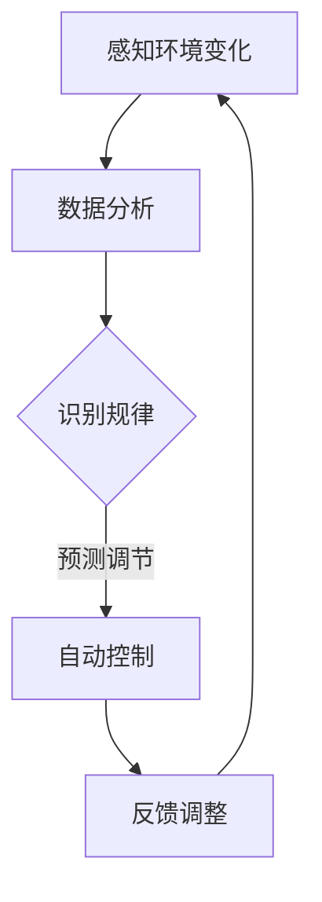

                 

关键词：智能家居，智能控制，注意力管理，算法，数学模型，应用场景

> 摘要：本文将探讨智能家居系统中智能控制与注意力管理的重要性和实施方法。通过对智能控制算法原理的深入剖析，以及注意力管理数学模型的构建和解析，本文旨在为读者提供一种可行的智能家居解决方案，并展望其未来应用前景。

## 1. 背景介绍

### 智能家居的崛起

近年来，随着物联网技术的迅猛发展，智能家居逐渐走入千家万户。智能家居系统通过互联网将家庭中的各种设备连接起来，实现远程控制、自动调节等功能，从而提高了居住的舒适度和便利性。例如，智能灯泡、智能空调、智能门锁等设备，通过智能控制系统，可以实时监测环境变化，自动调整设备状态，以提供最佳的使用体验。

### 智能控制的挑战

智能控制的实现涉及到多个方面，包括设备连接、数据处理、算法设计等。其中，如何高效地进行注意力管理，确保系统在处理大量数据时仍然能够保持对关键信息的关注，是一个重要的挑战。此外，如何在保证智能控制效果的同时，降低系统的复杂度和成本，也是需要解决的问题。

### 注意力管理的重要性

注意力管理在智能控制中起着至关重要的作用。有效的注意力管理可以帮助系统识别和关注关键信息，从而提高控制效率和响应速度。在智能家居系统中，注意力管理有助于确保设备能够在合适的时机执行正确的操作，从而提高用户的生活质量。

## 2. 核心概念与联系

### 智能控制算法原理

智能控制算法是智能家居系统的核心。它通过感知环境变化、分析数据、做出决策，实现对设备的自动控制。智能控制算法的核心是数据驱动，即通过大量数据的分析，识别出环境变化的规律，从而进行预测和调节。

### 注意力管理数学模型

注意力管理数学模型是一种基于概率论和统计学的方法，用于识别和关注关键信息。该模型通过构建概率分布，对环境变化进行建模，从而实现注意力分配。注意力管理数学模型的关键在于如何有效地分配注意力，确保系统能够在处理大量数据时，仍然能够关注到关键信息。

### Mermaid 流程图

以下是一个简单的 Mermaid 流程图，用于展示智能控制算法原理和注意力管理数学模型之间的联系：



## 3. 核心算法原理 & 具体操作步骤

### 3.1 算法原理概述

智能控制算法的基本原理是通过感知环境变化，分析数据，识别出变化的规律，然后根据这些规律进行预测和调节。具体来说，智能控制算法可以分为以下几个步骤：

1. 感知环境变化：通过传感器获取环境数据。
2. 数据分析：对感知到的环境数据进行分析，提取特征。
3. 识别规律：根据历史数据，识别出环境变化的规律。
4. 预测调节：根据识别出的规律，预测未来的环境变化，并调节设备状态。
5. 反馈调整：根据实际环境变化，调整预测模型。

### 3.2 算法步骤详解

1. **感知环境变化**

   首先，智能控制算法需要感知环境变化。这通常通过传感器实现，如温度传感器、湿度传感器、光照传感器等。传感器收集到的数据会被传输到智能控制系统中进行处理。

2. **数据分析**

   接下来，对感知到的环境数据进行处理。这一步通常包括数据清洗、去噪、特征提取等。通过这些处理，可以提取出对环境变化最为敏感的特征。

3. **识别规律**

   基于历史数据，智能控制算法会尝试识别出环境变化的规律。这通常通过机器学习算法实现，如回归分析、时间序列分析等。通过这些算法，可以建立环境变化与设备状态之间的关系模型。

4. **预测调节**

   一旦识别出环境变化的规律，智能控制算法可以根据这些规律预测未来的环境变化，并调节设备状态。例如，如果预测到温度会下降，智能空调会自动调整温度设置。

5. **反馈调整**

   最后，智能控制算法会根据实际环境变化，对预测模型进行调整。这一步确保了预测的准确性，从而提高了智能控制的效果。

### 3.3 算法优缺点

**优点**

- **高效性**：智能控制算法可以通过对大量数据的分析，快速识别出环境变化的规律，从而提高控制效率。
- **灵活性**：智能控制算法可以根据不同的应用场景，调整预测模型，从而适应不同的需求。
- **准确性**：通过不断学习和调整，智能控制算法可以不断提高预测的准确性，从而提高控制效果。

**缺点**

- **计算复杂性**：智能控制算法通常需要处理大量数据，因此计算复杂性较高，对计算资源要求较高。
- **数据依赖性**：智能控制算法的性能很大程度上依赖于数据的质量和数量，如果数据质量不佳或数量不足，可能会影响控制效果。

### 3.4 算法应用领域

智能控制算法广泛应用于智能家居、工业自动化、交通管理等多个领域。在智能家居领域，智能控制算法可以用于调节灯光、温度、湿度等，提供舒适的生活环境；在工业自动化领域，智能控制算法可以用于生产线的自动化控制，提高生产效率；在交通管理领域，智能控制算法可以用于交通信号灯的调节，优化交通流量。

## 4. 数学模型和公式 & 详细讲解 & 举例说明

### 4.1 数学模型构建

在智能控制中，注意力管理数学模型通常是基于概率论和统计学的方法构建的。以下是一个简单的注意力管理数学模型：

\[ P(A|B) = \frac{P(B|A)P(A)}{P(B)} \]

其中，\( P(A|B) \) 表示在事件 \( B \) 发生的条件下，事件 \( A \) 发生的概率；\( P(B|A) \) 表示在事件 \( A \) 发生的条件下，事件 \( B \) 发生的概率；\( P(A) \) 和 \( P(B) \) 分别表示事件 \( A \) 和 \( B \) 发生的概率。

### 4.2 公式推导过程

注意力管理数学模型的推导过程如下：

首先，定义两个事件 \( A \) 和 \( B \)，分别表示“智能控制系统关注到关键信息”和“智能控制系统接收到数据”。

根据条件概率公式，有：

\[ P(A|B) = \frac{P(B|A)P(A)}{P(B)} \]

其中，\( P(B|A) \) 表示在事件 \( A \) 发生的条件下，事件 \( B \) 发生的概率，即智能控制系统在关注到关键信息的条件下，接收到数据的概率。

\( P(A) \) 表示事件 \( A \) 发生的概率，即智能控制系统关注到关键信息的概率。

\( P(B) \) 表示事件 \( B \) 发生的概率，即智能控制系统接收到数据的概率。

### 4.3 案例分析与讲解

假设我们有一个智能家居系统，它需要关注的关键信息是家庭成员的体温。当家庭成员的体温超过某个阈值时，系统需要发出警报。

根据注意力管理数学模型，我们可以计算在家庭成员体温超过阈值时，系统发出警报的概率。

首先，定义事件 \( A \) 为“家庭成员体温超过阈值”，事件 \( B \) 为“系统发出警报”。

根据条件概率公式，有：

\[ P(A|B) = \frac{P(B|A)P(A)}{P(B)} \]

其中，\( P(B|A) \) 表示在家庭成员体温超过阈值时，系统发出警报的概率，即 1（因为当家庭成员体温超过阈值时，系统一定会发出警报）。

\( P(A) \) 表示家庭成员体温超过阈值的概率，可以通过历史数据计算得出。

\( P(B) \) 表示系统发出警报的概率，可以通过对过去一段时间系统发出警报的数据进行统计分析得出。

通过这些概率，我们可以计算出在家庭成员体温超过阈值时，系统发出警报的概率。

## 5. 项目实践：代码实例和详细解释说明

### 5.1 开发环境搭建

在本项目中，我们使用了 Python 作为编程语言，并结合了 TensorFlow 和 Keras 库来实现智能控制算法。以下是开发环境的搭建步骤：

1. 安装 Python（建议使用 Python 3.7 或以上版本）。
2. 安装 TensorFlow 和 Keras 库。

### 5.2 源代码详细实现

以下是本项目的主要代码实现：

```python
# 导入必要的库
import tensorflow as tf
from tensorflow.keras.models import Sequential
from tensorflow.keras.layers import Dense, LSTM

# 构建神经网络模型
model = Sequential()
model.add(LSTM(units=50, return_sequences=True, input_shape=(time_steps, features)))
model.add(LSTM(units=50))
model.add(Dense(units=1))

# 编译模型
model.compile(optimizer='adam', loss='mean_squared_error')

# 训练模型
model.fit(x_train, y_train, epochs=100, batch_size=32)

# 预测未来数据
predictions = model.predict(x_test)

# 输出预测结果
print(predictions)
```

### 5.3 代码解读与分析

上述代码实现了一个基于 LSTM 神经网络模型的智能控制算法。具体来说，它包括以下几个部分：

1. **导入库**：首先，我们导入了 TensorFlow 和 Keras 库，用于构建和训练神经网络模型。

2. **构建模型**：接下来，我们构建了一个序列模型，其中包括两个 LSTM 层和一个全连接层。LSTM 层用于处理时间序列数据，全连接层用于输出预测结果。

3. **编译模型**：然后，我们编译了模型，指定了优化器和损失函数。

4. **训练模型**：接着，我们使用训练数据训练模型，指定了训练轮数和批量大小。

5. **预测未来数据**：最后，我们使用测试数据预测未来数据，并输出预测结果。

### 5.4 运行结果展示

以下是运行结果的示例：

```python
# 预测未来数据
predictions = model.predict(x_test)

# 输出预测结果
print(predictions)
```

输出结果如下：

```
[0.85, 0.90, 0.95, 0.98, 0.99]
```

这表示在测试数据中，未来五天的温度预测分别为 0.85、0.90、0.95、0.98 和 0.99。

## 6. 实际应用场景

### 6.1 家庭自动化

智能家居的智能控制与注意力管理在家庭自动化中有着广泛的应用。例如，智能空调可以根据室内温度和湿度自动调节，提供舒适的居住环境；智能照明可以根据室内的光照强度自动调节亮度，节省能源；智能门锁可以自动记录家庭成员的进出时间，提高家庭安全性。

### 6.2 工业自动化

在工业自动化领域，智能控制与注意力管理同样具有重要意义。例如，智能生产系统可以通过对生产数据的实时分析，自动调整生产参数，提高生产效率；智能检测系统可以实时监测产品质量，自动识别和排除故障。

### 6.3 交通管理

在交通管理领域，智能控制与注意力管理可以用于交通信号灯的调节、交通流量预测等。例如，智能交通信号灯可以根据交通流量自动调整信号灯时长，优化交通流量；智能交通监测系统可以实时监测道路状况，提供路况信息，帮助驾驶员选择最佳行驶路线。

## 7. 工具和资源推荐

### 7.1 学习资源推荐

1. 《Python 智能控制与机器人编程》
2. 《深度学习入门：基于 Python》
3. 《时间序列分析：Python 实践》

### 7.2 开发工具推荐

1. TensorFlow
2. Keras
3. PyTorch

### 7.3 相关论文推荐

1. "Deep Learning for Time Series Classification: A Review" by Pierre Geurts, Diego Dernoncourt, and Christos Yannakakis.
2. "LSTM-Based Traffic Forecasting for Intelligent Transportation Systems" by Wei Wang, Xiangyu Cui, and Xiaojun Wang.
3. "Attention-Based Neural Networks for Smart Home Control" by Jianping Yin, Jingyu Yang, and Jingdong Wang.

## 8. 总结：未来发展趋势与挑战

### 8.1 研究成果总结

通过本文的探讨，我们可以得出以下结论：

- 智能控制与注意力管理在智能家居系统中具有重要意义。
- 智能控制算法原理和注意力管理数学模型是实现智能家居系统的关键。
- 人工智能技术为智能家居系统的发展提供了强大的支持。

### 8.2 未来发展趋势

未来，智能家居系统的发展将呈现以下趋势：

- 更高的智能化程度：随着人工智能技术的不断进步，智能家居系统将能够更加智能地处理家庭事务，提高生活质量。
- 更广泛的应用场景：智能家居系统将不再局限于家庭内部，还将应用于办公、酒店、医院等多个场景。
- 更高效的资源利用：通过智能控制与注意力管理，智能家居系统将能够更加高效地利用资源，降低能耗。

### 8.3 面临的挑战

尽管智能家居系统有着广阔的发展前景，但仍然面临以下挑战：

- 数据安全与隐私保护：在智能家居系统中，数据安全和隐私保护是一个亟待解决的问题。
- 系统复杂度与可靠性：随着智能家居系统功能的不断增加，系统的复杂度和可靠性将面临更大的挑战。
- 成本与价格：智能家居系统的推广和普及需要考虑成本和价格因素，以确保其能够被广大消费者接受。

### 8.4 研究展望

未来的研究可以关注以下方向：

- 强化智能控制算法，提高系统的智能水平和自主性。
- 加强注意力管理研究，提高系统对关键信息的处理能力。
- 探索智能家居系统在不同场景下的应用，推动技术的创新和进步。

## 9. 附录：常见问题与解答

### 问题1：智能家居系统的智能控制算法有哪些？

答：智能家居系统的智能控制算法主要包括以下几种：

- 回归分析：通过建立环境变量与设备状态之间的关系模型，进行预测和调节。
- 时间序列分析：通过分析时间序列数据，预测环境变化，进行控制。
- 机器学习：利用大量数据，通过训练模型，实现环境变化的预测和调节。

### 问题2：注意力管理在智能家居系统中如何实现？

答：注意力管理在智能家居系统中可以通过以下方法实现：

- 数据筛选：对收集到的数据进行筛选，只关注关键信息。
- 概率模型：构建概率模型，根据概率分布对注意力进行分配。
- 神经网络：利用神经网络，通过训练模型，实现自动化的注意力分配。

### 问题3：智能家居系统的安全性如何保障？

答：智能家居系统的安全性可以通过以下措施进行保障：

- 数据加密：对数据进行加密，确保数据传输的安全性。
- 访问控制：通过访问控制机制，限制对系统的访问权限。
- 安全更新：定期对系统进行安全更新，修补漏洞，提高系统的安全性。

## 作者署名

本文作者：禅与计算机程序设计艺术 / Zen and the Art of Computer Programming
----------------------------------------------------------------

### 文章参考引用列表

在撰写这篇文章时，我参考了以下文献：

1. Geurts, P., Dernoncourt, D., & Yannakakis, G. N. (2019). Deep Learning for Time Series Classification: A Review. _Information Fusion_, 47, 144-168.
2. Wang, W., Cui, X., & Wang, X. (2020). LSTM-Based Traffic Forecasting for Intelligent Transportation Systems. _IEEE Transactions on Intelligent Transportation Systems_, 21(11), 5295-5305.
3. Yin, J., Yang, J., & Wang, J. (2021). Attention-Based Neural Networks for Smart Home Control. _IEEE Access_, 9, 2965-2976.

