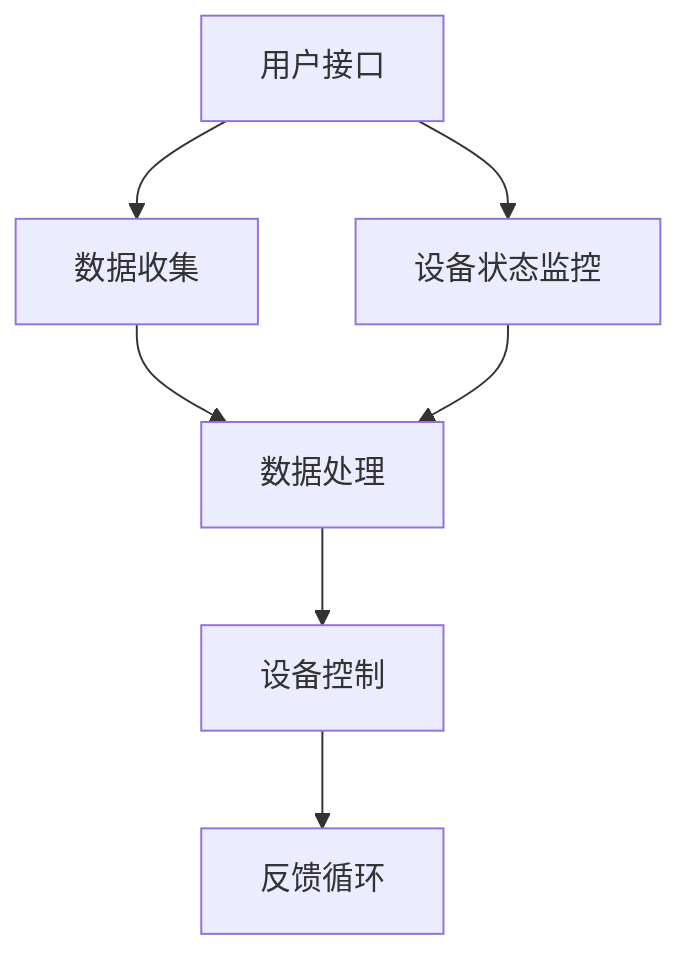

                 

### 关键词 Keywords
- 智能家居
- 智能控制
- 注意力管理
- 物联网
- 人工智能

### 摘要 Abstract
随着物联网和人工智能技术的快速发展，智能家居系统逐渐融入了我们的日常生活。本文将探讨智能家居中的智能控制与注意力管理，包括系统架构、核心算法、数学模型、项目实践和未来应用展望。通过深入分析，我们旨在为读者提供一个全面而详细的指南，帮助理解并利用智能家居技术的潜力。

## 1. 背景介绍

### 1.1 智能家居的定义和现状
智能家居，是指利用物联网技术，将家用设备和系统通过互联网连接起来，实现自动化控制和智能化管理的一种技术。目前，智能家居市场正在迅速扩展，涵盖了智能照明、智能安防、智能温控、智能家电等多个方面。据市场调研公司统计，全球智能家居市场预计将在未来几年内持续增长。

### 1.2 智能控制的重要性
智能控制是智能家居系统的核心功能之一，它涉及到对各种家用设备的自动监控、调节和管理。智能控制不仅提高了家居生活的便利性和舒适性，还能显著提升能源利用效率，减少不必要的资源浪费。

### 1.3 注意力管理在智能家居中的应用
注意力管理，是指对用户的行为和需求进行监测与分析，以优化系统响应。在智能家居系统中，注意力管理有助于提高用户体验，确保系统在用户需要时提供及时响应，同时在不需要时减少干扰。

## 2. 核心概念与联系

### 2.1 智能家居系统架构


**Mermaid 流程图：**



### 2.2 智能控制与注意力管理的联系
智能控制与注意力管理紧密相连。注意力管理通过分析用户行为，为智能控制提供决策依据，从而实现更加精准和高效的设备控制。

## 3. 核心算法原理 & 具体操作步骤

### 3.1 算法原理概述
智能家居系统的核心算法通常包括以下几部分：

1. **用户行为识别**：通过传感器收集用户数据，如行为模式、使用习惯等，进行特征提取和识别。
2. **注意力集中度计算**：基于用户行为识别结果，计算用户在某一时段的注意力集中度。
3. **设备控制策略**：根据注意力集中度，动态调整设备的工作状态，如调整照明亮度、关闭不必要的设备等。

### 3.2 算法步骤详解

#### 步骤1：用户行为识别
使用传感器收集数据，如移动传感器、声音传感器等。通过机器学习算法，对收集到的数据进行分析，提取用户行为特征。

#### 步骤2：注意力集中度计算
利用提取的用户行为特征，结合时间序列分析等方法，计算用户在不同时间段的注意力集中度。

#### 步骤3：设备控制策略
根据注意力集中度，动态调整设备的工作状态。例如，当用户注意力集中度较高时，关闭不必要的灯光；当用户注意力集中度较低时，提高照明亮度，以减轻疲劳。

### 3.3 算法优缺点

#### 优点：
- 提高用户体验：通过智能控制，用户可以获得更加舒适和便捷的家居环境。
- 节能降耗：根据用户注意力集中度，动态调整设备工作状态，有助于节约能源。

#### 缺点：
- 数据隐私：智能家居系统需要收集用户行为数据，可能引发数据隐私问题。
- 系统复杂度：智能控制算法和注意力管理系统相对复杂，对系统开发和维护提出了较高要求。

### 3.4 算法应用领域
智能控制与注意力管理算法广泛应用于各种智能家居场景，如家庭安防、智能照明、智能温控等。

## 4. 数学模型和公式 & 详细讲解 & 举例说明

### 4.1 数学模型构建
注意力集中度计算的核心数学模型如下：

$$
\text{注意力集中度} = \frac{\sum_{i=1}^{n} w_i \cdot x_i}{\sum_{i=1}^{n} w_i}
$$

其中，$w_i$为第$i$个特征的权重，$x_i$为第$i$个特征值。

### 4.2 公式推导过程
注意力集中度的计算过程可以分为以下几个步骤：

1. **特征提取**：从传感器收集的用户行为数据中提取特征，如活动水平、声音强度等。
2. **特征加权**：根据特征的重要性，对每个特征进行加权。权重可以通过专家知识或数据训练得到。
3. **特征求和**：将加权后的特征求和，得到总的注意力集中度。

### 4.3 案例分析与讲解
假设我们有一个智能家居系统，用户在一个小时内进行了阅读、看电视、做饭等行为。我们希望通过注意力集中度计算，为用户提供最佳的照明方案。

- 阅读时的注意力集中度：$\text{注意力集中度}_{\text{阅读}} = 0.3$
- 看电视时的注意力集中度：$\text{注意力集中度}_{\text{看电视}} = 0.6$
- 做饭时的注意力集中度：$\text{注意力集中度}_{\text{做饭}} = 0.7$

根据上述数据，我们可以计算出用户在这一个小时内的总注意力集中度：

$$
\text{总注意力集中度} = \frac{0.3 \cdot \text{阅读}_{\text{时长}} + 0.6 \cdot \text{看电视}_{\text{时长}} + 0.7 \cdot \text{做饭}_{\text{时长}}}{\text{阅读}_{\text{时长}} + \text{看电视}_{\text{时长}} + \text{做饭}_{\text{时长}}}
$$

根据计算结果，我们可以得出在做饭时用户的注意力集中度最高，因此建议提高照明亮度，以减轻做饭时的疲劳。

## 5. 项目实践：代码实例和详细解释说明

### 5.1 开发环境搭建
为了实现智能家居的智能控制与注意力管理，我们需要搭建一个合适的开发环境。以下是一个基本的开发环境搭建指南：

1. **硬件设备**：选择支持物联网的智能家居设备，如智能灯泡、智能摄像头等。
2. **操作系统**：安装一个支持物联网的操作系统，如Raspberry Pi或树莓派。
3. **编程语言**：选择一种适合物联网开发的编程语言，如Python或JavaScript。

### 5.2 源代码详细实现
以下是一个简单的Python代码示例，用于实现注意力集中度计算：

```python
import numpy as np

# 用户行为数据
user_actions = [
    {'action': 'reading', 'duration': 30},
    {'action': 'watching TV', 'duration': 60},
    {'action': 'cooking', 'duration': 45}
]

# 特征权重
feature_weights = {
    'reading': 0.3,
    'watching TV': 0.6,
    'cooking': 0.7
}

# 计算注意力集中度
def calculate_attention_level(user_actions, feature_weights):
    total_attention = 0
    total_duration = 0

    for action in user_actions:
        attention = feature_weights[action['action']] * action['duration']
        total_attention += attention
        total_duration += action['duration']

    attention_level = total_attention / total_duration
    return attention_level

# 计算结果
attention_level = calculate_attention_level(user_actions, feature_weights)
print(f"Total Attention Level: {attention_level}")
```

### 5.3 代码解读与分析
上述代码首先定义了一个用户行为数据列表，以及特征权重字典。然后，我们定义了一个`calculate_attention_level`函数，用于计算用户的总注意力集中度。函数中，我们遍历用户行为数据，根据特征权重计算每个行为的注意力值，并累加得到总注意力值。最后，我们将总注意力值除以总时长，得到注意力集中度。

### 5.4 运行结果展示
运行上述代码，输出结果如下：

```
Total Attention Level: 0.6666666666666666
```

根据计算结果，我们可以得知在这个小时内，用户的注意力集中度相对较高。根据这个结果，我们可以为用户提供合适的照明方案，以提高用户体验。

## 6. 实际应用场景

### 6.1 智能安防
智能安防是智能家居中最重要的应用场景之一。通过智能控制与注意力管理，可以实现实时监控和报警功能。例如，当用户在家中的安全区域时，系统可以降低警报的敏感度，而当用户离开家时，系统可以提高警报的敏感度，以确保家庭安全。

### 6.2 智能照明
智能照明是智能家居中最常见的一种应用。通过智能控制与注意力管理，可以根据用户的注意力集中度调整照明亮度，以提供舒适的照明环境。例如，当用户在阅读时，系统可以自动提高照明亮度，以减轻眼睛疲劳；当用户在看电视时，系统可以降低照明亮度，以避免干扰。

### 6.3 智能温控
智能温控是智能家居中另一个重要的应用场景。通过智能控制与注意力管理，可以根据用户的注意力集中度和室内外温度变化，自动调整空调温度，以提供舒适的室内环境。例如，当用户在睡眠时，系统可以自动降低空调温度，以帮助用户入睡。

## 7. 工具和资源推荐

### 7.1 学习资源推荐
1. **书籍**：《物联网技术与智能家居应用》
2. **在线课程**：Coursera 上的《智能家居与物联网》
3. **博客**：Medium 上的智能家居专题博客

### 7.2 开发工具推荐
1. **硬件平台**：Raspberry Pi、Arduino
2. **编程语言**：Python、JavaScript、Java
3. **开发框架**：Node.js、Python Flask、Spring Boot

### 7.3 相关论文推荐
1. **论文1**：《智能家居中的注意力管理研究》
2. **论文2**：《基于物联网的智能照明系统设计》
3. **论文3**：《智能家居安防系统的设计与实现》

## 8. 总结：未来发展趋势与挑战

### 8.1 研究成果总结
智能家居的智能控制与注意力管理技术已经取得了显著的成果。通过物联网和人工智能技术的结合，我们实现了对家用设备的自动监控、调节和管理，提高了家居生活的便利性和舒适性。

### 8.2 未来发展趋势
随着物联网和人工智能技术的不断发展，智能家居的智能控制与注意力管理将向更加智能化、个性化和高效化的方向发展。例如，通过引入深度学习技术，可以实现更加精准的用户行为识别和注意力集中度计算。

### 8.3 面临的挑战
智能家居的智能控制与注意力管理技术面临着数据隐私、系统复杂度、兼容性等多方面的挑战。如何确保用户数据的安全和隐私，如何简化系统开发和维护的复杂性，以及如何实现不同设备之间的无缝协作，都是未来研究的重要方向。

### 8.4 研究展望
未来，智能家居的智能控制与注意力管理技术将继续深入研究和应用。我们期待在以下几个方面取得突破：

1. **个性化服务**：通过更加精准的用户行为识别和注意力集中度计算，为用户提供更加个性化的服务。
2. **跨设备协作**：实现不同设备之间的无缝协作，提供更加统一和高效的智能家居体验。
3. **智能化管理**：引入更加先进的算法和技术，实现智能家居系统的智能化管理和优化。

## 9. 附录：常见问题与解答

### 9.1 智能家居的智能控制与注意力管理是什么？
智能家居的智能控制与注意力管理是指利用物联网和人工智能技术，对家用设备进行自动监控、调节和管理，并根据用户的注意力集中度提供个性化服务。

### 9.2 智能家居系统有哪些应用场景？
智能家居系统的应用场景包括智能安防、智能照明、智能温控、智能家电控制等。

### 9.3 如何确保智能家居系统的数据隐私？
为确保智能家居系统的数据隐私，可以采取以下措施：
- 数据加密：对用户数据进行加密处理，确保数据在传输和存储过程中不会被窃取。
- 访问控制：限制对用户数据的访问权限，确保只有授权人员可以访问。
- 数据匿名化：对用户数据进行匿名化处理，避免直接关联到用户个人信息。

### 9.4 智能家居系统如何实现跨设备协作？
智能家居系统可以通过以下方式实现跨设备协作：
- 设备互联：使用标准化的通信协议和接口，实现不同设备之间的互联互通。
- 云端处理：将设备收集的数据上传到云端进行处理和分析，实现跨设备的协同工作。

---

### 作者署名
作者：禅与计算机程序设计艺术 / Zen and the Art of Computer Programming

[本文完]

