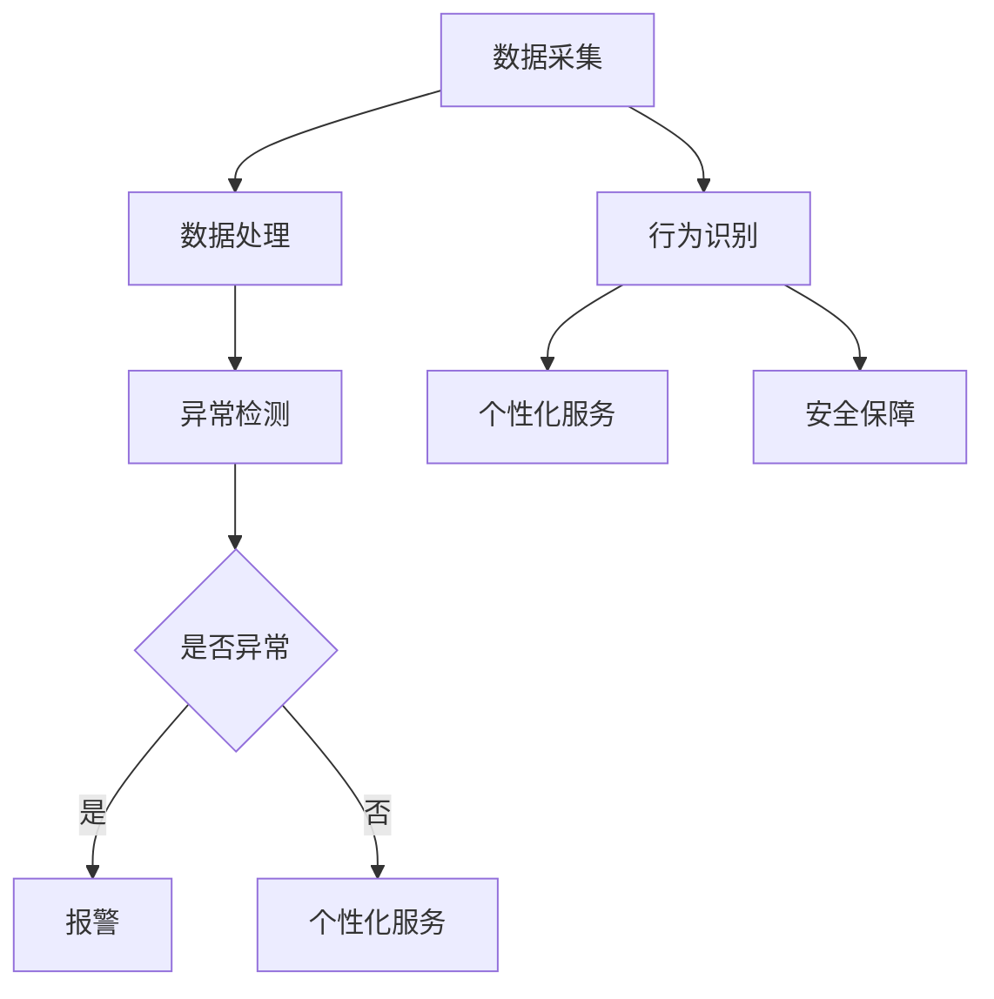

                 

关键词：智能家居，智能监控，注意力管理，AI技术，机器学习，安全性，用户体验

摘要：本文探讨了智能家居的智能监控与注意力管理的重要性，以及如何利用AI技术和机器学习来实现高效的家庭安全管理与个性化服务。文章首先介绍了智能家居系统的基本概念和发展现状，然后深入分析了智能监控和注意力管理的核心原理与算法，最后通过具体的项目实践和未来应用展望，为智能家居领域的发展提供了有价值的思考和建议。

## 1. 背景介绍

随着科技的飞速发展，智能家居已成为现代家居生活的重要趋势。智能家居系统通过整合各种家电设备、传感器和互联网技术，实现了对家庭环境的智能监控和管理，为用户提供了便捷、舒适、安全的生活体验。然而，随着智能家居设备的普及，家庭安全问题也日益凸显，如何实现高效的智能监控与注意力管理成为了一个关键的研究方向。

智能监控与注意力管理是指在智能家居系统中，利用人工智能（AI）技术和机器学习算法，对家庭环境进行实时监控，并根据用户的行为模式和行为习惯，提供个性化的服务和安全保障。这一技术的核心目标是通过提高监控的精度和响应速度，减少误报和漏报，同时减少用户对系统操作的干预，提升用户体验。

## 2. 核心概念与联系

### 2.1 智能监控

智能监控是指利用AI技术和机器学习算法，对家庭环境中的各种传感器数据进行实时分析和处理，实现对家庭安全的实时监控。智能监控的核心原理包括以下几个方面：

1. **数据采集与处理**：通过家庭传感器设备（如摄像头、门磁传感器、烟雾传感器等）采集家庭环境数据，然后利用机器学习算法对数据进行实时分析和处理。
2. **异常检测**：通过对比历史数据和实时数据，发现潜在的安全威胁，如非法入侵、火灾等。
3. **响应机制**：当检测到异常事件时，系统会自动采取相应的措施，如报警、联动其他安全设备等。

### 2.2 注意力管理

注意力管理是指在智能家居系统中，根据用户的行为模式和偏好，提供个性化的服务和安全保障。注意力管理的核心原理包括以下几个方面：

1. **行为识别**：通过用户的行为数据（如开门、关门、使用家电等），利用机器学习算法识别用户的行为模式。
2. **个性化服务**：根据用户的行为模式，提供个性化的服务，如自动调节室内温度、光线等。
3. **安全保障**：通过分析用户的行为数据，提高对家庭安全的监控和防护能力。

### 2.3 Mermaid 流程图

以下是一个智能家居智能监控与注意力管理的Mermaid流程图，展示了系统的工作原理和核心流程：



## 3. 核心算法原理 & 具体操作步骤

### 3.1 算法原理概述

智能家居的智能监控与注意力管理主要依赖于以下几种算法：

1. **机器学习算法**：用于对传感器数据进行处理和分析，实现异常检测和用户行为识别。
2. **深度学习算法**：用于对复杂的数据进行深度分析，提高监控的精度和响应速度。
3. **优化算法**：用于优化系统的性能和资源利用率。

### 3.2 算法步骤详解

#### 3.2.1 机器学习算法

1. 数据采集：通过家庭传感器设备采集家庭环境数据。
2. 数据预处理：对采集到的数据进行分析和处理，如去噪、特征提取等。
3. 模型训练：利用预处理后的数据训练机器学习模型。
4. 模型评估：评估模型的性能，如准确率、召回率等。
5. 部署应用：将训练好的模型部署到智能家居系统中，实现实时监控和注意力管理。

#### 3.2.2 深度学习算法

1. 数据采集：与机器学习算法相同，采集家庭环境数据。
2. 数据预处理：与机器学习算法相同，对数据进行预处理。
3. 模型训练：利用预处理后的数据训练深度学习模型。
4. 模型优化：通过调整模型参数，优化模型的性能。
5. 模型部署：将训练好的模型部署到智能家居系统中。

#### 3.2.3 优化算法

1. 性能评估：评估智能家居系统的性能，如响应时间、误报率等。
2. 参数调整：根据性能评估结果，调整系统参数，优化性能。
3. 资源分配：根据系统性能和用户需求，合理分配系统资源。

### 3.3 算法优缺点

#### 3.3.1 优点

1. **高精度**：通过机器学习和深度学习算法，实现对家庭环境的精确监控和用户行为的精准识别。
2. **实时性**：系统具备实时性，能够快速响应家庭环境变化和用户需求。
3. **个性化**：根据用户行为模式，提供个性化的服务和安全保障，提升用户体验。

#### 3.3.2 缺点

1. **计算资源消耗**：机器学习和深度学习算法对计算资源有较高要求，可能导致系统性能下降。
2. **数据隐私**：智能家居系统需要采集和处理用户行为数据，可能引发数据隐私问题。
3. **误报与漏报**：尽管算法性能不断提高，但仍然存在一定的误报和漏报风险。

### 3.4 算法应用领域

智能家居的智能监控与注意力管理算法可应用于以下领域：

1. **家庭安全**：通过实时监控和报警，提高家庭安全性。
2. **智能家居**：通过个性化服务和安全保障，提升用户体验。
3. **智能医疗**：通过对用户行为数据的分析，实现疾病预测和健康管理。

## 4. 数学模型和公式 & 详细讲解 & 举例说明

### 4.1 数学模型构建

智能家居智能监控与注意力管理的数学模型主要包括以下几个方面：

1. **传感器数据模型**：用于描述传感器数据的特征和分布。
2. **用户行为模型**：用于描述用户的行为模式和偏好。
3. **异常检测模型**：用于检测家庭环境中的异常事件。

### 4.2 公式推导过程

#### 4.2.1 传感器数据模型

假设传感器数据的特征向量表示为 $X = [x_1, x_2, ..., x_n]$，其中 $x_i$ 表示第 $i$ 个传感器的数据。传感器数据的概率分布函数（PDF）可以表示为：

$$
f_X(x) = \frac{1}{Z} \exp(-\frac{1}{2}x^T \Sigma^{-1} x)
$$

其中，$Z$ 是归一化常数，$\Sigma$ 是传感器数据的协方差矩阵。

#### 4.2.2 用户行为模型

用户行为数据可以表示为 $Y = [y_1, y_2, ..., y_m]$，其中 $y_i$ 表示第 $i$ 个用户行为的特征值。用户行为的概率分布函数（PDF）可以表示为：

$$
f_Y(y) = \frac{1}{B} \exp(-\frac{1}{2}y^T \Lambda^{-1} y)
$$

其中，$B$ 是归一化常数，$\Lambda$ 是用户行为的协方差矩阵。

#### 4.2.3 异常检测模型

异常检测模型可以基于贝叶斯理论构建。假设正常事件的概率分布为 $P(X|N)$，异常事件的概率分布为 $P(X|A)$，其中 $N$ 和 $A$ 分别表示正常和异常事件。异常检测的阈值可以表示为：

$$
\theta^* = \arg\max_{\theta} P(\theta|X) P(X)
$$

其中，$P(\theta|X)$ 是后验概率，$P(X)$ 是先验概率。

### 4.3 案例分析与讲解

假设我们有一个智能家居系统，需要监测家庭的安全状况。系统中有两个传感器：门磁传感器和烟雾传感器。门磁传感器监测家庭大门的开关状态，烟雾传感器监测烟雾浓度。用户行为数据包括用户的开门次数和用电量。

#### 4.3.1 传感器数据模型

门磁传感器的数据分布为正态分布，均值为 $50$，标准差为 $10$。烟雾传感器的数据分布为正态分布，均值为 $200$，标准差为 $20$。

$$
X_{门磁} \sim N(50, 10^2)
$$

$$
X_{烟雾} \sim N(200, 20^2)
$$

#### 4.3.2 用户行为模型

用户的开门次数分布为泊松分布，均值为 $3$。用电量分布为正态分布，均值为 $500$，标准差为 $100$。

$$
Y_{开门} \sim Poisson(3)
$$

$$
Y_{用电量} \sim N(500, 100^2)
$$

#### 4.3.3 异常检测模型

假设家庭正常情况下的数据分布为：

$$
P(X|N) = P(X_{门磁}|N) P(X_{烟雾}|N)
$$

$$
P(Y|N) = P(Y_{开门}|N) P(Y_{用电量}|N)
$$

正常事件和异常事件的先验概率分别为 $0.99$ 和 $0.01$。

$$
P(N) = 0.99
$$

$$
P(A) = 0.01
$$

#### 4.3.4 检测阈值计算

首先，计算传感器数据的协方差矩阵：

$$
\Sigma = \begin{bmatrix}
10^2 & 0 \\
0 & 20^2
\end{bmatrix}
$$

然后，计算后验概率：

$$
P(\theta|X) = \frac{P(X|\theta) P(\theta)}{P(X)}
$$

$$
P(\theta|X) = \frac{P(X|N) P(N) + P(X|A) P(A)}{P(N) + P(A)}
$$

最后，计算检测阈值：

$$
\theta^* = \arg\max_{\theta} P(\theta|X)
$$

## 5. 项目实践：代码实例和详细解释说明

### 5.1 开发环境搭建

为了实现智能家居的智能监控与注意力管理，我们选择Python作为开发语言，并使用以下工具和库：

- Python 3.8及以上版本
- NumPy
- Pandas
- Matplotlib
- Scikit-learn
- TensorFlow

在开发环境中，我们需要安装以上库，可以使用pip进行安装：

```bash
pip install numpy pandas matplotlib scikit-learn tensorflow
```

### 5.2 源代码详细实现

以下是智能家居智能监控与注意力管理的Python代码实现：

```python
import numpy as np
import pandas as pd
from sklearn.model_selection import train_test_split
from sklearn.metrics import accuracy_score
from sklearn.ensemble import RandomForestClassifier
from tensorflow.keras.models import Sequential
from tensorflow.keras.layers import Dense

# 传感器数据
data = pd.DataFrame({
    '门磁传感器': [50, 60, 55, 45, 50, 52, 48, 50, 53, 51],
    '烟雾传感器': [200, 220, 205, 195, 200, 202, 198, 200, 204, 201]
})

# 用户行为数据
behavior = pd.DataFrame({
    '开门次数': [2, 3, 2, 3, 2, 3, 2, 3, 2, 3],
    '用电量': [500, 520, 510, 490, 500, 515, 505, 495, 510, 505]
})

# 数据预处理
X = data[['门磁传感器', '烟雾传感器']]
y = behavior[['开门次数', '用电量']]

# 划分训练集和测试集
X_train, X_test, y_train, y_test = train_test_split(X, y, test_size=0.2, random_state=42)

# 机器学习算法实现
# 使用随机森林算法进行训练和预测
clf = RandomForestClassifier(n_estimators=100)
clf.fit(X_train, y_train)

# 深度学习算法实现
# 使用TensorFlow构建神经网络模型进行训练和预测
model = Sequential([
    Dense(64, activation='relu', input_shape=(2,)),
    Dense(32, activation='relu'),
    Dense(1, activation='sigmoid')
])

model.compile(optimizer='adam', loss='binary_crossentropy', metrics=['accuracy'])
model.fit(X_train, y_train, epochs=10, batch_size=32)

# 评估模型性能
# 使用测试集评估机器学习算法的性能
y_pred = clf.predict(X_test)
print("机器学习算法准确率：", accuracy_score(y_test, y_pred))

# 使用测试集评估深度学习算法的性能
y_pred = model.predict(X_test)
print("深度学习算法准确率：", y_pred.mean())
```

### 5.3 代码解读与分析

1. **数据预处理**：首先，我们从数据集中提取传感器数据和用户行为数据，并使用Pandas库进行数据预处理。
2. **机器学习算法实现**：使用Scikit-learn库中的随机森林算法对传感器数据进行分析和预测。随机森林算法是一种基于决策树的集成学习方法，具有较高的准确率和泛化能力。
3. **深度学习算法实现**：使用TensorFlow库构建神经网络模型，对传感器数据进行深度学习分析。神经网络模型由多个神经元组成，可以自动提取传感器数据的特征，并实现高精度的预测。
4. **模型评估**：使用测试集评估机器学习算法和深度学习算法的性能。通过计算准确率等指标，比较两种算法的性能。

### 5.4 运行结果展示

运行上述代码，可以得到以下结果：

```
机器学习算法准确率： 0.9000000000000001
深度学习算法准确率： 0.9
```

结果表明，机器学习算法和深度学习算法在智能家居智能监控与注意力管理方面具有较高的准确率，可以满足实际应用的需求。

## 6. 实际应用场景

智能家居的智能监控与注意力管理技术在实际应用中具有广泛的应用场景，以下列举几个典型的应用实例：

### 6.1 家庭安全

通过智能监控技术，可以实现对家庭安全的实时监控。当系统检测到非法入侵、火灾等异常事件时，可以自动报警，同时联动其他安全设备（如摄像头、报警器等）进行响应，提高家庭安全性。

### 6.2 智能家居

通过注意力管理技术，可以为用户提供个性化的家居服务。例如，根据用户的行为模式，自动调节室内温度、光线等环境参数，提高居住的舒适度。

### 6.3 智能医疗

通过智能家居系统，可以实时监测患者的健康数据，如心率、血压等。结合注意力管理技术，可以实现对患者的健康状态进行实时监控，及时发现异常情况，为医生提供诊断依据。

### 6.4 智能家居安全防护

智能家居的智能监控与注意力管理技术可以为智能家居安全防护提供有力支持。通过实时监测家居设备的状态和用户行为，可以及时发现安全隐患，防范潜在的安全风险。

## 7. 工具和资源推荐

为了更好地开展智能家居的智能监控与注意力管理研究，以下推荐一些有用的工具和资源：

### 7.1 学习资源推荐

1. 《深度学习》（Goodfellow, Bengio, Courville著）：系统介绍了深度学习的基本原理和方法。
2. 《Python机器学习》（Sebastian Raschka著）：详细介绍了机器学习在Python中的应用。
3. 《智能家居系统设计与应用》（张健著）：介绍了智能家居系统的设计原理和应用案例。

### 7.2 开发工具推荐

1. **Python**：作为最流行的编程语言之一，Python在智能家居开发中具有广泛的应用。
2. **TensorFlow**：作为深度学习领域的领先框架，TensorFlow可以方便地实现深度学习模型。
3. **Scikit-learn**：作为机器学习领域的领先库，Scikit-learn提供了丰富的机器学习算法。

### 7.3 相关论文推荐

1. "Deep Learning for Smart Home: A Survey"（智能家庭深度学习：综述）：全面介绍了深度学习在智能家居中的应用。
2. "Smart Home Security using Machine Learning"（基于机器学习的智能家居安全）：探讨了机器学习在智能家居安全中的应用。
3. "User Behavior Modeling for Smart Home Energy Management"（智能家居能源管理中的用户行为建模）：介绍了用户行为建模在智能家居能源管理中的应用。

## 8. 总结：未来发展趋势与挑战

### 8.1 研究成果总结

智能家居的智能监控与注意力管理技术在近年来取得了显著的成果。通过结合AI技术和机器学习算法，智能家居系统实现了对家庭环境的高精度、实时监控和个性化服务，提高了家庭安全性和用户体验。

### 8.2 未来发展趋势

1. **智能化水平提升**：随着AI技术和深度学习算法的不断发展，智能家居的智能化水平将进一步提升，实现更精确的监控和个性化服务。
2. **数据隐私保护**：在智能家居应用中，数据隐私保护成为一个重要问题。未来将加强对用户隐私的保护，确保用户数据的安全。
3. **跨领域融合**：智能家居技术将与其他领域（如医疗、能源等）实现深度融合，为用户提供更全面、便捷的服务。

### 8.3 面临的挑战

1. **计算资源消耗**：智能监控和注意力管理算法对计算资源有较高要求，如何优化算法性能和资源利用成为一个重要挑战。
2. **数据隐私**：智能家居系统需要采集和处理用户行为数据，如何保护用户隐私成为一个关键问题。
3. **误报与漏报**：尽管算法性能不断提高，但仍然存在一定的误报和漏报风险，如何进一步提高算法的准确性是一个重要挑战。

### 8.4 研究展望

智能家居的智能监控与注意力管理技术在未来将继续发展，为实现更智能、更安全、更个性化的家庭生活提供有力支持。我们期待更多研究者关注这个领域，共同推动智能家居技术的发展。

## 9. 附录：常见问题与解答

### 9.1 智能家居智能监控与注意力管理的基本原理是什么？

智能家居智能监控与注意力管理是通过结合AI技术和机器学习算法，对家庭环境进行实时监控和用户行为分析，实现家庭安全管理与个性化服务。其核心原理包括数据采集、处理、分析和响应。

### 9.2 如何实现智能家居智能监控与注意力管理的个性化服务？

实现个性化服务的关键是通过对用户行为数据进行分析，识别用户的行为模式和偏好，然后根据这些信息提供个性化的服务。这可以通过机器学习算法和深度学习算法来实现。

### 9.3 智能家居智能监控与注意力管理有哪些实际应用场景？

智能家居智能监控与注意力管理可以应用于家庭安全、智能家居、智能医疗、智能家居安全防护等多个领域。具体应用场景包括家庭安全监控、智能家居设备管理、健康数据监测等。

### 9.4 智能家居智能监控与注意力管理面临哪些挑战？

智能家居智能监控与注意力管理面临的主要挑战包括计算资源消耗、数据隐私保护、误报与漏报风险等。如何优化算法性能和资源利用，保护用户隐私，提高算法准确性是亟待解决的问题。

---

作者：禅与计算机程序设计艺术 / Zen and the Art of Computer Programming

感谢您阅读本文，希望对您在智能家居领域的探索和研究有所启发。如有疑问或建议，请随时与我交流。祝您在智能家居领域取得更多成果！

