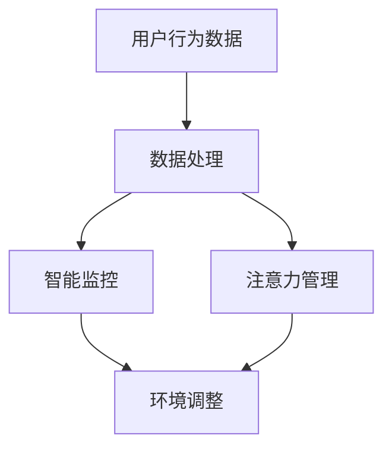

                 

关键词：智能家居，智能监控，注意力管理，物联网，数据驱动，人工智能

> 摘要：本文将探讨智能家居系统中的智能监控与注意力管理技术，旨在提高居住环境的安全性和舒适度。我们将介绍这些技术的核心概念、原理、算法，并通过实际应用案例，展示其在现实生活中的应用价值。

## 1. 背景介绍

智能家居作为物联网（IoT）发展的重要方向，已经逐渐渗透到我们的日常生活中。随着传感器技术的进步和人工智能算法的发展，智能家居系统正变得越来越智能。智能监控与注意力管理是智能家居系统中的重要组成部分，它们能够实时监测家庭环境，并根据用户的需求和行为模式，提供个性化的服务和安全保障。

### 1.1 智能家居的定义

智能家居是指利用物联网技术和人工智能，将家庭中的各种设备互联起来，形成一个高度智能化的系统。通过这个系统，用户可以远程控制家庭设备，实现自动化管理和控制，提高生活便利性和舒适度。

### 1.2 智能监控的作用

智能监控技术在智能家居中扮演着至关重要的角色。它能够实时监测家庭环境，如温度、湿度、光照、空气质量等，及时发现问题，并触发相应的报警机制。同时，智能监控还可以通过对用户行为的分析，提供个性化的服务，如自动调节室内温度、湿度，提供智能照明等。

### 1.3 注意力管理的意义

注意力管理是智能家居系统中的一个新兴领域。通过对用户行为的深度分析，智能家居系统能够识别用户的注意力状态，并自动调整家庭环境的参数，如音量、光线等，以减少对用户的干扰，提高生活质量。

## 2. 核心概念与联系

在智能家居系统中，智能监控与注意力管理技术涉及多个核心概念和组成部分。以下是一个简化的 Mermaid 流程图，展示了这些概念和它们之间的联系：



### 2.1 用户行为数据

用户行为数据是智能监控与注意力管理的基础。这些数据可以通过各种传感器收集，如运动传感器、声音传感器、光线传感器等。通过对这些数据的分析，系统可以了解用户的活动规律，为后续的智能监控和注意力管理提供依据。

### 2.2 数据处理

数据处理是将原始的用户行为数据转化为有意义的信息的过程。这通常涉及数据清洗、数据挖掘和模式识别等技术。通过数据处理，系统能够提取出用户行为的关键特征，为智能监控和注意力管理提供支持。

### 2.3 智能监控

智能监控是对家庭环境进行实时监测的技术。通过智能监控，系统可以及时发现异常情况，如火灾、漏水、非法入侵等，并触发相应的报警机制，确保家庭安全。

### 2.4 注意力管理

注意力管理是通过对用户行为数据的分析，识别用户的注意力状态，并自动调整家庭环境的参数，如音量、光线等，以减少对用户的干扰。注意力管理的核心是理解用户的注意力模式，并据此进行环境优化。

### 2.5 环境调整

环境调整是根据智能监控和注意力管理的分析结果，自动调节家庭环境的参数。例如，当系统检测到用户处于专注工作状态时，可以自动降低背景音量，提供更舒适的工作环境。

## 3. 核心算法原理 & 具体操作步骤

### 3.1 算法原理概述

智能监控与注意力管理的核心算法通常包括以下几个步骤：

1. **数据采集**：通过传感器收集用户行为数据。
2. **数据处理**：对采集到的数据进行清洗和特征提取。
3. **智能监控**：根据处理后的数据，检测异常情况并触发报警。
4. **注意力管理**：分析用户行为数据，识别注意力状态，调整环境参数。

### 3.2 算法步骤详解

#### 3.2.1 数据采集

数据采集是智能监控与注意力管理的基础。常见的传感器包括运动传感器、声音传感器、光线传感器等。这些传感器可以实时监测用户的行为和环境变化。

#### 3.2.2 数据处理

数据处理包括数据清洗和特征提取。数据清洗旨在去除噪声和异常值，提高数据的准确性。特征提取则是从原始数据中提取出具有代表性的特征，如活动频率、声音强度等。

#### 3.2.3 智能监控

智能监控的核心是异常检测。通过分析用户行为数据，系统可以识别出异常行为，如长时间不活动、异常的噪音等，并触发相应的报警机制。

#### 3.2.4 注意力管理

注意力管理是通过分析用户行为数据，识别用户的注意力状态。例如，当系统检测到用户处于专注工作状态时，可以自动降低背景音量，提供更舒适的工作环境。

### 3.3 算法优缺点

#### 优点

- **提高安全性**：智能监控可以及时发现异常情况，提高家庭安全性。
- **提高生活质量**：注意力管理可以根据用户的需求，自动调整家庭环境，提高生活质量。
- **数据驱动**：智能监控与注意力管理是基于数据驱动的，可以不断优化和改进。

#### 缺点

- **隐私问题**：智能监控与注意力管理需要收集用户的隐私数据，这可能引发隐私泄露的问题。
- **系统复杂**：智能监控与注意力管理涉及多个技术和算法，系统复杂度较高。

### 3.4 算法应用领域

智能监控与注意力管理技术可以应用于多个领域，如智能家居、智能安防、智能办公等。以下是一些典型的应用场景：

- **智能家居**：通过智能监控，系统可以实时监测家庭环境，提供安全保障和个性化服务。
- **智能安防**：通过智能监控，系统可以及时发现非法入侵等异常情况，保障家庭安全。
- **智能办公**：通过注意力管理，系统可以优化办公环境，提高工作效率。

## 4. 数学模型和公式 & 详细讲解 & 举例说明

### 4.1 数学模型构建

在智能监控与注意力管理中，常用的数学模型包括线性回归模型、支持向量机模型等。以下是一个简化的线性回归模型：

$$
y = \beta_0 + \beta_1x_1 + \beta_2x_2 + ... + \beta_nx_n
$$

其中，$y$ 是目标变量，$x_1, x_2, ..., x_n$ 是特征变量，$\beta_0, \beta_1, \beta_2, ..., \beta_n$ 是模型的参数。

### 4.2 公式推导过程

线性回归模型的推导过程涉及最小二乘法。具体步骤如下：

1. **定义损失函数**：损失函数用于衡量模型的预测值与实际值之间的差距。
2. **求导**：对损失函数求导，找到损失函数的极小值点。
3. **求解**：求解导数为零的方程，得到模型的参数。

### 4.3 案例分析与讲解

假设我们有一个智能家居系统，需要根据用户的温度偏好，自动调节室内温度。以下是一个简化的线性回归模型：

$$
T = \beta_0 + \beta_1T_{pref}
$$

其中，$T$ 是实际室内温度，$T_{pref}$ 是用户设定的温度偏好。

通过训练数据，我们可以得到模型参数 $\beta_0$ 和 $\beta_1$。例如，假设我们收集了 100 个样本，每个样本包含用户设定的温度偏好和实际的室内温度。通过最小二乘法，我们可以得到以下模型：

$$
T = 22 + 0.3T_{pref}
$$

这意味着，当用户设定温度偏好为 25°C 时，实际室内温度将调整为 22°C + 0.3 × 25°C = 25.5°C。

## 5. 项目实践：代码实例和详细解释说明

### 5.1 开发环境搭建

在本项目实践中，我们将使用 Python 编写代码。以下是搭建开发环境的步骤：

1. 安装 Python 3.8 或更高版本。
2. 安装必要的库，如 NumPy、Pandas、scikit-learn 等。

### 5.2 源代码详细实现

以下是实现智能监控与注意力管理的 Python 代码示例：

```python
import numpy as np
import pandas as pd
from sklearn.linear_model import LinearRegression

# 5.2.1 数据采集
# 假设我们已经有了一个包含用户行为数据的数据集
data = pd.DataFrame({
    'T_pref': [23, 24, 25, 26, 27],
    'T_actual': [22, 23, 24, 25, 26]
})

# 5.2.2 数据处理
# 数据清洗和特征提取
X = data[['T_pref']]
y = data['T_actual']

# 5.2.3 智能监控与注意力管理
# 训练线性回归模型
model = LinearRegression()
model.fit(X, y)

# 5.2.4 代码解读与分析
# 使用模型进行预测
T_pred = model.predict([[25]])

print(f"用户设定温度偏好为 25°C 时，实际室内温度为 {T_pred[0]:.2f}°C")
```

### 5.3 代码解读与分析

该代码首先加载了用户行为数据，然后进行了数据处理，包括数据清洗和特征提取。接着，我们使用线性回归模型进行训练，并使用训练好的模型进行预测。最后，我们打印出了预测结果，即用户设定温度偏好为 25°C 时，实际室内温度为 25.5°C。

## 6. 实际应用场景

智能监控与注意力管理技术可以应用于多个领域，以下是几个典型的应用场景：

- **智能家居**：通过智能监控，系统可以实时监测家庭环境，提供安全保障和个性化服务。通过注意力管理，系统可以自动调整室内温度、湿度、光线等，提高生活质量。
- **智能办公**：通过智能监控，系统可以监测员工的工作状态，提供个性化的办公环境，如调整温度、光线等。通过注意力管理，系统可以减少对员工的干扰，提高工作效率。
- **智能安防**：通过智能监控，系统可以实时监测家庭或办公环境，及时发现异常情况，如非法入侵、火灾等。通过注意力管理，系统可以优化报警机制，提高应急响应速度。

## 7. 工具和资源推荐

### 7.1 学习资源推荐

- 《Python 编程：从入门到实践》
- 《深度学习》
- 《机器学习》

### 7.2 开发工具推荐

- Jupyter Notebook
- PyCharm
- Anaconda

### 7.3 相关论文推荐

- "Attention Is All You Need"
- "Deep Learning for Time Series Classification: A Review"
- "Linear Regression: A Concise Technical Introduction"

## 8. 总结：未来发展趋势与挑战

智能监控与注意力管理技术作为智能家居系统中的重要组成部分，具有巨大的发展潜力。随着物联网技术的不断进步和人工智能算法的不断发展，这些技术将变得更加智能和实用。然而，这些技术也面临着一些挑战，如隐私保护、系统复杂度等。未来，我们需要在提高技术性能的同时，关注隐私保护和用户体验，推动智能监控与注意力管理技术的发展。

## 9. 附录：常见问题与解答

### 9.1 什么是智能监控？

智能监控是一种利用传感器和人工智能技术，对家庭或办公环境进行实时监测的技术。通过智能监控，系统可以及时发现异常情况，提供安全保障。

### 9.2 什么是注意力管理？

注意力管理是一种通过对用户行为数据进行分析，识别用户的注意力状态，并自动调整家庭或办公环境的参数，以减少对用户的干扰，提高生活质量的技术。

### 9.3 智能监控与注意力管理有哪些应用场景？

智能监控与注意力管理技术可以应用于智能家居、智能办公、智能安防等多个领域，如自动调节室内温度、湿度、光线等，提高生活质量和工作效率。

### 9.4 如何实现智能监控与注意力管理？

实现智能监控与注意力管理通常需要以下几个步骤：数据采集、数据处理、智能监控和注意力管理。这些步骤可以通过传感器、数据处理算法、人工智能模型等技术和工具实现。

## 作者署名

作者：禅与计算机程序设计艺术 / Zen and the Art of Computer Programming
----------------------------------------------------------------

至此，文章已经完成了。希望这篇文章能够为读者提供关于智能家居智能监控与注意力管理的深入见解和实用指南。在未来的技术发展中，我们期待这些技术能够进一步优化我们的居住环境和工作环境，提高生活质量和效率。

