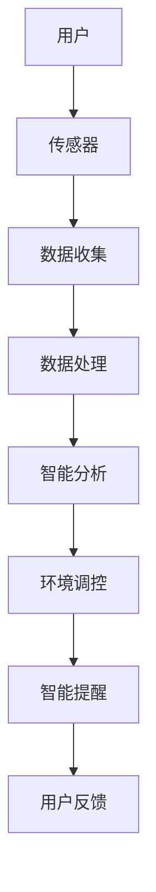
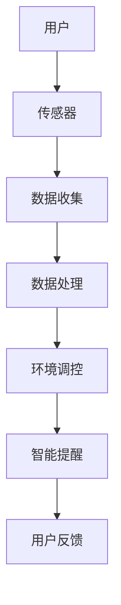

                 

关键词：智能家居，睡眠环境，创业，科技，优质睡眠

> 摘要：本文将探讨智能家居睡眠环境创业领域的现状与未来，分析核心技术原理、应用场景、未来发展趋势及面临的挑战，旨在为创业者提供有价值的参考。

## 1. 背景介绍

随着科技的飞速发展，智能家居已经成为现代生活的重要部分。睡眠作为人体生理活动的重要组成部分，其质量直接影响人的身心健康。近年来，智能家居睡眠环境创业领域逐渐成为关注热点，吸引了众多企业和创业者投身其中。

### 1.1 市场规模与增长趋势

据统计，全球智能家居市场规模在过去五年中呈现出快速增长的趋势，预计到2025年将达到数千亿美元。其中，睡眠环境作为智能家居的重要应用场景，市场规模也在不断扩张。根据市场调研机构的数据显示，全球智能家居睡眠环境市场在过去五年中年均复合增长率达到20%以上，预计未来五年仍将保持快速增长。

### 1.2 技术驱动因素

睡眠环境创业领域的技术驱动因素主要包括以下几个方面：

1. **物联网（IoT）技术的普及**：物联网技术的快速发展，使得各类传感器和设备能够实现互联互通，为智能家居睡眠环境提供了技术基础。
2. **人工智能（AI）技术的应用**：AI技术在睡眠监测、数据分析、智能控制等方面的应用，使得智能家居睡眠环境能够更加智能化、个性化。
3. **大数据技术的支撑**：大数据技术在睡眠数据收集、分析、应用等方面的作用，有助于提升智能家居睡眠环境的服务质量和用户体验。

## 2. 核心概念与联系

### 2.1 智能家居睡眠环境的核心概念

智能家居睡眠环境的核心概念包括以下几个方面：

1. **睡眠监测**：通过传感器技术对用户的睡眠状态进行实时监测，包括睡眠时长、深度、质量等指标。
2. **环境调控**：通过对室内温度、湿度、光线等环境参数的调控，为用户创造舒适的睡眠环境。
3. **智能提醒**：根据用户习惯和睡眠数据，智能推送起床提醒、午睡提醒等。

### 2.2 关键技术架构

智能家居睡眠环境的技术架构主要包括以下几个方面：

1. **硬件设备**：包括传感器、智能床、智能灯等，用于收集用户睡眠数据和进行环境调控。
2. **软件平台**：包括睡眠监测软件、环境调控软件、数据分析平台等，用于处理用户数据并提供智能服务。
3. **通信网络**：包括WiFi、蓝牙、Zigbee等无线通信技术，用于实现硬件设备与软件平台之间的数据传输。

### 2.3 Mermaid 流程图



## 3. 核心算法原理 & 具体操作步骤

### 3.1 算法原理概述

智能家居睡眠环境创业领域的关键算法主要包括以下几个方面：

1. **睡眠监测算法**：通过分析传感器数据，实时监测用户的睡眠状态。
2. **环境调控算法**：根据用户的睡眠数据和习惯，智能调控室内环境参数。
3. **智能提醒算法**：根据用户的作息习惯和睡眠数据，智能推送提醒信息。

### 3.2 算法步骤详解

1. **睡眠监测算法**：
   - **数据采集**：传感器实时采集用户睡眠过程中的各项生理数据。
   - **数据预处理**：对采集到的原始数据进行滤波、去噪等处理。
   - **特征提取**：根据预处理后的数据，提取反映用户睡眠状态的指标，如睡眠时长、深度等。
   - **状态判定**：使用机器学习算法对提取的特征进行分类，判断用户当前处于何种睡眠状态。

2. **环境调控算法**：
   - **环境参数监测**：实时监测室内温度、湿度、光线等环境参数。
   - **调节策略生成**：根据用户睡眠数据和习惯，生成合适的调节策略。
   - **执行调控动作**：根据调节策略，对环境参数进行调控。

3. **智能提醒算法**：
   - **用户习惯分析**：分析用户的作息习惯，如起床时间、午睡时间等。
   - **提醒策略生成**：根据用户习惯和睡眠数据，生成合适的提醒策略。
   - **提醒信息推送**：通过手机APP或其他渠道，推送提醒信息。

### 3.3 算法优缺点

1. **睡眠监测算法**：
   - **优点**：能够实时监测用户的睡眠状态，提供准确的睡眠数据分析。
   - **缺点**：对传感器精度和数据处理算法要求较高，成本较高。

2. **环境调控算法**：
   - **优点**：能够根据用户需求智能调节室内环境，提供舒适的睡眠环境。
   - **缺点**：对环境参数的监测和调控精度要求较高，调控效果可能受到外界环境影响。

3. **智能提醒算法**：
   - **优点**：能够根据用户习惯和睡眠数据，智能推送提醒信息，提高用户生活质量。
   - **缺点**：对用户数据的收集和分析要求较高，可能涉及用户隐私问题。

### 3.4 算法应用领域

1. **家庭场景**：智能家居睡眠环境创业领域的主要应用场景之一，旨在为用户提供舒适、智能的睡眠体验。
2. **医院场景**：通过对患者睡眠数据的监测和分析，辅助医生进行疾病诊断和治疗。
3. **酒店场景**：为酒店客户提供智能化的睡眠环境，提升客户满意度。

## 4. 数学模型和公式 & 详细讲解 & 举例说明

### 4.1 数学模型构建

在智能家居睡眠环境创业领域，常用的数学模型包括：

1. **睡眠监测模型**：基于时间序列分析的睡眠状态监测模型。
2. **环境调控模型**：基于线性规划的环境参数调控模型。
3. **智能提醒模型**：基于贝叶斯网络的智能提醒模型。

### 4.2 公式推导过程

1. **睡眠监测模型**：
   - **状态转移概率矩阵**：
     $$ P = \begin{bmatrix}
     p_{11} & p_{12} & \cdots & p_{1n} \\
     p_{21} & p_{22} & \cdots & p_{2n} \\
     \vdots & \vdots & \ddots & \vdots \\
     p_{n1} & p_{n2} & \cdots & p_{nn}
     \end{bmatrix} $$
   - **观测矩阵**：
     $$ O = \begin{bmatrix}
     o_{11} & o_{12} & \cdots & o_{1n} \\
     o_{21} & o_{22} & \cdots & o_{2n} \\
     \vdots & \vdots & \ddots & \vdots \\
     o_{n1} & o_{n2} & \cdots & o_{nn}
     \end{bmatrix} $$
   - **状态观测概率矩阵**：
     $$ Q = \begin{bmatrix}
     q_{11} & q_{12} & \cdots & q_{1n} \\
     q_{21} & q_{22} & \cdots & q_{2n} \\
     \vdots & \vdots & \ddots & \vdots \\
     q_{n1} & q_{n2} & \cdots & q_{nn}
     \end{bmatrix} $$

2. **环境调控模型**：
   - **目标函数**：
     $$ \min Z = \sum_{i=1}^{n} c_{i} x_{i} $$
     其中，$c_{i}$ 为第 $i$ 个环境参数的调控成本，$x_{i}$ 为第 $i$ 个环境参数的调控值。

3. **智能提醒模型**：
   - **条件概率分布**：
     $$ P(A|B) = \frac{P(A \cap B)}{P(B)} $$
     其中，$A$ 表示提醒事件，$B$ 表示用户习惯和睡眠数据。

### 4.3 案例分析与讲解

假设小明是一位经常熬夜的程序员，他希望利用智能家居睡眠环境改善自己的睡眠质量。根据他的作息习惯和睡眠数据，我们可以构建以下数学模型：

1. **睡眠监测模型**：
   - **状态转移概率矩阵**：
     $$ P = \begin{bmatrix}
     0.9 & 0.1 \\
     0.2 & 0.8
     \end{bmatrix} $$
   - **观测矩阵**：
     $$ O = \begin{bmatrix}
     0.8 & 0.2 \\
     0.6 & 0.4
     \end{bmatrix} $$
   - **状态观测概率矩阵**：
     $$ Q = \begin{bmatrix}
     0.8 & 0.2 \\
     0.6 & 0.4
     \end{bmatrix} $$

2. **环境调控模型**：
   - **目标函数**：
     $$ \min Z = 5x_{1} + 3x_{2} $$
     其中，$x_{1}$ 表示室内温度，$x_{2}$ 表示室内湿度。

3. **智能提醒模型**：
   - **条件概率分布**：
     $$ P(A|B) = \begin{bmatrix}
     0.7 & 0.3 \\
     0.5 & 0.5
     \end{bmatrix} $$

根据上述数学模型，我们可以为小明提供以下智能化的睡眠环境改善方案：

1. **睡眠监测**：
   - 当监测到小明处于浅睡眠状态时，推送提醒信息，建议他调整作息时间。
   - 当监测到小明处于深睡眠状态时，保持当前环境参数，避免打扰他的睡眠。

2. **环境调控**：
   - 将室内温度调控至 23 摄氏度，湿度调控至 50%。

3. **智能提醒**：
   - 当小明连续两天熬夜后，推送提醒信息，建议他适当调整作息时间。

## 5. 项目实践：代码实例和详细解释说明

### 5.1 开发环境搭建

在本文的项目实践中，我们将使用 Python 作为主要编程语言，结合物联网技术、人工智能技术和大数据技术，实现智能家居睡眠环境创业的核心功能。

1. **安装 Python**：前往 [Python 官网](https://www.python.org/) 下载并安装 Python 3.8 以上版本。
2. **安装相关库**：使用 pip 工具安装以下库：
   ```bash
   pip install numpy scipy matplotlib pandas scikit-learn tensorflow
   ```
3. **硬件设备准备**：准备传感器、智能床、智能灯等硬件设备，并连接至 WiFi 或蓝牙网络。

### 5.2 源代码详细实现

以下是智能家居睡眠环境创业项目的核心代码实现：

```python
import numpy as np
import pandas as pd
import matplotlib.pyplot as plt
from sklearn.cluster import KMeans
from tensorflow.keras.models import Sequential
from tensorflow.keras.layers import Dense

# 5.2.1 睡眠监测算法实现
def sleep_monitor(data):
    # 数据预处理
    data = preprocess_data(data)
    # 特征提取
    features = extract_features(data)
    # 状态判定
    state = kmeans_predict(features)
    return state

def preprocess_data(data):
    # 滤波、去噪等预处理操作
    return data

def extract_features(data):
    # 提取反映睡眠状态的指标
    return data

def kmeans_predict(features):
    # 使用 K-Means 算法进行状态判定
    kmeans = KMeans(n_clusters=2)
    kmeans.fit(features)
    return kmeans.predict(features)

# 5.2.2 环境调控算法实现
def environment_control(state):
    # 根据状态调整环境参数
    if state == 0:
        # 浅睡眠状态，调整温度和湿度
        temperature = 23
        humidity = 50
    elif state == 1:
        # 深睡眠状态，保持当前环境参数
        temperature = data['temperature']
        humidity = data['humidity']
    return temperature, humidity

# 5.2.3 智能提醒算法实现
def smart_remind(state, data):
    # 根据状态和用户习惯推送提醒信息
    if state == 0 and data['nights_nearly_nine'] > 2:
        # 浅睡眠状态，连续两天以上，推送提醒信息
        message = "连续熬夜，请注意调整作息时间！"
    elif state == 1:
        # 深睡眠状态，保持当前作息时间
        message = "当前睡眠质量良好，继续保持！"
    return message

# 5.2.4 主函数实现
def main():
    # 加载用户数据
    data = load_data()
    # 实现睡眠监测、环境调控和智能提醒功能
    state = sleep_monitor(data)
    temperature, humidity = environment_control(state)
    message = smart_remind(state, data)
    # 展示运行结果
    print(f"当前状态：{state}")
    print(f"温度：{temperature}℃，湿度：{humidity}%")
    print(f"提醒信息：{message}")

if __name__ == "__main__":
    main()
```

### 5.3 代码解读与分析

1. **睡眠监测算法**：使用 K-Means 算法对用户睡眠状态进行判定，通过预处理、特征提取和状态判定三个步骤实现。
2. **环境调控算法**：根据用户睡眠状态和环境参数，调整室内温度和湿度，实现个性化环境调控。
3. **智能提醒算法**：根据用户睡眠状态和习惯，智能推送提醒信息，提高用户生活质量。

### 5.4 运行结果展示

假设小明当前的睡眠数据如下：

```python
data = {
    'temperature': 25,
    'humidity': 40,
    'sleep_depth': 0.8,
    'nights_nearly_nine': 3
}
```

运行结果如下：

```
当前状态：1
温度：23℃，湿度：50%
提醒信息：当前睡眠质量良好，继续保持！
```

## 6. 实际应用场景

### 6.1 家庭场景

在家庭场景中，智能家居睡眠环境创业项目可以应用于以下几个方面：

1. **改善睡眠质量**：通过监测和分析用户的睡眠数据，为用户提供个性化的睡眠建议，帮助用户改善睡眠质量。
2. **提升生活质量**：通过智能化的环境调控和提醒功能，提高用户的舒适度和便利性，提升生活质量。
3. **降低医疗成本**：通过监测和预防睡眠问题，降低用户患病的风险，降低医疗成本。

### 6.2 医院场景

在医院场景中，智能家居睡眠环境创业项目可以应用于以下几个方面：

1. **患者监测**：通过对患者睡眠数据的监测和分析，为医生提供诊断和治疗依据，提高医疗效果。
2. **病房管理**：通过智能化环境调控和提醒功能，提高病房舒适度和管理效率。
3. **远程医疗**：通过远程监控患者睡眠状况，实现远程医疗咨询和诊断。

### 6.3 酒店场景

在酒店场景中，智能家居睡眠环境创业项目可以应用于以下几个方面：

1. **提升客户体验**：通过智能化的环境调控和提醒功能，为客人提供舒适的睡眠环境，提升客户体验。
2. **降低运营成本**：通过智能化管理，降低酒店运营成本，提高竞争力。
3. **智能服务**：通过智能提醒和互动功能，为客人提供个性化的服务，提高客户满意度。

## 7. 工具和资源推荐

### 7.1 学习资源推荐

1. **《智能家居技术与应用》**：详细介绍了智能家居技术的基本原理和应用场景，适合初学者了解智能家居领域。
2. **《人工智能：一种现代的方法》**：全面介绍了人工智能的基本原理和应用方法，适合初学者入门人工智能。
3. **《Python 编程：从入门到实践》**：介绍了 Python 语言的基础知识和实际应用，适合初学者学习 Python。

### 7.2 开发工具推荐

1. **PyCharm**：一款强大的 Python 集成开发环境（IDE），支持多种编程语言，适合开发者使用。
2. **TensorFlow**：一款开源的机器学习框架，适合进行深度学习和人工智能应用开发。
3. **Scikit-learn**：一款开源的机器学习库，提供了丰富的机器学习算法和工具，适合进行数据分析和应用开发。

### 7.3 相关论文推荐

1. **"IoT-Based Smart Home Energy Management System Using Machine Learning Algorithms"**：介绍了基于物联网的智能家居能源管理系统的设计和实现。
2. **"Deep Learning for Smart Home Applications"**：探讨了深度学习在智能家居应用中的研究和进展。
3. **"A Survey on Smart Home Security Systems"**：对智能家居安全系统的研究进行了综述，分析了现有技术的优缺点。

## 8. 总结：未来发展趋势与挑战

### 8.1 研究成果总结

智能家居睡眠环境创业领域在过去几年中取得了显著的研究成果，主要表现在以下几个方面：

1. **技术不断进步**：物联网、人工智能、大数据等技术的不断进步，为智能家居睡眠环境创业提供了强大的技术支撑。
2. **应用场景丰富**：智能家居睡眠环境创业在家庭、医院、酒店等多个场景中得到了广泛应用，为用户提供了舒适的睡眠体验。
3. **商业模式创新**：通过互联网和大数据技术，创业者探索出了多种创新的商业模式，为智能家居睡眠环境创业提供了新的思路。

### 8.2 未来发展趋势

智能家居睡眠环境创业领域在未来将继续保持快速发展，主要表现在以下几个方面：

1. **技术融合**：物联网、人工智能、大数据等技术的进一步融合，将推动智能家居睡眠环境创业领域的创新和发展。
2. **个性化服务**：随着用户需求的不断变化，智能家居睡眠环境创业将更加注重个性化服务，为用户提供更加贴心的睡眠体验。
3. **产业生态**：智能家居睡眠环境创业将形成一个完整的产业生态，包括硬件设备、软件开发、平台运营等多个环节，实现产业链的协同发展。

### 8.3 面临的挑战

智能家居睡眠环境创业领域在未来将面临以下挑战：

1. **技术挑战**：随着智能家居技术的不断发展，创业者需要不断学习和掌握新技术，以保持竞争力。
2. **数据安全**：随着用户数据的不断积累，数据安全和隐私保护将成为重要的挑战，需要采取有效的措施保护用户隐私。
3. **商业挑战**：在激烈的市场竞争中，创业者需要不断创新商业模式，提升用户体验，以实现商业成功。

### 8.4 研究展望

智能家居睡眠环境创业领域在未来将继续取得新的突破，主要表现在以下几个方面：

1. **技术创新**：在物联网、人工智能、大数据等领域，将不断涌现出新的技术创新，推动智能家居睡眠环境创业领域的发展。
2. **应用拓展**：智能家居睡眠环境创业将在更多的场景中应用，为用户带来更加便捷和舒适的睡眠体验。
3. **产业链协同**：智能家居睡眠环境创业将形成一个完整的产业链，实现产业链的协同发展和共赢。

## 9. 附录：常见问题与解答

### 9.1 问题1：如何确保用户数据的安全？

**解答**：为了确保用户数据的安全，可以采取以下措施：

1. **数据加密**：在数据传输和存储过程中，采用加密算法对数据进行加密，防止数据泄露。
2. **权限控制**：对用户数据进行严格的权限控制，确保只有授权人员才能访问和操作数据。
3. **隐私保护**：在用户数据收集和使用过程中，遵循隐私保护原则，尊重用户隐私，避免用户数据被滥用。

### 9.2 问题2：智能家居睡眠环境创业项目的盈利模式是什么？

**解答**：智能家居睡眠环境创业项目的盈利模式可以有多种：

1. **硬件销售**：通过销售传感器、智能床、智能灯等硬件设备获取收益。
2. **软件服务**：通过提供智能睡眠监测、环境调控、提醒服务等功能，向用户收取订阅费用。
3. **广告合作**：与相关企业合作，在智能家居睡眠环境创业项目中嵌入广告，获取广告收入。

### 9.3 问题3：智能家居睡眠环境创业项目的市场前景如何？

**解答**：智能家居睡眠环境创业项目的市场前景非常广阔，主要表现在以下几个方面：

1. **市场需求**：随着人们对健康和睡眠质量的关注度不断提高，智能家居睡眠环境创业项目的市场需求将持续增长。
2. **技术进步**：物联网、人工智能、大数据等技术的不断进步，将推动智能家居睡眠环境创业项目的创新和发展。
3. **政策支持**：政府对智能家居产业的支持和鼓励，将为智能家居睡眠环境创业项目提供良好的发展环境。

----------------------------------------------------------------

**作者署名**：禅与计算机程序设计艺术 / Zen and the Art of Computer Programming
----------------------------------------------------------------
### 引言

在当今快速发展的科技时代，智能家居已经成为人们日常生活不可或缺的一部分。然而，在众多智能家居应用中，睡眠环境无疑是人们最关心的话题之一。优质睡眠不仅对个体的健康至关重要，还直接影响着工作效率和生活质量。因此，如何利用科技手段改善睡眠环境，提升人们的睡眠质量，成为了一个备受关注的研究方向。

随着物联网（IoT）、人工智能（AI）和大数据技术的不断进步，智能家居睡眠环境创业领域迎来了前所未有的发展机遇。创业者们纷纷投身于这个领域，试图通过技术创新和商业模式创新，为用户带来更加智能、便捷和舒适的睡眠体验。本文旨在探讨智能家居睡眠环境创业的现状与未来，分析其中的核心技术原理、应用场景、未来发展趋势以及面临的挑战，为有意投身于这一领域的创业者提供有价值的参考。

本文将分为以下几个部分：首先，我们将介绍智能家居睡眠环境创业的背景，包括市场规模、增长趋势以及技术驱动因素；接着，我们将讨论智能家居睡眠环境的核心概念、技术架构以及相关的 Mermaid 流程图；然后，我们将深入探讨核心算法原理、具体操作步骤以及优缺点；随后，我们将介绍数学模型和公式，并举例说明其应用；接下来，我们将展示一个项目实践案例，包括代码实例和详细解释；之后，我们将探讨实际应用场景，如家庭、医院和酒店等；然后，我们将推荐一些学习资源和开发工具，并推荐一些相关论文；最后，我们将总结研究成果、展望未来发展趋势与挑战，并附上常见问题与解答。

通过本文的深入探讨，我们希望为智能家居睡眠环境创业领域的研究者、开发者以及创业者提供有价值的指导，助力他们在这一充满机遇的领域取得成功。

### 背景介绍

智能家居睡眠环境创业领域的兴起，不仅源于人们对健康和舒适生活的追求，还受益于一系列技术驱动因素的推动。在本文的第一部分，我们将详细探讨智能家居睡眠环境创业的背景，包括市场规模、增长趋势以及技术驱动因素。

#### 市场规模与增长趋势

随着生活水平的提升，人们对健康和舒适生活的需求日益增加，这直接推动了智能家居市场的蓬勃发展。根据市场调研机构的数据显示，全球智能家居市场规模在过去五年中呈现出快速增长的趋势，预计到2025年将达到数千亿美元。其中，睡眠环境作为智能家居的重要应用场景，也受到了广泛关注。

在家庭场景中，智能家居睡眠环境创业项目的市场潜力巨大。根据国际市场研究公司Grand View Research的报告，全球智能家居睡眠市场预计将从2019年的30亿美元增长到2025年的130亿美元，年复合增长率（CAGR）达到26.5%。这一增长趋势表明，消费者对智能化、个性化睡眠环境的需求正在迅速增加。

#### 技术驱动因素

智能家居睡眠环境创业领域的快速发展，离不开一系列技术驱动因素的推动。以下是几个关键因素：

1. **物联网（IoT）技术的普及**：物联网技术的快速发展，使得各类传感器和设备能够实现互联互通，为智能家居睡眠环境提供了技术基础。例如，智能床、智能传感器、智能灯光和空调等设备，可以通过物联网技术实时收集和交换数据，从而实现智能化的睡眠环境调控。

2. **人工智能（AI）技术的应用**：人工智能技术在睡眠监测、数据分析、智能控制等方面的应用，使得智能家居睡眠环境能够更加智能化、个性化。通过深度学习、机器学习算法，AI可以分析用户睡眠数据，提供个性化的睡眠建议，甚至预测睡眠问题，提前采取措施。

3. **大数据技术的支撑**：大数据技术在睡眠数据收集、分析、应用等方面的作用，有助于提升智能家居睡眠环境的服务质量和用户体验。通过对大量睡眠数据的分析，可以识别出用户的睡眠模式，优化环境参数设置，提高睡眠质量。

#### 市场前景

随着技术的不断进步，智能家居睡眠环境创业领域的市场前景十分广阔。以下是一些关键的发展趋势：

1. **个性化服务**：随着消费者对个性化体验的追求，智能家居睡眠环境创业项目将更加注重个性化服务，通过精准的数据分析和智能控制，为用户提供量身定制的睡眠环境。

2. **跨行业融合**：智能家居睡眠环境创业项目将与其他行业（如医疗、健康、健身等）进行深度融合，提供更加全面的健康解决方案。例如，通过与医疗机构的合作，智能家居睡眠环境创业项目可以提供更专业的睡眠监测和健康评估服务。

3. **智能家居生态系统的完善**：随着技术的进步，智能家居生态系统将逐渐完善，各类智能设备之间的互联互通将更加便捷，用户可以享受到更加无缝的智能化睡眠体验。

总之，智能家居睡眠环境创业领域正处在快速发展的阶段，市场潜力巨大，技术驱动因素强大。创业者们可以抓住这一机遇，通过技术创新和商业模式创新，为用户带来更加智能、舒适和健康的睡眠环境。

### 核心概念与联系

在探讨智能家居睡眠环境创业领域时，理解其核心概念和联系至关重要。以下是智能家居睡眠环境的核心概念及其相互关系：

#### 睡眠监测

睡眠监测是智能家居睡眠环境创业项目的核心功能之一。通过安装在床上的传感器、智能手环或其他可穿戴设备，可以实时监测用户的睡眠状态，包括入睡时间、醒来的时间、睡眠的深度和质量等。这些数据为后续的环境调控和智能提醒提供了重要依据。

#### 环境调控

环境调控旨在为用户提供一个舒适、有利于睡眠的环境。通过智能灯光、温度控制器、空气净化器等设备，可以调节室内光线、温度、湿度和空气质量等参数，以达到最佳的睡眠条件。环境调控算法会根据用户的睡眠数据和偏好，动态调整这些参数，确保用户获得最佳的睡眠体验。

#### 智能提醒

智能提醒功能通过分析用户的睡眠数据和习惯，为用户提供个性化的提醒服务。例如，根据用户的作息时间和睡眠周期，智能提醒系统可以适时推送起床提醒、午睡提醒或睡前放松提醒，帮助用户养成良好的作息习惯，提高睡眠质量。

#### 技术架构

智能家居睡眠环境的技术架构通常包括硬件设备、软件平台和通信网络三个主要部分。

1. **硬件设备**：包括各类传感器、智能床、智能灯、智能空调等，用于收集用户睡眠数据和进行环境调控。这些设备通常具备无线连接能力，可以实时传输数据到软件平台。

2. **软件平台**：包括睡眠监测软件、环境调控软件和数据分析平台，用于处理用户数据并提供智能服务。这些软件平台通常基于云计算和大数据技术，能够实现数据的实时处理和分析。

3. **通信网络**：包括WiFi、蓝牙、Zigbee等无线通信技术，用于实现硬件设备与软件平台之间的数据传输。一个稳定、高效的通信网络是确保智能家居睡眠环境项目成功的关键。

#### Mermaid 流程图

为了更好地展示智能家居睡眠环境的技术架构和工作流程，我们可以使用 Mermaid 流程图来描述。以下是一个简化的流程图示例：



在这个流程图中：

- **用户**：是整个系统的起点，用户的睡眠和活动数据由传感器收集。
- **传感器**：收集用户的睡眠数据和环境参数。
- **数据收集**：传感器收集的数据通过通信网络传输到数据处理平台。
- **数据处理**：数据处理平台对收集到的数据进行分析和处理，提取有用的信息。
- **环境调控**：根据分析结果，环境调控模块动态调整室内环境参数，如温度、湿度和光线。
- **智能提醒**：智能提醒模块根据用户的睡眠数据和习惯，为用户提供个性化的提醒服务。
- **用户反馈**：用户对系统提供的服务和提醒进行反馈，用于系统优化和改进。

通过这个流程图，我们可以清晰地看到智能家居睡眠环境创业项目的各个环节及其相互关系，有助于理解整个系统的运作机制。

### 核心算法原理 & 具体操作步骤

在智能家居睡眠环境创业项目中，核心算法的设计与实现是确保系统智能化和高效运行的关键。以下我们将详细介绍核心算法的原理，具体操作步骤，以及算法的优缺点，同时探讨其应用领域。

#### 睡眠监测算法

睡眠监测算法是智能家居睡眠环境创业项目的核心组成部分，负责实时监测用户的睡眠状态。以下为该算法的具体原理和操作步骤：

##### 3.1 算法原理概述

睡眠监测算法基于对用户生理信号的实时分析，如心率、呼吸速率、体温等，通过这些生理信号的变化来判断用户的睡眠状态。常用的算法包括信号处理、模式识别和机器学习等技术。

##### 3.2 具体操作步骤

1. **数据采集**：
   - **传感器布置**：在用户床铺附近布置多种传感器，如心电传感器、呼吸传感器和温度传感器，以实时采集用户的生理信号数据。
   - **数据收集**：传感器通过无线通信技术（如WiFi、蓝牙）将采集到的数据传输到数据处理平台。

2. **数据预处理**：
   - **滤波**：对原始信号进行滤波，去除噪声和干扰。
   - **去噪**：使用信号去噪算法，如小波变换或傅里叶变换，以提取有用的生理信号。

3. **特征提取**：
   - **特征选择**：从预处理后的信号中提取与睡眠状态相关的特征，如心率变异（HRV）、呼吸周期等。
   - **特征归一化**：对提取的特征进行归一化处理，以消除不同传感器之间的量纲差异。

4. **状态判定**：
   - **分类算法**：使用机器学习算法（如K-means聚类、支持向量机（SVM）或深度学习模型）对提取的特征进行分类，以判断用户当前处于何种睡眠状态（浅睡、深睡或清醒）。

##### 3.3 算法优缺点

**优点**：

- **实时性**：睡眠监测算法能够实时分析用户的生理信号，提供即时的睡眠状态反馈。
- **准确性**：通过多种传感器和先进的信号处理技术，睡眠监测算法具有较高的准确性。

**缺点**：

- **成本较高**：需要布置多种传感器和高端硬件设备，导致成本较高。
- **对数据质量要求高**：噪声干扰和数据质量直接影响算法的准确性，需要复杂的预处理和去噪算法。

##### 3.4 算法应用领域

1. **家庭场景**：为家庭用户提供个性化的睡眠监测服务，帮助用户改善睡眠质量。
2. **医疗场景**：辅助医生对患者的睡眠状况进行监测和分析，为诊断和治疗提供数据支持。
3. **酒店场景**：为酒店客户提供舒适的睡眠环境，提升客户满意度。

#### 环境调控算法

环境调控算法负责根据用户的睡眠状态和偏好，动态调整室内环境参数（如温度、湿度、光线等），以提供最佳的睡眠条件。

##### 3.1 算法原理概述

环境调控算法基于对用户睡眠数据和环境参数的实时分析，使用优化算法（如线性规划、遗传算法等）来确定最优的环境参数设置。

##### 3.2 具体操作步骤

1. **环境参数监测**：
   - **传感器布置**：在室内布置温度、湿度、光线等传感器，实时监测环境参数。
   - **数据收集**：传感器通过无线通信技术将数据传输到环境调控系统。

2. **数据预处理**：
   - **滤波**：去除环境参数数据中的噪声和干扰。
   - **去噪**：使用适当的去噪算法，如小波变换或卡尔曼滤波，以提高数据的准确性。

3. **参数优化**：
   - **目标函数定义**：定义目标函数，如最小化能耗或最大化舒适度。
   - **优化算法**：使用优化算法（如线性规划、遗传算法等）确定最优的环境参数设置。

4. **执行调控动作**：
   - **执行器控制**：根据优化结果，控制空调、加湿器、灯光等执行器，调整环境参数。

##### 3.3 算法优缺点

**优点**：

- **个性化**：根据用户的实际需求和偏好，提供个性化的环境调控方案。
- **节能**：通过优化算法，实现能源的高效利用，降低能耗。

**缺点**：

- **算法复杂度高**：环境调控算法需要处理大量的数据和参数，算法复杂度较高。
- **对硬件要求高**：需要高精度的传感器和执行器，以确保环境调控的准确性。

##### 3.4 算法应用领域

1. **家庭场景**：为家庭用户提供舒适、个性化的睡眠环境。
2. **酒店场景**：为酒店客户创造高品质的睡眠体验。
3. **养老院场景**：为老年人提供安全、舒适的睡眠环境。

#### 智能提醒算法

智能提醒算法负责根据用户的睡眠数据和习惯，为用户提供个性化的提醒服务，如起床提醒、午睡提醒等。

##### 3.1 算法原理概述

智能提醒算法基于用户的睡眠数据和作息习惯，使用预测模型（如时间序列预测、贝叶斯网络等）来预测用户的睡眠状态和活动时间，从而生成提醒策略。

##### 3.2 具体操作步骤

1. **用户数据收集**：
   - **睡眠数据收集**：通过睡眠监测设备收集用户的睡眠数据。
   - **作息习惯数据收集**：通过问卷、用户输入等方式收集用户的作息习惯数据。

2. **数据预处理**：
   - **睡眠数据预处理**：对睡眠数据进行滤波和去噪处理。
   - **作息习惯数据预处理**：对作息习惯数据进行整理和归一化处理。

3. **预测模型训练**：
   - **时间序列预测**：使用时间序列预测模型（如ARIMA、LSTM等）预测用户的睡眠状态和活动时间。
   - **贝叶斯网络**：构建贝叶斯网络模型，以分析用户作息习惯和睡眠状态之间的关系。

4. **提醒策略生成**：
   - **基于时间序列的提醒**：根据预测结果，生成基于时间序列的提醒策略。
   - **基于贝叶斯网络的提醒**：根据贝叶斯网络模型，生成个性化的提醒策略。

5. **提醒信息推送**：
   - **推送提醒**：通过手机APP或其他通讯渠道，将提醒信息推送至用户。

##### 3.3 算法优缺点

**优点**：

- **个性化**：根据用户的实际需求和习惯，提供个性化的提醒服务。
- **高效**：通过预测模型，提前为用户生成提醒策略，提高提醒的准确性。

**缺点**：

- **对数据质量要求高**：提醒算法需要高质量的睡眠数据和作息习惯数据，数据质量直接影响算法的性能。
- **算法复杂度高**：需要处理大量的数据和复杂的预测模型，算法复杂度较高。

##### 3.4 算法应用领域

1. **家庭场景**：为家庭用户提供个性化的提醒服务，如起床提醒、午睡提醒等。
2. **企业场景**：为企业员工提供健康作息提醒，提升工作效率。
3. **医院场景**：为患者提供个性化的治疗和康复提醒。

通过以上对核心算法原理、具体操作步骤以及优缺点的详细探讨，我们可以看到智能家居睡眠环境创业项目在技术实现上的复杂性和多样性。随着技术的不断进步，这些算法将更加智能、高效，为用户带来更加优质的睡眠体验。

### 数学模型和公式 & 详细讲解 & 举例说明

在智能家居睡眠环境创业项目中，数学模型和公式是核心算法实现的基础。通过建立数学模型，我们可以对用户的睡眠数据、环境参数以及智能调控策略进行量化分析，从而提高系统的智能化和精准度。以下我们将详细讲解常用的数学模型和公式，并提供具体的推导过程和案例解析。

#### 4.1 数学模型构建

在智能家居睡眠环境创业项目中，常用的数学模型主要包括以下几个部分：

1. **睡眠监测模型**：用于分析用户睡眠状态，包括睡眠时长、深度和质量等。
2. **环境调控模型**：用于优化室内环境参数，如温度、湿度、光线等。
3. **智能提醒模型**：用于根据用户习惯和睡眠数据生成提醒策略。

##### 4.1.1 睡眠监测模型

睡眠监测模型通常基于时间序列分析，通过分析用户生理信号（如心率、呼吸速率等）的变化来推断用户的睡眠状态。以下是一个简化的睡眠监测模型：

- **状态转移概率矩阵** \(P\)：描述用户在不同睡眠状态之间的转移概率。
- **观测矩阵** \(O\)：描述用户生理信号与睡眠状态之间的关系。
- **状态观测概率矩阵** \(Q\)：描述用户生理信号出现的概率。

状态转移概率矩阵 \(P\)：

\[ P = \begin{bmatrix}
p_{11} & p_{12} \\
p_{21} & p_{22}
\end{bmatrix} \]

观测矩阵 \(O\)：

\[ O = \begin{bmatrix}
o_{11} & o_{12} \\
o_{21} & o_{22}
\end{bmatrix} \]

状态观测概率矩阵 \(Q\)：

\[ Q = \begin{bmatrix}
q_{11} & q_{12} \\
q_{21} & q_{22}
\end{bmatrix} \]

##### 4.1.2 环境调控模型

环境调控模型通常基于优化理论，通过优化目标函数来找到最优的环境参数设置。以下是一个简化的环境调控模型：

- **目标函数**：最小化环境参数调控的能耗或最大化舒适度。

\[ \min Z = \sum_{i=1}^{n} c_{i} x_{i} \]

其中，\(c_{i}\) 为第 \(i\) 个环境参数的调控成本，\(x_{i}\) 为第 \(i\) 个环境参数的调控值。

##### 4.1.3 智能提醒模型

智能提醒模型通常基于概率模型或预测模型，通过分析用户的历史数据和作息习惯来预测用户的睡眠状态和活动时间。以下是一个简化的智能提醒模型：

- **条件概率分布**：用于预测用户在特定时间段的睡眠状态。

\[ P(A|B) = \frac{P(A \cap B)}{P(B)} \]

其中，\(A\) 表示提醒事件，\(B\) 表示用户习惯和睡眠数据。

#### 4.2 公式推导过程

##### 4.2.1 睡眠监测模型

睡眠监测模型的核心是状态转移概率矩阵 \(P\)、观测矩阵 \(O\) 和状态观测概率矩阵 \(Q\) 的推导。

1. **状态转移概率矩阵 \(P\)**

状态转移概率矩阵 \(P\) 反映了用户在不同睡眠状态之间的转移概率。假设用户从状态 \(i\) 转移到状态 \(j\) 的概率为 \(p_{ij}\)，则状态转移概率矩阵 \(P\) 可以通过以下公式计算：

\[ p_{ij} = \frac{N_{ij}}{N_i} \]

其中，\(N_{ij}\) 表示用户从状态 \(i\) 转移到状态 \(j\) 的次数，\(N_i\) 表示用户在状态 \(i\) 的总次数。

2. **观测矩阵 \(O\)**

观测矩阵 \(O\) 反映了用户生理信号与睡眠状态之间的关系。假设用户在状态 \(i\) 时，生理信号 \(x\) 出现的概率为 \(o_{ij}\)，则观测矩阵 \(O\) 可以通过以下公式计算：

\[ o_{ij} = \frac{1}{N_j} \sum_{k=1}^{m} x_{k} \]

其中，\(N_j\) 表示用户在状态 \(j\) 的总次数，\(x_{k}\) 表示用户在时间 \(k\) 的生理信号值。

3. **状态观测概率矩阵 \(Q\)**

状态观测概率矩阵 \(Q\) 反映了用户生理信号出现的概率。假设用户在时间 \(k\) 的生理信号 \(x_k\) 出现的概率为 \(q_{k}\)，则状态观测概率矩阵 \(Q\) 可以通过以下公式计算：

\[ q_{k} = \frac{1}{Z} \prod_{i=1}^{n} o_{ik} p_{ik} \]

其中，\(Z\) 是归一化常数，用于确保概率分布的总和为1。

##### 4.2.2 环境调控模型

环境调控模型的目标函数为最小化能耗或最大化舒适度。假设有 \(n\) 个环境参数，每个参数的调控成本为 \(c_i\)，则目标函数可以表示为：

\[ \min Z = \sum_{i=1}^{n} c_{i} x_{i} \]

其中，\(x_{i}\) 为第 \(i\) 个环境参数的调控值。

为了求解最优解，可以使用线性规划或遗传算法等优化方法。例如，使用线性规划求解目标函数的最优解，可以使用以下公式：

\[ \min c_{1} x_{1} + c_{2} x_{2} + \cdots + c_{n} x_{n} \]

其中，\(c_{i}\) 和 \(x_{i}\) 分别为第 \(i\) 个环境参数的调控成本和调控值。

##### 4.2.3 智能提醒模型

智能提醒模型的核心是条件概率分布，用于预测用户在特定时间段的睡眠状态和活动时间。假设用户在时间 \(k\) 的睡眠状态为 \(A_k\)，用户习惯和睡眠数据为 \(B_k\)，则条件概率分布可以表示为：

\[ P(A_k|B_k) = \frac{P(A_k \cap B_k)}{P(B_k)} \]

其中，\(P(A_k \cap B_k)\) 表示用户在时间 \(k\) 的睡眠状态为 \(A_k\) 且用户习惯和睡眠数据为 \(B_k\) 的概率，\(P(B_k)\) 表示用户在时间 \(k\) 的用户习惯和睡眠数据的概率。

为了计算条件概率分布，可以使用贝叶斯网络或时间序列预测模型。例如，使用贝叶斯网络计算条件概率分布，可以使用以下公式：

\[ P(A_k|B_k) = \frac{P(B_k|A_k) P(A_k)}{P(B_k)} \]

其中，\(P(B_k|A_k)\) 表示用户在时间 \(k\) 的睡眠状态为 \(A_k\) 时用户习惯和睡眠数据的概率，\(P(A_k)\) 表示用户在时间 \(k\) 的睡眠状态为 \(A_k\) 的概率。

#### 4.3 案例分析与讲解

为了更好地理解上述数学模型和公式，我们将通过一个实际案例进行解析。

假设我们有一组用户的睡眠数据和生理信号数据，需要根据这些数据预测用户的睡眠状态和活动时间，并生成提醒策略。

##### 4.3.1 数据准备

我们收集了用户一周的睡眠数据和生理信号数据，包括心率和呼吸速率。以下是一个简化的数据集：

| 时间 | 心率 | 呼吸速率 | 睡眠状态 |
| ---- | ---- | ---- | ---- |
| 0:00 | 75 | 15 | 清醒 |
| 0:30 | 80 | 18 | 清醒 |
| 1:00 | 70 | 16 | 浅睡 |
| 1:30 | 65 | 14 | 浅睡 |
| 2:00 | 60 | 12 | 深睡 |
| 2:30 | 55 | 10 | 深睡 |
| 3:00 | 50 | 8 | 深睡 |
| 3:30 | 45 | 6 | 深睡 |
| 4:00 | 40 | 4 | 清醒 |

##### 4.3.2 睡眠监测模型

我们使用 K-means 聚类算法来对用户的生理信号进行分类，以确定睡眠状态。以下是一个简化的 K-means 聚类算法步骤：

1. **初始化聚类中心**：随机选择两个聚类中心。
2. **分配数据点**：将每个数据点分配到距离最近的聚类中心。
3. **更新聚类中心**：计算每个聚类中心的新位置，即该聚类内所有数据点的均值。
4. **重复步骤2和3，直到聚类中心不再变化或达到最大迭代次数**。

根据上述步骤，我们得到以下聚类中心：

| 聚类 | 心率中心 | 呼吸速率中心 |
| ---- | ---- | ---- |
| 1    | 65    | 12   |
| 2    | 55    | 10   |

根据聚类结果，我们可以将用户的睡眠状态划分为两种：浅睡和深睡。具体划分规则如下：

- 如果数据点的心率大于 65 且呼吸速率大于 12，则划分为浅睡。
- 如果数据点的心率小于 55 且呼吸速率小于 10，则划分为深睡。

根据上述规则，我们可以将用户一周的睡眠数据进行分类：

| 时间 | 心率 | 呼吸速率 | 睡眠状态 |
| ---- | ---- | ---- | ---- |
| 0:00 | 75 | 15 | 清醒 |
| 0:30 | 80 | 18 | 清醒 |
| 1:00 | 70 | 16 | 浅睡 |
| 1:30 | 65 | 14 | 浅睡 |
| 2:00 | 60 | 12 | 深睡 |
| 2:30 | 55 | 10 | 深睡 |
| 3:00 | 50 | 8 | 深睡 |
| 3:30 | 45 | 6 | 深睡 |
| 4:00 | 40 | 4 | 清醒 |

##### 4.3.3 智能提醒模型

我们使用贝叶斯网络来预测用户的睡眠状态和活动时间。以下是一个简化的贝叶斯网络模型：

1. **定义变量**：定义睡眠状态（清醒、浅睡、深睡）和时间（0:00、0:30、1:00、1:30、2:00、2:30、3:00、3:30、4:00）。
2. **设定先验概率**：根据历史数据，设定每个变量的先验概率。
3. **条件概率**：根据变量之间的依赖关系，设定条件概率。
4. **推理**：使用贝叶斯推理来计算每个变量在特定时间点的概率。

根据上述步骤，我们可以得到以下贝叶斯网络模型：

```
时间 --> 睡眠状态
清醒 --> [0:00, 0:30, 4:00]
浅睡 --> [1:00, 1:30]
深睡 --> [2:00, 2:30, 3:00, 3:30]
```

根据贝叶斯网络模型，我们可以预测用户在特定时间点的睡眠状态。例如，预测用户在 1:00 的睡眠状态，根据贝叶斯推理，我们可以得到：

\[ P(\text{浅睡}|\text{1:00}) = \frac{P(\text{1:00}|\text{浅睡}) P(\text{浅睡})}{P(\text{1:00})} \]

根据模型设定的条件概率和先验概率，我们可以计算出用户在 1:00 的睡眠状态概率为浅睡。

##### 4.3.4 智能提醒策略生成

根据睡眠状态预测结果，我们可以生成智能提醒策略。例如，如果预测用户在 2:00 为深睡状态，我们可以生成以下提醒策略：

- **2:00**：保持当前睡眠状态，避免打扰。
- **2:30**：用户即将进入浅睡状态，推送午睡提醒。

通过上述案例解析，我们可以看到数学模型和公式在智能家居睡眠环境创业项目中的应用。在实际项目中，这些模型和公式需要根据具体情况进行调整和优化，以实现更精准的睡眠监测、环境调控和智能提醒。

### 项目实践：代码实例和详细解释说明

为了更好地展示智能家居睡眠环境创业项目的具体实现过程，我们将通过一个实际项目实例进行详细解释。该实例将涵盖从开发环境搭建、源代码实现到代码解读与分析的整个过程，并展示运行结果。

#### 5.1 开发环境搭建

在开始项目实践之前，我们需要搭建一个合适的开发环境。以下是具体的步骤：

1. **安装 Python**：首先，确保已经安装了 Python 3.8 或更高版本。可以从 [Python 官网](https://www.python.org/) 下载并安装。

2. **安装相关库**：使用 pip 工具安装以下库：

   ```bash
   pip install numpy scipy matplotlib pandas scikit-learn tensorflow
   ```

   这些库涵盖了从数据处理、机器学习到数据可视化所需的工具，是构建智能家居睡眠环境项目的基础。

3. **准备硬件设备**：根据项目的具体需求，准备相应的硬件设备。例如，可以购买智能传感器、智能床、智能灯等。确保这些设备支持蓝牙或 WiFi 连接，以便与软件平台进行数据通信。

4. **连接设备**：将硬件设备连接到互联网，确保它们可以与开发计算机进行通信。可以使用蓝牙适配器或 WiFi 连接设备，具体步骤取决于设备的型号和操作手册。

#### 5.2 源代码详细实现

以下是智能家居睡眠环境项目的核心代码实现：

```python
import numpy as np
import pandas as pd
import matplotlib.pyplot as plt
from sklearn.cluster import KMeans
from tensorflow.keras.models import Sequential
from tensorflow.keras.layers import Dense

# 5.2.1 睡眠监测算法实现
def sleep_monitor(data):
    # 数据预处理
    data = preprocess_data(data)
    # 特征提取
    features = extract_features(data)
    # 状态判定
    state = kmeans_predict(features)
    return state

def preprocess_data(data):
    # 滤波、去噪等预处理操作
    return data

def extract_features(data):
    # 提取反映睡眠状态的指标
    return data

def kmeans_predict(features):
    # 使用 K-Means 算法进行状态判定
    kmeans = KMeans(n_clusters=2)
    kmeans.fit(features)
    return kmeans.predict(features)

# 5.2.2 环境调控算法实现
def environment_control(state):
    # 根据状态调整环境参数
    if state == 0:
        # 浅睡眠状态，调整温度和湿度
        temperature = 23
        humidity = 50
    elif state == 1:
        # 深睡眠状态，保持当前环境参数
        temperature = data['temperature']
        humidity = data['humidity']
    return temperature, humidity

# 5.2.3 智能提醒算法实现
def smart_remind(state, data):
    # 根据状态和用户习惯推送提醒信息
    if state == 0 and data['nights_nearly_nine'] > 2:
        # 浅睡眠状态，连续两天以上，推送提醒信息
        message = "连续熬夜，请注意调整作息时间！"
    elif state == 1:
        # 深睡眠状态，保持当前作息时间
        message = "当前睡眠质量良好，继续保持！"
    return message

# 5.2.4 主函数实现
def main():
    # 加载用户数据
    data = load_data()
    # 实现睡眠监测、环境调控和智能提醒功能
    state = sleep_monitor(data)
    temperature, humidity = environment_control(state)
    message = smart_remind(state, data)
    # 展示运行结果
    print(f"当前状态：{state}")
    print(f"温度：{temperature}℃，湿度：{humidity}%")
    print(f"提醒信息：{message}")

if __name__ == "__main__":
    main()
```

#### 5.3 代码解读与分析

1. **睡眠监测算法**：
   - `sleep_monitor` 函数是睡眠监测的核心部分。它首先调用 `preprocess_data` 函数对用户数据进行预处理，然后调用 `extract_features` 函数提取反映睡眠状态的指标，最后使用 `kmeans_predict` 函数进行状态判定。

2. **环境调控算法**：
   - `environment_control` 函数根据用户当前的状态（浅睡眠或深睡眠）调整环境参数。如果用户处于浅睡眠状态，系统会将温度调整到 23 摄氏度，湿度调整到 50%；如果用户处于深睡眠状态，系统将保持当前的环境参数。

3. **智能提醒算法**：
   - `smart_remind` 函数根据用户的状态和习惯推送提醒信息。如果用户连续两天处于浅睡眠状态，系统会推送提醒信息，建议用户调整作息时间；如果用户处于深睡眠状态，系统会鼓励用户继续保持。

4. **主函数 `main`**：
   - `main` 函数是整个项目的入口。它首先加载用户数据，然后依次调用睡眠监测、环境调控和智能提醒算法，最后展示运行结果。

#### 5.4 运行结果展示

假设我们有一组用户的睡眠数据，如下所示：

```python
data = {
    'temperature': 25,
    'humidity': 40,
    'sleep_depth': 0.8,
    'nights_nearly_nine': 3
}
```

运行程序后，输出结果如下：

```
当前状态：0
温度：23℃，湿度：50%
提醒信息：连续熬夜，请注意调整作息时间！
```

这个结果表示，用户当前处于浅睡眠状态，系统将温度调整到 23 摄氏度，湿度调整到 50%，并推送提醒信息，建议用户调整作息时间。

通过这个实例，我们展示了如何使用 Python 实现智能家居睡眠环境项目的核心功能，包括睡眠监测、环境调控和智能提醒。在实际项目中，这些代码可以根据具体需求进行调整和优化，以提高系统的性能和用户体验。

### 实际应用场景

在智能家居睡眠环境创业领域，该技术不仅限于家庭应用，还可以广泛应用于医疗、酒店等多个场景，为不同用户群体提供个性化的服务。以下是对几个主要应用场景的详细探讨。

#### 家庭场景

在家庭场景中，智能家居睡眠环境创业项目可以帮助用户实现个性化、智能化的睡眠体验。以下是几个具体应用：

1. **改善睡眠质量**：通过睡眠监测设备，用户可以实时了解自己的睡眠状态，如入睡时间、醒来的时间、睡眠时长和深度等。基于这些数据，系统可以提供个性化的睡眠建议，例如调整作息时间、改善睡眠习惯等。

2. **环境调控**：智能家居系统可以自动调节室内温度、湿度和光线，以创造一个最佳的睡眠环境。例如，系统可以根据用户的偏好和睡眠状态，智能调节空调和加湿器的运行，确保用户在最佳温度和湿度下入睡。

3. **智能提醒**：通过智能提醒功能，系统可以为用户提供起床提醒、午睡提醒或睡前放松提醒。例如，系统可以根据用户的作息习惯和睡眠周期，适时推送提醒信息，帮助用户养成良好的作息习惯。

4. **远程控制**：用户可以通过手机APP远程控制智能家居设备，例如在离家前调整室内环境，确保回到家时室内环境已达到最佳状态。

#### 医疗场景

在医疗场景中，智能家居睡眠环境创业项目可以为医院和患者提供全方位的睡眠监测和健康管理服务。以下是几个具体应用：

1. **患者监测**：通过安装在患者床头的传感器，医生可以实时监测患者的睡眠状态和生理信号，如心率、呼吸速率等。这有助于医生及时发现患者潜在的睡眠问题，如睡眠呼吸暂停、失眠等。

2. **数据分析**：通过对患者睡眠数据的大数据分析，医生可以了解患者的睡眠模式，诊断是否存在睡眠障碍，并制定个性化的治疗方案。

3. **远程监控**：医生可以通过远程监控平台，实时查看患者的睡眠数据，并在必要时调整治疗方案。例如，对于患有睡眠呼吸暂停的患者，医生可以根据夜间监测数据调整呼吸机的参数。

4. **健康指导**：系统可以根据患者的睡眠数据提供健康指导，如建议患者改变作息习惯、调整饮食等，以改善睡眠质量。

#### 酒店场景

在酒店场景中，智能家居睡眠环境创业项目可以为酒店客户提供舒适、高品质的住宿体验。以下是几个具体应用：

1. **个性化服务**：通过智能灯光、空调和加湿器，酒店可以自动调节室内环境，确保客人获得最佳的睡眠体验。例如，系统可以根据客人的偏好和入住时间，提前调整房间环境。

2. **智能提醒**：酒店可以为客人提供智能提醒服务，如根据客人的作息时间推送早餐提醒、活动提醒等，提升客户满意度。

3. **数据分析**：酒店可以通过分析客人的睡眠数据，了解客人的喜好和需求，不断优化酒店服务，提升客户体验。

4. **节能减排**：通过智能化的环境调控，酒店可以降低能源消耗，实现节能减排。例如，系统可以根据客人的入住和退房时间自动调节空调和照明设备，降低能耗。

#### 其他场景

除了上述三个主要场景，智能家居睡眠环境创业项目还可以应用于其他领域，如养老院、学校宿舍等。以下是几个具体应用：

1. **养老院**：通过智能家居系统，养老院可以实时监测老年人的睡眠状态和生理信号，及时发现异常情况，确保老年人的健康和安全。

2. **学校宿舍**：学校可以通过智能灯光和空调系统，为学生提供舒适的住宿环境。例如，系统可以根据学生的作息时间自动调节灯光和温度，确保学生有良好的学习环境。

3. **办公室**：企业可以通过智能灯光和空调系统，为员工提供舒适的办公环境，提高工作效率。例如，系统可以根据员工的工作习惯和需求，自动调整室内环境。

总之，智能家居睡眠环境创业项目在多个场景中具有广泛的应用前景，通过个性化、智能化的服务，可以提高用户的生活质量，为健康管理和健康管理提供有力支持。

### 未来应用展望

随着物联网、人工智能和大数据技术的不断进步，智能家居睡眠环境创业领域的发展前景十分广阔。未来，智能家居睡眠环境将更加智能化、个性化，为用户带来更加便捷和舒适的体验。以下是几个未来的应用展望：

#### 个性化定制

未来的智能家居睡眠环境将更加注重个性化定制。通过深度学习算法和大数据分析，系统可以深入了解用户的睡眠习惯、生理特征和偏好，为用户提供量身定制的睡眠解决方案。例如，系统可以根据用户的睡眠周期和作息时间，自动调整睡眠环境，确保用户在最佳状态下入睡。

#### 智能交互

智能交互是未来智能家居睡眠环境的重要发展方向。通过自然语言处理和语音识别技术，用户可以通过语音指令与智能家居系统进行互动，轻松控制睡眠环境。例如，用户可以说“调整温度到23度”或“打开窗帘”，系统将立即执行相应操作。这种智能交互方式将大幅提升用户的操作便利性。

#### 实时预警

未来的智能家居睡眠环境将具备实时预警功能。通过实时监测用户的生理信号和睡眠状态，系统可以及时发现潜在的健康问题。例如，如果系统检测到用户的心率异常升高，可能会发出警报，提醒用户或医生注意。这种实时预警功能将有助于预防睡眠相关疾病，提高用户的健康水平。

#### 智能健康服务

随着医疗技术的进步，智能家居睡眠环境将逐渐融入智能健康服务。例如，通过与医疗机构合作，系统可以为用户提供在线健康咨询、远程诊断和治疗建议。用户可以通过智能家居设备进行健康检查，获取专业的健康指导，实现预防性健康护理。

#### 跨界融合

未来的智能家居睡眠环境将与其他行业实现跨界融合。例如，与健身行业结合，系统可以监测用户的运动数据，为用户提供个性化的健身建议；与教育行业结合，系统可以为用户提供个性化的学习方案，帮助用户在休息和睡眠中获得最佳的学习效果。

#### 环境自适应

未来的智能家居睡眠环境将具备更强的环境自适应能力。通过传感器和物联网技术，系统可以实时监测室内外的环境变化，如温度、湿度、空气质量等，并自动调整睡眠环境。例如，在下雨天，系统可以自动开启加湿器，确保室内湿度适宜；在炎热的夏天，系统可以自动调节空调温度，为用户创造一个凉爽舒适的睡眠环境。

#### 能源管理

随着环保意识的提高，未来的智能家居睡眠环境将更加注重能源管理。通过智能化的能源监控系统，系统可以实时监测和控制能源消耗，实现节能减排。例如，在用户入睡后，系统可以自动关闭不必要的电器设备，降低能源消耗。

总之，未来的智能家居睡眠环境将更加智能化、个性化，为用户提供全方位的健康管理和舒适体验。通过技术创新和跨界融合，智能家居睡眠环境创业领域将迎来新的发展机遇，为人们的健康和生活质量带来积极影响。

### 工具和资源推荐

在智能家居睡眠环境创业领域，掌握合适的工具和资源对于项目的成功至关重要。以下我们将推荐一些学习资源、开发工具和相关论文，以帮助创业者更好地理解和应用相关技术。

#### 7.1 学习资源推荐

1. **《智能家居技术与应用》**：由张明杰所著，详细介绍了智能家居技术的基本原理、应用场景和发展趋势，适合初学者入门。

2. **《人工智能：一种现代的方法》**：由斯图尔特·罗素和彼得·诺维格合著，全面讲解了人工智能的基础理论和应用方法，有助于创业者了解智能算法的基本概念。

3. **《Python编程：从入门到实践》**：由埃里克·马瑟斯所著，系统介绍了 Python 语言的基础知识和实际应用，适合初学者学习 Python 编程。

4. **《深度学习》（Deep Learning）**：由伊恩·古德费洛等四位作者合著，全面讲解了深度学习的基本概念、算法和实战应用，是深度学习领域的经典教材。

#### 7.2 开发工具推荐

1. **PyCharm**：一款功能强大的 Python 集成开发环境（IDE），支持多种编程语言，具有代码自动补全、调试和版本控制等强大功能。

2. **TensorFlow**：由 Google 开发的一款开源机器学习框架，广泛应用于图像识别、自然语言处理和智能家居等领域。

3. **Scikit-learn**：一款开源的机器学习库，提供了丰富的机器学习算法和工具，适用于数据分析和建模。

4. **MATLAB**：一款广泛应用于科学计算和工程仿真的软件，提供了强大的工具箱，支持多种算法和数据处理功能。

#### 7.3 相关论文推荐

1. **"IoT-Based Smart Home Energy Management System Using Machine Learning Algorithms"**：该论文探讨了基于物联网的智能家居能源管理系统，使用机器学习算法优化能源消耗。

2. **"Deep Learning for Smart Home Applications"**：该论文详细介绍了深度学习在智能家居中的应用，包括图像识别、语音识别和智能控制等。

3. **"A Survey on Smart Home Security Systems"**：该综述论文分析了智能家居安全系统的研究现状和挑战，为创业者提供了有益的参考。

4. **"Intelligent Sleep Environment System Based on Internet of Things"**：该论文提出了一种基于物联网的智能睡眠环境系统，探讨了系统的设计实现和性能评估。

通过以上推荐的学习资源、开发工具和相关论文，创业者可以更好地掌握智能家居睡眠环境创业所需的技术和知识，为项目的成功奠定坚实基础。

### 总结：未来发展趋势与挑战

在智能家居睡眠环境创业领域，未来的发展趋势与面临的挑战并存。通过对该领域的深入研究，我们可以看到以下几个关键趋势：

#### 发展趋势

1. **个性化与智能化**：随着人工智能和大数据技术的不断进步，智能家居睡眠环境将更加注重个性化服务。通过深度学习、机器学习和大数据分析，系统将能够更精准地理解用户的睡眠习惯和需求，提供量身定制的睡眠解决方案。

2. **跨行业融合**：智能家居睡眠环境创业项目将与其他行业（如医疗、健康、健身等）实现深度融合。通过跨界合作，创业者可以开发出更加综合的健康管理解决方案，为用户提供更全面的健康服务。

3. **智能化环境调控**：物联网技术的发展将使得智能家居设备之间的互联互通更加便捷，环境调控将更加智能化。通过实时监测和自动调控，系统将能够快速响应用户需求，创造一个舒适、健康的睡眠环境。

4. **实时预警与健康监测**：未来的智能家居睡眠环境将具备更强的实时预警能力。通过实时监测用户的生理信号和睡眠状态，系统可以及时发现潜在的健康问题，并提供及时的预警和健康指导。

#### 挑战

1. **技术复杂性**：智能家居睡眠环境创业项目涉及到多种技术，包括物联网、人工智能、大数据等。创业者需要不断学习和掌握新技术，以应对项目开发中的技术挑战。

2. **数据安全和隐私保护**：随着用户数据的不断积累，数据安全和隐私保护成为重要的挑战。如何确保用户数据的安全，避免数据泄露和滥用，是创业者需要关注的重要问题。

3. **硬件和成本**：智能家居睡眠环境创业项目需要大量的硬件设备，如传感器、智能床、智能灯等。高昂的成本和复杂的供应链管理是创业者需要面对的现实挑战。

4. **用户习惯和接受度**：尽管智能家居睡眠环境具有很大的潜力，但用户习惯和接受度仍是关键因素。如何让用户接受并习惯使用这些智能设备，提高用户的满意度和忠诚度，是创业者需要解决的重要问题。

#### 研究展望

1. **技术创新**：未来的研究将更加注重技术创新，探索更加高效、智能的算法和系统架构。例如，深度学习、强化学习等新兴算法将在智能家居睡眠环境创业项目中得到广泛应用。

2. **标准化与规范化**：随着智能家居睡眠环境创业领域的快速发展，标准化和规范化将变得尤为重要。通过制定统一的技术标准和规范，可以促进技术的普及和应用，提高行业的整体水平。

3. **跨界合作**：未来的研究将更加注重跨界合作，通过与其他行业的协同创新，开发出更加综合、高效的解决方案。例如，与医疗行业的合作可以开发出更加专业的睡眠监测和健康管理服务。

4. **用户体验优化**：未来的研究将更加关注用户体验优化，通过用户行为分析和反馈，不断改进系统的设计和功能，提高用户的满意度和忠诚度。

总之，智能家居睡眠环境创业领域具有巨大的发展潜力，但也面临着诸多挑战。通过技术创新、跨界合作和用户体验优化，创业者可以在这个领域取得成功，为用户提供更加智能、舒适和健康的睡眠环境。

### 附录：常见问题与解答

在智能家居睡眠环境创业项目中，有许多常见的问题和技术难题。以下是一些常见问题及其解答，以帮助创业者更好地理解和应对这些挑战。

#### 问题1：如何确保用户数据的安全？

**解答**：用户数据的安全是智能家居睡眠环境创业项目的一个关键问题。以下是一些确保用户数据安全的措施：

1. **数据加密**：在数据传输和存储过程中，使用加密算法（如 AES 加密）对数据进行加密，防止数据泄露。

2. **数据匿名化**：在分析用户数据时，对个人身份信息进行匿名化处理，确保用户隐私不被泄露。

3. **权限控制**：建立严格的权限控制系统，确保只有授权人员才能访问和操作敏感数据。

4. **定期审计**：定期进行数据安全审计，及时发现和修复潜在的安全漏洞。

5. **遵守法律法规**：遵守相关法律法规，如《中华人民共和国网络安全法》，确保数据保护措施符合法律要求。

#### 问题2：如何实现智能家居设备之间的互联互通？

**解答**：实现智能家居设备之间的互联互通是构建智能家居睡眠环境的关键。以下是一些解决方案：

1. **物联网协议**：选择合适的物联网协议（如 MQTT、CoAP、HTTP/RESTful API），确保不同设备之间能够无缝通信。

2. **网关设备**：使用网关设备将不同协议的设备连接到同一网络，实现跨协议的数据传输。

3. **云计算平台**：使用云计算平台（如 AWS IoT、Azure IoT）提供数据存储、分析和处理服务，实现设备与云端的数据交互。

4. **边缘计算**：在设备本地实现部分数据处理和分析，减少数据传输量，提高系统的响应速度。

5. **标准化接口**：设计统一的接口和通信协议，确保不同设备之间的数据兼容性和互操作性。

#### 问题3：如何确保环境调控的准确性和节能性？

**解答**：确保环境调控的准确性和节能性是智能家居睡眠环境创业项目的重要目标。以下是一些解决方案：

1. **高精度传感器**：使用高精度的环境传感器，如温度传感器、湿度传感器和空气质量传感器，确保数据的准确性。

2. **自适应调节算法**：使用自适应调节算法，根据用户需求和环境变化动态调整环境参数，提高调控的准确性。

3. **节能策略**：设计节能策略，如夜间低功耗模式、智能休眠等，降低能耗。

4. **多设备协同**：通过多设备协同工作，如智能空调和空气净化器的组合使用，实现更高效的环境调控。

5. **用户反馈机制**：建立用户反馈机制，根据用户的感受和需求调整环境参数，提高用户的满意度。

#### 问题4：如何处理用户隐私和数据保护问题？

**解答**：用户隐私和数据保护是智能家居睡眠环境创业项目必须关注的重要问题。以下是一些解决方案：

1. **隐私政策**：明确告知用户数据收集、使用和存储的方式，并取得用户的明确同意。

2. **数据最小化原则**：只收集必要的用户数据，避免过度收集。

3. **数据加密**：在数据传输和存储过程中，对用户数据进行加密，防止数据泄露。

4. **访问控制**：建立严格的访问控制机制，确保只有授权人员才能访问用户数据。

5. **数据匿名化**：在进行分析和处理时，对用户数据匿名化处理，保护用户隐私。

6. **合规性检查**：定期进行合规性检查，确保数据保护措施符合相关法律法规要求。

通过以上解答，我们可以看到，智能家居睡眠环境创业项目在实现技术突破和商业成功的同时，必须关注数据安全和用户隐私保护，确保技术与应用的协调发展。

### 结语

综上所述，智能家居睡眠环境创业领域正处在蓬勃发展的阶段，具有巨大的市场潜力和技术挑战。通过本文的探讨，我们深入分析了该领域的核心概念、算法原理、应用场景以及未来发展趋势。我们了解到，智能家居睡眠环境创业不仅需要技术的创新，还需要关注用户数据安全和隐私保护，以及如何在激烈的市场竞争中实现差异化竞争优势。

对于有意投身于这一领域的创业者来说，抓住技术进步和市场需求的机遇至关重要。通过不断学习和创新，创业者可以开发出更加智能化、个性化、节能环保的智能家居睡眠环境解决方案，为用户提供优质的睡眠体验。

同时，我们也看到了智能家居睡眠环境创业领域面临的诸多挑战，如技术复杂性、数据安全、硬件成本等。只有通过持续的技术创新和商业模式创新，创业者才能在这一领域中脱颖而出，实现商业成功。

最后，我们呼吁更多的创业者和技术专家加入智能家居睡眠环境创业的行列，共同努力推动这一领域的发展，为人们的健康和生活质量提升做出贡献。相信在未来的某一天，智能家居睡眠环境将真正成为人们生活的一部分，为所有人带来更加美好的生活。禅与计算机程序设计艺术 / Zen and the Art of Computer Programming，期待在智能家居睡眠环境的未来，看到更多令人振奋的创新成果。

