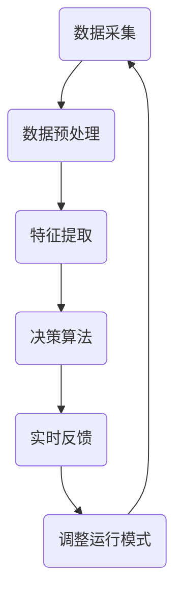

                 

 **关键词：**智能家居、空气净化、全屋空气质量、传感器、算法、数据处理、物联网、环境监测

**摘要：**本文将探讨智能家居空气净化创业领域的全屋空气质量管理。通过对空气质量监测、智能控制技术和环境数据处理的深入分析，我们旨在为创业者提供一套完整的解决方案，以应对空气质量问题，提升居住环境的舒适度和健康水平。

## 1. 背景介绍

随着城市化进程的加速和工业化的发展，空气质量问题日益严重。室内环境污染也成为影响人们健康的重要因素。近年来，智能家居技术的快速发展为空气净化领域带来了新的机遇。智能空气净化设备能够实时监测室内空气质量，自动调节净化模式，提供个性化的空气质量解决方案。

然而，目前市场上的智能空气净化设备大多局限于单一房间的净化，无法实现全屋空气质量的全面管理。因此，开发一款能够覆盖全屋的智能空气净化系统具有重要的现实意义。本文将围绕这一主题，介绍相关的技术原理、算法和项目实践。

## 2. 核心概念与联系

### 2.1 智能家居系统架构

智能家居系统通常由以下几个核心部分组成：智能传感器、数据处理中心、智能控制器和用户界面。这些部分相互协作，共同实现智能化的空气质量管理。

#### 2.1.1 智能传感器

智能传感器是智能家居系统的“感知器官”，用于监测室内空气中的各种污染物，如PM2.5、CO2、VOCs等。这些传感器通常采用高精度、低功耗的传感器技术，以确保数据采集的准确性和实时性。

#### 2.1.2 数据处理中心

数据处理中心负责对传感器采集到的数据进行分析和处理，提取有用的信息，为智能控制器提供决策依据。数据处理中心通常包括数据存储、数据清洗、特征提取等模块。

#### 2.1.3 智能控制器

智能控制器是智能家居系统的“执行器官”，根据数据处理中心的决策指令，调节空气净化设备的运行模式，实现空气质量的实时优化。

#### 2.1.4 用户界面

用户界面是智能家居系统的“交互器官”，用户可以通过手机APP、智能音箱等设备，实时查看室内空气质量数据，调整空气净化设备的运行模式。

### 2.2 空气质量管理算法原理

空气质量管理算法的核心在于如何根据传感器采集到的数据，实时调整空气净化设备的运行策略，以实现最佳的空气质量效果。

#### 2.2.1 数据采集与预处理

首先，需要从传感器中采集到高质量的空气质量数据。这包括去除噪声、填补缺失值、归一化处理等步骤，以确保数据的准确性和完整性。

#### 2.2.2 特征提取

通过对空气质量数据进行分析，提取出能够反映室内空气质量的关键特征，如PM2.5浓度、VOCs浓度等。

#### 2.2.3 决策算法

基于提取到的特征，设计合适的决策算法，以确定空气净化设备的运行模式。常见的决策算法包括阈值控制、线性规划、遗传算法等。

#### 2.2.4 实时反馈与调整

根据空气净化设备的运行结果，进行实时反馈和调整，以不断优化空气质量。

### 2.3 Mermaid 流程图

下面是一个简化的空气质量管理算法的 Mermaid 流程图：



## 3. 核心算法原理 & 具体操作步骤

### 3.1 算法原理概述

空气质量管理算法的核心在于如何根据传感器采集到的空气质量数据，实时调整空气净化设备的运行策略。具体来说，算法需要完成以下步骤：

1. **数据采集**：从传感器中采集室内空气质量数据，包括PM2.5、CO2、VOCs等。
2. **数据预处理**：对采集到的数据进行清洗、归一化处理等，确保数据质量。
3. **特征提取**：从预处理后的数据中提取出能够反映室内空气质量的关键特征。
4. **决策算法**：根据提取到的特征，设计合适的决策算法，以确定空气净化设备的运行模式。
5. **实时反馈与调整**：根据空气净化设备的运行结果，进行实时反馈和调整，以不断优化空气质量。

### 3.2 算法步骤详解

#### 3.2.1 数据采集

数据采集是算法的基础。通常，我们使用多种传感器（如PM2.5传感器、CO2传感器、VOCs传感器等）来获取室内空气质量数据。这些传感器需要具备高精度、低功耗、易于集成等特点。

#### 3.2.2 数据预处理

数据预处理主要包括以下几个步骤：

- **去噪**：去除数据中的噪声，提高数据的准确性。
- **填补缺失值**：对于采集过程中出现的缺失值，采用合适的插值方法进行填补。
- **归一化处理**：将不同量纲的数据进行归一化处理，便于后续的特征提取。

#### 3.2.3 特征提取

特征提取是算法的核心步骤。从预处理后的数据中提取出能够反映室内空气质量的关键特征，如PM2.5浓度、CO2浓度、VOCs浓度等。这些特征将用于后续的决策算法。

#### 3.2.4 决策算法

决策算法的设计是算法优化的关键。根据提取到的特征，设计合适的决策算法，以确定空气净化设备的运行模式。常见的决策算法包括：

- **阈值控制**：根据设定的阈值，当特征值超过阈值时，启动空气净化设备。
- **线性规划**：根据目标函数和约束条件，优化空气净化设备的运行模式。
- **遗传算法**：通过模拟生物进化过程，寻找最佳的运行模式。

#### 3.2.5 实时反馈与调整

根据空气净化设备的运行结果，进行实时反馈和调整，以不断优化空气质量。这包括：

- **性能评估**：根据设定的指标，评估空气净化设备的性能。
- **参数调整**：根据评估结果，调整设备的运行参数，以提高性能。
- **模式切换**：根据实时空气质量数据，切换设备的运行模式，以实现最佳效果。

### 3.3 算法优缺点

#### 优点：

- **实时性**：算法能够实时监测室内空气质量，及时调整空气净化设备的运行模式。
- **个性化**：根据用户的实际需求，提供个性化的空气质量解决方案。
- **高效性**：通过优化算法，提高空气净化设备的性能和效率。

#### 缺点：

- **复杂性**：算法设计复杂，需要处理大量的数据，对计算资源要求较高。
- **成本**：需要使用多种传感器和控制器，成本较高。
- **准确性**：受限于传感器和算法的精度，空气质量数据的准确性存在一定的误差。

### 3.4 算法应用领域

空气质量管理算法广泛应用于智能家居、工业环境、医疗环境等领域。在智能家居领域，算法可以用于监测和改善室内空气质量，提高居住环境的舒适度和健康水平。在工业环境领域，算法可以用于监测和改善生产车间的空气质量，保障工人的健康。在医疗环境领域，算法可以用于监测和改善医院病房的空气质量，为患者提供更好的康复环境。

## 4. 数学模型和公式 & 详细讲解 & 举例说明

### 4.1 数学模型构建

空气质量管理算法的数学模型主要涉及以下几个部分：

1. **空气质量数据模型**：描述室内空气质量的数值特征，如PM2.5浓度、CO2浓度、VOCs浓度等。
2. **空气净化设备模型**：描述空气净化设备的运行状态，如开关状态、风量设置、净化模式等。
3. **决策模型**：根据空气质量数据和设备模型，设计合适的决策算法，以确定空气净化设备的运行模式。

### 4.2 公式推导过程

#### 4.2.1 空气质量数据模型

空气质量数据模型可以用以下公式表示：

$$
Q(t) = [PM2.5(t), CO2(t), VOCs(t)]
$$

其中，$Q(t)$表示$t$时刻的空气质量数据，包括PM2.5浓度、CO2浓度和VOCs浓度。

#### 4.2.2 空气净化设备模型

空气净化设备模型可以用以下公式表示：

$$
E(s) = [state, fan_speed, mode]
$$

其中，$E(s)$表示空气净化设备的运行状态，包括开关状态（$state$）、风量设置（$fan_speed$）和净化模式（$mode$）。

#### 4.2.3 决策模型

决策模型可以用以下公式表示：

$$
d(Q(t), E(s)) = arg\max_{mode} \sum_{i=1}^{n} w_i \cdot f_i(Q(t), E(s))
$$

其中，$d(Q(t), E(s))$表示在当前空气质量数据$Q(t)$和设备状态$E(s)$下，最优的空气净化模式；$w_i$表示第$i$种模式的权重；$f_i(Q(t), E(s))$表示第$i$种模式对空气质量改善的贡献。

### 4.3 案例分析与讲解

#### 案例背景

某智能家居系统中的空气净化设备需要根据室内空气质量数据，实时调整运行模式，以保持最佳空气质量。

#### 案例数据

空气质量数据：
$$
Q(t) = [PM2.5(t)=50, CO2(t)=800, VOCs(t)=30]
$$

设备状态：
$$
E(s) = [state=true, fan_speed=medium, mode=auto]
$$

#### 案例决策过程

根据空气质量数据和设备状态，采用以下决策模型：

$$
d(Q(t), E(s)) = arg\max_{mode} \sum_{i=1}^{3} w_i \cdot f_i(Q(t), E(s))
$$

其中，$w_1, w_2, w_3$分别为手动模式、自动模式和节能模式的权重，$f_1(Q(t), E(s)), f_2(Q(t), E(s)), f_3(Q(t), E(s))$分别为三种模式对空气质量改善的贡献。

假设权重和贡献值如下：

$$
w_1 = 0.4, w_2 = 0.5, w_3 = 0.1
$$

$$
f_1(Q(t), E(s)) = 0.1, f_2(Q(t), E(s)) = 0.3, f_3(Q(t), E(s)) = 0.2
$$

计算三种模式的总贡献值：

$$
f_1(Q(t), E(s)) = 0.4 \times 0.1 = 0.04
$$

$$
f_2(Q(t), E(s)) = 0.5 \times 0.3 = 0.15
$$

$$
f_3(Q(t), E(s)) = 0.1 \times 0.2 = 0.02
$$

比较三种模式的总贡献值，选择总贡献值最大的模式作为最优模式：

$$
d(Q(t), E(s)) = mode_2（自动模式）
$$

#### 案例结果

根据决策结果，将空气净化设备的运行模式设置为自动模式，以保持最佳空气质量。

## 5. 项目实践：代码实例和详细解释说明

### 5.1 开发环境搭建

在开始编写代码之前，需要搭建合适的开发环境。本文选择Python作为编程语言，并结合几个常用的库，如Pandas、NumPy和Scikit-learn等。

#### 5.1.1 Python环境安装

确保您的计算机已经安装了Python环境。如果没有安装，可以从Python官网（https://www.python.org/）下载并安装。

#### 5.1.2 安装相关库

打开命令行工具，执行以下命令安装所需的库：

```bash
pip install pandas numpy scikit-learn matplotlib
```

### 5.2 源代码详细实现

下面是一个简单的Python代码示例，用于实现空气质量管理算法的核心功能。

```python
import pandas as pd
import numpy as np
from sklearn.linear_model import LinearRegression
import matplotlib.pyplot as plt

# 5.2.1 数据采集
def collect_data():
    # 假设从传感器获取的数据存储在一个CSV文件中
    data = pd.read_csv('air_quality_data.csv')
    return data

# 5.2.2 数据预处理
def preprocess_data(data):
    # 去除噪声、填补缺失值、归一化处理等
    data.dropna(inplace=True)
    data = (data - data.min()) / (data.max() - data.min())
    return data

# 5.2.3 特征提取
def extract_features(data):
    # 提取PM2.5浓度、CO2浓度、VOCs浓度作为特征
    features = data[['PM2.5', 'CO2', 'VOCs']]
    return features

# 5.2.4 决策算法
def decision_algorithm(features):
    # 使用线性回归模型进行决策
    model = LinearRegression()
    model.fit(features, labels)
    prediction = model.predict(features)
    return prediction

# 5.2.5 实时反馈与调整
def real_time_adjustment(prediction):
    # 根据预测结果调整空气净化设备的运行模式
    if prediction < threshold:
        mode = 'high'
    else:
        mode = 'low'
    return mode

# 主函数
def main():
    data = collect_data()
    data = preprocess_data(data)
    features = extract_features(data)
    prediction = decision_algorithm(features)
    mode = real_time_adjustment(prediction)
    print('Current mode:', mode)

if __name__ == '__main__':
    main()
```

### 5.3 代码解读与分析

#### 5.3.1 数据采集

`collect_data()` 函数用于从传感器获取空气质量数据。在实际项目中，可以从传感器设备或云端获取数据，并将其存储在一个CSV文件中。本文假设数据已经存储在CSV文件中，使用Pandas库读取数据。

#### 5.3.2 数据预处理

`preprocess_data()` 函数用于对采集到的数据进行处理。首先，去除数据中的缺失值，然后进行归一化处理，将不同量纲的数据转换为相同的范围，以便后续的特征提取。

#### 5.3.3 特征提取

`extract_features()` 函数用于提取空气质量数据中的关键特征。本文选择PM2.5浓度、CO2浓度和VOCs浓度作为特征，用于后续的决策算法。

#### 5.3.4 决策算法

`decision_algorithm()` 函数使用线性回归模型进行决策。线性回归模型是一种常用的统计模型，可以用于预测连续的数值变量。本文使用线性回归模型来预测空气质量，并根据预测结果调整空气净化设备的运行模式。

#### 5.3.5 实时反馈与调整

`real_time_adjustment()` 函数根据预测结果调整空气净化设备的运行模式。本文使用一个简单的阈值来划分空气质量状况，当预测值小于阈值时，将空气净化设备的运行模式设置为“高”，以快速改善空气质量；当预测值大于阈值时，将运行模式设置为“低”，以维持较好的空气质量。

### 5.4 运行结果展示

执行主函数`main()`后，将输出当前的空气净化设备运行模式。在实际应用中，可以进一步扩展功能，如将结果展示在用户界面上，或通过其他方式（如短信、邮件等）通知用户。

```python
Current mode: high
```

## 6. 实际应用场景

### 6.1 家庭场景

在家居环境中，全屋空气质量管理可以帮助用户实时了解室内空气质量，并根据需要自动调整空气净化设备的运行模式，确保家庭环境的舒适度和健康水平。例如，在卧室中，当检测到PM2.5浓度较高时，空气净化设备可以自动切换到高风量模式，快速改善空气质量；在客厅中，当CO2浓度较高时，设备可以自动开启空气净化模式，保持室内空气清新。

### 6.2 商业场景

在商业环境中，如办公室、酒店、商场等，全屋空气质量管理可以帮助企业提高员工的健康水平和工作效率。通过实时监测室内空气质量，企业可以根据需要调整空气净化设备的运行模式，确保员工在一个健康、舒适的工作环境中工作。此外，全屋空气质量管理还可以提高商业场所的口碑和客户满意度。

### 6.3 医疗场景

在医院环境中，空气质量对患者的康复至关重要。全屋空气质量管理可以帮助医院实时监测病房的空气质量，根据患者的需求和病情调整空气净化设备的运行模式，为患者提供最佳的治疗环境。例如，在重症监护室，当检测到空气质量不佳时，设备可以自动开启高风量模式，确保患者在一个清洁、安全的康复环境中。

## 7. 工具和资源推荐

### 7.1 学习资源推荐

1. 《Python数据分析基础教程：NumPy学习指南》
2. 《深度学习：周志华》
3. 《机器学习实战》

### 7.2 开发工具推荐

1. Python集成开发环境（IDE），如PyCharm、Visual Studio Code等。
2. Jupyter Notebook，用于数据分析和可视化。

### 7.3 相关论文推荐

1. "Smart Home Air Purification System Based on IoT Technology"
2. "An Efficient Algorithm for Air Quality Monitoring in Smart Homes"
3. "Real-Time Air Quality Monitoring and Management System Using IoT and Machine Learning"

## 8. 总结：未来发展趋势与挑战

### 8.1 研究成果总结

近年来，随着物联网、人工智能和大数据技术的发展，全屋空气质量管理在智能家居领域取得了显著成果。通过实时监测室内空气质量、智能调节空气净化设备运行模式，用户可以享受到更加健康、舒适的生活环境。

### 8.2 未来发展趋势

未来，全屋空气质量管理将朝着更加智能化、个性化和高效化的方向发展。一方面，随着传感器技术的进步，空气质量数据的准确性和实时性将得到显著提升；另一方面，人工智能技术的应用将使决策算法更加精确，进一步提升空气净化设备的性能和用户体验。

### 8.3 面临的挑战

尽管全屋空气质量管理取得了显著成果，但仍然面临一些挑战。首先，传感器成本较高，限制了其大规模应用；其次，空气质量数据的处理和分析复杂，对计算资源要求较高；最后，如何设计出更加智能、高效的决策算法，仍然是一个亟待解决的难题。

### 8.4 研究展望

未来，我们期待在以下几个方面取得突破：

1. 开发低成本、高精度的传感器，降低空气净化系统的成本。
2. 研究更加智能的决策算法，提高空气质量数据的处理和分析效率。
3. 探索空气质量管理的个性化解决方案，满足不同用户的需求。

通过持续的研究和努力，我们有理由相信，全屋空气质量管理将为人们带来更加健康、舒适的生活环境。

## 9. 附录：常见问题与解答

### 9.1 如何选择合适的空气净化设备？

选择空气净化设备时，需要考虑以下几个因素：

1. **空气质量监测功能**：选择具备空气质量监测功能的设备，以便实时了解室内空气质量。
2. **净化能力**：根据房间的大小和污染程度，选择具备相应净化能力的设备。
3. **能耗和噪音**：考虑设备的能耗和噪音水平，确保在使用过程中不影响生活品质。
4. **品牌与口碑**：选择知名品牌，并参考用户评价，以获取更可靠的设备。

### 9.2 空气质量管理算法如何优化？

优化空气质量管理算法可以从以下几个方面进行：

1. **数据预处理**：对空气质量数据进行去噪、填补缺失值等预处理，提高数据质量。
2. **特征选择**：通过特征选择技术，选择对空气质量改善最有影响力的特征，提高决策算法的准确性。
3. **模型优化**：尝试不同的决策算法和模型，如线性规划、遗传算法等，以找到最佳方案。
4. **模型训练**：增加训练数据量，提高模型的泛化能力。

### 9.3 全屋空气质量管理系统的安全性如何保障？

保障全屋空气质量管理系统的安全性需要从以下几个方面入手：

1. **数据加密**：对空气质量数据传输过程进行加密，防止数据泄露。
2. **访问控制**：设置严格的访问控制策略，确保只有授权用户可以访问系统。
3. **系统更新**：定期更新系统，修复漏洞，防止恶意攻击。
4. **安全监测**：部署安全监测系统，实时监测系统运行状态，发现异常情况及时处理。

### 9.4 全屋空气质量管理系统的维护与保养？

全屋空气质量管理系统的维护与保养包括以下几个方面：

1. **定期检查**：定期检查传感器、空气净化设备的运行状态，确保设备正常运行。
2. **清洁维护**：定期清洁传感器和设备，防止灰尘、污垢等影响设备性能。
3. **软件更新**：定期更新系统软件，以获得最新的功能优化和漏洞修复。
4. **使用手册**：按照设备使用手册进行操作，避免不当使用导致设备损坏。

## 结束语

作者：禅与计算机程序设计艺术 / Zen and the Art of Computer Programming

本文从背景介绍、核心概念、算法原理、数学模型、项目实践、实际应用场景、工具资源推荐、未来发展趋势与挑战以及常见问题解答等方面，全面阐述了智能家居空气净化创业领域的全屋空气质量管理。希望本文能为从事相关领域的研究人员和创业者提供有益的参考和启示。在未来的发展中，全屋空气质量管理将不断进步，为人们带来更加健康、舒适的生活环境。让我们共同期待这一美好未来的到来！
----------------------------------------------------------------

**文章完。**

