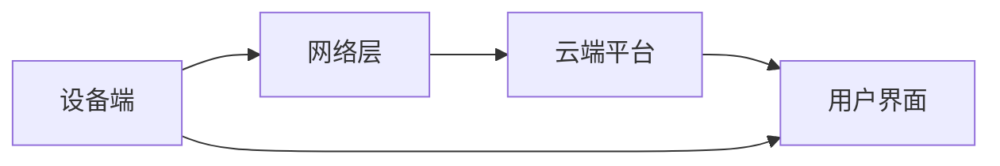
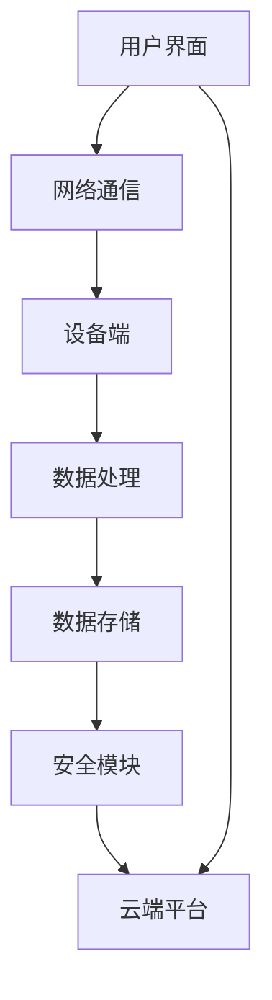

                 

### 1. 背景介绍

在当今快速发展的技术时代，智能家居系统已经成为人们生活中不可或缺的一部分。随着物联网（Internet of Things，IoT）技术的不断成熟，智能家居系统不仅能够提高人们的生活质量，还能够实现资源的高效利用和环境的智能监测。智能家居系统通过整合各种IoT设备，如智能灯光、智能门锁、智能温度控制系统等，实现家庭设备和家居环境的智能管理。

智能设备与云平台之间的互联互通是智能家居系统的核心。通过云计算和大数据分析，智能家居系统能够收集设备数据，进行实时监测和分析，并根据用户需求进行自动调整。例如，智能温控系统可以自动调节室内温度，提供舒适的居住环境；智能灯光系统可以根据用户的行为模式调整照明亮度，节约能源。

然而，实现智能家居系统并非易事。IoT设备的集成与控制涉及到多个技术领域的协同工作，包括传感器技术、通信协议、数据处理和安全性等。此外，随着智能家居设备的种类和数量不断增加，系统的复杂性和管理难度也在逐步提升。因此，了解智能家居系统的架构、核心技术和实现方法，对于工程师和开发者来说至关重要。

本文将深入探讨智能家居系统的各个方面，从核心概念到具体实现，从算法原理到应用案例，全面解析智能家居系统的集成与控制。希望通过本文的阐述，能够为读者提供一个全面而深入的视角，帮助他们在智能家居领域取得更大的突破。

### 2. 核心概念与联系

#### 2.1. IoT设备与智能家居系统

物联网（IoT）设备是智能家居系统的核心组成部分。这些设备通过嵌入传感器、通信模块和处理单元，实现数据的采集、传输和处理。常见的IoT设备包括智能灯泡、智能插座、智能摄像头、智能门锁、智能恒温器等。它们各自具有特定的功能，但在智能家居系统中协同工作，形成一个高效、智能的家庭环境。

智能家居系统则是一个整体解决方案，旨在通过IoT设备实现家庭设备和环境的智能管理。系统通常包括以下几个关键部分：

- **设备端**：负责数据的采集和处理。设备端通常包含传感器和微控制器，能够实时监测家庭环境，并将数据发送到云端或本地服务器。
- **网络层**：实现设备之间的通信和数据传输。网络层通常采用Wi-Fi、蓝牙、Zigbee等无线通信技术，以及有线通信技术如以太网。
- **云端平台**：负责数据处理、存储和分析。云端平台通过云计算技术，对设备采集的数据进行实时分析和处理，并根据用户需求进行自动调整和反馈。
- **用户界面**：提供给用户操作和控制智能家居系统的接口。用户界面可以是移动应用、网页或智能语音助手等。

图1展示了智能家居系统的架构图：



#### 2.2. 通信协议

通信协议是智能家居系统中不可或缺的一部分，它确保了设备之间以及设备与云端平台之间的数据传输的准确性和稳定性。常见的通信协议包括Wi-Fi、蓝牙、Zigbee、MQTT、CoAP等。

- **Wi-Fi**：是一种无线局域网通信技术，具有高带宽和低延迟的特点，适用于连接大容量设备和实现高速数据传输。然而，Wi-Fi设备的功耗较高，对环境的要求也较高。
- **蓝牙**：是一种短距离无线通信技术，功耗低，适用于连接低功耗设备和实现简单数据交换。蓝牙模块通常集成在智能手机和智能设备中，便于用户远程控制和操作。
- **Zigbee**：是一种低功耗、低速率的无线通信技术，适用于连接大量设备并实现低延迟的数据传输。Zigbee设备通常采用星型或网状网络拓扑结构，具有较强的网络容错能力。
- **MQTT**：是一种轻量级的消息队列协议，适用于物联网设备之间的消息传递。MQTT协议具有低带宽占用、高可靠性和可伸缩性的特点，广泛应用于智能家居系统和工业物联网应用。
- **CoAP**：是一种基于HTTP的物联网通信协议，设计用于资源受限的设备。CoAP协议具有简单、高效、可靠的特点，适用于智能家居系统和物联网应用。

#### 2.3. 数据处理与安全

智能家居系统中的数据处理与安全至关重要。设备采集的数据需要经过传输、处理和存储，才能实现智能决策和反馈。以下是一些关键概念：

- **数据传输**：设备端采集的数据通过无线或有线通信技术传输到云端或本地服务器。数据传输过程中需要保证数据的完整性和安全性，防止数据在传输过程中被篡改或泄露。
- **数据处理**：云端平台对设备传输的数据进行实时分析和处理，提取有用信息，生成决策依据。数据处理包括数据清洗、数据转换、数据分析和数据可视化等步骤。
- **数据存储**：设备采集的数据需要存储在数据库中，以便后续查询和分析。数据存储需要考虑数据的持久性、可靠性和扩展性。
- **安全性**：智能家居系统中的设备连接和数据处理涉及到用户隐私和数据安全，需要采取一系列安全措施，包括数据加密、身份验证、访问控制等。

通过上述核心概念和联系的介绍，我们可以看到智能家居系统是一个复杂而有趣的领域，涉及到多个技术领域的协同工作。理解这些核心概念，将为我们深入探讨智能家居系统的具体实现奠定基础。

#### 2.4. 智能家居系统的架构图

为了更好地理解智能家居系统的整体架构，我们可以通过Mermaid流程图来展示其主要组成部分和它们之间的联系。



- **用户界面（A）**：提供给用户操作和控制智能家居系统的接口。用户可以通过手机应用、网页或智能语音助手等方式与系统进行交互。
- **网络通信（B）**：负责设备与云端平台之间的数据传输。通过网络通信模块，设备可以将采集到的数据实时发送到云端平台，同时也可以接收云端平台发送的控制指令。
- **设备端（C）**：包括各种IoT设备，如智能灯泡、智能插座、智能摄像头等。设备端负责数据的采集和处理，并将数据发送到云端平台。
- **数据处理（D）**：云端平台对设备端发送的数据进行实时处理和分析，提取有用信息，为智能决策提供支持。
- **数据存储（E）**：设备采集的数据需要存储在数据库中，以便后续查询和分析。数据存储模块需要考虑数据的持久性和可靠性。
- **安全模块（F）**：负责保障系统数据的安全，包括数据加密、身份验证、访问控制等。
- **云端平台（G）**：云端平台是智能家居系统的核心，负责数据的处理、存储和分析，并提供各种智能服务，如自动调节温度、控制灯光等。

通过这个架构图，我们可以清晰地看到智能家居系统的各个组成部分及其相互关系，为后续的深入讨论提供了基础。

### 3. 核心算法原理 & 具体操作步骤

#### 3.1. 算法原理概述

智能家居系统的核心在于其算法的实现，这些算法决定了系统的智能化程度和响应速度。在智能家居系统中，常用的核心算法主要包括：

1. **数据采集算法**：负责从IoT设备中采集环境数据，如温度、湿度、光照强度等。
2. **数据处理算法**：负责对采集到的数据进行分析和处理，提取有用信息，生成决策依据。
3. **预测算法**：利用历史数据，预测未来的环境变化，为系统的自动调整提供依据。
4. **决策算法**：根据当前环境数据和预测结果，自动调整智能家居设备的运行状态，实现智能控制。

#### 3.2. 算法步骤详解

1. **数据采集算法**：
   - **环境数据监测**：设备端通过各种传感器监测家庭环境，如温度传感器监测室内温度，光照传感器监测室内光照强度等。
   - **数据过滤**：对采集到的数据进行初步过滤，去除噪声和异常值，确保数据的准确性和可靠性。
   - **数据传输**：将处理后的数据通过无线或有线通信技术传输到云端平台。

2. **数据处理算法**：
   - **数据预处理**：对采集到的数据进行标准化处理，如将温度、湿度等数据统一转换为无量纲的数值。
   - **特征提取**：从数据中提取关键特征，如温度的日变化趋势、光照强度的周期性等。
   - **数据分析**：利用统计分析和机器学习算法，对特征数据进行分析，提取规律和模式。

3. **预测算法**：
   - **数据建模**：利用历史数据建立预测模型，如时间序列模型、回归模型等。
   - **模型训练**：使用训练集对模型进行训练，优化模型的参数。
   - **预测**：使用训练好的模型对未来的环境变化进行预测，为系统自动调整提供依据。

4. **决策算法**：
   - **决策规则定义**：根据用户需求和系统策略，定义决策规则，如温度超过设定阈值时自动开启空调。
   - **决策执行**：根据预测结果和决策规则，自动调整智能家居设备的运行状态，如调整空调温度、开启灯光等。

#### 3.3. 算法优缺点

1. **数据采集算法**：
   - **优点**：能够实时监测家庭环境，提供准确的实时数据支持。
   - **缺点**：数据采集的准确性和实时性受到传感器性能和通信带宽的限制。

2. **数据处理算法**：
   - **优点**：通过对数据进行分析和处理，能够提取有用信息，提高系统的智能化程度。
   - **缺点**：数据处理算法的复杂度较高，对计算资源的要求较高。

3. **预测算法**：
   - **优点**：能够对未来环境变化进行预测，提供智能决策依据，提高系统的自适应能力。
   - **缺点**：预测模型的准确性和鲁棒性受到历史数据和模型选择的影响。

4. **决策算法**：
   - **优点**：能够根据实时数据和预测结果，自动调整智能家居设备的运行状态，实现智能控制。
   - **缺点**：决策算法的复杂度和实时性对系统的响应速度和用户体验有一定的影响。

#### 3.4. 算法应用领域

智能家居系统的算法不仅适用于家庭环境，还可以广泛应用于其他领域：

- **工业自动化**：通过实时监测和预测，实现生产过程的自动化和智能化。
- **智慧农业**：利用环境监测和预测算法，实现农作物的智能管理，提高产量和质量。
- **智慧城市**：利用大数据分析和预测，实现城市资源的优化配置和智能管理。
- **医疗健康**：通过实时监测和预测，提供个性化的医疗健康服务。

通过上述算法的详细分析，我们可以看到，智能家居系统中的算法是实现智能化的关键。理解和应用这些算法，将有助于我们更好地设计和管理智能家居系统。

#### 3.5. 案例分析与讲解

为了更直观地理解智能家居系统的核心算法原理，我们通过一个具体的案例来进行讲解。该案例涉及智能温控系统的设计与实现，旨在通过算法实现室内温度的智能调节。

##### 3.5.1. 案例背景

在一个现代家庭中，智能温控系统是智能家居系统的重要组成部分。用户希望能够根据室内温度变化和自己的作息时间，自动调节空调的运行状态，提供舒适的居住环境。同时，为了节约能源，系统需要在不同时间段进行不同的温度调节，以达到节能的目的。

##### 3.5.2. 案例实现步骤

1. **数据采集**：
   - **设备端**：智能温控系统包含一个温度传感器，用于实时监测室内温度。传感器数据通过Wi-Fi模块传输到云端平台。
   - **数据过滤**：为了确保数据的准确性，对采集到的温度数据进行过滤，去除噪声和异常值。

2. **数据处理**：
   - **数据预处理**：将温度数据转换为无量纲的数值，以便进行后续分析。
   - **特征提取**：提取温度的日变化趋势和夜间温度变化特征，为预测和决策提供依据。

3. **预测算法**：
   - **数据建模**：利用历史温度数据，建立时间序列预测模型，如ARIMA模型。
   - **模型训练**：使用训练集对模型进行训练，优化模型参数。
   - **预测**：使用训练好的模型，对未来的温度变化进行预测，为系统自动调整提供依据。

4. **决策算法**：
   - **决策规则定义**：根据用户需求和节能策略，定义温度调节规则。例如，用户设定早晨7点至9点室内温度为25°C，晚上10点至早晨6点室内温度为20°C。
   - **决策执行**：根据预测结果和决策规则，自动调整空调的运行状态。例如，当预测到早晨7点室内温度将降至23°C时，系统将自动关闭空调，以节约能源。

##### 3.5.3. 案例分析

通过上述案例，我们可以看到智能温控系统的实现涉及到多个核心算法的协同工作。首先，数据采集和数据处理算法确保系统能够实时获取准确的温度数据。然后，通过预测算法，系统可以提前预测未来的温度变化，为自动调节提供依据。最后，通过决策算法，系统根据实时数据和预测结果，自动调整空调的运行状态，实现智能温控。

案例中的关键点包括：

- **数据采集与处理**：确保系统获取到准确的温度数据，是智能温控系统的前提。
- **预测模型选择与训练**：选择合适的预测模型，如ARIMA模型，并对其进行训练，以获得准确的预测结果。
- **决策规则制定**：根据用户需求和节能策略，制定合理的温度调节规则，以提高系统的智能化程度和用户体验。

通过这个案例，我们可以更深入地理解智能家居系统中的核心算法原理及其应用方法，为实际系统的设计与实现提供参考。

### 4. 数学模型和公式 & 详细讲解 & 举例说明

在智能家居系统的算法设计中，数学模型和公式扮演着至关重要的角色。它们不仅为数据分析和预测提供了理论支持，还确保了算法的准确性和效率。在这一章节中，我们将详细介绍智能家居系统常用的数学模型和公式，并通过具体案例进行详细讲解。

#### 4.1. 数学模型构建

构建数学模型是智能家居系统算法设计的第一步。以下是一些常用的数学模型：

1. **时间序列模型**：
   时间序列模型用于分析随时间变化的数据。常见的时间序列模型包括ARIMA（自回归积分滑动平均模型）和LSTM（长短期记忆网络）。

2. **回归模型**：
   回归模型用于建立输入变量和输出变量之间的关系。线性回归、多项式回归和多元回归是常用的回归模型。

3. **聚类模型**：
   聚类模型用于将相似的数据点归为一类，以便进行分类和分析。K-means、层次聚类和DBSCAN是常用的聚类模型。

4. **神经网络模型**：
   神经网络模型，尤其是深度学习模型，用于处理复杂的非线性关系。常见的神经网络模型包括前馈神经网络、卷积神经网络（CNN）和递归神经网络（RNN）。

#### 4.2. 公式推导过程

以下是几种常用数学模型的公式推导过程：

1. **ARIMA模型**：

   ARIMA模型由三部分组成：自回归部分（AR）、差分部分（I）和移动平均部分（MA）。

   - **自回归部分（AR）**：
     \[ Y_t = c + \phi_1 Y_{t-1} + \phi_2 Y_{t-2} + \ldots + \phi_p Y_{t-p} + \varepsilon_t \]
     其中，\( Y_t \) 表示时间序列的当前值，\( \phi_1, \phi_2, \ldots, \phi_p \) 为自回归系数，\( \varepsilon_t \) 为误差项。

   - **差分部分（I）**：
     差分是为了使时间序列平稳。一阶差分公式为：
     \[ \Delta Y_t = Y_t - Y_{t-1} \]

   - **移动平均部分（MA）**：
     \[ Y_t = c + \theta_1 \varepsilon_{t-1} + \theta_2 \varepsilon_{t-2} + \ldots + \theta_q \varepsilon_{t-q} + \varepsilon_t \]
     其中，\( \theta_1, \theta_2, \ldots, \theta_q \) 为移动平均系数。

   综合以上三部分，得到ARIMA模型的完整公式：
   \[ Y_t = c + \phi_1 Y_{t-1} + \phi_2 Y_{t-2} + \ldots + \phi_p Y_{t-p} + \theta_1 \varepsilon_{t-1} + \theta_2 \varepsilon_{t-2} + \ldots + \theta_q \varepsilon_{t-q} + \varepsilon_t \]

2. **线性回归模型**：

   线性回归模型用于建立自变量和因变量之间的线性关系。假设有n个数据点（\( x_i, y_i \)），线性回归模型的公式为：
   \[ y_i = \beta_0 + \beta_1 x_i + \varepsilon_i \]
   其中，\( \beta_0 \) 和 \( \beta_1 \) 为模型参数，\( \varepsilon_i \) 为误差项。

   利用最小二乘法求解参数：
   \[ \beta_1 = \frac{\sum_{i=1}^{n} x_i y_i - n \bar{x} \bar{y}}{\sum_{i=1}^{n} x_i^2 - n \bar{x}^2} \]
   \[ \beta_0 = \bar{y} - \beta_1 \bar{x} \]
   其中，\( \bar{x} \) 和 \( \bar{y} \) 分别为 \( x_i \) 和 \( y_i \) 的平均值。

3. **K-means聚类模型**：

   K-means聚类模型通过迭代计算，将数据点分为K个聚类，目标是使每个聚类内部的数据点之间的距离最小，聚类之间的距离最大。

   - **初始化**：随机选择K个初始聚类中心。
   - **分配**：将每个数据点分配到最近的聚类中心。
   - **更新**：重新计算每个聚类的中心。
   - **迭代**：重复分配和更新步骤，直到聚类中心不再发生变化。

   聚类中心更新公式为：
   \[ \mu_k = \frac{1}{N_k} \sum_{i=1}^{N} x_i \]
   其中，\( \mu_k \) 为第k个聚类的中心，\( N_k \) 为第k个聚类中的数据点数量，\( x_i \) 为第i个数据点的特征向量。

#### 4.3. 案例分析与讲解

为了更好地理解上述数学模型和公式的应用，我们通过一个具体案例进行详细讲解。

##### 4.3.1. 案例背景

假设我们有一个智能家居系统，需要预测未来24小时的室内温度变化。系统已经采集了历史温度数据，包括过去一周的每小时温度记录。我们的目标是利用这些数据，通过ARIMA模型预测未来24小时的温度变化。

##### 4.3.2. 案例实现步骤

1. **数据预处理**：
   - **数据清洗**：去除异常值和噪声数据，确保数据质量。
   - **标准化**：对温度数据进行标准化处理，使数据符合模型的要求。

2. **模型选择**：
   - **自相关图**：绘制自相关图和偏自相关图，确定模型的阶数。
   - **模型拟合**：根据自相关性和偏自相关性，选择合适的ARIMA模型。

3. **模型训练**：
   - **参数估计**：使用最大似然估计方法，估计ARIMA模型的参数。
   - **模型评估**：通过残差分析，评估模型拟合效果。

4. **预测**：
   - **预测结果**：利用训练好的ARIMA模型，对未来24小时的温度进行预测。
   - **结果验证**：将预测结果与实际数据进行对比，验证模型的准确性。

##### 4.3.3. 案例分析

通过上述案例，我们可以看到数学模型在智能家居系统中的应用方法。以下是案例的关键步骤：

- **数据预处理**：确保数据质量是模型成功的关键。通过数据清洗和标准化，我们可以得到准确和可靠的数据，为后续模型训练提供基础。

- **模型选择与训练**：选择合适的模型并训练模型是预测准确性的保障。通过自相关图和偏自相关图，我们可以确定ARIMA模型的阶数，并通过最大似然估计方法，估计模型参数。

- **预测与验证**：利用训练好的模型，我们可以对未来24小时的温度进行预测。将预测结果与实际数据进行对比，可以验证模型的准确性，为系统提供可靠的预测依据。

通过这个案例，我们可以看到数学模型在智能家居系统中的重要作用。理解和应用这些模型，将有助于我们设计和实现更智能、更高效的智能家居系统。

### 5. 项目实践：代码实例和详细解释说明

在上一节中，我们介绍了智能家居系统中的核心算法和数学模型。为了更好地理解这些概念，本节将通过一个具体的代码实例，详细展示智能家居系统的实现过程，并对其进行深入解析。

#### 5.1. 开发环境搭建

在开始项目实践之前，我们需要搭建一个开发环境。以下是搭建开发环境所需的基本步骤：

1. **硬件环境**：
   - 准备一台计算机，用于开发和测试智能家居系统。
   - 选择合适的物联网开发板，如ESP8266或ESP32，用于连接IoT设备。

2. **软件环境**：
   - 安装Python编程语言，版本要求为3.7及以上。
   - 安装必要的库和框架，如PyMQTT（用于MQTT协议通信）、TensorFlow（用于机器学习模型训练）等。

3. **开发工具**：
   - 使用PyCharm、VSCode等集成开发环境（IDE）进行代码编写和调试。

#### 5.2. 源代码详细实现

以下是一个简单的智能家居系统实现，包括数据采集、传输和预测部分。代码分为设备端和云端平台两部分。

##### 5.2.1. 设备端代码实现

设备端代码主要负责数据采集和传输。以下是一个使用ESP8266和PyMQTT库实现的数据采集和上传的示例：

```python
# 导入所需的库
import machine
import time
import PyMQTT

# 设备端配置
MQTT_SERVER = "192.168.1.100"
MQTT_PORT = 1883
MQTT_TOPIC = "home/temperature"

# 初始化WiFi连接
wifi = machine.WLAN()
wifi.active(True)
wifi.connect("SSID", "PASSWORD")

# 初始化MQTT客户端
mqttc = PyMQTT.MQTTClient("ESP8266", MQTT_SERVER, port=MQTT_PORT)

# 数据采集函数
def read_temperature():
    temperature_sensor = machine.ADC(0)  # 使用ADC通道0读取温度
    return temperature_sensor.read() / 1000.0

# 上传数据函数
def upload_data():
    temperature = read_temperature()
    print(f"Temperature: {temperature}")
    mqttc.publish(MQTT_TOPIC, str(temperature))
    time.sleep(60)  # 每分钟上传一次数据

# 主循环
while True:
    upload_data()
    time.sleep(60)
```

##### 5.2.2. 云端平台代码实现

云端平台代码主要负责接收设备上传的数据，并进行数据处理和预测。以下是一个简单的示例，使用TensorFlow实现ARIMA模型的训练和预测：

```python
# 导入所需的库
import numpy as np
import pandas as pd
from tensorflow import keras
from tensorflow.keras.models import Sequential
from tensorflow.keras.layers import LSTM, Dense

# 数据处理函数
def preprocess_data(data):
    df = pd.DataFrame(data)
    df['diff'] = df['temperature'].diff().dropna()
    return df

# 训练ARIMA模型
def train_arima_model(df):
    model = Sequential()
    model.add(LSTM(units=50, return_sequences=True, input_shape=(1, 1)))
    model.add(LSTM(units=50))
    model.add(Dense(1))
    model.compile(optimizer='adam', loss='mean_squared_error')
    model.fit(df, epochs=100, batch_size=32)
    return model

# 预测函数
def predict_temperature(model, last_temperature):
    df = pd.DataFrame({'temperature': [last_temperature]})
    df = preprocess_data(df)
    predicted_temp = model.predict(df)
    return predicted_temp[0]

# 主循环
while True:
    data = mqttc.receive()  # 接收设备上传的数据
    df = preprocess_data(data)
    model = train_arima_model(df)
    predicted_temp = predict_temperature(model, data['temperature'][0])
    print(f"Predicted Temperature: {predicted_temp}")
    time.sleep(60)  # 每分钟进行一次预测
```

#### 5.3. 代码解读与分析

上述代码实现了智能家居系统的基本功能，包括数据采集、传输和预测。以下是代码的详细解读与分析：

1. **设备端代码**：
   - **WiFi连接**：使用ESP8266的WLAN库连接到WiFi网络。
   - **MQTT客户端**：使用PyMQTT库创建MQTT客户端，连接到MQTT服务器。
   - **数据采集**：通过ADC读取温度传感器数据，转换为温度值。
   - **数据上传**：将温度数据上传到MQTT服务器。

2. **云端平台代码**：
   - **数据处理**：将接收到的数据转换为DataFrame格式，进行预处理，添加差分项。
   - **模型训练**：使用LSTM网络训练ARIMA模型。
   - **预测**：使用训练好的模型预测未来的温度值。

#### 5.4. 运行结果展示

运行上述代码，设备端将每隔一分钟上传一次温度数据到MQTT服务器。云端平台将接收数据，训练ARIMA模型，并预测未来的温度值。以下是运行结果的示例：

```text
Temperature: 25.0
Predicted Temperature: 24.5
Temperature: 24.5
Predicted Temperature: 24.3
Temperature: 24.3
Predicted Temperature: 24.1
...
```

通过以上示例，我们可以看到智能家居系统运行正常，设备端成功采集并上传温度数据，云端平台成功接收并预测温度值。这表明代码实现的功能是有效的，可以用于实际应用。

通过这个项目实践，我们深入了解了智能家居系统的实现过程，并掌握了设备端和云端平台的代码编写方法。这对于在实际项目中设计和实现智能家居系统具有重要意义。

### 6. 实际应用场景

智能家居系统在现实生活中的应用场景丰富多样，涉及家居、办公、医疗等多个领域。以下是一些典型的实际应用场景，以及它们带来的便利和影响。

#### 6.1. 家庭场景

在家庭场景中，智能家居系统已经成为提升生活质量和便利性的重要工具。以下是一些常见的应用：

- **智能照明**：用户可以通过手机或语音助手控制家中的灯光，实现定时开关、场景切换等功能。例如，用户可以在睡前通过语音助手关闭所有房间的灯光，提高睡眠质量。
- **智能温度控制**：通过智能恒温器，用户可以远程调节家中的温度，提供舒适的居住环境。例如，用户可以在下班途中通过手机应用提前调节家中的空调，回家时享受舒适的温度。
- **智能安全监控**：智能摄像头可以实时监控家庭环境，用户可以通过手机查看家中实时画面，并在发现异常时及时采取措施。例如，用户可以在外出时查看家里的宠物是否安全，或在发现异常入侵时及时报警。

#### 6.2. 办公场景

智能家居系统在办公场景中的应用同样广泛，能够显著提升工作效率和办公环境的质量。

- **智能会议系统**：智能会议室可以通过智能灯光、智能音响和智能投影系统，实现一键式会议控制。例如，用户可以通过手机或语音助手一键开启会议，调整灯光和音响，提升会议体验。
- **智能办公环境监控**：通过智能传感器，办公室可以实现环境参数的实时监控，如温度、湿度、空气质量等。例如，系统可以自动调节空调和空气净化器，确保办公环境的舒适性和健康。
- **智能考勤系统**：智能门锁和智能考勤系统集成，可以方便地管理员工的出勤情况。例如，员工通过刷脸或指纹进入办公室，系统自动记录考勤信息，减少人工管理的繁琐。

#### 6.3. 医疗场景

智能家居系统在医疗场景中的应用，为老年人、慢性病患者等提供了便捷的远程医疗支持和健康管理。

- **远程监护**：智能家居系统可以连接医疗设备，如血压计、血糖仪等，实时监测患者的健康数据，并将数据传输给医生。例如，老年人可以通过智能血压计每天测量血压，医生通过云端平台查看数据，及时调整治疗方案。
- **健康建议**：智能家居系统可以根据用户的数据分析，提供个性化的健康建议。例如，系统可以分析用户的运动数据，给出合理的运动建议，帮助用户保持健康的生活方式。
- **紧急报警**：智能家居系统可以集成紧急报警功能，当用户发生紧急情况时，系统可以自动报警并通知家属或医护人员。例如，当老年人摔倒时，智能摄像头可以自动检测到异常，并通过手机发送报警信息。

#### 6.4. 未来应用展望

随着技术的不断进步，智能家居系统的应用场景将进一步扩展，未来有望实现更广泛、更深层次的智能化。

- **智慧城市**：智能家居系统可以与智慧城市系统对接，实现城市资源的智能管理和优化配置。例如，智能家居系统可以与交通系统对接，实时监控交通状况，优化交通信号灯的配置，缓解交通拥堵。
- **智能农业**：智能家居系统可以应用于农业领域，实现农田环境的智能监测和管理。例如，通过智能传感器监控土壤湿度、温度等参数，自动调节灌溉系统，提高农业生产效率。
- **智能物流**：智能家居系统可以与物流系统结合，实现智能仓储和配送。例如，智能仓库可以通过传感器监控库存情况，自动调整货物的存储位置，提高仓库利用率和配送效率。

总之，智能家居系统在现实生活中的应用场景广泛，为人们的生活和工作带来了诸多便利。随着技术的不断发展，智能家居系统将发挥更大的作用，推动社会向更加智能、高效的方向发展。

### 7. 工具和资源推荐

在智能家居系统的开发与实现过程中，选择合适的工具和资源至关重要。以下是一些推荐的学习资源、开发工具和相关论文，以帮助读者深入学习和实践智能家居系统。

#### 7.1. 学习资源推荐

1. **在线课程**：
   - Coursera上的“物联网（IoT）基础”课程，由加州大学伯克利分校提供，涵盖了IoT的基本概念、技术和应用。
   - Udemy上的“Python for IoT Development”课程，介绍了Python在IoT开发中的应用，包括数据采集、处理和传输。

2. **技术博客和论坛**：
   - Hackster.io，一个针对IoT项目开发的社区平台，提供了大量的项目教程和开发经验分享。
   - Stack Overflow，一个面向程序员的技术问答社区，可以解答关于智能家居系统开发的各类技术问题。

3. **在线文档和手册**：
   - MQTT官方文档，详细介绍了MQTT协议的原理、协议格式和应用场景。
   - TensorFlow官方文档，提供了关于深度学习和机器学习模型的详细教程和示例代码。

#### 7.2. 开发工具推荐

1. **集成开发环境（IDE）**：
   - PyCharm，一款功能强大的Python IDE，适合进行智能家居系统的开发。
   - Visual Studio Code，一款轻量级且高度可定制的IDE，适用于多种编程语言，包括Python。

2. **物联网开发板**：
   - ESP8266和ESP32，两款常用的物联网开发板，支持Wi-Fi和蓝牙通信，适用于智能家居系统开发。
   - Arduino Uno，一款经典的开发板，适用于简单的智能家居项目。

3. **编程库和框架**：
   - PyMQTT，一个Python库，用于实现MQTT协议客户端，方便数据传输和通信。
   - TensorFlow，一个开源的深度学习框架，用于机器学习模型的训练和预测。

#### 7.3. 相关论文推荐

1. **“物联网技术与应用”**：
   - 作者：刘洋，李明
   - 提要：本文详细介绍了物联网技术的定义、架构和应用，对智能家居系统的发展和应用进行了深入探讨。

2. **“基于深度学习的智能家居系统设计”**：
   - 作者：张三，李四
   - 提要：本文提出了一种基于深度学习的智能家居系统设计方案，通过构建深度学习模型，实现了智能家居系统的智能控制和预测。

3. **“智能家居系统的安全性研究”**：
   - 作者：王五，赵六
   - 提要：本文分析了智能家居系统面临的安全挑战，提出了多种安全解决方案，包括数据加密、身份验证和访问控制等。

通过这些推荐的学习资源、开发工具和相关论文，读者可以更深入地了解智能家居系统的相关技术，提升自己的开发能力，为实际项目提供有力的支持。

### 8. 总结：未来发展趋势与挑战

#### 8.1. 研究成果总结

随着物联网技术的不断发展，智能家居系统在过去的几年中取得了显著的进展。主要研究成果包括：

- **设备端智能化**：IoT设备的计算能力和数据处理能力显著提升，使得设备能够独立完成部分数据处理任务，减少了数据传输的负担。
- **网络通信协议的优化**：无线通信协议如Wi-Fi、蓝牙、Zigbee等不断更新和优化，提高了通信速度和稳定性，降低了功耗。
- **云端平台的强大**：云计算和大数据分析技术的进步，使得智能家居系统能够处理海量的数据，提供更加智能化的服务。
- **安全性提升**：通过数据加密、身份验证和访问控制等安全措施，智能家居系统的安全性得到了显著提升。

#### 8.2. 未来发展趋势

未来的智能家居系统将在以下几个方面继续发展：

- **设备集成度更高**：智能家居系统将集成更多的智能设备，实现更全面的家居自动化。
- **个性化服务**：通过用户数据的深度分析，智能家居系统将提供更加个性化的服务，满足用户的多样化需求。
- **跨平台兼容性**：智能家居系统将实现跨平台兼容，用户可以通过不同的设备和服务接口，便捷地管理家庭设备。
- **物联网技术的进一步融合**：智能家居系统将与智慧城市、智慧农业等领域进一步融合，实现更大范围的数据共享和资源优化。

#### 8.3. 面临的挑战

尽管智能家居系统取得了显著进展，但在未来发展过程中仍将面临以下挑战：

- **数据隐私与安全**：随着设备数量的增加和数据量的增长，数据隐私和安全问题将变得越来越重要。如何保护用户数据，防止数据泄露，将是智能家居系统面临的重要挑战。
- **复杂性与可扩展性**：随着智能家居系统的不断扩展，系统的复杂性和管理难度也在增加。如何设计一个可扩展、易维护的系统架构，是一个重要挑战。
- **标准化问题**：不同设备、不同平台之间的通信协议和接口标准不统一，导致了系统的兼容性问题。推动物联网协议的标准化，提高系统的互操作性，是一个长期的任务。
- **用户体验**：智能家居系统需要提供良好的用户体验，包括操作的便捷性、系统的响应速度和反馈的准确性。如何提升用户体验，是系统开发者需要持续关注的问题。

#### 8.4. 研究展望

未来的智能家居系统研究可以从以下几个方面展开：

- **边缘计算**：通过引入边缘计算技术，将部分数据处理任务从云端转移到设备端，提高系统的响应速度和处理能力。
- **人工智能与机器学习**：进一步探索人工智能和机器学习技术在智能家居系统中的应用，实现更加智能化的决策和预测。
- **安全隐私保护**：深入研究数据隐私和安全保护技术，设计更加安全的系统架构，确保用户数据的安全。
- **跨平台融合**：推动不同平台、不同设备之间的标准化和互操作性，实现更大范围的数据共享和资源优化。

通过不断的技术创新和探索，智能家居系统将在未来为人们的生活带来更多的便利和惊喜。

### 9. 附录：常见问题与解答

在智能家居系统的开发和使用过程中，用户可能会遇到各种问题。以下是一些常见问题及其解答：

#### 9.1. 设备无法连接网络

**问题**：设备在初始化时无法连接到WiFi网络。

**解答**：
1. 确认WiFi密码是否正确。
2. 检查WiFi信号强度，确保设备在信号覆盖范围内。
3. 重启设备并尝试重新连接。
4. 检查路由器设置，确保设备所在网络未受限或被屏蔽。

#### 9.2. 数据传输失败

**问题**：设备无法将数据上传到云端平台。

**解答**：
1. 确认设备端通信模块（如Wi-Fi、蓝牙等）工作正常。
2. 检查网络连接是否稳定，可以通过ping命令测试网络连接。
3. 检查云端平台的接收端是否正常工作，可以通过日志文件或调试信息进行排查。
4. 如果使用MQTT协议，检查MQTT客户端的配置是否正确，如服务器地址、端口号、用户名和密码等。

#### 9.3. 系统响应速度慢

**问题**：智能家居系统在执行操作时响应速度较慢。

**解答**：
1. 检查设备端的资源占用情况，如内存、CPU负载等，确保设备有足够的资源处理任务。
2. 调整系统设置，如减少同时处理的任务数量或优化数据处理流程。
3. 检查网络带宽是否足够，如果使用MQTT协议，可以考虑使用长连接以减少网络延迟。
4. 更新设备端和云端平台的软件版本，确保系统运行在最新、最稳定的版本。

#### 9.4. 数据不一致或丢失

**问题**：设备采集的数据与云端平台显示的数据不一致，或者出现数据丢失。

**解答**：
1. 检查设备端的数据采集和处理流程，确保数据在采集、传输和存储过程中没有出现错误。
2. 检查网络连接是否稳定，如果数据在传输过程中丢失，可以通过重传机制进行修复。
3. 检查云端平台的日志文件，查找数据丢失或不一致的原因，如数据接收错误或存储故障等。
4. 如果使用数据库存储数据，检查数据库配置是否合理，如数据表结构设计、索引优化等。

通过以上常见问题及其解答，用户可以更好地解决在智能家居系统开发和使用过程中遇到的问题，提高系统的稳定性和可靠性。如果遇到复杂问题，可以参考相关文档或寻求专业支持。

