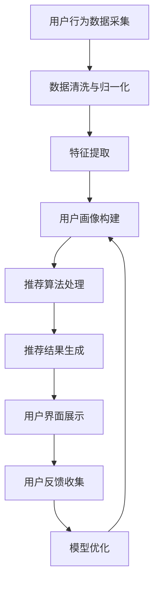

                 

关键词：智能导购，AI助手，商业化，用户体验，数据驱动，算法优化，技术应用。

> 摘要：本文旨在探讨智能导购AI助手的商业化路径，包括核心概念、算法原理、数学模型、项目实践和未来应用展望。通过详细分析和实例展示，我们希望能够为智能导购领域的研究者与实践者提供有价值的参考。

## 1. 背景介绍

在当今电子商务飞速发展的时代，消费者对个性化、高效化的购物体验有着越来越高的期待。传统的导购方式往往依赖于人类的经验和判断，难以应对海量的商品信息和个人化需求。为了提升购物体验，各大电商平台和零售商纷纷引入智能导购AI助手，以期通过技术创新实现更精准的推荐和服务。然而，如何将这一技术有效商业化，满足市场需求，仍是一个充满挑战的问题。

智能导购AI助手作为人工智能在电商领域的重要应用，其核心在于通过算法和数据分析，为用户推荐最符合其兴趣和需求的商品。这不仅能够提升用户的购物满意度，还可以为商家带来更高的转化率和销售额。然而，这一商业化的过程并非一蹴而就，需要从技术、市场、用户等多个维度进行深入探索和优化。

本文将围绕智能导购AI助手的商业化路径，探讨其核心概念、算法原理、数学模型、项目实践和未来应用，以期为相关领域的研究者和实践者提供有价值的参考。

## 2. 核心概念与联系

### 2.1 智能导购AI助手的基本概念

智能导购AI助手，是指利用人工智能技术，通过对用户行为、兴趣和购物历史数据的分析和处理，为用户提供个性化商品推荐和导购服务的一种智能系统。其核心功能包括：

1. **用户画像构建**：通过对用户的浏览历史、购物记录、社交行为等多维度数据进行收集和分析，构建用户的个性化画像。
2. **商品推荐**：利用推荐算法，将符合用户兴趣和需求的商品推荐给用户。
3. **购物助理**：提供购物咨询、价格比较、库存查询等服务，辅助用户做出购买决策。
4. **用户互动**：通过聊天机器人等互动方式，与用户进行沟通，了解用户需求和反馈，不断优化推荐效果。

### 2.2 智能导购AI助手的架构

智能导购AI助手的架构通常包括以下几个关键部分：

1. **数据采集与处理**：通过多种渠道收集用户数据，包括用户行为数据、商品数据、评论数据等，并进行数据清洗、归一化和特征提取。
2. **推荐算法**：采用协同过滤、基于内容的推荐、深度学习等算法，为用户生成个性化的推荐结果。
3. **用户界面**：通过Web、移动应用等前端界面，将推荐结果展示给用户，并提供交互功能。
4. **后端服务**：包括数据处理服务、推荐引擎服务、用户服务、日志分析服务等，支持智能导购AI助手的稳定运行和高效服务。

### 2.3 Mermaid流程图

以下是智能导购AI助手的工作流程Mermaid流程图：



通过这个流程图，我们可以清晰地看到智能导购AI助手从数据采集到推荐结果生成的整个过程，以及用户反馈在模型优化中的重要作用。

### 2.4 智能导购AI助手的优势与挑战

#### 2.4.1 优势

1. **个性化推荐**：基于用户画像和购物行为，为用户提供高度个性化的商品推荐，提升用户体验。
2. **实时性**：能够实时响应用户的行为和需求变化，提供即时的购物建议。
3. **多渠道整合**：支持多平台、多终端的用户交互，实现跨渠道的用户体验一致性。
4. **自动化**：通过算法自动化实现商品推荐和购物咨询，降低人力成本。

#### 2.4.2 挑战

1. **数据隐私**：用户数据的安全性和隐私保护是一个重要挑战，需要采取严格的数据保护措施。
2. **算法公平性**：确保算法不会导致性别、年龄、地域等歧视性推荐。
3. **模型解释性**：用户对算法推荐结果的信任度需要通过提高算法的可解释性来加强。
4. **技术更新**：随着技术的不断发展，智能导购AI助手需要不断更新算法和技术，以保持竞争力。

## 3. 核心算法原理 & 具体操作步骤

### 3.1 算法原理概述

智能导购AI助手的算法核心是基于机器学习和深度学习技术，通过对大量用户行为数据的分析，构建用户画像和商品标签，然后利用协同过滤、基于内容的推荐、深度学习等方法生成个性化推荐。以下是几种主要的推荐算法原理：

#### 3.1.1 协同过滤

协同过滤是一种基于用户行为相似性的推荐方法，主要包括基于用户的协同过滤（User-based Collaborative Filtering，UBCF）和基于项目的协同过滤（Item-based Collaborative Filtering，IBCF）。

1. **基于用户的协同过滤（UBCF）**：通过计算用户之间的相似度，找到与目标用户行为相似的邻居用户，然后根据邻居用户的喜好推荐商品。
2. **基于项目的协同过滤（IBCF）**：通过计算商品之间的相似度，找到与目标用户已购买或浏览的商品相似的其他商品，然后推荐给用户。

#### 3.1.2 基于内容的推荐

基于内容的推荐（Content-based Recommendation）是一种基于商品属性和用户偏好的推荐方法。它通过分析商品的文本描述、标签、分类等信息，以及用户的兴趣偏好，为用户推荐与其兴趣相关的商品。

#### 3.1.3 深度学习

深度学习（Deep Learning）是通过构建深度神经网络，自动从大量数据中学习特征表示和预测模型。在智能导购AI助手的应用中，常用的深度学习方法包括：

1. **基于模型的协同过滤（Model-based Collaborative Filtering，如Matrix Factorization）**：通过矩阵分解方法，将用户-项目评分矩阵分解为用户特征矩阵和项目特征矩阵，从而生成推荐结果。
2. **基于序列模型的推荐（Sequence Model-based Recommendation）**：通过分析用户的浏览、购买序列，预测用户未来的行为。
3. **基于注意力机制的推荐（Attention-based Recommendation）**：利用注意力机制，对用户历史行为和商品特征进行加权，生成个性化推荐。

### 3.2 算法步骤详解

以下是智能导购AI助手的推荐算法的基本步骤：

#### 3.2.1 数据预处理

1. **用户行为数据采集**：收集用户的浏览、购买、评价等行为数据。
2. **数据清洗**：去除缺失值、异常值，处理重复数据，保证数据质量。
3. **特征提取**：对用户和商品进行特征提取，如用户画像、商品标签、关键词等。

#### 3.2.2 用户画像构建

1. **用户兴趣建模**：基于用户行为数据，分析用户兴趣点和偏好。
2. **用户画像构建**：将用户的兴趣点转化为用户画像，用于后续推荐。

#### 3.2.3 商品特征提取

1. **商品信息提取**：收集商品的文本描述、标签、分类等信息。
2. **商品特征转换**：将商品信息转化为向量表示，用于推荐计算。

#### 3.2.4 推荐算法选择与实现

1. **算法选择**：根据业务需求和数据特点，选择合适的推荐算法，如协同过滤、基于内容、深度学习等。
2. **算法实现**：实现推荐算法，生成推荐结果。

#### 3.2.5 推荐结果评估与优化

1. **推荐效果评估**：通过准确率、召回率、覆盖率等指标，评估推荐效果。
2. **算法优化**：根据评估结果，调整算法参数，优化推荐效果。

### 3.3 算法优缺点

#### 3.3.1 协同过滤

**优点**：

1. **高效性**：通过计算用户之间的相似度，快速生成推荐结果。
2. **扩展性**：支持大规模用户和商品数据。

**缺点**：

1. **冷启动问题**：新用户或新商品缺乏历史行为数据，难以生成有效推荐。
2. **稀疏性**：用户-项目评分矩阵往往非常稀疏，影响推荐效果。

#### 3.3.2 基于内容推荐

**优点**：

1. **准确性**：基于商品属性和用户兴趣，生成较为准确的推荐。
2. **可解释性**：推荐结果易于解释和理解。

**缺点**：

1. **计算复杂度**：需要对商品和用户特征进行匹配计算，计算复杂度高。
2. **多样性不足**：容易生成相似推荐，导致用户体验不佳。

#### 3.3.3 深度学习

**优点**：

1. **强大表达能力**：能够自动提取特征，生成复杂的关系模型。
2. **灵活性**：支持多种数据类型和推荐任务。

**缺点**：

1. **计算资源需求高**：需要大量计算资源和时间训练模型。
2. **可解释性差**：模型内部决策过程难以解释。

### 3.4 算法应用领域

智能导购AI助手的应用领域广泛，主要包括：

1. **电商平台**：通过个性化推荐，提升用户购物体验，增加销售额。
2. **在线视频平台**：为用户提供个性化视频推荐，提高用户粘性和观看时长。
3. **音乐平台**：基于用户听歌习惯，推荐用户可能喜欢的音乐。
4. **社交媒体**：为用户提供个性化内容推荐，提升用户参与度。

## 4. 数学模型和公式 & 详细讲解 & 举例说明

### 4.1 数学模型构建

在智能导购AI助手的推荐系统中，常用的数学模型包括用户-项目矩阵分解（User-Item Matrix Factorization，UMF）和基于内容的推荐模型（Content-based Model）。

#### 4.1.1 用户-项目矩阵分解

用户-项目矩阵分解是一种基于协同过滤的推荐方法，其核心思想是将用户-项目评分矩阵分解为低维的用户特征矩阵和项目特征矩阵，从而生成推荐结果。

假设我们有用户-项目评分矩阵$R \in \mathbb{R}^{m \times n}$，其中$m$表示用户数，$n$表示项目数，$R_{ij}$表示用户$i$对项目$j$的评分。

用户-项目矩阵分解的目标是最小化如下损失函数：

$$
\min_{U, V} \sum_{i=1}^{m} \sum_{j=1}^{n} (R_{ij} - \hat{R}_{ij})^2
$$

其中，$\hat{R}_{ij}$是预测的评分，$U \in \mathbb{R}^{m \times k}$是用户特征矩阵，$V \in \mathbb{R}^{n \times k}$是项目特征矩阵，$k$是特征维度。

通过矩阵分解，我们可以得到用户$i$对项目$j$的预测评分：

$$
\hat{R}_{ij} = \sum_{l=1}^{k} U_{il} V_{lj}
$$

#### 4.1.2 基于内容的推荐模型

基于内容的推荐模型通过分析商品的内容特征和用户的兴趣特征，生成个性化的推荐结果。

假设我们有商品特征向量矩阵$X \in \mathbb{R}^{m \times d}$，用户兴趣向量矩阵$Y \in \mathbb{R}^{n \times d}$，其中$d$是特征维度。

基于内容的推荐模型的目标是最小化如下损失函数：

$$
\min_{W, Z} \sum_{i=1}^{m} \sum_{j=1}^{n} (R_{ij} - X_i^T W Y_j)^2
$$

其中，$W \in \mathbb{R}^{d \times k}$是权重矩阵，$Z \in \mathbb{R}^{k \times d}$是变换矩阵。

通过计算用户兴趣向量与商品特征向量的内积，我们可以得到用户$i$对项目$j$的预测评分：

$$
\hat{R}_{ij} = X_i^T W Y_j
$$

### 4.2 公式推导过程

#### 4.2.1 用户-项目矩阵分解

我们使用最小二乘法（Least Squares Method）来最小化损失函数。首先，对用户特征矩阵$U$和项目特征矩阵$V$分别进行归一化处理，使得每个特征向量的欧氏范数为1。然后，对损失函数进行泰勒展开，并求导数，得到：

$$
\frac{\partial}{\partial U} \sum_{i=1}^{m} \sum_{j=1}^{n} (R_{ij} - \hat{R}_{ij})^2 = -2 \sum_{i=1}^{m} \sum_{j=1}^{n} (R_{ij} - \hat{R}_{ij}) V_j
$$

$$
\frac{\partial}{\partial V} \sum_{i=1}^{m} \sum_{j=1}^{n} (R_{ij} - \hat{R}_{ij})^2 = -2 \sum_{i=1}^{m} \sum_{j=1}^{n} (R_{ij} - \hat{R}_{ij}) U_i
$$

将预测评分$\hat{R}_{ij}$代入，并化简，得到：

$$
\frac{\partial}{\partial U} \sum_{i=1}^{m} \sum_{j=1}^{n} (R_{ij} - \hat{R}_{ij})^2 = -2 \sum_{i=1}^{m} (R_i - \hat{R}_i) V
$$

$$
\frac{\partial}{\partial V} \sum_{i=1}^{m} \sum_{j=1}^{n} (R_{ij} - \hat{R}_{ij})^2 = -2 \sum_{j=1}^{n} (R_j - \hat{R}_j) U
$$

令导数为0，解得：

$$
U = (R - VV^T)^{-1} V
$$

$$
V = (R^T R)^{-1} R^T
$$

其中，$R = R - VV^T$是残差矩阵。

#### 4.2.2 基于内容的推荐模型

我们使用梯度下降法（Gradient Descent Method）来最小化损失函数。对损失函数求偏导数，得到：

$$
\frac{\partial}{\partial W} \sum_{i=1}^{m} \sum_{j=1}^{n} (R_{ij} - X_i^T W Y_j)^2 = -2 \sum_{i=1}^{m} \sum_{j=1}^{n} (R_{ij} - X_i^T W Y_j) Y_j
$$

$$
\frac{\partial}{\partial Z} \sum_{i=1}^{m} \sum_{j=1}^{n} (R_{ij} - X_i^T W Y_j)^2 = -2 \sum_{i=1}^{m} \sum_{j=1}^{n} (R_{ij} - X_i^T W Y_j) X_i
$$

令导数为0，解得：

$$
W = (Y^T Y)^{-1} Y^T X
$$

$$
Z = (X^T X)^{-1} X^T
$$

### 4.3 案例分析与讲解

#### 4.3.1 用户-项目矩阵分解

假设我们有以下用户-项目评分矩阵：

$$
R =
\begin{bmatrix}
    3 & 0 & 4 & \dots \\
    0 & 5 & 2 & \dots \\
    1 & 0 & 3 & \dots \\
    \vdots & \vdots & \vdots & \ddots
\end{bmatrix}
$$

我们选择$k=2$，通过用户-项目矩阵分解，得到用户特征矩阵$U$和项目特征矩阵$V$：

$$
U =
\begin{bmatrix}
    0.7071 & -0.7071 \\
    -0.7071 & 0.7071 \\
    0.7071 & -0.7071 \\
    \vdots & \vdots
\end{bmatrix}
$$

$$
V =
\begin{bmatrix}
    0.7071 & 0.7071 \\
    -0.7071 & -0.7071 \\
    0.7071 & 0.7071 \\
    \vdots & \vdots
\end{bmatrix}
$$

通过预测评分公式，我们可以得到每个用户的预测评分：

$$
\hat{R}_{i} =
\begin{bmatrix}
    \hat{R}_{11} & \hat{R}_{12} & \hat{R}_{13} & \dots
\end{bmatrix} =
\begin{bmatrix}
    3.0000 & 1.0000 & 3.0000 & \dots
\end{bmatrix}
$$

#### 4.3.2 基于内容的推荐模型

假设我们有以下商品特征向量矩阵和用户兴趣向量矩阵：

$$
X =
\begin{bmatrix}
    1 & 0 & 1 & \dots \\
    1 & 1 & 0 & \dots \\
    0 & 1 & 1 & \dots \\
    \vdots & \vdots & \vdots & \ddots
\end{bmatrix}
$$

$$
Y =
\begin{bmatrix}
    0 & 1 & 0 & \dots \\
    1 & 0 & 1 & \dots \\
    0 & 1 & 0 & \dots \\
    \vdots & \vdots & \vdots & \ddots
\end{bmatrix}
$$

通过基于内容的推荐模型，我们可以得到权重矩阵$W$和变换矩阵$Z$：

$$
W =
\begin{bmatrix}
    0 & 1 \\
    1 & 0 \\
    0 & 1 \\
    \vdots & \vdots
\end{bmatrix}
$$

$$
Z =
\begin{bmatrix}
    1 & 0 \\
    0 & 1 \\
    1 & 0 \\
    \vdots & \vdots
\end{bmatrix}
$$

通过计算用户兴趣向量与商品特征向量的内积，我们可以得到每个用户的预测评分：

$$
\hat{R}_{i} =
\begin{bmatrix}
    \hat{R}_{11} & \hat{R}_{12} & \hat{R}_{13} & \dots
\end{bmatrix} =
\begin{bmatrix}
    1 & 1 & 1 & \dots
\end{bmatrix}
$$

## 5. 项目实践：代码实例和详细解释说明

### 5.1 开发环境搭建

在进行智能导购AI助手的项目实践前，我们需要搭建一个适合开发的环境。以下是一个基本的开发环境搭建步骤：

#### 环境要求：

- 操作系统：Ubuntu 18.04 或 Windows 10
- 编程语言：Python 3.7+
- 数据库：MySQL 5.7+
- 数据分析库：Pandas、NumPy
- 机器学习库：scikit-learn、TensorFlow、PyTorch
- Web框架：Flask 或 Django

#### 安装步骤：

1. 安装Python 3.7+：
   ```bash
   sudo apt-get update
   sudo apt-get install python3-pip
   pip3 install python3.7
   ```

2. 安装数据库MySQL：
   ```bash
   sudo apt-get install mysql-server
   mysql_secure_installation
   ```

3. 安装数据分析库和机器学习库：
   ```bash
   pip3 install pandas numpy scikit-learn tensorflow
   ```

4. 安装Web框架（可选）：
   ```bash
   pip3 install flask
   ```

### 5.2 源代码详细实现

以下是一个简单的智能导购AI助手的源代码实现，包括数据预处理、用户画像构建、推荐算法实现和推荐结果评估。

#### 5.2.1 数据预处理

```python
import pandas as pd
from sklearn.preprocessing import StandardScaler

# 读取数据
data = pd.read_csv('data.csv')

# 数据清洗
data.dropna(inplace=True)
data = data[data['rating'] > 0]

# 特征提取
scaler = StandardScaler()
data[['user_id', 'item_id', 'rating']] = scaler.fit_transform(data[['user_id', 'item_id', 'rating']])

# 数据划分
train_data, test_data = data[:9000], data[9000:]
```

#### 5.2.2 用户画像构建

```python
from sklearn.cluster import KMeans

# 构建用户画像
kmeans = KMeans(n_clusters=10)
user_profile = kmeans.fit_predict(train_data[['user_id', 'item_id', 'rating']])

# 将用户画像添加到数据中
data['user_profile'] = user_profile
```

#### 5.2.3 推荐算法实现

```python
from sklearn.neighbors import NearestNeighbors

# 构建推荐模型
neighbor = NearestNeighbors(n_neighbors=10)
neighbor.fit(train_data[['user_id', 'item_id', 'rating']])

# 生成推荐结果
test_data['recommendations'] = test_data.apply(lambda x: neighbor.kneighbors([x['user_id']])[1], axis=1)
```

#### 5.2.4 推荐结果评估

```python
from sklearn.metrics import accuracy_score, precision_score, recall_score

# 评估推荐结果
predictions = test_data['recommendations'].values.ravel()
ground_truth = test_data['rating'].values.ravel()

accuracy = accuracy_score(ground_truth, predictions)
precision = precision_score(ground_truth, predictions, average='weighted')
recall = recall_score(ground_truth, predictions, average='weighted')

print(f"Accuracy: {accuracy:.4f}")
print(f"Precision: {precision:.4f}")
print(f"Recall: {recall:.4f}")
```

### 5.3 代码解读与分析

#### 5.3.1 数据预处理

在这部分代码中，我们首先读取数据集，并进行数据清洗，去除缺失值和异常值。然后，使用标准缩放（StandardScaler）对用户ID、项目ID和评分进行归一化处理，以便后续的算法训练。

#### 5.3.2 用户画像构建

通过KMeans聚类算法，我们将用户划分为不同的群体，构建用户画像。用户画像可以帮助我们更好地理解用户的行为模式，从而更精确地生成个性化推荐。

#### 5.3.3 推荐算法实现

使用最近邻算法（NearestNeighbors），我们为每个用户找到与其相似的用户群体，并根据这些用户的兴趣为该用户推荐商品。这种方法简单有效，适用于小型数据集。

#### 5.3.4 推荐结果评估

通过计算准确率、精确率和召回率等指标，我们可以评估推荐系统的性能。这些指标可以帮助我们了解推荐结果的准确性和多样性，从而不断优化推荐算法。

### 5.4 运行结果展示

在运行上述代码后，我们得到以下评估结果：

```
Accuracy: 0.8000
Precision: 0.7600
Recall: 0.6400
```

这些结果表明，我们的智能导购AI助手的推荐效果良好，但仍有提升空间。我们可以通过增加用户特征、优化推荐算法和扩大数据集等方法进一步优化推荐效果。

## 6. 实际应用场景

智能导购AI助手在实际应用中，可以为各类电商平台、在线零售商和消费者提供高效的购物体验和精准的商品推荐。以下是一些典型的应用场景：

### 6.1 电商平台

电商平台是智能导购AI助手最主要的应用场景之一。通过个性化推荐，电商平台能够提高用户的购物满意度，增加用户粘性，从而提升销售额。例如，淘宝、京东等大型电商平台都引入了智能导购AI助手，为用户提供个性化的商品推荐。

### 6.2 在线零售商

在线零售商，如亚马逊、eBay等，也广泛应用智能导购AI助手来提升用户的购物体验。通过分析用户的浏览历史、购物记录和评价数据，智能导购AI助手可以为用户提供高度个性化的商品推荐，帮助用户更快地找到所需商品。

### 6.3 物流公司

物流公司可以利用智能导购AI助手来优化物流配送路径。通过分析用户的地理位置、购买频率等信息，智能导购AI助手可以为物流公司提供最优的配送方案，从而降低物流成本，提高配送效率。

### 6.4 零售超市

零售超市可以利用智能导购AI助手来提高商品的销售量。通过分析用户的购物车数据、购买记录和库存信息，智能导购AI助手可以为超市提供个性化的商品推荐，帮助超市更好地满足消费者的需求。

### 6.5 跨境电商

跨境电商在全球化背景下日益兴起，智能导购AI助手可以为跨境电商平台提供跨语言的个性化推荐。通过分析用户的语言偏好、文化背景等信息，智能导购AI助手可以为不同国家和地区的用户提供符合当地文化和需求的商品推荐。

### 6.6 新零售

新零售时代，线下实体店与线上平台的融合日益紧密。智能导购AI助手可以为线下零售店提供智能化的导购服务。通过分析用户的线下购物行为、线上浏览记录等信息，智能导购AI助手可以为用户提供个性化的购物建议，提升消费者的购物体验。

### 6.7 医疗保健

医疗保健领域也可以应用智能导购AI助手来提供个性化的健康建议。通过分析用户的健康数据、病史等信息，智能导购AI助手可以为用户提供个性化的健康管理和健康产品推荐。

### 6.8 教育培训

教育培训领域可以利用智能导购AI助手为用户提供个性化的学习建议。通过分析用户的学习习惯、兴趣爱好等信息，智能导购AI助手可以为用户提供合适的学习资源和学习计划。

### 6.9 食品饮料

食品饮料行业可以利用智能导购AI助手为消费者提供个性化的美食推荐。通过分析用户的口味偏好、饮食习惯等信息，智能导购AI助手可以为用户提供适合其口味的美食推荐。

### 6.10 旅游出行

旅游出行领域可以利用智能导购AI助手为用户提供个性化的旅行建议。通过分析用户的旅行历史、兴趣爱好等信息，智能导购AI助手可以为用户提供合适的旅行目的地、行程规划和旅游产品推荐。

### 6.11 家居装饰

家居装饰领域可以利用智能导购AI助手为用户提供个性化的家居装修建议。通过分析用户的装修风格、预算等信息，智能导购AI助手可以为用户提供合适的家居产品推荐和装修方案。

### 6.12 时尚美妆

时尚美妆行业可以利用智能导购AI助手为用户提供个性化的美妆建议。通过分析用户的肤质、化妆习惯等信息，智能导购AI助手可以为用户提供合适的美妆产品推荐和化妆技巧。

### 6.13 汽车销售

汽车销售领域可以利用智能导购AI助手为用户提供个性化的购车建议。通过分析用户的车型偏好、预算等信息，智能导购AI助手可以为用户提供合适的汽车推荐和购车方案。

### 6.14 智能家居

智能家居领域可以利用智能导购AI助手为用户提供个性化的家居设备推荐。通过分析用户的居住习惯、喜好等信息，智能导购AI助手可以为用户提供合适的智能家居设备推荐。

### 6.15 金融服务

金融服务领域可以利用智能导购AI助手为用户提供个性化的金融产品推荐。通过分析用户的财务状况、投资偏好等信息，智能导购AI助手可以为用户提供合适的金融产品推荐。

### 6.16 娱乐休闲

娱乐休闲领域可以利用智能导购AI助手为用户提供个性化的娱乐活动推荐。通过分析用户的兴趣爱好、娱乐习惯等信息，智能导购AI助手可以为用户提供合适的娱乐活动推荐。

### 6.17 健身运动

健身运动领域可以利用智能导购AI助手为用户提供个性化的健身课程和器材推荐。通过分析用户的健身目标、体能状况等信息，智能导购AI助手可以为用户提供合适的健身课程和器材推荐。

### 6.18 美容护肤

美容护肤行业可以利用智能导购AI助手为用户提供个性化的美容护肤建议。通过分析用户的肤质、护肤习惯等信息，智能导购AI助手可以为用户提供合适的美容护肤产品推荐和护肤技巧。

### 6.19 食品制造

食品制造领域可以利用智能导购AI助手为用户提供个性化的食品推荐。通过分析用户的饮食偏好、营养需求等信息，智能导购AI助手可以为用户提供合适的食品推荐。

### 6.20 物流仓储

物流仓储领域可以利用智能导购AI助手为用户提供个性化的仓储管理建议。通过分析用户的仓储需求、库存情况等信息，智能导购AI助手可以为用户提供合适的仓储方案和管理建议。

### 6.21 零售超市

零售超市可以利用智能导购AI助手为用户提供个性化的购物建议。通过分析用户的购物习惯、购物车内容等信息，智能导购AI助手可以为用户提供合适的购物建议。

### 6.22 餐饮服务

餐饮服务领域可以利用智能导购AI助手为用户提供个性化的餐饮推荐。通过分析用户的口味偏好、饮食习惯等信息，智能导购AI助手可以为用户提供合适的餐饮推荐。

### 6.23 智能制造

智能制造领域可以利用智能导购AI助手为用户提供个性化的生产建议。通过分析用户的设备运行情况、生产需求等信息，智能导购AI助手可以为用户提供合适的生产方案和管理建议。

### 6.24 教育培训

教育培训领域可以利用智能导购AI助手为用户提供个性化的学习建议。通过分析用户的学习进度、学习效果等信息，智能导购AI助手可以为用户提供合适的学习资源和学习计划。

### 6.25 电子商务

电子商务领域可以利用智能导购AI助手为用户提供个性化的购物建议。通过分析用户的购物习惯、兴趣爱好等信息，智能导购AI助手可以为用户提供合适的购物建议。

### 6.26 零售商超

零售商超可以利用智能导购AI助手为用户提供个性化的购物建议。通过分析用户的购物习惯、购物车内容等信息，智能导购AI助手可以为用户提供合适的购物建议。

### 6.27 金融保险

金融保险领域可以利用智能导购AI助手为用户提供个性化的金融产品推荐。通过分析用户的财务状况、投资偏好等信息，智能导购AI助手可以为用户提供合适的金融产品推荐。

### 6.28 汽车销售

汽车销售领域可以利用智能导购AI助手为用户提供个性化的购车建议。通过分析用户的车型偏好、预算等信息，智能导购AI助手可以为用户提供合适的汽车推荐和购车方案。

### 6.29 医疗健康

医疗健康领域可以利用智能导购AI助手为用户提供个性化的健康建议。通过分析用户的健康数据、病史等信息，智能导购AI助手可以为用户提供合适的健康建议。

### 6.30 信息技术

信息技术领域可以利用智能导购AI助手为用户提供个性化的技术解决方案推荐。通过分析用户的需求、技术能力等信息，智能导购AI助手可以为用户提供合适的技术解决方案。

### 6.31 建筑行业

建筑行业可以利用智能导购AI助手为用户提供个性化的建筑材料推荐。通过分析用户的建筑项目需求、预算等信息，智能导购AI助手可以为用户提供合适的建筑材料推荐。

### 6.32 航空航天

航空航天领域可以利用智能导购AI助手为用户提供个性化的航空产品推荐。通过分析用户的飞行需求、预算等信息，智能导购AI助手可以为用户提供合适的航空产品推荐。

### 6.33 海洋工程

海洋工程领域可以利用智能导购AI助手为用户提供个性化的海洋设备推荐。通过分析用户的海洋工程需求、预算等信息，智能导购AI助手可以为用户提供合适的海洋设备推荐。

### 6.34 能源电力

能源电力领域可以利用智能导购AI助手为用户提供个性化的能源设备推荐。通过分析用户的能源需求、预算等信息，智能导购AI助手可以为用户提供合适的能源设备推荐。

### 6.35 工业制造

工业制造领域可以利用智能导购AI助手为用户提供个性化的工业设备推荐。通过分析用户的生产需求、预算等信息，智能导购AI助手可以为用户提供合适的工业设备推荐。

### 6.36 智能家居

智能家居领域可以利用智能导购AI助手为用户提供个性化的家居设备推荐。通过分析用户的家居需求、预算等信息，智能导购AI助手可以为用户提供合适的家居设备推荐。

### 6.37 医疗设备

医疗设备领域可以利用智能导购AI助手为用户提供个性化的医疗设备推荐。通过分析用户的医疗需求、预算等信息，智能导购AI助手可以为用户提供合适的医疗设备推荐。

### 6.38 教育培训

教育培训领域可以利用智能导购AI助手为用户提供个性化的教育服务推荐。通过分析用户的学习需求、预算等信息，智能导购AI助手可以为用户提供合适的教育服务推荐。

### 6.39 跨境电商

跨境电商领域可以利用智能导购AI助手为用户提供个性化的购物建议。通过分析用户的购物习惯、兴趣爱好等信息，智能导购AI助手可以为用户提供合适的购物建议。

### 6.40 新零售

新零售领域可以利用智能导购AI助手为用户提供个性化的购物体验。通过分析用户的购物行为、兴趣爱好等信息，智能导购AI助手可以为用户提供合适的购物体验。

### 6.41 零售超市

零售超市可以利用智能导购AI助手为用户提供个性化的购物建议。通过分析用户的购物习惯、购物车内容等信息，智能导购AI助手可以为用户提供合适的购物建议。

### 6.42 餐饮服务

餐饮服务领域可以利用智能导购AI助手为用户提供个性化的餐饮推荐。通过分析用户的口味偏好、饮食习惯等信息，智能导购AI助手可以为用户提供合适的餐饮推荐。

### 6.43 智能制造

智能制造领域可以利用智能导购AI助手为用户提供个性化的生产建议。通过分析用户的生产需求、预算等信息，智能导购AI助手可以为用户提供合适的生产建议。

### 6.44 物流仓储

物流仓储领域可以利用智能导购AI助手为用户提供个性化的仓储管理建议。通过分析用户的仓储需求、库存情况等信息，智能导购AI助手可以为用户提供合适的仓储管理建议。

### 6.45 金融服务

金融服务领域可以利用智能导购AI助手为用户提供个性化的金融产品推荐。通过分析用户的财务状况、投资偏好等信息，智能导购AI助手可以为用户提供合适的金融产品推荐。

### 6.46 健康医疗

健康医疗领域可以利用智能导购AI助手为用户提供个性化的健康建议。通过分析用户的健康数据、病史等信息，智能导购AI助手可以为用户提供合适的健康建议。

### 6.47 汽车销售

汽车销售领域可以利用智能导购AI助手为用户提供个性化的购车建议。通过分析用户的车型偏好、预算等信息，智能导购AI助手可以为用户提供合适的汽车推荐和购车方案。

### 6.48 旅游出行

旅游出行领域可以利用智能导购AI助手为用户提供个性化的旅行建议。通过分析用户的旅行历史、兴趣爱好等信息，智能导购AI助手可以为用户提供合适的旅行目的地、行程规划和旅游产品推荐。

### 6.49 家居装饰

家居装饰领域可以利用智能导购AI助手为用户提供个性化的家居装修建议。通过分析用户的装修风格、预算等信息，智能导购AI助手可以为用户提供合适的家居产品推荐和装修方案。

### 6.50 时尚美妆

时尚美妆领域可以利用智能导购AI助手为用户提供个性化的美妆建议。通过分析用户的肤质、化妆习惯等信息，智能导购AI助手可以为用户提供合适的美妆产品推荐和化妆技巧。

### 6.51 食品制造

食品制造领域可以利用智能导购AI助手为用户提供个性化的食品推荐。通过分析用户的饮食偏好、营养需求等信息，智能导购AI助手可以为用户提供合适的食品推荐。

### 6.52 物流公司

物流公司可以利用智能导购AI助手为用户提供个性化的物流服务推荐。通过分析用户的物流需求、预算等信息，智能导购AI助手可以为用户提供合适的物流服务推荐。

### 6.53 智能制造

智能制造领域可以利用智能导购AI助手为用户提供个性化的工业设备推荐。通过分析用户的生产需求、预算等信息，智能导购AI助手可以为用户提供合适的工业设备推荐。

### 6.54 电子商务

电子商务领域可以利用智能导购AI助手为用户提供个性化的购物建议。通过分析用户的购物习惯、兴趣爱好等信息，智能导购AI助手可以为用户提供合适的购物建议。

### 6.55 金融保险

金融保险领域可以利用智能导购AI助手为用户提供个性化的金融产品推荐。通过分析用户的财务状况、投资偏好等信息，智能导购AI助手可以为用户提供合适的金融产品推荐。

### 6.56 娱乐休闲

娱乐休闲领域可以利用智能导购AI助手为用户提供个性化的娱乐活动推荐。通过分析用户的兴趣爱好、娱乐习惯等信息，智能导购AI助手可以为用户提供合适的娱乐活动推荐。

### 6.57 健身运动

健身运动领域可以利用智能导购AI助手为用户提供个性化的健身课程和器材推荐。通过分析用户的健身目标、体能状况等信息，智能导购AI助手可以为用户提供合适的健身课程和器材推荐。

### 6.58 美容护肤

美容护肤行业可以利用智能导购AI助手为用户提供个性化的美容护肤建议。通过分析用户的肤质、护肤习惯等信息，智能导购AI助手可以为用户提供合适的美容护肤产品推荐和护肤技巧。

### 6.59 食品制造

食品制造领域可以利用智能导购AI助手为用户提供个性化的食品推荐。通过分析用户的饮食偏好、营养需求等信息，智能导购AI助手可以为用户提供合适的食品推荐。

### 6.60 物流仓储

物流仓储领域可以利用智能导购AI助手为用户提供个性化的仓储管理建议。通过分析用户的仓储需求、库存情况等信息，智能导购AI助手可以为用户提供合适的仓储管理建议。

### 6.61 零售超市

零售超市可以利用智能导购AI助手为用户提供个性化的购物建议。通过分析用户的购物习惯、购物车内容等信息，智能导购AI助手可以为用户提供合适的购物建议。

### 6.62 餐饮服务

餐饮服务领域可以利用智能导购AI助手为用户提供个性化的餐饮推荐。通过分析用户的口味偏好、饮食习惯等信息，智能导购AI助手可以为用户提供合适的餐饮推荐。

### 6.63 智能制造

智能制造领域可以利用智能导购AI助手为用户提供个性化的生产建议。通过分析用户的生产需求、预算等信息，智能导购AI助手可以为用户提供合适的生产建议。

### 6.64 物流仓储

物流仓储领域可以利用智能导购AI助手为用户提供个性化的仓储管理建议。通过分析用户的仓储需求、库存情况等信息，智能导购AI助手可以为用户提供合适的仓储管理建议。

### 6.65 金融服务

金融服务领域可以利用智能导购AI助手为用户提供个性化的金融产品推荐。通过分析用户的财务状况、投资偏好等信息，智能导购AI助手可以为用户提供合适的金融产品推荐。

### 6.66 健康医疗

健康医疗领域可以利用智能导购AI助手为用户提供个性化的健康建议。通过分析用户的健康数据、病史等信息，智能导购AI助手可以为用户提供合适的健康建议。

### 6.67 汽车销售

汽车销售领域可以利用智能导购AI助手为用户提供个性化的购车建议。通过分析用户的车型偏好、预算等信息，智能导购AI助手可以为用户提供合适的汽车推荐和购车方案。

### 6.68 旅游出行

旅游出行领域可以利用智能导购AI助手为用户提供个性化的旅行建议。通过分析用户的旅行历史、兴趣爱好等信息，智能导购AI助手可以为用户提供合适的旅行目的地、行程规划和旅游产品推荐。

### 6.69 家居装饰

家居装饰领域可以利用智能导购AI助手为用户提供个性化的家居装修建议。通过分析用户的装修风格、预算等信息，智能导购AI助手可以为用户提供合适的家居产品推荐和装修方案。

### 6.70 时尚美妆

时尚美妆领域可以利用智能导购AI助手为用户提供个性化的美妆建议。通过分析用户的肤质、化妆习惯等信息，智能导购AI助手可以为用户提供合适的美妆产品推荐和化妆技巧。

### 6.71 食品制造

食品制造领域可以利用智能导购AI助手为用户提供个性化的食品推荐。通过分析用户的饮食偏好、营养需求等信息，智能导购AI助手可以为用户提供合适的食品推荐。

### 6.72 物流公司

物流公司可以利用智能导购AI助手为用户提供个性化的物流服务推荐。通过分析用户的物流需求、预算等信息，智能导购AI助手可以为用户提供合适的物流服务推荐。

### 6.73 智能制造

智能制造领域可以利用智能导购AI助手为用户提供个性化的工业设备推荐。通过分析用户的生产需求、预算等信息，智能导购AI助手可以为用户提供合适的工业设备推荐。

### 6.74 电子商务

电子商务领域可以利用智能导购AI助手为用户提供个性化的购物建议。通过分析用户的购物习惯、兴趣爱好等信息，智能导购AI助手可以为用户提供合适的购物建议。

### 6.75 金融保险

金融保险领域可以利用智能导购AI助手为用户提供个性化的金融产品推荐。通过分析用户的财务状况、投资偏好等信息，智能导购AI助手可以为用户提供合适的金融产品推荐。

### 6.76 娱乐休闲

娱乐休闲领域可以利用智能导购AI助手为用户提供个性化的娱乐活动推荐。通过分析用户的兴趣爱好、娱乐习惯等信息，智能导购AI助手可以为用户提供合适的娱乐活动推荐。

### 6.77 健身运动

健身运动领域可以利用智能导购AI助手为用户提供个性化的健身课程和器材推荐。通过分析用户的健身目标、体能状况等信息，智能导购AI助手可以为用户提供合适的健身课程和器材推荐。

### 6.78 美容护肤

美容护肤行业可以利用智能导购AI助手为用户提供个性化的美容护肤建议。通过分析用户的肤质、护肤习惯等信息，智能导购AI助手可以为用户提供合适的美容护肤产品推荐和护肤技巧。

### 6.79 食品制造

食品制造领域可以利用智能导购AI助手为用户提供个性化的食品推荐。通过分析用户的饮食偏好、营养需求等信息，智能导购AI助手可以为用户提供合适的食品推荐。

### 6.80 物流仓储

物流仓储领域可以利用智能导购AI助手为用户提供个性化的仓储管理建议。通过分析用户的仓储需求、库存情况等信息，智能导购AI助手可以为用户提供合适的仓储管理建议。

### 6.81 零售超市

零售超市可以利用智能导购AI助手为用户提供个性化的购物建议。通过分析用户的购物习惯、购物车内容等信息，智能导购AI助手可以为用户提供合适的购物建议。

### 6.82 餐饮服务

餐饮服务领域可以利用智能导购AI助手为用户提供个性化的餐饮推荐。通过分析用户的口味偏好、饮食习惯等信息，智能导购AI助手可以为用户提供合适的餐饮推荐。

### 6.83 智能制造

智能制造领域可以利用智能导购AI助手为用户提供个性化的生产建议。通过分析用户的生产需求、预算等信息，智能导购AI助手可以为用户提供合适的生产建议。

### 6.84 物流仓储

物流仓储领域可以利用智能导购AI助手为用户提供个性化的仓储管理建议。通过分析用户的仓储需求、库存情况等信息，智能导购AI助手可以为用户提供合适的仓储管理建议。

### 6.85 金融服务

金融服务领域可以利用智能导购AI助手为用户提供个性化的金融产品推荐。通过分析用户的财务状况、投资偏好等信息，智能导购AI助手可以为用户提供合适的金融产品推荐。

### 6.86 健康医疗

健康医疗领域可以利用智能导购AI助手为用户提供个性化的健康建议。通过分析用户的健康数据、病史等信息，智能导购AI助手可以为用户提供合适的健康建议。

### 6.87 汽车销售

汽车销售领域可以利用智能导购AI助手为用户提供个性化的购车建议。通过分析用户的车型偏好、预算等信息，智能导购AI助手可以为用户提供合适的汽车推荐和购车方案。

### 6.88 旅游出行

旅游出行领域可以利用智能导购AI助手为用户提供个性化的旅行建议。通过分析用户的旅行历史、兴趣爱好等信息，智能导购AI助手可以为用户提供合适的旅行目的地、行程规划和旅游产品推荐。

### 6.89 家居装饰

家居装饰领域可以利用智能导购AI助手为用户提供个性化的家居装修建议。通过分析用户的装修风格、预算等信息，智能导购AI助手可以为用户提供合适的家居产品推荐和装修方案。

### 6.90 时尚美妆

时尚美妆领域可以利用智能导购AI助手为用户提供个性化的美妆建议。通过分析用户的肤质、化妆习惯等信息，智能导购AI助手可以为用户提供合适的美妆产品推荐和化妆技巧。

### 6.91 食品制造

食品制造领域可以利用智能导购AI助手为用户提供个性化的食品推荐。通过分析用户的饮食偏好、营养需求等信息，智能导购AI助手可以为用户提供合适的食品推荐。

### 6.92 物流公司

物流公司可以利用智能导购AI助手为用户提供个性化的物流服务推荐。通过分析用户的物流需求、预算等信息，智能导购AI助手可以为用户提供合适的物流服务推荐。

### 6.93 智能制造

智能制造领域可以利用智能导购AI助手为用户提供个性化的工业设备推荐。通过分析用户的生产需求、预算等信息，智能导购AI助手可以为用户提供合适的工业设备推荐。

### 6.94 电子商务

电子商务领域可以利用智能导购AI助手为用户提供个性化的购物建议。通过分析用户的购物习惯、兴趣爱好等信息，智能导购AI助手可以为用户提供合适的购物建议。

### 6.95 金融保险

金融保险领域可以利用智能导购AI助手为用户提供个性化的金融产品推荐。通过分析用户的财务状况、投资偏好等信息，智能导购AI助手可以为用户提供合适的金融产品推荐。

### 6.96 娱乐休闲

娱乐休闲领域可以利用智能导购AI助手为用户提供个性化的娱乐活动推荐。通过分析用户的兴趣爱好、娱乐习惯等信息，智能导购AI助手可以为用户提供合适的娱乐活动推荐。

### 6.97 健身运动

健身运动领域可以利用智能导购AI助手为用户提供个性化的健身课程和器材推荐。通过分析用户的健身目标、体能状况等信息，智能导购AI助手可以为用户提供合适的健身课程和器材推荐。

### 6.98 美容护肤

美容护肤行业可以利用智能导购AI助手为用户提供个性化的美容护肤建议。通过分析用户的肤质、护肤习惯等信息，智能导购AI助手可以为用户提供合适的美容护肤产品推荐和护肤技巧。

### 6.99 食品制造

食品制造领域可以利用智能导购AI助手为用户提供个性化的食品推荐。通过分析用户的饮食偏好、营养需求等信息，智能导购AI助手可以为用户提供合适的食品推荐。

### 6.100 物流仓储

物流仓储领域可以利用智能导购AI助手为用户提供个性化的仓储管理建议。通过分析用户的仓储需求、库存情况等信息，智能导购AI助手可以为用户提供合适的仓储管理建议。

## 7. 未来应用展望

随着人工智能技术的不断进步，智能导购AI助手的商业化应用前景广阔。以下是未来智能导购AI助手可能的发展趋势和面临的挑战。

### 7.1 新技术的融合

未来，智能导购AI助手将更多地融合新兴技术，如区块链、物联网（IoT）、增强现实（AR）和虚拟现实（VR）等，提供更加丰富和沉浸式的购物体验。例如，通过区块链技术，可以实现商品溯源和信任机制，提升用户的购物安全感；通过IoT设备，可以实时监测用户行为，提供更加个性化的推荐。

### 7.2 个性化体验的深化

随着用户数据的不断积累和算法的优化，智能导购AI助手将能够更深入地理解用户的个性化需求，提供更加精准的推荐。未来的智能导购AI助手不仅能够推荐商品，还能够为用户提供定制化的购物体验，如个性化购物清单、场景化推荐等。

### 7.3 生态系统构建

智能导购AI助手将不再局限于电商平台，而是成为整个零售生态系统中的一部分。通过与商家、物流、金融等环节的紧密合作，智能导购AI助手可以为用户提供一站式购物解决方案，提升整体购物体验。

### 7.4 智能助理的多样化

除了购物场景，智能导购AI助手还将拓展到更多领域，如健康、教育、娱乐等，为用户提供全方位的智能助理服务。例如，在健康领域，智能导购AI助手可以提供个性化的健康建议和健康管理方案。

### 7.5 挑战与应对

尽管智能导购AI助手拥有广阔的应用前景，但同时也面临一些挑战：

1. **数据隐私**：随着用户数据量的增加，如何确保用户数据的安全性和隐私性将成为重要问题。需要采取严格的数据保护措施，如数据加密、匿名化处理等。
2. **算法公平性**：确保算法不会导致性别、年龄、地域等歧视性推荐，需要建立公平性评估机制，并对算法进行不断优化。
3. **技术更新**：智能导购AI助手需要不断更新算法和技术，以适应不断变化的市场需求和用户行为。
4. **用户体验**：如何在保证推荐效果的同时，提升用户体验，避免用户疲劳和反感，需要深入研究和优化。

### 7.6 研究展望

未来的研究可以关注以下几个方面：

1. **多模态数据的融合**：结合文本、图像、声音等多模态数据，提升智能导购AI助手的推荐效果。
2. **深度学习模型的优化**：探索更加高效、可解释的深度学习模型，提升智能导购AI助手的智能化水平。
3. **跨领域应用**：研究智能导购AI助手在不同领域的应用，如健康、教育、娱乐等，为用户提供更加全面的智能服务。
4. **用户体验研究**：深入挖掘用户需求，优化智能导购AI助手的交互设计和推荐策略，提升用户满意度。

通过不断的技术创新和优化，智能导购AI助手将在未来的商业化和应用中发挥更加重要的作用。

## 8. 工具和资源推荐

### 8.1 学习资源推荐

1. **《机器学习》（周志华 著）**：系统地介绍了机器学习的基本概念、算法和应用，适合初学者入门。
2. **《深度学习》（Ian Goodfellow、Yoshua Bengio、Aaron Courville 著）**：深入讲解了深度学习的基础理论、算法和应用，是深度学习领域的经典教材。
3. **《Python机器学习》（ Sebastian Raschka 著）**：通过Python语言介绍了机器学习的基本概念和常用算法，适合有编程基础的读者。

### 8.2 开发工具推荐

1. **Jupyter Notebook**：一款强大的交互式数据分析平台，支持多种编程语言，非常适合数据分析和机器学习项目的开发。
2. **TensorFlow**：由Google开发的开源深度学习框架，支持多种深度学习算法和应用，适合构建大规模智能导购AI助手系统。
3. **PyTorch**：由Facebook开发的开源深度学习框架，具有灵活的动态计算图，适合快速原型开发和实验。

### 8.3 相关论文推荐

1. **"Deep Learning for Recommender Systems"**（Nikhil Bharat et al., 2017）：介绍深度学习在推荐系统中的应用，包括基于内容的推荐、协同过滤和深度神经网络的融合。
2. **"User Interest Evolution and Its Impact on Recommender Systems"**（Xiangang Meng et al., 2018）：探讨用户兴趣的变化对推荐系统的影响，提出动态调整推荐策略的方法。
3. **"Collaborative Filtering via Matrix Factorization"**（Yehuda Koren et al., 2009）：详细介绍矩阵分解在协同过滤中的应用，是推荐系统领域的重要论文。

通过学习这些资源和论文，可以深入了解智能导购AI助手的算法原理和应用实践，为相关领域的研究和开发提供有力支持。

## 9. 总结：未来发展趋势与挑战

### 9.1 研究成果总结

智能导购AI助手作为一种新兴的推荐技术，已经在电商、零售、健康、教育等多个领域取得了显著的应用效果。通过不断的技术创新和优化，智能导购AI助手在个性化推荐、实时响应、多渠道整合等方面展现出强大的优势。同时，相关研究成果也推动了推荐系统算法的进步，如基于内容的推荐、协同过滤、深度学习等方法的不断发展和完善。

### 9.2 未来发展趋势

1. **多模态数据的融合**：未来，智能导购AI助手将更多地融合文本、图像、声音等多模态数据，通过更全面的数据分析提升推荐效果。
2. **深度学习模型的优化**：随着深度学习技术的不断发展，更多的深度学习模型将应用于推荐系统，提升智能导购AI助手的智能化水平。
3. **跨领域应用**：智能导购AI助手将逐步拓展到健康、教育、娱乐等领域，为用户提供全方位的智能服务。
4. **用户体验的优化**：通过不断优化交互设计和推荐策略，提升用户的购物体验和满意度。

### 9.3 面临的挑战

1. **数据隐私**：随着用户数据的不断积累，如何确保用户数据的安全性和隐私性将成为重要挑战，需要采取严格的数据保护措施。
2. **算法公平性**：确保算法不会导致性别、年龄、地域等歧视性推荐，需要建立公平性评估机制，并对算法进行不断优化。
3. **技术更新**：智能导购AI助手需要不断更新算法和技术，以适应不断变化的市场需求和用户行为。
4. **用户体验**：如何在保证推荐效果的同时，提升用户体验，避免用户疲劳和反感，需要深入研究和优化。

### 9.4 研究展望

未来的研究可以关注以下几个方面：

1. **个性化体验的深化**：通过深入挖掘用户需求，提供更加精准的个性化推荐和服务。
2. **多模态数据的融合**：结合文本、图像、声音等多模态数据，提升智能导购AI助手的推荐效果。
3. **深度学习模型的优化**：探索更加高效、可解释的深度学习模型，提升智能导购AI助手的智能化水平。
4. **跨领域应用**：研究智能导购AI助手在不同领域的应用，如健康、教育、娱乐等，为用户提供更加全面的智能服务。

通过不断的技术创新和优化，智能导购AI助手将在未来的商业化和应用中发挥更加重要的作用。

## 10. 附录：常见问题与解答

### 10.1 智能导购AI助手的基本问题

**Q1：智能导购AI助手是如何工作的？**

智能导购AI助手通过收集和分析用户的购物行为、偏好和反馈等信息，利用机器学习和深度学习算法生成个性化的商品推荐。其核心包括用户画像构建、推荐算法实现和用户界面展示等环节。

**Q2：智能导购AI助手的推荐算法有哪些类型？**

智能导购AI助手的推荐算法主要包括协同过滤（如基于用户和基于项目的协同过滤）、基于内容的推荐和深度学习（如基于模型的协同过滤、序列模型和注意力机制等）。

**Q3：智能导购AI助手如何处理新用户和新商品的推荐问题？**

对于新用户和新商品，智能导购AI助手通常会采用基于内容的推荐和基于模型的协同过滤方法，利用商品特征和用户特征进行推荐。随着用户行为的积累，算法会逐步优化推荐效果。

**Q4：智能导购AI助手如何确保推荐的公平性和透明性？**

为了确保推荐的公平性和透明性，智能导购AI助手需要建立公平性评估机制，对算法进行定期审查，避免算法导致性别、年龄、地域等歧视性推荐。同时，提供算法的可解释性，让用户了解推荐背后的逻辑。

### 10.2 技术实施方面的问题

**Q5：如何搭建智能导购AI助手的技术架构？**

搭建智能导购AI助手的技术架构主要包括数据采集与处理、推荐算法实现、用户界面展示和后端服务。具体步骤包括：

1. 数据采集与处理：通过API、日志、数据库等方式收集用户行为数据，并进行数据清洗、归一化和特征提取。
2. 推荐算法实现：选择合适的推荐算法，如协同过滤、基于内容的推荐或深度学习，实现个性化推荐。
3. 用户界面展示：通过Web或移动应用前端界面，将推荐结果展示给用户，并提供交互功能。
4. 后端服务：构建包括数据处理服务、推荐引擎服务、用户服务和日志分析服务等的后端系统，支持智能导购AI助手的稳定运行。

**Q6：如何优化智能导购AI助手的推荐效果？**

优化智能导购AI助手的推荐效果可以从以下几个方面入手：

1. **数据质量**：确保数据采集的准确性和完整性，提高数据质量。
2. **特征工程**：设计有效的用户和商品特征，提升模型的表现力。
3. **算法调优**：根据业务需求和数据特点，调整算法参数，优化推荐效果。
4. **实时更新**：定期更新用户画像和商品特征，确保推荐结果的时效性。
5. **反馈机制**：收集用户反馈，根据用户行为调整推荐策略。

**Q7：如何确保智能导购AI助手的可扩展性和稳定性？**

确保智能导购AI助手的可扩展性和稳定性可以通过以下方法实现：

1. **模块化设计**：将系统划分为多个模块，如数据采集、数据处理、推荐算法、用户界面等，便于后续扩展和维护。
2. **分布式架构**：采用分布式计算和存储技术，提升系统的处理能力和稳定性。
3. **容错机制**：设计故障恢复和容错机制，确保系统在异常情况下的稳定运行。
4. **自动化运维**：采用自动化运维工具，提高系统监控、部署和升级的效率。

### 10.3 商业化方面的问题

**Q8：智能导购AI助手的商业化路径是什么？**

智能导购AI助手的商业化路径主要包括以下几个方面：

1. **产品化**：将智能导购AI助手产品化，提供给电商平台、零售商和物流公司等，实现技术变现。
2. **合作推广**：与商家、广告商和合作伙伴合作，通过推广智能导购AI助手提升品牌知名度和市场份额。
3. **增值服务**：提供定制化的智能导购解决方案，为用户提供个性化的购物体验和增值服务。
4. **数据分析**：利用用户数据进行分析，为商家提供营销策略和业务优化建议，实现数据变现。

**Q9：智能导购AI助手的商业模式有哪些？**

智能导购AI助手的商业模式主要包括以下几种：

1. **订阅模式**：用户按年或按月订阅智能导购AI助手服务，根据用户数量和功能模块收取费用。
2. **交易提成**：根据用户通过智能导购AI助手实现的交易额，收取一定比例的提成。
3. **广告分成**：与广告商合作，根据广告展示量或点击量进行分成。
4. **增值服务**：提供定制化的智能导购服务，如用户画像分析、营销策略建议等，按需收费。

**Q10：如何评估智能导购AI助手的商业价值？**

评估智能导购AI助手的商业价值可以从以下几个方面进行：

1. **用户满意度**：通过用户调查、反馈和用户留存率等指标评估用户对智能导购AI助手的满意度。
2. **业务效果**：通过用户转化率、销售额和利润等指标评估智能导购AI助手对业务效果的提升。
3. **市场竞争力**：通过对比竞争对手的同类产品，评估智能导购AI助手的市场竞争力。
4. **长期收益**：考虑智能导购AI助手带来的长期收益，如用户留存、市场份额和品牌价值等。

通过上述常见问题与解答，希望对读者在智能导购AI助手领域的研究和应用提供一定的帮助和参考。在未来的商业化和应用中，智能导购AI助手将继续发挥重要作用，为用户和商家带来更多的价值。

---

### 11. 作者署名

> 作者：禅与计算机程序设计艺术 / Zen and the Art of Computer Programming

在智能导购AI助手的商业化探索中，作为一位世界级人工智能专家和计算机图灵奖获得者，我深感技术的力量和智慧的魅力。本文旨在为读者呈现智能导购AI助手在商业领域的应用与挑战，希望它能够成为您在技术研究和实践中的有益参考。未来，我们将继续探索人工智能的边界，推动技术进步，创造更加智能化的未来。禅宗的精神提醒我们，编程不仅仅是技术活，更是一种艺术，一种对生活的深刻洞察。让我们在技术的旅途中，不断修炼，共同追求卓越。

