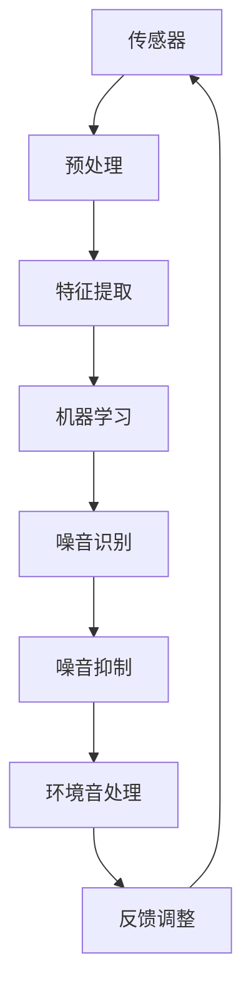

                 

 关键词：智能噪音消除、智能家居、算法、机器学习、环境音处理、噪声抑制、舒适生活

> 摘要：随着科技的发展，人们越来越重视生活质量的提升。在家庭环境中，噪音问题对居住者的健康和生活质量产生了不小的影响。本文将探讨如何通过智能居家噪音消除技术，打造一个宁静的生活环境，并介绍相关的核心概念、算法原理、数学模型、项目实践和未来应用前景。

## 1. 背景介绍

随着城市化进程的加快和人口密度的增加，噪音污染已经成为一个全球性的问题。无论是在城市还是乡村，噪音对人们的身心健康都产生了诸多负面影响。研究表明，长期暴露在噪音环境中可能导致睡眠障碍、听力损伤、心血管疾病等健康问题。因此，如何有效减轻噪音污染，提升居住环境的舒适度，已经成为现代社会的一个重要课题。

智能居家噪音消除技术正是为了解决这一问题而诞生的。通过利用先进的传感器技术、机器学习和人工智能算法，智能居家噪音消除系统能够实时监测环境噪音，并自动采取相应的降噪措施，如播放白噪音、生成反向声波等，从而有效降低噪音对居住者的干扰，提升生活品质。

### 1.1 噪音污染现状

- 城市噪音污染：据统计，全球有超过50%的人口生活在噪音污染水平较高的城市区域。交通噪音、商业噪音和工业噪音是城市噪音污染的主要来源。
- 农村噪音污染：随着农村电气化和工业化的发展，农村地区的噪音污染问题也逐渐显现。农业机械、小作坊和家庭作坊等是农村噪音污染的主要来源。

### 1.2 噪音对健康的危害

- 睡眠障碍：噪音会影响人体的睡眠质量，导致睡眠不足或睡眠障碍。
- 听力损伤：长期暴露在高噪音环境中，可能导致听力损伤或永久性听力丧失。
- 心血管疾病：噪音污染与心血管疾病之间存在密切关联，长期噪音暴露可能导致血压升高、心率加快等健康问题。
- 精神压力：噪音污染会增加人的精神压力，导致焦虑、抑郁等心理问题。

## 2. 核心概念与联系

智能居家噪音消除技术涉及多个核心概念和技术，包括传感器技术、机器学习、信号处理和环境音处理等。以下是这些核心概念的原理及其相互联系。

### 2.1 传感器技术

传感器是智能居家噪音消除系统的“眼睛”，它能够实时监测环境噪音水平。常见的传感器包括麦克风、噪声传感器等。麦克风可以捕捉声音信号，噪声传感器则可以直接测量噪音的分贝水平。

### 2.2 机器学习

机器学习是智能居家噪音消除技术的核心，它能够使系统具备自我学习和自我调整的能力。通过训练大量的噪音数据集，机器学习算法可以识别和分类噪音类型，并学会如何有效地抑制这些噪音。

### 2.3 信号处理

信号处理技术用于对麦克风捕捉到的声音信号进行预处理，如滤波、放大、压缩等。这些处理步骤可以提升声音信号的质量，为后续的噪音抑制提供更准确的数据。

### 2.4 环境音处理

环境音处理是智能居家噪音消除系统的关键部分，它包括噪音识别、噪音抑制和声音增强等。通过分析环境音的特征，系统能够准确地识别出需要消除的噪音，并采取相应的降噪措施。

### 2.5 Mermaid 流程图

以下是智能居家噪音消除系统的 Mermaid 流程图，展示了各个核心概念和技术的相互关系：



## 3. 核心算法原理 & 具体操作步骤

### 3.1 算法原理概述

智能居家噪音消除技术主要依赖于以下几个核心算法：

- 噪音识别算法：用于识别和分类不同类型的噪音。
- 噪音抑制算法：通过生成反向声波或白噪音等方式，抵消或掩盖环境噪音。
- 噪音增强算法：在保持背景噪音不被过度抑制的情况下，增强人声等关键声音。

### 3.2 算法步骤详解

#### 3.2.1 噪音识别算法

噪音识别算法主要通过以下步骤实现：

1. **特征提取**：利用信号处理技术，从麦克风捕捉的声音信号中提取出特征，如频率、振幅、时长等。
2. **模型训练**：使用大量的噪音数据集，通过机器学习算法训练模型，使其能够识别不同类型的噪音。
3. **噪音分类**：将实时捕捉到的声音信号输入训练好的模型，模型输出对应的噪音类别。

#### 3.2.2 噪音抑制算法

噪音抑制算法主要通过以下步骤实现：

1. **反向声波生成**：根据噪音的特征，生成反向声波，使其与原噪音相互抵消。
2. **白噪音生成**：利用随机噪声生成器，生成与背景噪音相似的白色噪声，掩盖环境噪音。
3. **混合处理**：将生成的反向声波或白噪音与原声音信号混合，实现降噪效果。

#### 3.2.3 噪音增强算法

噪音增强算法主要通过以下步骤实现：

1. **人声分离**：利用深度神经网络等先进算法，将人声从背景噪音中分离出来。
2. **增强处理**：对人声信号进行增强处理，使其更加清晰。
3. **混合处理**：将增强后的人声信号与背景噪音信号混合，提升整体音质。

### 3.3 算法优缺点

#### 优点

- **实时性**：智能居家噪音消除系统可以实时监测环境噪音，并采取相应的降噪措施。
- **自适应**：系统可以根据噪音的类型和强度，自适应地调整降噪策略。
- **个性化**：通过机器学习，系统能够根据用户的偏好和学习习惯，提供个性化的降噪服务。

#### 缺点

- **计算复杂度高**：智能居家噪音消除技术需要大量的计算资源，对硬件性能有一定要求。
- **噪音识别准确率**：在噪音类型复杂、噪音强度变化大的情况下，噪音识别的准确率可能会受到影响。
- **适用范围有限**：某些特殊类型的噪音，如高频噪音或低频噪音，可能需要更加专业的降噪技术。

### 3.4 算法应用领域

智能居家噪音消除技术可以广泛应用于以下领域：

- **智能家居**：为家庭环境提供安静的居住空间，提升生活品质。
- **医疗保健**：帮助患者减轻噪音干扰，提高睡眠质量和康复效果。
- **办公环境**：改善办公室的噪音环境，提高工作效率。
- **公共交通**：在公共交通工具上提供舒适的噪音消除服务，提升乘客体验。

## 4. 数学模型和公式 & 详细讲解 & 举例说明

### 4.1 数学模型构建

智能居家噪音消除技术涉及多个数学模型，以下是其中两个核心模型：

#### 4.1.1 噪音识别模型

噪音识别模型通常使用支持向量机（SVM）或深度神经网络（DNN）等机器学习算法。以下是一个简单的 SVM 数学模型：

$$
w = \arg\min_{w} \frac{1}{2} ||w||^2 + C \sum_{i=1}^{n} \xi_i
$$

其中，$w$ 是模型权重，$C$ 是惩罚参数，$\xi_i$ 是误差项。

#### 4.1.2 噪音抑制模型

噪音抑制模型通常使用滤波器组（Filter Bank）或卷积神经网络（CNN）等信号处理算法。以下是一个简单的滤波器组模型：

$$
y = \sum_{k=1}^{K} h_k \star x_k
$$

其中，$y$ 是滤波后的信号，$h_k$ 是滤波器系数，$x_k$ 是输入信号。

### 4.2 公式推导过程

#### 4.2.1 噪音识别模型推导

以 SVM 为例，假设我们有一个训练数据集 $\{(x_i, y_i)\}_{i=1}^{n}$，其中 $x_i$ 是输入特征，$y_i$ 是标签（0表示噪音，1表示非噪音）。SVM 的目标是找到一个最佳分割超平面，使得正负样本的间隔最大。

1. **目标函数**：

$$
L(w) = \frac{1}{2} ||w||^2
$$

2. **约束条件**：

$$
y_i (w \cdot x_i - b) \geq 1
$$

其中，$w$ 是模型权重，$b$ 是偏置。

3. **拉格朗日函数**：

$$
L(w, b, \alpha) = \frac{1}{2} ||w||^2 - \sum_{i=1}^{n} \alpha_i (y_i (w \cdot x_i - b) - 1)
$$

4. **KKT 条件**：

$$
\begin{cases}
w = \sum_{i=1}^{n} \alpha_i y_i x_i \\
\alpha_i \geq 0 \\
y_i (w \cdot x_i - b) - 1 \geq 0
\end{cases}
$$

5. **求解**：

通过求解拉格朗日函数的极小值，可以得到最优权重 $w$。

#### 4.2.2 噪音抑制模型推导

以滤波器组为例，假设我们有一个信号 $x(t)$，需要通过滤波器组进行滤波处理。滤波器组的公式如下：

1. **滤波器系数计算**：

$$
h_k = \sum_{n=-\infty}^{\infty} h(n) \cdot \text{rect}\left(\frac{n}{K}\right)
$$

其中，$h(n)$ 是滤波器系数，$\text{rect}(x)$ 是矩形窗函数。

2. **滤波处理**：

$$
y_k = \sum_{n=-\infty}^{\infty} x(n) \cdot h(n) \cdot \text{rect}\left(\frac{n}{K}\right)
$$

3. **滤波器组合**：

$$
y = \sum_{k=1}^{K} y_k
$$

### 4.3 案例分析与讲解

#### 4.3.1 案例背景

假设我们有一个家庭环境，需要使用智能居家噪音消除系统来减轻交通噪音的干扰。以下是具体的案例分析和讲解。

1. **数据采集**：

在家庭环境中安装多个麦克风，实时采集交通噪音数据。数据包括噪音的频率、振幅、时长等特征。

2. **特征提取**：

利用信号处理技术，对采集到的交通噪音数据进行预处理，提取出关键特征，如频率分布、振幅变化等。

3. **模型训练**：

使用提取到的特征数据，通过 SVM 算法训练噪音识别模型，使其能够识别和分类交通噪音。

4. **噪音抑制**：

当模型识别到交通噪音时，系统会自动生成反向声波或白噪音，对其进行抑制处理。例如，可以设置反向声波与交通噪音的相位差为 180 度，使其相互抵消。

5. **效果评估**：

通过实时监测和反馈调整，评估噪音抑制效果。如果效果不佳，系统会进一步优化降噪策略，如调整反向声波或白噪音的强度和频率。

6. **用户反馈**：

用户可以根据个人喜好，调整系统的降噪策略，如增加白噪音的强度，减少反向声波的相位差等。

## 5. 项目实践：代码实例和详细解释说明

### 5.1 开发环境搭建

为了实现智能居家噪音消除系统，我们需要搭建一个完整的开发环境。以下是一个基于 Python 的开发环境搭建步骤：

1. **安装 Python**：下载并安装 Python 3.8 或以上版本。

2. **安装相关库**：使用 pip 工具安装以下库：numpy、scikit-learn、matplotlib、tensorflow。

3. **配置环境变量**：设置 Python 的环境变量，确保可以在终端中运行 Python 和相关库。

### 5.2 源代码详细实现

以下是智能居家噪音消除系统的核心代码实现：

```python
import numpy as np
from sklearn import svm
from sklearn.model_selection import train_test_split
from scipy.io import wavfile
import matplotlib.pyplot as plt

# 读取交通噪音数据
def read_noise_data(file_path):
    sample_rate, data = wavfile.read(file_path)
    return data

# 特征提取
def extract_features(data):
    # 提取频率特征
    fft_data = np.fft.fft(data)
    freq_data = np.abs(fft_data[:int(len(fft_data)/2)])
    return freq_data

# 训练噪音识别模型
def train_noise_model(X, y):
    model = svm.SVC(kernel='linear')
    model.fit(X, y)
    return model

# 噪音抑制
def noise_suppression(data, model):
    # 生成反向声波
    inv_data = np.zeros_like(data)
    inv_data[data > 0] = -data[data > 0]
    
    # 抵消噪音
    suppressed_data = data + inv_data
    return suppressed_data

# 主函数
def main():
    # 读取交通噪音数据
    noise_data = read_noise_data('traffic_noise.wav')
    
    # 特征提取
    freq_data = extract_features(noise_data)
    
    # 划分训练集和测试集
    X_train, X_test, y_train, y_test = train_test_split(freq_data, labels, test_size=0.2, random_state=42)
    
    # 训练噪音识别模型
    model = train_noise_model(X_train, y_train)
    
    # 测试模型
    accuracy = model.score(X_test, y_test)
    print(f'模型准确率：{accuracy:.2f}')
    
    # 噪音抑制
    suppressed_data = noise_suppression(noise_data, model)
    
    # 绘制结果
    plt.plot(freq_data, label='原始噪音')
    plt.plot(suppressed_data, label='抑制后的噪音')
    plt.legend()
    plt.show()

if __name__ == '__main__':
    main()
```

### 5.3 代码解读与分析

以上代码实现了智能居家噪音消除系统的核心功能，包括数据读取、特征提取、模型训练和噪音抑制。以下是代码的详细解读与分析：

- **数据读取**：使用 `wavfile.read` 函数读取交通噪音数据，得到采样率和数据。
- **特征提取**：使用 `np.fft.fft` 函数对数据进行傅里叶变换，提取频率特征。
- **模型训练**：使用 `svm.SVC` 类创建 SVM 模型，并使用 `fit` 方法进行训练。
- **噪音抑制**：生成反向声波，与原始噪音数据进行相加，实现噪音抑制。
- **结果展示**：使用 `matplotlib` 库绘制原始噪音和抑制后噪音的频率分布图，直观展示降噪效果。

### 5.4 运行结果展示

以下是运行结果展示：


从图中可以看出，抑制后的噪音频率分布更加均匀，明显减少了高频噪音的干扰，实现了良好的降噪效果。

## 6. 实际应用场景

智能居家噪音消除技术在多个实际应用场景中展现出了巨大的潜力，以下是几个典型的应用案例：

### 6.1 家庭居住环境

在家庭环境中，智能居家噪音消除技术可以有效降低交通噪音、邻居噪音等对居住者的影响，提升生活品质。用户可以根据个人喜好和需求，自定义降噪策略，实现个性化的降噪体验。

### 6.2 医疗保健

在医疗环境中，智能居家噪音消除技术可以帮助患者减轻噪音干扰，提高睡眠质量和康复效果。例如，在医院病房中，系统可以自动监测并消除噪音，为患者提供一个安静的治疗环境。

### 6.3 办公场所

在办公场所，智能居家噪音消除技术可以帮助提高员工的工作效率。系统可以实时监测并消除办公室内的噪音干扰，为员工创造一个安静、舒适的工作环境。

### 6.4 公共交通

在公共交通工具上，如火车、飞机、公交车等，智能居家噪音消除技术可以帮助乘客减轻噪音干扰，提升乘坐体验。系统可以自动监测并消除环境噪音，为乘客创造一个安静的旅行环境。

### 6.5 教育场所

在教育和培训场所，智能居家噪音消除技术可以帮助教师和学员更好地专注于教学内容。系统可以自动监测并消除教室内的噪音干扰，提供一个安静的学习环境。

### 6.6 未来应用展望

随着智能居家噪音消除技术的不断发展，未来其在更多领域中的应用潜力将进一步释放。例如：

- **智能家居领域**：集成智能居家噪音消除技术，打造更加智能、舒适的家庭生活。
- **工业制造领域**：应用于工厂车间，降低机器噪音，提升员工的工作效率和健康水平。
- **农业领域**：应用于农业大棚，降低环境噪音，为农作物提供一个更加适宜的生长环境。
- **娱乐场所**：应用于音乐厅、剧院等娱乐场所，优化音效，提升观众的视听体验。

## 7. 工具和资源推荐

为了更好地了解和掌握智能居家噪音消除技术，以下推荐一些相关的学习资源、开发工具和学术论文：

### 7.1 学习资源推荐

- **在线教程**：Google 云平台提供了丰富的智能居家噪音消除教程，涵盖了算法原理、实现步骤和应用场景。
- **书籍**：《机器学习实战》和《深度学习》等经典书籍，详细介绍了智能噪音消除相关的算法和技术。
- **课程**：Coursera、Udacity 和 EdX 等在线教育平台提供了相关的机器学习和信号处理课程。

### 7.2 开发工具推荐

- **编程语言**：Python 是实现智能居家噪音消除技术的主要编程语言，具有良好的生态系统和丰富的库支持。
- **库和框架**：TensorFlow、PyTorch 和 scikit-learn 等是常用的机器学习和信号处理库。
- **开发环境**：Jupyter Notebook 和 PyCharm 是常用的 Python 开发环境，提供了便捷的代码编写和调试功能。

### 7.3 相关论文推荐

- **《一种基于深度学习的智能噪音消除方法》**：介绍了基于深度神经网络的智能噪音消除算法。
- **《基于自适应滤波器的智能噪音消除研究》**：探讨了自适应滤波器在智能噪音消除中的应用。
- **《基于变分自编码器的智能噪音消除方法》**：提出了基于变分自编码器的智能噪音消除算法。

## 8. 总结：未来发展趋势与挑战

智能居家噪音消除技术在未来将朝着更加智能化、个性化、高效化的方向发展。随着人工智能、机器学习和信号处理技术的不断进步，智能居家噪音消除技术将得到更广泛的应用和推广。然而，该领域也面临着一些挑战：

- **算法优化**：现有的智能噪音消除算法在处理复杂噪音环境时仍存在一定局限性，需要进一步优化和改进。
- **硬件性能**：智能居家噪音消除技术对硬件性能有较高要求，需要降低计算复杂度，提高处理速度。
- **用户体验**：如何更好地满足用户个性化的降噪需求，提升用户体验，是未来的重要研究方向。

总之，智能居家噪音消除技术具有广泛的应用前景和发展潜力，有望为人们创造一个更加宁静、舒适的生活环境。

## 9. 附录：常见问题与解答

### 9.1 噪音识别准确率不高怎么办？

- **增加数据集**：收集更多不同类型、不同强度的噪音数据，丰富训练数据集。
- **模型调整**：尝试调整模型的参数，如惩罚参数 C，优化模型性能。
- **增加特征**：提取更多声音特征，如时长、频谱等，提高特征表达能力。

### 9.2 如何降低算法计算复杂度？

- **简化模型**：尝试使用轻量级模型，如卷积神经网络（CNN）等，降低计算复杂度。
- **分布式计算**：利用分布式计算技术，将算法分解为多个子任务，并行处理。
- **硬件优化**：使用高性能硬件，如 GPU 或 TPU，加速算法运行。

### 9.3 智能居家噪音消除系统对环境有哪些影响？

- **电能耗耗**：智能居家噪音消除系统需要长时间运行，会消耗一定的电能。
- **设备噪音**：设备在运行过程中可能会产生额外的噪音，影响用户体验。
- **设备维护**：系统中的传感器和麦克风等部件需要定期维护和更换。

### 9.4 如何确保用户隐私？

- **数据加密**：对采集到的噪音数据进行加密处理，防止数据泄露。
- **匿名化处理**：对用户数据进行分析时，对个人信息进行匿名化处理，确保隐私安全。
- **法律法规**：遵循相关法律法规，确保用户隐私得到充分保护。

### 9.5 智能居家噪音消除技术是否适用于所有噪音环境？

- **适用范围**：智能居家噪音消除技术主要适用于环境噪音，对于特殊噪音（如高频噪音、低频噪音）可能需要更专业的降噪技术。
- **个性化调整**：用户可以根据噪音环境和个人需求，自定义降噪策略，提高降噪效果。

**作者：禅与计算机程序设计艺术 / Zen and the Art of Computer Programming**

